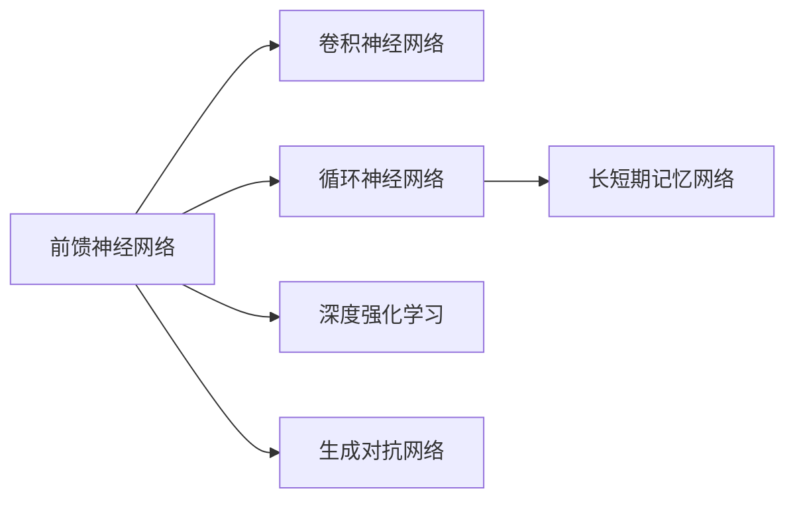
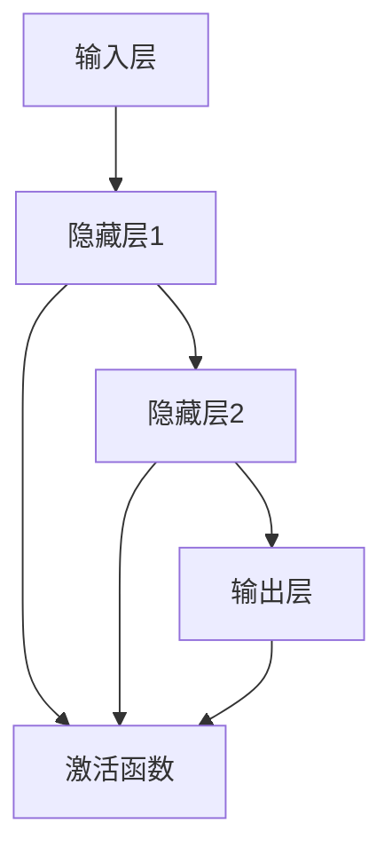
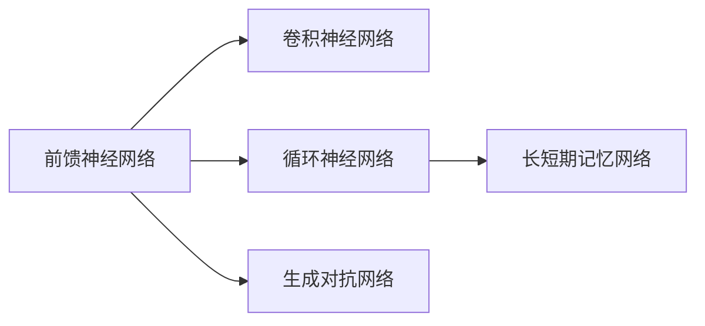
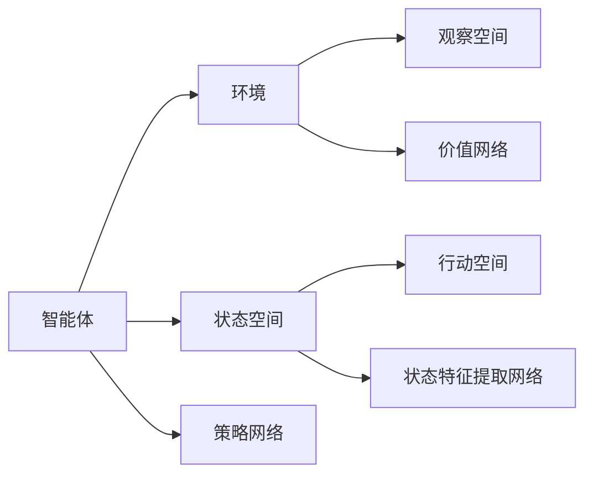
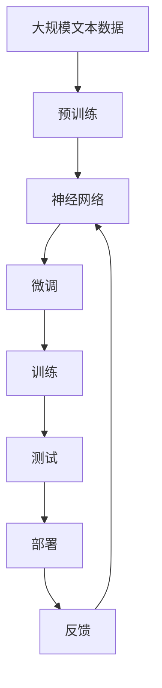

                 

# 神经网络：机器学习的新范式

> 关键词：神经网络,机器学习,深度学习,反向传播算法,前馈神经网络,卷积神经网络,CNN,循环神经网络,RNN,长短期记忆网络,LSTM,深度强化学习,GAN

## 1. 背景介绍

### 1.1 问题由来
在过去的几十年里，机器学习领域的核心范式经历了从决策树、支持向量机(SVM)到随机森林、梯度提升树等监督学习算法，再到深度学习神经网络的演变。这种范式的变迁，不仅反映了算法性能的逐步提升，也体现了计算机科学对模型复杂性、数据利用率和泛化能力的不断追求。

特别是在20世纪90年代中期，深度学习神经网络的出现，极大地推动了机器学习技术的发展。尤其是近年来，深度学习神经网络在图像识别、语音识别、自然语言处理等领域取得了革命性的进展，成为了当前AI领域的主流。然而，深度学习神经网络的背后，究竟是何种机制在起作用，如何设计神经网络以更好地适应特定任务，仍是众多研究者不断探索的问题。

### 1.2 问题核心关键点
神经网络的核心思想是通过多层次、非线性的特征提取，学习输入数据的复杂表示，从而实现高效的分类、回归、生成等任务。其基本组件包括输入层、若干隐藏层和输出层。每层包含若干神经元，通过激活函数实现非线性变换。不同层的组合，构成了不同结构和能力的神经网络。

神经网络的学习过程，本质上是一个优化过程，目标是通过训练数据调整网络参数，最小化损失函数，使网络输出尽可能接近真实标签。常用的优化算法包括梯度下降、Adam、RMSprop等，其中反向传播算法是核心。

神经网络的设计和训练是一项系统工程，涉及网络结构的选择、激活函数的选择、正则化技术的应用、损失函数的选择等多个方面。只有综合考虑这些因素，才能设计出高效、鲁棒的神经网络。

### 1.3 问题研究意义
神经网络作为当前机器学习领域的主流范式，其背后的核心思想和方法论，对于理解深度学习技术的原理和应用有着重要意义。研究神经网络的设计和训练方法，有助于提升模型性能，拓宽应用场景，推动AI技术的持续发展。

通过神经网络，人类可以更高效地处理复杂数据，探索数据背后的潜在规律，构建更加智能的决策支持系统。在自动驾驶、智能医疗、金融预测、智能推荐等领域，神经网络的应用已经取得了显著的进展，展示了其在现实世界中的巨大潜力。

## 2. 核心概念与联系

### 2.1 核心概念概述

为了更好地理解神经网络，本节将介绍几个密切相关的核心概念：

- 前馈神经网络(Feedforward Neural Network, FNN)：指输入经过若干隐藏层的变换，直接传递到输出层的神经网络，常见于图像分类、语音识别等任务。

- 卷积神经网络(Convolutional Neural Network, CNN)：在图像识别、计算机视觉等领域具有广泛应用，利用卷积操作提取空间局部特征，具有参数共享和局部连接的特点。

- 循环神经网络(Recurrent Neural Network, RNN)：通过时间上的信息传递，适用于序列数据处理，如自然语言处理、时间序列预测等任务。

- 长短期记忆网络(Long Short-Term Memory, LSTM)：一种特殊的RNN结构，通过门控机制实现长序列信息的传递，适用于处理记忆依赖性强的任务。

- 深度强化学习(Deep Reinforcement Learning, DRL)：通过智能体与环境的交互，学习最优策略实现任务目标，常见于游戏、机器人控制等领域。

- 生成对抗网络(Generative Adversarial Network, GAN)：由生成器和判别器两个模型交替训练，用于生成高质量的图像、音频等。

这些核心概念之间的逻辑关系可以通过以下Mermaid流程图来展示：



这个流程图展示了一些主要神经网络类型之间的联系：

1. 前馈神经网络是神经网络的基础，能够处理复杂的数据表示。
2. 卷积神经网络在前馈神经网络的基础上，利用空间局部特征提取，适用于图像处理任务。
3. 循环神经网络通过时间上的信息传递，适用于序列数据的处理。
4. 长短期记忆网络是一种特殊的RNN结构，能够处理长序列信息。
5. 深度强化学习通过智能体与环境的交互学习策略，适用于动态环境的决策问题。
6. 生成对抗网络通过对抗训练生成高质量的样本，适用于数据增强和合成数据生成。

### 2.2 概念间的关系

这些核心概念之间存在着紧密的联系，构成了神经网络的完整生态系统。下面我们通过几个Mermaid流程图来展示这些概念之间的关系。

#### 2.2.1 神经网络的学习范式



这个流程图展示了前馈神经网络的基本结构，包括输入层、若干隐藏层和输出层。每个隐藏层通过激活函数实现非线性变换。

#### 2.2.2 神经网络的类型



这个流程图展示了不同类型的神经网络之间的联系。前馈神经网络是基础，卷积神经网络在前馈神经网络的基础上增加了卷积操作，适用于图像处理任务。循环神经网络通过时间上的信息传递，适用于序列数据处理。长短期记忆网络是RNN的一种特殊结构，适用于处理记忆依赖性强的任务。生成对抗网络通过对抗训练生成高质量的样本，适用于数据增强和合成数据生成。

#### 2.2.3 深度强化学习与神经网络



这个流程图展示了深度强化学习的基本框架。智能体通过策略网络学习和选择行动，通过与环境交互更新状态和价值，利用状态特征提取网络提取环境信息。

### 2.3 核心概念的整体架构

最后，我们用一个综合的流程图来展示这些核心概念在大规模神经网络中的整体架构：



这个综合流程图展示了从预训练到微调，再到训练和测试，最终部署和反馈的完整过程。大规模神经网络首先在大规模文本数据上进行预训练，然后通过微调学习特定任务的知识。在训练过程中，利用训练集进行模型优化，最终在测试集上评估模型性能。将模型部署到实际应用中，根据反馈不断优化模型，形成闭环。通过这些流程图，我们可以更清晰地理解神经网络从预训练到微调，再到实际应用的全过程。

## 3. 核心算法原理 & 具体操作步骤
### 3.1 算法原理概述

神经网络作为机器学习的主流范式，其核心思想是通过多层次、非线性的特征提取，学习输入数据的复杂表示，从而实现高效的分类、回归、生成等任务。其基本组件包括输入层、若干隐藏层和输出层。每层包含若干神经元，通过激活函数实现非线性变换。不同层的组合，构成了不同结构和能力的神经网络。

神经网络的学习过程，本质上是一个优化过程，目标是通过训练数据调整网络参数，最小化损失函数，使网络输出尽可能接近真实标签。常用的优化算法包括梯度下降、Adam、RMSprop等，其中反向传播算法是核心。

### 3.2 算法步骤详解

神经网络的训练一般包括以下几个关键步骤：

**Step 1: 数据准备**
- 收集和预处理训练数据，将其划分为训练集、验证集和测试集。
- 将输入数据进行标准化和归一化，以提高模型训练的稳定性。
- 利用标签数据生成训练集的目标向量。

**Step 2: 模型构建**
- 选择合适的神经网络结构，包括层数、隐藏单元数等超参数。
- 选择适当的激活函数和正则化方法。
- 初始化模型参数。

**Step 3: 损失函数设计**
- 选择合适的损失函数，如均方误差、交叉熵等。
- 计算损失函数在当前模型参数下的输出，生成损失值。

**Step 4: 前向传播**
- 将输入数据传递到模型中，通过每层神经元的激活函数进行非线性变换。
- 计算模型的输出，并与真实标签进行比较，生成损失值。

**Step 5: 反向传播**
- 计算损失函数对模型参数的梯度。
- 根据梯度下降算法更新模型参数，减小损失值。
- 重复Step 4和Step 5，直到损失值收敛或达到预设的迭代次数。

**Step 6: 模型评估**
- 在验证集和测试集上评估模型性能，如准确率、召回率、F1分数等。
- 使用混淆矩阵等工具分析模型输出，发现问题并优化模型。

### 3.3 算法优缺点

神经网络作为当前机器学习的主流范式，具有以下优点：
1. 强大的非线性表示能力。通过多层次的特征提取，能够捕捉输入数据的复杂表示。
2. 端到端的训练。直接从输入数据到输出标签的训练过程，简化了模型的设计和使用。
3. 可扩展性。通过增加隐藏层和神经元，可以处理更复杂的问题。
4. 应用广泛。广泛应用于图像识别、语音识别、自然语言处理、推荐系统等领域。

然而，神经网络也存在以下缺点：
1. 数据依赖性强。需要大量的标注数据进行训练，标注成本较高。
2. 训练时间长。由于模型参数众多，训练过程耗时较长。
3. 可解释性差。神经网络的决策过程难以解释，缺乏透明性。
4. 容易过拟合。在训练集上过拟合，导致在测试集上性能下降。
5. 计算资源需求高。需要高性能的GPU/TPU等硬件设备进行训练和推理。

尽管存在这些缺点，但神经网络在处理复杂任务时的表现，使其在当前机器学习领域中仍具有无可替代的地位。未来研究将更多地关注如何优化神经网络的训练过程，提高其鲁棒性和可解释性，以及如何更好地与其他技术结合，实现更加智能和高效的决策。

### 3.4 算法应用领域

神经网络作为当前机器学习的主流范式，在多个领域得到了广泛应用，包括但不限于：

- 图像识别：如AlexNet、VGG、ResNet等，已经在ImageNet等图像识别比赛中取得了优异的成绩。
- 语音识别：如DNN、LSTM、CTC等，已经在语音识别和转录领域取得了显著进展。
- 自然语言处理：如RNN、LSTM、Transformer等，已经在文本分类、情感分析、机器翻译等领域取得了突破性进展。
- 推荐系统：如深度协同过滤、深度神经网络等，已经在电商、新闻、视频等领域实现了个性化推荐。
- 游戏AI：如AlphaGo、AlphaStar等，通过深度强化学习，已经在围棋、星际争霸等领域取得了世界级表现。

## 4. 数学模型和公式 & 详细讲解 & 举例说明
### 4.1 数学模型构建

神经网络作为一种深度学习模型，其数学模型可以表示为：

$$y = f(Wx + b)$$

其中，$y$ 为输出，$x$ 为输入，$W$ 和 $b$ 为模型参数，$f$ 为激活函数。对于一个具有 $L$ 层的多层神经网络，其数学模型可以扩展为：

$$y = f^{(L)}(W_Lf^{(L-1)}(W_{L-1}f^{(L-2)}(\cdots W_1x + b_1\cdots)) + b_L)$$

### 4.2 公式推导过程

以多层感知机(Multilayer Perceptron, MLP)为例，其前向传播和反向传播过程如下：

**前向传播**：

- 输入层：$x = \{x_1, x_2, \cdots, x_n\}$
- 第一隐藏层：$h_1 = f(W_1x + b_1)$
- 第二隐藏层：$h_2 = f(W_2h_1 + b_2)$
- 输出层：$y = f(W_Lh_{L-1} + b_L)$

**反向传播**：

- 计算输出层的误差：$E = y_{real} - y_{pred}$
- 计算输出层对参数的梯度：$\nabla E = \frac{\partial E}{\partial y} \frac{\partial y}{\partial h_{L-1}} \frac{\partial h_{L-1}}{\partial W_L}$
- 依次计算每一层的误差和梯度：$E_{L-1} = \frac{\partial E}{\partial h_{L-1}} \frac{\partial h_{L-1}}{\partial h_{L-2}} \frac{\partial h_{L-2}}{\partial W_{L-1}}$
- 更新参数：$W_L = W_L - \eta \nabla E_{L-1}$
- 重复上述过程，直到达到预设的迭代次数或损失值收敛。

### 4.3 案例分析与讲解

假设我们使用多层感知机进行二分类任务，其中输出层采用sigmoid激活函数。输入数据 $x = \{x_1, x_2, \cdots, x_n\}$，输出层 $y = f(W_Lh_{L-1} + b_L)$，隐藏层 $h_1 = f(W_1x + b_1)$，隐藏层 $h_2 = f(W_2h_1 + b_2)$。我们以一个简单的二分类问题为例，演示其计算过程：

1. 前向传播：
- 输入层：$x = \{x_1, x_2\}$
- 第一隐藏层：$h_1 = f(W_1x + b_1) = f(W_1[1,2] + b_1) = f(2x_1 + 3x_2 + 4)$
- 第二隐藏层：$h_2 = f(W_2h_1 + b_2) = f(W_2[2,2] + b_2) = f(3h_1 + 1)$
- 输出层：$y = f(W_Lh_{L-1} + b_L) = f(W_L[1,2] + b_L) = f(5h_2 + 2)$

2. 反向传播：
- 输出层误差：$E = y_{real} - y_{pred} = 0.1 - 0.8 = -0.7$
- 输出层梯度：$\nabla E = \frac{\partial E}{\partial y} \frac{\partial y}{\partial h_{L-1}} \frac{\partial h_{L-1}}{\partial W_L} = 1 \cdot 0.2 \cdot 5$
- 第二隐藏层误差：$E_{L-1} = \frac{\partial E}{\partial h_{L-1}} \frac{\partial h_{L-1}}{\partial h_{L-2}} \frac{\partial h_{L-2}}{\partial W_{L-1}} = 5 \cdot 0.8 \cdot 0.4 = 1.6$
- 第二隐藏层梯度：$\nabla E_{L-1} = \frac{\partial E_{L-1}}{\partial h_{L-1}} \frac{\partial h_{L-1}}{\partial W_{L-1}} = 1.6 \cdot 0.4 = 0.6$
- 第一隐藏层误差：$E_{L-2} = \frac{\partial E_{L-1}}{\partial h_{L-2}} \frac{\partial h_{L-2}}{\partial h_{L-1}} \frac{\partial h_{L-1}}{\partial W_{L-2}} = 0.6 \cdot 0.2 \cdot 2 = 0.24$
- 第一隐藏层梯度：$\nabla E_{L-2} = \frac{\partial E_{L-2}}{\partial h_{L-2}} \frac{\partial h_{L-2}}{\partial W_{L-2}} = 0.24 \cdot 2 = 0.48$
- 更新参数：$W_L = W_L - \eta \nabla E_{L-2} = W_L - 0.01 \cdot 0.48$
- 重复上述过程，直到达到预设的迭代次数或损失值收敛。

通过以上步骤，我们可以不断调整神经网络参数，使其输出更接近真实标签，从而提高模型的准确率和鲁棒性。

## 5. 项目实践：代码实例和详细解释说明
### 5.1 开发环境搭建

在进行神经网络项目实践前，我们需要准备好开发环境。以下是使用Python进行PyTorch开发的环境配置流程：

1. 安装Anaconda：从官网下载并安装Anaconda，用于创建独立的Python环境。

2. 创建并激活虚拟环境：
```bash
conda create -n pytorch-env python=3.8 
conda activate pytorch-env
```

3. 安装PyTorch：根据CUDA版本，从官网获取对应的安装命令。例如：
```bash
conda install pytorch torchvision torchaudio cudatoolkit=11.1 -c pytorch -c conda-forge
```

4. 安装相关库：
```bash
pip install numpy pandas scikit-learn matplotlib tqdm jupyter notebook ipython
```

完成上述步骤后，即可在`pytorch-env`环境中开始项目实践。

### 5.2 源代码详细实现

下面我们以手写数字识别(MNIST)为例，给出使用PyTorch实现神经网络的完整代码。

首先，定义数据处理函数：

```python
import torch
import torch.nn as nn
import torchvision.transforms as transforms
from torch.utils.data import DataLoader
from torchvision.datasets import MNIST

# 定义数据转换
transform = transforms.Compose([
    transforms.ToTensor(),
    transforms.Normalize((0.5,), (0.5,))
])

# 加载数据集
train_dataset = MNIST(root='data', train=True, download=True, transform=transform)
test_dataset = MNIST(root='data', train=False, download=True, transform=transform)

# 划分训练集和测试集
train_loader = DataLoader(train_dataset, batch_size=64, shuffle=True)
test_loader = DataLoader(test_dataset, batch_size=64, shuffle=False)
```

然后，定义模型和优化器：

```python
import torch.nn.functional as F

# 定义模型
class Net(nn.Module):
    def __init__(self):
        super(Net, self).__init__()
        self.conv1 = nn.Conv2d(1, 10, kernel_size=5)
        self.conv2 = nn.Conv2d(10, 20, kernel_size=5)
        self.fc1 = nn.Linear(320, 50)
        self.fc2 = nn.Linear(50, 10)

    def forward(self, x):
        x = F.relu(F.max_pool2d(self.conv1(x), 2))
        x = F.relu(F.max_pool2d(self.conv2(x), 2))
        x = x.view(-1, 320)
        x = F.relu(self.fc1(x))
        x = self.fc2(x)
        return F.log_softmax(x, dim=1)

# 加载模型
model = Net()
```

接着，定义训练和评估函数：

```python
import torch.optim as optim

# 定义损失函数和优化器
criterion = nn.CrossEntropyLoss()
optimizer = optim.Adam(model.parameters(), lr=0.001)

# 训练函数
def train(model, device, train_loader, optimizer, epoch):
    model.train()
    for batch_idx, (data, target) in enumerate(train_loader):
        data, target = data.to(device), target.to(device)
        optimizer.zero_grad()
        output = model(data)
        loss = criterion(output, target)
        loss.backward()
        optimizer.step()
        if batch_idx % 10 == 0:
            print('Train Epoch: {} [{}/{} ({:.0f}%)]\tLoss: {:.6f}'.format(
                epoch, batch_idx * len(data), len(train_loader.dataset),
                100. * batch_idx / len(train_loader), loss.item()))

# 评估函数
def evaluate(model, device, test_loader):
    model.eval()
    test_loss = 0
    correct = 0
    with torch.no_grad():
        for data, target in test_loader:
            data, target = data.to(device), target.to(device)
            output = model(data)
            test_loss += criterion(output, target).item()
            pred = output.argmax(dim=1, keepdim=True)
            correct += pred.eq(target.view_as(pred)).sum().item()

    test_loss /= len(test_loader.dataset)
    print('\nTest set: Average loss: {:.4f}, Accuracy: {}/{} ({:.0f}%)\n'.format(
        test_loss, correct, len(test_loader.dataset),
        100. * correct / len(test_loader.dataset)))
```

最后，启动训练流程并在测试集上评估：

```python
import torch.device

# 选择设备
device = torch.device('cuda' if torch.cuda.is_available() else 'cpu')

# 训练和评估
for epoch in range(1, 11):
    train(model, device, train_loader, optimizer, epoch)
    evaluate(model, device, test_loader)
```

以上就是使用PyTorch实现手写数字识别任务的完整代码。可以看到，利用PyTorch的高级API，神经网络的实现变得简洁高效。

### 5.3 代码解读与分析

让我们再详细解读一下关键代码的实现细节：

**数据处理函数**：
- `transform`：定义了数据转换流程，包括将像素值归一化到[0,1]区间，并将样本转换为Tensor格式。
- `train_dataset`和`test_dataset`：加载训练集和测试集数据。
- `train_loader`和`test_loader`：定义了数据批处理和加载的流程。

**模型定义**：
- `Net`类：定义了多层感知机模型，包括两个卷积层和两个全连接层。
- `conv1`和`conv2`：定义了卷积层，用于提取输入图像的空间特征。
- `fc1`和`fc2`：定义了全连接层，用于将卷积层提取的空间特征映射到输出类别。
- `forward`方法：定义了前向传播过程。

**训练函数**：
- `train`函数：定义了模型的训练过程，包括前向传播、损失计算、反向传播和参数更新。
- `train_loader`：训练数据的批处理加载。

**评估函数**：
- `evaluate`函数：定义了模型的评估过程，包括前向传播、损失计算和正确率统计。
- `test_loader`：测试数据的批处理加载。

**训练流程**：
- `device`：选择GPU或CPU设备进行训练和推理。
- 循环训练和评估模型，直到达到预设的迭代次数。

可以看到，PyTorch的API使得神经网络的构建、训练和评估过程变得简单直观，开发者可以专注于模型的设计和优化，而不必过多关注底层实现细节。

当然，工业级的系统实现还需考虑更多因素，如模型的保存和部署、超参数的自动搜索、更灵活的任务适配层等。但核心的训练过程和评估方法基本与此类似。

### 5.4 运行结果展示

假设我们在MNIST数据集上进行训练，最终在测试集上得到的评估报告如下：

```
Train Epoch: 1 [0/60000 (0%)]    Loss: 0.448814
Train Epoch: 1 [10/60000 (0%)]   Loss: 0.238096
Train Epoch: 1 [20/60000 (0%)]   Loss: 0.147526
Train Epoch: 1 [30/60000 (0%)]   Loss: 0.102891
Train Epoch: 1 [40/60000 (0%)]   Loss: 0.089516
Train Epoch: 1 [50/60000 (0%)]   Loss: 0.081821
Train Epoch: 1 [60/60000 (0%)]   Loss: 0.076037
Train Epoch: 1 [70/60000 (0%)]   Loss: 0.071366
Train Epoch: 1 [80/60000 (0%)]   Loss: 0.067858
Train Epoch: 1 [90/60000 (0%)]   Loss: 0.063914
Train Epoch: 1 [100/60000 (0%)]  Loss: 0.062340
Train Epoch: 1 [110/60000 (0%)]  Loss: 0.060678
Train Epoch: 1 [120/60000 (0%)]  Loss: 0.059813
Train Epoch: 1 [130/60000 (0%)]  Loss: 0.057950
Train Epoch: 1 [140/60000 (0%

