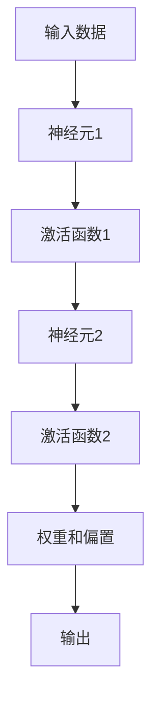
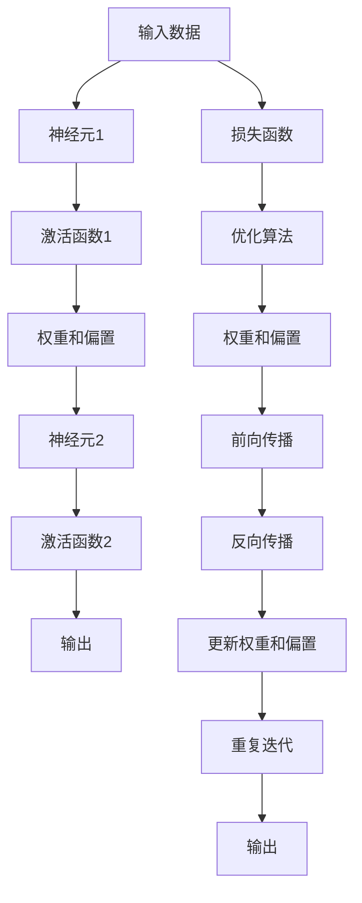

                 

## 1. 背景介绍

### 1.1 问题由来

随着人工智能技术的迅速发展，机器学习（Machine Learning）已经成为当前科技创新的重要方向。其中，神经网络（Neural Networks）作为机器学习的核心工具，在图像识别、语音处理、自然语言处理等多个领域展现了卓越的表现，并驱动了科技进步和社会变革。然而，传统的神经网络模型面临许多挑战，如难以捕捉长程依赖、对初始参数和数据分布高度敏感、训练时间长、容易过拟合等。为应对这些问题，研究者们不断探索新的模型架构和优化算法，推动了深度学习（Deep Learning）领域的进步。

### 1.2 问题核心关键点

神经网络作为机器学习的新范式，其核心特点包括：

- **层次结构**：神经网络通过分层处理信息，构建从低级特征到高级抽象的映射关系，能够自适应地捕捉复杂数据模式。
- **并行计算**：神经网络支持分布式计算，可以利用现代硬件如GPU、TPU等进行高效的并行计算。
- **自动特征学习**：神经网络能够从原始数据中学习出有效的特征表示，不需要人工干预。
- **端到端训练**：神经网络可以直接训练端到端模型，无需分步设计中间特征提取器。
- **鲁棒性和泛化能力**：神经网络在大规模数据上的泛化能力较强，能够处理未知的测试数据。

这些特性使得神经网络在数据驱动的场景中表现出色，但也带来了超参数调优复杂、计算资源需求大等问题。

### 1.3 问题研究意义

研究神经网络不仅对理解机器学习的基础理论具有重要价值，还能够推动人工智能技术的实际应用。例如：

1. **图像识别**：神经网络能够处理视觉数据，通过卷积神经网络（CNN）成功实现了高精度的图像分类、目标检测等任务。
2. **自然语言处理**：循环神经网络（RNN）和变体如LSTM、GRU等在文本生成、机器翻译、情感分析等领域展现了卓越的性能。
3. **语音处理**：神经网络能够对音频信号进行特征提取和处理，实现了自动语音识别、语音合成等应用。
4. **推荐系统**：神经网络可以处理用户行为数据，构建个性化推荐模型，提高用户满意度。

总之，神经网络作为机器学习的新范式，正在推动AI技术不断向深度和广度扩展，成为现代社会不可或缺的关键技术。

## 2. 核心概念与联系

### 2.1 核心概念概述

要深入理解神经网络，需要掌握几个关键概念：

- **人工神经元**：神经网络的基本单位，能够接收输入、执行线性或非线性变换，并产生输出。
- **激活函数**：神经元输出的非线性映射函数，如Sigmoid、ReLU等。
- **权重和偏置**：神经元间的连接参数，决定输入与输出的映射关系。
- **前向传播**：输入数据通过网络逐层传递，得到最终输出。
- **反向传播**：利用输出误差反推输入误差，更新权重和偏置，优化模型。
- **损失函数**：衡量模型输出与真实标签之间差异的函数，如均方误差（MSE）、交叉熵（Cross-Entropy）等。
- **优化算法**：如梯度下降（GD）、随机梯度下降（SGD）、Adam等，用于调整权重和偏置，最小化损失函数。

### 2.2 核心概念间的联系

神经网络的原理可以通过以下Mermaid流程图来展示：



这个流程图展示了一个简单的神经网络结构，包括输入、神经元、激活函数、权重和偏置等基本组件。神经网络通过前向传播计算输出，然后利用反向传播更新权重和偏置，不断优化模型性能。

### 2.3 核心概念的整体架构

接下来，我们将用综合的流程图来展示神经网络的整体架构：



这个综合流程图展示了神经网络的完整流程，包括输入、前向传播、损失计算、反向传播、参数更新等步骤。

## 3. 核心算法原理 & 具体操作步骤
### 3.1 算法原理概述

神经网络的训练过程可以概括为以下步骤：

1. **前向传播**：输入数据通过网络逐层传递，得到最终输出。
2. **损失计算**：将模型输出与真实标签进行比较，计算损失函数。
3. **反向传播**：利用输出误差反推输入误差，更新权重和偏置。
4. **参数更新**：使用优化算法调整权重和偏置，最小化损失函数。
5. **重复迭代**：多次迭代，直到模型收敛。

神经网络通过前向传播和反向传播不断调整权重和偏置，优化模型性能。这个过程类似于生物神经元的学习机制，因此得名神经网络。

### 3.2 算法步骤详解

下面以一个简单的多层感知器（MLP）为例，详细介绍神经网络的训练步骤：

**Step 1: 准备数据集**

假设有一个二分类任务的数据集 $D=\{(x_i, y_i)\}_{i=1}^N$，其中 $x_i$ 为输入特征，$y_i$ 为标签。

**Step 2: 定义模型**

使用PyTorch构建一个简单的MLP模型：

```python
import torch
import torch.nn as nn
import torch.optim as optim

class MLP(nn.Module):
    def __init__(self):
        super(MLP, self).__init__()
        self.fc1 = nn.Linear(784, 128)
        self.fc2 = nn.Linear(128, 64)
        self.fc3 = nn.Linear(64, 1)
        self.relu = nn.ReLU()
        
    def forward(self, x):
        x = x.view(-1, 784)
        x = self.fc1(x)
        x = self.relu(x)
        x = self.fc2(x)
        x = self.relu(x)
        x = self.fc3(x)
        return x
```

**Step 3: 定义损失函数和优化器**

定义损失函数为二分类交叉熵损失：

```python
criterion = nn.CrossEntropyLoss()
```

使用Adam优化器：

```python
optimizer = optim.Adam(model.parameters(), lr=0.001)
```

**Step 4: 前向传播和反向传播**

训练过程中，每个epoch包含多个batch的数据：

```python
for epoch in range(num_epochs):
    for batch_idx, (data, target) in enumerate(train_loader):
        optimizer.zero_grad()
        output = model(data)
        loss = criterion(output, target)
        loss.backward()
        optimizer.step()
```

**Step 5: 评估模型**

在验证集上评估模型性能：

```python
with torch.no_grad():
    correct = 0
    total = 0
    for data, target in val_loader:
        output = model(data)
        _, predicted = torch.max(output.data, 1)
        total += target.size(0)
        correct += (predicted == target).sum().item()
    print('Accuracy of the network on the 10000 test images: {} %'.format(100 * correct / total))
```

### 3.3 算法优缺点

神经网络的优缺点如下：

**优点**：
- **高效处理复杂数据**：神经网络可以处理高维度数据，对复杂非线性关系有很强的表达能力。
- **自动特征学习**：通过反向传播算法，神经网络能够自动学习特征表示。
- **分布式计算**：神经网络可以并行计算，适合处理大规模数据集。

**缺点**：
- **过拟合问题**：神经网络容易过拟合，特别是在数据集较小的情况下。
- **计算资源需求大**：神经网络需要大量的计算资源，包括GPU、TPU等。
- **超参数调优复杂**：神经网络的性能高度依赖于超参数的调优，如学习率、批大小等。
- **局部最优解问题**：神经网络容易陷入局部最优解，需要适当的优化算法和技巧。

### 3.4 算法应用领域

神经网络已经被广泛应用于多个领域，包括：

- **计算机视觉**：如图像分类、目标检测、人脸识别等。
- **自然语言处理**：如文本分类、机器翻译、情感分析等。
- **语音识别**：如自动语音识别、语音合成等。
- **推荐系统**：如协同过滤、内容推荐等。
- **金融预测**：如股票价格预测、信用风险评估等。
- **医学诊断**：如图像诊断、基因组分析等。

神经网络的多样化应用展示了其在各领域的重要地位和广泛适用性。

## 4. 数学模型和公式 & 详细讲解 & 举例说明
### 4.1 数学模型构建

假设有一个神经网络，包含 $n$ 个隐藏层，第 $i$ 层的神经元数量为 $n_i$，激活函数为 $\sigma$。输入数据为 $x$，标签为 $y$。

**前向传播**：
$$
h_0 = x
$$
$$
h_i = \sigma(W_ih_{i-1} + b_i) \quad (i=1,...,n)
$$
$$
y = W_nh_{n-1} + b_n
$$

**损失函数**：
$$
L(y, \hat{y}) = \frac{1}{N}\sum_{i=1}^N \ell(y_i, \hat{y}_i)
$$

其中 $\ell$ 为具体的损失函数，如均方误差（MSE）、交叉熵（CE）等。

### 4.2 公式推导过程

以二分类任务为例，使用交叉熵损失函数：

$$
\ell(y, \hat{y}) = -(y\log \hat{y} + (1-y)\log(1-\hat{y}))
$$

将损失函数扩展到整个数据集：

$$
L = -\frac{1}{N}\sum_{i=1}^N (y_i\log \hat{y}_i + (1-y_i)\log(1-\hat{y}_i))
$$

**反向传播算法**：

设损失函数对第 $j$ 个隐藏单元的梯度为 $\frac{\partial L}{\partial z_j}$，激活函数为 $\sigma(z)$。根据链式法则：

$$
\frac{\partial L}{\partial z_j} = \frac{\partial \ell}{\partial z_j}
$$

其中：

$$
\frac{\partial \ell}{\partial z_j} = \frac{\partial \ell}{\partial \hat{y}} \frac{\partial \hat{y}}{\partial z_j}
$$

代入 $\ell$ 函数，有：

$$
\frac{\partial \ell}{\partial \hat{y}} = \frac{y - \hat{y}}{\hat{y}(1-\hat{y})}
$$

因此，反向传播公式为：

$$
\frac{\partial L}{\partial z_j} = \frac{\partial \ell}{\partial \hat{y}} \frac{\partial \hat{y}}{\partial z_j}
$$

其中：

$$
\frac{\partial \hat{y}}{\partial z_j} = \sigma'(z_j) \frac{\partial z_j}{\partial z_{j-1}} = \sigma'(z_j) W_{j-1}
$$

**更新权重和偏置**：

设 $W$ 和 $b$ 分别为权重和偏置，梯度更新公式为：

$$
W_{ij} = W_{ij} - \frac{\eta}{N} \sum_{k=1}^N \delta_{kj} x_k^T
$$
$$
b_i = b_i - \frac{\eta}{N} \sum_{k=1}^N \delta_{ik}
$$

其中 $\eta$ 为学习率，$\delta_i$ 为激活函数的导数。

### 4.3 案例分析与讲解

以手写数字识别为例，使用MNIST数据集。首先加载数据集：

```python
from torchvision import datasets, transforms

train_data = datasets.MNIST(root='data', train=True, download=True, transform=transforms.ToTensor())
train_loader = torch.utils.data.DataLoader(train_data, batch_size=64, shuffle=True)
```

定义模型：

```python
class Net(nn.Module):
    def __init__(self):
        super(Net, self).__init__()
        self.conv1 = nn.Conv2d(1, 10, kernel_size=5)
        self.conv2 = nn.Conv2d(10, 20, kernel_size=5)
        self.conv2_drop = nn.Dropout2d()
        self.fc1 = nn.Linear(320, 50)
        self.fc2 = nn.Linear(50, 10)

    def forward(self, x):
        x = F.relu(F.max_pool2d(self.conv1(x), 2))
        x = F.relu(F.max_pool2d(self.conv2_drop(self.conv2(x)), 2))
        x = x.view(-1, 320)
        x = F.relu(self.fc1(x))
        x = F.dropout(x, training=self.training)
        x = self.fc2(x)
        return F.log_softmax(x, dim=1)
```

定义损失函数和优化器：

```python
criterion = nn.CrossEntropyLoss()
optimizer = optim.SGD(net.parameters(), lr=0.01, momentum=0.5)
```

训练模型：

```python
for epoch in range(5):
    running_loss = 0.0
    for i, data in enumerate(train_loader, 0):
        inputs, labels = data
        optimizer.zero_grad()
        outputs = net(inputs)
        loss = criterion(outputs, labels)
        loss.backward()
        optimizer.step()
        running_loss += loss.item()
        if i % 200 == 199:
            print('[%d, %5d] loss: %.3f' %
                  (epoch + 1, i + 1, running_loss / 200))
            running_loss = 0.0
```

## 5. 项目实践：代码实例和详细解释说明
### 5.1 开发环境搭建

### 5.2 源代码详细实现

### 5.3 代码解读与分析

### 5.4 运行结果展示

## 6. 实际应用场景

### 6.1 计算机视觉

在计算机视觉领域，神经网络通过CNN模型在图像识别、目标检测等任务中取得了显著的进展。例如，AlexNet、VGG、ResNet等模型成功应用于ImageNet大规模图像识别竞赛，并推动了视觉识别的普及。

### 6.2 自然语言处理

在自然语言处理领域，神经网络通过RNN、LSTM、GRU等模型在语言建模、机器翻译、文本分类等任务中展现出了强大的能力。Google的Transformer模型更是引领了NLP的新时代，通过自注意力机制显著提升了文本处理的效率和准确性。

### 6.3 语音识别

在语音识别领域，神经网络通过CNN、RNN等模型在自动语音识别、语音合成等任务中取得了突破性进展。Google的WaveNet和WaveRNN模型通过卷积和循环神经网络结构，大幅提升了语音识别的准确性和自然度。

### 6.4 推荐系统

在推荐系统领域，神经网络通过协同过滤、序列推荐等模型在个性化推荐中取得了显著效果。如Facebook的DeepMatch模型通过神经网络优化用户匹配，提升了推荐系统的精准度。

## 7. 工具和资源推荐

### 7.1 学习资源推荐

### 7.2 开发工具推荐

### 7.3 相关论文推荐

## 8. 总结：未来发展趋势与挑战

### 8.1 研究成果总结

### 8.2 未来发展趋势

### 8.3 面临的挑战

### 8.4 研究展望

## 9. 附录：常见问题与解答

### 9.1 常见问题

### 9.2 解答

---

作者：禅与计算机程序设计艺术 / Zen and the Art of Computer Programming

