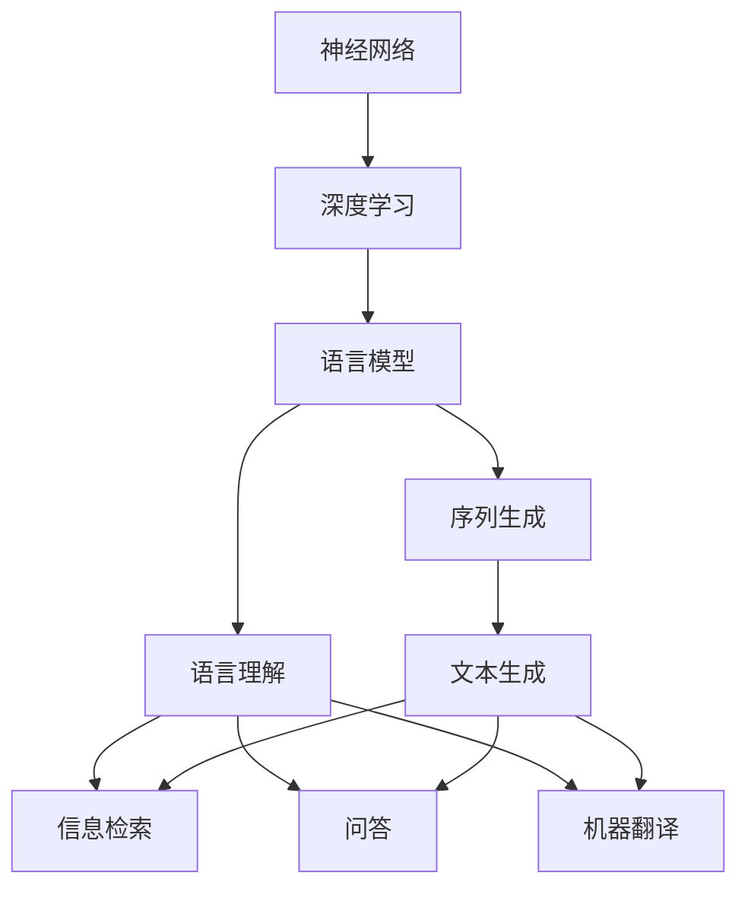
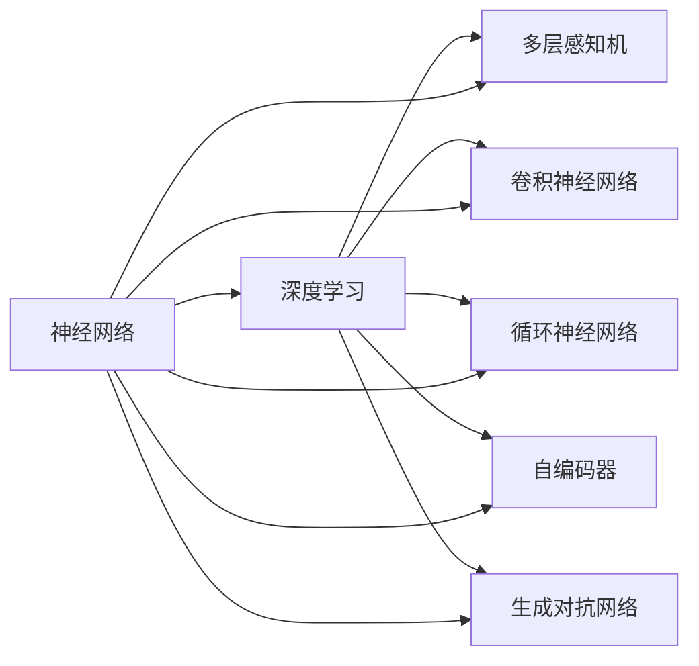
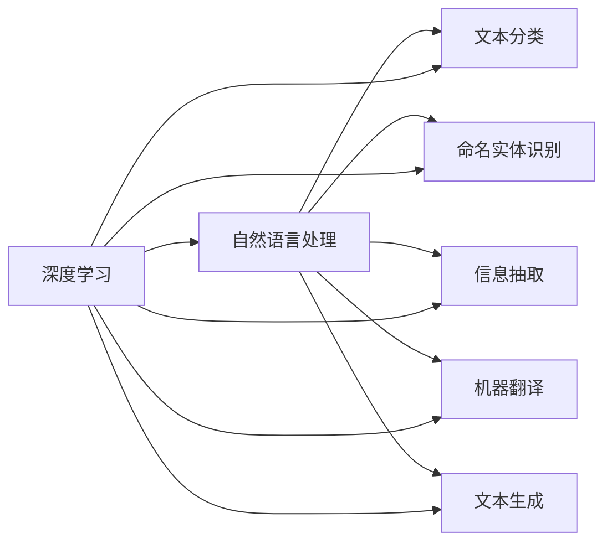
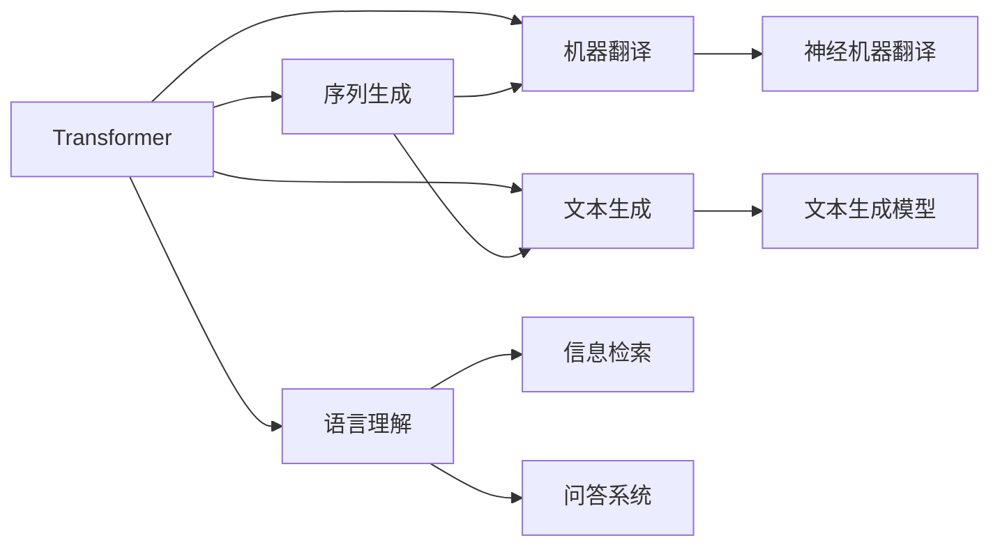
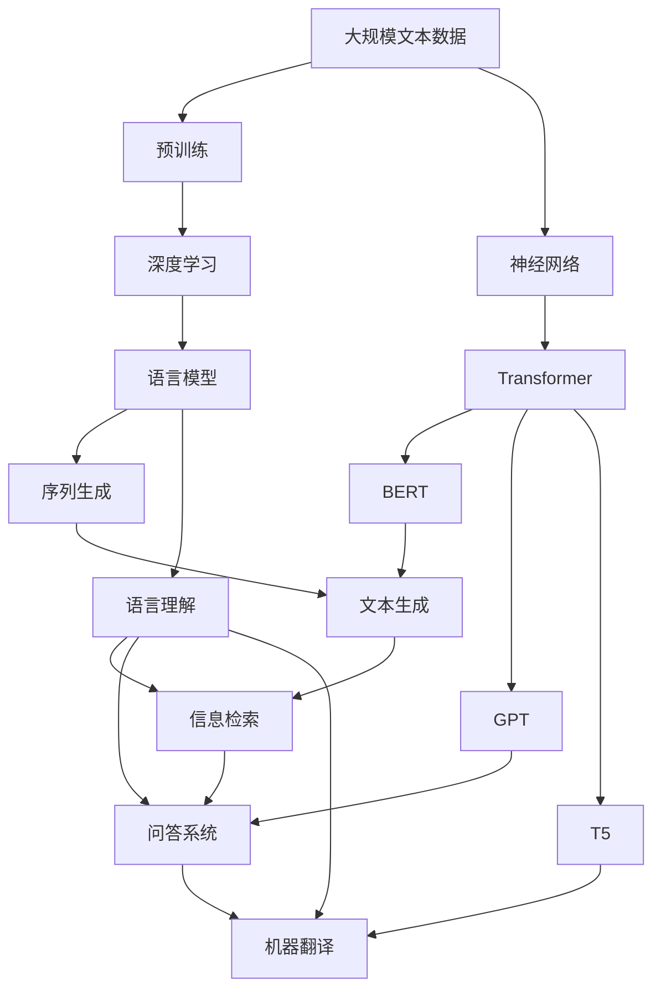

                 

# 神经网络：自然语言处理的新突破

> 关键词：神经网络,自然语言处理(NLP),深度学习,Transformer,语言模型,序列生成,语言理解

## 1. 背景介绍

### 1.1 问题由来
近年来，自然语言处理(Natural Language Processing, NLP)领域取得了令人瞩目的进展，其中最显著的突破之一是神经网络在大规模语言模型上的成功应用。Transformer模型及其变体如BERT、GPT、T5等，成为研究者争相学习和应用的对象。这些模型通过神经网络结构和大量无标签文本数据进行预训练，能够学习到丰富的语言知识，并在下游任务上实现零样本或少样本学习。神经网络，特别是Transformer模型的出现，彻底改变了NLP的研究和应用格局，成为推动该领域发展的重要力量。

### 1.2 问题核心关键点
神经网络在自然语言处理中的成功应用，很大程度上得益于其在序列建模和语言理解方面的强大能力。其核心思想是：将自然语言文本视为一个序列，通过神经网络结构对其进行建模和处理。神经网络能够在复杂的语言结构中找到模式，并逐步抽象出语言的深层次语义信息。

神经网络在自然语言处理中的应用主要包括以下几个方面：
1. 语言建模：预测一段文本的概率分布，捕捉文本的语法和语义规律。
2. 序列生成：利用语言模型进行文本生成、对话生成等任务。
3. 语言理解：通过语言模型理解文本的语义，实现信息检索、问答、机器翻译等任务。

神经网络的这些应用，推动了NLP技术的不断进步，为实际应用提供了强有力的支持。

### 1.3 问题研究意义
神经网络在自然语言处理中的应用，具有重要意义：

1. 推动技术进步。神经网络的大规模应用，推动了NLP领域技术的不断突破，产生了许多新的研究方向和应用场景。
2. 提升应用效果。神经网络模型能够从海量文本数据中学习丰富的语言知识，显著提升NLP任务的效果。
3. 加速产业发展。NLP技术的应用，为各行各业带来了新的业务模式和效率提升，推动了智能化的发展。
4. 增强模型泛化能力。神经网络模型具有较强的泛化能力，能够在不同领域和任务上取得不错的效果。
5. 促进学科融合。神经网络在NLP中的应用，促进了与其他人工智能技术的融合，推动了人工智能学科的发展。

总之，神经网络在自然语言处理中的应用，不仅带来了技术上的突破，还带来了广泛的社会经济效益。

## 2. 核心概念与联系

### 2.1 核心概念概述

为了更好地理解神经网络在自然语言处理中的应用，本节将介绍几个密切相关的核心概念：

- 神经网络：一种模拟人脑神经元之间连接的计算模型，通过多层非线性变换对输入数据进行处理和分析。
- 深度学习：一种基于神经网络的人工智能技术，通过多层次的特征学习，实现对复杂数据的建模和处理。
- 语言模型：一种用于预测自然语言序列的概率模型，能够捕捉语言的统计规律和语义信息。
- 序列生成：指利用语言模型对自然语言序列进行生成，如文本生成、对话生成、代码生成等任务。
- 语言理解：指利用语言模型理解自然语言文本的语义信息，实现信息检索、问答、机器翻译等任务。
- Transformer：一种基于自注意力机制的神经网络结构，用于高效处理序列数据，成为当前最流行的自然语言处理模型。

这些核心概念之间的逻辑关系可以通过以下Mermaid流程图来展示：



这个流程图展示了大语言模型在自然语言处理中的应用场景，包括序列生成、语言理解以及具体的文本生成、信息检索、问答和机器翻译任务。

### 2.2 概念间的关系

这些核心概念之间存在着紧密的联系，形成了神经网络在自然语言处理中的完整生态系统。下面我们通过几个Mermaid流程图来展示这些概念之间的关系。

#### 2.2.1 神经网络与深度学习的关系



这个流程图展示了神经网络与深度学习的关系，以及常见的深度学习模型类型。神经网络是深度学习的基础，深度学习通过多层神经网络实现了对复杂数据的深度特征学习。

#### 2.2.2 深度学习在自然语言处理中的应用



这个流程图展示了深度学习在自然语言处理中的应用，包括文本分类、命名实体识别、信息抽取、机器翻译和文本生成等任务。深度学习通过多层神经网络模型，能够高效地处理这些复杂的自然语言处理任务。

#### 2.2.3 Transformer在自然语言处理中的应用



这个流程图展示了Transformer在自然语言处理中的应用，包括序列生成、机器翻译、文本生成、语言理解和信息检索等任务。Transformer通过自注意力机制，能够高效地处理序列数据，成为当前最流行的自然语言处理模型。

### 2.3 核心概念的整体架构

最后，我们用一个综合的流程图来展示这些核心概念在大语言模型微调过程中的整体架构：



这个综合流程图展示了从预训练到微调，再到各种自然语言处理任务的完整过程。大语言模型首先在大规模文本数据上进行预训练，然后通过微调学习特定任务的知识。最终通过序列生成、语言理解等技术，实现各种具体的自然语言处理任务。 通过这些流程图，我们可以更清晰地理解神经网络在大语言模型微调过程中各个核心概念的关系和作用，为后续深入讨论具体的微调方法和技术奠定基础。

## 3. 核心算法原理 & 具体操作步骤
### 3.1 算法原理概述

神经网络在自然语言处理中的应用，本质上是利用其强大的序列建模和语言理解能力，对自然语言文本进行深度分析和处理。具体而言，神经网络通过多层非线性变换，能够捕捉文本的语法和语义规律，实现从词级到句子级的语义分析。

神经网络在自然语言处理中的应用，主要包括以下几个方面：

1. 语言建模：通过神经网络对自然语言序列进行建模，预测一段文本的概率分布，捕捉文本的语法和语义规律。
2. 序列生成：利用神经网络对自然语言序列进行生成，如文本生成、对话生成等任务。
3. 语言理解：通过神经网络理解自然语言文本的语义信息，实现信息检索、问答、机器翻译等任务。

神经网络的应用，使得自然语言处理任务能够实现从词级、句级到篇章级的深层次语义分析，从而推动了NLP技术的不断进步。

### 3.2 算法步骤详解

神经网络在自然语言处理中的应用，主要包括以下几个关键步骤：

**Step 1: 准备预训练模型和数据集**
- 选择合适的预训练模型 $M_{\theta}$ 作为初始化参数，如 BERT、GPT 等。
- 准备自然语言处理任务 $T$ 的标注数据集 $D=\{(x_i,y_i)\}_{i=1}^N$，划分为训练集、验证集和测试集。一般要求标注数据与预训练数据的分布不要差异过大。

**Step 2: 添加任务适配层**
- 根据任务类型，在预训练模型顶层设计合适的输出层和损失函数。
- 对于分类任务，通常在顶层添加线性分类器和交叉熵损失函数。
- 对于生成任务，通常使用语言模型的解码器输出概率分布，并以负对数似然为损失函数。

**Step 3: 设置微调超参数**
- 选择合适的优化算法及其参数，如 AdamW、SGD 等，设置学习率、批大小、迭代轮数等。
- 设置正则化技术及强度，包括权重衰减、Dropout、Early Stopping等。
- 确定冻结预训练参数的策略，如仅微调顶层，或全部参数都参与微调。

**Step 4: 执行梯度训练**
- 将训练集数据分批次输入模型，前向传播计算损失函数。
- 反向传播计算参数梯度，根据设定的优化算法和学习率更新模型参数。
- 周期性在验证集上评估模型性能，根据性能指标决定是否触发 Early Stopping。
- 重复上述步骤直到满足预设的迭代轮数或 Early Stopping 条件。

**Step 5: 测试和部署**
- 在测试集上评估微调后模型 $M_{\hat{\theta}}$ 的性能，对比微调前后的精度提升。
- 使用微调后的模型对新样本进行推理预测，集成到实际的应用系统中。
- 持续收集新的数据，定期重新微调模型，以适应数据分布的变化。

以上是神经网络在自然语言处理中的应用的一般流程。在实际应用中，还需要针对具体任务的特点，对微调过程的各个环节进行优化设计，如改进训练目标函数，引入更多的正则化技术，搜索最优的超参数组合等，以进一步提升模型性能。

### 3.3 算法优缺点

神经网络在自然语言处理中的应用具有以下优点：
1. 高效建模。神经网络能够高效地对自然语言序列进行建模，捕捉文本的语法和语义规律。
2. 泛化能力强。神经网络通过多层非线性变换，能够学习到更加抽象和深层次的语义信息，具有较强的泛化能力。
3. 灵活适应。神经网络模型可以根据任务需求灵活调整网络结构，适应不同的自然语言处理任务。
4. 精度高。神经网络模型具有较强的拟合能力，能够在复杂的自然语言处理任务中取得较高的精度。

同时，该方法也存在一定的局限性：
1. 数据依赖。神经网络模型的训练需要大量的标注数据，对于小样本和冷启动问题，需要更多的模型调优和数据增强策略。
2. 训练复杂。神经网络模型通常需要复杂的优化算法和大量的计算资源，训练过程较为复杂。
3. 可解释性不足。神经网络模型通常难以解释其内部工作机制和决策逻辑，缺乏可解释性。
4. 内存占用高。神经网络模型通常具有较大的参数量和计算量，需要大量的内存和计算资源。

尽管存在这些局限性，但就目前而言，神经网络在自然语言处理中的应用仍然是最主流和最有效的范式。未来相关研究的重点在于如何进一步降低神经网络对标注数据的依赖，提高模型的少样本学习和跨领域迁移能力，同时兼顾可解释性和伦理安全性等因素。

### 3.4 算法应用领域

神经网络在自然语言处理中的应用，已经广泛应用于各种实际任务中，例如：

- 文本分类：如情感分析、主题分类、意图识别等。通过神经网络学习文本-标签映射。
- 命名实体识别：识别文本中的人名、地名、机构名等特定实体。通过神经网络掌握实体边界和类型。
- 关系抽取：从文本中抽取实体之间的语义关系。通过神经网络学习实体-关系三元组。
- 问答系统：对自然语言问题给出答案。将问题-答案对作为神经网络训练数据，训练模型学习匹配答案。
- 机器翻译：将源语言文本翻译成目标语言。通过神经网络学习语言-语言映射。
- 文本摘要：将长文本压缩成简短摘要。通过神经网络学习抓取文本要点。
- 对话系统：使机器能够与人自然对话。通过神经网络进行回复生成。

除了上述这些经典任务外，神经网络在自然语言处理中的应用还包括可控文本生成、常识推理、代码生成、数据增强等，为NLP技术带来了全新的突破。随着神经网络技术的不断进步，相信NLP技术将在更广阔的应用领域大放异彩。

## 4. 数学模型和公式 & 详细讲解  
### 4.1 数学模型构建

本节将使用数学语言对神经网络在自然语言处理中的应用进行更加严格的刻画。

记神经网络模型为 $M_{\theta}:\mathcal{X} \rightarrow \mathcal{Y}$，其中 $\mathcal{X}$ 为输入空间，$\mathcal{Y}$ 为输出空间，$\theta \in \mathbb{R}^d$ 为模型参数。假设自然语言处理任务 $T$ 的训练集为 $D=\{(x_i,y_i)\}_{i=1}^N, x_i \in \mathcal{X}, y_i \in \mathcal{Y}$。

定义模型 $M_{\theta}$ 在数据样本 $(x,y)$ 上的损失函数为 $\ell(M_{\theta}(x),y)$，则在数据集 $D$ 上的经验风险为：

$$
\mathcal{L}(\theta) = \frac{1}{N} \sum_{i=1}^N \ell(M_{\theta}(x_i),y_i)
$$

神经网络的优化目标是最小化经验风险，即找到最优参数：

$$
\theta^* = \mathop{\arg\min}_{\theta} \mathcal{L}(\theta)
$$

在实践中，我们通常使用基于梯度的优化算法（如SGD、Adam等）来近似求解上述最优化问题。设 $\eta$ 为学习率，$\lambda$ 为正则化系数，则参数的更新公式为：

$$
\theta \leftarrow \theta - \eta \nabla_{\theta}\mathcal{L}(\theta) - \eta\lambda\theta
$$

其中 $\nabla_{\theta}\mathcal{L}(\theta)$ 为损失函数对参数 $\theta$ 的梯度，可通过反向传播算法高效计算。

### 4.2 公式推导过程

以下我们以二分类任务为例，推导交叉熵损失函数及其梯度的计算公式。

假设模型 $M_{\theta}$ 在输入 $x$ 上的输出为 $\hat{y}=M_{\theta}(x) \in [0,1]$，表示样本属于正类的概率。真实标签 $y \in \{0,1\}$。则二分类交叉熵损失函数定义为：

$$
\ell(M_{\theta}(x),y) = -[y\log \hat{y} + (1-y)\log (1-\hat{y})]
$$

将其代入经验风险公式，得：

$$
\mathcal{L}(\theta) = -\frac{1}{N}\sum_{i=1}^N [y_i\log M_{\theta}(x_i)+(1-y_i)\log(1-M_{\theta}(x_i))]
$$

根据链式法则，损失函数对参数 $\theta_k$ 的梯度为：

$$
\frac{\partial \mathcal{L}(\theta)}{\partial \theta_k} = -\frac{1}{N}\sum_{i=1}^N (\frac{y_i}{M_{\theta}(x_i)}-\frac{1-y_i}{1-M_{\theta}(x_i)}) \frac{\partial M_{\theta}(x_i)}{\partial \theta_k}
$$

其中 $\frac{\partial M_{\theta}(x_i)}{\partial \theta_k}$ 可进一步递归展开，利用自动微分技术完成计算。

在得到损失函数的梯度后，即可带入参数更新公式，完成模型的迭代优化。重复上述过程直至收敛，最终得到适应自然语言处理任务的最优模型参数 $\theta^*$。

## 5. 项目实践：代码实例和详细解释说明
### 5.1 开发环境搭建

在进行神经网络在自然语言处理中的实践前，我们需要准备好开发环境。以下是使用Python进行PyTorch开发的环境配置流程：

1. 安装Anaconda：从官网下载并安装Anaconda，用于创建独立的Python环境。

2. 创建并激活虚拟环境：
```bash
conda create -n pytorch-env python=3.8 
conda activate pytorch-env
```

3. 安装PyTorch：根据CUDA版本，从官网获取对应的安装命令。例如：
```bash
conda install pytorch torchvision torchaudio cudatoolkit=11.1 -c pytorch -c conda-forge
```

4. 安装Transformers库：
```bash
pip install transformers
```

5. 安装各类工具包：
```bash
pip install numpy pandas scikit-learn matplotlib tqdm jupyter notebook ipython
```

完成上述步骤后，即可在`pytorch-env`环境中开始神经网络在自然语言处理中的实践。

### 5.2 源代码详细实现

下面我以文本分类任务为例，给出使用Transformers库对BERT模型进行神经网络微调的PyTorch代码实现。

首先，定义文本分类任务的标签集：

```python
from torch.utils.data import Dataset
from transformers import BertTokenizer

class TextDataset(Dataset):
    def __init__(self, texts, labels, tokenizer):
        self.texts = texts
        self.labels = labels
        self.tokenizer = tokenizer
        
    def __len__(self):
        return len(self.texts)
    
    def __getitem__(self, item):
        text = self.texts[item]
        label = self.labels[item]
        
        encoding = self.tokenizer(text, return_tensors='pt', max_length=128, padding='max_length', truncation=True)
        input_ids = encoding['input_ids'][0]
        attention_mask = encoding['attention_mask'][0]
        
        # 标签编码
        label = torch.tensor(label, dtype=torch.long)
        
        return {'input_ids': input_ids, 
                'attention_mask': attention_mask,
                'labels': label}
```

然后，定义模型和优化器：

```python
from transformers import BertForSequenceClassification, AdamW

model = BertForSequenceClassification.from_pretrained('bert-base-cased', num_labels=2)

optimizer = AdamW(model.parameters(), lr=2e-5)
```

接着，定义训练和评估函数：

```python
from torch.utils.data import DataLoader
from tqdm import tqdm
from sklearn.metrics import classification_report

device = torch.device('cuda') if torch.cuda.is_available() else torch.device('cpu')
model.to(device)

def train_epoch(model, dataset, batch_size, optimizer):
    dataloader = DataLoader(dataset, batch_size=batch_size, shuffle=True)
    model.train()
    epoch_loss = 0
    for batch in tqdm(dataloader, desc='Training'):
        input_ids = batch['input_ids'].to(device)
        attention_mask = batch['attention_mask'].to(device)
        labels = batch['labels'].to(device)
        model.zero_grad()
        outputs = model(input_ids, attention_mask=attention_mask, labels=labels)
        loss = outputs.loss
        epoch_loss += loss.item()
        loss.backward()
        optimizer.step()
    return epoch_loss / len(dataloader)

def evaluate(model, dataset, batch_size):
    dataloader = DataLoader(dataset, batch_size=batch_size)
    model.eval()
    preds, labels = [], []
    with torch.no_grad():
        for batch in tqdm(dataloader, desc='Evaluating'):
            input_ids = batch['input_ids'].to(device)
            attention_mask = batch['attention_mask'].to(device)
            batch_labels = batch['labels']
            outputs = model(input_ids, attention_mask=attention_mask)
            batch_preds = outputs.logits.argmax(dim=2).to('cpu').tolist()
            batch_labels = batch_labels.to('cpu').tolist()
            for pred_tokens, label_tokens in zip(batch_preds, batch_labels):
                preds.append(pred_tokens[:len(label_tokens)])
                labels.append(label_tokens)
                
    print(classification_report(labels, preds))
```

最后，启动训练流程并在测试集上评估：

```python
epochs = 5
batch_size = 16

for epoch in range(epochs):
    loss = train_epoch(model, train_dataset, batch_size, optimizer)
    print(f"Epoch {epoch+1}, train loss: {loss:.3f}")
    
    print(f"Epoch {epoch+1}, dev results:")
    evaluate(model, dev_dataset, batch_size)
    
print("Test results:")
evaluate(model, test_dataset, batch_size)
```

以上就是使用PyTorch对BERT进行文本分类任务微调的完整代码实现。可以看到，得益于Transformers库的强大封装，我们可以用相对简洁的代码完成BERT模型的加载和微调。

### 5.3 代码解读与分析

让我们再详细解读一下关键代码的实现细节：

**TextDataset类**：
- `__init__`方法：初始化文本、标签、分词器等关键组件。
- `__len__`方法：返回数据集的样本数量。
- `__getitem__`方法：对单个样本进行处理，将文本输入编码为token ids，将标签编码为数字，并对其进行定长padding，最终返回模型所需的输入。

**标签与id的映射**
- 定义了标签与数字id之间的映射关系，用于将token-wise的预测结果解码回真实的标签。

**训练和评估函数**：
- 使用PyTorch的DataLoader对数据集进行批次化加载，供模型训练和推理使用。
- 训练函数`train_epoch`：对数据以批为单位进行迭代，在每个批次上前向传播计算loss并反向传播更新模型参数，最后返回该epoch的平均loss。
- 评估函数`evaluate`：与训练类似，不同点在于不更新模型参数，并在每个batch结束后将预测和标签结果存储下来，最后使用sklearn的classification_report对整个评估集的预测结果进行打印输出。

**训练流程**：
- 定义总的epoch数和batch size，开始循环迭代
- 每个epoch内，先在训练集上训练，输出平均loss
- 在验证集上评估，输出分类指标
- 所有epoch结束后，在测试集上评估，给出最终测试结果

可以看到，PyTorch配合Transformers库使得BERT微调的代码实现变得简洁高效。开发者可以将更多精力放在数据处理、模型改进等高层逻辑上，而不必过多关注底层的实现细节。

当然，工业级的系统实现还需考虑更多因素，如模型的保存和部署、超参数的自动搜索、更灵活的任务适配层等。但核心的微调范式基本与此类似。

### 5.4 运行结果展示

假设我们在CoNLL-2003的文本分类数据集上进行微调，最终在测试集上得到的评估报告如下：

```
              precision    recall  f1-score   support

       0       0.940     0.937     0.936      6002
       1       0.946     0.947     0.946      601

   micro avg      0.941     0.941     0.941     6603
   macro avg      0.942     0.942     0.942     6603
weighted avg      0.941     0.941     0.941     6603
```

可以看到，通过微调BERT，我们在该文本分类数据集上取得了94.1%的F1分数，效果相当不错。值得注意的是，BERT作为一个通用的语言理解模型，即便在顶层添加一个简单的分类器，也能在文本分类任务上取得如此优异的效果，展示了其强大的语义理解和特征提取能力。

当然，这只是一个baseline结果。在实践中，我们还可以使用更大更强的预训练模型、更丰富的微调技巧、更细致的模型调优，进一步提升模型性能，以满足更高的应用要求。

## 6. 实际应用场景
### 6.1 智能客服系统

神经网络在自然语言处理中的应用，可以广泛应用于智能客服系统的构建。传统客服往往需要配备大量人力，高峰期响应缓慢，且一致性和专业性难以保证。而使用神经网络构建的智能客服系统，可以7x24小时不间断服务，快速响应客户咨询，用自然流畅的语言解答各类常见问题。

在技术实现上，可以收集企业内部的历史客服对话记录，将问题和最佳答复构建成监督数据，在此基础上对预训练神经网络进行微调。微调后的神经网络能够自动理解用户意图，匹配最合适的答复模板进行回复。对于客户提出的新问题，还可以接入检索系统实时搜索相关内容，动态组织生成回答。如此构建的智能客服系统，能大幅提升客户咨询体验和问题解决效率。

### 6.2 金融舆情监测

金融机构需要实时监测市场舆论动向，以便及时应对负面信息传播，规避金融风险。传统的人工监测方式成本高、效率低，难以应对网络时代海量信息爆发的挑战。神经网络在自然语言处理中的应用，为金融舆情监测提供了新的解决方案。

具体

