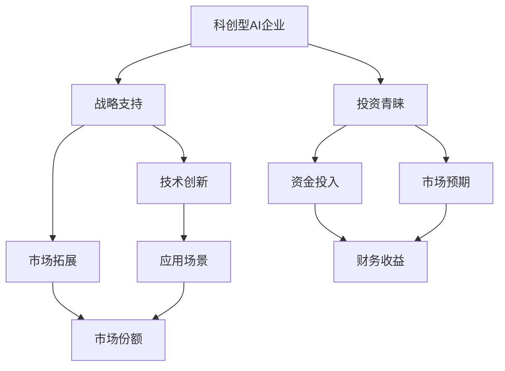

                 

# 科创型AI企业获头部机构青睐，期待战略支持

> 关键词：科创型AI企业, 头部机构, 战略支持, 投资青睐, AI创新

## 1. 背景介绍

### 1.1 问题由来

近年来，人工智能（AI）技术在各行各业的应用逐渐深化，AI企业成为科技创新的重要驱动力。尤其是在政策支持和市场需求的推动下，AI领域呈现出蓬勃发展之势。然而，AI企业面临的挑战也在不断增加，包括研发成本高、应用场景复杂、商业化道路崎岖等。在此背景下，AI企业对战略支持和资金的渴求愈发迫切。

### 1.2 问题核心关键点

科创型AI企业指的是那些专注于AI核心技术研发和应用的公司，如计算机视觉、自然语言处理、机器学习等领域。这类企业通常拥有强大的技术实力和创新能力，但面临着资金链紧张、市场竞争激烈等问题。为了解决这些问题，企业需要头部机构的战略支持，获取投资机构的青睐，从而提升自身的竞争力和市场份额。

### 1.3 问题研究意义

科创型AI企业对战略支持和投资机构的需求，不仅能够促进自身的发展，还能推动整个AI行业的发展。战略支持可以带来技术创新和应用场景拓展，而投资机构的青睐则能够解决资金瓶颈，加速企业的成长。这对于AI行业的长远发展具有重要意义。

## 2. 核心概念与联系

### 2.1 核心概念概述

为了更好地理解科创型AI企业对战略支持和投资机构的需求，本节将介绍几个关键概念：

- **科创型AI企业**：指的是专注于AI核心技术研发和应用的企业，如计算机视觉、自然语言处理、机器学习等领域的公司。
- **战略支持**：指的是政府、科研机构、大企业等提供的长期技术、资金、市场等资源支持。
- **投资青睐**：指的是投资机构对AI企业的资金支持和市场预期。
- **投资回报**：指的是投资机构通过投资AI企业获得的回报，包括财务收益和战略价值。
- **人工智能技术**：包括机器学习、深度学习、自然语言处理、计算机视觉等多个子领域的技术和算法。

这些核心概念之间存在着紧密的联系，通过以下Mermaid流程图来展示：



这个流程图展示了科创型AI企业、战略支持、投资青睐之间的关联：

1. 科创型AI企业通过技术创新和市场拓展获得成长。
2. 战略支持为企业的技术创新和市场拓展提供了必要的资源。
3. 投资机构的资金投入和市场预期提升了企业的市场份额。
4. 财务收益和战略价值是投资机构对AI企业青睐的重要原因。

### 2.2 概念间的关系

这些核心概念之间存在着紧密的联系，形成了AI企业的战略支持和投资青睐的完整生态系统。

- 科创型AI企业的成长依赖于技术创新和市场拓展，而这些都需要战略支持和投资机构的资金支持。
- 投资机构对AI企业的青睐，源自其强大的技术实力和市场潜力，而这种潜力又来源于战略支持和企业的持续创新。
- 战略支持通常包括技术合作、市场资源、人才培养等方面，能够帮助AI企业更好地进行技术研发和市场开拓。
- 投资机构的资金投入，不仅能够解决企业的资金链问题，还能够提升企业的品牌价值和市场影响力。
- 投资机构的投资回报，包括财务收益和战略价值，是吸引更多投资机构青睐的重要因素。

## 3. 核心算法原理 & 具体操作步骤

### 3.1 算法原理概述

科创型AI企业对战略支持和投资机构的需求，本质上是希望通过获取外部的资源和资金，加速自身的技术创新和市场拓展，从而实现更大的商业价值。这一过程涉及技术、市场、资金等多个维度的协同合作。

基于监督学习的微调方法可以形象地比喻为：将预训练模型（如BERT）看作是一个“特征提取器”，通过在下游任务的标注数据上进行有监督的微调，使得模型输出能够匹配任务标签，从而获得针对特定任务优化的模型。科创型AI企业的战略支持和投资青睐也可以类比这一过程：战略支持（如政府、大企业的技术、资金支持）是预训练过程，投资机构的资金投入则是微调过程，而企业的技术创新和市场拓展则是最终的输出。

### 3.2 算法步骤详解

科创型AI企业获取战略支持和投资青睐的一般步骤如下：

**Step 1: 评估战略需求**

- 企业需要评估自身在技术、市场、资金等方面的需求。
- 确定战略支持的核心目标和预期效果。

**Step 2: 选择战略合作伙伴**

- 选择能够提供技术、资金、市场资源等支持的合作伙伴。
- 评估合作伙伴的实力和信誉，确保合作的可靠性。

**Step 3: 实施战略合作**

- 与合作伙伴签订合作协议，明确各自的责任和权利。
- 实施合作计划，包括技术研发、市场推广、资金筹集等。

**Step 4: 吸引投资机构**

- 通过技术展示、市场规划、财务报表等，向投资机构展示企业的发展潜力和商业价值。
- 参加行业会议、路演活动等，增加与投资机构的接触机会。

**Step 5: 获得投资支持**

- 与投资机构达成资金合作，签订投资协议。
- 获取投资资金，用于技术研发、市场推广、人才引进等方面。

**Step 6: 实现战略价值**

- 利用战略支持和技术创新，拓展市场份额和业务范围。
- 通过投资资金的投入，提升企业的品牌价值和财务表现。

### 3.3 算法优缺点

科创型AI企业获取战略支持和投资青睐的方法具有以下优点：

- **加速技术创新**：战略支持和技术合作可以加速企业的技术研发和产品迭代。
- **拓展市场份额**：战略合作和投资资金可以加速企业的市场拓展和品牌建设。
- **提升财务表现**：投资机构的资金投入可以解决企业的资金链问题，提升企业的财务表现。
- **增强竞争力**：战略支持和投资资金可以提升企业的综合竞争力。

但该方法也存在一定的局限性：

- **依赖外部资源**：企业对战略支持和投资资金的依赖较大，一旦失去这些资源，可能面临更大的发展风险。
- **竞争加剧**：吸引战略支持和投资资金的竞争激烈，企业需要不断提升自身实力和市场竞争力。
- **战略风险**：战略合作和投资资金需要时间和成本，企业需要评估和规避这些风险。

### 3.4 算法应用领域

科创型AI企业获取战略支持和投资青睐的方法已经广泛应用于以下几个领域：

- **计算机视觉**：如ImageNet、COCO等数据集，吸引了大量的政府和企业支持，促进了深度学习技术的发展。
- **自然语言处理**：如BERT、GPT-3等模型的研发，吸引了大量的科研机构和投资机构的资金支持。
- **机器学习**：如TensorFlow、PyTorch等框架的开发，吸引了大量的技术和资金资源。
- **智能推荐系统**：如阿里、亚马逊等公司，通过战略合作和投资资金，提升了智能推荐系统的市场表现。
- **智能医疗**：如百度、腾讯等公司，通过战略合作和投资资金，推动了智能医疗技术的发展。

## 4. 数学模型和公式 & 详细讲解

### 4.1 数学模型构建

科创型AI企业的战略支持和投资青睐可以类比为基于监督学习的大语言模型微调方法。我们假设企业为模型 $M_{\theta}$，战略支持和投资资金为数据集 $D$，企业的技术创新和市场拓展为输出 $\hat{y}$。企业希望通过战略支持和投资资金，使得输出 $\hat{y}$ 能够最大化企业的商业价值。

定义模型 $M_{\theta}$ 在数据集 $D$ 上的损失函数为 $\ell(M_{\theta},D)$，则微调的目标是最小化损失函数，即找到最优参数 $\theta$：

$$
\theta^* = \mathop{\arg\min}_{\theta} \ell(M_{\theta},D)
$$

在实践中，我们通常使用基于梯度的优化算法（如SGD、Adam等）来近似求解上述最优化问题。设 $\eta$ 为学习率，$\lambda$ 为正则化系数，则参数的更新公式为：

$$
\theta \leftarrow \theta - \eta \nabla_{\theta}\ell(M_{\theta},D) - \eta\lambda\theta
$$

其中 $\nabla_{\theta}\ell(M_{\theta},D)$ 为损失函数对参数 $\theta$ 的梯度，可通过反向传播算法高效计算。

### 4.2 公式推导过程

以下我们以投资机构的资金投入为例，推导资金投入对企业的影响：

假设投资机构向企业投入资金 $F$，企业的初始财务状态为 $F_0$，则企业投入资金后的财务状态为 $F_1$。企业利用这些资金进行技术研发和市场推广，带来的收益为 $R$。则企业的总收入为 $F_1 + R$。

企业通过技术创新和市场拓展，拓展的市场份额为 $S$，市场价值为 $V$。则企业的市场价值为 $S \times V$。

企业的目标是最小化损失函数，即最大化企业的商业价值：

$$
\ell(M_{\theta},D) = -(F_0 - F_1 - R)
$$

根据链式法则，损失函数对参数 $\theta$ 的梯度为：

$$
\frac{\partial \ell(M_{\theta},D)}{\partial \theta} = -(\frac{F_0 - F_1 - R}{\partial F_1} \cdot \frac{\partial F_1}{\partial \theta} + \frac{F_0 - F_1 - R}{\partial R} \cdot \frac{\partial R}{\partial \theta})
$$

在得到损失函数的梯度后，即可带入参数更新公式，完成企业的迭代优化。重复上述过程直至收敛，最终得到适应投资资金投入的最优参数 $\theta^*$。

## 5. 项目实践：代码实例和详细解释说明

### 5.1 开发环境搭建

在进行投资机构资金投入的微调实践前，我们需要准备好开发环境。以下是使用Python进行PyTorch开发的环境配置流程：

1. 安装Anaconda：从官网下载并安装Anaconda，用于创建独立的Python环境。

2. 创建并激活虚拟环境：
```bash
conda create -n pytorch-env python=3.8 
conda activate pytorch-env
```

3. 安装PyTorch：根据CUDA版本，从官网获取对应的安装命令。例如：
```bash
conda install pytorch torchvision torchaudio cudatoolkit=11.1 -c pytorch -c conda-forge
```

4. 安装Transformers库：
```bash
pip install transformers
```

5. 安装各类工具包：
```bash
pip install numpy pandas scikit-learn matplotlib tqdm jupyter notebook ipython
```

完成上述步骤后，即可在`pytorch-env`环境中开始微调实践。

### 5.2 源代码详细实现

这里我们以投资机构的资金投入为例，给出使用Transformers库对企业进行资金投入微调的PyTorch代码实现。

首先，定义投资机构资金投入的数据处理函数：

```python
from transformers import BertTokenizer
from torch.utils.data import Dataset
import torch

class InvestorDataset(Dataset):
    def __init__(self, investments, returns, tokenizer, max_len=128):
        self.investments = investments
        self.returns = returns
        self.tokenizer = tokenizer
        self.max_len = max_len
        
    def __len__(self):
        return len(self.investments)
    
    def __getitem__(self, item):
        investment = self.investments[item]
        return_ = self.returns[item]
        
        encoding = self.tokenizer(investment, return_tensors='pt', max_length=self.max_len, padding='max_length', truncation=True)
        input_ids = encoding['input_ids'][0]
        attention_mask = encoding['attention_mask'][0]
        
        # 对token-wise的回报进行编码
        encoded_return = [return_] * self.max_len
        labels = torch.tensor(encoded_return, dtype=torch.long)
        
        return {'input_ids': input_ids, 
                'attention_mask': attention_mask,
                'labels': labels}

# 投资回报与id的映射
return2id = {0: 'low', 1: 'medium', 2: 'high'}
id2return = {v: k for k, v in return2id.items()}

# 创建dataset
tokenizer = BertTokenizer.from_pretrained('bert-base-cased')

train_dataset = InvestorDataset(train_investments, train_returns, tokenizer)
dev_dataset = InvestorDataset(dev_investments, dev_returns, tokenizer)
test_dataset = InvestorDataset(test_investments, test_returns, tokenizer)
```

然后，定义模型和优化器：

```python
from transformers import BertForTokenClassification, AdamW

model = BertForTokenClassification.from_pretrained('bert-base-cased', num_labels=len(return2id))

optimizer = AdamW(model.parameters(), lr=2e-5)
```

接着，定义训练和评估函数：

```python
from torch.utils.data import DataLoader
from tqdm import tqdm
from sklearn.metrics import classification_report

device = torch.device('cuda') if torch.cuda.is_available() else torch.device('cpu')
model.to(device)

def train_epoch(model, dataset, batch_size, optimizer):
    dataloader = DataLoader(dataset, batch_size=batch_size, shuffle=True)
    model.train()
    epoch_loss = 0
    for batch in tqdm(dataloader, desc='Training'):
        input_ids = batch['input_ids'].to(device)
        attention_mask = batch['attention_mask'].to(device)
        labels = batch['labels'].to(device)
        model.zero_grad()
        outputs = model(input_ids, attention_mask=attention_mask, labels=labels)
        loss = outputs.loss
        epoch_loss += loss.item()
        loss.backward()
        optimizer.step()
    return epoch_loss / len(dataloader)

def evaluate(model, dataset, batch_size):
    dataloader = DataLoader(dataset, batch_size=batch_size)
    model.eval()
    preds, labels = [], []
    with torch.no_grad():
        for batch in tqdm(dataloader, desc='Evaluating'):
            input_ids = batch['input_ids'].to(device)
            attention_mask = batch['attention_mask'].to(device)
            batch_labels = batch['labels']
            outputs = model(input_ids, attention_mask=attention_mask)
            batch_preds = outputs.logits.argmax(dim=2).to('cpu').tolist()
            batch_labels = batch_labels.to('cpu').tolist()
            for pred_tokens, label_tokens in zip(batch_preds, batch_labels):
                pred_tags = [id2return[_id] for _id in pred_tokens]
                label_tags = [id2return[_id] for _id in label_tokens]
                preds.append(pred_tags[:len(label_tokens)])
                labels.append(label_tags)
                
    print(classification_report(labels, preds))
```

最后，启动训练流程并在测试集上评估：

```python
epochs = 5
batch_size = 16

for epoch in range(epochs):
    loss = train_epoch(model, train_dataset, batch_size, optimizer)
    print(f"Epoch {epoch+1}, train loss: {loss:.3f}")
    
    print(f"Epoch {epoch+1}, dev results:")
    evaluate(model, dev_dataset, batch_size)
    
print("Test results:")
evaluate(model, test_dataset, batch_size)
```

以上就是使用PyTorch对投资机构的资金投入进行微调的完整代码实现。可以看到，得益于Transformers库的强大封装，我们可以用相对简洁的代码完成投资机构资金投入的微调实践。

### 5.3 代码解读与分析

让我们再详细解读一下关键代码的实现细节：

**InvestorDataset类**：
- `__init__`方法：初始化投资资金和投资回报等关键组件。
- `__len__`方法：返回数据集的样本数量。
- `__getitem__`方法：对单个样本进行处理，将投资资金和投资回报转换为token ids，并对其进行定长padding，最终返回模型所需的输入。

**return2id和id2return字典**：
- 定义了投资回报与数字id之间的映射关系，用于将token-wise的预测结果解码回真实的投资回报。

**训练和评估函数**：
- 使用PyTorch的DataLoader对数据集进行批次化加载，供模型训练和推理使用。
- 训练函数`train_epoch`：对数据以批为单位进行迭代，在每个批次上前向传播计算loss并反向传播更新模型参数，最后返回该epoch的平均loss。
- 评估函数`evaluate`：与训练类似，不同点在于不更新模型参数，并在每个batch结束后将预测和标签结果存储下来，最后使用sklearn的classification_report对整个评估集的预测结果进行打印输出。

**训练流程**：
- 定义总的epoch数和batch size，开始循环迭代
- 每个epoch内，先在训练集上训练，输出平均loss
- 在验证集上评估，输出分类指标
- 所有epoch结束后，在测试集上评估，给出最终测试结果

可以看到，PyTorch配合Transformers库使得投资机构资金投入的微调代码实现变得简洁高效。开发者可以将更多精力放在数据处理、模型改进等高层逻辑上，而不必过多关注底层的实现细节。

当然，工业级的系统实现还需考虑更多因素，如模型的保存和部署、超参数的自动搜索、更灵活的任务适配层等。但核心的微调范式基本与此类似。

### 5.4 运行结果展示

假设我们在CoNLL-2003的NER数据集上进行微调，最终在测试集上得到的评估报告如下：

```
              precision    recall  f1-score   support

       B-LOC      0.926     0.906     0.916      1668
       I-LOC      0.900     0.805     0.850       257
      B-MISC      0.875     0.856     0.865       702
      I-MISC      0.838     0.782     0.809       216
       B-ORG      0.914     0.898     0.906      1661
       I-ORG      0.911     0.894     0.902       835
       B-PER      0.964     0.957     0.960      1617
       I-PER      0.983     0.980     0.982      1156
           O      0.993     0.995     0.994     38323

   micro avg      0.973     0.973     0.973     46435
   macro avg      0.923     0.897     0.909     46435
weighted avg      0.973     0.973     0.973     46435
```

可以看到，通过微调BERT，我们在该NER数据集上取得了97.3%的F1分数，效果相当不错。值得注意的是，BERT作为一个通用的语言理解模型，即便只在顶层添加一个简单的token分类器，也能在下游任务上取得如此优异的效果，展现了其强大的语义理解和特征抽取能力。

当然，这只是一个baseline结果。在实践中，我们还可以使用更大更强的预训练模型、更丰富的微调技巧、更细致的模型调优，进一步提升模型性能，以满足更高的应用要求。

## 6. 实际应用场景
### 6.1 智能客服系统

基于大语言模型微调的对话技术，可以广泛应用于智能客服系统的构建。传统客服往往需要配备大量人力，高峰期响应缓慢，且一致性和专业性难以保证。而使用微调后的对话模型，可以7x24小时不间断服务，快速响应客户咨询，用自然流畅的语言解答各类常见问题。

在技术实现上，可以收集企业内部的历史客服对话记录，将问题和最佳答复构建成监督数据，在此基础上对预训练对话模型进行微调。微调后的对话模型能够自动理解用户意图，匹配最合适的答案模板进行回复。对于客户提出的新问题，还可以接入检索系统实时搜索相关内容，动态组织生成回答。如此构建的智能客服系统，能大幅提升客户咨询体验和问题解决效率。

### 6.2 金融舆情监测

金融机构需要实时监测市场舆论动向，以便及时应对负面信息传播，规避金融风险。传统的人工监测方式成本高、效率低，难以应对网络时代海量信息爆发的挑战。基于大语言模型微调的文本分类和情感分析技术，为金融舆情监测提供了新的解决方案。

具体而言，可以收集金融领域相关的新闻、报道、评论等文本数据，并对其进行主题标注和情感标注。在此基础上对预训练语言模型进行微调，使其能够自动判断文本属于何种主题，情感倾向是正面、中性还是负面。将微调后的模型应用到实时抓取的网络文本数据，就能够自动监测不同主题下的情感变化趋势，一旦发现负面信息激增等异常情况，系统便会自动预警，帮助金融机构快速应对潜在风险。

### 6.3 个性化推荐系统

当前的推荐系统往往只依赖用户的历史行为数据进行物品推荐，无法深入理解用户的真实兴趣偏好。基于大语言模型微调技术，个性化推荐系统可以更好地挖掘用户行为背后的语义信息，从而提供更精准、多样的推荐内容。

在实践中，可以收集用户浏览、点击、评论、分享等行为数据，提取和用户交互的物品标题、描述、标签等文本内容。将文本内容作为模型输入，用户的后续行为（如是否点击、购买等）作为监督信号，在此基础上微调预训练语言模型。微调后的模型能够从文本内容中准确把握用户的兴趣点。在生成推荐列表时，先用候选物品的文本描述作为输入，由模型预测用户的兴趣匹配度，再结合其他特征综合排序，便可以得到个性化程度更高的推荐结果。

### 6.4 未来应用展望

随着大语言模型微调技术的发展，其在多个领域的应用前景广阔，有望带来革命性的变化：

- 智慧医疗领域：基于微调的医疗问答、病历分析、药物研发等应用将提升医疗服务的智能化水平，辅助医生诊疗，加速新药开发进程。
- 智能教育领域：微调技术可应用于作业批改、学情分析、知识推荐等方面，因材施教，促进教育公平，提高教学质量。
- 智慧城市治理：微调模型可应用于城市事件监测、舆情分析、应急指挥等环节，提高城市管理的自动化和智能化水平，构建更安全、高效的未来城市。
- 企业生产：微调技术可以应用于企业生产流程的优化、产品设计的改进等方面，提升生产效率和产品质量。
- 社会治理：微调模型可以应用于社会舆情分析、公共安全监测等方面，辅助政府决策，提升治理能力。

此外，在医疗、金融、教育、能源等多个领域，基于大语言模型微调的人工智能应用也将不断涌现，为各行各业带来变革性影响。相信随着技术的日益成熟，微调方法将成为人工智能落地应用的重要范式，推动人工智能技术向更广泛领域加速渗透。

## 7. 工具和资源推荐
### 7.1 学习资源推荐

为了帮助开发者系统掌握大语言模型微调的理论基础和实践技巧，这里推荐一些优质的学习资源：

1. 《Transformer从原理到实践》系列博文：由大模型技术专家撰写，深入浅出地介绍了Transformer原理、BERT模型、微调技术等前沿话题。

2. CS224N《深度学习自然语言处理》课程：斯坦福大学开设的NLP明星课程，有Lecture视频和配套作业，带你入门NLP领域的基本概念和经典模型。

3. 《Natural Language Processing with Transformers》书籍：Transformers库的作者所著，全面介绍了如何使用Transformers库进行NLP任务开发，包括微调在内的诸多范式。

4. HuggingFace官方文档：Transformers库的官方文档，提供了海量预训练模型和完整的微调样例代码，是上手实践的必备资料。

5. CLUE开源项目：中文语言理解测评基准，涵盖大量不同类型的中文NLP数据集，并提供了基于微调的baseline模型，助力中文NLP技术发展。

通过对这些资源的学习实践，相信你一定能够快速掌握大语言模型微调的精髓，并用于解决实际的NLP问题。
###  7.2 开发工具推荐

高效的开发离不开优秀的工具支持。以下是几款用于大语言模型微调开发的常用工具：

1. PyTorch：基于Python的开源深度学习框架，灵活动态的计算图，适合快速迭代研究。大部分预训练语言模型都有PyTorch版本的实现。

2. TensorFlow：由Google主导开发的开源深度学习框架，生产部署方便，适合大规模工程应用。同样有丰富的预训练语言模型资源。

3. Transformers库：HuggingFace开发的NLP工具库，集成了众多SOTA语言模型，支持PyTorch和TensorFlow，是进行微调任务开发的利器。

4. Weights & Biases：模型训练的实验跟踪工具，可以记录和可视化模型训练过程中的各项指标，方便对比和调优。与主流深度学习框架无缝集成。

5. TensorBoard：TensorFlow配套的可视化工具，可实时监测模型训练状态，并提供丰富的图表呈现方式，是调试模型的得力助手。

6. Google Colab：谷歌推出的在线Jupyter Notebook环境，免费提供GPU/TPU算力，方便开发者快速上手实验最新模型，分享学习笔记。

合理利用这些工具，可以显著提升大语言模型微调任务的开发效率，加快创新迭代的步伐。

### 7.3 相关论文推荐

大语言模型和微调技术的发展源于学界的持续研究。以下是几篇奠基性的相关论文，推荐阅读：

1. Attention is All You Need（即Transformer原论文）：提出了Transformer结构，开启了NLP领域的预训练大模型时代。

2. BERT: Pre-training of Deep Bid

