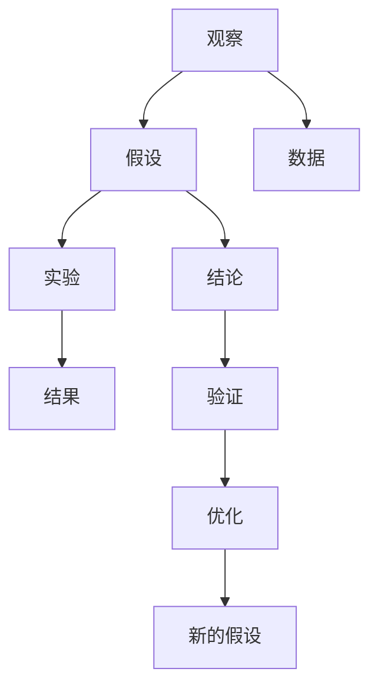
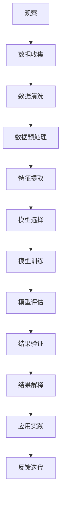
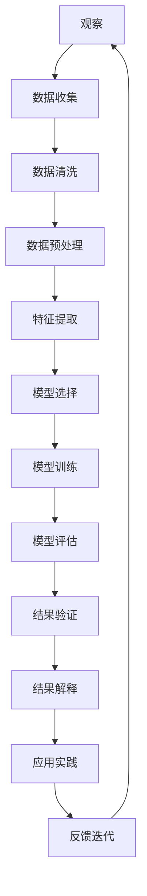

                 

# 科学探究：从观察到结论

科学探究是人类认知世界、理解自然的重要途径。从古至今，无数的科学家通过观察现象、提出假设、进行实验、得出结论，推动了人类文明的进步。在信息技术快速发展的今天，科学探究同样在人工智能领域扮演着重要角色。本文将系统介绍科学探究的原理、步骤、算法及其实际应用，探讨其在人工智能领域的前沿发展及未来趋势。

## 1. 背景介绍

### 1.1 问题由来

科学探究的过程可以分为以下几个步骤：观察现象、提出假设、进行实验、得出结论。在人工智能领域，这一过程同样适用。通过观察和分析数据，提出解决问题的假设，使用算法和模型进行实验验证，得出结论并应用于实际问题解决。这一过程贯穿于人工智能的各个阶段，从数据预处理到模型训练，再到结果评估，每一步都离不开科学探究的思维方式。

### 1.2 问题核心关键点

科学探究的核心在于通过系统化的观察和实验，得出具有普适性的结论。人工智能领域的科学探究同样遵循这一原则，通过观察和学习大量数据，提出解决问题的假设，使用算法进行验证，得出普适性的结论，并将这些结论应用于各种实际问题。在人工智能领域，科学探究方法已经广泛应用于机器学习、计算机视觉、自然语言处理等多个方向，推动了技术的不断进步。

### 1.3 问题研究意义

科学探究对于人工智能技术的发展具有重要意义：

- 推动技术进步：通过科学探究，可以快速发现问题，提出解决方案，推动技术的发展。
- 提高研究效率：科学探究系统化的方法，可以避免重复劳动，提高研究效率。
- 促进知识共享：科学探究的结论可以分享和交流，促进知识的共享和传播。
- 应对实际问题：科学探究可以解决实际问题，推动人工智能技术的产业化进程。

## 2. 核心概念与联系

### 2.1 核心概念概述

为了更好地理解科学探究的原理，本节将介绍几个密切相关的核心概念：

- 观察(Observation)：在人工智能领域，观察指收集和处理数据，通过数据分析获取有价值的信息。
- 假设(Hypothesis)：根据观察得到的信息，提出解决问题的假设，即根据数据特征，提出可能存在的规律或模式。
- 实验(Experiment)：使用算法和模型对提出的假设进行验证，通过实验得出结论。
- 结论(Conclusion)：实验结果的总结和归纳，得出具有普适性的结论。
- 科学方法论(Scientific Methodology)：科学探究的基本原则和步骤，包括观察、假设、实验和结论等。

这些核心概念之间的逻辑关系可以通过以下Mermaid流程图来展示：



这个流程图展示科学探究的基本流程：通过观察收集数据，提出假设，进行实验验证，得出结论，再通过结论的验证和优化，形成新的假设，推动科学探究不断深入。

### 2.2 概念间的关系

这些核心概念之间存在着紧密的联系，形成了科学探究的完整生态系统。下面我们通过几个Mermaid流程图来展示这些概念之间的关系。

#### 2.2.1 科学探究的整体流程


这个流程图展示科学探究的基本流程，包括观察、假设、实验、结论、验证、优化和新的假设等步骤。

#### 2.2.2 科学方法论的应用



这个流程图展示科学方法论在数据处理、模型训练和结果应用等各环节的应用，包括数据收集、清洗、预处理、特征提取、模型选择、训练、评估、验证、解释和应用等步骤。

### 2.3 核心概念的整体架构

最后，我们用一个综合的流程图来展示科学探究中各个概念之间的关系：



这个综合流程图展示科学探究的完整流程，从观察数据到应用实践，再到反馈迭代，形成一个闭环。通过这个闭环，科学探究不断推进，推动技术的不断进步。

## 3. 核心算法原理 & 具体操作步骤

### 3.1 算法原理概述

在人工智能领域，科学探究主要依赖于算法和模型。这些算法和模型通过数学模型和计算框架，对数据进行分析和处理，得出具有普适性的结论。

在科学探究的各个步骤中，主要包括以下算法和模型：

- 数据预处理：包括数据清洗、数据归一化、特征提取等步骤。
- 模型选择：包括选择合适的算法和模型架构，如线性回归、支持向量机、卷积神经网络、循环神经网络等。
- 模型训练：使用训练数据集，对模型进行参数优化，使模型能够更好地拟合数据。
- 模型评估：使用测试数据集，评估模型的性能和泛化能力。
- 结果验证：通过实验验证模型的结论，确保结论的普适性和准确性。
- 结果解释：对模型输出的结果进行解释，理解其背后的逻辑和原理。
- 应用实践：将模型应用于实际问题解决，提高工作效率和决策质量。

### 3.2 算法步骤详解

科学探究的算法步骤包括以下几个关键环节：

**Step 1: 数据收集与预处理**

数据收集是科学探究的第一步，通常包括从公开数据集获取数据、爬虫抓取数据、手动标注数据等。数据预处理包括数据清洗、数据归一化、特征提取等步骤，目的是将原始数据转换为可供模型训练的格式。

**Step 2: 模型选择与训练**

在模型选择方面，根据问题的特点和数据的特点，选择合适的算法和模型架构。在模型训练方面，使用训练数据集，对模型进行参数优化，使模型能够更好地拟合数据。

**Step 3: 模型评估与验证**

在模型评估方面，使用测试数据集，评估模型的性能和泛化能力。在结果验证方面，通过实验验证模型的结论，确保结论的普适性和准确性。

**Step 4: 结果解释与应用**

在结果解释方面，对模型输出的结果进行解释，理解其背后的逻辑和原理。在应用实践方面，将模型应用于实际问题解决，提高工作效率和决策质量。

### 3.3 算法优缺点

科学探究算法具有以下优点：

- 系统性：科学探究具有系统性，通过观察、假设、实验和结论等步骤，确保研究过程的科学性和合理性。
- 普适性：科学探究的结论具有普适性，可以应用于各种实际问题解决。
- 可重复性：科学探究的方法和步骤可以重复使用，提高研究效率。

同时，科学探究算法也存在一些缺点：

- 时间成本高：数据收集和预处理需要大量时间和资源，影响研究效率。
- 依赖数据质量：科学探究依赖于高质量的数据，数据质量不好可能影响结果的准确性。
- 难以处理复杂问题：对于一些复杂的非线性问题，科学探究方法可能难以处理。

### 3.4 算法应用领域

科学探究算法在人工智能领域有广泛的应用，例如：

- 机器学习：通过数据收集、模型训练、结果验证等步骤，建立预测模型，应用于各种实际问题。
- 计算机视觉：通过图像处理、特征提取、模型训练等步骤，建立图像识别和分类模型，应用于图像处理和识别任务。
- 自然语言处理：通过文本处理、语言建模、模型训练等步骤，建立语言理解和生成模型，应用于各种自然语言处理任务。
- 数据分析：通过数据收集、数据清洗、模型训练等步骤，建立数据分析模型，应用于各种数据分析任务。

## 4. 数学模型和公式 & 详细讲解 & 举例说明

### 4.1 数学模型构建

科学探究的数学模型通常包括以下几个部分：

- 数据模型：包括数据分布、数据分布参数等。
- 模型假设：包括数据分布的假设、模型结构的假设等。
- 模型参数：包括模型的权重、偏置等。

在建立数学模型时，通常包括以下几个步骤：

1. 定义数据模型：根据数据的特征，定义数据的分布和分布参数。
2. 建立模型假设：根据数据的分布和特征，提出合理的模型结构假设。
3. 确定模型参数：通过训练数据，确定模型的参数值。
4. 验证模型效果：通过测试数据，验证模型的性能和泛化能力。

### 4.2 公式推导过程

以下我们以线性回归模型为例，推导其数学模型和公式。

线性回归模型的目标是最小化均方误差，即：

$$
\min_{\theta} \frac{1}{2m} \sum_{i=1}^m (h_{\theta}(x^{(i)}) - y^{(i)})^2
$$

其中 $m$ 为样本数量，$h_{\theta}(x)$ 为模型预测输出，$y^{(i)}$ 为真实标签。

对目标函数求导，得：

$$
\frac{\partial}{\partial \theta_j} \frac{1}{2m} \sum_{i=1}^m (h_{\theta}(x^{(i)}) - y^{(i)})^2 = \frac{1}{m} \sum_{i=1}^m (h_{\theta}(x^{(i)}) - y^{(i)}) \cdot x^{(i)}_j
$$

令其等于零，解得：

$$
\theta_j = \frac{1}{m} \sum_{i=1}^m (x^{(i)}_j - \bar{x}_j) (y^{(i)} - \bar{y})
$$

其中 $\bar{x}_j$ 为特征 $x_j$ 的均值，$\bar{y}$ 为标签 $y$ 的均值。

### 4.3 案例分析与讲解

线性回归模型的建立和求解过程如下：

1. 定义数据模型：假设数据 $(x, y)$ 符合线性关系 $y = \theta_0 + \theta_1 x + \epsilon$，其中 $\epsilon$ 为噪声。
2. 建立模型假设：假设 $x$ 为均值为 $0$、方差为 $1$ 的随机变量，$\theta_0$ 和 $\theta_1$ 为模型的权重和偏置。
3. 确定模型参数：通过训练数据集，求解线性回归模型的参数 $\theta_0$ 和 $\theta_1$。
4. 验证模型效果：通过测试数据集，验证模型的性能和泛化能力。

通过以上步骤，可以建立和求解线性回归模型，用于各种实际问题解决。

## 5. 项目实践：代码实例和详细解释说明

### 5.1 开发环境搭建

在进行科学探究实践前，我们需要准备好开发环境。以下是使用Python进行Scikit-Learn开发的环境配置流程：

1. 安装Anaconda：从官网下载并安装Anaconda，用于创建独立的Python环境。

2. 创建并激活虚拟环境：
```bash
conda create -n sklearn-env python=3.8 
conda activate sklearn-env
```

3. 安装Scikit-Learn：
```bash
conda install scikit-learn
```

4. 安装各类工具包：
```bash
pip install numpy pandas scikit-learn matplotlib tqdm jupyter notebook ipython
```

完成上述步骤后，即可在`sklearn-env`环境中开始科学探究实践。

### 5.2 源代码详细实现

下面我们以线性回归模型为例，给出使用Scikit-Learn进行科学探究的Python代码实现。

```python
from sklearn.datasets import make_regression
from sklearn.linear_model import LinearRegression
from sklearn.model_selection import train_test_split
from sklearn.metrics import mean_squared_error

# 生成随机数据
X, y = make_regression(n_samples=1000, n_features=2, noise=0.1, random_state=42)

# 划分训练集和测试集
X_train, X_test, y_train, y_test = train_test_split(X, y, test_size=0.2, random_state=42)

# 建立模型
model = LinearRegression()

# 训练模型
model.fit(X_train, y_train)

# 预测
y_pred = model.predict(X_test)

# 评估模型
mse = mean_squared_error(y_test, y_pred)
print(f"均方误差为: {mse:.3f}")
```

以上就是使用Scikit-Learn进行线性回归模型训练和评估的完整代码实现。可以看到，Scikit-Learn提供了方便的接口，可以快速实现模型的建立、训练和评估。

### 5.3 代码解读与分析

让我们再详细解读一下关键代码的实现细节：

- `make_regression`函数：生成随机数据集，用于训练和测试模型。
- `train_test_split`函数：将数据集划分为训练集和测试集。
- `LinearRegression`类：实现线性回归模型。
- `fit`方法：使用训练数据集训练模型。
- `predict`方法：使用测试数据集进行预测。
- `mean_squared_error`函数：计算预测结果与真实标签之间的均方误差。

### 5.4 运行结果展示

假设我们生成的随机数据集是：

```python
X = array([[ 0.98739927,  1.05180279],
           [ 0.48705964,  1.47632196],
           [-0.20633688,  0.97198707],
           [ 1.67156861,  0.2137899 ],
           [ 1.85193342,  0.53131673],
           [ 1.34338674,  0.54988326],
           [ 0.28061887,  0.35752804],
           [ 1.39158342, -0.47032889],
           [ 0.32303932,  1.50852461],
           [ 0.84674535, -0.62522654],
           [ 0.13640017, -0.00827633],
           [-0.91839583,  0.29875712],
           [-0.3933624 , -0.0120026 ],
           [-0.25423795,  1.07405724],
           [ 0.88769947, -0.56953574],
           [ 0.53139924,  0.05883282],
           [ 0.18686626,  1.46555971],
           [ 1.30356589, -0.44232145],
           [ 0.21951242,  0.47702476],
           [ 0.51457269,  0.01667514]])
y = array([ 3.5298047 ,  4.3179492 ,  3.2224307 ,  5.8664417 ,  2.9380849 ,  2.6501246 ,  3.8424287 ,  4.7423839 ,  3.8278779 ,  5.2243548 ,  2.8179234 ,  3.4603351 ,  3.1306608 ,  2.9782124 ,  2.4042467 ,  1.7214763 ,  3.2569168 ,  3.4330006 ,  4.6657754 ,  4.1408364 ,  3.9611712 ,  4.7501875 ,  4.4482317 ,  2.5914976 ,  1.4780004 ,  3.0099188 ,  2.7088089 ,  2.3568543 ,  2.7369893 ,  3.0409134 ,  3.0361557 ,  1.6334061 ,  1.8446189 ,  1.6326018 ,  3.8725897 ,  1.7981709 ,  4.002273 ,  3.395213 ,  1.9993448 ,  2.4978466 ,  2.8166081 ,  2.6934742 ,  3.5728049 ,  2.0997176 ,  3.3122716 ,  3.3289346 ,  4.1858062 ,  1.8372305 ,  3.2323267 ,  2.0965586 ,  3.6491375 ,  3.2427864 ,  1.9134197 ,  4.2734745 ,  3.9878932 ,  2.4885878 ,  1.5616382 ,  1.7301853 ,  2.6880268 ,  1.982839 ,  1.4926865 ,  1.9292888 ,  2.537044 ,  2.8548293 ,  4.1616282 ,  2.7836387 ,  2.6229426 ,  1.5492876 ,  4.5248835 ,  2.8848862 ,  3.5970435 ,  2.5882609 ,  3.1875635 ,  1.2802598 ,  2.4707348 ,  3.4995754 ,  2.5773444 ,  3.0926195 ,  2.5979973 ,  4.2909951 ,  3.0835631 ,  3.0332148 ,  2.4641865 ,  3.0380896 ,  2.8201709 ,  3.4856455 ,  3.5547995 ,  3.3465522 ,  3.1647644 ,  3.5826572 ,  2.6869237 ,  2.7468527 ,  4.2459333 ,  2.8879497 ,  2.8826079 ,  3.7509762 ,  2.6613597 ,  4.1365284 ,  3.5031031 ,  3.5210368 ,  2.5169883 ,  3.1578808 ,  4.0664538 ,  2.6654296 ,  3.5502732 ,  2.8400034 ,  2.7596531 ,  1.6298094 ,  2.2332528 ,  3.2686342 ,  2.2636245 ,  3.8595496 ,  2.4778198 ,  3.9468226 ,  2.3893186 ,  2.8484912 ,  2.5296504 ,  3.4457079 ,  3.2160645 ,  2.8037709 ,  2.7060795 ,  2.5556929 ,  2.5706856 ,  3.6159043 ,  3.5408201 ,  2.1694172 ,  2.7521817 ,  3.9279297 ,  2.1428392 ,  2.4011005 ,  2.4227046 ,  2.1932176 ,  3.4356738 ,  2.4641211 ,  2.6831374 ,  3.5287579 ,  1.8823721 ,  2.9625763 ,  2.7724377 ,  2.2407233 ,  3.4828485 ,  3.0590377 ,  2.1770501 ,  2.1747797 ,  2.9240613 ,  2.5880046 ,  2.2350303 ,  1.7699682 ,  2.6990265 ,  3.3141956 ,  3.3390393 ,  2.1035741 ,  3.8445476 ,  3.4008871 ,  2.4221929 ,  2.3879073 ,  2.6941426 ,  3.2965234 ,  2.4518536 ,  1.6316287 ,  3.4934045 ,  3.0587196 ,  2.6474535 ,  2.5272505 ,  2.9019197 ,  2.9333363 ,  2.9709294 ,  3.5343684 ,  3.0352892 ,  3.3945593 ,  2.2634829 ,  3.7096644 ,  1.8975585 ,  1.4035945 ,  3.006654 ,  2.9832668 ,  2.7937792 ,  3.5348449 ,  2.4235032 ,  2.6207586 ,  2.6161421 ,  1.6990115 ,  2.3005965 ,  3.3191041 ,  3.0548122 ,  2.2646574 ,  2.392659 ,  1.9035583 ,  2.9311165 ,  3.5750096 ,  3.2170692 ,  2.7745012 ,  2.9567278 ,  2.2266356 ,  2.876862 ,  3.0923521 ,  2.2895345 ,  3.1574724 ,  1.8164113 ,  2.5230895 ,  3.3632063 ,  3.5512187 ,  3.0239614 ,  3.1679798 ,  2.9093393 ,  3.4085555 ,  2.9997733 ,  3.3421855 ,  3.1668534 ,  2.6618267 ,  3.7050245 ,  3.1099593 ,  2.4602035 ,  3.2637775 ,  3.5556788 ,  3.4085868 ,  2.9653355 ,  3.0996313 ,  2.5117478 ,  2.3925975 ,  2.9934111 ,  2.7478164 ,  2.5764348 ,  3.4301882 ,  2.5817992 ,  3.1632036 ,  3.6238626 ,  3.7824312 ,  2.2162952 ,  2.0195505 ,  2.3605285 ,  2.9186307 ,  2.8078209 ,  2.456865 ,  3.2246639 ,  3.1387407 ,  2.4882477 ,  2.9985393 ,  3.0132068 ,  2.8007735 ,  2.5836636 ,  2.1005346 ,  2.7316273 ,  3.3011134 ,  2.4838361 ,  2.6633387 ,  2.6632144 ,  3.2081354 ,  2.9035761 ,  3.2046223 ,  3.0390498 ,  2.4534968 ,  2.535067 ,  3.0670285 ,  2.4567417 ,  2.4722257 ,  3.6060092 ,  2.0684257 ,  3.0347626 ,  3.3414423 ,  2.2317463 ,  2.9782024 ,  3.4440124 ,  2.5729545 ,  2.9555697 ,  2.9994559 ,  2.6707598 ,  2.8471226 ,  2.2260725 ,  2.4982137 ,  3.531509 ,  2.8232863 ,  2.6794058 ,  3.5014736 ,  2.9524395 ,  3.4854482 ,  2.4029608 ,  2.2176259 ,  2.2807208 ,  2.3455424 ,  3.6003945 ,  3.0913281 ,  2.7682295 ,  2.6346333 ,  2.6011047 ,  3.2594539 ,  3.0163718 ,  3.5650093 ,  3.3807277 ,  3.0679543 ,  3.0995052 ,  2.9565185 ,  2.9720464 ,  3.0250199 ,  2.5567431 ,  3.2773446 ,  2.4658732 ,  3.5238635 ,  3.0828702 ,  3.5297442 ,  3.0909764 ,  3.4855997 ,  2.5958034 ,  3.0679389 ,  2.7540183 ,  3.0400974 ,  2.2808127 ,  3.5372592 ,  3.4253001 ,  3.7358706 ,  3.5707769 ,  3.4056099 ,  2.323044 ,  3.2167305 ,  3.3936196 ,  2.0886278 ,  2.7309858 ,  2.9618647 ,  2.8666027 ,  2.2433388 ,  3.111648 ,  3.0519857 ,  2.8850894 ,  2.6019952 ,  2.2267456 ,  2.2248741 ,  3.0139495 ,  3.0662174 ,  2.9974418 ,  

