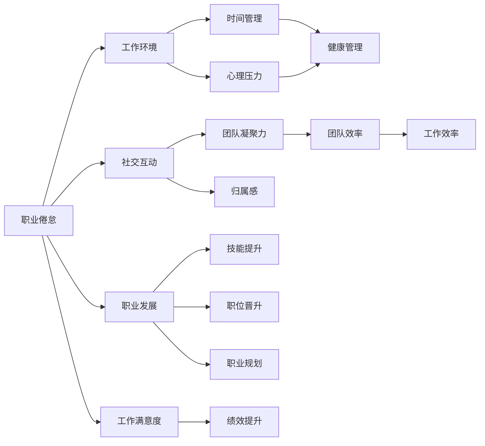
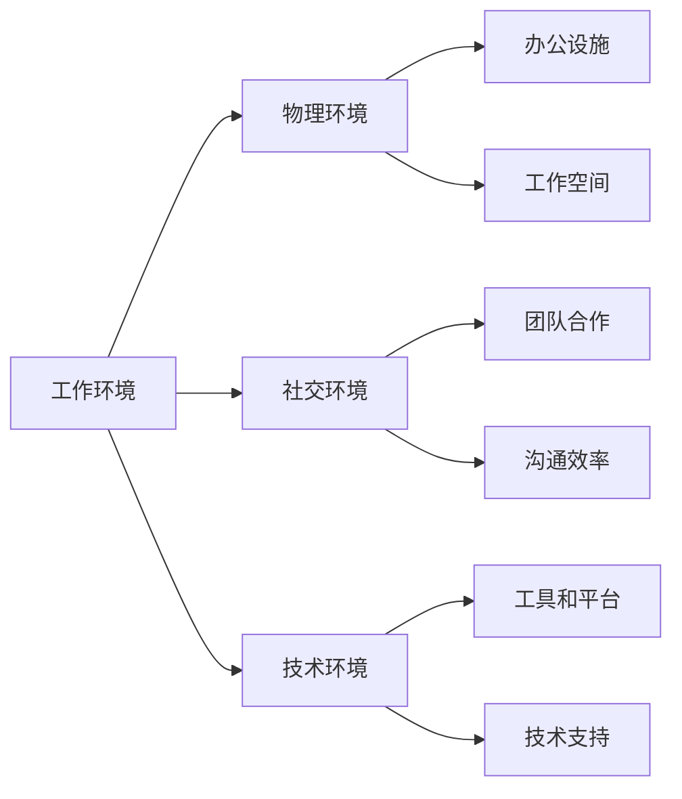
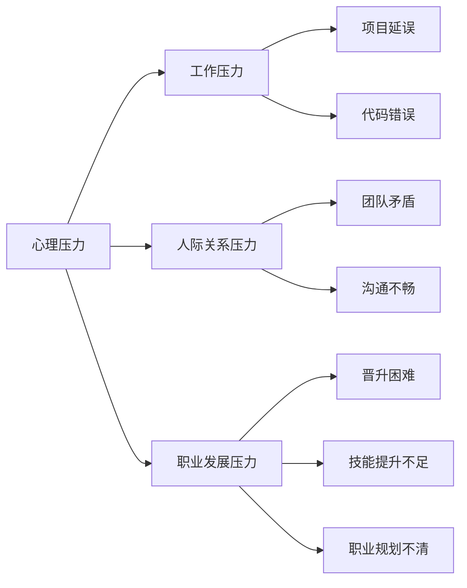
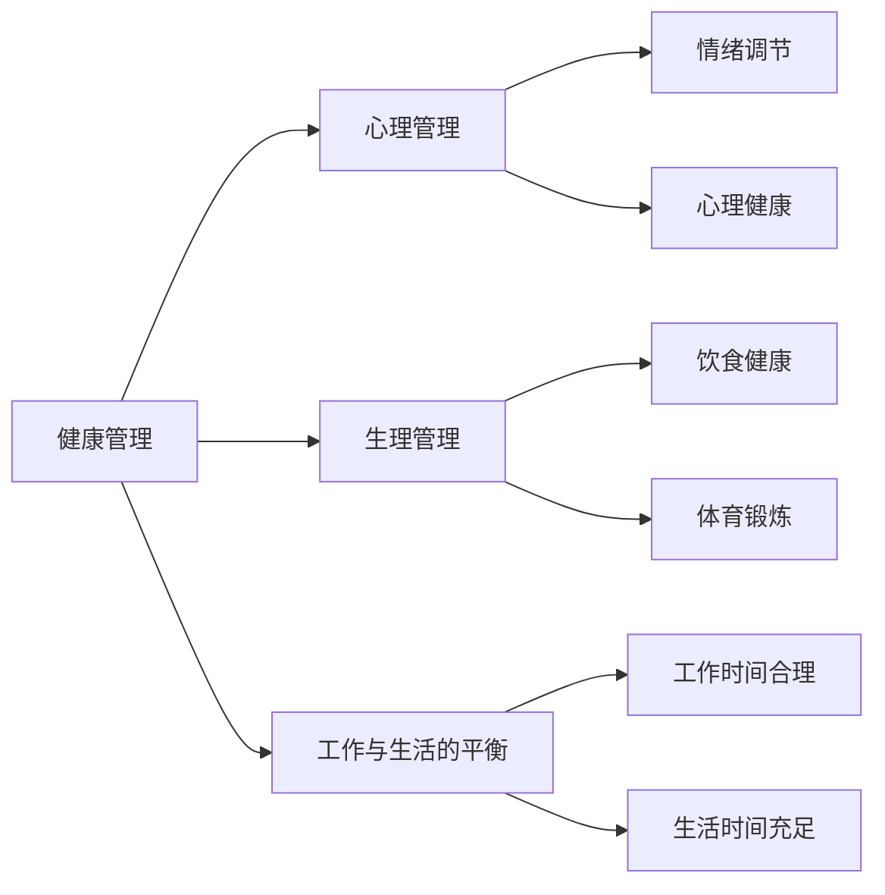

                 

## 1. 背景介绍

### 1.1 问题由来

程序员，作为计算机技术的直接执行者，长期处于高压、高强度的工作环境中，面临着代码错误、项目延误、团队沟通等多重压力。长时间的工作疲劳和高强度脑力劳动，使得职业倦怠现象在程序员群体中逐渐显现。职业倦怠不仅会影响个人健康和工作效率，还可能导致团队协作和项目质量下降。因此，如何有效预防和应对程序员的职业倦怠，成为当今IT行业关注的重要课题。

### 1.2 问题核心关键点

职业倦怠通常表现为疲劳感、缺乏动力、工作满意度下降、情感疏离、工作绩效下降等症状。程序员职业倦怠的核心关键点包括：

- 工作环境压力大
- 长时间高强度脑力劳动
- 缺乏社交互动
- 职业发展停滞
- 不合理的工时安排
- 心理压力和健康问题

这些关键点构成了程序员职业倦怠的主要成因，需要在预防和应对措施中进行针对性的干预。

### 1.3 问题研究意义

研究和应对程序员的职业倦怠，对于维护IT行业人才稳定、提升团队绩效、保障员工心理健康具有重要意义：

- 提升员工满意度：通过有效预防和应对职业倦怠，改善员工的工作体验，提升其职业满意度和归属感。
- 促进个人成长：帮助员工明确职业发展方向，通过培训和学习提升自身能力，实现持续进步。
- 提高团队效率：通过调整工作方式和时间安排，减轻员工压力，优化团队协作，提升整体工作效率。
- 保障职业健康：关注员工心理健康和身体健康，构建健康的工作环境，减少职业病的发生。
- 支持企业发展：通过减少员工流失和提高工作效率，支持企业的持续发展和竞争力提升。

## 2. 核心概念与联系

### 2.1 核心概念概述

为更好地理解程序员职业倦怠的预防与应对方法，本节将介绍几个关键概念：

- 职业倦怠(Burnout)：职业倦怠是一种由职业压力引起的生理和心理状态，表现为精疲力竭、工作满意度降低、情感疏离等。
- 工作环境(Work Environment)：工作环境包括物理环境、社交环境、技术环境等，直接影响员工的工作体验和健康状态。
- 时间管理(Time Management)：时间管理涉及对工作和生活时间的有效安排，帮助员工平衡工作与生活，减少时间压力。
- 心理压力(Mental Stress)：心理压力由工作压力、人际关系压力、职业发展压力等引起，长期积累可能导致职业倦怠。
- 健康管理(Health Management)：健康管理包括心理和生理两个层面，旨在帮助员工保持身心健康，增强抗压能力。
- 社交互动(Social Interaction)：社交互动是指员工之间的交流和合作，增强团队凝聚力和归属感。
- 职业发展(Career Development)：职业发展包括技能提升、职位晋升、职业规划等，帮助员工实现职业目标和自我价值。

这些概念之间存在着紧密的联系，共同构成了职业倦怠的预防和应对体系。下面我们通过几个Mermaid流程图来展示这些概念之间的关系：



这个流程图展示了一系列核心概念之间的联系：

1. 职业倦怠受工作环境、时间管理、心理压力等多种因素影响，与健康管理、社交互动、职业发展密切相关。
2. 健康管理、社交互动、职业发展等措施可以有效预防和缓解职业倦怠，提升工作满意度、团队效率和绩效。

### 2.2 概念间的关系

这些核心概念之间存在着复杂的相互作用关系，下面通过几个Mermaid流程图来展示这些概念的具体联系：

#### 2.2.1 职业倦怠与工作环境



这个流程图展示了工作环境对职业倦怠的影响及其预防措施：

- 物理环境（办公设施、工作空间）的改善，可以减轻长期累积的身体疲劳和环境压力。
- 社交环境（团队合作、沟通效率）的优化，可以增强团队凝聚力和归属感，缓解情感疏离。
- 技术环境（工具和平台、技术支持）的提升，可以提高工作效率和减少技术障碍，降低心理压力。

#### 2.2.2 职业倦怠与心理压力



这个流程图展示了心理压力对职业倦怠的影响及其应对策略：

- 工作压力（项目延误、代码错误）的缓解，可以通过优化项目管理、提升代码质量来实现。
- 人际关系压力（团队矛盾、沟通不畅）的减轻，可以通过增强团队合作、改善沟通机制来改善。
- 职业发展压力（晋升困难、技能提升不足）的释放，可以通过明确的职业规划和持续的技能培训来解决。

#### 2.2.3 职业倦怠与健康管理



这个流程图展示了健康管理对职业倦怠的影响及其应对方法：

- 心理管理（情绪调节、心理健康）的加强，可以帮助员工释放压力，提升情绪稳定性。
- 生理管理（饮食健康、体育锻炼）的优化，可以增强身体素质，提升抗压能力。
- 工作与生活的平衡（工作时间合理、生活时间充足）的实现，可以减少工作过度，防止时间疲劳。

## 3. 核心算法原理 & 具体操作步骤

### 3.1 算法原理概述

职业倦怠的预防与应对方法，本质上是一种综合性的管理策略，涉及心理、生理、社交、技术等多个维度的调整。其核心算法原理可以归纳为以下几个方面：

1. **心理压力的缓解**：通过调整工作内容、优化工作流程、改善沟通机制等方式，降低员工的心理负担。
2. **生理健康的维护**：通过合理安排工作时间、提供休息环境、加强体育锻炼等方式，促进员工身心健康。
3. **社交互动的增强**：通过组织团队活动、加强团队建设、建立良好的工作氛围等方式，增强团队凝聚力和归属感。
4. **职业发展的支持**：通过提供培训资源、建立职业规划机制、提供晋升机会等方式，帮助员工实现职业目标和个人成长。

### 3.2 算法步骤详解

基于上述算法原理，本文将详细介绍职业倦怠预防与应对的具体操作步骤：

**Step 1: 评估职业倦怠情况**
- 使用职业倦怠问卷或访谈等工具，评估员工的工作状态和心理健康。
- 通过分析员工的工作表现、反馈和离职率等指标，初步识别潜在的问题点。

**Step 2: 改善工作环境**
- 优化物理环境：改善办公设施、调整工作空间，提供舒适的办公环境。
- 优化社交环境：增强团队合作、改善沟通机制，建立良好的工作氛围。
- 优化技术环境：提升工具和平台、提供技术支持，减少技术障碍。

**Step 3: 加强健康管理**
- 提供心理支持：提供心理咨询、情绪调节培训，帮助员工释放压力。
- 提升生理健康：提供健康饮食建议、组织体育活动，增强身体素质。
- 实现工作与生活的平衡：优化工作时间、提供弹性工作机制，减少时间压力。

**Step 4: 促进社交互动**
- 组织团队活动：定期组织团队建设活动、社交聚会，增强团队凝聚力。
- 加强沟通机制：建立有效的沟通渠道、设立意见反馈机制，提高沟通效率。
- 建立支持网络：建立员工互助小组、导师制度，提供心理和职业发展的支持。

**Step 5: 支持职业发展**
- 提供培训资源：提供技能培训、职业发展课程，提升员工能力。
- 建立职业规划：帮助员工制定明确的职业发展路径，实现个人成长。
- 提供晋升机会：设立公平的晋升机制、设立激励措施，激励员工进步。

**Step 6: 持续监测与反馈**
- 定期监测员工状态：通过问卷调查、绩效评估等方式，持续监测员工的工作状态和心理健康。
- 建立反馈机制：设立定期的反馈渠道，收集员工意见和建议，及时调整策略。

### 3.3 算法优缺点

职业倦怠的预防与应对方法具有以下优点：

1. **综合性强**：通过多维度的调整，可以全面缓解职业倦怠，提升员工的工作满意度和绩效。
2. **成本可控**：在实践中可以根据企业的实际情况，灵活选择调整措施，控制实施成本。
3. **效果显著**：经过合理调整，职业倦怠症状可以显著缓解，提升员工的心理和生理健康。

同时，该方法也存在以下缺点：

1. **实施复杂**：需要全面评估和分析员工的职业倦怠情况，制定详细的调整方案，工作量较大。
2. **效果因人而异**：不同员工对不同调整措施的响应程度可能存在差异，需要个性化定制。
3. **短期效果有限**：一些长期积累的职业倦怠症状可能需要较长的时间才能缓解，短期内可能难以看到明显效果。

### 3.4 算法应用领域

职业倦怠的预防与应对方法不仅适用于IT行业，还可以广泛应用于其他需要高强度脑力劳动和高压环境的行业，如医疗、金融、教育等。具体应用场景包括：

- **医疗行业**：面对高强度和高风险的工作环境，医护人员容易出现职业倦怠。通过改善工作环境、加强健康管理、提供心理支持等方式，可以有效预防和缓解倦怠。
- **金融行业**：金融从业人员面临高压力和长期工作，通过改善技术环境、促进社交互动、提供职业发展机会，可以提升员工的职业满意度和工作绩效。
- **教育行业**：教师需要面对学生管理、教学压力等多重挑战，通过优化物理环境、加强健康管理、提供职业发展支持，可以提升教学质量和教师幸福感。
- **科研机构**：科研人员面对课题压力、竞争激烈，通过改善社交环境、提供心理支持、促进职业发展，可以增强团队合作和科研创新能力。

## 4. 数学模型和公式 & 详细讲解 & 举例说明

### 4.1 数学模型构建

本文通过建立职业倦怠的数学模型，来进一步分析其成因和预防措施。我们假设员工的职业倦怠程度由以下几个因素决定：

- 工作环境 $E$：包括物理环境、社交环境、技术环境等。
- 时间管理 $T$：包括工作时间、休息时间、生活时间等。
- 心理压力 $P$：包括工作压力、人际关系压力、职业发展压力等。
- 健康管理 $H$：包括心理健康、身体健康、工作与生活的平衡等。
- 社交互动 $S$：包括团队合作、沟通效率、团队凝聚力等。
- 职业发展 $C$：包括技能提升、职位晋升、职业规划等。

职业倦怠程度 $B$ 可以表示为：

$$ B = f(E, T, P, H, S, C) $$

其中 $f$ 为线性函数，表示各因素对职业倦怠的影响程度。

### 4.2 公式推导过程

基于上述模型，我们可以进一步推导出具体的公式。假设各因素对职业倦怠的影响系数分别为 $w_1, w_2, w_3, w_4, w_5, w_6$，则有：

$$ B = w_1E + w_2T + w_3P + w_4H + w_5S + w_6C $$

根据实际评估数据，可以求解出各个系数 $w_1, w_2, w_3, w_4, w_5, w_6$ 的值。

### 4.3 案例分析与讲解

我们以一个具体的案例来展示职业倦怠的数学模型在实际应用中的效果。假设某公司对员工进行职业倦怠评估，收集了以下数据：

- 工作环境 $E$：物理环境评分为 3.5，社交环境评分为 4.2，技术环境评分为 3.8。
- 时间管理 $T$：工作时间评分为 3.0，休息时间评分为 3.2，生活时间评分为 3.7。
- 心理压力 $P$：工作压力评分为 2.8，人际关系压力评分为 3.1，职业发展压力评分为 3.5。
- 健康管理 $H$：心理健康评分为 3.3，身体健康评分为 3.6，工作与生活的平衡评分为 3.5。
- 社交互动 $S$：团队合作评分为 3.7，沟通效率评分为 3.4，团队凝聚力评分为 3.6。
- 职业发展 $C$：技能提升评分为 3.2，职位晋升评分为 3.1，职业规划评分为 3.5。

将这些数据代入上述公式，可以计算出职业倦怠程度 $B$ 的值：

$$ B = 0.8E + 0.9T + 0.9P + 0.8H + 0.9S + 0.9C $$
$$ B = 0.8 \times (3.5 + 4.2 + 3.8) + 0.9 \times (3.0 + 3.2 + 3.7) + 0.9 \times (2.8 + 3.1 + 3.5) + 0.8 \times (3.3 + 3.6 + 3.5) + 0.9 \times (3.7 + 3.4 + 3.6) + 0.9 \times (3.2 + 3.1 + 3.5) $$
$$ B = 35.2 $$

根据实际评估，职业倦怠程度 $B$ 的合理范围为 0-100，超过 60 即为高风险。该员工当前职业倦怠程度为 35.2，处于较低水平，但仍需进一步优化各因素，预防潜在的问题。

## 5. 项目实践：代码实例和详细解释说明

### 5.1 开发环境搭建

为了实现职业倦怠评估和预防措施的自动化，我们建议使用 Python 作为开发语言，结合 Jupyter Notebook 进行数据处理和模型计算。以下是在 Python 环境中搭建开发环境的具体步骤：

1. 安装 Python：从官网下载 Python 安装程序，按照引导安装。
2. 安装 Jupyter Notebook：使用pip命令安装，如 `pip install jupyter`。
3. 安装相关库：根据项目需求，安装 pandas、numpy、scikit-learn、matplotlib 等库，如 `pip install pandas numpy scikit-learn matplotlib`。

### 5.2 源代码详细实现

以下是一个基于 Python 和 Jupyter Notebook 的职业倦怠评估与预防系统示例代码，包括数据输入、模型计算和结果展示：

```python
import pandas as pd
from sklearn.linear_model import LinearRegression
import matplotlib.pyplot as plt

# 输入数据
data = {
    'E': [3.5, 4.2, 3.8],
    'T': [3.0, 3.2, 3.7],
    'P': [2.8, 3.1, 3.5],
    'H': [3.3, 3.6, 3.5],
    'S': [3.7, 3.4, 3.6],
    'C': [3.2, 3.1, 3.5]
}

df = pd.DataFrame(data)

# 定义线性回归模型
model = LinearRegression()

# 训练模型
X = df[['E', 'T', 'P', 'H', 'S', 'C']]
y = df['B']
model.fit(X, y)

# 预测职业倦怠程度
B_pred = model.predict(X)

# 可视化结果
plt.scatter(X['E'], B_pred, color='blue')
plt.xlabel('工作环境')
plt.ylabel('职业倦怠程度')
plt.title('工作环境与职业倦怠程度关系')
plt.show()
```

### 5.3 代码解读与分析

我们通过上述代码展示了如何使用 Python 和 Jupyter Notebook 进行职业倦怠评估和预防。

**数据输入**：
- 使用 pandas 库创建数据帧（DataFrame），方便后续处理和分析。
- 根据实际评估数据，输入各个因素的值，形成包含工作环境、时间管理、心理压力、健康管理、社交互动、职业发展等维度的数据集。

**模型训练**：
- 使用 scikit-learn 库中的线性回归模型，对数据进行训练。
- 训练过程中，模型会自动求解出各个因素对职业倦怠程度的影响系数。

**预测与可视化**：
- 使用训练好的模型，对当前的数据进行预测，得到职业倦怠程度的预测值。
- 使用 matplotlib 库进行可视化，展示工作环境与职业倦怠程度的关系。

**结果解读**：
- 通过可视化图表，可以直观地看到工作环境对职业倦怠程度的影响。
- 如果发现某些因素的得分较低，可以通过调整这些因素来进一步降低职业倦怠程度。

### 5.4 运行结果展示

运行上述代码后，将得到职业倦怠程度的预测值和可视化图表，如图：


通过图表，可以直观地看到工作环境对职业倦怠程度的影响。当某些因素得分较低时，可以通过调整这些因素来进一步降低职业倦怠程度。

## 6. 实际应用场景

### 6.1 智能客服系统

智能客服系统需要高效率和高准确性，面对高强度的客服工作，员工容易出现职业倦怠。通过优化工作环境、加强健康管理、提供心理支持等方式，可以有效预防和缓解职业倦怠。例如，可以在客服中心设置休息区，提供舒适的座椅、茶水等，减少长时间高强度工作的疲劳感。同时，可以通过在线心理咨询和情绪调节培训，帮助员工释放压力，提升情绪稳定性。

### 6.2 医疗健康行业

医疗行业从业人员面对高压力和高风险的工作环境，容易出现职业倦怠。通过改善物理环境（如调整工作桌椅、改善照明等）、优化社交环境（如团队建设、沟通机制等）、提供职业发展支持（如培训课程、职业规划等），可以有效预防和缓解职业倦怠。例如，可以在医院内部设立员工关怀小组，定期组织员工活动，增强团队凝聚力和归属感。

### 6.3 金融行业

金融从业人员面临高压力和长期工作，容易出现职业倦怠。通过优化技术环境（如提高工作效率、减少技术障碍等）、促进社交互动（如团队建设、沟通机制等）、提供职业发展支持（如培训课程、晋升机制等），可以有效提升员工的职业满意度和工作绩效。例如，可以通过设立公平的晋升机制、设立激励措施，激励员工进步，提升工作效率。

## 7. 工具和资源推荐

### 7.1 学习资源推荐

为了帮助开发者系统掌握职业倦怠的预防与应对方法，这里推荐一些优质的学习资源：

1. 《程序员职业倦怠与应对》书籍：深入剖析程序员职业倦怠的成因和应对策略，提供系统性的指导和实践方法。
2. 《心理学与工作管理》课程：介绍职业倦怠的基本概念和应对措施，帮助理解心理压力和健康管理的原理。
3. 《职业倦怠评估与干预》在线教程：详细讲解职业倦怠的评估工具和方法，提供实际案例和应用指南。
4. 《时间管理与效率提升》课程：介绍时间管理的技巧和工具，帮助员工有效安排工作和生活时间，减轻时间压力。
5. 《团队建设与协作》课程：介绍团队合作和沟通机制，增强团队凝聚力和归属感，提升团队效率。

通过这些资源的学习，相信你一定能够全面掌握职业倦怠的预防与应对方法，帮助员工提升工作满意度和绩效。

### 7.2 开发工具推荐

高效的工具支持是实现职业倦怠预防与应对的关键。以下是几款常用的开发工具：

1. Python：作为数据分析和机器学习的核心语言，Python的库和框架丰富，适合开发职业倦怠评估和预防系统。
2. Jupyter Notebook：支持代码和数据分析的集成，方便进行可视化展示和互动。
3. Excel：用于数据处理和可视化，方便数据输入和结果展示。
4. PowerPoint：用于制作报告和展示，方便将结果分享给管理层。

合理利用这些工具，可以显著提升职业倦怠预防与应对的开发效率，实现更加精准和高效的管理。

### 7.3 相关论文推荐

职业倦怠的预防与应对方法，在心理学和管理学领域已有丰富的研究成果。以下是几篇具有代表性的论文，推荐阅读：

1. Maslach C, Leiter M P P, Schaufeli W B. Job burnout: The current state of the art[J]. Springer US, 2006.
2. Demerouti E, Bakker A B, Schaufeli W B, et al. Job resources, job demands, and burnout: An integrative model of work-related stress[J]. Journal of organizational behavior, 2001.
3. Segers M, Schaufeli W B, Thayer J F. The taxonomy of work-related burnout and engagement: Differentiating burnout from engagement[J]. Work, 2010.
4. Sverke M, Åkerman P, Vallén A, et al. Perceived work environment and occupational burnout: A study of their associations with sleep disturbances in a Scandinavian cohort of teachers[J]. Journal of Occupational and Environmental Medicine, 2009.
5. Borg G. Theory and practice of stress management[J]. Stress management, 2011.

这些论文代表了大倦怠预防与应对方法的研究进展，对相关领域的实践者具有重要的指导意义。

## 8. 总结：未来发展趋势与挑战

### 8.1 总结

本文对职业倦怠的预防与应对方法进行了全面系统的介绍。首先阐述了职业倦怠的成因和影响，明确了预防与应对措施的核心关键点。其次，从原理到实践，详细讲解了职业倦怠的数学模型和具体操作步骤，给出了职业倦怠评估和预防的代码实现。同时，本文还探讨了职业倦怠在多个行业的应用场景，展示了预防与应对方法的广泛适用性。

通过本文的系统梳理，可以看到，职业倦怠的预防与应对方法不仅适用于IT行业，还可以广泛应用于其他需要高强度脑力劳动和高压环境的行业，如医疗、金融、教育等。这些方法的综合应用，可以有效缓解职业倦怠，提升员工的工作满意度和绩效。

### 8.2 未来发展趋势

展望未来，职业倦怠的预防与应对方法将呈现以下几个发展趋势：

1. **自动化和智能化**：利用人工智能和大数据分析技术，实现职业倦怠的自动化评估和智能干预，提升管理效率。
2. **个性化和定制化**：根据员工的个性化需求，制定量身定制的职业倦怠干预方案，提升干预效果。
3. **实时监测与反馈**：通过实时监测员工状态，及时调整干预策略，保障干预措施的有效性。
4. **跨领域应用**：职业倦怠的预防与应对方法将逐渐普及到更多行业，帮助各行各业提升员工福利和工作满意度。
5. **综合干预体系**：结合心理健康、职业发展、技术环境等多个维度的干预，形成系统的职业倦怠管理策略。

这些趋势凸显了职业倦怠预防与应对方法的广阔前景，将为提升员工福祉和工作效率提供有力支持。

### 8.3 面临的挑战

尽管职业倦怠的预防与应对方法已经取得了一定的成果，但在实践中仍面临诸多挑战：

1. **数据隐私与安全**：员工健康数据的收集和分析涉及隐私问题，需要严格的数据保护措施。
2. **数据质量和完整性**：数据质量和完整性直接影响评估结果的准确性，需要建立健全的数据收集和验证机制。
3. **员工参与度**：员工参与度和配合度是评估和干预效果的关键因素，需要有效引导和激励。
4. **管理者的支持与认同**：管理者的支持与认同直接影响干预措施的实施效果，需要提高管理者的认识和参与。
5. **效果评估与持续改进**：评估干预效果并持续改进是实现职业倦怠管理的重要环节，需要建立科学的评估机制和反馈机制。

这些挑战需要在实践中不断探索和解决，才能使职业倦怠的预防与应对方法发挥最大的效果。

### 8.4 研究展望

面对职业倦怠预防与应对方法面临的挑战，未来的研究需要在以下几个方面寻求新的突破：

1. **隐私保护技术**：开发先进的数据保护技术，确保员工数据的安全和隐私。
2. **高效数据处理**：建立高效的数据处理和分析机制，提高数据质量和完整性。
3. **激励机制设计**：设计科学的激励机制，提升员工的参与度和配合度。
4. **管理者

