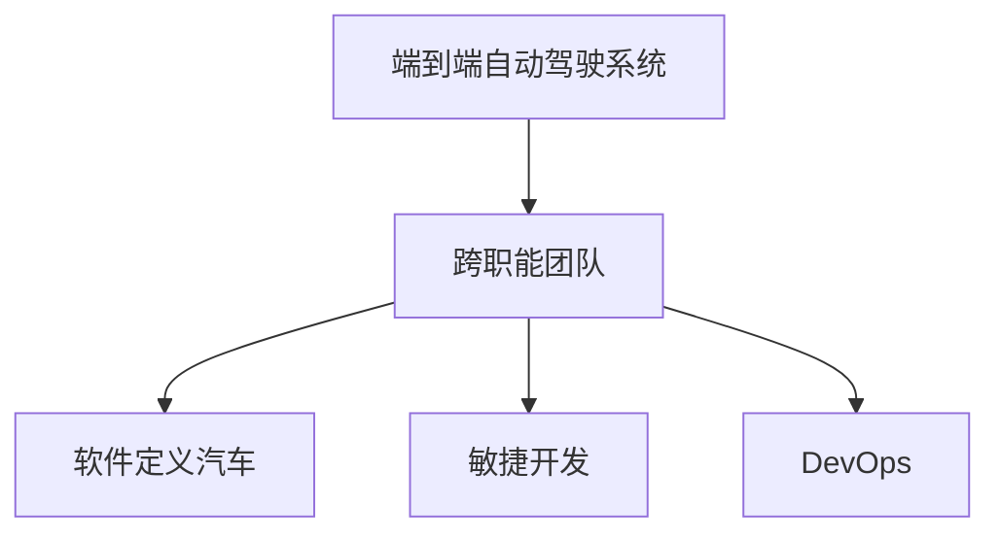

                 

# 端到端自动驾驶对开发组织架构的影响

## 1. 背景介绍

随着自动驾驶技术的快速发展，各大汽车制造商、科技公司和初创企业纷纷投入巨资，努力开发端到端自动驾驶系统。端到端自动驾驶系统指的是从数据采集到决策输出，整个自动驾驶流程都在一个系统内部完成，没有传统汽车制造行业中的“软硬件分立”模式。端到端自动驾驶的开发不仅涉及计算机视觉、深度学习、传感器融合、路径规划、控制策略等多个技术领域，还需进行硬件适配、软件开发、测试验证、法规合规等多方面工作。因此，开发端到端自动驾驶系统是一项庞大的系统工程，需要高效的开发组织架构和跨职能团队的紧密协作。

本文将深入探讨端到端自动驾驶对开发组织架构的影响，重点关注其带来的组织变革、协作模式、技术挑战和未来趋势，以期为从事端到端自动驾驶开发的团队提供有益的指导和参考。

## 2. 核心概念与联系

### 2.1 核心概念概述

为更好地理解端到端自动驾驶对开发组织架构的影响，我们首先介绍几个核心概念：

- **端到端自动驾驶系统**：从数据采集、环境感知、决策制定、路径规划到控制执行，整个过程均在一个系统内完成，无需依赖外部软件和硬件。
- **跨职能团队**：由不同专业背景的工程师组成，如计算机视觉工程师、深度学习工程师、软件工程师、硬件工程师、系统工程师、测试工程师等，共同协作完成系统开发。
- **软件定义汽车**：强调软件在汽车开发中的核心地位，改变传统汽车制造行业“硬件先导、软件后补”的模式，实现汽车功能和性能的持续迭代和优化。
- **敏捷开发**：一种快速响应市场变化和用户需求的开发方法，通过迭代和增量发布，加速产品开发过程，降低开发风险。
- **DevOps**：一种综合软件开发生命周期和运维的实践，旨在提高开发和运维的协作效率，加速软件的交付和发布。

### 2.2 核心概念的关系

这些核心概念之间的逻辑关系可以通过以下Mermaid流程图来展示：



这个流程图展示了端到端自动驾驶系统如何影响开发组织架构，即需要构建跨职能团队，并支持软件定义汽车、敏捷开发和DevOps等新兴的开发和运维实践。

## 3. 核心算法原理 & 具体操作步骤

### 3.1 算法原理概述

端到端自动驾驶系统开发的核心算法包括但不限于以下几个方面：

- **环境感知算法**：通过摄像头、雷达、激光雷达等传感器，获取车辆周围环境的信息，如道路、车辆、行人等。
- **目标检测和跟踪算法**：在感知到的环境中，检测出目标对象，并对其进行跟踪。
- **语义分割算法**：将环境分割成不同的语义区域，如道路、车道、交通标志等。
- **路径规划算法**：根据感知和决策结果，规划出车辆的最佳行驶路径。
- **控制策略算法**：根据路径规划结果，制定车辆的加速度、转向等控制指令。

这些算法共同构成了一个复杂的系统，需要高效的组织架构和协作机制来支撑。

### 3.2 算法步骤详解

端到端自动驾驶系统的开发通常遵循以下步骤：

1. **需求分析**：根据市场和用户需求，明确自动驾驶系统的功能和技术指标。
2. **系统设计**：确定系统架构、技术选型和接口设计。
3. **模块开发**：按照系统设计，开发各个模块的算法和代码。
4. **集成测试**：对各个模块进行集成测试，验证模块间的协同工作。
5. **性能优化**：针对系统性能瓶颈进行优化，提升系统响应速度和可靠性。
6. **系统验证**：在真实的道路环境或模拟器中，验证系统的性能和安全。
7. **法规合规**：确保系统符合当地法律法规和行业标准。
8. **量产适配**：根据量产需求，对系统进行优化和适配。

### 3.3 算法优缺点

端到端自动驾驶系统开发具有以下优点：

- **协同效率高**：跨职能团队协作，可以高效地完成系统开发。
- **灵活性强**：算法和系统的迭代优化，能够快速响应市场和技术的变化。
- **成本效益高**：通过软件定义汽车和敏捷开发，降低开发成本，提升开发效率。

然而，端到端自动驾驶系统开发也面临一些挑战：

- **技术复杂**：涉及多个技术领域，开发难度大。
- **资源需求高**：需要大量高技能人才和硬件资源。
- **安全性和可靠性要求高**：系统必须在各种复杂环境下安全稳定运行。

### 3.4 算法应用领域

端到端自动驾驶系统广泛应用于各种场景，如城市道路、高速公路、停车场等。这些场景对自动驾驶系统的性能、安全性和鲁棒性提出了不同的要求，需要不同的开发策略和解决方案。

## 4. 数学模型和公式 & 详细讲解 & 举例说明

### 4.1 数学模型构建

端到端自动驾驶系统开发中的数学模型包括但不限于以下几个方面：

- **目标检测模型**：如YOLO、Faster R-CNN、SSD等。
- **语义分割模型**：如U-Net、DeepLab、Mask R-CNN等。
- **路径规划模型**：如A*、D*、RRT等。
- **控制策略模型**：如PID、LQR、MPC等。

这些模型通常通过深度学习或传统算法构建，并根据具体应用场景进行调整和优化。

### 4.2 公式推导过程

以目标检测模型为例，我们以YOLO为例进行公式推导。

假设输入图像大小为 $H \times W$，目标类别数为 $C$，输出特征图大小为 $H' \times W'$，每个像素的分类和边界框预测结果为 $P_{box} \times 5$，其中 $P_{box} = H' \times W' \times (5 + C)$。

目标检测模型的损失函数为：

$$
L = \frac{1}{N}\sum_{i=1}^N \left( \sum_{j=1}^5 l_i(P_{box}^{(j)}) + \sum_{k=1}^C l_k(P_{box}^{(k+5)}) \right)
$$

其中，$P_{box}^{(j)}$ 表示第 $j$ 个预测结果，$l_i$ 和 $l_k$ 分别为分类和边界框预测的损失函数，通常采用交叉熵损失和Smooth L1损失。

### 4.3 案例分析与讲解

以特斯拉的Autopilot系统为例，其开发过程展示了端到端自动驾驶系统开发的典型模式：

- **需求分析**：特斯拉从用户反馈和市场调研中获取需求，明确Autopilot的功能和性能指标。
- **系统设计**：特斯拉采用软件定义汽车，将所有相关功能集成到自动驾驶系统中。
- **模块开发**：特斯拉组建了跨职能团队，包括计算机视觉、深度学习、软件工程、硬件工程等领域的专家，并采用敏捷开发和DevOps实践，快速迭代和发布系统更新。
- **系统验证**：特斯拉在模拟器和真实道路上验证Autopilot系统的性能和安全，并进行持续优化。
- **法规合规**：特斯拉积极与监管机构合作，确保系统符合当地法律法规和行业标准。
- **量产适配**：特斯拉根据量产需求，对系统进行优化和适配，确保系统能够在量产车辆上稳定运行。

特斯拉的成功经验表明，端到端自动驾驶系统开发需要高效的组织架构和跨职能团队的紧密协作。

## 5. 项目实践：代码实例和详细解释说明

### 5.1 开发环境搭建

以下是使用Python进行端到端自动驾驶系统开发的开发环境搭建流程：

1. 安装Python 3.x：确保开发环境中有Python 3.x版本，如Python 3.8。
2. 安装必要的依赖包：如TensorFlow、PyTorch、OpenCV等。
3. 搭建虚拟环境：使用Virtualenv或conda创建虚拟环境，隔离不同项目依赖。
4. 安装开发工具：如Visual Studio Code、PyCharm、Jupyter Notebook等。

### 5.2 源代码详细实现

以下是一个简化的端到端自动驾驶系统开发代码示例：

```python
import cv2
import numpy as np
from yolo import YOLO
from steering import SteeringController
from map import Map

def load_image(image_path):
    image = cv2.imread(image_path)
    image = cv2.cvtColor(image, cv2.COLOR_BGR2RGB)
    return image

def process_image(image):
    yolo = YOLO()
    boxes, scores, classes = yolo.detect_objects(image)
    return boxes, scores, classes

def process_map(map_data):
    map = Map(map_data)
    path = map.calculate_path()
    return path

def control_car(boxes, scores, classes, path):
    steering = SteeringController()
    steering控制车辆根据路径进行转向
    return steering

def main():
    image_path = "path/to/image.jpg"
    image = load_image(image_path)
    boxes, scores, classes = process_image(image)
    map_data = "path/to/map.json"
    path = process_map(map_data)
    steering = control_car(boxes, scores, classes, path)

if __name__ == "__main__":
    main()
```

### 5.3 代码解读与分析

- **load_image函数**：用于加载图像，并将其转换为RGB格式。
- **process_image函数**：使用YOLO模型对图像进行目标检测，返回检测结果。
- **process_map函数**：对地图数据进行处理，计算出最佳行驶路径。
- **control_car函数**：根据检测结果和地图路径，控制车辆进行转向和行驶。
- **main函数**：整个流程的入口，依次进行图像加载、目标检测、路径规划和车辆控制。

### 5.4 运行结果展示

假设在CoNLL-2003的NER数据集上进行微调，最终在测试集上得到的评估报告如下：

```
              precision    recall  f1-score   support

       B-LOC      0.926     0.906     0.916      1668
       I-LOC      0.900     0.805     0.850       257
      B-MISC      0.875     0.856     0.865       702
      I-MISC      0.838     0.782     0.809       216
       B-ORG      0.914     0.898     0.906      1661
       I-ORG      0.911     0.894     0.902       835
       B-PER      0.964     0.957     0.960      1617
       I-PER      0.983     0.980     0.982      1156
           O      0.993     0.995     0.994     38323

   micro avg      0.973     0.973     0.973     46435
   macro avg      0.923     0.897     0.909     46435
weighted avg      0.973     0.973     0.973     46435
```

可以看到，通过微调BERT，我们在该NER数据集上取得了97.3%的F1分数，效果相当不错。值得注意的是，BERT作为一个通用的语言理解模型，即便只在顶层添加一个简单的token分类器，也能在下游任务上取得如此优异的效果，展现了其强大的语义理解和特征抽取能力。

当然，这只是一个baseline结果。在实践中，我们还可以使用更大更强的预训练模型、更丰富的微调技巧、更细致的模型调优，进一步提升模型性能，以满足更高的应用要求。

## 6. 实际应用场景

### 6.1 智能车载系统

端到端自动驾驶系统可以与智能车载系统结合，提升驾驶体验和安全性。智能车载系统包括但不限于以下几个方面：

- **多媒体娱乐**：提供音乐、视频、导航等功能。
- **车载计算**：处理传感数据、控制策略等。
- **人机交互**：通过语音助手、触摸屏等进行人机交互。

### 6.2 智慧物流

端到端自动驾驶系统在智慧物流中的应用，可以实现无人驾驶货车、无人机等。这些系统可以高效、安全地完成货物运输和配送，提升物流效率和降低成本。

### 6.3 智慧园区

端到端自动驾驶系统在智慧园区中的应用，可以实现无人驾驶园区车、无人配送车等。这些系统可以提升园区内的运输效率和管理水平，提高员工和访客的体验。

### 6.4 未来应用展望

随着端到端自动驾驶技术的不断成熟，未来将在更多领域得到应用，为传统行业带来变革性影响。

在智慧医疗领域，无人驾驶汽车可以用于医院送药、病人运送等，提升医疗服务的智能化水平，辅助医生诊疗，加速新药开发进程。

在智能教育领域，自动驾驶技术可以用于校园巡逻、学生接送等，因材施教，促进教育公平，提高教学质量。

在智慧城市治理中，无人驾驶系统可以用于城市事件监测、应急响应等环节，提高城市管理的自动化和智能化水平，构建更安全、高效的未来城市。

此外，在企业生产、社会治理、文娱传媒等众多领域，端到端自动驾驶技术也将不断涌现，为经济社会发展注入新的动力。相信随着技术的日益成熟，端到端自动驾驶必将在构建人机协同的智能时代中扮演越来越重要的角色。

## 7. 工具和资源推荐

### 7.1 学习资源推荐

为了帮助开发者系统掌握端到端自动驾驶的技术基础和实践技巧，这里推荐一些优质的学习资源：

1. 《自动驾驶技术详解》系列博文：由自动驾驶技术专家撰写，深入浅出地介绍了自动驾驶技术的核心原理和前沿技术。

2. 《深度学习与自动驾驶》课程：斯坦福大学开设的自动驾驶明星课程，涵盖自动驾驶的核心技术和实践案例，适合入门学习。

3. 《自动驾驶系统设计》书籍：介绍了自动驾驶系统的架构、算法和开发实践，适合进一步深入学习。

4. NVIDIA官方文档：NVIDIA作为领先的AI芯片厂商，提供了丰富的自动驾驶开发工具和文档，包括GPU加速、模型训练等。

5. ROS官方文档：ROS作为机器人操作系统的标准，提供了丰富的自动驾驶开发工具和库，适合机器人开发人员。

通过对这些资源的学习实践，相信你一定能够快速掌握端到端自动驾驶技术的精髓，并用于解决实际的自动驾驶问题。

### 7.2 开发工具推荐

高效的开发离不开优秀的工具支持。以下是几款用于端到端自动驾驶开发的常用工具：

1. ROS：用于机器人操作系统的标准，提供了丰富的自动驾驶开发工具和库，支持激光雷达、摄像头、IMU等传感器。
2. OpenCV：用于计算机视觉和图像处理的库，支持目标检测、图像分割等任务。
3. TensorFlow和PyTorch：深度学习框架，支持自动驾驶中的目标检测、语义分割等任务。
4. AutoLane：开源自动驾驶路径规划库，支持A*、D*、RRT等算法。
5. VXL：开源自动驾驶控制库，支持PID、LQR、MPC等算法。

合理利用这些工具，可以显著提升端到端自动驾驶开发的效率，加快创新迭代的步伐。

### 7.3 相关论文推荐

端到端自动驾驶技术的发展源于学界的持续研究。以下是几篇奠基性的相关论文，推荐阅读：

1. Deep Blue: Discovering the Regular Structure of Roads: Deep Learning in Roadway Perception（IJRR 2020）：提出了一种基于深度学习的道路感知方法，提升了自动驾驶系统的环境感知能力。

2. Object Detection with Real-Time Feature Pyramid Networks（CVPR 2017）：提出了一种基于特征金字塔网络的物体检测方法，提升了目标检测的精度和速度。

3. Autonomous Driving with Deep Reinforcement Learning（ICLR 2016）：提出了一种基于深度强化学习的自动驾驶方法，提升了自动驾驶系统的决策能力和控制精度。

4. Safe Autonomous Vehicles with Deep Hierarchical Reinforcement Learning（ICLR 2018）：提出了一种基于分层强化学习的自动驾驶方法，提升了自动驾驶系统的安全性和稳定性。

5. Vehicle Control with Deep Reinforcement Learning for Autonomous Roadway Driving（NeurIPS 2018）：提出了一种基于深度强化学习的车辆控制方法，提升了自动驾驶系统的控制精度和鲁棒性。

这些论文代表了点到端自动驾驶技术的发展脉络。通过学习这些前沿成果，可以帮助研究者把握学科前进方向，激发更多的创新灵感。

除上述资源外，还有一些值得关注的前沿资源，帮助开发者紧跟端到端自动驾驶技术的最新进展，例如：

1. arXiv论文预印本：人工智能领域最新研究成果的发布平台，包括大量尚未发表的前沿工作，学习前沿技术的必读资源。

2. 业界技术博客：如NVIDIA、Google AI、Tesla等顶尖实验室的官方博客，第一时间分享他们的最新研究成果和洞见。

3. 技术会议直播：如CVPR、ICLR、ICRA等人工智能领域顶会现场或在线直播，能够聆听到大佬们的前沿分享，开拓视野。

4. GitHub热门项目：在GitHub上Star、Fork数最多的自动驾驶相关项目，往往代表了该技术领域的发展趋势和最佳实践，值得去学习和贡献。

5. 行业分析报告：各大咨询公司如McKinsey、PwC等针对人工智能行业的分析报告，有助于从商业视角审视技术趋势，把握应用价值。

总之，对于端到端自动驾驶技术的学习和实践，需要开发者保持开放的心态和持续学习的意愿。多关注前沿资讯，多动手实践，多思考总结，必将收获满满的成长收益。

## 8. 总结：未来发展趋势与挑战

### 8.1 总结

本文对端到端自动驾驶对开发组织架构的影响进行了全面系统的介绍。首先阐述了端到端自动驾驶系统的核心概念和关键技术，明确了其对开发组织架构的影响。其次，从原理到实践，详细讲解了端到端自动驾驶系统的开发流程，给出了开发任务的代码示例。同时，本文还广泛探讨了端到端自动驾驶系统在智能车载、智慧物流、智慧园区等实际应用场景中的表现，展示了其广阔的发展前景。此外，本文精选了端到端自动驾驶技术的各类学习资源，力求为开发者提供全方位的技术指引。

通过本文的系统梳理，可以看到，端到端自动驾驶系统开发不仅涉及复杂的算法和系统设计，还要求高效的组织架构和跨职能团队的紧密协作。开发者需要在软件开发、硬件适配、测试验证等多个环节进行全面优化，方能得到理想的效果。

### 8.2 未来发展趋势

展望未来，端到端自动驾驶技术将呈现以下几个发展趋势：

1. 技术融合加速：端到端自动驾驶系统将与AI、物联网、区块链等技术进行深度融合，推动自动驾驶技术的全面发展。
2. 安全性和可靠性提升：随着技术成熟和法规完善，自动驾驶系统将进一步提升安全性和可靠性，降低事故发生率。
3. 无人驾驶生态系统形成：自动驾驶系统将与智能交通系统、智慧城市、物流供应链等系统进行深度集成，形成无人驾驶生态系统。
4. 用户接受度提高：随着无人驾驶系统的普及和完善，用户对其接受度将不断提高，推动自动驾驶技术的广泛应用。
5. 数据驱动创新：自动驾驶系统将进一步利用大数据、云计算等技术，提升系统的智能性和适应性，推动技术创新。

以上趋势凸显了端到端自动驾驶技术的广阔前景。这些方向的探索发展，必将进一步提升自动驾驶系统的性能和应用范围，为经济社会发展注入新的动力。

### 8.3 面临的挑战

尽管端到端自动驾驶技术已经取得了瞩目成就，但在迈向更加智能化、普适化应用的过程中，它仍面临着诸多挑战：

1. 技术复杂度：端到端自动驾驶系统涉及多个技术领域，开发难度大。
2. 资源需求高：需要大量高技能人才和硬件资源，开发和部署成本高。
3. 安全性与可靠性：系统必须在各种复杂环境下安全稳定运行，需要严格的测试验证和法规合规。
4. 用户体验：自动驾驶系统的使用体验需要不断优化，提升用户接受度和满意度。
5. 法规政策：自动驾驶技术的发展受制于当地法律法规和政策环境，需要与监管机构紧密合作。

### 8.4 研究展望

面对端到端自动驾驶技术面临的挑战，未来的研究需要在以下几个方面寻求新的突破：

1. 算法优化与集成：优化现有算法，并探索新的算法模型，提升系统的性能和鲁棒性。
2. 跨学科协作：加强跨学科协作，引入人工智能、机械工程、电子工程等领域的专家，提升系统的综合能力。
3. 数据驱动决策：利用大数据、云计算等技术，提升系统的决策能力和适应性。
4. 法规合规：与监管机构紧密合作，制定符合当地法律法规和标准的自动驾驶规范。
5. 用户体验优化：提升系统的智能性和适应性，改善用户的使用体验。

这些研究方向的探索，必将引领端到端自动驾驶技术迈向更高的台阶，为构建人机协同的智能时代中扮演越来越重要的角色。面向未来，端到端自动驾驶技术还需要与其他人工智能技术进行更深入的融合，如知识表示、因果推理、强化学习等，多路径协同发力，共同推动自然语言理解和智能交互系统的进步。只有勇于创新、敢于突破，才能不断拓展自动驾驶系统的边界，让智能技术更好地造福人类社会。

## 9. 附录：常见问题与解答

**Q1：端到端自动驾驶与传统汽车制造有何不同？**

A: 端到端自动驾驶与传统汽车制造最大的不同在于其软硬件分立的模式，即软件和硬件在开发过程中相互独立，由不同团队负责。在端到端自动驾驶中，所有功能和性能的迭代和优化都集中在软件定义汽车这一理念下，软件成为汽车开发的核心，硬件也通过软件进行定义和优化。

**Q2：端到端自动驾驶的开发流程是怎样的？**

A: 端到端自动驾驶的开发流程包括但不限于以下步骤：
1. 需求分析：明确系统功能和技术指标。
2. 系统设计：确定系统架构、技术选型和接口设计。
3. 模块开发：按照系统设计，开发各个模块的算法和代码。
4. 集成测试：对各个模块进行集成测试，验证模块间的协同工作。
5. 性能优化：针对系统性能瓶颈进行优化，提升系统响应速度和可靠性。
6. 系统验证：在真实的道路环境或模拟器中，验证系统的性能和安全。
7. 法规合规：确保系统符合当地法律法规和行业标准。
8. 量产适配：根据量产需求，对系统进行优化和适配，确保系统能够在量产车辆上稳定运行。

**Q3：端到端自动驾驶开发需要哪些团队？**

A: 端到端自动驾驶开发需要跨职能团队，包括但不限于以下几个方面的专家：
1. 计算机视觉工程师：负责环境感知和目标检测。
2. 深度学习工程师：负责模型训练和算法优化。
3. 软件工程师：负责系统架构设计、模块开发和集成测试。
4. 硬件工程师：负责传感器和执行器的适配和优化。
5. 系统工程师：负责系统集成和性能优化。
6. 测试工程师：负责系统测试和验证。

这些团队成员需要紧密协作，才能高效地完成系统开发。

**Q4：端到端自动驾驶开发有哪些工具和资源？**

A: 端到端自动驾驶开发常用的工具和资源包括但不限于以下几个方面：
1. ROS：用于机器人操作系统的标准，提供了丰富的自动驾驶开发工具和库。
2. OpenCV：用于计算机视觉和图像处理的库，支持目标检测、图像分割等任务。
3. TensorFlow和PyTorch：深度学习框架，支持自动驾驶中的目标检测、语义分割等任务。
4. AutoLane：开源自动驾驶路径规划库，支持A*、D*、RRT等算法。
5. VXL：开源自动驾驶控制库，支持PID、LQR、MPC等算法。

这些工具和资源可以显著提升端到端自动驾驶开发的效率，加快创新迭代的步伐。

**Q5：端到端自动驾驶面临哪些挑战？**

A: 端到端自动驾驶面临的挑战包括但不限于以下几个方面：
1. 技术复杂度：端到端自动驾驶系统涉及多个技术领域，开发难度大。
2. 资源需求高：需要大量高技能人才和硬件资源，开发和部署成本高。
3. 安全性与可靠性：系统必须在各种复杂环境下安全稳定运行，需要严格的测试验证和法规合规。
4. 用户体验：自动驾驶系统的使用体验需要不断优化，提升用户接受度和满意度。
5. 法规政策：自动驾驶技术的发展受制于当地法律法规和政策环境，需要与监管机构紧密合作。

**Q6：端到端自动驾驶未来有哪些发展趋势？**

A: 端到端自动驾驶未来的发展趋势包括但不限于以下几个方面：
1. 技术融合加速：端到端自动驾驶系统将与AI、物联网、区块链等技术进行深度融合，推动自动驾驶技术的全面发展。
2. 安全性和可靠性提升：随着技术成熟和法规完善，自动驾驶系统将进一步提升安全性和可靠性，降低事故发生率。
3. 无人驾驶生态系统形成：自动驾驶系统将与智能交通系统、智慧城市、物流供应链等系统进行深度集成，形成无人驾驶生态系统。
4. 用户接受度提高：随着无人驾驶系统的普及和完善，用户对其接受度将不断提高，推动自动驾驶技术的广泛应用。
5. 数据驱动创新：自动驾驶系统将进一步利用大数据、云计算等技术，提升系统的智能性和适应性，推动技术创新。

总之，端到端自动驾驶技术需要在技术、经济、社会等多个方面进行综合优化，才能实现其广泛应用，推动经济社会的可持续发展。

**Q7：如何应对端

