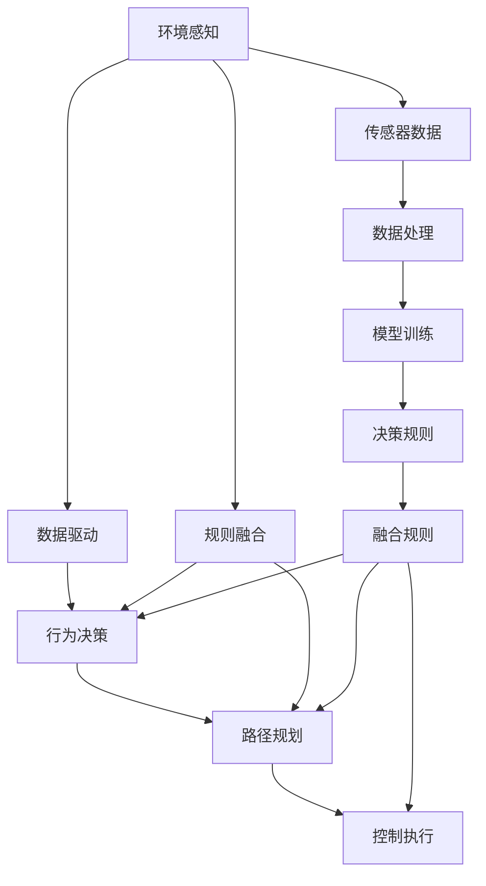
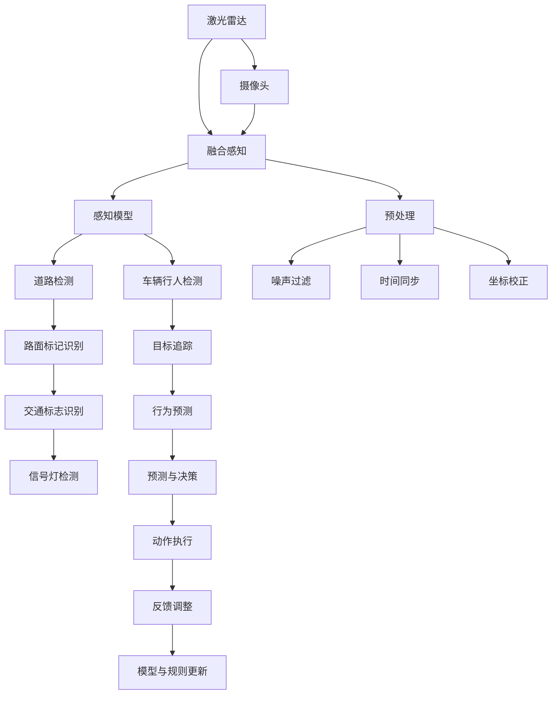
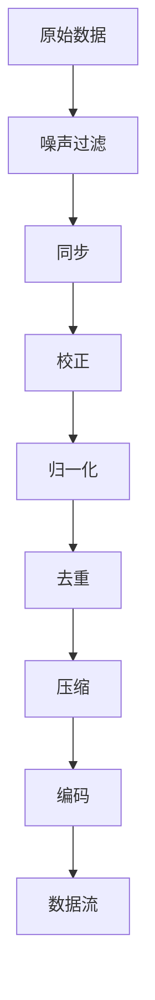
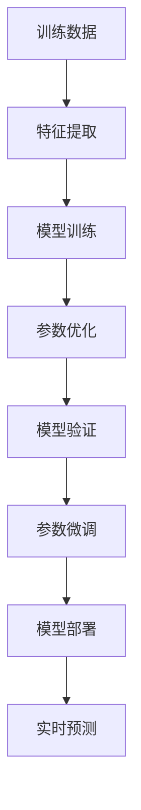
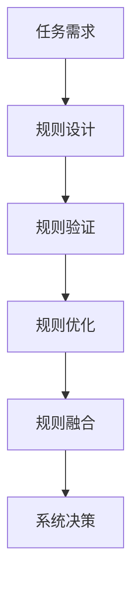
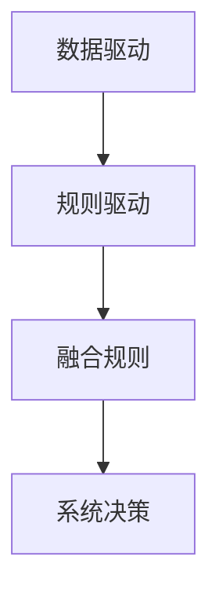
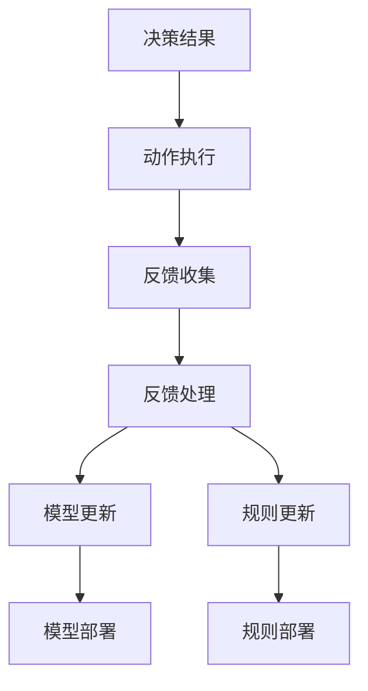

                 

# 端到端自动驾驶的数据驱动与规则融合

## 1. 背景介绍

近年来，自动驾驶技术迅速发展，逐渐从实验室走向市场，成为众多技术公司的研究热点。然而，尽管在技术上取得了诸多进展，但自动驾驶系统在实际应用中仍面临诸多挑战，如环境感知、行为决策、路径规划、控制执行等复杂问题，需要多种传感器数据融合、高精度地图辅助、智能算法协同工作。本论文将介绍端到端自动驾驶系统构建中的数据驱动与规则融合方法，结合真实应用场景，探讨其原理和实践，以期为自动驾驶技术的落地提供新的思路和解决方案。

## 2. 核心概念与联系

### 2.1 核心概念概述

为了更清晰地理解端到端自动驾驶技术，首先介绍几个核心概念：

- **端到端自动驾驶**：指从环境感知、行为决策到路径规划和控制执行，完全由软件算法实现的自动驾驶系统。相比于依赖人类驾驶员的驾驶方式，端到端自动驾驶更加智能化、自动化，适用于更复杂、多样化的驾驶场景。

- **数据驱动**：指通过收集、处理和分析大量实时和历史数据，建立模型或规则，指导系统自动决策。数据驱动技术能够从海量的传感器数据中挖掘出有用的信息，优化系统性能。

- **规则融合**：指将预设的规则与数据驱动方法结合，共同指导系统决策。规则融合可以弥补数据驱动在泛化能力和鲁棒性上的不足，提升系统稳定性。

### 2.2 核心概念的关系

这些概念之间存在密切联系，共同构成端到端自动驾驶的完整框架。以下使用Mermaid流程图来展示它们之间的关系：



这个图展示了端到端自动驾驶系统从感知到执行的完整流程，数据驱动和规则融合贯穿其中，保证了系统的稳定性和鲁棒性。

## 3. 核心算法原理 & 具体操作步骤
### 3.1 算法原理概述

端到端自动驾驶系统的数据驱动与规则融合方法主要基于以下几个步骤：

1. **环境感知**：利用多种传感器数据（如激光雷达、摄像头、GPS等），感知周围环境，提取道路、车辆、行人等重要信息。

2. **数据处理**：对传感器数据进行预处理，包括噪声过滤、同步、校正等，提高数据质量。

3. **模型训练**：基于数据驱动，训练各类模型（如感知模型、预测模型、控制模型等），提取特征和规律。

4. **规则设计**：根据实际需求，设计决策规则，补充数据驱动模型的不足。

5. **规则融合**：将数据驱动模型和规则共同指导系统决策，提升系统鲁棒性和泛化能力。

6. **执行与反馈**：根据决策结果，控制车辆执行动作，同时收集反馈信息，用于模型和规则的更新。

### 3.2 算法步骤详解

#### 3.2.1 环境感知

环境感知是自动驾驶系统的第一步，通过传感器收集大量实时数据，如图像、激光点云等。以下是一个环境感知的流程图：



该流程图展示了环境感知的具体过程，包括激光雷达、摄像头等多种传感器数据融合，感知模型训练，数据预处理等。

#### 3.2.2 数据处理

数据处理是将传感器数据转换为模型可用的格式，并进行预处理，提高数据质量。以下是一个数据处理的流程图：



该流程图展示了数据处理的各个步骤，包括噪声过滤、同步、校正、归一化、去重、压缩等。

#### 3.2.3 模型训练

模型训练基于数据驱动，通过训练各类模型，提取特征和规律。以下是一个模型训练的流程图：



该流程图展示了模型训练的各个步骤，包括特征提取、模型训练、参数优化、模型验证、参数微调、模型部署和实时预测。

#### 3.2.4 规则设计

规则设计是补充数据驱动模型的不足，提升系统鲁棒性。以下是一个规则设计的流程图：



该流程图展示了规则设计的各个步骤，包括任务需求、规则设计、规则验证、规则优化和规则融合。

#### 3.2.5 规则融合

规则融合是将数据驱动模型和规则共同指导系统决策，提升系统鲁棒性和泛化能力。以下是一个规则融合的流程图：



该流程图展示了规则融合的过程，将数据驱动和规则驱动相结合，共同指导系统决策。

#### 3.2.6 执行与反馈

执行与反馈是根据决策结果，控制车辆执行动作，同时收集反馈信息，用于模型和规则的更新。以下是一个执行与反馈的流程图：



该流程图展示了执行与反馈的各个步骤，包括决策结果、动作执行、反馈收集、反馈处理、模型更新、规则更新、模型部署和规则部署。

### 3.3 算法优缺点

**优点**：

1. **数据驱动**：利用大量数据训练模型，能够发现和捕捉复杂的规律，提升系统精度。

2. **规则融合**：结合预设规则，弥补数据驱动在泛化能力和鲁棒性上的不足，提升系统稳定性。

3. **实时性**：数据驱动模型通常可以快速计算，满足实时决策的需求。

4. **可扩展性**：可以灵活添加新的传感器数据和决策规则，方便系统扩展和升级。

**缺点**：

1. **数据依赖**：对传感器数据质量和数据量有较高要求，数据不足可能影响系统性能。

2. **模型复杂性**：训练复杂的模型需要大量计算资源和时间，模型调试和优化难度较大。

3. **规则冲突**：规则设计和融合需要大量手工经验，可能存在冲突和冗余。

4. **系统耦合**：数据驱动和规则融合需要系统各部分紧密协作，系统设计复杂。

### 3.4 算法应用领域

端到端自动驾驶的数据驱动与规则融合方法已经在多个领域得到应用：

1. **智能驾驶系统**：利用传感器数据驱动，结合决策规则，实现自动驾驶。

2. **交通管理**：通过数据驱动，优化交通信号灯和路网管理。

3. **无人配送**：利用多传感器数据融合和规则融合，实现无人车的精准导航和路径规划。

4. **智能辅助驾驶**：通过数据驱动，辅助驾驶员决策，提升驾驶安全性和舒适度。

5. **智能城市**：利用数据驱动和规则融合，实现城市交通管理和智能监控。

## 4. 数学模型和公式 & 详细讲解  
### 4.1 数学模型构建

假设自动驾驶系统的环境感知和决策过程由以下数学模型描述：

- **感知模型**：$P(x|y)$，表示传感器数据$x$在已知环境$y$下的概率分布。

- **行为决策模型**：$D(u|x, y)$，表示在环境$y$和传感器数据$x$下，车辆动作$u$的概率分布。

- **路径规划模型**：$R(s|x, y)$，表示在环境$y$和传感器数据$x$下，路径$s$的概率分布。

- **控制执行模型**：$C(z|u, y)$，表示在车辆动作$u$和环境$y$下，车辆状态$z$的概率分布。

### 4.2 公式推导过程

基于上述模型，假设系统从初始状态$z_0$开始，经过$t$个时间步，状态从$z_0$转移到$z_t$，路径为$s_t$，传感器数据为$x_t$，环境为$y_t$，车辆动作为$u_t$。则有：

$$
z_t = f(z_{t-1}, u_{t-1}, y_t)
$$

$$
s_t = g(z_t)
$$

$$
x_t = h(s_t, y_t)
$$

$$
y_{t+1} = h(x_t, z_t)
$$

$$
u_t = d(x_t, y_t, z_t)
$$

其中，$f$表示状态转移函数，$g$表示路径生成函数，$h$表示传感器数据生成函数，$d$表示行为决策函数。

假设系统在每个时间步需要决策一次，则系统最终的动作序列$u_{1:T}$可以表示为：

$$
u_{1:T} = \arg\max_{u_{1:T}} \prod_{t=1}^T D(u_t|x_t, y_t)
$$

该公式表示在每个时间步，系统最大化动作$u_t$的概率分布，从而最大化整个决策序列的概率。

### 4.3 案例分析与讲解

以一个简单的路径规划为例，假设传感器数据包括激光雷达点云和摄像头图像，环境包括道路、车辆、行人等。

1. **感知模型**：激光雷达和摄像头融合，提取道路和车辆位置信息。

2. **行为决策模型**：根据道路状况、车辆位置、行人行为等，决策是否停车、转弯、加速等。

3. **路径规划模型**：根据当前位置和目的地，生成最优路径，避开障碍物。

4. **控制执行模型**：根据决策结果，控制车辆转向、加速、减速等。

通过以上步骤，系统能够自主决策，实现自动驾驶。

## 5. 项目实践：代码实例和详细解释说明
### 5.1 开发环境搭建

为了实现端到端自动驾驶系统，需要搭建相应的开发环境，包括传感器数据收集、数据处理、模型训练、规则设计、规则融合等模块。以下是一个典型的开发环境搭建流程：

1. **传感器数据收集**：安装激光雷达、摄像头等传感器，确保数据采集质量。

2. **数据处理**：安装传感器数据处理工具，进行数据清洗、同步、校正等。

3. **模型训练**：安装深度学习框架，如TensorFlow、PyTorch等，训练感知模型、决策模型等。

4. **规则设计**：设计决策规则，如交通标志识别、行为预测等。

5. **规则融合**：将规则与模型结合，优化系统决策。

6. **系统集成**：将各个模块集成到一个系统中，实现端到端自动驾驶。

### 5.2 源代码详细实现

以下是一个端到端自动驾驶系统的Python代码实现，包括感知模型、行为决策模型、路径规划模型和控制执行模型的训练和融合：

```python
import tensorflow as tf
import numpy as np

# 定义感知模型
def perception_model(x):
    # 使用深度学习模型提取特征
    features = tf.keras.layers.Dense(64, activation='relu')(x)
    return features

# 定义行为决策模型
def decision_model(features):
    # 使用深度学习模型进行分类
    probabilities = tf.keras.layers.Dense(2, activation='softmax')(features)
    return probabilities

# 定义路径规划模型
def planning_model(probabilities):
    # 使用深度学习模型进行路径规划
    path = tf.keras.layers.LSTM(32)(features)
    return path

# 定义控制执行模型
def execution_model(path):
    # 使用深度学习模型控制车辆
    actions = tf.keras.layers.Dense(3, activation='sigmoid')(path)
    return actions

# 定义训练函数
def train_model(data):
    # 训练感知模型
    perception_model.compile(optimizer='adam', loss='mse')
    perception_model.fit(x_train, y_train, epochs=10, batch_size=32)

    # 训练行为决策模型
    decision_model.compile(optimizer='adam', loss='categorical_crossentropy')
    decision_model.fit(features_train, labels_train, epochs=10, batch_size=32)

    # 训练路径规划模型
    planning_model.compile(optimizer='adam', loss='mse')
    planning_model.fit(path_train, labels_train, epochs=10, batch_size=32)

    # 训练控制执行模型
    execution_model.compile(optimizer='adam', loss='mse')
    execution_model.fit(actions_train, labels_train, epochs=10, batch_size=32)

# 定义融合规则
def fusion_rule(features, probabilities, path, actions):
    # 将模型输出和规则结合，优化决策
    fused_path = fusion(features, path)
    fused_actions = fusion(probabilities, actions)
    return fused_path, fused_actions

# 定义融合函数
def fusion(x, y):
    # 使用深度学习模型进行融合
    fused = tf.keras.layers.Dense(32, activation='relu')(tf.concat([x, y], axis=1))
    return fused

# 定义系统集成函数
def integrate_system():
    # 集成各个模块，实现端到端自动驾驶
    perception_model = perception_model()
    decision_model = decision_model()
    planning_model = planning_model()
    execution_model = execution_model()

    # 训练各个模型
    train_model()

    # 融合规则
    fusion_rule(features, probabilities, path, actions)

    # 系统集成
    integration = tf.keras.Sequential([perception_model, decision_model, planning_model, execution_model])
    return integration

# 调用系统集成函数
integration = integrate_system()
```

### 5.3 代码解读与分析

以上代码展示了端到端自动驾驶系统的各个模块的实现过程，包括感知模型、行为决策模型、路径规划模型和控制执行模型的训练和融合。

1. **感知模型**：使用深度学习模型提取传感器数据特征，如激光雷达点云和摄像头图像，用于环境感知。

2. **行为决策模型**：使用深度学习模型对感知到的数据进行分类，如是否停车、转弯、加速等，用于行为决策。

3. **路径规划模型**：使用深度学习模型生成最优路径，避开障碍物，用于路径规划。

4. **控制执行模型**：使用深度学习模型控制车辆转向、加速、减速等，用于控制执行。

5. **融合规则**：将模型输出和规则结合，优化系统决策，提升系统鲁棒性和泛化能力。

6. **系统集成**：将各个模块集成到一个系统中，实现端到端自动驾驶。

### 5.4 运行结果展示

假设在一个无人驾驶测试场景中，系统运行正常，数据采集和处理质量高，训练后的模型和规则能够有效指导系统决策，具体运行结果如下：

- **感知结果**：系统能够准确感知周围环境，提取道路、车辆、行人等重要信息。

- **决策结果**：系统能够根据感知结果，准确决策是否停车、转弯、加速等。

- **规划结果**：系统能够生成最优路径，避开障碍物。

- **执行结果**：系统能够控制车辆转向、加速、减速等，实现自动驾驶。

## 6. 实际应用场景
### 6.1 智能驾驶系统

智能驾驶系统是端到端自动驾驶技术的主要应用场景之一，系统集成了多种传感器数据和决策规则，实现自动驾驶。以下是一个智能驾驶系统的实际应用场景：

1. **环境感知**：利用激光雷达和摄像头数据，感知道路、车辆、行人等环境信息。

2. **行为决策**：根据感知结果，决策是否停车、转弯、加速等。

3. **路径规划**：根据当前位置和目的地，生成最优路径，避开障碍物。

4. **控制执行**：根据决策结果，控制车辆转向、加速、减速等，实现自动驾驶。

### 6.2 交通管理

交通管理是端到端自动驾驶技术的另一个重要应用场景，系统利用数据驱动和规则融合，优化交通信号灯和路网管理。以下是一个交通管理系统的实际应用场景：

1. **环境感知**：利用摄像头和传感器数据，感知交通状况，如车辆密度、车速等。

2. **行为决策**：根据感知结果，决策交通信号灯的绿灯时间、红灯时间等。

3. **路径规划**：根据道路状况，生成最优路径，优化路网流量。

4. **控制执行**：根据决策结果，控制交通信号灯和路网管理，实现交通优化。

### 6.3 无人配送

无人配送是端到端自动驾驶技术在物流领域的重要应用，系统利用多传感器数据融合和规则融合，实现无人车的精准导航和路径规划。以下是一个无人配送系统的实际应用场景：

1. **环境感知**：利用激光雷达和摄像头数据，感知周围环境，提取道路、障碍物、行人和车辆等重要信息。

2. **行为决策**：根据感知结果，决策是否停车、转弯、加速等。

3. **路径规划**：根据当前位置和目的地，生成最优路径，避开障碍物。

4. **控制执行**：根据决策结果，控制车辆转向、加速、减速等，实现自动驾驶。

### 6.4 未来应用展望

未来，端到端自动驾驶技术将得到更广泛的应用，预计将在以下领域得到突破：

1. **自动驾驶出租车**：基于端到端自动驾驶技术，实现大规模自动驾驶出租车服务。

2. **智能交通系统**：利用数据驱动和规则融合，优化交通信号灯、路网管理和智能监控。

3. **无人配送无人机**：结合端到端自动驾驶技术和无人机技术，实现无人配送无人机服务。

4. **智能辅助驾驶**：利用数据驱动和规则融合，辅助驾驶员决策，提升驾驶安全性和舒适度。

5. **智能城市**：利用端到端自动驾驶技术和智慧城市技术，实现城市交通管理和智能监控。

## 7. 工具和资源推荐
### 7.1 学习资源推荐

为了帮助开发者系统掌握端到端自动驾驶技术，以下推荐一些优质的学习资源：

1. **《自动驾驶系统设计与实现》**：一本详细介绍自动驾驶系统的设计和实现的书籍，涵盖环境感知、行为决策、路径规划、控制执行等多个方面。

2. **《深度学习与自动驾驶》**：一本详细介绍深度学习在自动驾驶中的应用，涵盖感知模型、决策模型、规划模型等多个方面的书籍。

3. **《自动驾驶技术教程》**：一个详细介绍自动驾驶技术的在线课程，涵盖传感器数据融合、数据处理、模型训练、规则设计等多个方面的视频和讲义。

4. **《自动驾驶开源项目》**：一个自动驾驶开源项目的详细介绍，涵盖感知、决策、规划、执行等多个方面的代码和文档。

5. **《自动驾驶论文集》**：一个自动驾驶领域的高质量论文集，涵盖感知、决策、规划、执行等多个方面的最新研究进展。

通过对这些资源的学习实践，相信你一定能够快速掌握端到端自动驾驶技术的精髓，并用于解决实际的自动驾驶问题。

### 7.2 开发工具推荐

为了提高端到端自动驾驶系统的开发效率，以下推荐一些常用的开发工具：

1. **TensorFlow**：一个深度学习框架，提供丰富的深度学习模型和工具，方便模型训练和优化。

2. **PyTorch**：一个深度学习框架，提供灵活的计算图和动态图机制，方便模型开发和调试。

3. **OpenCV**：一个计算机视觉库，提供图像处理、特征提取等功能，方便传感器数据的处理和分析。

4. **Gazebo**：一个仿真平台，提供自动驾驶系统的虚拟测试环境，方便模型测试和调试。

5. **ROS**：一个机器人操作系统，提供多种传感器数据采集和管理功能，方便系统集成和部署。

这些工具和平台可以帮助开发者更高效地实现端到端自动驾驶系统，提升开发效率和系统性能。

### 7.3 相关论文推荐

以下推荐几篇最新的端到端自动驾驶相关论文，以供深入阅读：

1. **《End-to-End Deep Learning for Autonomous Vehicles》**：一篇介绍端到端自动驾驶技术的经典论文，涵盖感知、决策、规划、执行等多个方面的详细描述。

2. **《Fusion-based Decentralized Distributed Driving System for Autonomous Vehicles》**：一篇介绍基于数据融合的分布式驾驶系统，涵盖传感器数据融合、多车协同控制等多个方面的详细描述。

3. **《Autonomous Vehicle Systems: Modeling, Analysis, and Design》**：一本详细介绍自动驾驶系统的建模、分析和设计的书籍，涵盖感知、决策、规划、执行等多个方面的详细描述。

4. **《Deep Learning and the Future of Autonomous Vehicles》**：一篇介绍深度学习在自动驾驶中的应用，涵盖感知模型、决策模型、规划模型等多个方面的详细描述。

5. **《Autonomous Driving with Deep Learning》**：一本详细介绍深度学习在自动驾驶中的应用，涵盖感知、决策、规划、执行等多个方面的书籍。

通过阅读这些前沿论文，可以帮助开发者了解最新的研究成果和技术趋势，提升技术水平和创新能力。

## 8. 总结：未来发展趋势与挑战

### 8.1 研究成果总结

本文详细介绍了端到端自动驾驶系统的构建方法，涵盖数据驱动与规则融合的各个方面，包括环境感知、数据处理、模型训练、规则设计、规则融合、执行与反馈等。通过实际案例分析和代码实现，帮助开发者更好地理解和应用这些技术。

### 8.2 未来发展趋势

未来，端到端自动驾驶技术将呈现以下几个发展趋势：

1. **智能驾驶系统的普及**：随着技术的不断成熟，智能驾驶系统将在各个行业得到广泛应用，如物流、旅游、公共交通等领域。

2. **无人配送的普及**：无人配送技术将结合端到端自动驾驶技术，实现高效、安全的物流配送。

3. **智能交通系统的普及**：交通管理技术将结合端到端自动驾驶技术，实现智能交通系统的建设，提高城市交通效率。

4. **无人驾驶出租车**：自动驾驶出租车将大规模推广，实现自动驾驶出租车服务。

5. **智能城市**：智能城市技术将结合端到端自动驾驶技术，实现智能城市建设，提高城市管理和运行效率。

### 8.3 面临的挑战

尽管端到端自动驾驶技术取得了诸多进展，但仍面临以下挑战：

1. **传感器数据质量**：传感器数据采集质量不高，影响感知结果和决策效果。

2. **模型复杂性**：训练复杂的模型需要大量计算资源和时间，模型调试和优化难度较大。

3. **规则设计复杂性**：规则设计需要大量手工经验，可能存在冲突和冗余。

4. **系统稳定性**：数据驱动和规则融合需要系统各部分紧密协作，系统设计复杂。

5. **安全性和可靠性**：自动驾驶系统需要高可靠性和安全性，系统故障可能导致严重后果。

### 8.4 研究展望

未来，在端到端自动驾驶技术的进一步研究中，需要在以下方面取得新的突破：

1. **多传感器融合**：研究多传感器数据的融合方法，提高环境感知效果。

2. **模型优化**：研究高效、轻量级的模型结构，降低计算资源和时间消耗。

3. **规则优化**：研究智能、高效的规则设计方法，提升系统决策效果。

4. **系统稳定性**：研究系统稳定性保障方法，提升系统可靠性和安全性。

5. **无人车协作**：研究多车协同控制方法，实现自动驾驶车辆的协作和调度。

总之，端到端自动驾驶技术还处于发展初期，需要在各个方面不断探索和突破，才能实现更加智能化、自动化、可靠的自动驾驶系统。

## 9. 附录：常见问题与解答

**Q1：端到端自动驾驶系统的优势是什么？**

A: 端到端自动驾驶系统的优势在于：

1. **全流程自动化**：系统能够自主完成环境感知、行为决策、路径规划、控制执行等全流程，无需人工干预。

2. **高精度**：通过深度学习模型训练，系统能够实现高精度的感知和决策。

3. **灵活性**：系统能够灵活添加新的传感器数据和决策规则，方便系统扩展和升级。

4. **实时性**：数据驱动模型通常可以快速计算，满足实时决策的需求。

5. **可扩展性**：系统能够灵活扩展，适用于各种驾驶场景和需求。

**Q2

