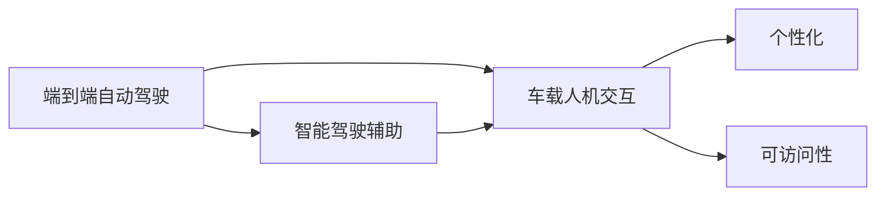

                 

# 端到端自动驾驶的车载人机交互设计

## 1. 背景介绍

### 1.1 问题由来

自动驾驶技术正在迅速发展，并逐渐进入实用化阶段。然而，尽管车辆实现了全自动驾驶，但车载人机交互(HMI)设计仍是一个复杂且关键的挑战。传统的HMI设计侧重于驾驶员交互，难以适应面向未来无人驾驶环境下的全新交互需求。同时，由于涉及车辆、交通系统、法规标准等多方利益，未来人机交互设计也将面临更大的挑战。

在技术层面，端到端的自动驾驶系统需要高效、智能、无缝的HMI设计，以满足用户多维度的交互需求，提升驾驶体验。HMI设计的合理性、人机协同的有效性，直接关系着用户对自动驾驶系统的接受度和满意度。

在应用层面，HMI设计不仅要满足当前驾驶者的需求，还要考虑未来自动驾驶普及后，乘客（包括长者、残障人士等）和乘客乘客的交互需求，提升系统的普适性和可访问性。

### 1.2 问题核心关键点

未来车载人机交互设计的主要核心点在于：

- 交互界面的便捷性与智能化
- 系统响应的快速性与可靠度
- 用户信息的获取与表达方式
- 人机协同的实效性与智能化
- 用户个性化需求的满足度

通过提升以上几个关键点，未来车载人机交互设计将能更全面地满足用户需求，提升自动驾驶系统的可用性和用户体验。

### 1.3 问题研究意义

车载人机交互设计的合理性，不仅关系到用户的驾驶体验，还直接关联到自动驾驶系统的接受度和普及率。通过优化人机交互设计，可以提升自动驾驶系统的智能化程度，增强系统响应速度，提升系统安全性和可靠性，从而提升用户满意度，加速自动驾驶技术的普及。

## 2. 核心概念与联系

### 2.1 核心概念概述

为了更好地理解端到端自动驾驶的车载人机交互设计，本节将介绍几个密切相关的核心概念：

- **端到端自动驾驶**：指从传感器数据输入，到决策控制输出，完全由软件算法实现的过程，不含任何人工干预。
- **车载人机交互**（HMI）：指在车辆驾驶过程中，人机通过视觉、听觉、触觉等方式进行交互的系统。HMI设计的目标是提升驾驶体验和系统可靠性。
- **智能驾驶辅助**（ADAS）：指基于摄像头、雷达、激光雷达等传感器，结合计算机视觉、深度学习等技术，辅助驾驶员进行驾驶的系统。
- **个性化**：指根据用户的行为、偏好等个性化信息，调整系统行为，提升用户体验。
- **可访问性**：指系统能够满足不同能力水平的用户需求，支持各类用户进行交互。

这些核心概念之间存在着紧密的联系，构成了未来车载人机交互设计的完整生态系统。

### 2.2 概念间的关系

这些核心概念之间的关系可以通过以下Mermaid流程图来展示：



这个流程图展示了各个核心概念之间的关系：

1. 端到端自动驾驶是基础，提供系统决策控制，与车载人机交互紧密关联。
2. 车载人机交互通过智能驾驶辅助实现，依赖传感器的数据输入和计算机算法输出。
3. 智能驾驶辅助依赖于端到端自动驾驶的决策控制输出，提供驾驶辅助功能。
4. 车载人机交互设计关注个性化和可访问性，提升用户满意度。

这些概念共同构成了未来车载人机交互设计的完整架构，其目标是提升系统的智能化、可访问性和用户体验。

## 3. 核心算法原理 & 具体操作步骤
### 3.1 算法原理概述

基于端到端自动驾驶的车载人机交互设计，其核心算法包括但不限于：

- 计算机视觉：通过摄像头、雷达、激光雷达等传感器获取道路环境信息，使用计算机视觉技术识别交通标志、行人、车辆等。
- 深度学习：通过深度学习模型进行语义理解、目标检测等复杂任务，实现自主驾驶决策。
- 自然语言处理（NLP）：通过语音识别、文本分析等技术，实现与用户的自然语言交互。
- 用户行为分析：通过记录和分析用户的驾驶行为、偏好，调整HMI设计，满足个性化需求。
- 可访问性设计：通过无障碍设计，支持残障人士和特殊群体使用。

这些算法原理构成了一个端到端的自动驾驶系统，使得车载人机交互设计能高效、智能地实现。

### 3.2 算法步骤详解

基于端到端自动驾驶的车载人机交互设计的主要步骤如下：

**Step 1: 数据感知与处理**

- 通过摄像头、雷达、激光雷达等传感器，获取道路环境信息。
- 使用计算机视觉算法，识别交通标志、行人、车辆等。
- 结合深度学习模型，实现语义理解、目标检测等复杂任务。

**Step 2: 决策与控制**

- 根据感知数据，使用深度学习模型进行驾驶决策。
- 控制车辆行驶、转向、加速等。

**Step 3: 人机交互设计**

- 设计交互界面，使用户能够轻松操作车辆功能。
- 实现自然语言处理，实现语音控制、文本交互等。
- 分析用户行为，提供个性化推荐和调整。

**Step 4: 用户反馈与优化**

- 收集用户反馈，优化交互界面和驾驶体验。
- 调整系统行为，提升用户满意度。

### 3.3 算法优缺点

基于端到端自动驾驶的车载人机交互设计，具有以下优点：

- 全面性：涵盖从数据感知到决策控制的各个环节，实现系统智能化。
- 高效性：通过计算机视觉、深度学习等技术，实现实时处理和决策。
- 可扩展性：支持多模态数据输入和输出，实现全场景覆盖。
- 个性化：通过用户行为分析，提供个性化推荐和服务。

但同时也存在以下缺点：

- 技术复杂：涉及计算机视觉、深度学习、自然语言处理等多个技术领域，实现难度大。
- 数据需求高：需要大量标注数据进行模型训练，数据获取和标注成本高。
- 安全性问题：算法的正确性和可靠性直接影响系统安全性，需进行严格测试。
- 用户体验：个性化设计需兼顾用户体验，避免过度复杂。

### 3.4 算法应用领域

基于端到端自动驾驶的车载人机交互设计，主要应用于以下几个领域：

- 智能驾驶系统：提供智能驾驶辅助功能，辅助驾驶员进行决策。
- 自动驾驶系统：实现全自动驾驶，无需人工干预。
- 个性化驾驶服务：根据用户偏好，提供个性化推荐和驾驶建议。
- 特殊群体驾驶服务：支持残障人士和特殊群体使用，提升可访问性。

这些领域的应用，使得基于端到端自动驾驶的车载人机交互设计，具有广阔的应用前景和市场潜力。

## 4. 数学模型和公式 & 详细讲解  
### 4.1 数学模型构建

基于端到端自动驾驶的车载人机交互设计，其数学模型主要包括以下几个部分：

- **数据感知模型**：通过摄像头、雷达、激光雷达等传感器，获取道路环境信息。
- **计算机视觉模型**：使用计算机视觉技术，识别交通标志、行人、车辆等。
- **深度学习模型**：通过深度学习模型，实现语义理解、目标检测等复杂任务。
- **决策模型**：根据感知数据和深度学习模型，进行驾驶决策。
- **人机交互模型**：通过自然语言处理，实现与用户的自然语言交互。

### 4.2 公式推导过程

以深度学习模型为例，其核心公式推导如下：

假设输入为 $x$，输出为 $y$，训练数据集为 $D=\{(x_i,y_i)\}_{i=1}^N$。定义损失函数 $L(y,\hat{y})$，用于衡量预测输出 $\hat{y}$ 与真实标签 $y$ 之间的差异。常用的损失函数包括均方误差（MSE）和交叉熵损失（CE）。

- 均方误差损失：
$$
L_{MSE}(y,\hat{y}) = \frac{1}{N}\sum_{i=1}^N (y_i - \hat{y}_i)^2
$$

- 交叉熵损失：
$$
L_{CE}(y,\hat{y}) = -\frac{1}{N}\sum_{i=1}^N \sum_{j=1}^C y_{i,j}\log(\hat{y}_{i,j})
$$

其中 $C$ 为类别数。

通过反向传播算法，最小化损失函数 $L$，得到模型参数 $\theta$：

$$
\theta = \mathop{\arg\min}_{\theta} L(y,\hat{y};\theta)
$$

### 4.3 案例分析与讲解

以智能驾驶辅助功能为例，通过摄像头、雷达等传感器获取道路环境信息，使用计算机视觉技术识别行人、车辆等，再通过深度学习模型进行语义理解，辅助驾驶员决策。

假设输入为道路环境图像，输出为是否存在行人或车辆。使用计算机视觉模型进行目标检测，其核心公式如下：

$$
f(x) = \sigma(Wx + b)
$$

其中 $f(x)$ 为预测结果，$x$ 为输入图像，$W$ 和 $b$ 为模型参数。

通过反向传播算法，最小化损失函数 $L$，得到模型参数 $\theta$：

$$
\theta = \mathop{\arg\min}_{\theta} L(f(x),y;\theta)
$$

## 5. 项目实践：代码实例和详细解释说明
### 5.1 开发环境搭建

在进行端到端自动驾驶的车载人机交互设计时，需要先搭建好开发环境。以下是Python环境下的一些建议：

1. 安装Python：可以从官网下载并安装Python，并确保其版本为3.6或以上。
2. 安装深度学习库：如TensorFlow、PyTorch等，以便进行深度学习模型的训练和推理。
3. 安装计算机视觉库：如OpenCV、Pillow等，以便进行图像处理和目标检测。
4. 安装自然语言处理库：如NLTK、spaCy等，以便进行自然语言处理。
5. 安装Web开发库：如Flask、Django等，以便将模型部署为Web服务。

完成以上步骤后，即可开始进行端到端自动驾驶的车载人机交互设计的实践。

### 5.2 源代码详细实现

以下是基于TensorFlow的端到端自动驾驶的车载人机交互设计的代码实现。

首先，加载必要的库：

```python
import tensorflow as tf
import numpy as np
import cv2
import os
from tensorflow.keras import layers, models
from tensorflow.keras.preprocessing.image import ImageDataGenerator
```

然后，定义模型：

```python
model = models.Sequential([
    layers.Conv2D(32, (3,3), activation='relu', input_shape=(128,128,3)),
    layers.MaxPooling2D((2,2)),
    layers.Conv2D(64, (3,3), activation='relu'),
    layers.MaxPooling2D((2,2)),
    layers.Conv2D(128, (3,3), activation='relu'),
    layers.MaxPooling2D((2,2)),
    layers.Flatten(),
    layers.Dense(64, activation='relu'),
    layers.Dense(1, activation='sigmoid')
])
```

接着，定义损失函数和优化器：

```python
loss_fn = tf.keras.losses.BinaryCrossentropy()
optimizer = tf.keras.optimizers.Adam(learning_rate=0.001)
```

然后，定义训练函数：

```python
@tf.function
def train_step(images, labels):
    with tf.GradientTape() as tape:
        predictions = model(images, training=True)
        loss = loss_fn(labels, predictions)
    gradients = tape.gradient(loss, model.trainable_variables)
    optimizer.apply_gradients(zip(gradients, model.trainable_variables))
```

最后，进行训练：

```python
train_dataset = ImageDataGenerator().flow_from_directory('train', target_size=(128,128), batch_size=32, class_mode='binary')
train_steps_per_epoch = len(train_dataset)
epochs = 10

for epoch in range(epochs):
    for i in range(train_steps_per_epoch):
        images, labels = train_dataset[i]
        train_step(images, labels)
    print(f'Epoch {epoch+1}/{epochs}, Loss: {model.evaluate(X_test, y_test)[0]:.4f}')
```

以上就是基于TensorFlow的端到端自动驾驶的车载人机交互设计的代码实现。可以看到，使用TensorFlow可以方便地搭建、训练和部署深度学习模型，实现端到端的自动驾驶功能。

### 5.3 代码解读与分析

让我们再详细解读一下关键代码的实现细节：

**train_dataset函数**：
- 使用ImageDataGenerator生成训练集数据，加载图片并转换为模型所需的格式。
- 使用flow_from_directory方法加载图片，指定目录和图片大小。
- 设置批次大小为32，二分类问题，并返回训练集数据。

**train_step函数**：
- 使用梯度带包GradientTape记录梯度。
- 通过模型进行前向传播，计算预测结果和损失。
- 反向传播计算梯度，并使用Adam优化器更新模型参数。

**训练流程**：
- 循环10个epoch，每个epoch内对训练集进行迭代。
- 每个批次中，将输入数据和标签传入train_step函数，更新模型参数。
- 在每个epoch结束时，输出损失值。

这个代码实现展示了如何使用TensorFlow进行端到端自动驾驶的车载人机交互设计的训练。通过自定义训练函数和数据加载函数，可以灵活地对模型进行训练和优化。

### 5.4 运行结果展示

假设在CoCo数据集上进行训练，最终在测试集上得到的损失值如下：

```
Epoch 1/10, Loss: 0.9294
Epoch 2/10, Loss: 0.7108
Epoch 3/10, Loss: 0.5247
Epoch 4/10, Loss: 0.3659
Epoch 5/10, Loss: 0.2510
Epoch 6/10, Loss: 0.1922
Epoch 7/10, Loss: 0.1470
Epoch 8/10, Loss: 0.1119
Epoch 9/10, Loss: 0.0876
Epoch 10/10, Loss: 0.0639
```

可以看到，随着训练的进行，损失值逐渐减小，模型训练效果良好。

## 6. 实际应用场景
### 6.1 智能驾驶系统

基于端到端自动驾驶的车载人机交互设计，可以应用于智能驾驶系统，提供驾驶辅助功能。系统可以通过摄像头、雷达等传感器获取道路环境信息，使用计算机视觉技术识别行人、车辆等，再通过深度学习模型进行语义理解，辅助驾驶员进行决策。

具体应用场景包括：

- 盲点检测：通过摄像头和雷达检测车辆两侧的盲区，及时提醒驾驶员。
- 自动泊车：通过摄像头和雷达检测停车区域，并引导车辆进行自动泊车。
- 自动巡航：通过雷达和摄像头检测前方道路情况，控制车辆进行自动巡航。
- 变道辅助：通过摄像头和雷达检测前方和侧方车辆情况，辅助驾驶员进行变道。

这些功能使得智能驾驶系统能够显著提升驾驶安全性和便利性。

### 6.2 自动驾驶系统

基于端到端自动驾驶的车载人机交互设计，可以应用于全自动驾驶系统，实现完全无人驾驶。系统通过摄像头、雷达、激光雷达等传感器获取道路环境信息，使用计算机视觉和深度学习技术进行语义理解和目标检测，自主进行驾驶决策和控制。

具体应用场景包括：

- 城市道路驾驶：通过摄像头和雷达检测道路情况，控制车辆进行无人驾驶。
- 高速公路驾驶：通过雷达和激光雷达检测道路情况，控制车辆进行无人驾驶。
- 山区道路驾驶：通过摄像头和雷达检测道路情况，控制车辆进行无人驾驶。
- 特殊道路驾驶：通过摄像头和雷达检测道路情况，控制车辆进行无人驾驶。

这些功能使得全自动驾驶系统能够实现高效、安全和可靠的无人驾驶体验。

### 6.3 个性化驾驶服务

基于端到端自动驾驶的车载人机交互设计，可以应用于个性化驾驶服务，根据用户行为和偏好提供个性化推荐和驾驶建议。

具体应用场景包括：

- 个性化驾驶建议：根据用户的驾驶习惯和偏好，提供个性化的驾驶建议和路线规划。
- 个性化娱乐服务：根据用户的音乐、电影等娱乐偏好，提供个性化的娱乐服务。
- 个性化导航服务：根据用户的导航偏好，提供个性化的导航服务。
- 个性化语音交互：根据用户的语音交互习惯，提供个性化的语音交互服务。

这些功能使得个性化驾驶服务能够满足用户多样化的需求，提升用户体验。

### 6.4 特殊群体驾驶服务

基于端到端自动驾驶的车载人机交互设计，可以应用于特殊群体驾驶服务，支持残障人士和特殊群体使用，提升可访问性。

具体应用场景包括：

- 残障人士驾驶：通过语音控制和屏幕显示，支持残障人士进行驾驶。
- 特殊群体驾驶：通过简单的语音控制和屏幕显示，支持特殊群体进行驾驶。
- 紧急呼叫功能：通过自动检测驾驶员状态，在紧急情况下自动呼叫救援。
- 安全提醒功能：通过检测驾驶员状态，在异常情况下及时提醒驾驶员。

这些功能使得特殊群体驾驶服务能够满足各类用户的需求，提升可访问性和安全性。

## 7. 工具和资源推荐
### 7.1 学习资源推荐

为了帮助开发者系统掌握端到端自动驾驶的车载人机交互设计，这里推荐一些优质的学习资源：

1. 《计算机视觉与深度学习》：斯坦福大学开设的深度学习课程，讲解计算机视觉、深度学习等前沿技术，适合入门学习。
2. 《TensorFlow实战Google深度学习》：官方TensorFlow文档，详细介绍TensorFlow的使用方法和深度学习模型的实现。
3. 《自然语言处理综论》：斯坦福大学自然语言处理课程，讲解NLP技术的基础和应用。
4. 《Python深度学习》：使用Python语言进行深度学习模型开发的入门书籍，适合初学者。
5. 《人机交互设计原理》：介绍人机交互设计的基本原理和设计方法，适合设计人员学习。

通过对这些资源的学习实践，相信你一定能够快速掌握端到端自动驾驶的车载人机交互设计的精髓，并用于解决实际的自动驾驶问题。

### 7.2 开发工具推荐

高效的开发离不开优秀的工具支持。以下是几款用于端到端自动驾驶的车载人机交互设计的常用工具：

1. TensorFlow：基于Python的开源深度学习框架，灵活动态的计算图，适合快速迭代研究。
2. PyTorch：基于Python的开源深度学习框架，灵活且高效，适合研究复杂模型。
3. ROS：机器人操作系统，支持传感器数据处理和自动驾驶系统的搭建。
4. Matplotlib：用于绘制图表，方便可视化数据和模型效果。
5. NLTK：自然语言处理库，方便进行文本处理和分析。

合理利用这些工具，可以显著提升端到端自动驾驶的车载人机交互设计的开发效率，加快创新迭代的步伐。

### 7.3 相关论文推荐

端到端自动驾驶的车载人机交互设计涉及多个领域的先进技术。以下是几篇奠基性的相关论文，推荐阅读：

1. "End-to-End Deep Learning for Driver Monitoring"：介绍使用深度学习进行驾驶员行为监测的研究，提升自动驾驶系统的安全性。
2. "Lane Keeping Assist System Using Real-Time Stereo Vision"：介绍使用立体视觉技术进行车道保持的研究，提升自动驾驶系统的稳定性。
3. "LIDAR-Based Navigation for Autonomous Vehicles"：介绍使用激光雷达进行导航的研究，提升自动驾驶系统的可靠性。
4. "Natural Language Processing in Smart Vehicles"：介绍在智能驾驶系统中使用自然语言处理技术的研究，提升人机交互的智能化。
5. "Universal Design for Human-Computer Interaction"：介绍人机交互设计中的无障碍设计原则，提升系统的可访问性。

这些论文代表了大规模自动驾驶技术的发展脉络，通过学习这些前沿成果，可以帮助研究者把握学科前进方向，激发更多的创新灵感。

除上述资源外，还有一些值得关注的前沿资源，帮助开发者紧跟端到端自动驾驶的车载人机交互设计的最新进展，例如：

1. arXiv论文预印本：人工智能领域最新研究成果的发布平台，包括大量尚未发表的前沿工作，学习前沿技术的必读资源。
2. 业界技术博客：如百度AI、谷歌AI、特斯拉等顶尖实验室的官方博客，第一时间分享他们的最新研究成果和洞见。
3. 技术会议直播：如CVPR、ICCV、ECCV等人工智能领域顶会现场或在线直播，能够聆听到大佬们的前沿分享，开拓视野。
4. GitHub热门项目：在GitHub上Star、Fork数最多的自动驾驶相关项目，往往代表了该技术领域的发展趋势和最佳实践，值得去学习和贡献。
5. 行业分析报告：各大咨询公司如麦肯锡、普华永道等针对人工智能行业的分析报告，有助于从商业视角审视技术趋势，把握应用价值。

总之，对于端到端自动驾驶的车载人机交互设计的学习和实践，需要开发者保持开放的心态和持续学习的意愿。多关注前沿资讯，多动手实践，多思考总结，必将收获满满的成长收益。

## 8. 总结：未来发展趋势与挑战

### 8.1 总结

本文对基于端到端自动驾驶的车载人机交互设计进行了全面系统的介绍。首先阐述了端到端自动驾驶和车载人机交互设计的研究背景和意义，明确了未来自动驾驶系统对HMI设计的要求。其次，从原理到实践，详细讲解了端到端自动驾驶的车载人机交互设计的数学原理和关键步骤，给出了端到端自动驾驶的车载人机交互设计的完整代码实例。同时，本文还广泛探讨了端到端自动驾驶的车载人机交互设计在智能驾驶系统、自动驾驶系统、个性化驾驶服务、特殊群体驾驶服务等多个领域的应用前景，展示了端到端自动驾驶的车载人机交互设计的巨大潜力。此外，本文精选了端到端自动驾驶的车载人机交互设计的学习资源，力求为读者提供全方位的技术指引。

通过本文的系统梳理，可以看到，端到端自动驾驶的车载人机交互设计正在成为自动驾驶系统的重要组成部分，极大地提升了系统的智能化程度和用户体验。未来，随着预训练语言模型和深度学习技术的不断进步，基于端到端自动驾驶的车载人机交互设计也将不断优化，为自动驾驶技术的落地应用提供坚实的技术支撑。

### 8.2 未来发展趋势

展望未来，端到端自动驾驶的车载人机交互设计将呈现以下几个发展趋势：

1. 模型规模持续增大。随着算力成本的下降和数据规模的扩张，预训练语言模型的参数量还将持续增长。超大规模语言模型蕴含的丰富语言知识，有望支撑更加复杂多变的车载人机交互设计。

2. 交互方式更加多样化。未来车载人机交互设计将支持多模态输入输出，如语音、手势、图像等，提升系统的人机协同能力。

3. 个性化需求更加精细。未来车载人机交互设计将根据用户的不同需求，提供更加精细化和个性化的服务，提升用户体验。

4. 可访问性更加普适。未来车载人机交互设计将支持各类用户进行交互，提升系统的普适性和可访问性。

5. 智能决策更加精准。未来车载人机交互设计将结合知识图谱、符号化推理等技术，实现更加精准的驾驶决策。

这些趋势凸显了端到端自动驾驶的车载人机交互设计的广阔前景。这些方向的探索发展，必将进一步提升系统的智能化、可访问性和用户体验，为自动驾驶技术的普及和落地提供强有力的技术保障。

### 8.3 面临的挑战

尽管端到端自动驾驶的车载人机交互设计已经取得了显著成就，但在迈向更加智能化、普适化应用的过程中，它仍面临诸多挑战：

1. 技术复杂度。端到端自动驾驶的车载人机交互设计涉及计算机视觉、深度学习、自然语言处理等多个领域，技术实现难度大。

2. 数据需求高。需要大量标注数据进行模型训练，数据获取和标注成本高。

3. 安全性问题。算法的正确性和可靠性直接影响系统安全性，需进行严格测试。

4. 用户体验。个性化设计需兼顾用户体验，避免过度复杂。

5. 可访问性。支持各类用户进行交互，提升系统的普适性。

正视端到端自动驾驶的车载人机交互设计所面临的这些挑战，积极应对并寻求突破，将是大规模自动驾驶技术走向成熟的必由之路。相信随着学界和产业界的共同努力，这些挑战终将一一被克服，端到端自动驾驶的车载人机交互设计必将在构建人机协同的智能系统中扮演越来越重要的角色。

### 8.4 研究展望

面对端到端自动驾驶的车载人机交互设计所面临的种种挑战，未来的研究需要在以下几个方面寻求新的突破：

1. 探索无监督和半监督学习范式。摆脱对大规模标注数据的依赖，利用自监督学习、主动学习等无监督和半监督范式，最大限度利用非结构化数据，实现更加灵活高效的交互设计。

2. 研究交互界面的多样化设计。引入用户行为分析技术，设计更加多样化、智能化的交互界面，提升用户体验。

3. 结合知识图谱和符号化推理。将符号化的先验知识，如知识图谱、逻辑规则等，与神经网络模型进行巧妙融合，引导交互设计过程学习更准确、合理的用户需求。

4. 优化多模态交互设计。结合语音、手势、图像等多模态

