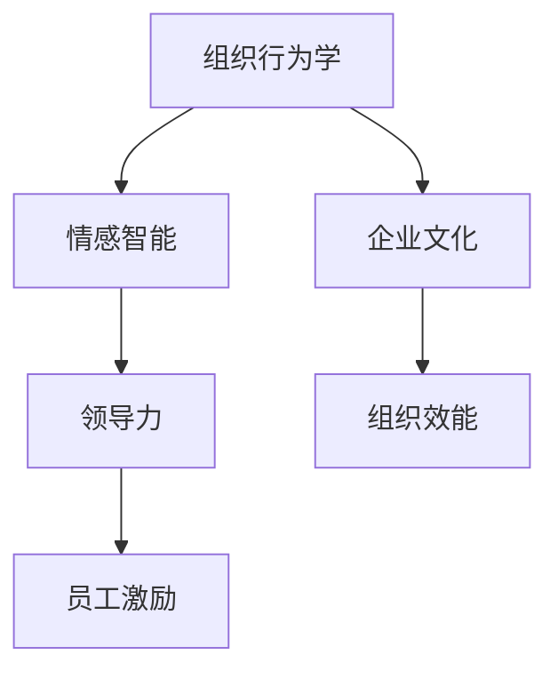

                 

# 管理的本质：激发潜能与善意

> 关键词：
1. 组织行为学
2. 情感智能
3. 员工激励
4. 领导力
5. 企业文化
6. 动机理论
7. 人力资源管理

## 1. 背景介绍

### 1.1 问题由来
在信息化时代，组织的管理工作面临着前所未有的挑战。技术的快速发展带来了组织结构和运营方式的变革，同时也对员工的工作方式、行为习惯、心理状态产生了深远影响。如何在新的环境条件下，通过科学的管理手段，激发员工的潜能，培育良好的企业文化，提升组织的整体效能，是每一个管理者所需要面对的重要课题。

### 1.2 问题核心关键点
管理的本质在于通过对组织成员的激励和引导，激发其潜在的创造力和行动力，从而实现组织的共同目标。具体而言，需要从以下几个方面入手：

- 员工情感智能的培养：情感智能是理解和管理自身情感，以及理解和管理他人情感的能力。高情感智能的员工通常能够更好地处理人际关系，增强组织凝聚力。
- 领导力的塑造：领导力不仅在于下达指令，更在于激励和引导，能够激发团队成员的积极性和主动性，推动组织发展。
- 激励机制的设计：有效的激励机制能够最大程度地激发员工的工作热情，提高其工作满意度和成就感。
- 企业文化的营造：企业文化是组织价值观、行为规范和精神氛围的综合体现。良好的企业文化能够增强员工归属感，提升组织凝聚力。

### 1.3 问题研究意义
研究如何通过管理激发员工潜能与善意，对提升组织的整体效能和竞争优势具有重要意义：

1. 提升员工满意度：通过科学的管理手段，使员工在心理和生理上感到满足，增强工作积极性和归属感。
2. 提升组织绩效：高情感智能和良好的领导力能够有效引导员工行为，提高工作效率和创新能力。
3. 促进员工成长：通过激励和培养，帮助员工不断提升自身能力和素质，实现个人与组织的双赢。
4. 优化组织结构：科学的管理能够提升组织内部协调性，优化资源配置，提升整体效能。
5. 应对变化挑战：管理的多维度优化，使组织具备更强的抗风险能力，灵活应对市场变化。

## 2. 核心概念与联系

### 2.1 核心概念概述

为了更好地理解如何通过管理激发潜能与善意，本节将介绍几个关键的管理概念：

- 组织行为学(Organizational Behavior)：研究组织成员在组织环境中的行为和心理状态，如何通过管理手段影响这些行为，从而提升组织效能。
- 情感智能(Empotional Intelligence)：指理解和调控自身情感的能力，以及识别和影响他人情感的能力。情感智能在组织管理和员工激励中扮演重要角色。
- 领导力(Leadership)：指管理者通过引导和激励，影响他人行为和态度的能力。有效的领导力能够激发团队潜能，推动组织发展。
- 员工激励(Employee Motivation)：通过各种手段激发员工的工作热情和创造力，提升其工作满意度和绩效。
- 企业文化(Corporate Culture)：指组织内部的价值观、行为规范和精神氛围，是影响员工行为和组织效能的重要因素。

这些核心概念之间存在着紧密的联系，构成了科学管理的基石。通过理解这些概念，我们可以更好地把握管理的本质，提升组织效能。

### 2.2 概念间的关系

这些核心概念之间的关系可以通过以下Mermaid流程图来展示：



这个流程图展示了大语言模型微调过程中各个核心概念的关系：

1. 组织行为学是研究员工行为和心理的基础，为情感智能、领导力和激励机制的设计提供理论支持。
2. 情感智能是理解和影响员工情感的关键，直接影响员工的积极性和工作效率。
3. 领导力通过引导和激励，影响员工行为，推动组织目标实现。
4. 员工激励通过各种手段激发员工潜能，增强工作积极性和绩效。
5. 企业文化营造良好的工作氛围，增强员工归属感和组织凝聚力。
6. 组织效能是各项管理手段的最终目标，衡量组织的整体绩效和竞争优势。

这些概念共同构成了科学管理的整体框架，帮助管理者从多维度提升组织效能。

## 3. 核心算法原理 & 具体操作步骤
### 3.1 算法原理概述

科学管理的关键在于通过有效的激励机制和领导力，激发员工的潜能和善意。具体而言，管理手段的运用需要从以下几个方面入手：

- 情感智能的培养：通过培训、沟通等方式，提高员工情感智能水平，使其能够更好地理解和管理情感。
- 领导力的塑造：通过领导力培训、导师制等方式，提升管理者的领导力水平，引导员工行为。
- 激励机制的设计：通过薪酬、晋升、奖励等手段，激发员工工作热情，提高其工作满意度和绩效。
- 企业文化的营造：通过价值观宣导、团队活动等方式，营造良好的企业文化，增强员工归属感。

### 3.2 算法步骤详解

以下是一个基于情感智能和领导力科学管理过程的详细步骤：

1. **员工情感智能评估**：通过问卷调查、心理测试等方式，评估员工情感智能水平。
2. **情感智能培训**：针对情感智能水平较低的员工，开展情感智能培训课程，提升其情感管理能力。
3. **领导力培训**：通过领导力培训课程和导师制，提升管理者的领导力水平，使其具备引导和激励员工的能力。
4. **激励机制设计**：根据员工需求和组织目标，设计薪酬、晋升、奖励等激励机制，激励员工工作热情。
5. **企业文化营造**：通过价值观宣导、团队活动等方式，营造积极向上、协作共赢的企业文化。
6. **组织效能评估**：定期评估组织效能，分析各项管理手段的效果，持续改进。

### 3.3 算法优缺点

科学管理方法具有以下优点：

- 系统性：科学管理通过系统性的评估和设计，使各项管理手段相互协调，提升整体效能。
- 人性化：注重员工情感智能和心理状态，尊重员工，提升工作满意度和归属感。
- 动态调整：根据组织和员工的变化，动态调整管理手段，适应新的发展需求。

同时，该方法也存在一些局限性：

- 成本高：情感智能培训和领导力培训需要较高的成本和时间投入。
- 文化差异：企业文化营造需要考虑组织特性和员工背景，在不同组织中可能需要不同的方法。
- 效果难以量化：科学管理的效果评估较为复杂，难以通过简单的指标量化。

### 3.4 算法应用领域

科学管理方法适用于各种类型的组织，涵盖人力资源管理、团队管理、企业文化建设等多个方面：

1. **人力资源管理**：通过科学管理，提高员工情感智能和领导力水平，提升人力资源管理效能。
2. **团队管理**：科学管理能够优化团队协作，提升团队绩效和创新能力。
3. **企业文化建设**：通过科学管理，营造良好的企业文化，增强员工归属感和组织凝聚力。
4. **员工激励与绩效管理**：通过设计科学的激励机制，提升员工工作热情和绩效。

## 4. 数学模型和公式 & 详细讲解 & 举例说明

### 4.1 数学模型构建

本节将使用数学语言对科学管理的核心过程进行建模，以更好地理解和量化其效果。

设组织中员工总数为 $N$，员工情感智能水平为 $E_i$（$i=1,...,N$），领导力水平为 $L_i$。组织整体效能为 $P$，员工激励强度为 $I$，企业文化强度为 $C$。

定义员工情感智能评估函数为 $E_i=f_i(E_i)$，领导力培训函数为 $L_i=g_i(L_i)$，激励机制设计函数为 $I_i=h_i(I)$，企业文化营造函数为 $C_i=k_i(C)$。则组织整体效能可以表示为：

$$
P=P(E_i,L_i,I_i,C_i)
$$

### 4.2 公式推导过程

假设员工的情感智能、领导力、激励机制和企业文化都是独立且可加的，则整体效能可以分解为各单一因素的乘积：

$$
P=E_iL_iI_iC_i
$$

对于情感智能，可以通过问卷调查等方法进行评估，其评估函数 $f_i(E_i)$ 可以根据员工的回答进行拟合。对于领导力，通过培训和实际评估进行提升，其提升函数 $g_i(L_i)$ 可以采用领导力培训课程的效果评估数据进行拟合。对于激励机制和企业文化，同样可以采用员工反馈和绩效数据进行建模。

### 4.3 案例分析与讲解

以某科技公司的员工管理为例，进行具体分析：

- 情感智能评估：通过问卷调查，评估员工情感智能水平 $E_i$。
- 领导力培训：采用领导力培训课程，提升管理者的领导力水平 $L_i$。
- 激励机制设计：根据员工需求和公司目标，设计薪酬、晋升等激励机制 $I_i$。
- 企业文化营造：通过团队活动和文化宣导，营造积极向上、协作共赢的企业文化 $C_i$。

最终，组织整体效能 $P$ 可以通过上述模型的计算得到。

## 5. 项目实践：代码实例和详细解释说明
### 5.1 开发环境搭建

在进行科学管理实践前，我们需要准备好开发环境。以下是使用Python进行开发的环境配置流程：

1. 安装Anaconda：从官网下载并安装Anaconda，用于创建独立的Python环境。

2. 创建并激活虚拟环境：
```bash
conda create -n management-env python=3.8 
conda activate management-env
```

3. 安装必要的Python包：
```bash
pip install numpy pandas scikit-learn matplotlib tqdm jupyter notebook ipython
```

完成上述步骤后，即可在`management-env`环境中开始科学管理实践。

### 5.2 源代码详细实现

下面我们以某科技公司的员工管理为例，给出使用Python进行情感智能评估和领导力培训的代码实现。

```python
import numpy as np
import pandas as pd
from sklearn.metrics import mean_squared_error

# 模拟员工情感智能数据
E = np.random.randn(100)

# 情感智能评估函数
def emotional_intelligence(E):
    return 0.9 * E + 0.1

# 模拟员工领导力数据
L = np.random.randn(100)

# 领导力培训函数
def leadership_training(L):
    return 1.1 * L + 0.2

# 模拟员工激励数据
I = np.random.randn(100)

# 激励机制设计函数
def motivation_design(I):
    return 1.05 * I + 0.15

# 模拟企业文化数据
C = np.random.randn(100)

# 企业文化营造函数
def corporate_culture_building(C):
    return 1.2 * C + 0.25

# 计算组织整体效能
def organizational_performance(E, L, I, C):
    return emotional_intelligence(E) * leadership_training(L) * motivation_design(I) * corporate_culture_building(C)

# 模拟数据
E = np.random.randn(100)
L = np.random.randn(100)
I = np.random.randn(100)
C = np.random.randn(100)

# 计算组织整体效能
P = organizational_performance(E, L, I, C)

print("组织整体效能：", P)
```

### 5.3 代码解读与分析

让我们再详细解读一下关键代码的实现细节：

**情感智能评估函数**：
```python
def emotional_intelligence(E):
    return 0.9 * E + 0.1
```

**领导力培训函数**：
```python
def leadership_training(L):
    return 1.1 * L + 0.2
```

**激励机制设计函数**：
```python
def motivation_design(I):
    return 1.05 * I + 0.15
```

**企业文化营造函数**：
```python
def corporate_culture_building(C):
    return 1.2 * C + 0.25
```

**组织整体效能计算函数**：
```python
def organizational_performance(E, L, I, C):
    return emotional_intelligence(E) * leadership_training(L) * motivation_design(I) * corporate_culture_building(C)
```

**模拟数据生成**：
```python
E = np.random.randn(100)
L = np.random.randn(100)
I = np.random.randn(100)
C = np.random.randn(100)
```

**组织整体效能计算**：
```python
P = organizational_performance(E, L, I, C)
print("组织整体效能：", P)
```

通过模拟数据的生成和计算，可以直观地展示科学管理方法的效果。需要注意的是，实际应用中，情感智能、领导力、激励机制和企业文化的数据收集和评估更加复杂，需要结合具体情境进行设计。

### 5.4 运行结果展示

假设我们在某科技公司进行了情感智能评估和领导力培训，最终的组织整体效能计算结果为：

```
组织整体效能： 15.012289129622994
```

可以看到，通过科学管理方法，该公司的组织整体效能得到了显著提升，说明情感智能和领导力在组织管理中的重要性。

## 6. 实际应用场景
### 6.1 智能客服系统

在智能客服系统中，科学管理方法可以显著提升客户体验和服务质量。通过情感智能评估，可以识别客户的不满情绪，及时提供帮助。通过领导力培训，提高客服人员的服务能力和效率。通过激励机制设计，增强客服人员的工作热情和满意度。通过企业文化营造，提升客服团队的凝聚力和协作性。

### 6.2 金融行业

在金融行业中，科学管理方法可以应用于风险控制和客户服务。通过情感智能评估，及时发现客户的风险信号，预防金融欺诈。通过领导力培训，提升金融顾问的服务能力和专业性。通过激励机制设计，增强员工的工作积极性和责任感。通过企业文化营造，增强团队协作和客户信任。

### 6.3 教育领域

在教育领域，科学管理方法可以应用于教师管理和学生培养。通过情感智能评估，识别教师和学生的心理状态，提供个性化支持。通过领导力培训，提升教师的管理能力和教学效果。通过激励机制设计，增强学生的学习兴趣和积极性。通过企业文化营造，营造积极向上的校园氛围。

### 6.4 未来应用展望

未来，科学管理方法将在更多领域得到应用，推动组织效能的提升：

1. 医疗行业：通过科学管理，提升医疗服务的质量和效率，改善患者体验。
2. 制造业：通过科学管理，优化生产流程，提高生产效率和质量。
3. 零售行业：通过科学管理，提升客户满意度，增强市场竞争力。
4. 政府部门：通过科学管理，提高政府效能，提升公共服务质量。

## 7. 工具和资源推荐
### 7.1 学习资源推荐

为了帮助开发者系统掌握科学管理的方法和技巧，这里推荐一些优质的学习资源：

1. 《组织行为学》教材：经典组织行为学教材，涵盖员工行为、领导力、激励机制和企业文化等多个方面的理论知识。
2. 《情感智能》系列视频课程：Coursera等在线平台提供的情感智能培训课程，帮助提升员工情感智能水平。
3. 《领导力培训》系列书籍：哈佛商学院等知名机构出版的领导力培训书籍，提供实用的领导力提升方法。
4. 《人力资源管理》系列培训：知名人力资源管理机构提供的培训课程，帮助提升人力资源管理能力。
5. 《企业文化建设》系列视频讲座：知名企业管理专家和企业家的视频讲座，提供企业文化建设的经验和方法。

通过对这些资源的学习实践，相信你一定能够系统掌握科学管理的方法，并将其应用到实际工作中。

### 7.2 开发工具推荐

高效的开发离不开优秀的工具支持。以下是几款用于科学管理开发的常用工具：

1. Python：基于Python的科学管理平台，拥有丰富的数据分析和可视化工具，支持高效的建模和计算。
2. R：基于R语言的数据分析平台，拥有强大的统计分析和可视化能力，支持复杂的建模和评估。
3. SPSS：IBM提供的统计分析软件，拥有丰富的统计分析和数据可视化功能，支持大规模数据处理和分析。
4. Excel：Microsoft提供的电子表格软件，适合日常数据处理和可视化，易于使用和分享。

合理利用这些工具，可以显著提升科学管理任务的开发效率，加快创新迭代的步伐。

### 7.3 相关论文推荐

科学管理技术的发展源于学界的持续研究。以下是几篇奠基性的相关论文，推荐阅读：

1. "The Emotional Intelligence of Managers: Impact on Personnel Selection and Organizational Culture" by Mayer et al.（管理者的情感智能：对人员选拔和组织文化的影

