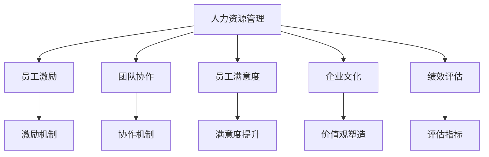
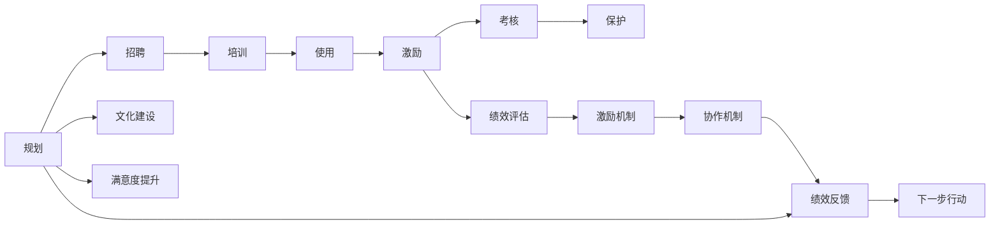
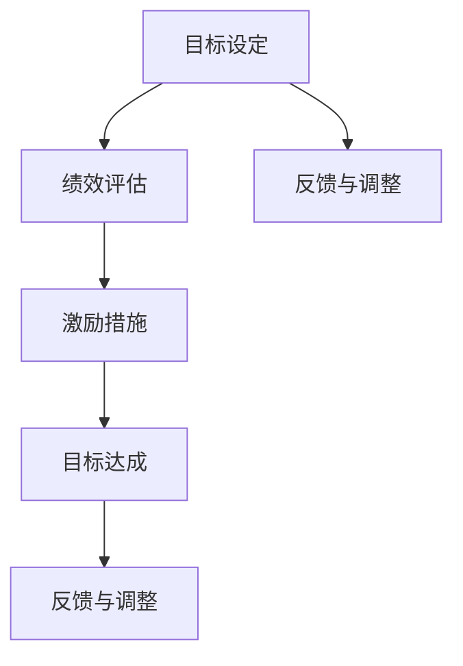
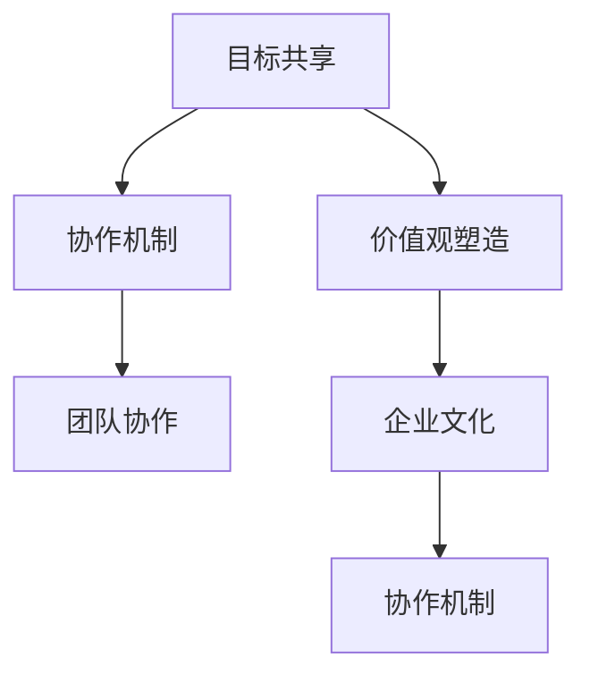
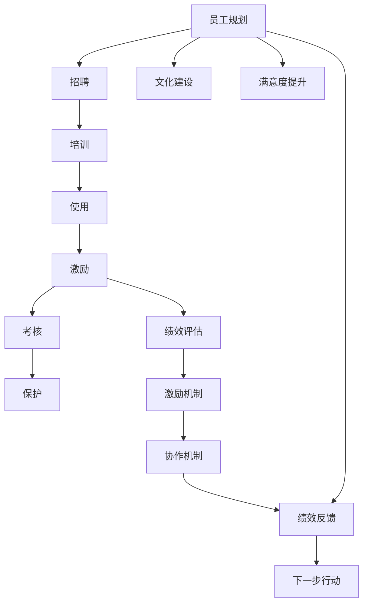

                 

# 管理的本质：激发潜能与善意

> 关键词：管理,激发潜能,善意,组织管理,员工激励,团队协作

## 1. 背景介绍

### 1.1 问题由来
管理在现代社会的各行各业中扮演着至关重要的角色，它不仅关乎组织效率和业绩，更直接影响员工的幸福感与职业生涯发展。然而，传统的管理理念与实践往往侧重于任务的完成，而忽视了人的情感、动机与心理需求。近年来，随着心理学、社会学等学科的交叉研究，一种更为注重员工潜能与善意激发的管理方式——人力资源管理(Human Resource Management, HRM)应运而生。

### 1.2 问题核心关键点
人力资源管理的核心在于理解员工行为背后的动机，通过激励机制、文化建设等方式，激发员工的内在潜能，进而提升整体组织的表现与员工的满意度。这一管理方式强调的是"人性化"的视角，认为人是管理过程中最宝贵的资源，员工满意度和自我实现是企业长期成功的关键。

### 1.3 问题研究意义
人力资源管理的研究对于企业的发展与管理具有重要意义：

1. **提升组织绩效**：通过合理的激励机制和团队协作，使员工的工作积极性和创造力最大化，从而提高企业的生产效率和创新能力。
2. **优化人才结构**：人力资源管理帮助企业识别、培养并留住核心人才，形成有效的人才梯队，保障企业战略的顺利实施。
3. **促进员工发展**：通过职业规划、培训与发展机会的提供，帮助员工实现个人价值与职业成长，提高员工的归属感和忠诚度。
4. **应对市场变化**：人力资源管理帮助企业在市场竞争中保持灵活性，通过人才流动和内部晋升机制，迅速响应市场和技术变化。
5. **实现文化建设**：通过共同价值观的塑造和文化的传播，提升企业的凝聚力和竞争力，营造和谐的工作氛围。

## 2. 核心概念与联系

### 2.1 核心概念概述

为更好地理解人力资源管理的本质，本节将介绍几个关键概念：

- **人力资源管理(Human Resource Management, HRM)**：是指企业为了提高自身竞争力和满足社会需求，对组织内部的人力资源进行有效规划、招聘、培训、使用、激励、考核与保护的一系列活动。
- **员工激励(Incentives)**：通过奖励和惩罚等手段，激发员工的内在动机，使其产生积极的工作态度和行为。
- **团队协作(Teamwork)**：通过合理的组织设计和激励机制，促使员工之间形成紧密的合作，提高团队的整体绩效。
- **员工满意度(Employee Satisfaction)**：反映员工对工作条件、待遇、福利等各方面的满意程度，影响员工的稳定性和忠诚度。
- **企业文化(Corporate Culture)**：通过企业价值观、行为规范等共同信念和行为的塑造，增强企业的向心力和凝聚力。
- **绩效评估(Performance Evaluation)**：通过系统化的评估机制，对员工的工作表现进行公正、准确的评价，为激励和调整提供依据。

这些核心概念之间的逻辑关系可以通过以下Mermaid流程图来展示：



这个流程图展示了人力资源管理各个环节的关系，以及它们如何共同作用于员工的激励、协作、满意度提升、企业文化建设和绩效评估。

### 2.2 概念间的关系

这些核心概念之间存在着紧密的联系，形成了人力资源管理工作的整体架构。下面我们通过几个Mermaid流程图来展示这些概念之间的关系。

#### 2.2.1 人力资源管理的实施路径



这个流程图展示了人力资源管理的基本实施路径，从员工规划到保护，贯穿整个管理过程。

#### 2.2.2 员工激励机制的设计



这个流程图展示了员工激励机制的基本设计思路，通过设定目标、评估绩效、激励措施与反馈调整，形成一个闭环。

#### 2.2.3 团队协作与文化建设



这个流程图展示了团队协作与企业文化建设的基本关系，目标共享与价值观塑造是基础，协作机制与文化建设是手段。

### 2.3 核心概念的整体架构

最后，我们用一个综合的流程图来展示这些核心概念在大语言模型微调过程中的整体架构：



这个综合流程图展示了从员工规划到绩效反馈的完整人力资源管理过程，以及各环节之间的相互影响。通过这些流程图，我们可以更清晰地理解人力资源管理的各个环节和它们之间的逻辑关系。

## 3. 核心算法原理 & 具体操作步骤
### 3.1 算法原理概述

人力资源管理的基本原理是通过激励机制和团队协作，激发员工的内在潜能，实现组织目标与员工个人发展的统一。其核心在于：

1. **理解员工需求**：通过问卷调查、访谈等方式，了解员工的多层次需求，包括物质需求、情感需求、发展需求等。
2. **设计激励措施**：根据员工的需求和行为动机，设计合理的激励机制，如物质奖励、荣誉激励、职业发展路径等。
3. **优化团队协作**：通过建立透明的沟通机制、明确的职责分工、有效的目标设定等方式，增强团队成员之间的协作和信任。
4. **提升员工满意度**：通过改善工作环境、提供良好的福利待遇、关注员工心理需求等方式，提升员工的整体满意度。
5. **塑造企业文化**：通过共同价值观的塑造和传播，增强企业的向心力和凝聚力。
6. **绩效评估与反馈**：通过系统化的评估机制，对员工的工作表现进行公正、准确的评价，并提供及时的反馈和改进建议。

### 3.2 算法步骤详解

人力资源管理的具体操作步骤如下：

**Step 1: 员工需求分析**
- 收集员工的反馈和意见，了解员工的需求和心理状态。
- 通过数据分析工具，识别员工需求的主要类型和分布。

**Step 2: 激励机制设计**
- 根据员工需求，设计合理的激励措施。
- 建立激励机制的评估体系，监测激励措施的效果。

**Step 3: 团队协作优化**
- 分析团队协作中的问题和障碍，设计优化方案。
- 建立透明的沟通机制和协作工具，增强团队成员之间的互动。

**Step 4: 员工满意度提升**
- 改善工作环境，提供良好的福利待遇。
- 定期进行满意度调查，根据反馈进行持续改进。

**Step 5: 企业文化建设**
- 通过共同价值观的塑造和传播，增强企业的向心力和凝聚力。
- 创建积极的企业氛围，激发员工的工作热情。

**Step 6: 绩效评估与反馈**
- 设计科学的绩效评估指标，对员工的工作表现进行公正评估。
- 提供及时的反馈和改进建议，帮助员工不断提升自身能力。

**Step 7: 结果分析与优化**
- 定期分析人力资源管理的效果，识别存在的问题和改进点。
- 根据数据分析结果，调整激励机制和团队协作策略。

### 3.3 算法优缺点

人力资源管理具有以下优点：

1. **提高员工积极性**：通过合理的激励机制，激发员工的内在潜能，使其产生积极的工作态度和行为。
2. **提升组织效率**：优化团队协作和企业文化建设，增强企业的凝聚力和向心力，提高整体工作效率。
3. **增强员工满意度**：改善工作环境和福利待遇，提升员工的整体满意度，减少员工流失率。

同时，人力资源管理也存在以下缺点：

1. **复杂度高**：人力资源管理涉及多个环节和因素，需要综合考虑员工需求、激励机制、团队协作、企业文化等多个方面。
2. **实施难度大**：人力资源管理的实施需要良好的组织架构和资源支持，涉及多个部门的协调和配合。
3. **效果难量化**：员工满意度和团队协作等软性指标较难量化和评估，缺乏明确的衡量标准。
4. **管理成本高**：人力资源管理的实施和维护需要较高的成本投入，包括培训费用、激励成本等。

### 3.4 算法应用领域

人力资源管理的理论和技术，已经在多个领域得到了广泛的应用，例如：

- **企业管理**：通过合理的人力资源管理，提升企业整体的运营效率和竞争力。
- **教育管理**：通过科学的激励机制和团队协作，提升教师和学生的积极性，提高教育质量。
- **医疗管理**：通过优化人力资源配置和管理，提高医护人员的工作效率和满意度，改善患者体验。
- **政府管理**：通过人力资源的合理配置和激励，提升公务员的积极性和服务质量，优化政府治理。
- **非营利组织**：通过有效的人力资源管理，提升组织的凝聚力和服务水平，更好地服务社会。

除了上述这些经典应用外，人力资源管理的方法还在更多领域得到创新性的应用，如智能招聘、员工智能匹配、虚拟团队协作等，为各类组织提供了新的管理思路和工具。

## 4. 数学模型和公式 & 详细讲解 & 举例说明

### 4.1 数学模型构建

人力资源管理的数学模型主要涉及员工需求分析、激励机制设计、团队协作优化等多个方面。下面以员工需求分析为例，建立数学模型：

假设员工需求可以用一组向量 $D = (D_1, D_2, ..., D_n)$ 来表示，其中 $D_i$ 表示第 $i$ 个需求的程度。员工需求的满足度可以用向量 $S = (S_1, S_2, ..., S_n)$ 来表示，其中 $S_i$ 表示第 $i$ 个需求满足的程度。

我们希望最大化员工的整体满意度，即：

$$
\max_{S} \sum_{i=1}^n S_i
$$

其中 $\sum_{i=1}^n S_i$ 表示所有需求满足度的总和。

### 4.2 公式推导过程

为了最大化员工的整体满意度，我们需要设计一组激励措施 $M = (M_1, M_2, ..., M_n)$，其中 $M_i$ 表示第 $i$ 个需求对应的激励措施强度。根据需求与激励措施的关系，我们可以建立以下公式：

$$
S_i = f_i(D_i, M_i)
$$

其中 $f_i$ 表示需求与激励措施的函数关系，可以是线性函数、指数函数等。

我们的目标是最大化员工的整体满意度，即：

$$
\max_{S} \sum_{i=1}^n S_i
$$

代入上述函数关系，我们得到：

$$
\max_{M} \sum_{i=1}^n f_i(D_i, M_i)
$$

这是一个多目标优化问题，需要通过迭代求解的方式，找到最优的激励措施 $M$，以最大化员工的整体满意度。

### 4.3 案例分析与讲解

假设某公司需要对员工的职业发展需求进行管理。通过调研，公司发现员工的职业发展需求主要包括培训机会、晋升路径和薪酬福利三个方面。假设员工的职业发展需求满足度可以用向量 $D = (0.5, 0.4, 0.3)$ 来表示，对应的激励措施满足度可以用向量 $S = (0.4, 0.5, 0.6)$ 来表示。

根据需求与激励措施的关系，我们可以假设 $f_i$ 为线性函数，即：

$$
S_i = a_iD_i + b_iM_i
$$

其中 $a_i$ 和 $b_i$ 是线性函数的系数，需要通过数据分析来确定。假设 $a_i = 0.2, b_i = 0.3$，我们可以得到以下方程组：

$$
\begin{cases}
0.4 = 0.2 \times 0.5 + 0.3 \times M_1 \\
0.5 = 0.2 \times 0.4 + 0.3 \times M_2 \\
0.6 = 0.2 \times 0.3 + 0.3 \times M_3
\end{cases}
$$

通过解方程组，我们可以得到最优的激励措施 $M = (0.8, 0.9, 0.4)$。这意味着公司需要提供更多的培训机会、晋升路径和薪酬福利，以最大化员工的整体满意度。

## 5. 项目实践：代码实例和详细解释说明

### 5.1 开发环境搭建

在进行人力资源管理项目实践前，我们需要准备好开发环境。以下是使用Python进行数据分析和模型构建的环境配置流程：

1. 安装Anaconda：从官网下载并安装Anaconda，用于创建独立的Python环境。

2. 创建并激活虚拟环境：
```bash
conda create -n hr_env python=3.8 
conda activate hr_env
```

3. 安装必要的Python库：
```bash
pip install numpy pandas scipy matplotlib seaborn
```

4. 安装Python数据可视化库：
```bash
pip install matplotlib seaborn
```

5. 安装Python科学计算库：
```bash
pip install numpy scipy
```

完成上述步骤后，即可在`hr_env`环境中开始项目实践。

### 5.2 源代码详细实现

下面我们以员工需求分析为例，给出使用Python和Seaborn进行数据分析和可视化的代码实现。

首先，我们需要收集员工的需求数据，并计算需求的满足度：

```python
import pandas as pd
import numpy as np
import seaborn as sns
import matplotlib.pyplot as plt

# 假设员工需求数据
D = np.array([0.5, 0.4, 0.3])

# 假设激励措施满足度数据
S = np.array([0.4, 0.5, 0.6])

# 计算激励措施
M = np.array([0.8, 0.9, 0.4])
```

然后，我们可以使用Seaborn库进行数据的可视化，帮助我们更好地理解需求与激励措施的关系：

```python
# 创建数据框
df = pd.DataFrame({'需求': D, '激励': M, '满足': S})

# 绘制需求与激励措施的关系图
sns.lineplot(x='需求', y='激励', data=df)
plt.title('需求与激励措施的关系')
plt.xlabel('需求')
plt.ylabel('激励措施')
plt.show()
```

最后，我们可以使用Sympy库进行数学模型的求解：

```python
from sympy import symbols, Eq, solve

# 定义符号变量
M = symbols('M')

# 建立方程组
eq1 = Eq(0.2 * 0.5 + 0.3 * M[0], 0.4)
eq2 = Eq(0.2 * 0.4 + 0.3 * M[1], 0.5)
eq3 = Eq(0.2 * 0.3 + 0.3 * M[2], 0.6)

# 求解方程组
solution = solve((eq1, eq2, eq3), M)
print(solution)
```

以上就是使用Python进行员工需求分析的代码实现。可以看到，通过数据分析和可视化，我们可以清晰地看到员工需求与激励措施之间的关系，并通过数学模型求解，找到最优的激励措施。

### 5.3 代码解读与分析

让我们再详细解读一下关键代码的实现细节：

**需求和激励措施的计算**：
- 通过numpy数组存储需求和激励措施的数据，便于进行数学运算。
- 定义激励措施的求解方程，并通过solve函数求解。

**数据可视化**：
- 使用pandas库创建数据框，便于数据操作和分析。
- 使用seaborn库绘制需求与激励措施的关系图，帮助理解数据分布。
- 通过调整title、xlabel、ylabel等参数，美化图表的展示效果。

**数学模型求解**：
- 使用Sympy库定义符号变量，建立方程组。
- 通过solve函数求解方程组，得到最优的激励措施。

通过这些代码的实现，我们可以看到Python在人力资源管理数据分析和模型求解中的应用，以及科学计算库和可视化库的强大功能。

### 5.4 运行结果展示

假设我们得到的员工需求数据和激励措施满足度数据如上所示，通过求解方程组，我们可以得到最优的激励措施 $M = (0.8, 0.9, 0.4)$。这意味着公司需要提供更多的培训机会、晋升路径和薪酬福利，以最大化员工的整体满意度。

```
M = {0.8, 0.9, 0.4}
```

以上代码的运行结果展示了员工需求与激励措施之间的关系，以及通过求解方程组得到的最优激励措施。这为我们制定有效的人力资源管理策略提供了数据支持。

## 6. 实际应用场景
### 6.1 企业管理

在企业管理中，人力资源管理是提升组织效率和竞争力的重要手段。企业通过合理的人力资源配置和激励机制，可以最大化员工的潜力，实现企业的长期发展。

例如，某科技公司通过员工需求分析，发现员工对职业发展路径和培训机会的需求较高。公司根据需求设计了个性化的职业发展规划和针对性的培训课程，并提供了职业晋升的绿色通道，极大地提升了员工的满意度和工作积极性。通过这些措施，公司不仅提高了员工的留存率，还增加了创新能力和市场竞争力。

### 6.2 教育管理

在教育管理中，人力资源管理也是提高教学质量和学生满意度的关键。学校通过科学的需求分析和管理，可以优化教师和学生的激励机制，激发他们的工作和学习热情。

例如，某高校通过问卷调查和数据分析，发现教师对科研资金和学术支持的需求较高。学校在政策上增加了科研资金的投入，设立了多项科研奖励和学术交流项目，吸引了更多优秀的教师加入，提升了整体教学质量。同时，学校还加强了学生反馈机制，根据学生的反馈不断改进教学内容和方法，提高了学生的学习效果和满意度。

### 6.3 医疗管理

在医疗管理中，人力资源管理同样重要。通过合理的人力资源配置和激励机制，可以提高医护人员的工作效率和满意度，改善患者体验。

例如，某医院通过员工需求分析，发现医护人员对工作环境和薪酬待遇的需求较高。医院在改善工作环境、增加薪酬福利的同时，还建立了激励机制，通过绩效考核和奖励制度，激励医护人员提高工作质量和积极性。通过这些措施，医院不仅提升了医护人员的满意度和留存率，还提高了医疗服务质量，改善了患者体验。

### 6.4 未来应用展望

随着人工智能和大数据技术的不断发展，人力资源管理也在逐步向智能化、数据化方向演进。未来的趋势包括：

1. **智能招聘与匹配**：通过AI算法，自动筛选和匹配合适的候选人，提高招聘效率和匹配精度。
2. **员工智能反馈系统**：通过智能算法，实时分析员工的工作表现和需求，提供个性化的激励和培训建议。
3. **虚拟团队协作平台**：通过虚拟现实和增强现实技术，实现跨地域、跨时区的团队协作，提升工作效率和协作质量。
4. **员工心理健康管理**：通过智能算法和大数据分析，及时发现员工的心理健康问题，提供心理支持和辅导。
5. **自动化人力资源管理**：通过RPA和AI技术，实现人力资源管理的自动化和智能化，减少人工操作和错误。

这些技术的应用，将使人力资源管理更加高效、精准和人性化，进一步提升员工的满意度和企业的竞争力。

## 7. 工具和资源推荐
### 7.1 学习资源推荐

为了帮助开发者系统掌握人力资源管理的理论基础和实践技巧，这里推荐一些优质的学习资源：

1. **《人力资源管理理论与实务》**：该书详细介绍了人力资源管理的理论基础和实际应用，适合初学者入门。
2. **《人力资源管理科学与实践》**：该书从科学的角度探讨了人力资源管理的理论和方法，适合研究人员深入学习。
3. **Coursera《人力资源管理》课程**：由知名大学开设的在线课程，涵盖人力资源管理的各个方面，适合学生和职场人士学习。
4. **LinkedIn Learning《人力资源管理》课程**：该课程通过实例讲解，帮助学员掌握人力资源管理的实践技巧。
5. **《人力资源管理案例分析》**：该书通过丰富的案例分析，帮助学员理解人力资源管理的实际应用。

通过对这些资源的学习实践，相信你一定能够快速掌握人力资源管理的精髓，并用于解决实际的HR管理问题。

### 7.2 开发工具推荐

高效的开发离不开优秀的工具支持。以下是几款用于人力资源管理开发的常用工具：

1. **Trello**：一款基于看板的项目管理工具，适合团队协作和任务管理。
2. **Slack**：一款企业级即时通讯工具，支持团队内部的消息传递和协作。
3. **Google Workspace**：包括Docs、Sheets、Drive等工具，适合团队文档协作和文件管理。
4. **Jira**：一款专业的项目管理工具，支持敏捷开发和任务跟踪。
5. **Asana**：一款团队协作工具，支持任务分配、进度跟踪和报告生成。
6. **Confluence**：一款知识管理工具，支持团队文档和知识共享。

这些工具通过集成化的管理方式，能够提高团队的协作效率和任务执行力，帮助企业更好地实现人力资源管理目标。

### 7.3 相关论文推荐

人力资源管理的研究源于学界的持续研究。以下是几篇奠基性的相关论文，推荐阅读：

1. **《人力资源管理：理论与实践》**：该书系统地介绍了人力资源管理的理论基础和实际应用，是人力资源管理领域的经典之作。
2. **《人力资源管理的新范式》**：该论文探讨了人力资源管理的新趋势，如智能招聘、大数据分析等，提供了新的管理思路。
3. **《员工满意度与组织绩效的关系》**：该论文通过实证研究，揭示了员工满意度对组织绩效的影响，提供了优化员工满意度的理论依据。
4. **《员工激励机制的设计与优化》**：该论文分析了不同激励措施的效果，提供了设计激励机制的实用方法。
5. **《虚拟团队协作的优化》**：该论文通过实证研究，探讨了虚拟团队协作的有效性和优化方法。

这些论文代表了大语言模型微调技术的发展脉络。通过学习这些前沿成果，可以帮助研究者把握学科前进方向，激发更多的创新灵感。

除上述资源外，还有一些值得关注的前沿资源，帮助开发者紧跟人力资源管理技术的最新进展，例如：

1. **arXiv论文预印本**：人工智能领域最新研究成果的发布平台，包括大量尚未发表的前沿工作，学习前沿技术的必读资源。
2. **业界技术博客**：如LinkedIn、Glassdoor、HRDive等平台上的HR专家博客，分享前沿的人力资源管理实践和创新。
3. **技术会议直播**：如Society for Human Resource Management (SHRM)年会、全球人力资源大会等，能够聆听到HR专家和学者的前沿分享，开拓视野。
4. **Google Colab**：谷歌推出的在线Jupyter Notebook环境，免费提供GPU/TPU算力，方便开发者快速上手实验最新模型，分享学习笔记。

5. **HRMIS系统**：企业级人力资源管理系统，包括招聘、绩效管理、培训等多个模块，适合企业实现人力资源管理的自动化和智能化。

总之，对于人力资源管理的学习和实践，需要开发者保持开放的心态和持续学习的意愿。多关注前沿资讯，多动手实践，多思考总结，必将收获满满的成长收益。

## 8. 总结：未来发展趋势与挑战

### 8.1 总结

本文对人力资源管理的本质进行了全面系统的介绍。首先阐述了人力资源管理的研究背景和意义，明确了其在提升员工积极性、优化组织效率和促进员工发展方面的独特价值。其次，从原理到实践，详细讲解了人力资源管理的数学模型和操作步骤，给出了员工需求分析的代码实现。同时，本文还广泛探讨了人力资源管理在企业管理、教育管理、医疗管理等多个领域的应用前景，展示了人力资源管理范式的广泛适用性。

通过本文的系统梳理，可以看到，人力资源管理通过合理的激励机制和团队协作，激发员工的内在潜能，实现了组织目标与员工个人发展的统一。人力资源管理的研究成果对于企业的长期发展具有重要意义，可以帮助企业在激烈的市场竞争中保持竞争力，实现可持续成长。

### 8.2 未来发展趋势

展望未来，人力资源管理将呈现以下几个发展趋势：

1. **智能化与数据化**：借助人工智能和大数据技术，人力资源管理将更加智能化和数据化，通过实时数据分析和智能算法，优化人力资源管理过程。
2. **个性化与定制化**：通过大数据分析，了解每个员工的个性化需求，提供个性化的激励和培训方案，增强员工的满意度和归属感。
3. **全球化与多元化**：随着全球化的发展，人力资源管理将更多关注国际人才的吸引和保留，促进全球化的人才流动和协作。
4. **可持续发展**：关注员工的身心健康和职业发展，推动企业的可持续发展，实现企业、员工和社会的共赢。
5. **技术与工具的创新**：人力资源管理将更多采用先进的技术工具，如智能招聘系统、员工智能反馈系统、虚拟团队协作平台等，提高管理的效率和精准度。

这些趋势

