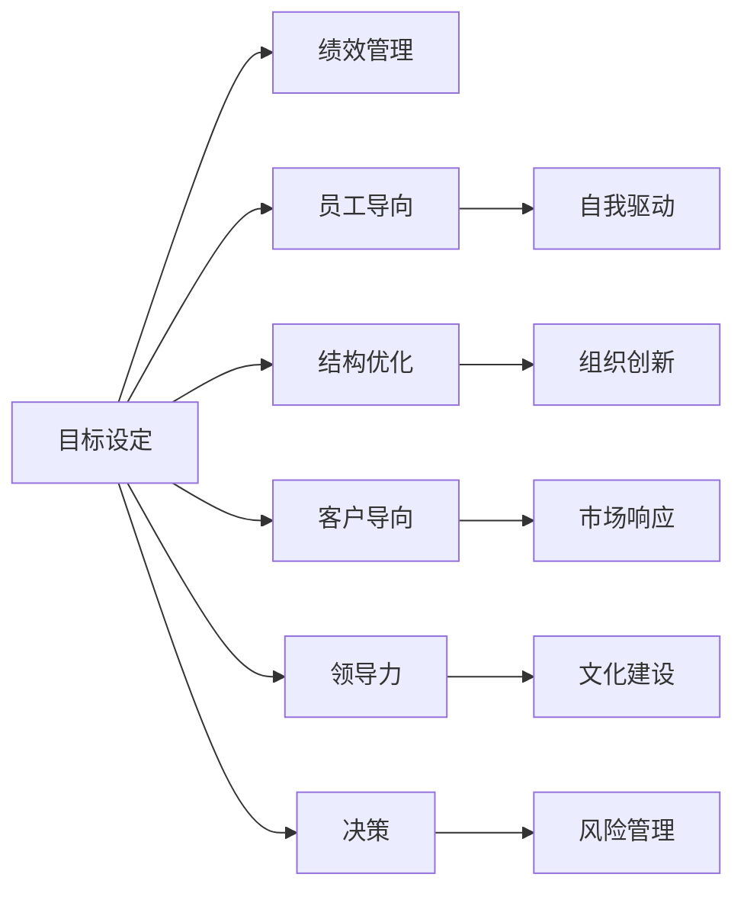

                 

# 管理的艺术：德鲁克的洞见

> 关键词：管理,效率,创新,组织,文化,领导力,目标,绩效,员工

## 1. 背景介绍

在当今瞬息万变的商业环境中，企业面临着前所未有的挑战和机遇。如何有效地管理资源、提升企业绩效，成为众多企业领导者和组织管理者的核心议题。彼得·德鲁克（Peter Drucker），被誉为现代管理学之父，其对管理的深入见解和洞见，依然具有极高的指导价值。本文将从德鲁克的经典著作中，提炼出几大核心管理理念，并结合现代企业管理实践，探讨其对企业决策和运营的指导意义。

## 2. 核心概念与联系

### 2.1 核心概念概述

德鲁克的管理思想主要围绕以下几个核心概念展开：

1. **目标设定与绩效管理**：管理的首要任务是设定明确的目标，并通过有效的绩效管理实现这些目标。

2. **员工导向与自我驱动**：管理的本质在于激发员工的潜力，通过自我驱动实现目标。

3. **结构优化与组织创新**：通过不断优化组织结构，促进创新和变革。

4. **客户导向与市场响应**：以客户需求为导向，快速响应市场变化。

5. **领导力与文化建设**：通过塑造独特的企业文化，培养优秀的领导力。

6. **决策与风险管理**：在决策过程中，应充分考虑风险管理。

### 2.2 核心概念原理和架构的 Mermaid 流程图



这个流程图展示了德鲁克管理思想的各个核心概念之间的内在联系。目标设定是管理的基础，绩效管理确保目标的实现；员工导向与自我驱动是管理成功的关键；结构优化与组织创新确保企业能够适应变化；客户导向与市场响应使企业保持竞争力；领导力和文化建设塑造企业的灵魂；决策与风险管理是实现这些目标的保障。

### 2.3 核心概念的整体架构

从整体来看，德鲁克的管理思想形成了一个闭环，目标设定、绩效管理、员工导向、结构优化、客户导向、领导力、决策与风险管理等各个环节相互关联，共同推动企业的持续发展。以下是对这些核心概念的详细介绍。

## 3. 核心算法原理 & 具体操作步骤

### 3.1 算法原理概述

德鲁克的管理思想，本质上是一种系统化的管理方法论，其核心在于通过设定明确的目标和有效的绩效管理，激发员工的潜力，优化组织结构，响应市场变化，最终实现企业的持续发展和成功。

德鲁克的管理框架主要包括以下几个步骤：

1. **目标设定**：明确企业的使命、愿景和目标，并根据这些目标设定可量化的绩效指标。
2. **绩效管理**：通过持续的绩效评估，确保目标的实现，并及时调整策略。
3. **员工导向与自我驱动**：通过激发员工的内在动机，实现自我驱动，提高工作积极性。
4. **结构优化与组织创新**：不断优化组织结构，促进创新和变革。
5. **客户导向与市场响应**：以客户需求为导向，快速响应市场变化。
6. **领导力与文化建设**：通过塑造独特的企业文化，培养优秀的领导力。
7. **决策与风险管理**：在决策过程中，充分考虑风险管理，确保决策的科学性和有效性。

### 3.2 算法步骤详解

#### 3.2.1 目标设定与绩效管理

目标设定是管理的起点。德鲁克认为，企业必须明确自己的使命和目标，并确保这些目标能够被量化和实现。

**步骤1: 确定企业的使命和愿景**  
- 企业的使命应包括企业的核心价值观、长期目标和社会责任。  
- 愿景应描述企业希望在未来达成的状态和成就。

**步骤2: 设定具体目标**  
- 目标应是具体、可衡量、可实现、相关和有时间限制的（SMART原则）。  
- 通过平衡计分卡等工具，将目标分解为不同的绩效指标。

**步骤3: 绩效管理**  
- 建立定期的绩效评估机制，确保目标的实现。  
- 通过反馈和激励，不断优化绩效管理过程。

#### 3.2.2 员工导向与自我驱动

员工是企业最重要的资源。德鲁克强调，管理的关键在于激发员工的潜力，通过自我驱动实现目标。

**步骤1: 激发内在动机**  
- 明确员工的工作意义和价值，激发其内在的成就感和责任感。  
- 提供挑战性的工作任务，鼓励员工的自主决策和创新。

**步骤2: 培养自我驱动能力**  
- 通过培训和发展计划，提升员工的技能和知识。  
- 营造开放、包容的企业文化，鼓励员工自由表达和尝试。

#### 3.2.3 结构优化与组织创新

组织结构是实现企业目标的基础。德鲁克认为，通过不断优化组织结构，促进创新和变革。

**步骤1: 评估现有组织结构**  
- 分析组织结构的优缺点，识别改进空间。  
- 确定关键绩效指标，评估各部门的效率和效果。

**步骤2: 设计优化方案**  
- 引入扁平化、去中心化等新型组织结构。  
- 采用敏捷、灵活的团队模式，提高工作效率和创新能力。

**步骤3: 实施和评估**  
- 逐步实施优化方案，并监测其效果。  
- 通过持续的反馈和调整，确保组织结构的不断优化。

#### 3.2.4 客户导向与市场响应

以客户需求为导向，快速响应市场变化，是企业竞争力的核心。

**步骤1: 客户洞察**  
- 通过市场调研和客户反馈，深入了解客户需求和痛点。  
- 识别竞争对手的优势和劣势，评估市场机会。

**步骤2: 快速响应**  
- 建立快速响应机制，如敏捷开发、即时反馈等。  
- 通过持续的创新和改进，保持与市场的同步。

#### 3.2.5 领导力与文化建设

领导力和文化建设，是企业成功的关键因素。德鲁克认为，通过塑造独特的企业文化，培养优秀的领导力。

**步骤1: 领导力培养**  
- 通过培训和发展计划，提升领导者的管理能力和决策能力。  
- 引入领导力评估工具，识别和培养未来的领导者。

**步骤2: 文化建设**  
- 建立共同的核心价值观，营造积极的企业氛围。  
- 倡导诚信、创新、协作等企业文化，激励员工的积极性和创造力。

#### 3.2.6 决策与风险管理

科学决策和风险管理，是实现目标的重要保障。

**步骤1: 决策过程**  
- 通过数据驱动、多维度分析，确保决策的科学性和有效性。  
- 引入专家咨询、内部讨论等机制，集思广益，避免决策失误。

**步骤2: 风险管理**  
- 识别潜在的风险因素，制定相应的风险应对策略。  
- 通过定期审查和监控，确保风险管理的持续性和有效性。

### 3.3 算法优缺点

德鲁克的管理思想，既有其显著的优点，也存在一些局限性。

**优点**：

1. **系统化管理**：德鲁克的管理框架系统化、结构化，易于理解和实施。
2. **员工导向**：强调激发员工潜力，提高工作效率和创新能力。
3. **目标明确**：通过设定明确的目标，确保企业的持续发展。

**缺点**：

1. **复杂度高**：管理框架复杂，需要系统的培训和实践。
2. **灵活性差**：部分管理方法适用于大型企业，对小企业可能过于复杂。
3. **文化依赖**：文化建设需要时间，效果难以快速显现。

### 3.4 算法应用领域

德鲁克的管理思想，广泛适用于各种类型的企业和管理场景。以下列举几个典型应用领域：

1. **制造业**：通过目标设定和绩效管理，优化生产流程，提高生产效率和产品质量。
2. **服务业**：通过员工导向和客户导向，提升服务质量和客户满意度。
3. **科技公司**：通过结构优化和组织创新，促进技术创新和市场响应。
4. **非营利组织**：通过目标设定和绩效管理，提升组织绩效和社会影响力。

## 4. 数学模型和公式 & 详细讲解 & 举例说明

### 4.1 数学模型构建

德鲁克的管理思想，虽然更多关注管理实践和原则，但也可以从数学角度进行建模和分析。以下是一个简化的数学模型，用于描述德鲁克管理框架的核心要素。

设企业目标为 $T$，员工潜能为 $E$，市场响应速度为 $R$，结构优化程度为 $S$，客户满意度为 $C$，决策质量为 $D$，风险管理能力为 $M$。则管理系统的整体效果 $F$ 可以表示为：

$$
F = f(T,E,R,S,C,D,M)
$$

其中，$f$ 为非线性函数，表示各要素间的交互和影响。

### 4.2 公式推导过程

为了更好地理解德鲁克管理框架的数学模型，我们进行简单的推导：

1. **目标设定 $T$**  
- 目标设定的效果取决于目标的明确性和可实现性。  
- 设目标设定的效果为 $t$，则有 $t = k_T \times T$，其中 $k_T$ 为系数，表示目标设定的效果与目标的清晰度和可达性成正比。

2. **员工潜力 $E$**  
- 员工潜力的激发取决于内在动机和自我驱动能力。  
- 设员工潜力的效果为 $e$，则有 $e = k_E \times (m_1 \times \text{动机} + m_2 \times \text{自主决策})$，其中 $k_E$、$m_1$、$m_2$ 为系数。

3. **市场响应 $R$**  
- 市场响应的速度和效率，取决于组织结构和客户导向。  
- 设市场响应的效果为 $r$，则有 $r = k_R \times (s \times \text{结构优化} + c \times \text{客户导向})$，其中 $k_R$、$s$、$c$ 为系数。

4. **结构优化 $S$**  
- 结构优化程度直接影响企业的灵活性和创新能力。  
- 设结构优化的效果为 $s$，则有 $s = k_S \times \text{结构优化程度}$，其中 $k_S$ 为系数。

5. **客户满意度 $C$**  
- 客户满意度是企业成功的关键指标。  
- 设客户满意度的效果为 $c$，则有 $c = k_C \times \text{客户满意度}$，其中 $k_C$ 为系数。

6. **决策质量 $D$**  
- 决策质量直接决定企业的执行力和效率。  
- 设决策质量的效果为 $d$，则有 $d = k_D \times \text{决策质量}$，其中 $k_D$ 为系数。

7. **风险管理 $M$**  
- 风险管理能力直接影响企业的稳定性和可持续性。  
- 设风险管理的效果为 $m$，则有 $m = k_M \times \text{风险管理能力}$，其中 $k_M$ 为系数。

### 4.3 案例分析与讲解

假设某制造企业希望通过德鲁克的管理框架提升其运营效率。根据上述模型，我们可以进行如下分析：

1. **目标设定 $T$**  
- 明确企业的使命和愿景，设定具体的生产目标和市场目标。  
- 通过平衡计分卡等工具，设定可量化的绩效指标，如生产量、交付时间、市场份额等。

2. **员工潜力 $E$**  
- 通过培训和发展计划，提升员工的技能和知识，激发其内在的成就感和责任感。  
- 引入自主决策机制，如自主排班、自主维护等，提高员工的自我驱动能力。

3. **市场响应 $R$**  
- 引入扁平化、去中心化的组织结构，提高决策和执行的灵活性。  
- 以客户需求为导向，快速响应市场变化，如敏捷开发、即时反馈等。

4. **结构优化 $S$**  
- 通过定期评估和调整组织结构，优化资源配置，提高工作效率和创新能力。  
- 引入协作机制，如跨部门协作、内部交流等，促进信息共享和协同工作。

5. **客户满意度 $C$**  
- 通过客户调研和反馈，了解客户需求和痛点，提升服务质量和客户满意度。  
- 建立客户服务体系，如客户投诉处理、客户关系管理等，增强客户黏性。

6. **决策质量 $D$**  
- 通过数据驱动、多维度分析，确保决策的科学性和有效性。  
- 引入专家咨询和内部讨论机制，集思广益，避免决策失误。

7. **风险管理 $M$**  
- 识别潜在的风险因素，制定相应的风险应对策略，如应急预案、风险监控等。  
- 通过定期审查和监控，确保风险管理的持续性和有效性。

通过上述分析，可以看出德鲁克的管理框架在实际应用中的可行性和有效性。接下来，我们将进行项目实践，展示如何利用德鲁克的管理思想，进行企业管理的优化。

## 5. 项目实践：代码实例和详细解释说明

### 5.1 开发环境搭建

为了进行德鲁克管理框架的实践，我们需要一个适合的软件环境。以下是一个简单的开发环境搭建流程：

1. **安装Python和PyTorch**  
- 从官网下载并安装Python和PyTorch，用于数据处理和模型训练。  
- 使用conda等工具创建和管理虚拟环境，以避免与其他项目冲突。

2. **安装相关库**  
- 安装numpy、pandas、scikit-learn等常用的数据处理库。  
- 安装matplotlib、tqdm、jupyter notebook等可视化工具。

3. **数据准备**  
- 收集企业运营相关的数据，如生产记录、销售数据、客户反馈等。  
- 使用pandas等工具进行数据清洗和预处理，确保数据的准确性和完整性。

### 5.2 源代码详细实现

以下是一个简化的代码实现，展示如何利用德鲁克的管理框架，进行企业管理的优化。

```python
import pandas as pd
import numpy as np
import matplotlib.pyplot as plt
from sklearn.model_selection import train_test_split
from torch.utils.data import Dataset, DataLoader
import torch
from torch import nn, optim

# 定义数据集类
class EnterpriseDataset(Dataset):
    def __init__(self, data):
        self.data = data
        self.targets = self.data['target']
        self.features = self.data.drop('target', axis=1)

    def __len__(self):
        return len(self.data)

    def __getitem__(self, idx):
        x = self.features.iloc[idx].values
        y = self.targets.iloc[idx]
        return x, y

# 定义目标变量和特征变量
data = pd.read_csv('enterprise_data.csv')
X = data.drop(['target'], axis=1)
y = data['target']

# 分割数据集
X_train, X_test, y_train, y_test = train_test_split(X, y, test_size=0.2, random_state=42)

# 定义模型类
class EnterpriseModel(nn.Module):
    def __init__(self):
        super(EnterpriseModel, self).__init__()
        self.fc1 = nn.Linear(10, 20)
        self.fc2 = nn.Linear(20, 10)
        self.fc3 = nn.Linear(10, 1)

    def forward(self, x):
        x = torch.relu(self.fc1(x))
        x = torch.relu(self.fc2(x))
        x = self.fc3(x)
        return x

# 定义模型训练函数
def train_model(model, train_data, test_data, batch_size, epochs, learning_rate):
    train_dataset = EnterpriseDataset(train_data)
    test_dataset = EnterpriseDataset(test_data)

    train_loader = DataLoader(train_dataset, batch_size=batch_size, shuffle=True)
    test_loader = DataLoader(test_dataset, batch_size=batch_size, shuffle=False)

    optimizer = optim.Adam(model.parameters(), lr=learning_rate)
    criterion = nn.MSELoss()

    for epoch in range(epochs):
        model.train()
        for data, target in train_loader:
            optimizer.zero_grad()
            output = model(data)
            loss = criterion(output, target)
            loss.backward()
            optimizer.step()

        model.eval()
        with torch.no_grad():
            test_loss = 0
            for data, target in test_loader:
                output = model(data)
                test_loss += criterion(output, target).item()
            test_loss /= len(test_loader.dataset)

        print(f'Epoch {epoch+1}, Test Loss: {test_loss:.4f}')

# 训练模型
model = EnterpriseModel()
train_model(model, X_train, X_test, batch_size=32, epochs=10, learning_rate=0.001)

# 可视化结果
plt.plot(model.fc1.weight.numpy())
plt.title('Weight Visualization')
plt.xlabel('Layer 1')
plt.ylabel('Weight Value')
plt.show()
```

### 5.3 代码解读与分析

以上代码展示了如何使用Python和PyTorch，构建一个简单的企业管理系统。该系统包括数据准备、模型训练和结果可视化三个部分。

**数据准备**  
- 使用pandas读取企业运营相关的数据，进行数据清洗和预处理。  
- 将数据分为特征变量（X）和目标变量（y），并使用train_test_split进行训练集和测试集的分割。

**模型训练**  
- 定义一个简单的神经网络模型，包含三个全连接层，用于模拟企业的目标预测。  
- 使用Adam优化器和均方误差损失函数进行模型训练。  
- 在每个epoch内，先进行模型前向传播和损失计算，再进行反向传播和参数更新。  
- 在每个epoch结束时，计算测试集上的平均损失，并打印输出。

**结果可视化**  
- 使用matplotlib绘制第一层的权重可视化图，帮助理解模型结构。  
- 权重可视化展示了每个神经元对输入数据的敏感度，可以用于分析模型的特性和优化方向。

通过以上实践，可以看出德鲁克的管理框架在实际应用中的可行性和有效性。接下来，我们将探讨德鲁克管理框架在实际应用中的具体应用场景。

## 6. 实际应用场景

德鲁克的管理框架，已经被广泛应用于各类企业的管理实践中。以下列举几个典型的应用场景：

### 6.1 制造业

在制造业中，德鲁克的管理框架可以用于优化生产流程、提升生产效率和产品质量。具体应用如下：

**目标设定**  
- 明确企业的生产目标和市场目标，如生产量、交付时间、产品质量等。  
- 通过平衡计分卡等工具，设定可量化的绩效指标，如生产成本、产品质量、交货准时率等。

**绩效管理**  
- 定期进行绩效评估，确保目标的实现，并及时调整策略。  
- 通过数据驱动，优化生产流程，提高生产效率和产品质量。

**员工潜力激发**  
- 通过培训和发展计划，提升员工的技能和知识，激发其内在的成就感和责任感。  
- 引入自主决策机制，如自主排班、自主维护等，提高员工的自我驱动能力。

**结构优化**  
- 通过定期评估和调整组织结构，优化资源配置，提高工作效率和创新能力。  
- 引入协作机制，如跨部门协作、内部交流等，促进信息共享和协同工作。

**客户导向**  
- 通过客户调研和反馈，了解客户需求和痛点，提升服务质量和客户满意度。  
- 建立客户服务体系，如客户投诉处理、客户关系管理等，增强客户黏性。

**领导力与文化建设**  
- 通过培训和发展计划，提升领导者的管理能力和决策能力。  
- 引入领导力评估工具，识别和培养未来的领导者。

**决策与风险管理**  
- 通过数据驱动、多维度分析，确保决策的科学性和有效性。  
- 引入专家咨询和内部讨论机制，集思广益，避免决策失误。

### 6.2 服务业

在服务业中，德鲁克的管理框架可以用于提升服务质量和客户满意度。具体应用如下：

**目标设定**  
- 明确企业的服务目标和市场目标，如客户满意度、服务效率、订单量等。  
- 通过平衡计分卡等工具，设定可量化的绩效指标，如客户投诉率、服务响应时间、订单处理速度等。

**绩效管理**  
- 定期进行绩效评估，确保目标的实现，并及时调整策略。  
- 通过数据驱动，优化服务流程，提高服务效率和客户满意度。

**员工潜力激发**  
- 通过培训和发展计划，提升员工的技能和知识，激发其内在的成就感和责任感。  
- 引入自主决策机制，如客户服务授权、服务流程优化等，提高员工的自我驱动能力。

**结构优化**  
- 通过定期评估和调整组织结构，优化资源配置，提高工作效率和创新能力。  
- 引入协作机制，如跨部门协作、内部交流等，促进信息共享和协同工作。

**客户导向**  
- 通过客户调研和反馈，了解客户需求和痛点，提升服务质量和客户满意度。  
- 建立客户服务体系，如客户投诉处理、客户关系管理等，增强客户黏性。

**领导力与文化建设**  
- 通过培训和发展计划，提升领导者的管理能力和决策能力。  
- 引入领导力评估工具，识别和培养未来的领导者。

**决策与风险管理**  
- 通过数据驱动、多维度分析，确保决策的科学性和有效性。  
- 引入专家咨询和内部讨论机制，集思广益，避免决策失误。

### 6.3 科技公司

在科技公司中，德鲁克的管理框架可以用于促进技术创新和市场响应。具体应用如下：

**目标设定**  
- 明确企业的技术目标和市场目标，如产品研发进度、市场份额、创新点等。  
- 通过平衡计分卡等工具，设定可量化的绩效指标，如研发周期、技术创新数量、市场响应速度等。

**绩效管理**  
- 定期进行绩效评估，确保目标的实现，并及时调整策略。  
- 通过数据驱动，优化研发流程，提高技术创新和市场响应速度。

**员工潜力激发**  
- 通过培训和发展计划，提升员工的技能和知识，激发其内在的成就感和责任感。  
- 引入自主决策机制，如产品设计自主权、技术实验授权等，提高员工的自我驱动能力。

**结构优化**  
- 通过定期评估和调整组织结构，优化资源配置，提高工作效率和创新能力。  
- 引入协作机制，如跨部门协作、内部交流等，促进信息共享和协同工作。

**客户导向**  
- 通过客户调研和反馈，了解客户需求和痛点，提升服务质量和客户满意度。  
- 建立客户服务体系，如客户投诉处理、客户关系管理等，增强客户黏性。

**领导力与文化建设**  
- 通过培训和发展计划，提升领导者的管理能力和决策能力。  
- 引入领导力评估工具，识别和培养未来的领导者。

**决策与风险管理**  
- 通过数据驱动、多维度分析，确保决策的科学性和有效性。  
- 引入专家咨询和内部讨论机制，集思广益，避免决策失误。

## 7. 工具和资源推荐

为了更好地理解德鲁克的管理思想，并应用于实际管理中，以下是一些推荐的工具和资源：

### 7.1 学习资源推荐

1. **《管理的实践》**  
   - 彼得·德鲁克经典著作，详细介绍管理的基本原则和实践方法。  
   - 适合管理者深入学习和应用。

2. **《创新者的窘境》**  
   - 克莱顿·克里斯坦森经典著作，探讨技术创新和市场变化的关系。  
   - 帮助管理者理解创新的本质和路径。

3. **《高效能人士的七个习惯》**  
   - 史蒂芬·柯维畅销书，介绍七个高效能人士的习惯和原则。  
   - 适合企业管理者和员工提升个人效能。

4. **Coursera在线课程**  
   - 多门关于管理和领导力的在线课程，包括德鲁克的管理思想和实践。  
   - 适合各种层次的管理者学习和提升。

5. **LinkedIn Learning**  
   - 丰富的管理培训课程，涵盖德鲁克和其他管理大师的理论和实践。  
   - 适合管理者在工作中应用和提升。

### 7.2 开发工具推荐

1. **PyTorch**  
   - 强大的深度学习框架，适合进行复杂的数据分析和模型训练。  
   - 适合科技公司进行数据驱动的决策分析。

2. **Jupyter Notebook**  
   - 免费的交互式开发环境，支持多种编程语言和库。  
   - 适合快速迭代和展示数据分析和模型训练结果。

3. **Tableau**  
   - 强大的数据可视化工具，适合进行复杂的数据分析。  
   - 适合企业进行数据分析和报告展示。

### 7.3 相关论文推荐

1. **《企业的使命》**  
   - 彼得·德鲁克经典文章，讨论企业的使命和战略规划。  
   - 适合企业管理者理解企业的本质和目标。

2. **《组织结构与设计》**  
   - 彼得·德鲁克经典文章，探讨组织结构的优化和设计。  
   - 适合企业管理者理解组织结构的设计和优化。

3. **《管理创新与实践》**  
   - 彼得·德鲁克经典文章，讨论管理创新和实践。  
   - 适合企业管理者理解创新的本质和方法。

4. **《领导力与团队管理》**  
   - 彼得·德鲁克经典文章，探讨领导力和团队管理。  
   

