                 

# 管理艺术：从策略到执行

> 关键词：管理策略,执行力度,团队协作,企业文化,绩效考核,变革管理,领导力,技术驱动

## 1. 背景介绍

### 1.1 问题由来

在现代商业环境中，管理艺术的重要性愈发凸显。一个成功的企业不仅需要精明的商业策略，更需要有高效的执行力度，来确保这些策略得以实现。优秀的管理不仅能够提升公司绩效，还能培养良好的企业文化，激励团队合作，推动企业持续发展。然而，许多企业在策略制定和执行过程中，往往面临着诸多挑战。比如，决策的科学性不足，执行力的弱化，以及团队内部的沟通不畅。这些问题不仅影响企业当前的表现，更可能对未来的发展造成长远的负面影响。

### 1.2 问题核心关键点

为了解决上述挑战，本文将深入探讨以下几个核心问题：

- 如何制定科学合理的管理策略？
- 如何确保这些策略能够得到有效执行？
- 如何在企业文化中植入有效的管理理念？
- 如何通过绩效考核和激励机制提升团队绩效？
- 如何通过变革管理策略，应对内外环境变化？
- 如何培养卓越的领导力和管理能力？
- 如何利用技术驱动提升管理效率和效果？

这些问题的答案，将构成本文的核心内容。通过全面、系统的解析，旨在帮助企业管理者提升管理水平，推动企业持续发展。

### 1.3 问题研究意义

研究管理艺术及其在企业中的应用，对于企业领导者和管理者来说，具有重要意义：

1. **提升企业竞争力**：优秀的管理策略和执行力，可以显著提升企业的市场竞争力和盈利能力。
2. **改善团队协作**：有效的管理可以增强团队凝聚力和合作效率，提高团队战斗力。
3. **塑造企业文化**：管理艺术的运用，可以塑造和提升企业文化，使企业更具吸引力和凝聚力。
4. **促进员工发展**：科学合理的管理制度和激励机制，可以激发员工的积极性和创新能力，促进个人与企业共同成长。
5. **适应环境变化**：通过变革管理策略，企业可以更好地应对外部环境的变化，保持持续的适应力和竞争力。

## 2. 核心概念与联系

### 2.1 核心概念概述

为了更好地理解管理艺术的精髓，我们需要掌握以下核心概念：

- **管理策略(Strategy)**：企业为实现目标而制定的行动计划和行动方案。
- **执行力度(Execution)**：将管理策略转化为实际行动的能力和效果。
- **团队协作(Collaboration)**：团队成员之间的合作与沟通，共同实现目标。
- **企业文化(Corporate Culture)**：企业内部共有的价值观、信仰、行为准则等。
- **绩效考核(Performance Evaluation)**：评估员工或团队表现的方法和标准。
- **变革管理(Change Management)**：管理和指导企业内部变革的过程。
- **领导力(Leadership)**：领导者激励、指导和影响团队的能力。
- **技术驱动(Drive by Technology)**：利用技术手段提升管理效率和效果。

这些概念之间有着密切的联系，共同构成了管理艺术的核心框架。下面，我们通过Mermaid流程图来展示这些概念之间的关系：

```mermaid
graph TB
    A[管理策略] --> B[执行力度]
    A --> C[团队协作]
    A --> D[企业文化]
    A --> E[绩效考核]
    A --> F[变革管理]
    A --> G[领导力]
    B --> H[团队协作]
    B --> I[企业文化]
    B --> J[绩效考核]
    B --> K[变革管理]
    B --> L[技术驱动]
    C --> M[企业文化]
    C --> N[绩效考核]
    C --> O[变革管理]
    C --> P[领导力]
    D --> Q[执行力度]
    D --> R[团队协作]
    D --> S[企业文化]
    D --> T[绩效考核]
    D --> U[变革管理]
    D --> V[领导力]
    E --> W[企业文化]
    E --> X[绩效考核]
    E --> Y[变革管理]
    E --> Z[领导力]
    F --> AA[团队协作]
    F --> BB[企业文化]
    F --> CC[绩效考核]
    F --> DD[变革管理]
    F --> EE[领导力]
    G --> FF[企业文化]
    G --> GG[绩效考核]
    G --> HH[变革管理]
    G --> II[领导力]
    H --> JJ[企业文化]
    H -->KK[绩效考核]
    H --> LL[变革管理]
    H --> MM[领导力]
    I --> NN[企业文化]
    I --> OO[绩效考核]
    I --> PP[变革管理]
    I --> QQ[领导力]
    J --> RR[企业文化]
    J --> SS[绩效考核]
    J --> TT[变革管理]
    J --> UU[领导力]
    K --> VV[企业文化]
    K --> WW[绩效考核]
    K --> XX[变革管理]
    K --> YY[领导力]
    L --> ZZ[企业文化]
    L --> AAA[绩效考核]
    L --> BBB[变革管理]
    L --> CCC[领导力]
    M --> DDD[企业文化]
    M -->EEE[绩效考核]
    M --> FFF[变革管理]
    M --> GGG[领导力]
    N --> HHH[企业文化]
    N --> III[绩效考核]
    N --> JJJ[变革管理]
    N --> KKK[领导力]
    O --> LLL[企业文化]
    O --> MMM[绩效考核]
    O --> NNN[变革管理]
    O --> OOO[领导力]
    P --> PPP[企业文化]
    P --> QQQ[绩效考核]
    P --> RRR[变革管理]
    P --> SSS[领导力]
```



这个图表展示了管理艺术中各个概念之间的相互影响和支撑关系。例如，管理策略不仅需要制定，还需要有执行力来推动实施；执行力度依赖于团队协作，团队协作又受企业文化和领导力的影响；绩效考核和变革管理则提供了评估和改进的机制，以确保管理的科学性和适应性；技术驱动则为管理实践提供了高效的工具和方法。

### 2.2 概念间的关系

这些核心概念之间存在着紧密的联系，形成了管理艺术的整体框架。下面，我们通过几个Mermaid流程图来展示这些概念之间的关系。

#### 2.2.1 管理策略与执行力度

```mermaid
graph LR
    A[管理策略] --> B[执行力度]
    B --> C[团队协作]
    B --> D[企业文化]
    B --> E[绩效考核]
    B --> F[变革管理]
    B --> G[领导力]
    C --> H[企业文化]
    C --> I[绩效考核]
    C --> J[变革管理]
    C --> K[领导力]
    D --> L[执行力度]
    D --> M[团队协作]
    D --> N[企业文化]
    D --> O[绩效考核]
    D --> P[变革管理]
    D --> Q[领导力]
    E --> R[企业文化]
    E --> S[绩效考核]
    E --> T[变革管理]
    E --> U[领导力]
    F --> V[团队协作]
    F --> W[企业文化]
    F --> X[绩效考核]
    F --> Y[变革管理]
    F --> Z[领导力]
    G --> AA[企业文化]
    G --> BB[绩效考核]
    G --> CC[变革管理]
    G --> DD[领导力]
    H --> EE[企业文化]
    H --> FF[绩效考核]
    H --> GG[变革管理]
    H --> HH[领导力]
    I --> II[企业文化]
    I --> JJ[绩效考核]
    I --> KK[变革管理]
    I --> LL[领导力]
    J --> MM[企业文化]
    J --> NN[绩效考核]
    J --> OO[变革管理]
    J --> PP[领导力]
    K --> QQ[企业文化]
    K --> RR[绩效考核]
    K --> SS[变革管理]
    K --> TT[领导力]
    L --> UU[企业文化]
    L --> VV[绩效考核]
    L --> WW[变革管理]
    L --> XX[领导力]
    M --> YY[企业文化]
    M --> ZZ[绩效考核]
    M --> AAA[变革管理]
    M --> BBB[领导力]
    N --> CCC[企业文化]
    N --> DDD[绩效考核]
    N --> EEE[变革管理]
    N --> FFF[领导力]
    O --> GGG[企业文化]
    O --> HHH[绩效考核]
    O --> III[变革管理]
    O --> JJJ[领导力]
    P --> KKK[企业文化]
    P --> LLL[绩效考核]
    P --> MMM[变革管理]
    P --> NNN[领导力]
    Q --> OOO[企业文化]
    Q --> PPP[绩效考核]
    Q --> QQQ[变革管理]
    Q --> RRR[领导力]
    R --> SSS[企业文化]
    R --> TTT[绩效考核]
    R --> UUU[变革管理]
    R --> VVV[领导力]
    S --> WWW[企业文化]
    S --> XYY[绩效考核]
    S --> ZZZ[变革管理]
    S --> AAAA[领导力]
    T --> BBBB[企业文化]
    T --> CCCC[绩效考核]
    T --> DDDD[变革管理]
    T --> EEEE[领导力]
    U --> FFFA[企业文化]
    U --> GGGG[绩效考核]
    U --> HHHH[变革管理]
    U --> IIII[领导力]
    V --> JJJA[企业文化]
    V --> KKKK[绩效考核]
    V --> LLLLL[变革管理]
    V --> MMMM[领导力]
    W --> NNNA[企业文化]
    W --> OOOO[绩效考核]
    W --> PPPP[变革管理]
    W --> QQQQ[领导力]
    X --> RRRR[企业文化]
    X --> SSSS[绩效考核]
    X --> TTTT[变革管理]
    X --> UUUU[领导力]
    Y --> VVVV[企业文化]
    Y --> WWWW[绩效考核]
    Y --> XXXX[变革管理]
    Y --> YYYY[领导力]
    Z --> AAAA[企业文化]
    Z --> BBBBB[绩效考核]
    Z --> CCCCC[变革管理]
    Z --> DDDDD[领导力]
    AA --> EEAA[企业文化]
    AA --> FFFAA[绩效考核]
    AA --> GGGAA[变革管理]
    AA --> HHHAA[领导力]
    BB --> IIBB[企业文化]
    BB --> JJJBB[绩效考核]
    BB --> KKKBB[变革管理]
    BB --> LLLBB[领导力]
    CC --> MCCC[企业文化]
    CC --> NNNCC[绩效考核]
    CC --> OOOCC[变革管理]
    CC --> PPPCC[领导力]
    DD --> QQQDD[企业文化]
    DD --> RRRDD[绩效考核]
    DD --> SSSDD[变革管理]
    DD --> TTTDD[领导力]
    EE --> UUUAE[企业文化]
    EE --> VVUUAE[绩效考核]
    EE --> WWUUAE[变革管理]
    EE --> XUUAE[领导力]
    FF --> YYFF[企业文化]
    FF --> ZZZFF[绩效考核]
    FF --> AAAFF[变革管理]
    FF --> BAAFF[领导力]
    GG --> CCCGG[企业文化]
    GG --> DDDGG[绩效考核]
    GG --> EEDDG[变革管理]
    GG --> FEFEG[领导力]
    HH --> GGGHH[企业文化]
    HH --> IIIHH[绩效考核]
    HH --> JJJHH[变革管理]
    HH --> KKKHH[领导力]
    II --> LLLII[企业文化]
    II --> MLLII[绩效考核]
    II --> NLLII[变革管理]
    II --> OLLII[领导力]
    JJ --> PPPJJ[企业文化]
    JJ --> QPPJJ[绩效考核]
    JJ --> RPPJJ[变革管理]
    JJ --> SPPJJ[领导力]
    KK --> LLLKK[企业文化]
    KK --> MLLKK[绩效考核]
    KK --> NLLKK[变革管理]
    KK --> OLLKK[领导力]
    LL --> PPPLL[企业文化]
    LL --> QPPLL[绩效考核]
    LL --> RPPLL[变革管理]
    LL --> SPPLL[领导力]
    MM --> NNNMM[企业文化]
    MM --> OONNMM[绩效考核]
    MM --> PPONNMM[变革管理]
    MM --> QPONNMM[领导力]
    NN --> OOONN[企业文化]
    NN --> PPOONN[绩效考核]
    NN --> QPPONN[变革管理]
    NN --> SPPONN[领导力]
    OO --> PPPOO[企业文化]
    OO --> QPPOO[绩效考核]
    OO --> RPPOO[变革管理]
    OO --> SPPOO[领导力]
    PP --> QQQPP[企业文化]
    PP --> RQQPP[绩效考核]
    PP --> SRRPP[变革管理]
    PP --> SRPPP[领导力]
    QQ --> SSSQQ[企业文化]
    QQ --> TTTQQ[绩效考核]
    QQ --> UUTQQ[变革管理]
    QQ --> VVUQQ[领导力]
    RR --> SSSRR[企业文化]
    RR --> TTSRR[绩效考核]
    RR --> UUTRR[变革管理]
    RR --> VVURR[领导力]
    SS --> TTTSS[企业文化]
    SS --> UUTSS[绩效考核]
    SS --> UUTSS[变革管理]
    SS --> VVUSS[领导力]
    TT --> UUUTT[企业文化]
    TT --> VVUUTT[绩效考核]
    TT --> WWUUUTT[变革管理]
    TT --> XUUUTT[领导力]
    UU --> VVVUU[企业文化]
    UU --> WWVVUU[绩效考核]
    UU --> XWVVUU[变革管理]
    UU --> YWVVUU[领导力]
    VV --> WWVVV[企业文化]
    VV --> XXWWVVV[绩效考核]
    VV --> YXXWWVVV[变革管理]
    VV --> ZYXXWWVVV[领导力]
    WW --> XXWWW[企业文化]
    WW --> YXXWWW[绩效考核]
    WW --> ZYXXWWW[变革管理]
    WW --> AYXXWWW[领导力]
    XX --> YYYXX[企业文化]
    XX --> ZZZYYXX[绩效考核]
    XX --> AAAZZZYYXX[变革管理]
    XX --> BAAZZZYYXX[领导力]
    YY --> ZZZYYA[企业文化]
    YY --> AAAZZZYA[绩效考核]
    YY --> BAAZZZYA[变革管理]
    YY --> CAAZZZYA[领导力]
    ZZ --> AAAZZZAA[企业文化]
    ZZ --> BAAZZZAA[绩效考核]
    ZZ --> CAAZZZAA[变革管理]
    ZZ --> DAAZZZAA[领导力]
    AA --> BAAAA[企业文化]
    AA --> CAAAA[绩效考核]
    AA --> DAAAA[变革管理]
    AA --> EAAAA[领导力]
    BB --> CAAAB[企业文化]
    BB --> DAAAB[绩效考核]
    BB --> EAAAB[变革管理]
    BB --> FAAAB[领导力]
    CC --> DAAAC[企业文化]
    CC --> EAAAC[绩效考核]
    CC --> FAAAC[变革管理]
    CC --> GAAAC[领导力]
    DD --> EAAAD[企业文化]
    DD --> FAAAD[绩效考核]
    DD --> GAAAD[变革管理]
    DD --> HAAAD[领导力]
    EE --> FAAAE[企业文化]
    EE --> GAAAE[绩效考核]
    EE --> HAAAE[变革管理]
    EE --> IAAAE[领导力]
    FF --> GAAAF[企业文化]
    FF --> HAAAF[绩效考核]
    FF --> IAAAF[变革管理]
    FF --> JAAAF[领导力]
    GG --> HAAAG[企业文化]
    GG --> IAAAG[绩效考核]
    GG --> JAAAG[变革管理]
    GG --> KAAAG[领导力]
    HH --> IAAAH[企业文化]
    HH --> JAAAH[绩效考核]
    HH --> KAAAH[变革管理]
    HH --> LAAAH[领导力]
    II --> JAAAI[企业文化]
    II --> KAAAI[绩效考核]
    II --> LAAAI[变革管理]
    II --> MAAAI[领导力]
    JJ --> KAAAJ[企业文化]
    JJ --> LAAAJ[绩效考核]
    JJ --> MAAAJ[变革管理]
    JJ --> NAAAJ[领导力]
    KK --> LAAAK[企业文化]
    KK --> MAAAK[绩效考核]
    KK --> NAAAK[变革管理]
    KK --> OAAAK[领导力]
    LL --> MAALL[企业文化]
    LL --> NAAAL[绩效考核]
    LL --> OAAAL[变革管理]
    LL --> PAAAL[领导力]
    MM --> NAAAM[企业文化]
    MM --> OAAAM[绩效考核]
    MM --> PAAAM[变革管理]
    MM --> QAAAM[领导力]
    NN --> OAAAN[企业文化]
    NN --> PAAAN[绩效考核]
    NN --> QAAAN[变革管理]
    NN --> RAAAN[领导力]
    OO --> PAAAO[企业文化]
    OO --> QAAAO[绩效考核]
    OO --> RAAAO[变革管理]
    OO --> SAAAO[领导力]
    PP --> QAAAP[企业文化]
    PP --> RAAAP[绩效考核]
    PP --> SAAAP[变革管理]
    PP --> TAAAP[领导力]
    QQ --> RAAAQ[企业文化]
    QQ --> SAAAQ[绩效考核]
    QQ --> TAAAQ[变革管理]
    QQ --> UAAAQ[领导力]
    RR --> SAAAR[企业文化]
    RR --> TAAAR[绩效考核]
    RR --> UAAAR[变革管理]
    RR --> VAAAR[领导力]
    SS --> TAAAS[企业文化]
    SS --> UAAAS[绩效考核]
    SS --> VAAAS[变革管理]
    SS --> WAAAS[领导力]
    TT --> UAAAT[企业文化]
    TT --> VAAAT[绩效考核]
    TT --> WAAAT[变革管理]
    TT --> XAAAT[领导力]
    UU --> VAAAU[企业文化]
    UU --> WAAAU[绩效考核]
    UU --> XAAAU[变革管理]
    UU --> YAAAU[领导力]
    VV --> WAAAV[企业文化]
    VV --> XAAAV[绩效考核]
    VV --> YAAAV[变革管理]
    VV --> ZAAAV[领导力]
    WW --> XAAAW[企业文化]
    WW --> YAAAW[绩效考核]
    WW --> ZAAAW[变革管理]
    WW --> AAABW[领导力]
    XX --> YAAAX[企业文化]
    XX --> ZAAAX[绩效考核]
    XX --> AABAX[变革管理]
    XX --> BABAX[领导力]
    YY --> ZAAAY[企业文化]
    YY --> AABAY[绩效考核]
    YY --> BABAY[变革管理]
    YY --> CABAY[领导力]
    ZZ --> AABAZ[企业文化]
    ZZ --> BABAZ[绩效考核]
    ZZ --> CABAZ[变革管理]
    ZZ --> DABAZ[领导力]
    AA --> BABAA[企业文化]
    AA --> CABAA[绩效考核]
    AA --> DABAA[变革管理]
    AA --> EABAA[领导力]
    BB --> CABAB[企业文化]
    BB --> DABAB[绩效考核]
    BB --> EABAB[变革管理]
    BB --> FABAB[领导力]
    CC --> DABAC[企业文化]
    CC --> EABAC[绩效考核]
    CC --> FABAC[变革管理]
    CC --> GABAC[领导力]
    DD --> EABAD[企业文化]
    DD --> FABAD[绩效考核]
    DD --> GABAD[变革管理]
    DD --> HABAD[领导力]
    EE --> FABAE[企业文化]
    EE --> GABAE[绩效考核]
    EE --> HABAE[变革管理]
    EE --> IABAE[领导力]
    FF --> GABAF[企业文化]
    FF --> HABAF[绩效考核]
    FF --> IABAF[变革管理]
    FF --> JABAF[领导力]
    GG --> HABAG[企业文化]
    GG --> IABAG[绩效考核]
    GG --> JABAG[变革管理]
    GG --> KABAG[领导力]
    HH --> IABAH[企业文化]
    HH --> JABAH[绩效考核]
    HH --> KABAH[变革管理]
    HH --> LABAH[领导力]
    II --> JABAI[企业文化]
    II --> KABAI[绩效考核]
    II --> LABAI[变革管理]
    II --> MABAI[领导力]
    JJ --> KABAJ[企业文化]
    JJ --> LABAJ[绩效考核]
    JJ --> MABAJ[变革管理]
    JJ --> NABAJ[领导力]
    KK --> LABAK[企业文化]
    KK --> MABAK[绩效考核]
    KK --> NABAK[变革管理]
    KK --> OABAK[领导力]
    LL --> MABAL[企业文化]
    LL --> NABAL[绩效考核]
    LL --> OABAL[变革管理]
    LL --> PABAL[领导力]
    MM --> NABAM[企业文化]
    MM --> OABAM[绩效考核]
    MM --> PABAM[变革管理]
    MM --> QABAM[领导力]
    NN --> OABAN[企业文化]
    NN --> PABAN[绩效考核]
    NN --> QABAN[变革管理]
    NN --> RABAN[领导力]
    OO --> PABA0[企业文化]
    OO --> QABA0[绩效考核]
    OO --> RABA0[变革管理]
    OO --> SABA0[领导力]
    PP --> QABAQ[企业文化]
    PP --> RABAQ[绩效考核]
    PP --> SABAQ[变革管理]
    PP --> TABAQ[领导力]
    QQ --> RABB[企业文化]
    QQ --> SABB[绩效考核]
    QQ --> TABB[变革管理]
    QQ --> UABB[领导力]
    RR --> SABBR[企业文化]
    RR --> TABBR[绩效考核]
    RR --> UABBR[变革管理]
    RR --> VABBR[领导力]
    SS --> TABBS[企业文化]
    SS --> UABBS[绩效考核]
    SS --> VABBS[变革管理]
    SS --> WABBS[领导力]
    TT --> UABBT[企业文化]
    TT --> VABBT[绩效考核]
    TT --> WABBT[变革管理]
    TT --> XABBT[领导力]
    UU --> VABBU[企业文化]
    UU --> WABBU[绩效考核]
    UU --> XABBU[变革管理]
    UU --> YABBU[领导力]
    VV --> WABBV[企业文化]
    VV --> XABBV[绩效考核]
    VV --> YABBV[变革管理]
    VV --> ZABBV[领导力]
    WW --> XABBS[企业文化]
    WW --> YABBS[绩效考核]
    WW --> ZABBS[变革管理]
    WW --> AABBS[领导力]
    XX --> YABBY[企业文化]
    XX --> ZABBY[绩效考核]
    XX --> AABBY[变革管理]
    XX --> BABBY[领导力]
    YY --> ZABBZ[企业文化]
    YY --> AABBY[绩效考核]
    YY --> BABBY[变革管理]
    YY --> CABBY[领导力]
    ZZ --> AABBA[企业文化]
    ZZ --> BABBA[绩效考核]
    ZZ --> CABBA[变革管理]
    ZZ --> DABBA[领导力]
    AA --> BABAA[企业文化]
    AA --> CABAA[绩效考核]
    AA --> DABAA[变革管理]
    AA --> EABAA[领导力]
    BB --> CABAB[企业文化]
    BB --> DABAB[绩效考核]
    BB --> EABAB[变革管理]
    BB --> FABAB[领导力]
    CC --> DABAC[企业文化]
    CC --> EABAC[绩效考核]
    CC --> FABAC[变革管理]
    CC --> GABAC[领导力]
    DD --> EABAD[企业文化]
    DD --> FABAD[绩效考核]
    DD --> GABAD[变革管理]
    DD --> HABAD[领导力]
    EE --> FABAE[企业文化]
    EE --> GABAE[绩效考核]
    EE --> HABAE[变革管理]
    EE --> IABAE[领导力]
    FF --> GABAF[企业文化]
    FF --> HABAF[绩效考核]
    FF --> IABAF[变革管理]
    FF --> JABAF[领导力]
    GG --> HABAG[企业文化]
    GG --> IABAG[绩效考核]
    GG --> JABAG[变革管理]
    GG --> KABAG[领导力]
    HH --> IABAH[企业文化]
    HH --> JABAH[绩效考核]
    HH --> KABAH[变革管理]
    HH --> LABAH[领导力]
    II --> JABAI[企业文化]
    II --> KABAI[绩效考核]
    II --> LABAI[变革管理]
    II --> MABAI[领导力]
    JJ --> KABAJ[企业文化]
    JJ --> LABAJ[绩效考核]
    JJ --> MABAJ[变革管理]
    JJ --> NABAJ[领导力]
    KK --> LABAK[企业文化]
    KK --> MABAK[绩效考核]
    KK --> NAB

