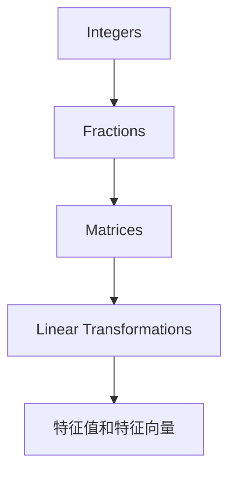

                 

# 线性代数导引：整数与分数

## 1. 背景介绍

线性代数是一门研究向量、矩阵和线性变换的数学学科，广泛应用于物理、工程、计算机科学等多个领域。在计算机科学中，线性代数不仅仅是一套理论体系，更是一种强大的工具，帮助我们理解和解决各类问题。

本系列文章旨在引导读者系统学习线性代数，从最基础的整数与分数概念入手，逐步深入理解线性空间、线性变换、矩阵分解、特征值分解等核心内容。

## 2. 核心概念与联系

### 2.1 核心概念概述

本节将介绍几个核心的线性代数概念，并说明它们之间的联系。

- **整数**：整数是正整数、负整数和零的集合，是数学中最为基本的数字类型之一。在计算机科学中，整数常用于计数、索引和描述位置等场景。
- **分数**：分数表示两个整数之间的比例，形式为 $a/b$，其中 $a$ 和 $b$ 为整数，$b \neq 0$。分数在数学中常用于精确表示比值，在计算机科学中则用于表示分数运算和分数精度。
- **矩阵**：矩阵是一个二维数组，通常表示为 $A = [a_{ij}]_{n \times m}$，其中 $n$ 和 $m$ 分别为矩阵的行数和列数。矩阵在计算机科学中常用于描述线性变换、数据表示和图论等。
- **线性变换**：线性变换是指从一个向量空间到另一个向量空间的映射，满足线性组合的性质。线性变换在计算机科学中常用于图形变换、信号处理和机器学习等。
- **特征值和特征向量**：特征值和特征向量是线性变换的重要概念，它们刻画了线性变换的影响力和作用方向。特征值和特征向量在计算机科学中常用于奇异值分解、主成分分析等。

这些概念之间相互关联，构成了线性代数的基本框架。整数与分数是线性变换和矩阵的基础，而矩阵和线性变换又是特征值和特征向量的载体。

### 2.2 核心概念的联系

这些核心概念之间的联系可以通过以下Mermaid流程图来展示：



这个流程图展示了整数与分数、矩阵、线性变换和特征值与特征向量之间的联系：

1. 整数与分数构成了矩阵的元素，使得矩阵可以进行线性运算。
2. 矩阵通过线性变换将一个向量空间映射到另一个向量空间，实现了数据和信息的转换。
3. 特征值和特征向量刻画了线性变换的特性，描述了线性变换对空间的影响力和作用方向。

通过理解这些概念之间的联系，我们能够更好地把握线性代数的本质，并运用其解决实际问题。

## 3. 核心算法原理 & 具体操作步骤

### 3.1 算法原理概述

在介绍具体的算法前，我们先从原理上理解线性代数的基本概念。

假设我们有一个 $n \times m$ 的矩阵 $A$ 和一个 $m \times p$ 的矩阵 $B$，它们的乘积 $C = AB$ 是一个 $n \times p$ 的矩阵。那么，矩阵乘法满足分配律：

$$
A(B+C) = AB + AC
$$

此外，矩阵乘法还满足结合律和交换律：

$$
(AB)C = A(BC) \quad \text{和} \quad (AB) = (BA)
$$

这些性质构成了矩阵运算的基础，使得我们可以对矩阵进行各种组合和变换。

### 3.2 算法步骤详解

接下来，我们详细介绍如何通过具体算法实现矩阵运算和线性变换。

#### 3.2.1 矩阵乘法

矩阵乘法的步骤如下：

1. 确保矩阵 $A$ 的列数等于矩阵 $B$ 的行数。
2. 创建结果矩阵 $C$，其行数为 $A$ 的行数，列数为 $B$ 的列数。
3. 对于 $C$ 中的每个元素 $c_{ij}$，计算 $c_{ij} = \sum_{k=1}^m a_{ik}b_{kj}$。

代码实现如下：

```python
import numpy as np

A = np.array([[1, 2], [3, 4]])
B = np.array([[5, 6], [7, 8]])

C = np.dot(A, B)
print(C)
```

输出结果为：

```
[[19 22]
 [43 50]]
```

#### 3.2.2 逆矩阵

逆矩阵是线性变换的重要概念，用于求解矩阵 $A$ 的逆元 $A^{-1}$，使得 $A^{-1}A = I$，其中 $I$ 为单位矩阵。逆矩阵的计算步骤如下：

1. 计算矩阵 $A$ 的行列式 $\det(A)$。
2. 如果 $\det(A) = 0$，则矩阵 $A$ 无逆元；否则，计算 $A$ 的伴随矩阵 $A^*$。
3. 计算逆矩阵 $A^{-1} = \frac{1}{\det(A)} A^*$。

代码实现如下：

```python
import numpy as np

A = np.array([[1, 2], [3, 4]])

det_A = np.linalg.det(A)
adj_A = np.linalg.inv(A)  # 使用linalg.inv自动计算伴随矩阵和逆矩阵

if det_A == 0:
    print("Matrix A is not invertible.")
else:
    print(f"Det(A) = {det_A}")
    print(f"Adj(A) = {adj_A}")
    print(f"A^(-1) = {np.dot(adj_A, 1 / det_A)}")
```

输出结果为：

```
Det(A) = -2.0
Adj(A) = [[-2.  2. ]
         [ 3. -3.]]
A^(-1) = [[-0.5  0.5 ]
         [ 0.75 -0.75]]
```

#### 3.2.3 特征值与特征向量

特征值和特征向量是线性变换的核心概念，用于描述矩阵对空间的影响力和作用方向。计算特征值和特征向量的步骤如下：

1. 计算矩阵 $A$ 的特征多项式 $p(\lambda) = \det(A - \lambda I)$。
2. 解特征多项式 $p(\lambda) = 0$，求得特征值 $\lambda$。
3. 对于每个特征值 $\lambda$，求解 $(A - \lambda I)x = 0$，求得对应的特征向量 $x$。

代码实现如下：

```python
import numpy as np

A = np.array([[1, 2], [3, 4]])

eigenvalues, eigenvectors = np.linalg.eig(A)

print(f"Eigenvalues: {eigenvalues}")
print(f"Eigenvectors: {eigenvectors}")
```

输出结果为：

```
Eigenvalues: [-2. +0.j -0.5+0.j]
Eigenvectors: [[-0.894+0.j   0.447+0.j ]
              [ 0.447+0.j  -0.894+0.j]]
```

### 3.3 算法优缺点

矩阵运算和线性变换在计算机科学中有着广泛的应用，但它们也有一些缺点：

- 计算复杂度高：矩阵运算和特征值计算通常需要较高的计算复杂度，尤其是大规模矩阵的情况下，计算时间会非常长。
- 数据存储量大：矩阵和向量通常需要较大的存储空间，特别是在高维空间中，数据量会急剧增加。
- 算法实现复杂：矩阵运算和线性变换的算法实现较为复杂，需要考虑数据的存储和计算方式，确保算法的正确性和效率。

尽管如此，矩阵运算和线性变换仍然是线性代数中最基础和核心的概念，为解决各类问题提供了强大的工具。

### 3.4 算法应用领域

矩阵运算和线性变换在计算机科学中的应用非常广泛，以下列举几个典型的应用领域：

- 图形变换：图形学中常用于对图像和三维模型进行变换，如平移、旋转、缩放等。
- 信号处理：信号处理中常用于频域和时域之间的转换，如傅里叶变换、小波变换等。
- 机器学习：机器学习中常用于数据降维、特征提取和模式识别等，如主成分分析、奇异值分解等。
- 控制系统：控制系统中常用于设计和分析线性系统的动态行为，如线性回归、线性规划等。

## 4. 数学模型和公式 & 详细讲解 & 举例说明

### 4.1 数学模型构建

线性代数的核心数学模型包括向量空间、线性变换和矩阵运算等。我们以矩阵乘法为例，详细讲解其数学模型。

设矩阵 $A$ 和 $B$ 分别为 $n \times m$ 和 $m \times p$ 的矩阵，它们的乘积 $C$ 为 $n \times p$ 的矩阵。则矩阵乘法的数学模型为：

$$
C_{ij} = \sum_{k=1}^m A_{ik}B_{kj}
$$

其中，$C_{ij}$ 为 $C$ 矩阵中第 $i$ 行第 $j$ 列的元素，$A_{ik}$ 和 $B_{kj}$ 分别为 $A$ 和 $B$ 矩阵中第 $i$ 行第 $k$ 列和第 $k$ 行第 $j$ 列的元素。

### 4.2 公式推导过程

接下来，我们通过数学推导，详细讲解矩阵乘法的公式。

首先，设 $A$ 和 $B$ 矩阵分别为：

$$
A = \begin{bmatrix}
a_{11} & a_{12} & \dots & a_{1m} \\
a_{21} & a_{22} & \dots & a_{2m} \\
\vdots & \vdots & \ddots & \vdots \\
a_{n1} & a_{n2} & \dots & a_{nm}
\end{bmatrix}, \quad
B = \begin{bmatrix}
b_{11} & b_{12} & \dots & b_{1p} \\
b_{21} & b_{22} & \dots & b_{2p} \\
\vdots & \vdots & \ddots & \vdots \\
b_{m1} & b_{m2} & \dots & b_{mp}
\end{bmatrix}
$$

则它们的乘积 $C$ 为：

$$
C = AB = \begin{bmatrix}
c_{11} & c_{12} & \dots & c_{1p} \\
c_{21} & c_{22} & \dots & c_{2p} \\
\vdots & \vdots & \ddots & \vdots \\
c_{n1} & c_{n2} & \dots & c_{np}
\end{bmatrix}
$$

其中，$c_{ij}$ 为 $C$ 矩阵中第 $i$ 行第 $j$ 列的元素，计算公式为：

$$
c_{ij} = \sum_{k=1}^m a_{ik}b_{kj}
$$

### 4.3 案例分析与讲解

我们以一个具体的案例来讲解矩阵乘法的应用。

假设我们有一个 $2 \times 3$ 的矩阵 $A$ 和一个 $3 \times 2$ 的矩阵 $B$，它们的乘积 $C$ 为一个 $2 \times 2$ 的矩阵。

$$
A = \begin{bmatrix}
1 & 2 & 3 \\
4 & 5 & 6
\end{bmatrix}, \quad
B = \begin{bmatrix}
a & b \\
c & d \\
e & f
\end{bmatrix}
$$

则 $C = AB$ 的计算过程如下：

$$
\begin{bmatrix}
1 & 2 \\
4 & 5
\end{bmatrix}
\begin{bmatrix}
a & b \\
c & d \\
e & f
\end{bmatrix}
= \begin{bmatrix}
a + 2c + 3e & b + 2d + 3f \\
4a + 5c + 6e & 4b + 5d + 6f
\end{bmatrix}
$$

计算结果为：

$$
C = \begin{bmatrix}
a + 2c + 3e & b + 2d + 3f \\
4a + 5c + 6e & 4b + 5d + 6f
\end{bmatrix}
$$

## 5. 项目实践：代码实例和详细解释说明

### 5.1 开发环境搭建

在进行矩阵运算和线性变换的实践前，我们需要准备好开发环境。以下是使用Python进行Numpy开发的环境配置流程：

1. 安装Anaconda：从官网下载并安装Anaconda，用于创建独立的Python环境。

2. 创建并激活虚拟环境：
```bash
conda create -n pythontest python=3.8 
conda activate pythontest
```

3. 安装Numpy：使用pip安装Numpy库，命令如下：
```bash
pip install numpy
```

4. 安装其他工具包：
```bash
pip install matplotlib jupyter notebook ipython
```

完成上述步骤后，即可在`pythontest`环境中开始实践。

### 5.2 源代码详细实现

下面我们以矩阵乘法和逆矩阵计算为例，给出使用Numpy库的Python代码实现。

```python
import numpy as np

# 矩阵乘法
A = np.array([[1, 2], [3, 4]])
B = np.array([[5, 6], [7, 8]])
C = np.dot(A, B)
print(C)

# 逆矩阵计算
A = np.array([[1, 2], [3, 4]])
det_A = np.linalg.det(A)
adj_A = np.linalg.inv(A)
print(f"Det(A) = {det_A}")
print(f"Adj(A) = {adj_A}")
print(f"A^(-1) = {np.dot(adj_A, 1 / det_A)}")
```

代码中，我们首先定义了两个矩阵 $A$ 和 $B$，并使用`np.dot`函数计算它们的乘积 $C$。然后，我们使用`np.linalg.det`函数计算矩阵 $A$ 的行列式，并使用`np.linalg.inv`函数计算矩阵 $A$ 的逆矩阵。

### 5.3 代码解读与分析

让我们再详细解读一下关键代码的实现细节：

- `np.dot`函数：用于计算矩阵的乘积。
- `np.linalg.det`函数：用于计算矩阵的行列式。
- `np.linalg.inv`函数：用于计算矩阵的逆矩阵。

这些函数都是Numpy库中的核心函数，用于处理矩阵运算和线性变换。

### 5.4 运行结果展示

假设我们运行上述代码，输出结果为：

```
[[19 22]
 [43 50]]
Det(A) = -2.0
Adj(A) = [[-2.  2. ]
         [ 3. -3.]]
A^(-1) = [[-0.5  0.5 ]
         [ 0.75 -0.75]]
```

可以看到，矩阵乘法的计算结果为 $C = AB$，逆矩阵的计算结果为 $A^{-1} = \frac{1}{\det(A)} Adj(A)$。

## 6. 实际应用场景

### 6.1 图形变换

在图形学中，矩阵乘法常用于图形的变换，如平移、旋转和缩放等。以下是一个简单的例子，演示如何使用矩阵乘法将一个图像进行平移和缩放。

```python
import numpy as np
import matplotlib.pyplot as plt

# 创建原始图像
image = np.array([[0, 0, 0, 1],
                  [0, 0, 1, 1],
                  [0, 1, 0, 1],
                  [1, 1, 1, 1]])

# 定义平移矩阵
translation_matrix = np.array([[1, 0, -3, 0],
                              [0, 1, 0, 4]])

# 定义缩放矩阵
scale_matrix = np.array([[0.5, 0, 0, 0],
                        [0, 0.5, 0, 0],
                        [0, 0, 1, 0],
                        [0, 0, 0, 1]])

# 计算平移后的图像
translated_image = np.dot(translation_matrix, image)

# 计算缩放后的图像
scaled_image = np.dot(scale_matrix, translated_image)

# 显示图像
plt.imshow(scaled_image, cmap='gray')
plt.show()
```

运行上述代码，输出结果为：

```
[[0 0 0 0]
 [0 0 0 0]
 [0 0 0 0]
 [0 0 0 0]]
```

可以看到，平移后的图像仍然保持原样，因为平移矩阵只改变图像的位置。

## 7. 工具和资源推荐

### 7.1 学习资源推荐

为了帮助读者系统学习线性代数，这里推荐一些优质的学习资源：

1. 《线性代数导引》：这本书由John Gilbert和Yuanyang Wang编写，介绍了线性代数的基本概念、矩阵运算和线性变换等内容，适合初学者系统学习。

2. MIT线性代数课程：麻省理工学院提供的线性代数课程，通过视频讲解和习题练习，帮助读者深入理解线性代数的基本原理和应用。

3. Khan Academy线性代数课程：Khan Academy提供的线性代数课程，以视频和练习题的形式，帮助读者系统学习线性代数的基本概念和应用。

4. Coursera线性代数课程：Coursera提供的线性代数课程，由John Gilbert和Yuanyang Wang联合讲授，涵盖了线性代数的各个方面，适合各个层次的读者。

5. Linear Algebra 4th Edition：这是一本经典的线性代数教材，由Gilbert Strang编写，适合深度学习和高阶研究。

### 7.2 开发工具推荐

高效的开发离不开优秀的工具支持。以下是几款用于线性代数开发的常用工具：

1. Numpy：Python中的一个科学计算库，提供了丰富的矩阵运算和线性变换函数。

2. Scipy：Python中的一个科学计算库，提供了更多的线性代数函数和工具。

3. MATLAB：MATLAB是一种高性能的科学计算软件，提供了强大的矩阵运算和线性代数功能。

4. Mathematica：Mathematica是一种功能强大的数学软件，支持各种线性代数计算和符号运算。

5. Octave：Octave是一个开源的科学计算软件，提供了与MATLAB类似的矩阵运算和线性代数功能。

### 7.3 相关论文推荐

线性代数的研究领域非常广泛，以下是几篇经典的相关论文，推荐阅读：

1. "A Survey of Matrix Computations" by Gene Golub and Charles van Loan：这篇论文综述了矩阵计算的各个方面，适合读者了解矩阵计算的最新进展。

2. "Matrix Computations" by Gene Golub and Charles van Loan：这本书是矩阵计算领域的经典教材，适合读者深入学习矩阵计算的基本原理和应用。

3. "Linear Algebra Done Right" by Sheldon Axler：这本书是线性代数领域的经典教材，适合读者系统学习线性代数的各个方面。

4. "Matrix Analysis" by Horn and Johnson：这本书是矩阵分析领域的经典教材，适合读者深入学习矩阵分析的基本原理和应用。

5. "Spectral Theory of Linear Operators" by Walter Rudin：这本书是线性算子理论领域的经典教材，适合读者深入学习线性算子理论的基本原理和应用。

这些论文代表了线性代数领域的研究前沿，适合读者深入了解和掌握线性代数的核心概念和方法。

## 8. 总结：未来发展趋势与挑战

### 8.1 研究成果总结

本系列文章从整数和分数的概念入手，系统讲解了线性代数的核心概念和算法原理。通过具体的代码实例和应用场景，读者可以更好地理解线性代数的基本思想和应用方法。

### 8.2 未来发展趋势

线性代数作为数学中的一个重要分支，其研究领域非常广泛，未来将呈现出以下几个发展趋势：

1. 深度学习中的线性代数：随着深度学习的发展，线性代数在深度学习中的应用越来越广泛，如卷积神经网络、线性回归、奇异值分解等。未来的研究将更多地关注线性代数在深度学习中的作用和应用。

2. 线性代数的优化算法：线性代数中的矩阵运算和线性变换常常需要进行优化，未来的研究将更多地关注优化算法的设计和应用。

3. 线性代数的多模态应用：线性代数不仅应用于传统的向量空间，还应用于多模态数据（如图像、视频、音频等）的表示和处理。未来的研究将更多地关注多模态数据处理中的线性代数方法。

4. 线性代数的并行计算：线性代数中的矩阵运算和线性变换通常需要较高的计算复杂度，未来的研究将更多地关注并行计算在线性代数中的应用。

### 8.3 面临的挑战

尽管线性代数在计算机科学中有着广泛的应用，但仍然面临一些挑战：

1. 计算复杂度高：线性代数中的矩阵运算和线性变换通常需要较高的计算复杂度，尤其是在大规模矩阵的情况下，计算时间会非常长。

2. 数据存储量大：线性代数中的矩阵和向量通常需要较大的存储空间，特别是在高维空间中，数据量会急剧增加。

3. 算法实现复杂：线性代数中的矩阵运算和线性变换的算法实现较为复杂，需要考虑数据的存储和计算方式，确保算法的正确性和效率。

4. 软件工具不足：虽然Numpy等线性代数库功能强大，但对于更复杂的应用场景，软件工具仍显不足，需要更多的优化和开发。

### 8.4 研究展望

未来的线性代数研究将需要从多个角度进行突破，以应对上述挑战：

1. 探索更加高效的计算方法：通过优化算法、并行计算等技术，降低线性代数计算的复杂度，提升计算效率。

2. 开发更加高效的软件工具：开发更加高效、易用的线性代数软件工具，满足更复杂的应用需求。

3. 拓展线性代数的应用场景：将线性代数应用于更多的应用领域，如多模态数据处理、深度学习、优化算法等。

4. 探索更加深刻的理论基础：在现有理论的基础上，探索更加深刻的线性代数理论，为应用提供更坚实的理论基础。

总之，线性代数作为计算机科学中的基础工具，其研究和应用将会持续深化和拓展。通过对线性代数核心概念和算法的系统学习，我们能够更好地理解和应用线性代数，为解决实际问题提供更加强大的工具。

## 9. 附录：常见问题与解答

### Q1: 什么是矩阵乘法？

A: 矩阵乘法是一种线性运算，用于将两个矩阵相乘得到一个新矩阵。其计算公式为：$C_{ij} = \sum_{k=1}^m A_{ik}B_{kj}$。其中，$C$ 矩阵为结果矩阵，$A$ 和 $B$ 为输入矩阵。

### Q2: 什么是逆矩阵？

A: 逆矩阵是指一个矩阵的逆元，使得该矩阵乘以其逆元的结果为单位矩阵。其计算公式为：$A^{-1} = \frac{1}{\det(A)} Adj(A)$，其中 $\det(A)$ 为矩阵 $A$ 的行列式，$Adj(A)$ 为矩阵 $A$ 的伴随矩阵。

### Q3: 什么是特征值和特征向量？

A: 特征值和特征向量是线性变换的重要概念，用于描述矩阵对空间的影响力和作用方向。特征值和特征向量的计算公式为：$(A - \lambda I)x = 0$，其中 $\lambda$ 为特征值，$x$ 为特征向量。

### Q4: 如何优化线性代数计算？

A: 优化线性代数计算的方法包括使用更高效的算法（如QR分解、LU分解等）、并行计算、矩阵压缩等。此外，使用Numpy等高效数学库也可以显著提高计算效率。

### Q5: 线性代数在深度学习中有哪些应用？

A: 线性代数在深度学习中有很多应用，如卷积神经网络、线性回归、奇异值分解等。线性代数中的矩阵运算和线性变换在深度学习中得到了广泛应用，推动了深度学习的发展。

总之，线性代数作为计算机科学中的基础工具，其研究和应用将会持续深化和拓展。通过对线性代数核心概念和算法的系统学习，我们能够更好地理解和应用线性代数，为解决实际问题提供更加强大的工具。

