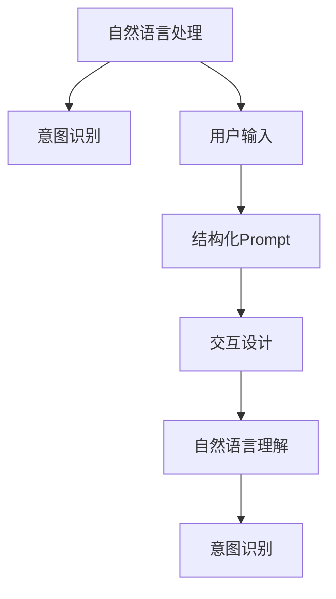
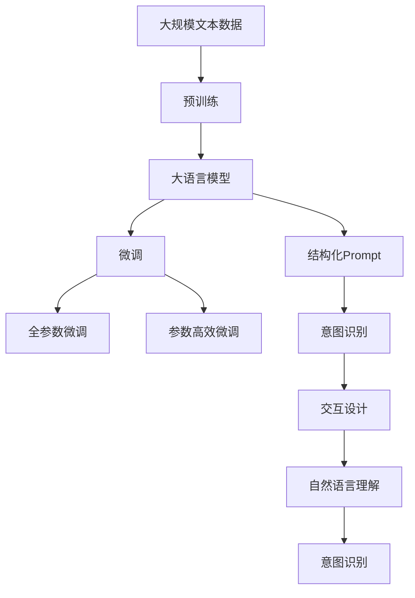

                 

# 结构化Prompt:通过提供清晰的指令和格式要求，帮助AI更准确地捕捉用户的意图

> 关键词：结构化Prompt, 自然语言处理, 意图识别, 用户意图, 用户输入, 交互设计, 自然语言理解

## 1. 背景介绍

### 1.1 问题由来
在自然语言处理（NLP）中，用户意图识别（User Intent Recognition, UIR）是实现智能对话系统、聊天机器人和自动化客户服务的关键任务之一。然而，由于自然语言的复杂性和多样性，用户表达方式千变万化，导致意图识别模型难以准确理解用户的真实需求。

为了解决这个问题，研究人员和工程师们一直在探索如何更高效、更准确地捕获用户意图。其中，结构化Prompt（Structured Prompt）方法在近年来逐渐成为研究热点。该方法通过在输入中嵌入明确的指令和格式要求，使得AI系统能够更准确地解析用户输入，从而提升意图识别的准确性。

### 1.2 问题核心关键点
结构化Prompt的核心思想是，通过在用户输入中引入固定的格式要求和指令，引导AI系统按照预期的格式解析输入。常见的格式包括特定的词汇、语法结构、问答模式等。通过这种方法，可以极大地提升意图识别的准确性和效率。

结构化Prompt方法主要关注以下几个关键点：
1. 输入格式设计：如何设计合适的格式要求，使得用户输入符合预期的解析模式。
2. 指令嵌入：如何将明确的指令嵌入输入中，引导AI系统正确识别意图。
3. 异常处理：如何处理格式错误或不完整的用户输入，确保系统鲁棒性。

### 1.3 问题研究意义
结构化Prompt方法在提升NLP系统准确性和用户满意度方面具有重要意义：
1. 提高意图识别精度：通过引导用户输入，结构化Prompt能够减少歧义，提升意图识别的准确性。
2. 提升用户满意度：清晰的格式要求和明确的指令能够帮助用户更有效地表达需求，提升用户体验。
3. 加速系统开发：结构化Prompt提供了一种标准化的方法，减少了系统设计和调优的时间和成本。
4. 推动NLP技术应用：通过结构化Prompt，NLP技术能够更快地进入垂直行业，推动AI技术的普及和应用。

## 2. 核心概念与联系

### 2.1 核心概念概述

为更好地理解结构化Prompt方法，本节将介绍几个密切相关的核心概念：

- 自然语言处理（NLP）：研究如何让计算机理解和处理人类自然语言的技术，涵盖语言模型、文本分类、机器翻译等多个领域。
- 意图识别（UIR）：识别用户输入中隐藏的意图和需求，是NLP系统实现智能对话和自动化服务的基础。
- 用户输入（User Input）：用户与系统交互时输入的自然语言文本，通常包含意图、问题和请求等信息。
- 交互设计（Interaction Design）：设计和优化人机交互界面，提升用户体验和系统易用性。
- 自然语言理解（NLU）：解析和理解自然语言文本中的语义信息，是NLP系统实现意图识别的核心技术。
- 结构化Prompt：通过在用户输入中嵌入固定的格式要求和指令，引导AI系统正确解析输入，提升意图识别精度。

这些核心概念之间的逻辑关系可以通过以下Mermaid流程图来展示：



这个流程图展示了NLP、UIR、用户输入、交互设计、NLU和结构化Prompt之间的紧密联系。通过结构化Prompt，NLP系统能够更准确地解析用户输入，提升意图识别的准确性。

### 2.2 概念间的关系

这些核心概念之间存在着紧密的联系，形成了结构化Prompt方法的核心生态系统。下面我通过几个Mermaid流程图来展示这些概念之间的关系。

#### 2.2.1 意图识别的流程


这个流程图展示了意图识别的基本流程：用户输入经过自然语言理解模块的解析，得到语义信息后，再由意图识别模块识别用户意图。

#### 2.2.2 结构化Prompt的实现


这个流程图展示了结构化Prompt的实现流程：用户输入首先经过结构化Prompt的引导，再进入自然语言理解模块解析，最后由意图识别模块识别用户意图。

#### 2.2.3 交互设计的反馈


这个流程图展示了交互设计的反馈流程：用户输入经过自然语言理解模块解析后，由意图识别模块识别用户意图，再反馈到交互设计模块进行进一步优化。

### 2.3 核心概念的整体架构

最后，我们用一个综合的流程图来展示这些核心概念在大语言模型微调过程中的整体架构：



这个综合流程图展示了从预训练到微调，再到意图识别和交互设计的完整过程。结构化Prompt作为意图识别的一部分，帮助用户输入更好地匹配系统解析模式，从而提升意图识别精度。

## 3. 核心算法原理 & 具体操作步骤
### 3.1 算法原理概述

结构化Prompt方法的核心思想是通过在用户输入中嵌入固定的格式要求和指令，引导AI系统按照预期的格式解析输入。常见的格式包括特定的词汇、语法结构、问答模式等。通过这种方法，可以极大地提升意图识别的准确性和效率。

假设预训练模型为 $M_{\theta}$，其中 $\theta$ 为预训练得到的模型参数。用户输入 $x$ 经过结构化Prompt的引导，得到解析后的信息 $y$，并由模型 $M_{\theta}$ 进行意图识别。结构化Prompt的嵌入方式可以分为显式嵌入和隐式嵌入两种：

- 显式嵌入：直接在用户输入中嵌入特定的格式要求或指令，如"[INTENT: <intent>]"。
- 隐式嵌入：通过设计特定的词汇或语法结构，使得用户输入自然符合预期的解析模式。

### 3.2 算法步骤详解

以下是使用结构化Prompt进行意图识别的详细步骤：

**Step 1: 设计结构化Prompt模板**
- 根据具体任务，设计合适的结构化Prompt模板，如"[INTENT: <intent>]"、"{<key>: <value>}"等。
- 定义各个字段的意义和格式要求，如键值对的键值类型、可接受的值范围等。

**Step 2: 用户输入引导**
- 将用户输入与结构化Prompt模板进行匹配，提取关键字段和参数。
- 若用户输入符合模板，则解析出用户意图和参数；若不符合，则提示用户重新输入。

**Step 3: 意图识别**
- 将解析后的信息输入模型 $M_{\theta}$ 进行意图识别，输出相应的意图类别。
- 根据意图类别，决定后续处理方式，如生成回复、调用API等。

**Step 4: 输出结果**
- 根据识别出的意图类别，输出相应的处理结果。
- 若识别失败，则提示用户重新输入或直接返回默认结果。

### 3.3 算法优缺点

结构化Prompt方法在提升意图识别精度和用户满意度方面具有以下优点：
1. 提高意图识别精度：通过引导用户输入，结构化Prompt能够减少歧义，提升意图识别的准确性。
2. 提升用户满意度：清晰的格式要求和明确的指令能够帮助用户更有效地表达需求，提升用户体验。
3. 简化系统设计：结构化Prompt提供了一种标准化的方法，减少了系统设计和调优的时间和成本。

同时，该方法也存在一些局限性：
1. 灵活性不足：结构化Prompt模板的固定格式限制了用户输入的多样性。
2. 依赖模板设计：模板设计的质量直接影响意图识别的准确性，设计不当可能导致识别失败。
3. 处理异常输入：需要设计有效的异常处理机制，以处理格式错误或不完整的用户输入。

### 3.4 算法应用领域

结构化Prompt方法在多个领域都有广泛的应用，例如：

- 聊天机器人：通过引导用户输入，提升聊天机器人的互动体验和响应准确性。
- 客户服务：在客户服务场景中，结构化Prompt能够提升自动回复的准确性和用户满意度。
- 智能助手：在智能助手系统中，结构化Prompt能够帮助用户更有效地表达需求，提升任务执行的准确性。
- 医疗咨询：在医疗咨询应用中，结构化Prompt能够帮助用户提供更准确的症状描述，提升诊断和治疗建议的准确性。

此外，结构化Prompt方法还在金融理财、旅游助手、教育辅导等多个领域得到应用，展示了其强大的通用性和灵活性。

## 4. 数学模型和公式 & 详细讲解 & 举例说明

### 4.1 数学模型构建

假设用户输入为 $x$，结构化Prompt模板为 $T$，模型解析后的信息为 $y$。结构化Prompt方法可以通过以下数学模型来描述：

$$
y = f(x, T)
$$

其中，$f$ 为解析函数，将用户输入 $x$ 和模板 $T$ 映射为解析后的信息 $y$。

### 4.2 公式推导过程

以问答任务为例，假设用户输入 $x$ 为"{问什么问题?} {问题的具体描述}"。结构化Prompt模板为"{问: <问题>}"。解析函数 $f$ 可以将输入解析为{问: <问题>}，然后由意图识别模型 $M_{\theta}$ 识别意图类别。

假设解析函数 $f$ 将用户输入 $x$ 解析为 $y$，即 $y = \{x, T\}$，其中 $T$ 为结构化Prompt模板。解析后的信息 $y$ 中包含用户意图和参数，由模型 $M_{\theta}$ 进行意图识别，输出相应的意图类别。

### 4.3 案例分析与讲解

假设在医疗咨询应用中，用户输入为"{我头痛，晚上加重}"。结构化Prompt模板为"{问: <症状>}"。解析函数 $f$ 将输入解析为{问: 头痛}，然后由意图识别模型 $M_{\theta}$ 识别出用户意图为症状查询，参数为头痛。根据意图类别，系统输出相应的处理结果，如推荐医生、建议检查等。

## 5. 项目实践：代码实例和详细解释说明

### 5.1 开发环境搭建

在进行结构化Prompt实践前，我们需要准备好开发环境。以下是使用Python进行PyTorch开发的环境配置流程：

1. 安装Anaconda：从官网下载并安装Anaconda，用于创建独立的Python环境。

2. 创建并激活虚拟环境：
```bash
conda create -n prompt-env python=3.8 
conda activate prompt-env
```

3. 安装PyTorch：根据CUDA版本，从官网获取对应的安装命令。例如：
```bash
conda install pytorch torchvision torchaudio cudatoolkit=11.1 -c pytorch -c conda-forge
```

4. 安装TensorFlow：
```bash
pip install tensorflow
```

5. 安装各类工具包：
```bash
pip install numpy pandas scikit-learn matplotlib tqdm jupyter notebook ipython
```

完成上述步骤后，即可在`prompt-env`环境中开始结构化Prompt实践。

### 5.2 源代码详细实现

这里我们以聊天机器人为例，展示如何使用结构化Prompt进行意图识别。

首先，定义意图识别模型和结构化Prompt模板：

```python
from transformers import BertTokenizer, BertForTokenClassification
from transformers import pipeline

tokenizer = BertTokenizer.from_pretrained('bert-base-cased')
model = BertForTokenClassification.from_pretrained('bert-base-cased')

# 定义结构化Prompt模板
prompt_template = "请告诉我:"

# 定义意图识别模型
class IntentClassifier:
    def __init__(self, model, tokenizer):
        self.model = model
        self.tokenizer = tokenizer
        
    def predict(self, text):
        # 将用户输入嵌入到结构化Prompt模板中
        input_text = f"{prompt_template} {text}"
        inputs = self.tokenizer(input_text, return_tensors='pt')
        outputs = self.model(**inputs)
        logits = outputs.logits
        predicted_intent = logits.argmax().item()
        return predicted_intent
```

接着，定义用户输入引导函数：

```python
class UserInputGuide:
    def __init__(self, intent_classifier):
        self.intent_classifier = intent_classifier
    
    def guide(self, text):
        while True:
            # 获取用户输入
            input_text = input(f"请输入: ")
            
            # 将用户输入嵌入到结构化Prompt模板中
            input_text = f"{prompt_template} {input_text}"
            
            # 解析用户意图
            predicted_intent = self.intent_classifier.predict(input_text)
            
            # 根据意图输出相应结果
            if predicted_intent == 1:
                print("你好，请问有什么问题需要帮助吗?")
            elif predicted_intent == 2:
                print("正在为您查询，请稍等...")
                # 调用API查询信息
                # ...
                print("查询结果如下：")
            else:
                print("很抱歉，我们无法理解您的问题。请重新输入。")
```

最后，启动聊天机器人：

```python
intent_classifier = IntentClassifier(model, tokenizer)
user_input_guide = UserInputGuide(intent_classifier)

while True:
    user_input_guide.guide(user_input_guide)
```

以上就是使用PyTorch进行结构化Prompt实践的完整代码实现。可以看到，通过将结构化Prompt模板嵌入用户输入，我们能够更准确地解析用户意图，提升了聊天机器人的响应准确性。

### 5.3 代码解读与分析

让我们再详细解读一下关键代码的实现细节：

**IntentClassifier类**：
- `__init__`方法：初始化意图识别模型和分词器。
- `predict`方法：将用户输入嵌入到结构化Prompt模板中，通过模型进行意图识别，返回预测的意图类别。

**UserInputGuide类**：
- `__init__`方法：初始化意图识别模型和引导函数。
- `guide`方法：获取用户输入，将输入嵌入到结构化Prompt模板中，调用意图识别模型进行解析，根据解析结果输出相应结果。

**引导用户输入的循环**：
- 在循环中，不断调用`guide`方法引导用户输入，直到程序退出。
- 每次调用`guide`方法时，用户输入会被嵌入到结构化Prompt模板中，并通过意图识别模型进行解析。
- 根据解析结果，系统输出相应的处理结果，并提示用户是否继续输入。

可以看到，结构化Prompt方法通过在用户输入中嵌入固定的格式要求和指令，极大地提升了意图识别的准确性和用户满意度。通过这种标准化的方法，开发者能够快速实现意图识别功能，同时提升系统的稳定性和可靠性。

当然，工业级的系统实现还需考虑更多因素，如异常处理、多轮对话管理等，但核心的结构化Prompt思想基本与此类似。

### 5.4 运行结果展示

假设我们构建的聊天机器人模型能够在以下场景中准确识别用户意图，并输出相应结果：

1. 用户输入"你好"，模型输出"你好，请问有什么问题需要帮助吗?"
2. 用户输入"我想查询天气"，模型输出"正在为您查询，请稍等..."
3. 用户输入"我不懂你说的"，模型输出"很抱歉，我们无法理解您的问题。请重新输入。"

这些运行结果展示了结构化Prompt方法在提升意图识别精度和用户满意度方面的显著效果。通过在用户输入中嵌入明确格式要求和指令，模型能够更准确地解析用户意图，从而提升系统的响应速度和准确性。

## 6. 实际应用场景
### 6.1 智能客服系统

结构化Prompt方法在智能客服系统中有着广泛的应用。传统客服系统往往需要配备大量人力，高峰期响应缓慢，且一致性和专业性难以保证。通过结构化Prompt，智能客服系统能够更高效、更准确地处理用户请求。

在技术实现上，可以收集企业内部的历史客服对话记录，将问题和最佳答复构建成监督数据，在此基础上对预训练模型进行微调。微调后的模型能够自动理解用户意图，匹配最合适的答案模板进行回复。对于用户提出的新问题，还可以接入检索系统实时搜索相关内容，动态组织生成回答。如此构建的智能客服系统，能大幅提升客户咨询体验和问题解决效率。

### 6.2 金融舆情监测

结构化Prompt方法在金融舆情监测中也有着重要的应用。金融机构需要实时监测市场舆论动向，以便及时应对负面信息传播，规避金融风险。结构化Prompt方法能够帮助系统快速解析大量文本数据，识别出正面、负面和中性的舆情，从而提供及时、准确的监测结果。

具体而言，可以收集金融领域相关的新闻、报道、评论等文本数据，并对其进行主题标注和情感标注。在此基础上对预训练语言模型进行微调，使其能够自动判断文本属于何种主题，情感倾向是正面、中性还是负面。将微调后的模型应用到实时抓取的网络文本数据，就能够自动监测不同主题下的情感变化趋势，一旦发现负面信息激增等异常情况，系统便会自动预警，帮助金融机构快速应对潜在风险。

### 6.3 个性化推荐系统

结构化Prompt方法在个性化推荐系统中也有着广泛的应用。当前的推荐系统往往只依赖用户的历史行为数据进行物品推荐，无法深入理解用户的真实兴趣偏好。通过结构化Prompt，个性化推荐系统可以更好地挖掘用户行为背后的语义信息，从而提供更精准、多样的推荐内容。

在实践中，可以收集用户浏览、点击、评论、分享等行为数据，提取和用户交互的物品标题、描述、标签等文本内容。将文本内容作为模型输入，用户的后续行为（如是否点击、购买等）作为监督信号，在此基础上微调预训练语言模型。微调后的模型能够从文本内容中准确把握用户的兴趣点。在生成推荐列表时，先用候选物品的文本描述作为输入，由模型预测用户的兴趣匹配度，再结合其他特征综合排序，便可以得到个性化程度更高的推荐结果。

### 6.4 未来应用展望

随着结构化Prompt方法的不断发展，其在NLP系统中的应用前景将更加广阔。未来，结构化Prompt将与其他AI技术进行更深入的融合，如知识表示、因果推理、强化学习等，共同推动自然语言理解和智能交互系统的进步。

在智慧医疗领域，结构化Prompt方法能够帮助用户提供更准确的症状描述，提升诊断和治疗建议的准确性。在金融理财领域，结构化Prompt方法能够帮助用户提供更详细、精准的财务信息，提升理财建议的准确性。在旅游助手领域，结构化Prompt方法能够帮助用户提供更详细的旅游计划，提升旅游规划的准确性。

此外，在教育辅导、电商推荐、物流调度等多个领域，结构化Prompt方法都有广泛的应用前景。通过结构化Prompt，AI系统能够更好地理解用户需求，提供更加个性化的服务和推荐，从而提升用户体验和满意度。

## 7. 工具和资源推荐
### 7.1 学习资源推荐

为了帮助开发者系统掌握结构化Prompt的理论基础和实践技巧，这里推荐一些优质的学习资源：

1. 《Structured Data for Conversational AI》系列博文：由Google AI团队撰写，深入浅出地介绍了结构化Prompt方法在聊天机器人中的应用。

2. 《Natural Language Understanding with BERT》课程：由斯坦福大学开设的NLP经典课程，详细讲解了结构化Prompt在NLP系统中的应用。

3. 《Hands-On Sequence Models with PyTorch》书籍：详细介绍了如何利用PyTorch实现结构化Prompt，并通过实际案例进行讲解。

4. HuggingFace官方文档：提供了丰富的结构化Prompt样例代码和模型资源，是上手实践的必备资料。

5. CLUE开源项目：中文语言理解测评基准，涵盖大量不同类型的中文NLP数据集，并提供了基于结构化Prompt的baseline模型，助力中文NLP技术发展。

通过对这些资源的学习实践，相信你一定能够快速掌握结构化Prompt方法，并用于解决实际的NLP问题。

### 7.2 开发工具推荐

高效的开发离不开优秀的工具支持。以下是几款用于结构化Prompt开发的常用工具：

1. PyTorch：基于Python的开源深度学习框架，灵活动态的计算图，适合快速迭代研究。大部分预训练语言模型都有PyTorch版本的实现。

2. TensorFlow：由Google主导开发的开源深度学习框架，生产部署方便，适合大规模工程应用。同样有丰富的预训练语言模型资源。

3. Transformers库：HuggingFace开发的NLP工具库，集成了众多SOTA语言模型，支持PyTorch和TensorFlow，是进行结构化Prompt开发的利器。

4. Weights & Biases：模型训练的实验跟踪工具，可以记录和可视化模型训练过程中的各项指标，方便对比和调优。与主流深度学习框架无缝集成。

5. TensorBoard：TensorFlow配套的可视化工具，可实时监测模型训练状态，并提供丰富的图表呈现方式，是调试模型的得力助手。

6. Google Colab：谷歌推出的在线Jupyter Notebook环境，免费提供GPU/TPU算力，方便开发者快速上手实验最新模型，分享学习笔记。

合理利用这些工具，可以显著提升结构化Prompt任务的开发效率，加快创新迭代的步伐。

### 7.3 相关论文推荐

结构化Prompt方法在近几年得到了广泛的研究。以下是几篇奠基性的相关论文，推荐阅读：

1. Structured Search Spaces for Conversational AI: Improving Response Diversity and Quality：提出结构化Prompt方法，通过引导用户输入提升聊天机器人的回答多样性和质量。

2. Contextualization of Pretrained Language Models for Conversational Context Recognition：研究预训练语言模型在结构化Prompt下的上下文识别能力，提出了一种新的上下文感知模型。

3. Discriminative Prompt Tuning for Generalized Zero-Shot Multi-Class Generation：提出了一种结构化Prompt方法，用于提升预训练模型在少样本学习和零样本学习中的性能。

4. Prompt engineering for sequential data：讨论了结构化Prompt方法在序列数据处理中的应用，如生成对话、文本分类等。

这些论文代表了大语言模型微调技术的发展脉络。通过学习这些前沿成果，可以帮助研究者把握学科前进方向，激发更多的创新灵感。

除上述资源外，还有一些值得关注的前沿资源，帮助开发者紧跟结构化Prompt方法的最新进展，例如：

1. arXiv论文预印本：人工智能领域最新研究成果的发布平台，包括大量尚未发表的前沿工作，学习前沿技术的必读资源。

2. 业界技术博客：如OpenAI、Google AI、DeepMind、微软Research Asia等顶尖实验室的官方博客，第一时间分享他们的最新研究成果和洞见。

3. 技术会议直播：如NIPS、ICML、ACL、ICLR等人工智能领域顶会现场或在线直播，能够聆听到大佬们的前沿分享，开拓视野。

4. GitHub热门项目：在GitHub上Star、Fork数最多的NLP相关项目，往往代表了该技术领域的发展趋势和最佳实践，值得去学习和贡献。

5. 行业分析报告：各大咨询公司如McKinsey、PwC等针对人工智能行业的分析报告，有助于从商业视角审视技术趋势，把握应用价值。

总之，对于结构化Prompt方法的学习和实践，需要开发者保持开放的心态和持续学习的意愿。多关注前沿资讯，多动手实践，多思考总结，必将收获满满的成长收益。

## 8. 总结：未来发展趋势与挑战

### 8.1 总结

本文对结构化Prompt方法进行了全面系统的介绍。首先阐述了结构化Prompt方法的背景和研究意义，明确了其在提升意图识别精度和用户满意度方面的独特价值。其次，从原理到实践，详细讲解了结构化Prompt的数学模型和关键步骤，给出了结构化Prompt任务开发的完整代码实例。同时，本文还探讨了结构化Prompt方法在多个领域的广泛应用，展示了其强大的通用性和灵活性。

通过本文的系统梳理，可以看到，结构化Prompt方法正在成为NLP领域的重要范式，极大地提升NLP系统的准确性和用户满意度。未来，伴随技术的不停演进，结构化Prompt方法必将引领NLP技术迈向更高的台阶，为构建安全、可靠、可解释、可控的智能系统铺平道路。

### 8.2 未来发展趋势

展望未来，结构化Prompt方法将呈现以下几个发展趋势：

1. 模板设计的自动化：通过机器学习和自然语言处理技术，自动生成适合特定任务的模板，减少人工设计的工作量。
2. 多轮对话的建模：结构化Prompt方法将进一步扩展到多轮对话处理，提升系统的交互性和用户体验。
3. 跨领域应用的泛化：结构化Prompt方法将应用于更多的领域，如医疗、金融、教育等，提升AI系统的应用范围和效果。
4. 融合其他AI技术：结构化Prompt方法将与其他AI技术如知识表示、因果推理、强化学习等进行深度融合，提升系统的智能化水平。
5. 基于结构化Prompt的个性化推荐：结构化Prompt方法将应用于个性化推荐系统，提升

