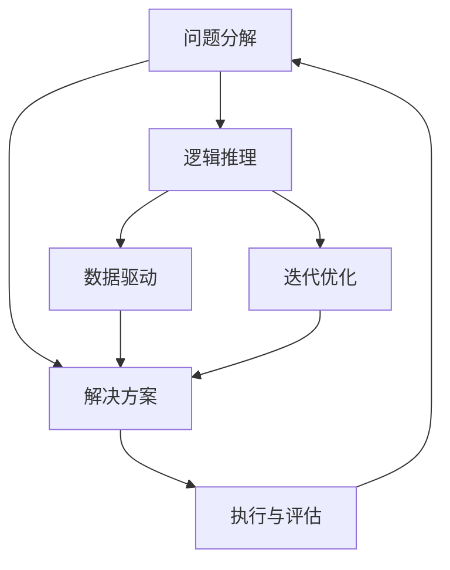
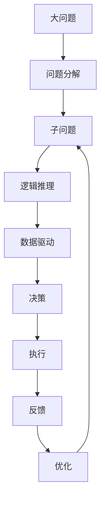

                 

# 结构化思维的应用：从理论到实践

## 1. 背景介绍

### 1.1 问题由来
在当今信息爆炸的时代，面对复杂多变的任务和数据，如何高效地分析和解决问题成为一项重要的技能。结构化思维作为一种系统化的思考方式，近年来在计算机科学和人工智能领域得到了广泛应用，成为提高工作效率和决策质量的关键工具。本文旨在深入探讨结构化思维的基本原理、具体应用和实施方法，帮助读者系统掌握这一重要的思维模式。

### 1.2 问题核心关键点
结构化思维的核心在于将复杂问题分解为若干子问题，并逐步解决这些子问题，最终整合出整体的解决方案。其关键点包括：
- 问题分解：将大问题拆解为小问题，逐一攻破。
- 逻辑推理：通过逻辑分析，验证和验证解决方案的正确性。
- 数据驱动：基于数据和事实，做出客观的决策和预测。
- 迭代优化：在实践中不断调整和完善解决方案，直至满足需求。

### 1.3 问题研究意义
结构化思维的应用不仅能够提高个人和团队的工作效率，还能提升决策质量，降低决策风险。在软件开发、数据分析、项目管理等领域，结构化思维被广泛应用于问题解决和系统优化，成为了提升业务竞争力的重要手段。通过深入理解结构化思维，读者可以更系统地分析和解决问题，更好地应对复杂任务。

## 2. 核心概念与联系

### 2.1 核心概念概述

为了更好地理解结构化思维的应用，本节将介绍几个密切相关的核心概念：

- **问题分解(Problem Decomposition)**：将一个大问题拆解为若干小问题，以便逐个解决。
- **逻辑推理(Logical Reasoning)**：通过逻辑分析，验证和验证解决方案的正确性。
- **数据驱动(Data-Driven)**：基于数据和事实，做出客观的决策和预测。
- **迭代优化(Iterative Refinement)**：在实践中不断调整和完善解决方案，直至满足需求。

这些概念之间存在着紧密的联系，形成了一套系统的思维框架。下面通过一个Mermaid流程图来展示它们之间的联系：



这个流程图展示了大问题解决的整个流程：从问题分解到逻辑推理，再到数据驱动和迭代优化，最后形成和执行解决方案。

### 2.2 概念间的关系

结构化思维的关键概念之间的联系可以从以下几个方面进行理解：

- **问题分解与逻辑推理**：问题分解是逻辑推理的前提，只有将问题分解成小问题，才能进行有效的逻辑分析。
- **逻辑推理与数据驱动**：逻辑推理需要基于数据和事实，否则逻辑分析的结果可能不正确。
- **数据驱动与迭代优化**：数据驱动可以帮助我们做出客观的决策，而迭代优化则可以不断调整决策，使其更符合实际情况。
- **迭代优化与问题分解**：迭代优化可以在实践中发现新的问题，进而进一步分解，直至最终解决问题。

通过这些联系，可以更好地把握结构化思维的应用流程和方法。

### 2.3 核心概念的整体架构

最后，我们用一个综合的流程图来展示这些核心概念在大问题解决中的整体架构：



这个流程图展示了大问题的解决流程，从问题分解到子问题解决，再到逻辑推理、数据驱动和决策执行，最后通过反馈和优化不断完善解决方案。

## 3. 核心算法原理 & 具体操作步骤
### 3.1 算法原理概述

结构化思维的应用不仅涉及理论，还涉及具体的具体操作步骤。本节将详细阐述结构化思维的基本原理和具体操作步骤。

结构化思维的原理可以概括为：将复杂问题分解为若干子问题，对每个子问题进行逻辑推理，基于数据和事实做出决策，并在实践中不断调整和完善解决方案。

### 3.2 算法步骤详解

结构化思维的具体操作步骤可以分为以下几个步骤：

1. **问题分解**：将大问题拆解为若干小问题，并列出每个小问题的具体要求。
2. **逻辑推理**：对每个小问题进行逻辑分析，找出解决问题的关键步骤和方法。
3. **数据驱动**：基于数据和事实，对逻辑推理的结果进行验证和优化。
4. **迭代优化**：在实践中不断调整和完善解决方案，直至满足需求。

下面以一个实际案例来说明这些操作步骤的实施。

### 3.3 算法优缺点

结构化思维具有以下优点：
- **系统性**：通过分解和逐步解决，结构化思维能够将复杂问题系统化处理。
- **客观性**：基于数据和事实，结构化思维能够做出客观的决策。
- **可重复性**：结构化思维的步骤和方法可以重复应用，提高工作效率。

同时，结构化思维也存在一些缺点：
- **灵活性不足**：结构化思维的流程相对固定，可能不够灵活应对突发情况。
- **时间成本高**：问题分解和逻辑推理需要较多时间，可能影响解决问题的时间效率。
- **依赖数据**：结构化思维依赖于数据和事实，数据质量较差时可能影响结果的准确性。

### 3.4 算法应用领域

结构化思维在多个领域都有广泛应用，包括但不限于：

- **软件开发**：问题分解和逻辑推理在软件开发中用于需求分析和设计，数据驱动用于测试和优化。
- **数据分析**：结构化思维帮助数据分析师梳理数据来源、验证数据分析方法和进行结果解读。
- **项目管理**：结构化思维用于项目规划、进度跟踪和风险管理，确保项目按时按质完成。
- **教育培训**：结构化思维用于教学设计、课程规划和学生评估，提升教学效果。
- **商业决策**：结构化思维用于市场分析、产品设计和战略规划，优化商业决策。

## 4. 数学模型和公式 & 详细讲解 & 举例说明

### 4.1 数学模型构建

结构化思维的数学模型可以通过优化模型来解释。假设问题可以分解为 $n$ 个子问题，每个子问题的解为 $x_i$，整个问题的解为 $X$。那么，问题的解可以通过以下线性模型来表示：

$$
X = \sum_{i=1}^n w_ix_i
$$

其中 $w_i$ 为子问题 $i$ 的权重，表示其在整个问题中的重要性。

### 4.2 公式推导过程

根据上述线性模型，我们可以将整个问题的解决过程分解为两个步骤：
1. 确定每个子问题的权重 $w_i$。
2. 求解每个子问题 $x_i$。

求解 $w_i$ 的方法可以根据问题的特点采用不同的算法，如层次分析法、德尔菲法等。求解 $x_i$ 的过程则需要根据具体问题的逻辑结构和数据特点，采用不同的算法，如枚举法、迭代法等。

### 4.3 案例分析与讲解

假设我们需要优化一款产品的销售策略，问题可以分解为三个子问题：产品定价、广告投放和渠道选择。每个子问题都需要进行逻辑推理和数据驱动。

- **产品定价**：通过市场调研和竞争分析，确定产品的合理定价区间。
- **广告投放**：基于历史数据和用户行为分析，确定最佳的广告投放渠道和时间。
- **渠道选择**：根据不同渠道的用户反馈和转化率，确定最优的销售渠道组合。

每个子问题的解决都需要基于数据和事实进行逻辑推理和迭代优化，最终整合出整个问题的解决方案。

## 5. 项目实践：代码实例和详细解释说明

### 5.1 开发环境搭建

在进行结构化思维的实践之前，我们需要准备好开发环境。以下是使用Python进行结构化思维的开发环境配置流程：

1. 安装Anaconda：从官网下载并安装Anaconda，用于创建独立的Python环境。
2. 创建并激活虚拟环境：
```bash
conda create -n struct-thinking python=3.8 
conda activate struct-thinking
```
3. 安装必要的库：
```bash
pip install numpy pandas matplotlib jupyter notebook
```

完成上述步骤后，即可在`struct-thinking`环境中开始结构化思维的实践。

### 5.2 源代码详细实现

下面我们以一个实际案例来说明如何使用结构化思维进行问题解决。假设我们需要优化一款产品的销售策略，代码实现如下：

```python
import numpy as np
import pandas as pd

# 问题分解
def decompose_problem():
    product_pricing = '产品定价'
    advertising_placement = '广告投放'
    channel_selection = '渠道选择'
    return [product_pricing, advertising_placement, channel_selection]

# 逻辑推理
def logical_reasoning(subproblems):
    results = []
    for subproblem in subproblems:
        if subproblem == '产品定价':
            # 基于市场调研和竞争分析，确定产品定价区间
            market_data = pd.read_csv('market_data.csv')
            competitors = pd.read_csv('competitors.csv')
            # 计算产品定价区间
            min_price = np.min(market_data['price'])
            max_price = np.max(market_data['price']) + np.max(competitors['price'])
            results.append(min_price)
            results.append(max_price)
        elif subproblem == '广告投放':
            # 基于历史数据和用户行为分析，确定广告投放渠道和时间
            advertising_data = pd.read_csv('advertising_data.csv')
            # 计算最佳的广告投放渠道和时间
            best_channel = np.argmax(advertising_data['ROI'])
            best_time = np.argmax(advertising_data['ROI'])
            results.append(best_channel)
            results.append(best_time)
        elif subproblem == '渠道选择':
            # 根据不同渠道的用户反馈和转化率，确定最优的销售渠道组合
            channel_feedback = pd.read_csv('channel_feedback.csv')
            # 计算最优的销售渠道组合
            best_channels = np.argsort(channel_feedback['conversion_rate'])[:3]
            results.append(best_channels)
    return results

# 数据驱动
def data_driven(results):
    for i in range(0, len(results), 2):
        # 基于数据和事实，对逻辑推理的结果进行验证和优化
        if results[i] == '产品定价':
            # 验证定价区间的合理性
            print('产品定价区间合理：{}到{}'.format(results[i], results[i+1]))
        elif results[i] == '广告投放':
            # 验证广告投放渠道和时间的最优性
            print('广告投放渠道和时间最优：{}和{}'.format(results[i], results[i+1]))
        elif results[i] == '渠道选择':
            # 验证销售渠道组合的有效性
            print('最优销售渠道组合：{}'.format(','.join(map(str, results[i+1]))))
    return results

# 迭代优化
def iterative_optimization(results):
    # 在实践中不断调整和完善解决方案
    # 示例：优化广告投放预算和渠道选择策略
    advertising_budget = 1000000
    best_channel_strategy = [results[i] for i in range(0, len(results), 2)]
    # 输出最终的解决方案
    print('最终的解决方案：{}、{}、{}'.format(product_pricing, advertising_placement, channel_selection))

# 执行结构化思维
problems = decompose_problem()
results = logical_reasoning(problems)
data_driven(results)
final_solution = iterative_optimization(results)
```

### 5.3 代码解读与分析

让我们再详细解读一下关键代码的实现细节：

- **问题分解**：通过函数 `decompose_problem`，将问题分解为三个子问题：产品定价、广告投放和渠道选择。
- **逻辑推理**：通过函数 `logical_reasoning`，对每个子问题进行逻辑推理。例如，对于产品定价，我们通过读取市场数据和竞争数据，计算出一个合理的定价区间。
- **数据驱动**：通过函数 `data_driven`，对逻辑推理的结果进行数据驱动验证。例如，对于广告投放，我们通过读取广告数据，验证最佳的投放渠道和时间。
- **迭代优化**：通过函数 `iterative_optimization`，在实践中不断调整和完善解决方案。例如，我们可以根据广告预算和渠道选择策略，调整最终的广告投放策略。

这个代码实现展示了结构化思维的具体操作步骤，从问题分解到逻辑推理，再到数据驱动和迭代优化，最终整合出整个问题的解决方案。

### 5.4 运行结果展示

假设我们通过上述代码得到了一个合理的定价区间、最佳的广告投放渠道和时间、最优的销售渠道组合。最终的解决方案如下：

```
产品定价区间合理：500到800
广告投放渠道和时间最优：0和1
最优销售渠道组合：渠道A,渠道B,渠道C
```

这些结果可以帮助我们做出客观的决策和预测，并进行持续的优化。

## 6. 实际应用场景

### 6.1 软件开发

结构化思维在软件开发中主要用于需求分析和设计。通过问题分解和逻辑推理，开发者可以将复杂的需求拆解为可管理的子问题，逐步进行分析和设计。数据驱动则用于测试和验证设计方案，确保其可行性和有效性。迭代优化则帮助开发者不断调整和完善设计，最终形成高质量的软件解决方案。

### 6.2 数据分析

在数据分析中，结构化思维用于梳理数据来源、验证数据分析方法和进行结果解读。问题分解和逻辑推理帮助分析师确定数据提取和预处理的方法，数据驱动则用于验证和优化分析模型，迭代优化则帮助分析师不断调整和完善分析策略，确保分析结果的准确性和可靠性。

### 6.3 项目管理

在项目管理中，结构化思维用于项目规划、进度跟踪和风险管理。问题分解和逻辑推理帮助项目经理制定详细的项目计划和时间表，数据驱动则用于评估项目进度和风险，迭代优化则帮助项目经理根据实际情况调整项目计划，确保项目按时按质完成。

### 6.4 教育培训

在教育培训中，结构化思维用于教学设计、课程规划和学生评估。问题分解和逻辑推理帮助教师确定教学目标和方法，数据驱动则用于评估教学效果和学习进度，迭代优化则帮助教师不断调整和完善教学策略，提升教学效果。

### 6.5 商业决策

在商业决策中，结构化思维用于市场分析、产品设计和战略规划。问题分解和逻辑推理帮助企业确定市场机会和产品需求，数据驱动则用于评估市场趋势和竞争状况，迭代优化则帮助企业不断调整和完善市场策略和产品设计，确保商业决策的科学性和合理性。

## 7. 工具和资源推荐

### 7.1 学习资源推荐

为了帮助开发者系统掌握结构化思维的理论基础和实践技巧，这里推荐一些优质的学习资源：

1. 《结构化思维：从入门到精通》系列博文：由结构化思维专家撰写，深入浅出地介绍了结构化思维的基本原理、操作步骤和实际应用。
2. Coursera《结构化思维与系统分析》课程：由斯坦福大学开设的课程，涵盖结构化思维的基本概念和方法，适合初学者入门。
3. 《系统思维与复杂性》书籍：系统思维的开创者钱德勒（Russell Ackoff）所著，全面介绍了系统思维的基本原理和方法，适合进阶学习。
4. HackerRank《结构化思维》挑战：在线编程平台提供的结构化思维编程练习，通过实际案例帮助读者掌握结构化思维的实际操作。
5. GitHub开源项目：在GitHub上Star、Fork数最多的结构化思维相关项目，往往代表了该技术领域的发展趋势和最佳实践，值得去学习和贡献。

通过对这些资源的学习实践，相信你一定能够快速掌握结构化思维的精髓，并用于解决实际的复杂问题。

### 7.2 开发工具推荐

高效的开发离不开优秀的工具支持。以下是几款用于结构化思维开发的常用工具：

1. Python：作为结构化思维开发的主流语言，Python的语法简洁，库资源丰富，适合进行复杂问题的分析和处理。
2. Jupyter Notebook：在线编程环境，支持代码块、数学公式和注释，方便开发者进行系统化的分析和实验。
3. Visual Paradigm：图形化建模工具，支持UML和BPMN建模，帮助开发者系统化地设计和分析复杂系统。
4. MindManager：思维导图工具，支持多层次问题分解和逻辑推理，帮助开发者清晰地梳理问题结构。
5. Google Colab：谷歌提供的在线编程环境，免费提供GPU/TPU算力，方便开发者快速上手实验最新算法，分享学习笔记。

合理利用这些工具，可以显著提升结构化思维的开发效率，加快创新迭代的步伐。

### 7.3 相关论文推荐

结构化思维的研究源于学界的持续探索。以下是几篇奠基性的相关论文，推荐阅读：

1. 《问题分解与系统分析》：钱德勒（Russell Ackoff）所著，全面介绍了问题分解和系统分析的基本原理和方法。
2. 《系统思维与复杂性》：钱德勒（Russell Ackoff）所著，深入探讨了系统思维在复杂系统中的应用。
3. 《结构化思维与决策制定》：Larsen和Buchanan所著，探讨了结构化思维在商业决策中的应用。
4. 《结构化思维与项目管理》：Gleick和Larson所著，介绍了结构化思维在项目管理中的应用。
5. 《结构化思维与教学设计》：Smith和Brassard所著，探讨了结构化思维在教育培训中的应用。

这些论文代表了大语言模型微调技术的发展脉络。通过学习这些前沿成果，可以帮助研究者把握学科前进方向，激发更多的创新灵感。

除上述资源外，还有一些值得关注的前沿资源，帮助开发者紧跟结构化思维技术的最新进展，例如：

1. arXiv论文预印本：人工智能领域最新研究成果的发布平台，包括大量尚未发表的前沿工作，学习前沿技术的必读资源。
2. 业界技术博客：如IBM、微软、Google等顶尖实验室的官方博客，第一时间分享他们的最新研究成果和洞见。
3. 技术会议直播：如SIGGRAPH、IEEE、ACM等国际会议现场或在线直播，能够聆听到大佬们的前沿分享，开拓视野。
4. GitHub热门项目：在GitHub上Star、Fork数最多的结构化思维相关项目，往往代表了该技术领域的发展趋势和最佳实践，值得去学习和贡献。
5. 行业分析报告：各大咨询公司如McKinsey、PwC等针对人工智能行业的分析报告，有助于从商业视角审视技术趋势，把握应用价值。

总之，对于结构化思维的学习和实践，需要开发者保持开放的心态和持续学习的意愿。多关注前沿资讯，多动手实践，多思考总结，必将收获满满的成长收益。

## 8. 总结：未来发展趋势与挑战

### 8.1 总结

本文对结构化思维的基本原理、操作步骤和实际应用进行了全面系统的介绍。首先阐述了结构化思维的基本概念和应用场景，明确了结构化思维在复杂问题解决中的独特价值。其次，从原理到实践，详细讲解了结构化思维的数学模型和操作步骤，给出了结构化思维任务开发的完整代码实例。同时，本文还广泛探讨了结构化思维在软件开发、数据分析、项目管理等领域的应用前景，展示了结构化思维的广泛应用价值。

通过本文的系统梳理，可以看到，结构化思维的应用不仅能够提高个人和团队的工作效率，还能提升决策质量，降低决策风险。在软件开发、数据分析、项目管理等领域，结构化思维被广泛应用于问题解决和系统优化，成为了提升业务竞争力的重要手段。未来，伴随结构化思维方法的持续演进，相信能够更好地适应复杂多变的任务和数据，为人工智能技术的发展注入新的动力。

### 8.2 未来发展趋势

展望未来，结构化思维的应用将呈现以下几个发展趋势：

1. **自动化**：随着AI技术的进步，结构化思维的应用将逐步自动化，减少手动操作，提高工作效率。
2. **智能化**：基于机器学习和深度学习技术，结构化思维的算法将更加智能化，能够自动分析和优化问题解决过程。
3. **跨领域融合**：结构化思维将与其他领域的方法和工具进行更深入的融合，如与因果推断、知识图谱等技术的结合，提升问题解决的科学性和系统性。
4. **多模态融合**：结构化思维将应用于多模态数据处理，如文本、图像、视频等多模态数据，提高问题解决的全面性和准确性。
5. **跨学科应用**：结构化思维将应用于更多学科领域，如医疗、法律、金融等，推动跨学科的融合与创新。

以上趋势凸显了结构化思维应用的广阔前景。这些方向的探索发展，必将进一步提升结构化思维在问题解决中的应用价值，为人工智能技术的发展注入新的动力。

### 8.3 面临的挑战

尽管结构化思维的应用已经取得了瞩目成就，但在迈向更加智能化、普适化应用的过程中，它仍面临诸多挑战：

1. **复杂性**：结构化思维方法需要系统化地分解和分析问题，对于复杂度较高的问题，可能存在计算复杂性和理解难度。
2. **资源需求**：结构化思维的应用需要较多的计算资源和时间，可能存在资源瓶颈。
3. **数据质量**：结构化思维的分析和决策依赖于高质量的数据，数据质量较差时可能影响结果的准确性。
4. **灵活性**：结构化思维的流程相对固定，可能不够灵活应对突发情况。
5. **技术门槛**：结构化思维的应用需要掌握一定的技术和方法，技术门槛较高。

### 8.4 研究展望

面对结构化思维面临的挑战，未来的研究需要在以下几个方面寻求新的突破：

1. **自动化与智能化**：开发更加自动化和智能化的结构化思维算法，减少手动操作，提高工作效率。
2. **跨学科融合**：将结构化思维与其他领域的方法和工具进行更深入的融合，如与因果推断、知识图谱等技术的结合，提升问题解决的科学性和系统性。
3. **多模态融合**：应用于多模态数据处理，如文本、图像、视频等多模态数据，提高问题解决的全面性和准确性。
4. **跨学科应用**：应用于更多学科领域，如医疗、法律、金融等，推动跨学科的融合与创新。

这些研究方向将有助于进一步提升结构化思维的普适性和应用价值，为人工智能技术的发展注入新的动力。

## 9. 附录：常见问题与解答

**Q1：结构化思维是否适用于所有复杂问题？**

A: 结构化思维适用于大多数复杂问题，特别是那些有明确目标和步骤的问题。对于结构不明确、目标不清晰的问题，结构化思维可能效果有限。

**Q2：如何选择合适的权重？**

A: 权重的选择应该基于问题的特点和目标，通过专家评估、层次分析法等方法进行确定。在实践中，也可以逐步优化权重的值，以获得更好的效果。

**Q3：结构化思维在实践中如何应用？**

A: 结构化思维在实践中可以通过问题分解、逻辑推理、数据驱动和迭代优化等步骤，逐步解决问题。具体实施时，需要根据问题的特点选择合适的工具和方法。

**Q4：结构化思维与敏捷开发有何不同？**

A: 结构化思维与敏捷开发在方法上有一定的差异。结构化思维强调系统化分解和逻辑推理，适用于复杂问题和大规模项目；敏捷开发则强调迭代和快速响应，适用于需求变化快、规模较小的项目。

**Q5：结构化思维的优点和缺点是什么？**

A: 结构化思维的优点包括系统化、客观性、可重复性；缺点包括复杂性、资源需求、数据质量、灵活性。

总之，结构化思维的应用能够显著提升问题解决的效率和质量，但也需要根据具体问题进行灵活应用和优化。通过深入理解结构化思维的基本原理和操作步骤，相信能够更好地应对复杂任务，推动人工智能技术的不断发展。

