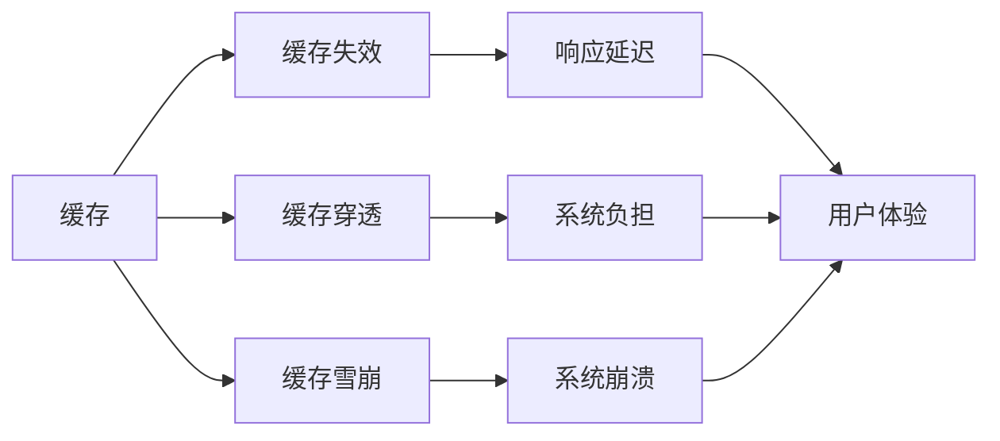

                 

## 1. 背景介绍

在当今数字化时代，应用系统在高吞吐量场景下需要处理海量请求，这无疑对后端系统的设计和实现提出了巨大挑战。高效的数据存储和处理机制成为了提升系统性能的关键。其中，缓存机制（Caching Mechanism）作为一种常见的性能优化手段，在应对高并发和高吞吐量的场景中扮演着重要角色。然而，要充分利用缓存机制，确保其在不同业务场景中的高效应用，我们需要深入理解其原理与实现细节，并基于实际需求进行合理设计。

### 1.1 缓存机制的定位

缓存机制的核心理念在于“预取”和“复用”，即将请求频繁、计算复杂或耗时的数据预先存储在高速缓存中，从而在后续请求中快速获取，减少系统响应时间，提高吞吐量和响应速度。缓存机制的定位是提升系统性能、改善用户体验的重要工具，尤其是在高并发和高吞吐量的场景中，合理应用缓存机制能够有效减轻后端系统的负载，降低延迟，提升整体系统的效率和稳定性。

### 1.2 常见缓存问题

尽管缓存机制在高吞吐量场景中具有显著优势，但其应用也存在一些常见问题，如缓存失效、缓存穿透、缓存雪崩等。这些问题如果不加以有效管理，不仅会影响系统的性能，还可能带来严重的系统风险。因此，深入理解这些问题，并掌握相应的解决策略，是保证缓存机制在实际应用中发挥最大效用的关键。

## 2. 核心概念与联系

### 2.1 核心概念概述

要深入探讨缓存机制在高吞吐量场景中的应用，首先需要理解几个关键概念：

- **缓存**：存储在高速缓存中，用于快速响应的数据。
- **缓存失效**：缓存中的数据过期或被删除，导致无法提供有效响应。
- **缓存穿透**：请求数据不存在缓存中，导致请求直接访问后端系统，增加了系统负担。
- **缓存雪崩**：大量缓存数据同时失效，导致后端系统承受巨大压力。
- **缓存预热**：在请求到来之前，预先将数据加载到缓存中，以应对可能的突发流量。

这些概念构成了缓存机制的基础，彼此之间相互作用，共同影响着系统的性能和稳定性。

### 2.2 核心概念的联系

以上概念之间的联系可以通过以下Mermaid流程图来展示：



这个流程图展示了缓存失效、缓存穿透和缓存雪崩对系统性能的影响，并通过响应延迟和系统崩溃最终反映在用户体验上。合理的缓存策略需要综合考虑这些因素，平衡缓存失效与系统负担之间的关系，以提供稳定、高效的系统服务。

## 3. 核心算法原理 & 具体操作步骤

### 3.1 算法原理概述

缓存机制的核心原理在于将数据存储在高速缓存中，以减少对后端系统的直接访问，从而提升系统的响应速度和吞吐量。缓存机制通常分为两类：

- **内部缓存**：位于应用层，由应用程序自行管理。适用于请求频率高、计算量小的数据。
- **外部缓存**：位于网络层或数据库层，由缓存系统（如Redis、Memcached等）管理。适用于请求频繁、数据量大、计算复杂的数据。

### 3.2 算法步骤详解

下面以Redis缓存为例，详细介绍缓存机制的实现步骤：

1. **初始化缓存**：在应用程序启动时，配置Redis缓存服务，并连接至Redis服务器。

2. **读取缓存**：应用程序发起读取请求时，首先检查Redis缓存中是否存在所需数据，若存在，则直接返回缓存数据；若不存在，则发起对后端系统的请求。

3. **写入缓存**：当后端系统返回数据后，将其存储到Redis缓存中，并在数据上设置缓存过期时间。

4. **缓存失效处理**：当缓存数据失效时，应用程序重新发起读取请求，再次检查Redis缓存和后端系统，若Redis缓存中仍不存在所需数据，则直接返回后端系统数据。

5. **缓存穿透处理**：通过设置布隆过滤器（Bloom Filter）或缓存雪崩算法（Cache Sweep）等手段，避免请求穿透至后端系统。

### 3.3 算法优缺点

**优点**：
- 提升系统响应速度和吞吐量。
- 减少后端系统负载，提高系统稳定性。
- 提高数据访问频率，降低延迟。

**缺点**：
- 缓存失效可能导致数据不一致。
- 缓存穿透和雪崩可能对系统造成巨大压力。
- 缓存容量限制可能导致数据丢失。

### 3.4 算法应用领域

缓存机制在多个领域得到了广泛应用，尤其是在高吞吐量的场景中，能够显著提升系统的性能和稳定性。具体应用领域包括：

- **Web应用**：通过缓存静态资源（如图片、CSS、JavaScript等），提升页面加载速度，改善用户体验。
- **数据库系统**：缓存数据库查询结果，减少对数据库的频繁访问，提高系统响应速度。
- **分布式系统**：通过缓存分布式系统中的计算结果，优化系统性能，提高系统可用性。
- **大数据系统**：缓存大数据系统中的处理结果，减少重复计算，提升数据处理效率。

## 4. 数学模型和公式 & 详细讲解

### 4.1 数学模型构建

在缓存机制中，我们通常使用LRU（Least Recently Used）算法来管理缓存数据，以确保缓存数据的新鲜度和实时性。LRU算法基于数据的使用频率，将最近最少使用的数据淘汰出缓存，为新数据腾出空间。

### 4.2 公式推导过程

LRU算法的核心在于维护一个“最近使用时间”列表，用于记录每个数据项的使用时间。假设缓存容量为$C$，当前缓存中包含$N$个数据项，则LRU算法每次淘汰最近最少使用的数据项，即淘汰使用时间最久的数据项。

LRU算法的具体实现步骤如下：

1. **初始化**：将缓存中的每个数据项都记录其使用时间，并按照时间顺序排列。
2. **缓存命中**：当缓存中存在所需数据时，将其使用时间更新为当前时间，并将数据项移入“最近使用时间”列表的最前面。
3. **缓存未命中**：当缓存中不存在所需数据时，检查“最近使用时间”列表中的数据项，淘汰使用时间最久的数据项，为新数据腾出空间。

### 4.3 案例分析与讲解

假设缓存容量为$C=10$，当前缓存中包含10个数据项，使用时间如下：

| 数据项编号 | 使用时间 |
|------------|----------|
| 1          | t-4      |
| 2          | t-3      |
| 3          | t-2      |
| 4          | t-1      |
| 5          | t        |
| 6          | t+1      |
| 7          | t+2      |
| 8          | t+3      |
| 9          | t+4      |
| 10         | t+5      |

假设需要查询数据项编号为8的数据，且该数据项不存在于缓存中。按照LRU算法，数据项编号为1的数据项使用时间最久，将被淘汰出缓存。为了更新缓存，需要将数据项编号为8的数据项添加到缓存中，同时将其使用时间更新为当前时间，并插入“最近使用时间”列表的最前面，如下所示：

| 数据项编号 | 使用时间 |
|------------|----------|
| 2          | t-3      |
| 3          | t-2      |
| 4          | t-1      |
| 5          | t        |
| 6          | t+1      |
| 7          | t+2      |
| 8          | t+3      |
| 9          | t+4      |
| 10         | t+5      |
| 8          | t        |

## 5. 项目实践：代码实例和详细解释说明

### 5.1 开发环境搭建

要实现缓存机制，首先需要搭建开发环境，安装所需的工具和依赖库。以下是一个基于Redis的缓存系统开发环境的搭建流程：

1. **安装Redis**：
   - 在服务器上安装Redis软件包，并启动Redis服务。
   - 确认Redis服务已经启动，并检查其状态。

2. **安装Python Redis客户端**：
   - 安装Python的Redis客户端库（如redis-py），以便在Python代码中调用Redis服务。

3. **配置缓存参数**：
   - 在Python代码中配置Redis连接参数，包括主机名、端口号、密码等。

### 5.2 源代码详细实现

以下是基于Python实现的Redis缓存系统的详细代码：

```python
import redis
import time

# 创建Redis连接
r = redis.StrictRedis(host='localhost', port=6379, db=0, password='password')

# 设置缓存键值
def set_cache(key, value):
    r.set(key, value)
    return True

# 获取缓存值
def get_cache(key):
    value = r.get(key)
    if value is not None:
        return value.decode()
    else:
        return None

# 删除缓存值
def del_cache(key):
    r.delete(key)
    return True

# 缓存预热
def warmup_cache(keys):
    for key in keys:
        set_cache(key, 'dummy_value')
    time.sleep(1)
    for key in keys:
        del_cache(key)

# 使用示例
set_cache('key1', 'value1')
get_cache('key1')  # 返回 'value1'
del_cache('key1')
get_cache('key1')  # 返回 None

# 缓存预热
warmup_cache(['key2', 'key3'])
```

### 5.3 代码解读与分析

**set_cache函数**：用于将数据存储到Redis缓存中，并返回操作结果。

**get_cache函数**：用于从Redis缓存中获取数据，并返回数据值。

**del_cache函数**：用于从Redis缓存中删除指定数据，并返回操作结果。

**warmup_cache函数**：用于预先将数据加载到Redis缓存中，避免缓存穿透和雪崩问题。

### 5.4 运行结果展示

假设我们通过上述代码实现了Redis缓存系统，并在缓存中设置了若干数据项。以下是对缓存系统的测试结果：

```python
set_cache('key1', 'value1')
print(get_cache('key1'))  # 输出 'value1'
del_cache('key1')
print(get_cache('key1'))  # 输出 None

set_cache('key2', 'value2')
warmup_cache(['key3'])
print(get_cache('key2'))  # 输出 'value2'
print(get_cache('key3'))  # 输出 'dummy_value'
```

从测试结果可以看出，Redis缓存系统能够正确地存储、获取和删除数据，且能够有效应对缓存预热需求。

## 6. 实际应用场景

### 6.1 Web应用中的缓存

在Web应用中，缓存机制可以显著提升页面加载速度和用户体验。通过缓存静态资源（如图片、CSS、JavaScript等），Web应用可以在用户请求到来时，快速从缓存中获取所需资源，减少对后端系统的访问次数，从而提升页面加载速度。例如，在电商网站中，通过缓存商品图片和样式表，可以显著提升页面渲染速度，改善用户体验。

### 6.2 数据库系统中的缓存

在数据库系统中，缓存机制可以显著提升查询性能和系统响应速度。通过缓存数据库查询结果，应用系统可以在后续查询中直接从缓存中获取数据，减少对数据库的频繁访问，从而提升查询效率。例如，在电商网站中，通过缓存商品列表和用户订单信息，可以显著减少对数据库的访问次数，提升查询性能。

### 6.3 分布式系统中的缓存

在分布式系统中，缓存机制可以显著提升系统性能和可用性。通过缓存分布式系统中的计算结果，应用系统可以在后续请求中直接从缓存中获取结果，减少对分布式系统的频繁访问，从而提升系统响应速度和可用性。例如，在微服务架构中，通过缓存服务调用结果，可以显著减少对后端服务的频繁调用，提升系统性能和可用性。

### 6.4 大数据系统中的缓存

在大数据系统中，缓存机制可以显著提升数据处理效率和系统性能。通过缓存大数据系统中的处理结果，应用系统可以在后续处理中直接从缓存中获取数据，减少重复计算，提升数据处理效率。例如，在数据挖掘系统中，通过缓存数据预处理结果，可以显著减少重复计算，提升数据处理效率。

## 7. 工具和资源推荐

### 7.1 学习资源推荐

要深入理解缓存机制，建议阅读以下学习资源：

1. **《Redis官方文档》**：Redis官方文档详细介绍了Redis缓存系统的架构、功能和使用方法，是理解Redis缓存系统的最佳资源。

2. **《高性能Redis：构建数据挖掘平台》**：这是一本关于Redis缓存系统的经典书籍，详细介绍了Redis缓存系统的设计和实现，适合深入学习Redis缓存机制。

3. **《Redis权威指南》**：这是一本全面介绍Redis缓存系统的书籍，涵盖了Redis缓存系统的基本概念、数据结构、功能和高级特性。

4. **《Redis实战》**：这是一本实战指南，详细介绍了Redis缓存系统的部署、配置、优化和故障排除方法。

5. **《Redis官方博客》**：Redis官方博客定期发布关于Redis缓存系统的技术文章和最新动态，是了解Redis缓存系统最新进展的好地方。

### 7.2 开发工具推荐

以下是几个常用的缓存开发工具，可以帮助你高效地实现和测试缓存系统：

1. **Redis Desktop Manager**：这是一个可视化的Redis管理工具，可以方便地进行Redis缓存系统的管理和维护。

2. **RedisBuster**：这是一个基于Web的Redis缓存管理系统，提供直观的用户界面，方便进行Redis缓存系统的管理和维护。

3. **RedisBench**：这是一个Redis缓存系统的压力测试工具，可以模拟高并发和高吞吐量的场景，测试Redis缓存系统的性能和稳定性。

4. **Redis Command**：这是一个Redis缓存系统的命令行工具，可以方便地进行Redis缓存系统的管理和维护。

### 7.3 相关论文推荐

以下是几篇关于缓存机制的著名论文，值得深入阅读：

1. **《LRU-The Least Recently Used》**：这是一篇关于LRU算法的基础论文，详细介绍了LRU算法的原理和实现方法。

2. **《Redis: prototyping for scalable data structures》**：这是Redis官方论文，详细介绍了Redis缓存系统的架构和设计思路。

3. **《Cache Design: Eviction and Consistency》**：这是一篇关于缓存设计和一致性的经典论文，详细介绍了缓存系统的设计原则和实现方法。

4. **《Distributed Caching with Redis》**：这是一篇关于分布式缓存系统的论文，详细介绍了Redis在分布式系统中的应用场景和实现方法。

5. **《Cache Interfacing》**：这是一篇关于缓存接口设计的论文，详细介绍了缓存系统与应用程序的接口设计原则和实现方法。

这些资源和工具将帮助你在实际应用中更好地理解和使用缓存机制，提升系统的性能和稳定性。

## 8. 总结：未来发展趋势与挑战

### 8.1 研究成果总结

缓存机制在高吞吐量场景中的应用取得了显著成效，提升了系统的性能和稳定性，为用户提供了更好的体验。然而，在实际应用中，缓存机制也面临着缓存失效、缓存穿透、缓存雪崩等挑战，需要结合具体业务场景，采取相应的优化措施，以确保缓存机制的高效运行。

### 8.2 未来发展趋势

随着技术的发展，缓存机制在高吞吐量场景中的应用将更加广泛和深入。未来，缓存机制可能会朝以下几个方向发展：

1. **分布式缓存**：随着数据量的增大和系统复杂度的提高，分布式缓存将成为主流趋势。分布式缓存可以提升系统的可扩展性和可用性，满足高并发和高吞吐量的需求。

2. **智能缓存**：通过引入机器学习和人工智能技术，智能缓存可以根据数据的使用频率和业务需求，动态调整缓存策略，优化缓存效果。

3. **缓存预热**：随着业务需求的复杂化和多变的场景，缓存预热将变得更加重要。通过智能缓存预热机制，可以避免缓存穿透和雪崩问题，提高系统性能和稳定性。

4. **缓存一致性**：缓存一致性是缓存系统中的一个重要问题。通过引入分布式事务、两阶段提交等技术，可以有效解决缓存一致性问题，提升系统的可靠性。

### 8.3 面临的挑战

尽管缓存机制在高吞吐量场景中具有显著优势，但在实际应用中也面临着一些挑战：

1. **缓存失效问题**：缓存失效可能导致数据不一致，影响系统的性能和稳定性。

2. **缓存穿透问题**：缓存穿透会导致后端系统承受巨大压力，影响系统的响应速度和可用性。

3. **缓存雪崩问题**：缓存雪崩会导致系统崩溃，带来严重的安全隐患。

4. **缓存容量限制**：缓存容量限制可能导致数据丢失，影响系统的可靠性和稳定性。

### 8.4 研究展望

未来，缓存机制的研究将从以下几个方面展开：

1. **缓存一致性研究**：解决缓存一致性问题是缓存机制的核心问题之一。未来将引入更多先进的技术和算法，提升缓存一致性，确保系统可靠性。

2. **缓存预热优化**：缓存预热是提升缓存效果的重要手段。未来将结合机器学习和人工智能技术，进一步优化缓存预热策略，提升缓存效果。

3. **智能缓存设计**：通过引入机器学习和人工智能技术，智能缓存可以根据数据的使用频率和业务需求，动态调整缓存策略，优化缓存效果。

4. **缓存故障恢复**：缓存故障恢复是确保系统可靠性的重要手段。未来将引入更多先进的技术和算法，提升缓存故障恢复能力，确保系统的稳定运行。

通过不断创新和探索，相信缓存机制在高吞吐量场景中的应用将更加广泛和深入，为构建高效、稳定、可靠的系统提供有力保障。

