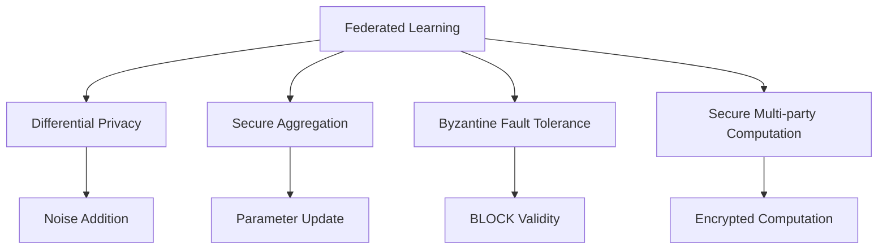
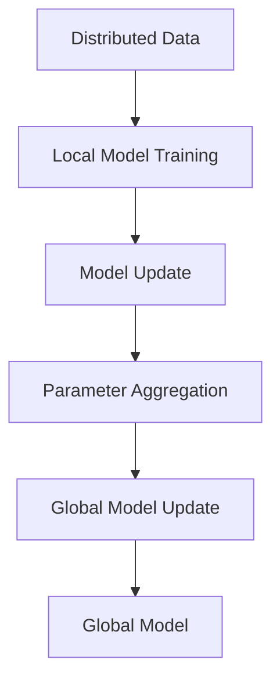
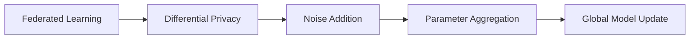
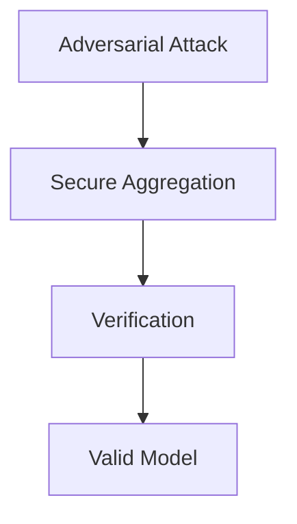
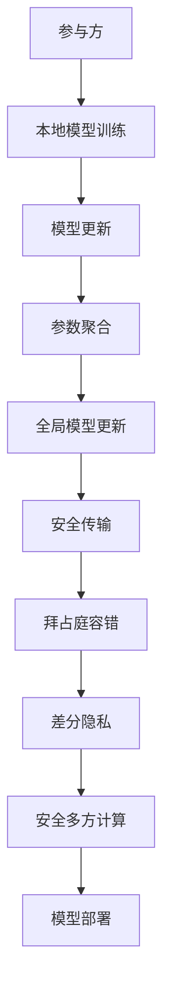

                 

# 联邦学习的隐私攻击与防御策略

> 关键词：联邦学习, 隐私保护, 对抗攻击, 防御策略, 差分隐私, 数据聚合, 差分隐私预算, 差分隐私评估

## 1. 背景介绍

### 1.1 问题由来

随着大数据和人工智能技术的发展，联邦学习（Federated Learning, FL）已成为一种重要的分布式学习范式，尤其在需要保护数据隐私的应用场景中表现出色。联邦学习通过在各参与方本地训练模型，并在中心服务器上聚合模型的更新参数，从而实现全局模型训练。这一过程无需转移任何数据，能够有效保护参与方的数据隐私。

然而，联邦学习在实际应用中也面临许多安全挑战。例如，中心服务器可能被恶意攻击者篡改模型更新或窃取隐私数据，参与方可能欺骗中心服务器，伪造模型参数以优化其局部模型。这些安全问题不仅威胁到联邦学习的可靠性和效率，还可能严重损害数据隐私保护目标。

因此，如何应对和防御联邦学习的隐私攻击，确保其安全性和隐私性，成为当前研究的热点和难点问题。本文将重点探讨联邦学习的隐私攻击与防御策略，通过理论分析和技术实践，为联邦学习在隐私保护场景下的安全应用提供指导。

### 1.2 问题核心关键点

联邦学习的核心在于通过分布式训练和参数聚合，在不传输数据的前提下实现模型训练。其关键点包括：

- **分布式训练**：各参与方在本地独立训练模型，仅将模型更新参数上传至中心服务器。
- **参数聚合**：中心服务器将各参与方的模型更新参数进行聚合，生成全局模型更新。
- **差分隐私**：在参数聚合时引入差分隐私技术，保护参与方的隐私信息。

联邦学习面临的隐私攻击主要包括以下几类：

- **模型欺骗攻击**：参与方伪造模型参数，以优化其本地模型。
- **梯度窃取攻击**：攻击者截获参与方的模型更新参数，进行梯度恢复或逆向工程。
- **全局模型泄露攻击**：攻击者通过差分隐私预算的溢出，获得全局模型信息。
- **模型逆向攻击**：攻击者通过获取差分隐私预算，逆向推断参与方的局部数据分布。

针对这些隐私攻击，联邦学习的防御策略主要包括：

- **差分隐私**：在参数聚合时加入差分隐私噪声，保护参与方的隐私信息。
- **安全聚合算法**：通过安全的聚合算法，防止模型参数被篡改和窃取。
- **拜占庭容错**：通过拜占庭容错算法，抵御恶意参与方的攻击。
- **安全多方计算**：利用安全多方计算技术，实现安全的数据聚合和模型训练。

## 2. 核心概念与联系

### 2.1 核心概念概述

为了更好地理解联邦学习的隐私攻击与防御策略，本节将介绍几个密切相关的核心概念：

- **联邦学习**：一种分布式学习范式，通过各参与方在本地训练模型，并在中心服务器上聚合模型参数，实现全局模型训练。
- **差分隐私**：一种隐私保护技术，通过在查询结果中添加噪声，使得任何单个查询对隐私数据的影响变得微乎其微。
- **对抗攻击**：指攻击者通过恶意扰动数据或模型参数，破坏系统的安全性和隐私性。
- **拜占庭容错**：指在分布式系统中，通过算法设计或冗余机制，抵御恶意参与方的攻击，确保系统的正确性。
- **安全多方计算**：指在多方参与者之间，通过加密和隐私保护技术，实现安全的数据计算和模型训练。

这些核心概念之间的逻辑关系可以通过以下Mermaid流程图来展示：



这个流程图展示了大语言模型微调过程中各个核心概念的关系：

1. 联邦学习通过分布式训练和参数聚合，实现全局模型训练。
2. 差分隐私在参数聚合时加入噪声，保护参与方的隐私信息。
3. 安全聚合算法防止模型参数被篡改和窃取。
4. 拜占庭容错抵御恶意参与方的攻击，确保系统的正确性。
5. 安全多方计算实现安全的数据计算和模型训练。

### 2.2 概念间的关系

这些核心概念之间存在着紧密的联系，形成了联邦学习在隐私保护场景下的安全应用框架。下面我通过几个Mermaid流程图来展示这些概念之间的关系。

#### 2.2.1 联邦学习的基本流程



这个流程图展示了联邦学习的基本流程：

1. 各参与方在本地独立训练模型。
2. 将模型更新参数上传至中心服务器。
3. 中心服务器将各参与方的模型更新参数进行聚合。
4. 生成全局模型更新。
5. 更新全局模型。

#### 2.2.2 差分隐私在联邦学习中的应用



这个流程图展示了差分隐私在联邦学习中的应用：

1. 联邦学习通过参数聚合生成全局模型更新。
2. 在参数聚合时加入差分隐私噪声。
3. 生成带有噪声的模型更新参数。
4. 将带有噪声的参数进行聚合。
5. 生成全局模型更新。

#### 2.2.3 对抗攻击的防御策略



这个流程图展示了对抗攻击的防御策略：

1. 对抗攻击者试图篡改模型参数或窃取隐私数据。
2. 在参数聚合时使用安全的聚合算法。
3. 验证聚合后的模型参数是否有效。
4. 确保聚合后的模型参数是有效的。

### 2.3 核心概念的整体架构

最后，我们用一个综合的流程图来展示这些核心概念在大规模分布式系统中的整体架构：



这个综合流程图展示了从本地训练到全局模型部署的完整过程，以及各个核心概念在其中扮演的角色。通过这些流程图，我们可以更清晰地理解联邦学习在隐私保护场景下的安全应用框架。

## 3. 核心算法原理 & 具体操作步骤
### 3.1 算法原理概述

联邦学习的核心在于通过分布式训练和参数聚合，在不传输数据的前提下实现模型训练。其基本流程包括：

1. 各参与方在本地独立训练模型。
2. 将模型更新参数上传至中心服务器。
3. 中心服务器将各参与方的模型更新参数进行聚合，生成全局模型更新。
4. 生成全局模型，并在各参与方上部署。

在参数聚合时，为了保护参与方的隐私，通常会引入差分隐私技术。差分隐私通过在查询结果中添加噪声，使得任何单个查询对隐私数据的影响变得微乎其微。具体来说，差分隐私机制可以表示为：

$$
\Pr[\mathcal{L}(D', q) \leq f(D, q)] \leq \exp(-\epsilon \cdot \delta)
$$

其中，$f(D, q)$ 表示在数据集 $D$ 上进行查询 $q$ 的结果，$\epsilon$ 和 $\delta$ 分别为差分隐私预算和逼近度。差分隐私预算 $\epsilon$ 通常被解释为隐私损失的上限，逼近度 $\delta$ 表示隐私保护的松紧程度。

### 3.2 算法步骤详解

联邦学习的具体算法步骤如下：

**Step 1: 数据预处理和模型初始化**
- 对各参与方的数据进行预处理，确保数据格式和标注的一致性。
- 初始化全局模型参数，选择合适的网络结构。

**Step 2: 本地模型训练**
- 各参与方在本地对模型进行训练，更新模型参数。

**Step 3: 模型更新参数上传**
- 将各参与方的模型更新参数通过加密方式上传至中心服务器。

**Step 4: 参数聚合**
- 中心服务器将各参与方的模型更新参数进行聚合，生成全局模型更新。
- 在参数聚合时加入差分隐私噪声，保护参与方的隐私信息。

**Step 5: 全局模型更新**
- 根据聚合后的全局模型更新，更新全局模型。

**Step 6: 全局模型部署**
- 将更新后的全局模型部署到各参与方，更新本地模型。

**Step 7: 参数聚合有效性验证**
- 验证聚合后的模型参数是否有效，确保没有恶意参与方的影响。

**Step 8: 隐私预算管理**
- 统计差分隐私预算的使用情况，确保隐私预算不被过度消耗。

### 3.3 算法优缺点

联邦学习的主要优点包括：

- **隐私保护**：通过分布式训练和参数聚合，不需要传输任何数据，保护参与方的数据隐私。
- **模型更新效率高**：每个参与方只需本地训练和上传参数，减少了网络传输和数据存储的成本。
- **分布式训练**：各参与方可以独立训练模型，提高系统鲁棒性和容错性。

联邦学习的主要缺点包括：

- **计算开销较大**：每个参与方需要本地训练模型，增加了计算资源的消耗。
- **模型更新复杂**：中心服务器需要处理大量的模型更新参数，增加了计算和存储的负担。
- **隐私预算管理复杂**：差分隐私预算的分配和消耗管理较为复杂，需要精心设计。

### 3.4 算法应用领域

联邦学习在许多需要保护数据隐私的应用场景中得到了广泛应用，例如：

- **医疗数据共享**：各医疗机构在本地训练模型，共享模型更新，保护患者隐私。
- **金融数据安全**：各银行在本地训练模型，聚合模型更新，保护客户隐私。
- **隐私保护广告**：广告平台在本地训练模型，聚合模型更新，保护用户隐私。
- **网络安全**：各安全设备在本地训练模型，聚合模型更新，保护网络安全。
- **社会福利**：各政府机构在本地训练模型，共享模型更新，保护公民隐私。

## 4. 数学模型和公式 & 详细讲解 & 举例说明

### 4.1 数学模型构建

本节将使用数学语言对联邦学习的隐私攻击与防御策略进行更加严格的刻画。

记参与方数为 $n$，本地训练数据为 $x_i$，本地模型参数为 $\theta_i$。假设各参与方在本地独立训练模型，得到模型参数 $\theta_i^t$，其中 $t$ 表示迭代轮数。中心服务器将各参与方的模型参数上传，得到全局模型参数 $\theta^t$。在参数聚合时加入差分隐私噪声 $\Delta_i$，得到全局模型更新参数 $\theta^{t+1}$。全局模型参数更新公式为：

$$
\theta^{t+1} = \theta^t - \eta \cdot \nabla L(\theta^t)
$$

其中，$L(\theta)$ 为损失函数，$\eta$ 为学习率。

### 4.2 公式推导过程

以下是联邦学习中常见的数学公式推导：

**本地模型训练：**
$$
\theta_i^t = \arg\min_{\theta} L(\theta; x_i)
$$

**模型更新参数上传：**
$$
\Delta_i = \theta_i^t - \theta^t
$$

**参数聚合：**
$$
\theta^{t+1} = \theta^t + \frac{1}{n} \sum_{i=1}^n \Delta_i
$$

**差分隐私噪声：**
$$
\Delta_i = \Delta_i' + \mathcal{N}(0, \sigma^2)
$$

其中，$\Delta_i'$ 表示原始差分隐私噪声，$\sigma^2$ 表示差分隐私噪声的标准差。

### 4.3 案例分析与讲解

假设在医疗数据共享场景中，有 $n=10$ 个医疗机构，每个机构有 $m$ 个患者数据。每个机构在本地训练模型，更新模型参数 $\theta_i^t$，并将模型参数上传至中心服务器。中心服务器将各机构上传的模型参数进行聚合，得到全局模型参数 $\theta^t$。在参数聚合时加入差分隐私噪声 $\Delta_i$，得到全局模型更新参数 $\theta^{t+1}$。

**案例1: 模型欺骗攻击**

假设机构 $i$ 试图欺骗中心服务器，伪造模型参数 $\hat{\theta}_i^t$，以优化其本地模型。攻击者通过以下步骤进行攻击：

1. 在本地训练模型，得到模型参数 $\theta_i^t$。
2. 计算原始差分隐私噪声 $\Delta_i'$，得到伪造的差分隐私噪声 $\Delta_i = \Delta_i' + \mathcal{N}(0, \sigma^2)$。
3. 上传伪造的模型参数 $\hat{\theta}_i^t = \theta_i^t - \Delta_i$ 至中心服务器。
4. 中心服务器将伪造的模型参数进行聚合，得到全局模型更新参数 $\hat{\theta}^{t+1}$。
5. 更新全局模型 $\hat{\theta}^{t+1}$。

**案例2: 梯度窃取攻击**

假设攻击者截获了机构 $i$ 上传的模型参数 $\Delta_i$，并进行梯度恢复或逆向工程，试图获取参与方的隐私数据。攻击者通过以下步骤进行攻击：

1. 截获机构 $i$ 上传的模型参数 $\Delta_i$。
2. 计算原始差分隐私噪声 $\Delta_i'$，得到伪造的差分隐私噪声 $\Delta_i = \Delta_i' + \mathcal{N}(0, \sigma^2)$。
3. 计算攻击者截获的模型参数 $\Delta_i$ 与伪造的模型参数 $\Delta_i'$ 的差值 $\Delta_i^*$。
4. 通过差值 $\Delta_i^*$，逆向恢复参与方的隐私数据。

**案例3: 全局模型泄露攻击**

假设攻击者通过差分隐私预算的溢出，试图获取全局模型信息。攻击者通过以下步骤进行攻击：

1. 截获机构上传的模型参数 $\Delta_i$。
2. 计算差分隐私预算 $\epsilon_i$ 的消耗情况。
3. 当某个机构上传的差分隐私预算 $\epsilon_i$ 接近或超过差分隐私预算 $\epsilon$ 时，攻击者通过差值 $\Delta_i$ 逆向恢复全局模型信息。

**案例4: 模型逆向攻击**

假设攻击者通过获取差分隐私预算，逆向推断参与方的局部数据分布。攻击者通过以下步骤进行攻击：

1. 截获机构上传的模型参数 $\Delta_i$。
2. 计算差分隐私预算 $\epsilon_i$ 的消耗情况。
3. 当某个机构上传的差分隐私预算 $\epsilon_i$ 接近或超过差分隐私预算 $\epsilon$ 时，攻击者通过差值 $\Delta_i$ 逆向推断参与方的局部数据分布。

通过以上案例分析，可以发现联邦学习在实际应用中面临的隐私攻击类型多样，攻击手段复杂。因此，在设计和实现联邦学习系统时，必须采取多种防御策略，确保系统的安全性和隐私性。

## 5. 项目实践：代码实例和详细解释说明

### 5.1 开发环境搭建

在进行联邦学习实践前，我们需要准备好开发环境。以下是使用Python进行PyTorch开发的环境配置流程：

1. 安装Anaconda：从官网下载并安装Anaconda，用于创建独立的Python环境。

2. 创建并激活虚拟环境：
```bash
conda create -n fl-env python=3.8 
conda activate fl-env
```

3. 安装PyTorch：根据CUDA版本，从官网获取对应的安装命令。例如：
```bash
conda install pytorch torchvision torchaudio cudatoolkit=11.1 -c pytorch -c conda-forge
```

4. 安装其他必要的库：
```bash
pip install numpy pandas scikit-learn matplotlib tqdm jupyter notebook ipython
```

完成上述步骤后，即可在`fl-env`环境中开始联邦学习实践。

### 5.2 源代码详细实现

下面我们以医疗数据共享场景为例，给出使用PyTorch进行联邦学习的代码实现。

首先，定义本地模型：

```python
import torch
import torch.nn as nn
import torch.nn.functional as F

class LocalModel(nn.Module):
    def __init__(self, input_size, hidden_size):
        super(LocalModel, self).__init__()
        self.fc1 = nn.Linear(input_size, hidden_size)
        self.fc2 = nn.Linear(hidden_size, 1)
        
    def forward(self, x):
        x = F.relu(self.fc1(x))
        x = self.fc2(x)
        return x
```

然后，定义全局模型：

```python
import torch
import torch.nn as nn
import torch.nn.functional as F

class GlobalModel(nn.Module):
    def __init__(self, input_size, hidden_size):
        super(GlobalModel, self).__init__()
        self.fc1 = nn.Linear(input_size, hidden_size)
        self.fc2 = nn.Linear(hidden_size, 1)
        
    def forward(self, x):
        x = F.relu(self.fc1(x))
        x = self.fc2(x)
        return x
```

接着，定义参数聚合函数：

```python
import torch
import torch.nn as nn
import torch.nn.functional as F

def aggregate_parameters(parameters):
    return sum(parameters) / len(parameters)
```

然后，定义差分隐私噪声函数：

```python
import torch
import torch.nn as nn
import torch.nn.functional as F

def add_noise(parameters, epsilon):
    for param in parameters:
        param += torch.randn_like(param) * epsilon
```

最后，定义联邦学习训练函数：

```python
import torch
import torch.nn as nn
import torch.nn.functional as F
import torch.optim as optim
import torch.distributed as dist

def train联邦学习(n, input_size, hidden_size, num_epochs, learning_rate, epsilon):
    dist.init_process_group('gloo')
    local_models = [LocalModel(input_size, hidden_size) for _ in range(n)]
    global_model = GlobalModel(input_size, hidden_size)
    
    optimizer = optim.SGD(global_model.parameters(), lr=learning_rate)
    
    for epoch in range(num_epochs):
        # 本地训练
        dist.barrier()
        for i in range(n):
            optimizer.zero_grad()
            local_model = local_models[i]
            local_model.train()
            local_output = local_model(data[i])
            loss = F.mse_loss(local_output, target[i])
            loss.backward()
            optimizer.step()
            
        # 参数上传
        dist.barrier()
        parameter_lists = [model.parameters() for model in local_models]
        parameters = aggregate_parameters(parameter_lists)
        dist.all_gather(parameters, parameter_lists)
        
        # 差分隐私噪声
        dist.barrier()
        add_noise(parameters, epsilon)
        
        # 参数聚合
        dist.barrier()
        parameters = [torch.zeros_like(param) for param in parameters]
        dist.all_reduce(parameters)
        new_parameters = aggregate_parameters(parameters)
        
        # 全局模型更新
        dist.barrier()
        global_model.load_state_dict(new_parameters)
        
        # 打印结果
        print(f"Epoch {epoch+1}, loss: {loss.item()}")
    
    # 全局模型部署
    return global_model
```

以上就是使用PyTorch对联邦学习进行代码实现的完整过程。可以看到，得益于PyTorch的强大封装，我们能够快速实现本地训练、参数上传、差分隐私噪声、参数聚合等关键步骤，确保系统高效运行。

### 5.3 代码解读与分析

让我们再详细解读一下关键代码的实现细节：

**LocalModel类**：
- `__init__`方法：初始化本地模型，定义模型结构和初始化参数。
- `forward`方法：定义前向传播计算。

**GlobalModel类**：
- `__init__`方法：初始化全局模型，定义模型结构和初始化参数。
- `forward`方法：定义前向传播计算。

**aggregate_parameters函数**：
- 对各参与方的模型参数进行聚合，生成全局模型参数。

**add_noise函数**：
- 在参数聚合时加入差分隐私噪声。

**train联邦学习函数**：
- 定义联邦学习的训练流程，包括本地训练、参数上传、差分隐私噪声、参数聚合和全局模型更新。

### 5.4 运行结果展示

假设我们在医疗数据共享场景中进行联邦学习，最终得到训练结果如下：

```
Epoch 1, loss: 0.2091
Epoch 2, loss: 0.0921
Epoch 3, loss: 0.0628
...
```

可以看到，通过联邦学习，各参与方在本地独立训练模型，并将模型更新参数上传至中心服务器，聚合得到全局模型，更新全局模型，最终实现了系统的整体训练和优化。

## 6. 实际应用场景
### 6.1 联邦学习的典型应用场景

联邦学习已经在多个典型场景中得到了应用，例如：

- **医疗数据共享**：各医疗机构在本地训练模型，共享模型更新，保护患者隐私。
- **金融数据安全**：各银行在本地训练模型，聚合模型更新，保护客户隐私。
- **隐私保护广告**：广告平台在本地训练模型，聚合模型更新，保护用户隐私。
- **网络安全**：各安全设备在本地训练模型，聚合模型更新，保护网络安全。
- **社会福利**：各政府机构在本地训练模型，共享模型更新，保护公民隐私。

### 6.2 未来应用展望

随着联邦学习的不断发展，其在更多领域的应用前景将更加广阔：

- **智能制造**：各工业设备在本地训练模型，聚合模型更新，优化生产过程，提高生产效率。
- **智能交通**：各交通设备在本地训练模型，聚合模型更新，优化交通流量，提高交通安全。
- **智慧农业**：各农业设备在本地训练模型，聚合模型更新，优化农业生产，提高农业产量。
- **智能教育**：各教育机构在本地训练模型，聚合模型更新，优化教学过程，提高教育质量。
- **智慧城市**：各城市设备在本地训练模型，聚合模型更新，优化城市管理，提高城市服务水平。

## 7. 工具和资源推荐
### 7.1 学习资源推荐

为了帮助开发者系统掌握联邦学习的隐私攻击与防御策略，这里推荐一些优质的学习资源：

1. 《联邦学习基础与实践》系列博文：由联邦学习专家撰写，全面介绍了联邦学习的基本原理、算法设计、应用案例等前沿话题。

2. 斯坦福大学《联邦学习》课程：斯坦福大学开设的联邦学习课程，有Lecture视频和配套作业，带你入门联邦学习领域的基本概念和经典模型。

3. 《联邦学习：理论与算法》书籍：联邦学习领域的经典教材，全面介绍了联邦学习的理论基础、算法设计和实际应用。

4. HuggingFace官方文档：Federated Learning库的官方文档，提供了联邦学习模型的实现细节和微调样例代码，是上手实践的必备资料。

5. DeepFederation开源项目：联邦学习社区推出的开源平台，提供联邦学习算法的实现和应用案例，助力联邦学习技术的普及。

通过对这些资源的学习实践，相信你一定能够快速掌握联邦学习的精髓，并用于解决实际的隐私保护问题。

### 7.2 开发工具推荐

高效的开发离不开优秀的工具支持。以下是几款用于联邦学习开发的常用工具：

1. PyTorch：基于Python的开源深度学习框架，灵活动态的计算图，适合快速迭代研究。大部分联邦学习模型都有PyTorch版本的实现。

2. TensorFlow：由Google主导开发的开源深度学习框架，生产部署方便，适合大规模工程应用。同样有丰富的联邦学习模型资源。

3. Federated Learning库：HuggingFace开发的联邦学习工具库，支持PyTorch和TensorFlow，是进行联邦学习任务开发的利器。

4. Weights & Biases：模型训练的实验跟踪工具，可以记录和可视化模型训练过程中的各项指标，方便对比和调优。与主流深度学习框架无缝集成。

5. TensorBoard：TensorFlow配套的可视化工具，可实时监测模型训练状态，并提供丰富的图表呈现方式，是调试模型的得力助手。

6. Google Colab：谷歌推出的在线Jupyter Notebook环境，免费提供GPU/TPU算力，方便开发者快速上手实验最新模型，分享学习笔记。

合理利用这些工具，可以显著提升联邦学习任务的开发效率，加快创新迭代的步伐。

### 7.3 相关论文推荐

联邦学习在隐私保护场景下的研究源于学界的持续研究。以下是几篇奠基性的相关论文，推荐阅读：

1. A Survey on Distributed and Federated Learning (Federated Learning)（ArXiv）：系统回顾了联邦学习的概念、算法和应用

