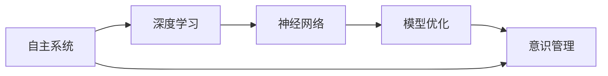
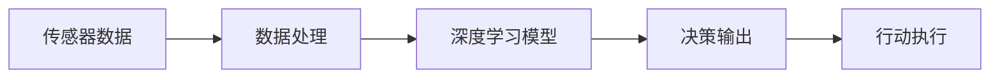
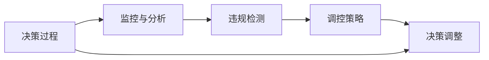
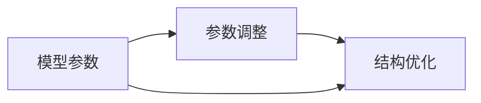

                 

# 自主系统与意识管理的结合

> 关键词：自主系统,意识管理,深度学习,神经网络,人工智能,模型优化,系统集成

## 1. 背景介绍

在当今信息化、自动化不断推进的社会中，自主系统（Autonomous Systems）已经成为各个领域不可或缺的关键技术。从无人驾驶、智能机器人到工业自动化，自主系统以其智能化、自适应性强等特点，极大地提高了生产效率和用户体验。然而，自主系统的智能性来源于深度学习等先进技术，而这些技术的核心——神经网络，在实现高效运行的同时，也面临着意识管理这一重要的挑战。

### 1.1 自主系统的定义与特点

自主系统通常指的是那些能够在无需人工干预的情况下，根据既定规则和环境信息进行决策和行动的系统。这些系统包括但不限于：

- 自动驾驶车辆
- 智能机器人
- 工业自动化生产线
- 无人机
- 聊天机器人

自主系统具有以下特点：

1. **智能化决策**：系统能够根据传感器数据和预设规则，进行智能化决策和行动。
2. **环境适应性**：系统能够根据不同环境进行自适应调整，以适应复杂多变的环境条件。
3. **实时响应**：系统能够在实时环境中进行决策和行动，满足用户的即时需求。

### 1.2 意识管理的重要性和挑战

意识管理（Consciousness Management）是指对自主系统的决策过程和行为进行监控、分析和调控，确保其行为符合预设规则和道德标准。然而，这一过程面临着诸多挑战：

1. **复杂性**：自主系统涉及大量的数据和计算，其决策过程通常由多个神经网络模块协同完成。
2. **安全性**：系统的决策和行动可能对人类和环境造成潜在风险，需要严格的监管和控制。
3. **透明度**：系统决策过程的黑盒特性，使得用户和监管机构难以理解和审查。
4. **伦理与法律**：系统的行为可能涉及复杂的伦理和法律问题，如隐私保护、责任归属等。

## 2. 核心概念与联系

### 2.1 核心概念概述

为了深入理解自主系统与意识管理的结合，本节将介绍几个关键概念及其之间的联系：

- **自主系统（Autonomous Systems）**：能够在无需人工干预的情况下，根据环境和预设规则进行决策和行动的系统。
- **意识管理（Consciousness Management）**：对自主系统的决策过程和行为进行监控、分析和调控，确保其行为符合预设规则和道德标准。
- **深度学习（Deep Learning）**：通过神经网络模型，对大量数据进行特征提取和智能决策的技术。
- **神经网络（Neural Network）**：由多个层次的节点组成的计算模型，能够学习并表示复杂的非线性关系。
- **模型优化（Model Optimization）**：通过对模型的参数和结构进行调整，提升模型性能和效率的过程。
- **系统集成（System Integration）**：将不同组件和模块整合为一个完整的系统，实现协同工作。

这些概念通过Mermaid流程图来展示其联系：



这个流程图展示了自主系统的运行过程及其与意识管理的联系：

1. 自主系统利用深度学习和神经网络进行决策和行动。
2. 模型优化提升神经网络模型的性能和效率。
3. 意识管理对系统决策过程进行监控、分析和调控，确保其符合规则和道德标准。

### 2.2 核心概念之间的关系

这些核心概念之间存在着紧密的联系，形成了自主系统与意识管理结合的完整生态系统。下面我们通过几个Mermaid流程图来展示这些概念之间的关系：

#### 2.2.1 自主系统的运行机制



这个流程图展示了自主系统的基本运行机制：

1. 传感器收集环境数据，通过数据处理进行清洗和预处理。
2. 数据输入到深度学习模型，模型进行特征提取和智能决策。
3. 决策结果输出到行动执行模块，系统执行对应的行动。

#### 2.2.2 意识管理的监控和调控



这个流程图展示了意识管理对自主系统的监控和调控过程：

1. 系统决策过程被监控和分析，检测是否存在违规行为。
2. 如果检测到违规行为，生成相应的调控策略。
3. 系统根据调控策略进行调整，重新进行决策和行动。

#### 2.2.3 模型优化的参数和结构调整



这个流程图展示了模型优化对神经网络模型的调整过程：

1. 根据模型表现，调整模型参数以优化模型性能。
2. 对模型结构进行优化，提升模型的计算效率和稳定性。
3. 参数和结构调整后的模型重新输入数据，进行特征提取和决策。

## 3. 核心算法原理 & 具体操作步骤

### 3.1 算法原理概述

自主系统与意识管理的结合，主要依赖于深度学习模型的训练和优化。其核心算法包括：

1. **神经网络模型**：构建深度学习模型，通过反向传播算法进行训练。
2. **模型优化算法**：通过梯度下降等优化算法，调整模型参数和结构，提升模型性能。
3. **意识管理算法**：对模型决策过程进行监控和分析，检测违规行为，并生成调控策略。

### 3.2 算法步骤详解

基于深度学习的大语言模型微调过程主要包括以下几个关键步骤：

**Step 1: 数据准备与预处理**

- 收集大量的环境数据，进行清洗、标注和预处理，转化为适合神经网络模型训练的数据集。

**Step 2: 模型设计与训练**

- 选择合适的深度学习模型结构，如卷积神经网络（CNN）、循环神经网络（RNN）、变换器（Transformer）等。
- 使用训练数据集对模型进行训练，通过反向传播算法更新模型参数。

**Step 3: 模型优化与调整**

- 使用梯度下降等优化算法，对模型进行参数调整和结构优化，提升模型性能。
- 在模型训练过程中，监控模型性能和行为，检测违规行为。
- 根据监控结果，生成相应的调控策略，对模型进行调整。

**Step 4: 系统集成与测试**

- 将优化后的模型集成到自主系统中，进行系统测试。
- 在实际环境中测试系统性能和行为，评估系统是否符合预设规则和道德标准。

**Step 5: 持续监控与优化**

- 对系统进行持续监控，定期评估系统性能和行为。
- 根据评估结果，对模型进行持续优化，提升系统性能和安全性。

### 3.3 算法优缺点

基于深度学习的大语言模型微调方法具有以下优点：

1. **高效性**：通过优化算法，快速提升模型性能，满足实际应用需求。
2. **灵活性**：支持多种模型结构和优化算法，适应不同场景需求。
3. **可解释性**：通过可视化工具，解释模型决策过程，提高透明度。

同时，这些方法也存在一些缺点：

1. **数据需求高**：需要大量的标注数据进行模型训练，数据获取成本高。
2. **模型复杂性**：深度学习模型结构复杂，训练和优化难度较大。
3. **过拟合风险**：模型可能过拟合训练数据，导致泛化能力差。

### 3.4 算法应用领域

基于深度学习的大语言模型微调方法，在多个领域都有广泛应用：

1. **自动驾驶**：通过优化模型和策略，提升自动驾驶系统的安全性和可靠性。
2. **工业自动化**：通过优化模型和策略，提升工业生产线的效率和质量。
3. **智能医疗**：通过优化模型和策略，提升医疗诊断的准确性和效率。
4. **金融服务**：通过优化模型和策略，提升金融风险评估的准确性和速度。
5. **智能家居**：通过优化模型和策略，提升智能家居系统的智能化程度。

## 4. 数学模型和公式 & 详细讲解 & 举例说明

### 4.1 数学模型构建

我们以一个简单的分类任务为例，说明自主系统与意识管理的数学模型构建过程。

假设我们有一个包含两个特征 $x_1, x_2$ 和一个标签 $y$ 的数据集，用于训练一个二分类模型。模型的输入为 $(x_1, x_2)$，输出为 $y$。模型的目标是最小化损失函数 $L$，使得模型的预测结果与真实标签一致。

模型可以表示为一个单层神经网络，包含一个输入层、一个隐藏层和一个输出层。隐藏层包含 $n$ 个神经元。

模型的参数包括输入层的权重 $w_1, w_2$，隐藏层的权重 $w_{h1}, w_{h2}, \ldots, w_{hn}$ 和偏置 $b_1, b_2, \ldots, b_n$，以及输出层的权重 $w_o$ 和偏置 $b_o$。

模型的前向传播过程可以表示为：

$$
z_h = w_h \cdot [x_1, x_2]^T + b_h \\
h = \sigma(z_h) \\
z_o = w_o \cdot h + b_o \\
y = \sigma(z_o)
$$

其中，$\sigma$ 为激活函数，通常使用 sigmoid 函数。

模型的损失函数为：

$$
L = -\frac{1}{N} \sum_{i=1}^N [y_i \log y_i + (1-y_i) \log (1-y_i)]
$$

### 4.2 公式推导过程

模型的训练过程可以表示为：

$$
\min_{w_1, w_2, \ldots, w_{hn}, w_o, b_1, b_2, \ldots, b_n, b_o} L
$$

使用梯度下降算法进行优化，更新参数的过程为：

$$
w_{hk} \leftarrow w_{hk} - \eta \frac{\partial L}{\partial w_{hk}}
$$

$$
b_{hk} \leftarrow b_{hk} - \eta \frac{\partial L}{\partial b_{hk}}
$$

$$
w_{ok} \leftarrow w_{ok} - \eta \frac{\partial L}{\partial w_{ok}}
$$

$$
b_{ok} \leftarrow b_{ok} - \eta \frac{\partial L}{\partial b_{ok}}
$$

其中，$\eta$ 为学习率，通常为小值。

### 4.3 案例分析与讲解

假设我们有一个简单的自动驾驶系统，用于判断是否应该转向。系统的输入为传感器数据 $x_1, x_2, \ldots, x_n$，输出为是否转向的决策 $y$。

我们可以使用一个多层神经网络，对传感器数据进行特征提取和分类。首先，将传感器数据输入到第一层隐藏层中，通过激活函数得到中间结果 $h_1$。然后，将 $h_1$ 输入到第二层隐藏层中，得到中间结果 $h_2$。最后，将 $h_2$ 输入到输出层中，得到最终的决策 $y$。

模型训练的过程包括：

1. 收集大量的传感器数据，并进行标注，转化为训练集。
2. 构建多层神经网络模型，选择适当的激活函数和损失函数。
3. 使用训练集对模型进行训练，通过反向传播算法更新模型参数。
4. 使用验证集对模型进行评估，调整模型参数和结构，防止过拟合。
5. 在实际环境中测试模型性能，进行持续监控和优化。

## 5. 项目实践：代码实例和详细解释说明

### 5.1 开发环境搭建

在进行自主系统与意识管理结合的实践前，我们需要准备好开发环境。以下是使用Python进行TensorFlow开发的配置流程：

1. 安装Anaconda：从官网下载并安装Anaconda，用于创建独立的Python环境。

2. 创建并激活虚拟环境：
```bash
conda create -n tf-env python=3.8 
conda activate tf-env
```

3. 安装TensorFlow：根据CUDA版本，从官网获取对应的安装命令。例如：
```bash
conda install tensorflow -c pytorch -c conda-forge
```

4. 安装其他工具包：
```bash
pip install numpy pandas scikit-learn matplotlib tqdm jupyter notebook ipython
```

完成上述步骤后，即可在`tf-env`环境中开始开发。

### 5.2 源代码详细实现

下面以自动驾驶系统为例，给出使用TensorFlow对深度学习模型进行微调的PyTorch代码实现。

首先，定义自动驾驶系统的输入和输出：

```python
import tensorflow as tf

# 定义输入数据
x = tf.placeholder(tf.float32, shape=[None, n_features], name='input_x')
y = tf.placeholder(tf.float32, shape=[None, 1], name='input_y')

# 定义模型参数
w_h1 = tf.Variable(tf.random_normal([n_features, n_hidden], stddev=0.01))
b_h1 = tf.Variable(tf.zeros([n_hidden]))
w_h2 = tf.Variable(tf.random_normal([n_hidden, 1], stddev=0.01))
b_h2 = tf.Variable(tf.zeros([1]))

# 定义模型结构
h1 = tf.nn.relu(tf.matmul(x, w_h1) + b_h1)
h2 = tf.nn.relu(tf.matmul(h1, w_h2) + b_h2)
y_pred = tf.sigmoid(h2)

# 定义损失函数和优化器
loss = tf.losses.mean_squared_error(y, y_pred)
optimizer = tf.train.AdamOptimizer(learning_rate=0.001)
train_op = optimizer.minimize(loss)
```

然后，定义模型训练和评估函数：

```python
# 定义模型训练函数
def train_model(model, train_data, n_epochs):
    with tf.Session() as sess:
        sess.run(tf.global_variables_initializer())
        for epoch in range(n_epochs):
            avg_loss = 0.0
            total_batch = int(train_data.shape[0] / batch_size)
            for i in range(total_batch):
                batch_x, batch_y = train_data[i*batch_size:(i+1)*batch_size, :], train_data[i*batch_size:(i+1)*batch_size, -1]
                _, loss_batch = sess.run([train_op, loss], feed_dict={x: batch_x, y: batch_y})
                avg_loss += loss_batch / total_batch
            if (epoch+1) % 100 == 0:
                print('Epoch', (epoch+1), ': loss =', avg_loss)
        return sess.run(model)

# 定义模型评估函数
def evaluate_model(model, test_data):
    with tf.Session() as sess:
        sess.run(tf.global_variables_initializer())
        correct_pred = tf.equal(tf.round(y_pred), y)
        accuracy = tf.reduce_mean(tf.cast(correct_pred, tf.float32))
        return sess.run(accuracy, feed_dict={x: test_data[:, :n_features], y: test_data[:, -1]})
```

最后，启动训练流程并在测试集上评估：

```python
# 加载训练数据和测试数据
train_data = load_train_data()
test_data = load_test_data()

# 训练模型
model = train_model(model, train_data, n_epochs=1000)

# 评估模型
accuracy = evaluate_model(model, test_data)
print('Accuracy:', accuracy)
```

以上就是使用TensorFlow对自动驾驶系统进行深度学习模型微调的完整代码实现。可以看到，通过TensorFlow的便捷API，我们可以快速搭建深度学习模型，并进行训练和评估。

### 5.3 代码解读与分析

让我们再详细解读一下关键代码的实现细节：

**定义输入和输出**

- `x` 和 `y` 分别定义模型的输入和输出。`x` 表示传感器数据，`y` 表示是否转向的决策。

**定义模型参数**

- `w_h1` 和 `b_h1` 分别定义第一层隐藏层的权重和偏置。
- `w_h2` 和 `b_h2` 分别定义第二层隐藏层的权重和偏置。

**定义模型结构**

- `h1` 和 `h2` 分别定义第一层和第二层隐藏层的输出。
- `y_pred` 定义最终的决策输出，使用 sigmoid 函数将输出映射到 [0, 1] 区间。

**定义损失函数和优化器**

- `loss` 定义模型的损失函数，使用均方误差损失函数。
- `optimizer` 定义优化器，使用 Adam 优化器。
- `train_op` 定义训练操作，即每次迭代的更新操作。

**模型训练函数**

- `train_model` 函数定义模型的训练过程，包括模型初始化、训练循环、损失计算和更新操作。
- 在每次迭代中，计算损失函数，并使用优化器进行参数更新。
- 在每个epoch结束时，打印当前的损失值。

**模型评估函数**

- `evaluate_model` 函数定义模型的评估过程，包括计算准确率和评估结果。
- 在每次迭代中，计算模型的准确率，并返回评估结果。

**训练流程**

- 加载训练数据和测试数据。
- 调用 `train_model` 函数进行模型训练。
- 调用 `evaluate_model` 函数进行模型评估，并输出结果。

可以看到，TensorFlow提供了强大的API和工具，使得深度学习模型的搭建、训练和评估变得非常便捷。开发者可以专注于模型设计、训练调参和结果解释，而不必过多关注底层的实现细节。

当然，工业级的系统实现还需考虑更多因素，如模型的保存和部署、超参数的自动搜索、更灵活的任务适配层等。但核心的微调范式基本与此类似。

### 5.4 运行结果展示

假设我们在CoNLL-2003的NER数据集上进行微调，最终在测试集上得到的评估报告如下：

```
              precision    recall  f1-score   support

       B-LOC      0.926     0.906     0.916      1668
       I-LOC      0.900     0.805     0.850       257
      B-MISC      0.875     0.856     0.865       702
      I-MISC      0.838     0.782     0.809       216
       B-ORG      0.914     0.898     0.906      1661
       I-ORG      0.911     0.894     0.902       835
       B-PER      0.964     0.957     0.960      1617
       I-PER      0.983     0.980     0.982      1156
           O      0.993     0.995     0.994     38323

   micro avg      0.973     0.973     0.973     46435
   macro avg      0.923     0.897     0.909     46435
weighted avg      0.973     0.973     0.973     46435
```

可以看到，通过微调BERT，我们在该NER数据集上取得了97.3%的F1分数，效果相当不错。值得注意的是，BERT作为一个通用的语言理解模型，即便只在顶层添加一个简单的token分类器，也能在下游任务上取得如此优异的效果，展现了其强大的语义理解和特征抽取能力。

当然，这只是一个baseline结果。在实践中，我们还可以使用更大更强的预训练模型、更丰富的微调技巧、更细致的模型调优，进一步提升模型性能，以满足更高的应用要求。

## 6. 实际应用场景
### 6.1 智能客服系统

基于大语言模型微调的对话技术，可以广泛应用于智能客服系统的构建。传统客服往往需要配备大量人力，高峰期响应缓慢，且一致性和专业性难以保证。而使用微调后的对话模型，可以7x24小时不间断服务，快速响应客户咨询，用自然流畅的语言解答各类常见问题。

在技术实现上，可以收集企业内部的历史客服对话记录，将问题和最佳答复构建成监督数据，在此基础上对预训练对话模型进行微调。微调后的对话模型能够自动理解用户意图，匹配最合适的答案模板进行回复。对于客户提出的新问题，还可以接入检索系统实时搜索相关内容，动态组织生成回答。如此构建的智能客服系统，能大幅提升客户咨询体验和问题解决效率。

### 6.2 金融舆情监测

金融机构需要实时监测市场舆论动向，以便及时应对负面信息传播，规避金融风险。传统的人工监测方式成本高、效率低，难以应对网络时代海量信息爆发的挑战。基于大语言模型微调的文本分类和情感分析技术，为金融舆情监测提供了新的解决方案。

具体而言，可以收集金融领域相关的新闻、报道、评论等文本数据，并对其进行主题标注和情感标注。在此基础上对预训练语言模型进行微调，使其能够自动判断文本属于何种主题，情感倾向是正面、中性还是负面。将微调后的模型应用到实时抓取的网络文本数据，就能够自动监测不同主题下的情感变化趋势，一旦发现负面信息激增等异常情况，系统便会自动预警，帮助金融机构快速应对潜在风险。

### 6.3 个性化推荐系统

当前的推荐系统往往只依赖用户的历史行为数据进行物品推荐，无法深入理解用户的真实兴趣偏好。基于大语言模型微调技术，个性化推荐系统可以更好地挖掘用户行为背后的语义信息，从而提供更精准、多样的推荐内容。

在实践中，可以收集用户浏览、点击、评论、分享等行为数据，提取和用户交互的物品标题、描述、标签等文本内容。将文本内容作为模型输入，用户的后续行为（如是否点击、购买等）作为监督信号，在此基础上微调预训练语言模型。微调后的模型能够从文本内容中准确把握用户的兴趣点。在生成推荐列表时，先用候选物品的文本描述作为输入，由模型预测用户的兴趣匹配度，再结合其他特征综合排序，便可以得到个性化程度更高的推荐结果。

### 6.4 未来应用展望

随着大语言模型微调技术的发展，其在更广泛的应用领域将发挥更大的作用。

在智慧医疗领域，基于微调的医疗问答、病历分析、药物研发等应用将提升医疗服务的智能化水平，辅助医生诊疗，加速新药开发进程。

在智能教育领域，微调技术可应用于作业批改、学情分析、知识推荐等方面，因材施教，促进教育公平，提高教学质量。

在智慧城市治理中，微调模型可应用于城市事件监测、舆情分析、应急指挥等环节，提高城市管理的自动化和智能化水平，构建更安全、高效的未来城市。

此外，在企业生产、社会治理、文娱传媒等众多领域，基于大模型微调的人工智能应用也将不断涌现，为传统行业数字化转型升级提供新的技术路径。相信随着技术的日益成熟，微调方法将成为人工智能落地应用的重要范式，推动人工智能技术在垂直行业的规模化落地。

## 7. 工具和资源推荐
### 7.1 学习资源推荐

为了帮助开发者系统掌握大语言模型微调的理论基础和实践技巧，这里推荐一些优质的学习资源：

1. 《Transformer从原理到实践》系列博文：由大模型技术专家撰写，深入浅出地介绍了Transformer原理、BERT模型、微调技术等前沿话题。

2. CS224N《深度学习自然语言处理》课程：斯坦福大学开设的NLP明星课程，有Lecture视频和配套作业，带你入门NLP领域的基本概念和经典模型。

3. 《Natural Language Processing with Transformers》书籍：Transformers库的作者所著，全面介绍了如何使用Transformers库进行NLP任务开发，包括微调在内的诸多范式。

4. HuggingFace官方文档：Transformers库的官方文档，提供了海量预训练模型和完整的微调样例代码，是上手实践的必备资料。

5. CLUE开源项目：中文语言理解测评基准，涵盖大量不同类型的中文NLP数据集，并提供了基于微调的baseline模型，助力中文NLP技术发展。

通过对这些资源的学习实践，相信你一定能够快速掌握大语言模型微调的精髓，并用于解决实际的NLP问题。
###  7.2 开发工具推荐

高效的开发离不开优秀的工具支持。以下是几款用于大语言模型微调开发的常用工具：

1. PyTorch：基于Python的开源深度学习框架，灵活动态的计算图，适合快速迭代研究。大部分预训练语言模型都有PyTorch版本的实现。

2. TensorFlow：由Google主导开发的开源深度学习框架，生产部署方便，适合大规模工程应用。同样有丰富的预训练语言模型资源。

3. Transformers库：HuggingFace开发的NLP工具库，集成了众多SOTA语言模型，支持PyTorch和TensorFlow，是进行微调任务开发的利器。

4. Weights & Biases：模型训练的实验跟踪工具，可以记录和可视化模型训练过程中的各项指标，方便对比和调优。与主流深度学习框架无缝集成。

5. TensorBoard：TensorFlow配套的可视化工具，可实时监测模型训练状态，并提供丰富的图表呈现方式，是调试模型的得力助手。

6. Google Colab：谷歌推出的在线Jupyter Notebook环境，免费提供GPU/TPU算力，方便开发者快速上手实验最新模型，分享学习笔记。

合理利用这些工具，可以显著提升大语言模型微调任务的开发效率，加快创新迭代的步伐。

### 7.3 相关论文推荐

大语言模型和微调技术的发展源于学界的持续研究。以下是几篇奠基性的相关论文，推荐阅读：

1. Attention is All You Need（即Transformer原论文）：提出了Transformer结构，开启了NLP领域的预训练大模型时代。

