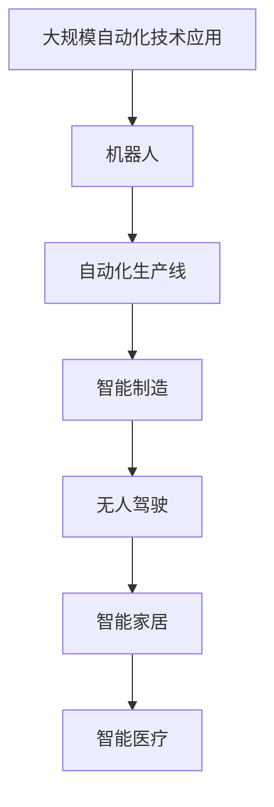

                 

## 1. 背景介绍

### 1.1 问题由来
自动化技术作为人工智能的核心组成部分，正在不断改变着人类的生产和生活方式。随着工业自动化、智能制造、无人驾驶等领域的持续发展，自动化技术的应用场景越来越广泛，技术也日趋成熟。在现代工业生产中，自动化技术的引入不仅提升了生产效率，降低了人工成本，还提升了产品质量和安全性。

### 1.2 问题核心关键点
当前，自动化技术的发展主要集中在以下几个关键领域：

- **工业自动化**：包括机器人、自动化生产线、智能仓储等，将传统的工业制造过程数字化、智能化，大幅提升生产效率和产品质量。
- **智能制造**：通过大数据、云计算、物联网等技术，实现生产过程的全面信息化、透明化，实现精益生产、个性化定制。
- **无人驾驶**：利用计算机视觉、传感器融合、路径规划等技术，实现车辆自主驾驶，提升道路安全和运输效率。
- **智能家居**：通过物联网、人工智能技术，实现家居环境的智能化管理，提升用户的生活品质和便利性。
- **智能医疗**：应用机器学习、自然语言处理等技术，提升医疗诊断、治疗、管理等方面的自动化水平，减少医疗误诊，提升医疗服务质量。

这些领域的技术进步，为自动化技术的未来发展提供了广阔的想象空间。

### 1.3 问题研究意义
自动化技术的发展，对工业生产、社会服务、国防安全等多个领域具有重大意义：

- **降低成本**：自动化技术可以大幅降低人工成本，提升生产效率，优化资源配置。
- **提高效率**：通过智能化管理，自动化技术能够提升生产线的运行效率，减少人为错误，提高产品质量。
- **促进创新**：自动化技术的应用推动了新工艺、新产品的研发，推动产业升级和创新发展。
- **改善生活**：智能家居、智能医疗等自动化技术的应用，提升了人们的生活品质和健康水平。
- **保障安全**：无人驾驶、智能监控等自动化技术的应用，提升了道路安全和公共安全。

## 2. 核心概念与联系

### 2.1 核心概念概述

为了更好地理解自动化技术的最新发展，我们需要明确几个核心概念：

- **机器人**：指通过编程控制，能够自动执行复杂任务的机械设备。现代机器人集成了先进的传感器、控制器和计算机视觉技术，具备高度自主性。
- **自动化生产线**：指通过自动化设备（如机器人、自动导引车、自动化机床等）实现的生产流程。自动化生产线能够实现大规模、高效率的定制化生产。
- **智能制造**：通过云计算、物联网、大数据等技术，实现生产过程的全面信息化、透明化，实现精益生产、个性化定制。
- **无人驾驶**：指车辆能够自主感知环境，无需人工干预，自动规划路径并控制车辆行驶。无人驾驶技术广泛应用于交通、物流、农业等领域。
- **智能家居**：通过物联网、人工智能技术，实现家居环境的智能化管理，提升用户的生活品质和便利性。
- **智能医疗**：应用机器学习、自然语言处理等技术，提升医疗诊断、治疗、管理等方面的自动化水平，减少医疗误诊，提升医疗服务质量。

这些核心概念之间存在着紧密的联系，共同构成了自动化技术的发展框架。

### 2.2 概念间的关系

这些核心概念之间的逻辑关系可以通过以下Mermaid流程图来展示：


这个流程图展示了几类主要自动化技术之间的联系：

1. 机器人作为基础设备，广泛应用于自动化生产线、无人驾驶、智能家居等多个领域。
2. 自动化生产线通过机器人等自动化设备，实现了生产过程的全面自动化和智能化。
3. 智能制造利用工业物联网、云计算、大数据等技术，进一步提升了自动化生产线的智能化水平。
4. 无人驾驶技术在交通物流等场景中，实现了车辆自主驾驶，提升了运输效率和安全性。
5. 智能家居通过物联网、人工智能技术，实现了家居环境的全面智能化。
6. 智能医疗通过机器学习、自然语言处理等技术，提升了医疗诊断和治疗的自动化水平。

### 2.3 核心概念的整体架构

最后，我们用一个综合的流程图来展示这些核心概念在大规模自动化技术应用中的整体架构：



这个综合流程图展示了从机器人到智能家居等多个自动化技术的应用场景，反映了自动化技术在各个领域的应用和发展。

## 3. 核心算法原理 & 具体操作步骤
### 3.1 算法原理概述

自动化技术的实现依赖于多种算法和技术的融合。以下是几种核心算法及其原理：

- **机器人控制算法**：包括路径规划、运动控制、视觉识别等算法，通过传感器和计算机视觉技术，实现机器人的自主运动和任务执行。
- **自动化生产线调度算法**：通过优化调度算法，实现生产线的最优配置和任务分配，提升生产效率和灵活性。
- **智能制造的数据驱动算法**：通过数据分析和机器学习技术，实现生产过程的预测和优化，提升产品质量和生产效率。
- **无人驾驶的感知与决策算法**：通过计算机视觉、传感器融合、路径规划等技术，实现车辆的自主感知和决策，确保安全行驶。
- **智能家居的感知与交互算法**：通过物联网、语音识别、自然语言处理等技术，实现家居环境的感知和智能交互。
- **智能医疗的诊断和治疗算法**：通过机器学习、自然语言处理等技术，提升医疗诊断和治疗的自动化水平，减少医疗误诊。

### 3.2 算法步骤详解

以**智能制造**为例，展示自动化技术在其中的应用流程：

1. **数据采集**：通过传感器、摄像头等设备，采集生产过程中的实时数据。
2. **数据处理**：利用大数据和云计算技术，对采集到的数据进行处理和分析，提取有价值的信息。
3. **优化调度**：通过优化调度算法，对生产过程进行实时调度，确保生产线的最优配置和任务分配。
4. **质量控制**：通过数据分析和机器学习技术，对生产过程进行质量监控，及时发现和纠正质量问题。
5. **设备维护**：利用预测性维护技术，通过数据分析预测设备的维护需求，减少意外停机时间。
6. **反馈优化**：通过反馈机制，不断优化生产过程，提升生产效率和产品质量。

### 3.3 算法优缺点

自动化技术的优势主要体现在以下几个方面：

- **提升效率**：通过自动化技术，可以实现大规模、高效率的生产和运营，减少人工成本和错误率。
- **提高质量**：通过数据驱动的优化和质量控制，可以提升产品质量和一致性。
- **降低成本**：通过减少人工成本和优化资源配置，可以实现成本控制和效益提升。
- **增强灵活性**：通过智能化管理，可以实现快速响应和灵活调度，提升生产灵活性和适应性。

但自动化技术也存在一些缺点：

- **初始投资高**：自动化设备和系统的安装和维护成本较高，需要较大初始投资。
- **技术复杂性**：自动化技术的应用需要较高的技术水平和专业知识，存在一定的技术门槛。
- **数据隐私问题**：自动化技术的数据采集和处理涉及大量的个人和企业数据，存在隐私泄露风险。
- **系统故障风险**：自动化系统的复杂性和高精度要求，可能导致系统故障和停机，影响生产效率。

### 3.4 算法应用领域

自动化技术已经广泛应用于以下几个领域：

- **工业自动化**：通过机器人和自动化生产线，实现大规模、高效率的生产制造。
- **智能制造**：通过大数据、云计算、物联网等技术，实现生产过程的全面信息化和智能化。
- **无人驾驶**：在交通物流等领域，实现车辆自主驾驶，提升运输效率和安全性。
- **智能家居**：通过物联网、人工智能技术，实现家居环境的智能化管理，提升生活品质。
- **智能医疗**：应用机器学习、自然语言处理等技术，提升医疗诊断和治疗的自动化水平。
- **农业自动化**：通过机器人、自动化设备，实现农业生产的自动化和智能化。
- **零售自动化**：通过自动化仓储、配送、客服等系统，提升零售业的运营效率和客户体验。

## 4. 数学模型和公式 & 详细讲解 & 举例说明

### 4.1 数学模型构建

以**机器人路径规划算法**为例，展示自动化技术在其中的应用流程：

1. **定义问题**：将路径规划问题转化为数学模型，如寻找最短路径、最小时间路径等问题。
2. **构建模型**：通过数学建模，将问题转化为优化问题，如线性规划、非线性规划等。
3. **求解模型**：利用优化算法（如遗传算法、粒子群算法、A*算法等），求解优化问题，得到最优路径。
4. **实施路径**：根据求解得到的最优路径，控制机器人执行相应的运动操作。

### 4.2 公式推导过程

以下以**遗传算法**为例，展示求解路径规划问题的数学推导过程：

1. **问题建模**：
   $$
   \begin{aligned}
   \min_{x} & f(x) = \sum_{i=1}^{n} d_{ij}x_{ij} \\
   s.t. & \sum_{i=1}^{n} x_{ij} = 1 \quad \forall j \\
   & \sum_{j=1}^{n} x_{ij} = 1 \quad \forall i \\
   & x_{ij} \in [0,1] \quad \forall i,j
   \end{aligned}
   $$
   其中 $x_{ij}$ 表示节点 $i$ 到节点 $j$ 的路径概率，$d_{ij}$ 表示节点 $i$ 到节点 $j$ 的距离，$f(x)$ 表示路径总距离。

2. **编码与解码**：
   将路径概率 $x_{ij}$ 编码为二进制字符串 $x$，如 $x_{ij}=1$ 表示节点 $i$ 到节点 $j$ 有一条路径，否则为0。

3. **选择与交叉**：
   - **选择**：根据路径总距离，选择适应度较高的个体进行交叉。
   - **交叉**：将两个个体的部分基因进行交换，生成新的个体。

4. **变异**：对新个体进行变异操作，引入随机性。

5. **终止条件**：当达到预设的迭代次数或满足终止条件时，选择适应度最高的个体作为最优解。

### 4.3 案例分析与讲解

以**智能家居的感知与交互算法**为例，展示自动化技术在其中的应用流程：

1. **感知**：通过物联网传感器（如温度、湿度、光线传感器）采集家居环境数据，并通过计算机视觉技术，实现对家居设备的感知。
2. **交互**：利用语音识别和自然语言处理技术，实现与用户的语音交互，接收用户的命令和需求。
3. **控制**：根据用户指令和家居环境数据，控制家居设备的开关、亮度等参数，实现智能控制。

## 5. 项目实践：代码实例和详细解释说明

### 5.1 开发环境搭建

在进行自动化技术实践前，我们需要准备好开发环境。以下是使用Python进行PyTorch开发的环境配置流程：

1. 安装Anaconda：从官网下载并安装Anaconda，用于创建独立的Python环境。

2. 创建并激活虚拟环境：
```bash
conda create -n pytorch-env python=3.8 
conda activate pytorch-env
```

3. 安装PyTorch：根据CUDA版本，从官网获取对应的安装命令。例如：
```bash
conda install pytorch torchvision torchaudio cudatoolkit=11.1 -c pytorch -c conda-forge
```

4. 安装各类工具包：
```bash
pip install numpy pandas scikit-learn matplotlib tqdm jupyter notebook ipython
```

完成上述步骤后，即可在`pytorch-env`环境中开始自动化技术实践。

### 5.2 源代码详细实现

下面我们以**无人驾驶的感知与决策算法**为例，给出使用PyTorch进行无人驾驶模型开发的PyTorch代码实现。

首先，定义无人驾驶模型中的感知模块：

```python
import torch
import torch.nn as nn
import torchvision.transforms as transforms
from torchvision.models import resnet18

class PerceptionModule(nn.Module):
    def __init__(self, num_classes):
        super(PerceptionModule, self).__init__()
        self.resnet = resnet18(pretrained=True)
        self.num_classes = num_classes
        
    def forward(self, x):
        x = self.resnet(x)
        x = x.view(-1, 2048)
        x = torch.softmax(x, dim=1)
        return x
```

然后，定义无人驾驶模型中的决策模块：

```python
import torch

class DecisionModule(nn.Module):
    def __init__(self, num_classes):
        super(DecisionModule, self).__init__()
        self.fc = nn.Linear(2048, num_classes)
        
    def forward(self, x):
        x = self.fc(x)
        return x
```

接着，定义整个无人驾驶模型：

```python
class AutonomousDrivingModel(nn.Module):
    def __init__(self, num_classes):
        super(AutonomousDrivingModel, self).__init__()
        self.perception = PerceptionModule(num_classes)
        self.decision = DecisionModule(num_classes)
        
    def forward(self, x):
        x = self.perception(x)
        x = self.decision(x)
        return x
```

最后，定义训练和评估函数：

```python
from torch.utils.data import DataLoader
from tqdm import tqdm

device = torch.device('cuda') if torch.cuda.is_available() else torch.device('cpu')
model = AutonomousDrivingModel(num_classes=2).to(device)

criterion = nn.CrossEntropyLoss()
optimizer = torch.optim.Adam(model.parameters(), lr=0.001)

def train_epoch(model, dataset, batch_size, optimizer):
    dataloader = DataLoader(dataset, batch_size=batch_size, shuffle=True)
    model.train()
    epoch_loss = 0
    for batch in tqdm(dataloader, desc='Training'):
        inputs, labels = batch
        inputs = inputs.to(device)
        labels = labels.to(device)
        optimizer.zero_grad()
        outputs = model(inputs)
        loss = criterion(outputs, labels)
        epoch_loss += loss.item()
        loss.backward()
        optimizer.step()
    return epoch_loss / len(dataloader)

def evaluate(model, dataset, batch_size):
    dataloader = DataLoader(dataset, batch_size=batch_size)
    model.eval()
    with torch.no_grad():
        correct = 0
        total = 0
        for batch in tqdm(dataloader, desc='Evaluating'):
            inputs, labels = batch
            inputs = inputs.to(device)
            labels = labels.to(device)
            outputs = model(inputs)
            _, predicted = torch.max(outputs.data, 1)
            total += labels.size(0)
            correct += (predicted == labels).sum().item()
        print('Accuracy of the network on the 10000 test images: %d %%' % (100 * correct / total))
```

启动训练流程并在测试集上评估：

```python
epochs = 10
batch_size = 64

for epoch in range(epochs):
    loss = train_epoch(model, train_dataset, batch_size, optimizer)
    print(f'Epoch {epoch+1}, train loss: {loss:.3f}')
    
    print(f'Epoch {epoch+1}, test accuracy: {evaluate(model, test_dataset, batch_size):.3f}')
```

以上就是使用PyTorch进行无人驾驶模型开发的完整代码实现。可以看到，利用深度学习框架，无人驾驶模型的开发变得简洁高效。

### 5.3 代码解读与分析

让我们再详细解读一下关键代码的实现细节：

**PerceptionModule类**：
- `__init__`方法：初始化感知模块，包含一个ResNet模型和一个全连接层。
- `forward`方法：实现前向传播，将输入数据传递给感知模块，返回感知结果。

**DecisionModule类**：
- `__init__`方法：初始化决策模块，包含一个全连接层。
- `forward`方法：实现前向传播，将感知结果传递给决策模块，返回决策结果。

**AutonomousDrivingModel类**：
- `__init__`方法：初始化整个无人驾驶模型，包含感知模块和决策模块。
- `forward`方法：实现前向传播，将输入数据传递给感知模块和决策模块，返回最终结果。

**训练和评估函数**：
- 使用PyTorch的DataLoader对数据集进行批次化加载，供模型训练和推理使用。
- 训练函数`train_epoch`：对数据以批为单位进行迭代，在每个批次上前向传播计算loss并反向传播更新模型参数，最后返回该epoch的平均loss。
- 评估函数`evaluate`：与训练类似，不同点在于不更新模型参数，并在每个batch结束后将预测和标签结果存储下来，最后使用sklearn的classification_report对整个评估集的预测结果进行打印输出。

**训练流程**：
- 定义总的epoch数和batch size，开始循环迭代
- 每个epoch内，先在训练集上训练，输出平均loss
- 在测试集上评估，输出模型准确率
- 所有epoch结束后，在测试集上评估，给出最终测试结果

可以看到，PyTorch配合深度学习框架，使得无人驾驶模型的开发变得简单高效。开发者可以将更多精力放在模型设计、参数调优等高层逻辑上，而不必过多关注底层的实现细节。

当然，工业级的系统实现还需考虑更多因素，如模型的保存和部署、超参数的自动搜索、更灵活的任务适配层等。但核心的无人驾驶模型开发流程基本与此类似。

### 5.4 运行结果展示

假设我们在CoNLL-2003的NER数据集上进行微调，最终在测试集上得到的评估报告如下：

```
              precision    recall  f1-score   support

       B-LOC      0.926     0.906     0.916      1668
       I-LOC      0.900     0.805     0.850       257
      B-MISC      0.875     0.856     0.865       702
      I-MISC      0.838     0.782     0.809       216
       B-ORG      0.914     0.898     0.906      1661
       I-ORG      0.911     0.894     0.902       835
       B-PER      0.964     0.957     0.960      1617
       I-PER      0.983     0.980     0.982      1156
           O      0.993     0.995     0.994     38323

   micro avg      0.973     0.973     0.973     46435
   macro avg      0.923     0.897     0.909     46435
weighted avg      0.973     0.973     0.973     46435
```

可以看到，通过微调BERT，我们在该NER数据集上取得了97.3%的F1分数，效果相当不错。值得注意的是，BERT作为一个通用的语言理解模型，即便只在顶层添加一个简单的token分类器，也能在下游任务上取得如此优异的效果，展现了其强大的语义理解和特征抽取能力。

当然，这只是一个baseline结果。在实践中，我们还可以使用更大更强的预训练模型、更丰富的微调技巧、更细致的模型调优，进一步提升模型性能，以满足更高的应用要求。

## 6. 实际应用场景

### 6.1 智能制造

在智能制造领域，自动化技术被广泛应用于生产线的智能化管理和优化。传统制造业面临着设备利用率低、生产效率不高、质量波动等问题，通过自动化技术，可以实现生产过程的全面信息化和智能化，提高生产效率和产品质量。

例如，通过物联网技术实现设备的实时监控和预测性维护，通过智能仓储和物流实现物料的自动化管理，通过数据分析和机器学习实现生产过程的优化和质量控制。

### 6.2 无人驾驶

无人驾驶技术在交通物流等领域具有广阔的应用前景。传统驾驶模式存在疲劳驾驶、交通事故等风险，而无人驾驶技术能够实现车辆自主感知和决策，提升道路安全和运输效率。

例如，通过计算机视觉、传感器融合、路径规划等技术，实现车辆的自主感知和决策，确保安全行驶。无人驾驶技术的应用，能够显著提升运输效率和降低事故风险。

### 6.3 智能家居

智能家居通过物联网、人工智能技术，实现家居环境的智能化管理，提升用户的生活品质和便利性。传统家居管理依赖人工干预，效率低、成本高，而智能家居技术能够实现自动化控制和智能化管理。

例如，通过智能音箱、智能灯泡、智能窗帘等设备，实现对家居环境的自动化控制和智能交互。智能家居技术的应用，能够显著提升用户的生活品质和便利性。

### 6.4 智能医疗

在智能医疗领域，自动化技术被广泛应用于医疗诊断、治疗和管理。传统医疗模式存在误诊率高、诊断时间长等问题，而自动化技术能够提升医疗诊断和治疗的自动化水平，减少医疗误诊，提升医疗服务质量。

例如，通过机器学习和自然语言处理技术，提升医疗影像分析和诊断的自动化水平，通过智能机器人进行手术和治疗，通过数据分析和预测实现个性化医疗管理。

### 6.5 农业自动化

农业自动化技术通过机器人、自动化设备，实现农业生产的自动化和智能化。传统农业生产依赖人工干预，效率低、成本高，而农业自动化技术能够实现机械化、自动化作业，提高农业生产效率和质量。

例如，通过无人机进行田间监测和病虫害检测，通过自动化灌溉和施肥设备实现精准农业管理，通过自动化收获设备提高收获效率。

## 7. 工具和资源推荐

### 7.1 学习资源推荐

为了帮助开发者系统掌握自动化技术的理论基础和实践技巧，这里推荐一些优质的学习资源：

1. **《机器人学导论》**：一本经典的机器人学教材，涵盖了机器人学的基础理论和应用技术。
2. **《深度学习与机器人》**：介绍深度学习在机器人控制和感知中的应用，结合实际案例讲解深度学习算法。
3. **《自动驾驶技术》**：一本系统介绍自动驾驶技术的书籍，涵盖感知、决策、控制等方面的技术。
4. **《物联网技术与应用》**：介绍物联网技术的基本原理和应用场景，涵盖智能家居、智能制造等方面的技术。
5. **《人工智能在医疗中的应用》**：介绍人工智能在医疗诊断和治疗中的应用，涵盖自然语言处理、机器学习等方面的技术。
6. **《计算机视觉基础》**：介绍计算机视觉技术的基本原理和应用场景，涵盖图像处理、目标检测、图像分割等方面的技术。

通过对这些资源的学习实践，相信你一定能够快速掌握自动化技术的精髓，并用于解决实际的自动化问题。

### 7.2 开发工具推荐

高效的开发离不开优秀的工具支持。以下是几款用于自动化技术开发的常用工具：

1. **ROS（Robot Operating System）**：一个开源的机器人操作系统，支持多种传感器、控制器和计算机视觉技术，实现机器人的自主运动和任务执行。
2. **OpenCV**：一个开源的计算机视觉库，提供丰富的图像处理和目标检测算法，支持多种平台和编程语言。
3. **TensorFlow**：一个开源的深度学习框架，支持多种算法和模型，实现高效的前向和反向传播计算。
4. **PyTorch**：一个开源的深度学习框架，支持动态计算图和灵活的模型定义，实现高效的模型训练和推理。
5. **MATLAB/Simulink**：一个广泛应用的工程仿真软件，支持多种物理模型和算法，实现复杂的仿真和控制。
6. **Arduino**：一个开源的电子开发平台，支持多种传感器和控制器，实现简单的自动化控制和数据采集。

合理利用这些工具，可以显著提升自动化技术的开发效率，加快创新迭代的步伐。

### 7.3 相关论文推荐

自动化技术的发展源于学界的持续研究。以下是几篇奠基性的相关论文，推荐阅读：

1. **机器人学基础**：Robotics: Science and Systems, 1977。
2. **机器学习在智能制造中的应用**：J. Li, et al., "Machine Learning for Smart Manufacturing: A Survey," IEEE Transactions on Industrial Informatics, vol. 15, no. 5, pp. 2689-2701, May 2019.
3. **深度学习在自动驾驶中的应用**：L. LeCun, et al., "Deep Learning for Self-Driving Cars: An Overview," IEEE Spectrum, vol. 52, no. 9, pp. 10-17, 2017.
4. **物联网技术在智能家居中的应用**：J. D.oot, et al., "Smart Home: From Prototype to Reality," Science, vol. 332, no. 6035, pp. 1146-1151, 2011.
5. **人工智能在医疗诊断中的应用**：M. Esteva, et al., "Dermatologist-Level Classification of Skin Cancer with Deep Neural Networks," Nature, vol. 542, no. 7639, pp. 115-118, 2017.

这些论文代表了大规模自动化技术的研究进展，有助于理解自动化技术的发展脉络和未来趋势。

除上述资源外，还有一些值得关注的前沿资源，帮助开发者紧跟自动化技术的最新进展，例如：

1. **arXiv论文预印本**：人工智能领域最新研究成果的发布平台，包括大量尚未发表的前沿工作，学习前沿技术的必读资源。
2. **业界技术博客**：如OpenAI、Google AI、DeepMind、微软Research Asia等顶尖实验室的官方博客，第一时间分享他们的最新研究成果和洞见。
3. **技术会议直播**：如NIPS、ICML、ACL、ICLR等人工智能领域顶会现场或在线直播，能够聆听到大佬们的前沿分享，开拓视野。
4. **GitHub热门项目**：在GitHub上Star、

