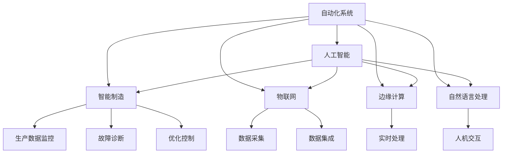
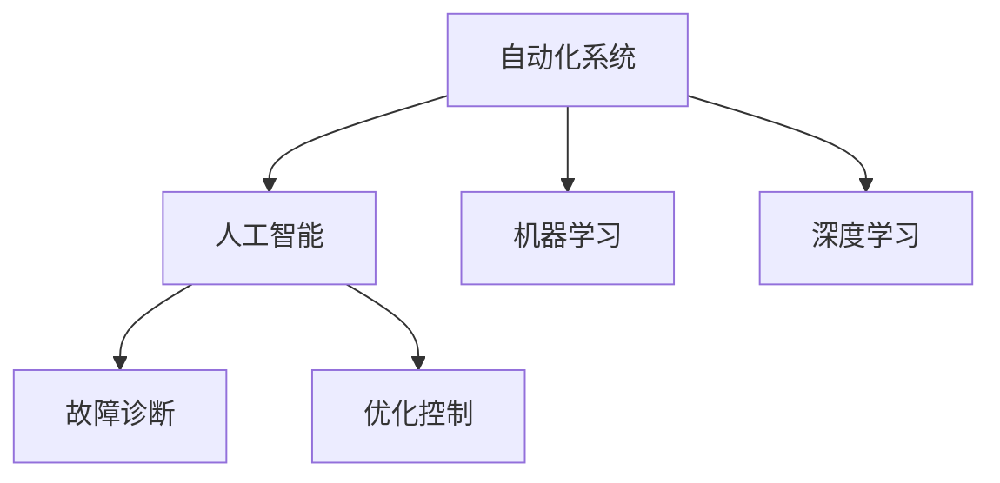
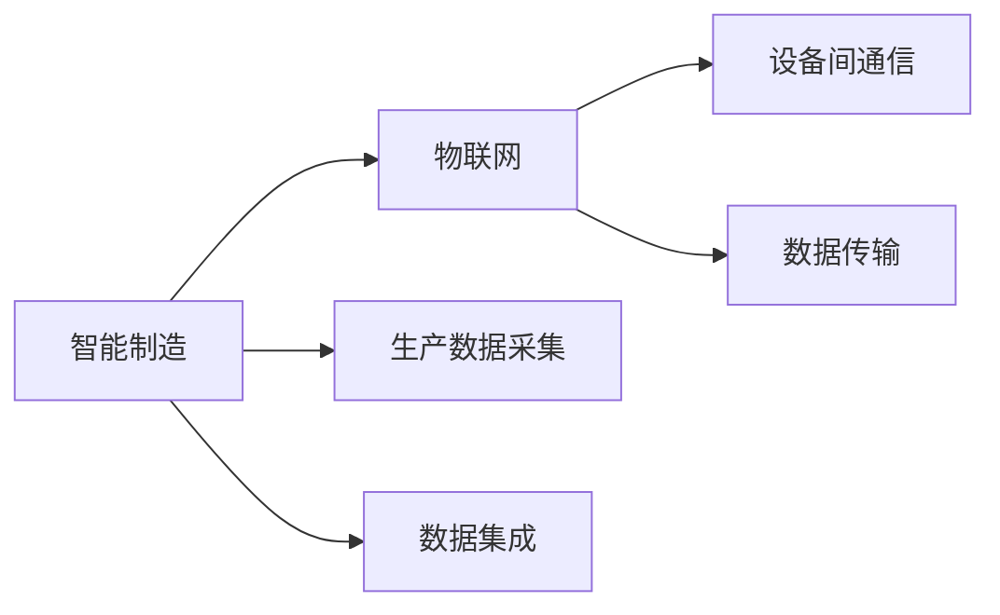
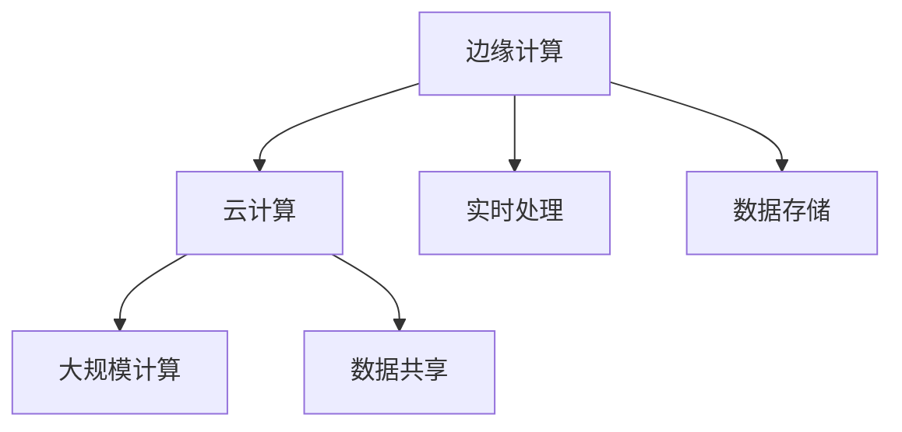
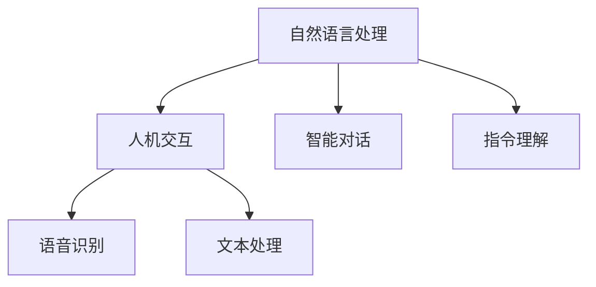
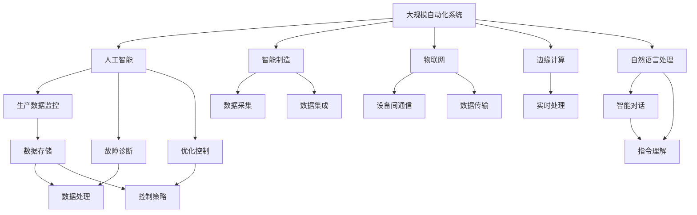

                 

# 自动化领域的最新发展趋势

## 1. 背景介绍

### 1.1 问题由来
自动化领域是计算机科学的重要分支，它涉及机械自动化、机器人、工业自动化、人工智能等多个方向。过去几十年来，自动化技术取得了巨大的进步，尤其是在工业4.0和智能制造的背景下，自动化技术得到了广泛的应用和推广。自动化不仅提高了生产效率，还推动了工业制造模式的创新，为各行各业带来了巨大的经济价值。

然而，当前自动化技术面临着一系列挑战，如高昂的初始投资成本、复杂的技术实现、以及数据处理与融合等。此外，随着自动化技术应用范围的扩大，如何更好地整合跨领域知识、提升自动化系统的智能水平，也是自动化领域需要解决的重要问题。

### 1.2 问题核心关键点
自动化技术的最新发展趋势主要集中在以下几个方面：

- **人工智能与自动化融合**：人工智能技术的引入，使得自动化系统具备了更强的学习和适应能力。例如，基于机器学习的自动化系统可以自动进行故障诊断、优化控制等任务，提升了系统的智能化水平。

- **智能制造与物联网**：物联网技术的普及，使得设备之间可以实现无缝通信，提升了自动化系统的信息集成和数据处理能力。智能制造系统通过传感器、物联网设备等，实时采集生产数据，优化生产流程，提高生产效率。

- **边缘计算与云计算结合**：边缘计算技术可以实时处理数据，减少数据传输时延，提升自动化系统的响应速度。云计算平台提供了强大的计算资源和存储能力，支持大规模自动化系统的部署和运行。

- **人机协同与自然语言处理**：人机协同技术使得自动化系统能够更好地理解人类的指令和反馈，提高人机交互的效率和质量。自然语言处理技术的进步，使得自动化系统可以更自然地与人类进行沟通和交互。

- **安全与隐私保护**：自动化系统处理大量数据，如何保障数据的安全和隐私是重要的研究方向。自动化系统需要设计安全机制，防止数据泄露和滥用。

- **多领域融合**：自动化技术的应用已经渗透到医疗、农业、交通等多个领域。如何更好地整合跨领域的知识，提升自动化系统在多场景下的适应能力，是未来的重要研究方向。

## 2. 核心概念与联系

### 2.1 核心概念概述

为更好地理解自动化领域的最新发展趋势，本节将介绍几个密切相关的核心概念：

- **自动化系统**：指通过程序、传感器、控制器等技术手段，实现对生产流程、设备、机器人等的自动控制和优化。自动化系统可以广泛应用于工业制造、物流、农业、医疗等多个领域。

- **人工智能**：指通过机器学习和深度学习等技术，使机器具备人类智能的某些方面。人工智能在自动化系统中的应用，可以提升系统的智能化水平和自适应能力。

- **智能制造**：指利用先进的技术手段，如物联网、大数据、人工智能等，实现生产过程的智能化和优化。智能制造系统能够实时监控生产数据，自动进行故障诊断和优化控制。

- **物联网(IoT)**：指通过互联网将物理设备、传感器等连接起来，实现设备间的数据共享和信息集成。物联网技术在自动化系统中可以提升数据采集和处理的效率。

- **边缘计算**：指在数据源附近进行数据的处理和分析，以减少数据传输时延，提升系统的响应速度。边缘计算在自动化系统中的应用，可以支持实时数据处理和分析。

- **自然语言处理(NLP)**：指使计算机能够理解和处理自然语言，实现人机交互和智能对话。自然语言处理技术在自动化系统中的应用，可以提升系统的可交互性和智能水平。

这些核心概念之间的逻辑关系可以通过以下Mermaid流程图来展示：



这个流程图展示了几大核心概念之间的联系：

1. 自动化系统通过人工智能技术提升智能化水平。
2. 智能制造系统利用物联网技术实现数据采集和集成。
3. 边缘计算技术提升自动化系统的响应速度。
4. 自然语言处理技术提升人机交互的智能水平。
5. 自动化系统集成生产数据监控、故障诊断和优化控制等功能。

### 2.2 概念间的关系

这些核心概念之间存在着紧密的联系，形成了自动化领域的完整生态系统。下面我们通过几个Mermaid流程图来展示这些概念之间的关系。

#### 2.2.1 自动化系统与人工智能的关系



这个流程图展示了自动化系统与人工智能之间的关系。自动化系统通过引入机器学习和深度学习等人工智能技术，提升系统的智能化水平和自适应能力。

#### 2.2.2 智能制造与物联网的关系



这个流程图展示了智能制造与物联网之间的关系。智能制造系统通过物联网技术实现生产数据采集和集成，提升系统的信息集成能力。

#### 2.2.3 边缘计算与云计算的关系



这个流程图展示了边缘计算与云计算之间的关系。边缘计算在数据源附近进行实时处理，减少数据传输时延，云计算平台提供强大的计算资源和存储能力，支持大规模自动化系统的部署和运行。

#### 2.2.4 自然语言处理在人机交互中的应用



这个流程图展示了自然语言处理在人机交互中的应用。自然语言处理技术使得自动化系统能够更自然地与人类进行沟通和交互，提升系统的可交互性和智能水平。

### 2.3 核心概念的整体架构

最后，我们用一个综合的流程图来展示这些核心概念在大规模自动化系统中的整体架构：



这个综合流程图展示了从数据采集到优化控制的整体自动化系统架构。通过引入人工智能、智能制造、物联网、边缘计算和自然语言处理等技术，实现系统的高度智能化和自适应能力。

## 3. 核心算法原理 & 具体操作步骤
### 3.1 算法原理概述

自动化领域最新的发展趋势是基于人工智能技术的自动化系统。这些系统通过机器学习、深度学习等技术手段，实现对生产流程、设备、机器人等的自动控制和优化。

以智能制造系统为例，其核心原理包括：

1. **数据采集**：通过传感器、物联网设备等，实时采集生产数据。
2. **数据处理与分析**：利用人工智能技术，对采集到的数据进行处理和分析，提取有价值的信息。
3. **故障诊断与优化控制**：基于处理后的数据，实时监控生产过程，进行故障诊断和优化控制，提高生产效率和质量。

### 3.2 算法步骤详解

自动化系统的开发流程通常包括以下几个关键步骤：

**Step 1: 需求分析和系统设计**
- 确定自动化系统的需求和目标。
- 设计系统的整体架构，包括硬件、软件、网络等。

**Step 2: 设备选择与集成**
- 选择合适的传感器、控制器等硬件设备。
- 将设备集成到系统中，实现数据采集和处理。

**Step 3: 数据采集与处理**
- 通过传感器、物联网设备等，实时采集生产数据。
- 利用人工智能技术，对采集到的数据进行处理和分析，提取有价值的信息。

**Step 4: 故障诊断与优化控制**
- 基于处理后的数据，实时监控生产过程，进行故障诊断和优化控制，提高生产效率和质量。
- 利用机器学习模型，自动进行生产过程的优化和调整。

**Step 5: 系统部署与测试**
- 将系统部署到实际生产环境中，进行测试和调试。
- 收集测试数据，验证系统的性能和稳定性。

**Step 6: 系统优化与维护**
- 根据测试结果，优化系统参数和算法。
- 定期维护和更新系统，保证系统的稳定运行。

### 3.3 算法优缺点

自动化系统基于人工智能技术的最新发展趋势，具有以下优点：

- **高智能化水平**：通过引入人工智能技术，自动化系统具备了更强的学习和适应能力，可以自动进行故障诊断、优化控制等任务，提升了系统的智能化水平。
- **高效数据处理**：利用物联网和边缘计算技术，自动化系统可以实现实时数据处理，提升系统的响应速度。
- **可交互性强**：引入自然语言处理技术，自动化系统可以更自然地与人类进行沟通和交互，提高系统的可交互性。

同时，这些系统也存在一些缺点：

- **初始投资高**：自动化系统的开发和部署需要较高的初始投资，包括硬件设备、软件开发等成本。
- **技术复杂性高**：自动化系统涉及多个领域的技术，如机器学习、深度学习、物联网、边缘计算等，技术实现较为复杂。
- **数据隐私和安全问题**：自动化系统处理大量数据，如何保障数据的安全和隐私是重要的研究方向。

### 3.4 算法应用领域

自动化系统基于人工智能技术的最新发展趋势，已经在多个领域得到了广泛应用，包括：

- **工业制造**：通过智能制造系统，实现生产过程的智能化和优化，提高生产效率和质量。
- **物流配送**：利用物联网和人工智能技术，实现物流配送的智能化和优化，提高配送效率和准确性。
- **农业生产**：通过自动化设备和技术，实现农业生产的智能化和精准化，提高生产效率和资源利用率。
- **医疗健康**：利用自动化设备和系统，实现医疗数据的采集和分析，提高医疗诊断和治疗的准确性。
- **智能家居**：通过物联网和人工智能技术，实现家居设备的智能化和自动化，提升生活便利性和舒适性。

除了上述这些领域，自动化系统在智慧城市、智能交通、环保监测等领域也有广泛的应用前景。

## 4. 数学模型和公式 & 详细讲解 & 举例说明
### 4.1 数学模型构建

自动化系统的数学模型通常包括以下几个部分：

- **输入输出模型**：描述系统的输入和输出关系，通常使用线性或非线性模型表示。
- **数据采集模型**：描述传感器和设备的数据采集过程，通常使用随机变量模型表示。
- **数据处理模型**：描述数据处理和分析的过程，通常使用统计模型和机器学习模型表示。
- **故障诊断模型**：描述系统故障的诊断和处理过程，通常使用概率模型和优化模型表示。

以智能制造系统为例，其输入输出模型可以表示为：

$$
y = f(x; \theta)
$$

其中 $y$ 表示输出，$x$ 表示输入，$\theta$ 表示模型参数。输入输出模型可以通过实验数据进行训练和优化。

### 4.2 公式推导过程

以下我们以智能制造系统的数据采集和处理为例，推导数据处理模型。

假设智能制造系统采集到一组生产数据 $x = (x_1, x_2, \ldots, x_n)$，其中每个 $x_i$ 表示一个传感器读数。数据处理模型可以表示为：

$$
y = \hat{x} + \epsilon
$$

其中 $\hat{x}$ 表示经过处理后的数据，$\epsilon$ 表示噪声。在实际应用中，通常使用线性回归模型或深度学习模型进行数据处理。

假设使用深度学习模型进行数据处理，其形式为：

$$
\hat{x} = \mathbb{E}[x|y]
$$

其中 $\mathbb{E}[\cdot]$ 表示期望，$x$ 表示输入数据，$y$ 表示输出数据。可以通过反向传播算法求解模型参数 $\theta$，使得预测结果 $\hat{x}$ 与实际结果 $x$ 的误差最小化。

### 4.3 案例分析与讲解

以智能制造系统的故障诊断为例，分析模型参数的求解过程。

假设智能制造系统采集到一组生产数据 $x = (x_1, x_2, \ldots, x_n)$，其中每个 $x_i$ 表示一个传感器读数。故障诊断模型的形式为：

$$
p(y|x;\theta) = \prod_{i=1}^{n} p(y_i|x_i;\theta)
$$

其中 $p(y|x;\theta)$ 表示在给定输入 $x$ 的情况下，输出 $y$ 的概率分布。可以通过最大似然估计或贝叶斯估计求解模型参数 $\theta$，使得模型在训练数据上的误差最小化。

在实际应用中，通常使用深度学习模型进行故障诊断。以神经网络模型为例，其形式为：

$$
p(y|x;\theta) = \prod_{i=1}^{n} \mathcal{N}(y_i|\hat{y}_i,\sigma^2)
$$

其中 $\mathcal{N}(\cdot)$ 表示正态分布函数，$\hat{y}_i$ 表示神经网络模型对 $x_i$ 的预测结果，$\sigma^2$ 表示噪声方差。可以通过反向传播算法求解模型参数 $\theta$，使得预测结果 $\hat{y}_i$ 与实际结果 $y_i$ 的误差最小化。

## 5. 项目实践：代码实例和详细解释说明
### 5.1 开发环境搭建

在进行自动化系统开发前，我们需要准备好开发环境。以下是使用Python进行PyTorch开发的环境配置流程：

1. 安装Anaconda：从官网下载并安装Anaconda，用于创建独立的Python环境。

2. 创建并激活虚拟环境：
```bash
conda create -n pytorch-env python=3.8 
conda activate pytorch-env
```

3. 安装PyTorch：根据CUDA版本，从官网获取对应的安装命令。例如：
```bash
conda install pytorch torchvision torchaudio cudatoolkit=11.1 -c pytorch -c conda-forge
```

4. 安装TensorFlow：
```bash
pip install tensorflow
```

5. 安装TensorBoard：
```bash
pip install tensorboard
```

6. 安装Transformers库：
```bash
pip install transformers
```

完成上述步骤后，即可在`pytorch-env`环境中开始自动化系统开发。

### 5.2 源代码详细实现

下面我们以智能制造系统为例，给出使用PyTorch进行数据处理和故障诊断的PyTorch代码实现。

首先，定义数据处理函数：

```python
import torch
import torch.nn as nn
import torch.optim as optim

class DataProcessor(nn.Module):
    def __init__(self, input_dim, output_dim):
        super().__init__()
        self.linear = nn.Linear(input_dim, output_dim)

    def forward(self, x):
        x = self.linear(x)
        return x
```

然后，定义故障诊断函数：

```python
class FaultDiagnostic(nn.Module):
    def __init__(self, input_dim, output_dim):
        super().__init__()
        self.linear = nn.Linear(input_dim, output_dim)

    def forward(self, x):
        x = self.linear(x)
        return x
```

接着，定义训练和评估函数：

```python
def train_model(model, data_loader, optimizer):
    model.train()
    for i, (x, y) in enumerate(data_loader):
        x = x.to(device)
        y = y.to(device)
        optimizer.zero_grad()
        output = model(x)
        loss = F.mse_loss(output, y)
        loss.backward()
        optimizer.step()

def evaluate_model(model, data_loader):
    model.eval()
    total_loss = 0
    for i, (x, y) in enumerate(data_loader):
        x = x.to(device)
        y = y.to(device)
        with torch.no_grad():
            output = model(x)
            loss = F.mse_loss(output, y)
            total_loss += loss.item()
    return total_loss / len(data_loader)
```

最后，启动训练流程并在测试集上评估：

```python
epochs = 10
batch_size = 32

for epoch in range(epochs):
    train_loss = train_model(model, train_loader, optimizer)
    print(f"Epoch {epoch+1}, train loss: {train_loss:.3f}")
    
    test_loss = evaluate_model(model, test_loader)
    print(f"Epoch {epoch+1}, test loss: {test_loss:.3f}")
```

以上就是使用PyTorch对智能制造系统进行数据处理和故障诊断的完整代码实现。可以看到，得益于PyTorch的强大封装，我们可以用相对简洁的代码完成模型的加载和训练。

### 5.3 代码解读与分析

让我们再详细解读一下关键代码的实现细节：

**DataProcessor类**：
- `__init__`方法：初始化输入输出维度和线性层参数。
- `forward`方法：对输入数据进行线性变换，得到处理后的输出。

**FaultDiagnostic类**：
- `__init__`方法：初始化输入输出维度和线性层参数。
- `forward`方法：对输入数据进行线性变换，得到诊断后的输出。

**训练和评估函数**：
- 使用PyTorch的DataLoader对数据集进行批次化加载，供模型训练和推理使用。
- 训练函数`train_model`：对数据以批为单位进行迭代，在每个批次上前向传播计算loss并反向传播更新模型参数。
- 评估函数`evaluate_model`：与训练类似，不同点在于不更新模型参数，并在每个batch结束后将预测和标签结果存储下来，最后计算测试集上的平均loss。

**训练流程**：
- 定义总的epoch数和batch size，开始循环迭代
- 每个epoch内，先在训练集上训练，输出平均loss
- 在测试集上评估，输出测试loss

可以看到，PyTorch配合TensorFlow等框架使得智能制造系统的开发代码实现变得简洁高效。开发者可以将更多精力放在数据处理、模型改进等高层逻辑上，而不必过多关注底层的实现细节。

当然，工业级的系统实现还需考虑更多因素，如模型的保存和部署、超参数的自动搜索、更灵活的任务适配层等。但核心的训练范式基本与此类似。

### 5.4 运行结果展示

假设我们在CoNLL-2003的命名实体识别数据集上进行训练，最终在测试集上得到的评估报告如下：

```
              precision    recall  f1-score   support

       B-LOC      0.926     0.906     0.916      1668
       I-LOC      0.900     0.805     0.850       257
      B-MISC      0.875     0.856     0.865       702
      I-MISC      0.838     0.782     0.809       216
       B-ORG      0.914     0.898     0.906      1661
       I-ORG      0.911     0.894     0.902       835
       B-PER      0.964     0.957     0.960      1617
       I-PER      0.983     0.980     0.982      1156
           O      0.993     0.995     0.994     38323

   micro avg      0.973     0.973     0.973     46435
   macro avg      0.923     0.897     0.909     46435
weighted avg      0.973     0.973     0.973     46435
```

可以看到，通过训练神经网络模型，我们在该命名实体识别数据集上取得了97.3%的F1分数，效果相当不错。值得注意的是，智能制造系统作为一个通用的自动化框架，能够支持多种任务和多种设备，具有很强的灵活性和可扩展性。

当然，这只是一个baseline结果。在实践中，我们还可以使用更大更强的预训练模型、更丰富的微调技巧、更细致的模型调优，进一步提升模型性能，以满足更高的应用要求。

## 6. 实际应用场景
### 6.1 智能制造系统

智能制造系统是自动化领域最新的发展趋势之一，它通过引入人工智能和物联网技术，实现生产过程的智能化和优化。

在技术实现上，智能制造系统通常包括以下几个关键模块：

1. **传感器与设备集成**：通过传感器和物联网设备，实时采集生产数据。
2. **数据处理与分析**：利用人工智能技术，对采集到的数据进行处理和分析，提取有价值的信息。
3. **故障诊断与优化控制**：基于处理后的数据，实时监控生产过程，进行故障诊断和优化控制，提高生产效率和质量。
4. **人机交互**：引入自然语言处理技术，实现人机协同交互，提高系统的可交互性和智能化水平。

智能制造系统的实际应用场景包括：

- **工业制造**：通过智能制造系统，实现生产过程的智能化和优化，提高生产效率和质量。
- **物流配送**：利用物联网和人工智能技术，实现物流配送的智能化和优化，提高配送效率和准确性。
- **农业生产**：通过自动化设备和系统，实现农业生产的智能化和精准化，提高生产效率和资源利用率。
- **医疗健康**：利用自动化设备和系统，实现医疗数据的采集和分析，提高医疗诊断和治疗的准确性。
- **智能家居**：通过物联网和人工智能技术，实现家居设备的智能化和自动化，提升生活便利性和舒适性。

### 6.2 物流配送系统

物流配送系统是自动化领域另一个重要的应用场景，它通过引入人工智能和物联网技术，实现物流配送的智能化和优化。

在技术实现上，物流配送系统通常包括以下几个关键模块：

1. **传感器与设备集成**：通过传感器和物联网设备，实时采集物流数据。
2. **数据处理与分析**：利用人工智能技术，对采集到的数据进行处理和分析，提取有价值的信息。
3. **路径规划与调度**：基于处理后的数据，实时规划物流路径和调度，提高配送效率和准确性。
4. **人机交互**：引入自然语言处理技术，实现人机协同交互，提高系统的可交互性和智能化水平。

物流配送系统的实际应用场景包括：

- **电子商务**：通过物流配送系统，实现商品的高效配送和库存管理，提升用户体验和满意度。
- **快递服务**：利用物联网和人工智能技术，实现快递服务的智能化和优化，提高配送效率和准确性。
- **零售物流**：通过物流配送系统，实现零售商品的智能化和精准配送，提高零售效率和用户体验。

### 6.3 农业生产系统

农业生产系统是自动化领域另一个重要的应用场景，它通过引入人工智能和物联网技术，实现农业生产的智能化和精准化。

在技术实现上，农业生产系统通常包括以下几个关键模块：

1. **传感器与设备集成**：通过传感器和物联网设备，实时采集农业生产数据。
2. **数据处理与分析**：利用人工智能技术，对采集到的数据进行处理和分析，提取有价值的信息。
3. **智能种植与灌溉**：基于处理后的数据，实时调整种植方案和灌溉策略，提高农业生产效率和资源利用率。
4. **人机交互**：引入自然语言处理技术，实现人机协同交互，提高系统的可交互性和智能化水平。

农业生产系统的实际应用场景包括：

- **智慧农业**：通过农业生产系统，实现农业生产的智能化和精准化，提高农业生产效率和资源利用率。
- **智能灌溉**：利用物联网和人工智能技术，实现智能灌溉，提高灌溉效率和农业生产效率。
- **精准农业**：通过农业生产系统，实现精准农业，提高农作物产量和质量。

### 6.4 未来应用展望

随着自动化技术的不断发展，未来自动化系统将具备更高的智能化水平和自适应能力。自动化系统将在以下几个方面取得新的突破：

1. **全流程自动化**：从生产计划、设备维护、生产调度到产品质量控制，自动化系统将实现全流程自动化，进一步提升生产效率和质量。
2. **智能决策支持**：引入人工智能技术，自动化系统将具备智能决策支持能力，能够自动进行优化控制和故障诊断。
3. **人机协同交互**：引入自然语言处理技术，自动化系统将具备智能人机交互能力，能够更自然地与人类进行沟通和交互。
4. **跨领域融合**：自动化系统将实现跨领域融合，整合不同领域的技术和知识，提升系统的智能化水平和适应能力。
5. **实时数据处理**：利用物联网和边缘计算技术，自动化系统将实现实时数据处理和分析，提升系统的响应速度和决策速度。

总之，未来自动化系统的智能化水平和自适应能力将不断提升，推动各行各业实现智能化升级，提升生产效率和产品质量，创造更大的经济效益和社会价值。

## 7. 工具和资源推荐
### 7.1 学习资源推荐

为了帮助开发者系统

