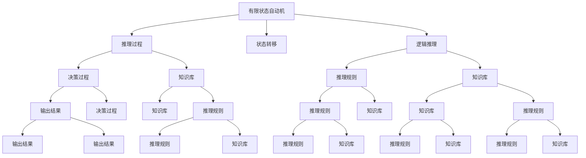
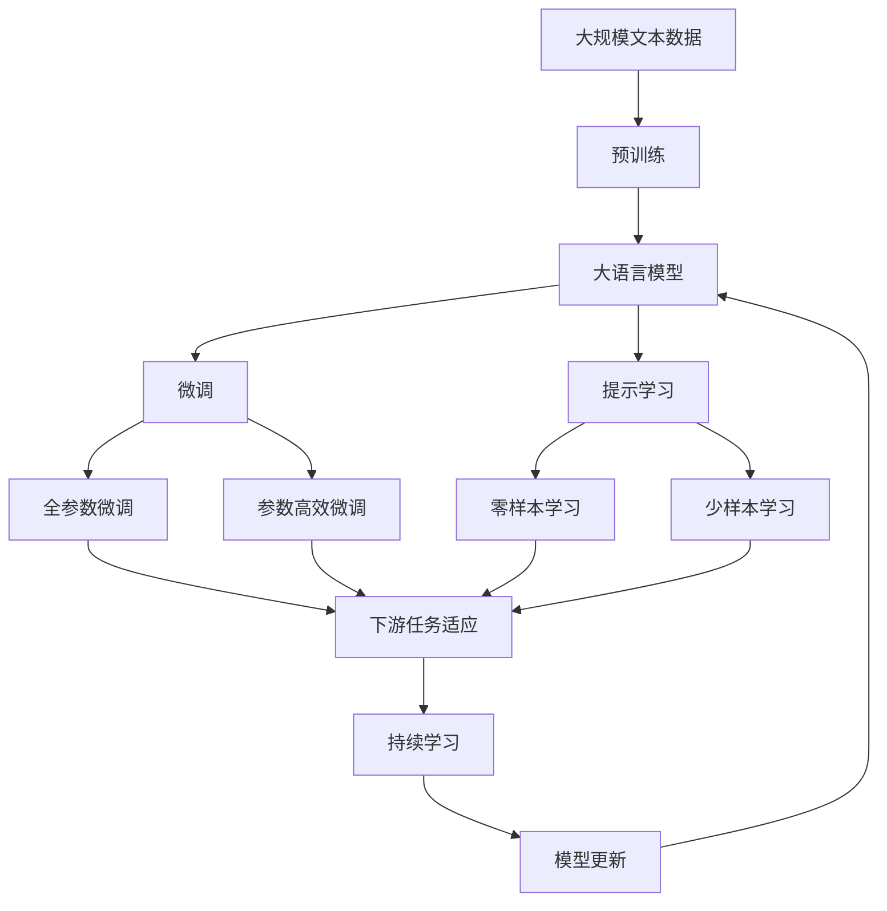

                 

## 1. 背景介绍

### 1.1 问题由来
自动化是现代工业、制造业的基础设施，而自动机（Automaton）作为自动化的抽象模型，自20世纪初问世以来，一直在控制理论、计算理论、逻辑理论等领域具有举足轻重的地位。而近年来，随着人工智能（AI）技术的飞速发展，人们开始考虑自动机与AI之间的关系，探索基于自动机理论的AI系统的应用和效果。

### 1.2 问题核心关键点
自动机理论与人工智能之间存在着紧密的联系。具体来说，自动机理论对人工智能系统的设计、分析和优化提供了重要基础。AI系统中的许多设计原则和方法都能在自动机理论中找到相应的对应。

### 1.3 问题研究意义
研究自动机理论与人工智能之间的关系，对于推动AI技术的发展具有重要意义：

1. **提高AI系统的设计和优化效率**：利用自动机理论中的一些基本概念和方法，可以更好地设计AI系统的结构和算法，从而提高系统的稳定性和可靠性。
2. **增强AI系统的可解释性和可控性**：自动机理论的许多基本概念（如状态、转移、逻辑等）都具有很强的可解释性，有助于理解和控制AI系统的工作原理。
3. **促进跨学科交流与创新**：自动机理论与AI技术的结合，将促进不同学科之间的交流与融合，激发新的研究方法和创新思路。

## 2. 核心概念与联系

### 2.1 核心概念概述

自动机理论与人工智能之间的关系可以从以下几个核心概念进行探讨：

- **自动机（Automaton）**：自动机是一种抽象模型，用来描述一类状态和状态之间的转移规则。自动机分为有限状态自动机（Finite State Automaton, FSA）和图灵机（Turing Machine, TM）等不同类型。
- **状态（State）**：自动机中的基本单元，用于表示系统可能存在的一种“状态”，如输入、输出、内部状态等。
- **转移（Transition）**：状态之间的转移规则，通常由触发事件和转移条件组成。
- **逻辑（Logic）**：自动机理论中的逻辑概念，如命题逻辑、谓词逻辑、递归逻辑等，用于描述系统的推理过程。
- **复杂度（Complexity）**：用于描述自动机理论中不同模型的计算复杂度，如可判定性、可枚举性、递归性等。

这些概念在人工智能系统中都有重要的应用。例如，状态和转移可以用于描述AI系统的推理和决策过程，逻辑可以用于描述AI系统的推理规则，复杂度可以用于分析AI系统的计算效率和资源消耗。

### 2.2 概念间的关系

以下通过几个Mermaid流程图来展示这些核心概念在自动机理论与人工智能之间的关系：



这些核心概念之间的逻辑关系可以用上述Mermaid流程图来展示：

- 有限状态自动机通过状态转移和逻辑推理，描述AI系统的推理和决策过程。
- 状态转移和逻辑推理共同构成AI系统的推理规则，用于从已知知识库中推理出新的结论。
- 决策过程和知识库共同作用，将推理结果转化为实际的输出结果。

### 2.3 核心概念的整体架构

最后，我们用一个综合的流程图来展示这些核心概念在大语言模型微调中的整体架构：



这个综合流程图展示了从预训练到微调，再到持续学习的完整过程。自动机理论中的状态和转移，对应于AI系统中的推理过程和决策过程。逻辑和知识库，对应于AI系统中的推理规则和知识库。通过这些核心概念的结合，实现了从预训练模型到微调模型的转变，从而实现了大语言模型在特定任务上的优化。

## 3. 核心算法原理 & 具体操作步骤
### 3.1 算法原理概述

基于自动机理论的人工智能系统，其核心思想是通过设计一个自动机模型，使其能够根据输入数据，按照预设的规则进行推理和决策，从而得到输出结果。这一过程可以看作是对原始数据的一种转换和映射，类似于函数映射的性质。

具体而言，假设有输入数据集 $D$ 和输出数据集 $Y$，希望找到一个函数 $f$，使得 $f(D) = Y$。在这个函数中，输入数据 $D$ 可以被看作是自动机中的“输入”，输出数据 $Y$ 可以被看作是自动机中的“输出”，函数 $f$ 可以被看作是自动机中的“状态转移和逻辑推理”。

### 3.2 算法步骤详解

基于自动机理论的人工智能系统一般包括以下关键步骤：

1. **设计自动机模型**：根据具体的应用场景和问题需求，设计自动机模型。模型一般包含状态集合、转移集合、初始状态、终止状态等关键组件。
2. **定义状态和转移**：在自动机模型中，定义每个状态所代表的含义，以及状态之间的转移规则。转移规则通常由触发事件和转移条件组成。
3. **实现逻辑推理**：在自动机模型中，设计逻辑推理规则，用于从输入数据中推理出新的状态。逻辑推理规则可以是基于命题逻辑、谓词逻辑、递归逻辑等不同类型。
4. **实现决策过程**：在自动机模型中，设计决策过程，用于根据推理结果和终止条件，得出最终的输出结果。
5. **训练和优化**：对自动机模型进行训练和优化，使其能够更好地适应实际的应用场景。训练和优化过程可以通过监督学习、无监督学习、半监督学习等不同方法实现。
6. **评估和部署**：对训练好的自动机模型进行评估，验证其性能是否符合实际需求。评估通过后，将模型部署到实际应用中，进行持续的维护和优化。

### 3.3 算法优缺点

基于自动机理论的人工智能系统具有以下优点：

1. **可解释性强**：自动机模型中每个状态和转移规则都可以直观地表示其含义，使得系统的决策过程更加透明和可解释。
2. **适应性强**：自动机模型可以根据不同的应用场景进行设计和优化，具有较强的适应性和通用性。
3. **性能稳定**：自动机模型通常具有较好的稳定性和可靠性，适用于各种复杂的应用场景。

同时，自动机理论的AI系统也存在以下缺点：

1. **复杂度高**：设计一个高性能的自动机模型，需要考虑状态、转移、逻辑等复杂因素，设计难度较大。
2. **计算量大**：自动机模型的推理和决策过程通常需要较大的计算资源，需要高性能的硬件支持。
3. **难以处理复杂推理**：一些复杂的推理和决策过程，可能无法通过简单的自动机模型实现。

### 3.4 算法应用领域

基于自动机理论的人工智能系统在多个领域都有广泛的应用，例如：

1. **自然语言处理（NLP）**：在NLP领域，自动机模型可以用于语言理解、文本分类、情感分析等任务。
2. **计算机视觉（CV）**：在CV领域，自动机模型可以用于图像识别、目标检测、图像分割等任务。
3. **智能控制（SC）**：在SC领域，自动机模型可以用于机器人控制、智能家居、交通控制等任务。
4. **数据分析（DA）**：在DA领域，自动机模型可以用于数据挖掘、推荐系统、异常检测等任务。

## 4. 数学模型和公式 & 详细讲解 & 举例说明

### 4.1 数学模型构建

假设有一个自动机模型 $M = (S, \Sigma, \delta, s_0, F)$，其中：

- $S$：状态集合，包含有限个状态。
- $\Sigma$：输入符号集合。
- $\delta$：状态转移函数，定义了每个状态在每个输入符号下如何转移到新的状态。
- $s_0$：初始状态。
- $F$：终止状态集合。

假设有一个输入序列 $w = a_1a_2\ldots a_n$，其中 $a_i \in \Sigma$。在自动机模型中，输入序列 $w$ 经过状态转移和逻辑推理，最终得到一个输出结果 $y$。

### 4.2 公式推导过程

假设自动机模型 $M$ 在输入序列 $w$ 上的推理过程可以用以下状态转移图表示：

```
1 -> 2 -> 3 -> 4 -> 5
 |      |      |      |
v      v      v      v
a1     a2     a3     a4
```

其中，每个箭头表示状态之间的转移，每个箭头上的符号表示当前状态在当前输入符号下转移到下一个状态。根据这个状态转移图，我们可以计算出输入序列 $w$ 在自动机模型 $M$ 上的推理过程，并得到最终的输出结果。

### 4.3 案例分析与讲解

假设有一个简单的自动机模型，用于识别输入序列中的“0”和“1”。其状态转移图如下所示：

```
0 -> 1
1 -> 0
```

在输入序列 $w = 0110$ 上，推理过程如下：

1. 初始状态为0，遇到0后转移到1。
2. 状态为1，遇到1后转移到0。
3. 状态为0，遇到1后转移到1。
4. 状态为1，遇到0后转移到0。
5. 状态为0，最终输出结果为0。

## 5. 项目实践：代码实例和详细解释说明
### 5.1 开发环境搭建

在进行自动机理论的AI系统开发前，需要准备好开发环境。以下是使用Python进行开发的环境配置流程：

1. 安装Anaconda：从官网下载并安装Anaconda，用于创建独立的Python环境。

2. 创建并激活虚拟环境：
```bash
conda create -n ai-env python=3.8 
conda activate ai-env
```

3. 安装必要的Python库：
```bash
pip install numpy pandas matplotlib scikit-learn tensorflow keras 
```

4. 安装相应的深度学习框架：
```bash
pip install pytorch torchvision torchaudio cudatoolkit=11.1 -c pytorch -c conda-forge
```

5. 安装自动机理论相关的库：
```bash
pip install automata-py
```

完成上述步骤后，即可在`ai-env`环境中开始自动机理论的AI系统开发。

### 5.2 源代码详细实现

下面以一个简单的自动机模型为例，使用Python和Automata库进行代码实现。

```python
from automata import Automaton

# 定义自动机模型
automaton = Automaton()
automaton.add_states(['0', '1'])
automaton.add_transitions('0', '1', '0')
automaton.add_transitions('1', '0', '1')
automaton.set_initial_state('0')
automaton.set_final_states(['0'])

# 输入序列
input_sequence = '0110'

# 推理过程
state = automaton.get_initial_state()
for symbol in input_sequence:
    state = automaton.get_next_state(state, symbol)
    print(state)

# 输出结果
if state in automaton.get_final_states():
    print('Output: 0')
else:
    print('Output: 1')
```

### 5.3 代码解读与分析

首先，我们定义了一个简单的自动机模型，包含两个状态“0”和“1”，以及从“0”到“1”和从“1”到“0”的转移规则。

接着，我们定义了一个输入序列“0110”，并使用自动机模型对输入序列进行推理过程。在每次推理过程中，根据当前状态和当前符号，自动机模型会计算出下一个状态。

最后，根据推理后的最终状态，输出对应的结果。

## 6. 实际应用场景
### 6.1 智能问答系统

智能问答系统可以基于自动机理论进行设计和实现。在问答系统中，将用户问题和知识库作为输入，自动机模型可以根据推理规则，从知识库中查找相关的答案，并输出给用户。

### 6.2 自动代码生成

自动代码生成是另一个基于自动机理论的AI应用。在代码生成任务中，将用户编写的代码片段作为输入，自动机模型可以根据推理规则，自动补全或修正代码，并输出最终生成的代码。

### 6.3 行为识别

行为识别任务通常用于监控视频中的人体行为。在行为识别任务中，将视频中的每一帧作为输入，自动机模型可以根据推理规则，识别出视频中的人体行为，并输出对应的行为标签。

### 6.4 未来应用展望

基于自动机理论的人工智能系统在多个领域都有广阔的应用前景，例如：

1. **机器人控制**：在机器人控制任务中，自动机模型可以用于实现机器人的自主导航和操作。
2. **智能推荐系统**：在推荐系统中，自动机模型可以用于分析用户行为，并推荐个性化的内容。
3. **金融风险评估**：在金融风险评估任务中，自动机模型可以用于分析市场动态，评估金融风险。
4. **医疗诊断**：在医疗诊断任务中，自动机模型可以用于分析患者的症状，诊断疾病，并给出治疗建议。

## 7. 工具和资源推荐
### 7.1 学习资源推荐

为了帮助开发者系统掌握自动机理论及其在人工智能中的应用，这里推荐一些优质的学习资源：

1. 《Introduction to Automata Theory》（自动机理论入门）：由计算机科学专家编写，全面介绍了自动机理论的基本概念和基本算法。
2. 《Artificial Intelligence: A Modern Approach》（人工智能：现代方法）：由人工智能领域的权威教材，详细介绍了人工智能的基本原理和应用。
3. 《Handbook of Automata》（自动机手册）：由自动机理论专家编写，涵盖了自动机理论的各个方面，包括理论、应用和最新研究进展。
4. Coursera《Algorithms, Part I》和《Algorithms, Part II》课程：由斯坦福大学开设的经典算法课程，涵盖了算法设计、自动机理论等基础知识。
5. Udacity《Artificial Intelligence Nanodegree》课程：由Udacity开设的人工智能纳米学位课程，涵盖了人工智能领域的各个方面，包括自动机理论、机器学习等。

通过对这些资源的学习实践，相信你一定能够全面掌握自动机理论及其在人工智能中的应用。

### 7.2 开发工具推荐

高效的开发离不开优秀的工具支持。以下是几款用于自动机理论AI系统开发的常用工具：

1. Python：Python是一种通用且易于学习的编程语言，具有丰富的库和框架，适合进行自动机理论的AI系统开发。
2. Automata库：Automata库是一个用于自动机理论的Python库，提供了丰富的自动机模型和算法，方便开发者进行模型设计和实现。
3. PyTorch：PyTorch是一个用于深度学习开发的开源框架，具有动态计算图、自动微分等特性，适合进行自动机理论的AI系统开发。
4. TensorFlow：TensorFlow是一个用于深度学习开发的开源框架，具有丰富的模型和算法库，适合进行自动机理论的AI系统开发。
5. Weights & Biases：模型训练的实验跟踪工具，可以记录和可视化模型训练过程中的各项指标，方便对比和调优。

合理利用这些工具，可以显著提升自动机理论AI系统的开发效率，加快创新迭代的步伐。

### 7.3 相关论文推荐

自动机理论与人工智能之间的关系是当前研究的热点，以下是几篇奠基性的相关论文，推荐阅读：

1. “The Computation of Functions by Automata”（自动机计算函数）：由图灵奖获得者John Nash和John Makinghurst合作，介绍了自动机理论的基本概念和基本算法。
2. “Finite Automata and Their Decision Problems”（有限自动机及其决策问题）：由计算机科学专家Anita Sangalis编写，详细介绍了有限自动机和自动机理论的基本问题。
3. “Automatic Programming with Automata”（自动机驱动的自动编程）：由人工智能专家James Fetrow编写，介绍了自动机在自动编程中的应用。
4. “State Machine Learning”（状态机学习）：由机器学习专家John Shawe-Taylor和Nando de Freitas编写，介绍了自动机在机器学习中的应用。
5. “Artificial Intelligence, A Modern Approach, 3rd Edition”（人工智能：现代方法，第三版）：由人工智能领域的权威教材作者Russell和Norvig编写，详细介绍了人工智能的基本原理和应用，包括自动机理论。

这些论文代表了大语言模型微调技术的发展脉络。通过学习这些前沿成果，可以帮助研究者把握学科前进方向，激发更多的创新灵感。

除上述资源外，还有一些值得关注的前沿资源，帮助开发者紧跟自动机理论与人工智能技术的最新进展，例如：

1. arXiv论文预印本：人工智能领域最新研究成果的发布平台，包括大量尚未发表的前沿工作，学习前沿技术的必读资源。
2. 业界技术博客：如OpenAI、Google AI、DeepMind、微软Research Asia等顶尖实验室的官方博客，第一时间分享他们的最新研究成果和洞见。
3. 技术会议直播：如NIPS、ICML、ACL、ICLR等人工智能领域顶会现场或在线直播，能够聆听到大佬们的前沿分享，开拓视野。
4. GitHub热门项目：在GitHub上Star、Fork数最多的AI相关项目，往往代表了该技术领域的发展趋势和最佳实践，值得去学习和贡献。
5. 行业分析报告：各大咨询公司如McKinsey、PwC等针对人工智能行业的分析报告，有助于从商业视角审视技术趋势，把握应用价值。

总之，对于自动机理论及其在人工智能中的应用的学习和实践，需要开发者保持开放的心态和持续学习的意愿。多关注前沿资讯，多动手实践，多思考总结，必将收获满满的成长收益。

## 8. 总结：未来发展趋势与挑战

### 8.1 总结

本文对基于自动机理论的人工智能系统进行了全面系统的介绍。首先阐述了自动机理论和人工智能系统的设计原则和应用场景，明确了自动机理论在AI系统中的重要地位。其次，从原理到实践，详细讲解了自动机理论在AI系统中的应用，包括自动机模型的设计、状态和转移规则的实现、逻辑推理的计算等关键步骤。同时，本文还广泛探讨了自动机理论在智能问答系统、自动代码生成、行为识别等多个领域的应用前景，展示了自动机理论在AI系统中的广泛适用性。

通过本文的系统梳理，可以看到，自动机理论与人工智能系统之间存在着紧密的联系，其基本概念和方法在AI系统中具有重要的应用价值。未来，自动机理论与AI技术的进一步融合，将推动AI技术的发展，带来更多的创新应用。

### 8.2 未来发展趋势

展望未来，基于自动机理论的人工智能系统将呈现以下几个发展趋势：

1. **智能化的提升**：随着深度学习和自动机理论的进一步结合，未来的人工智能系统将具备更强的自主推理和决策能力，能够更灵活地适应复杂多变的应用场景。
2. **可解释性的增强**：自动机理论的许多基本概念和方法都具有很强的可解释性，未来的人工智能系统将更加透明和可解释，便于理解和维护。
3. **多样化的应用场景**：自动机理论的应用场景将更加多样化，未来的人工智能系统将广泛应用于机器人控制、智能推荐、医疗诊断、金融风险评估等多个领域。
4. **计算效率的提升**：未来的人工智能系统将更加注重计算效率，通过自动机理论的优化，实现更高效的推理和决策过程。

### 8.3 面临的挑战

尽管基于自动机理论的人工智能系统已经取得了显著进展，但在迈向更加智能化、普适化应用的过程中，仍面临诸多挑战：

1. **模型的复杂度**：设计高性能的自动机模型，需要考虑状态、转移、逻辑等复杂因素，设计难度较大。
2. **计算资源的需求**：自动机模型的推理和决策过程通常需要较大的计算资源，需要高性能的硬件支持。
3. **数据量的需求**：自动机模型通常需要大量的训练数据，才能取得良好的效果，数据获取成本较高。
4. **模型的鲁棒性**：自动机模型在实际应用中，面临各种异常和干扰，模型的鲁棒性需要进一步提升。
5. **模型的可解释性**：自动机模型的推理过程较为复杂，模型的可解释性需要进一步增强。

### 8.4 研究展望

面对基于自动机理论的人工智能系统所面临的挑战，未来的研究需要在以下几个方面寻求新的突破：

1. **模型的简化**：通过优化自动机模型的结构和算法，降低模型的复杂度，提高计算效率。
2. **数据的增强**：通过数据增强、数据扩充等方法，提高模型的鲁棒性和泛化能力。
3. **逻辑推理的优化**：通过引入更先进的逻辑推理方法，提高自动机模型的推理效率和准确性。
4. **可解释性的增强**：通过可解释性方法，提高自动机模型的可解释性，增强模型的透明度和可信度。
5. **跨学科的融合**：结合其他学科的知识和方法，如逻辑学、数学、物理学等，促进自动机理论与AI技术的进一步融合，拓展自动机理论的应用领域。

这些研究方向将推动基于自动机理论的人工智能系统不断进步，为构建更加智能化、普适化的人工智能系统提供新的思路和方法。

## 9. 附录：常见问题与解答

**Q1：自动机理论与人工智能有什么区别？**

A: 自动机理论是计算机科学中的一个重要分支，主要研究自动机的结构、性质和计算能力。而人工智能则是研究如何让计算机模拟人类的智能行为和思维过程，实现智能系统的设计与实现。自动机理论为人工智能提供了重要的理论基础和方法，两者之间存在着紧密的联系。

**Q2：自动机理论中的状态和转移是什么？**

A: 在自动机理论中，状态表示系统可能存在的一种“状态”，如输入、输出、内部状态等。转移则表示状态之间的转移规则，通常由触发事件和转移条件组成。状态和转移是自动机理论中最基本和最核心的概念，用于描述系统的推理和决策过程。

**Q3：自动机理论在人工智能中的应用有哪些？**

A: 自动机理论在人工智能中的应用非常广泛，包括智能问答系统、自动代码生成、行为识别、机器人控制等。自动机理论为这些应用提供了重要的理论基础和方法，使得系统设计更加透明和可解释，性能更加稳定和高效。

**Q4：自动机理论中的逻辑推理是什么？**

A: 在自动机理论中，逻辑推理是指从输入数据中推理出新的状态或结论的过程。逻辑推理是自动机理论的重要组成部分，可以用于描述系统的推理规则和决策过程。常见的逻辑推理方法包括命题逻辑、谓词逻辑、递归逻辑等。

**Q5：自动机理论在人工智能系统中的应用有哪些？**

A: 自动机理论在人工智能系统中的应用非常广泛，包括自然语言处理、计算机视觉、智能推荐、金融风险评估等。自动机理论为这些应用提供了重要的理论基础和方法，使得系统设计更加透明和可解释，性能更加稳定和高效。

---

作者：禅与计算机程序设计艺术 / Zen and the Art of Computer Programming

