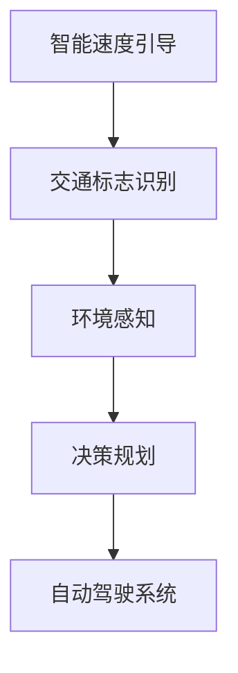
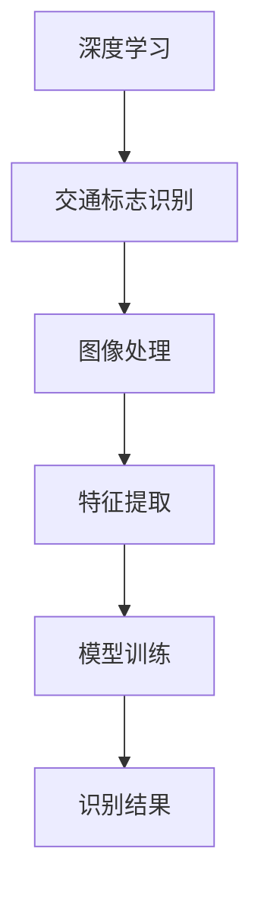
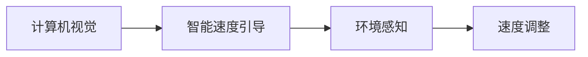
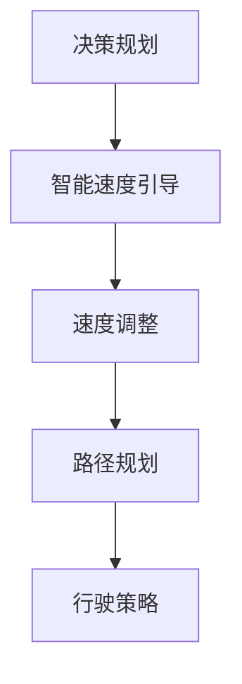
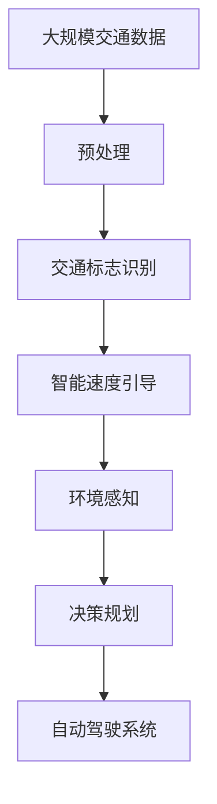
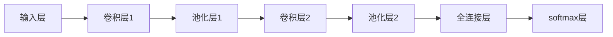

                 

# 自动驾驶中的智能速度引导与交通标志识别

> 关键词：自动驾驶,智能速度引导,交通标志识别,深度学习,计算机视觉,决策规划,强化学习,感知算法,安全驾驶

## 1. 背景介绍

### 1.1 问题由来

随着全球自动驾驶技术的迅速发展，智能速度引导与交通标志识别成为了实现安全、高效自动驾驶的关键技术之一。自动驾驶系统需要实时感知周围环境，并根据交通标志和实际道路情况调整车速和行驶策略。这一过程中，速度引导和交通标志识别两个子系统的表现直接关系到自动驾驶的安全性和可靠性。

然而，由于场景的多样性和环境的复杂性，实现精确的速度引导和交通标志识别仍面临诸多挑战。传统方法依赖于规则驱动和手动调参，难以适应实际交通环境的动态变化。近年来，基于深度学习和计算机视觉的自动驾驶系统开始崭露头角，显著提升了速度引导和交通标志识别的准确性和鲁棒性。

### 1.2 问题核心关键点

自动驾驶中的智能速度引导与交通标志识别主要包括两个核心问题：

1. **智能速度引导**：自动驾驶系统需要根据交通标志和交通规则自动调整车速，确保行驶安全性。智能速度引导依赖于对交通标志的识别和解读，同时考虑到周围车辆、行人、路况等复杂因素，做出合理速度调整。

2. **交通标志识别**：自动驾驶系统需要实时识别道路上的交通标志，包括限速牌、红绿灯、停车标志等，以获取实时道路信息。交通标志识别的准确性和鲁棒性直接影响速度引导的效果和行车安全性。

解决上述问题，不仅可以提高自动驾驶的效率和安全性，还能显著提升用户体验，推动自动驾驶技术在实际场景中的广泛应用。

### 1.3 问题研究意义

智能速度引导与交通标志识别在自动驾驶系统中的应用，具有重要的研究意义：

1. **提升自动驾驶安全性**：通过精准的速度引导和交通标志识别，避免交通事故，保障乘客安全。
2. **提高驾驶效率**：自动化处理交通规则和标志信息，减轻驾驶员负担，提高驾驶效率。
3. **支持多样化场景**：准确识别不同类型的交通标志，支持复杂多变的城市道路环境。
4. **推动技术产业化**：作为自动驾驶系统的核心技术，对推动自动驾驶技术在实际应用中的落地具有重要推动作用。

## 2. 核心概念与联系

### 2.1 核心概念概述

为更好地理解智能速度引导与交通标志识别的核心概念，本节将介绍几个密切相关的核心概念：

- **智能速度引导**：自动驾驶系统中，智能速度引导根据交通标志和实时道路情况，自动调整车速，确保行驶安全。核心依赖于对交通标志的识别和解读，以及环境感知和决策规划。
- **交通标志识别**：自动驾驶系统实时识别道路上的交通标志，如限速牌、红绿灯、停车标志等，获取道路信息。交通标志识别依赖于计算机视觉和深度学习技术。
- **深度学习**：基于神经网络构建的机器学习模型，通过学习大量标记数据，实现对复杂问题的自动求解。深度学习在大规模数据上表现优异，广泛应用于图像、语音、自然语言处理等领域。
- **计算机视觉**：研究如何使计算机具备类似于人类的视觉能力，包括图像处理、物体检测、图像识别、场景理解等。计算机视觉在自动驾驶中用于感知环境信息。
- **决策规划**：自动驾驶系统中的核心组成部分，通过融合感知信息和地图信息，生成合理的行驶路径和速度策略，确保安全、高效的自动驾驶。

这些核心概念之间的逻辑关系可以通过以下Mermaid流程图来展示：



这个流程图展示了智能速度引导与交通标志识别的整体架构：

1. 智能速度引导和交通标志识别是自动驾驶系统的核心模块。
2. 交通标志识别依赖于计算机视觉技术，通过识别交通标志获取道路信息。
3. 环境感知是智能速度引导的基础，获取道路环境信息。
4. 决策规划根据感知信息生成行驶策略，确保自动驾驶的安全性和高效性。

### 2.2 概念间的关系

这些核心概念之间存在着紧密的联系，形成了自动驾驶中的智能速度引导与交通标志识别的完整生态系统。下面我通过几个Mermaid流程图来展示这些概念之间的关系。

#### 2.2.1 深度学习与交通标志识别的关系



这个流程图展示了深度学习在交通标志识别中的应用：

1. 深度学习通过神经网络模型，学习大量标记数据，实现对交通标志的自动识别。
2. 图像处理将原始图像转换为网络可用的形式。
3. 特征提取从图像中提取出关键的视觉信息。
4. 模型训练使用标记数据训练深度学习模型，输出识别结果。

#### 2.2.2 计算机视觉与智能速度引导的关系



这个流程图展示了计算机视觉在智能速度引导中的应用：

1. 计算机视觉用于感知环境信息，包括道路标志、交通灯、车辆、行人等。
2. 环境感知从计算机视觉中获取感知信息，包括交通标志的类别、位置、速度等。
3. 智能速度引导根据环境感知信息，生成速度调整策略。

#### 2.2.3 决策规划与智能速度引导的关系



这个流程图展示了决策规划在智能速度引导中的应用：

1. 决策规划融合感知信息和地图信息，生成最优的行驶路径和速度策略。
2. 智能速度引导根据决策规划结果，执行速度调整，确保安全行驶。

### 2.3 核心概念的整体架构

最后，我们用一个综合的流程图来展示这些核心概念在大规模自动驾驶系统中的整体架构：



这个综合流程图展示了从预处理到自动驾驶系统的完整过程：

1. 大规模交通数据经过预处理，提取关键信息。
2. 交通标志识别从预处理数据中识别交通标志，获取道路信息。
3. 智能速度引导根据交通标志信息和环境感知，生成速度调整策略。
4. 环境感知从交通标志识别中获取道路环境信息。
5. 决策规划根据环境感知信息和地图信息，生成最优行驶路径和速度策略。
6. 自动驾驶系统根据决策规划结果，执行速度调整和路径规划。

通过这些流程图，我们可以更清晰地理解智能速度引导与交通标志识别在大规模自动驾驶系统中的各个模块之间的逻辑关系和作用，为后续深入讨论具体的算法和实现奠定基础。

## 3. 核心算法原理 & 具体操作步骤
### 3.1 算法原理概述

基于深度学习的智能速度引导与交通标志识别方法，本质上是一个有监督的分类和回归问题。其核心思想是：

- **交通标志识别**：将道路图像输入深度学习模型，通过训练生成交通标志分类器，将图像中的交通标志识别出来，并预测其类别和位置。
- **智能速度引导**：将交通标志信息和环境感知数据输入决策规划算法，生成合理的速度调整策略，并根据环境变化动态调整。

### 3.2 算法步骤详解

基于深度学习的智能速度引导与交通标志识别一般包括以下几个关键步骤：

**Step 1: 数据收集与预处理**
- 收集大规模交通数据，包括道路图像、交通标志信息、车辆信息等。
- 对数据进行标注，如标记交通标志类别、位置、速度等。
- 进行数据增强，如旋转、裁剪、缩放、噪声添加等，扩充数据集。

**Step 2: 模型选择与训练**
- 选择适合的深度学习模型，如卷积神经网络（CNN）、循环神经网络（RNN）、Transformer等。
- 设计合适的训练流程，包括数据加载、模型训练、验证、保存等。
- 使用GPU/TPU等高性能设备进行模型训练，优化损失函数，提高模型精度。

**Step 3: 交通标志识别**
- 将道路图像输入交通标志识别模型，输出交通标志的类别和位置。
- 对识别结果进行后处理，如非极大值抑制（NMS）、阈值筛选等，确保准确性。

**Step 4: 智能速度引导**
- 根据交通标志信息和环境感知数据，生成速度调整策略。
- 使用强化学习、路径规划等算法，优化速度调整策略，确保安全行驶。

**Step 5: 系统集成与部署**
- 将交通标志识别和智能速度引导模块集成到自动驾驶系统中。
- 在实际车辆上部署系统，并进行实地测试和优化。

### 3.3 算法优缺点

基于深度学习的智能速度引导与交通标志识别方法具有以下优点：

1. **高精度和高鲁棒性**：深度学习模型在处理大规模数据时具有很高的精度和鲁棒性，能够适应复杂多变的交通环境。
2. **实时性**：通过并行计算和优化算法，深度学习模型可以实时处理交通数据，满足自动驾驶的实时性要求。
3. **可扩展性**：深度学习模型可以通过增加训练数据和计算资源来扩展，适用于各种尺度和复杂度的交通场景。

然而，该方法也存在以下缺点：

1. **高资源需求**：深度学习模型需要大量的计算资源和存储资源，尤其是在大规模数据集上训练时。
2. **可解释性差**：深度学习模型的内部决策过程难以解释，难以进行人工审查和调试。
3. **数据依赖性强**：模型性能依赖于数据质量和标注质量，标注成本较高。

### 3.4 算法应用领域

基于深度学习的智能速度引导与交通标志识别方法在自动驾驶系统中得到了广泛应用，覆盖了多种实际场景：

- **城市道路**：在城市道路上，交通标志识别可以用于检测红绿灯、限速牌、停车标志等，辅助智能速度引导，确保行车安全。
- **高速公路**：在高速公路上，交通标志识别可以用于检测限速牌、路标等，辅助智能速度引导，提高行驶效率。
- **交叉口**：在交叉口上，交通标志识别可以用于检测交通灯、停车标志等，辅助智能速度引导，确保安全通行。
- **特殊环境**：在特殊环境中，如隧道、桥梁、山区等，交通标志识别和智能速度引导尤为重要，需要实时处理特殊标志和路况。

除了上述这些场景，基于深度学习的智能速度引导与交通标志识别方法还在智能交通管理、智能停车、智能物流等领域得到了应用。未来，随着技术的不断进步，该方法将在更多实际场景中发挥重要作用。

## 4. 数学模型和公式 & 详细讲解 & 举例说明

### 4.1 数学模型构建

本节将使用数学语言对基于深度学习的智能速度引导与交通标志识别过程进行更加严格的刻画。

记交通标志识别任务为 $T=\{(x_i, y_i)\}_{i=1}^N$，其中 $x_i$ 为输入的图像数据，$y_i$ 为对应的交通标志类别和位置。假设深度学习模型为 $f_{\theta}(x)$，其中 $\theta$ 为模型参数。

定义交通标志识别任务的经验风险为：

$$
\mathcal{L}(\theta) = \frac{1}{N}\sum_{i=1}^N \mathcal{L}_i(f_{\theta}(x_i),y_i)
$$

其中 $\mathcal{L}_i$ 为样本 $i$ 的损失函数，用于衡量模型预测结果与真实标签之间的差异。常见的损失函数包括交叉熵损失、均方误差损失等。

智能速度引导任务的输入包括交通标志识别结果和环境感知数据，输出为速度调整策略。假设智能速度引导任务为 $S=\{(x_i, y_i)\}_{i=1}^N$，其中 $x_i$ 为输入的交通标志信息和环境感知数据，$y_i$ 为对应的速度调整策略。定义智能速度引导任务的经验风险为：

$$
\mathcal{L}(\theta) = \frac{1}{N}\sum_{i=1}^N \mathcal{L}_i(f_{\theta}(x_i),y_i)
$$

其中 $\mathcal{L}_i$ 为样本 $i$ 的损失函数，用于衡量模型预测结果与真实标签之间的差异。

### 4.2 公式推导过程

以下我们以交通标志识别任务为例，推导交叉熵损失函数及其梯度的计算公式。

假设模型 $f_{\theta}(x)$ 输出 $k$ 个类别的概率分布，真实标签为 $y_i$。则交叉熵损失函数定义为：

$$
\mathcal{L}_i(f_{\theta}(x_i),y_i) = -\sum_{j=1}^k y_{ij}\log f_{\theta}(x_i,j)
$$

将其代入经验风险公式，得：

$$
\mathcal{L}(\theta) = -\frac{1}{N}\sum_{i=1}^N \sum_{j=1}^k y_{ij}\log f_{\theta}(x_i,j)
$$

根据链式法则，损失函数对参数 $\theta_k$ 的梯度为：

$$
\frac{\partial \mathcal{L}(\theta)}{\partial \theta_k} = -\frac{1}{N}\sum_{i=1}^N \frac{\partial}{\partial \theta_k} \sum_{j=1}^k y_{ij}\log f_{\theta}(x_i,j)
$$

使用梯度链式法则，可进一步展开为：

$$
\frac{\partial \mathcal{L}(\theta)}{\partial \theta_k} = -\frac{1}{N}\sum_{i=1}^N \sum_{j=1}^k \frac{\partial y_{ij}}{\partial \theta_k} \log f_{\theta}(x_i,j)
$$

由于 $y_{ij}$ 是离散变量，对 $\theta_k$ 的导数为零，因此上式可以简化为：

$$
\frac{\partial \mathcal{L}(\theta)}{\partial \theta_k} = -\frac{1}{N}\sum_{i=1}^N \frac{y_{ij}}{f_{\theta}(x_i,j)} \frac{\partial f_{\theta}(x_i,j)}{\partial \theta_k}
$$

在得到损失函数的梯度后，即可带入模型参数更新公式，完成模型的迭代优化。重复上述过程直至收敛，最终得到适应交通标志识别任务的最优模型参数 $\theta^*$。

### 4.3 案例分析与讲解

这里以交通标志识别任务为例，展示深度学习模型的具体实现和效果。

假设我们使用一个基于卷积神经网络（CNN）的模型进行交通标志识别。模型的架构如下：



其中，卷积层用于提取图像特征，池化层用于降维，全连接层用于分类，softmax层用于输出概率分布。

模型的训练流程如下：

1. 将训练集图像数据 $x_i$ 输入模型，输出概率分布 $p(x_i)$。
2. 计算交叉熵损失 $\mathcal{L}_i(f_{\theta}(x_i),y_i)$。
3. 使用梯度下降算法优化模型参数 $\theta$，最小化损失函数。
4. 在验证集上评估模型性能，调整超参数。
5. 重复上述步骤直至收敛。

以下是使用PyTorch实现交通标志识别模型的代码示例：

```python
import torch
import torch.nn as nn
import torch.optim as optim
from torchvision import datasets, transforms

# 定义模型
class TrafficSignNet(nn.Module):
    def __init__(self):
        super(TrafficSignNet, self).__init__()
        self.conv1 = nn.Conv2d(3, 64, kernel_size=3, stride=1, padding=1)
        self.pool1 = nn.MaxPool2d(kernel_size=2, stride=2)
        self.conv2 = nn.Conv2d(64, 128, kernel_size=3, stride=1, padding=1)
        self.pool2 = nn.MaxPool2d(kernel_size=2, stride=2)
        self.fc1 = nn.Linear(128*16*16, 256)
        self.fc2 = nn.Linear(256, 10)
        self.softmax = nn.Softmax(dim=1)

    def forward(self, x):
        x = self.conv1(x)
        x = nn.functional.relu(x)
        x = self.pool1(x)
        x = self.conv2(x)
        x = nn.functional.relu(x)
        x = self.pool2(x)
        x = x.view(-1, 128*16*16)
        x = self.fc1(x)
        x = nn.functional.relu(x)
        x = self.fc2(x)
        x = self.softmax(x)
        return x

# 加载数据
train_dataset = datasets.CIFAR10(root='./data', train=True, download=True, transform=transforms.ToTensor())
test_dataset = datasets.CIFAR10(root='./data', train=False, download=True, transform=transforms.ToTensor())

# 定义训练参数
device = torch.device('cuda' if torch.cuda.is_available() else 'cpu')
model = TrafficSignNet().to(device)
criterion = nn.CrossEntropyLoss()
optimizer = optim.Adam(model.parameters(), lr=0.001)
model.train()

# 训练模型
def train_model(model, train_dataset, criterion, optimizer, num_epochs):
    for epoch in range(num_epochs):
        running_loss = 0.0
        for i, data in enumerate(train_loader, 0):
            inputs, labels = data[0].to(device), data[1].to(device)
            optimizer.zero_grad()
            outputs = model(inputs)
            loss = criterion(outputs, labels)
            loss.backward()
            optimizer.step()
            running_loss += loss.item()
        print(f'Epoch {epoch+1}, loss: {running_loss/len(train_loader)}')

num_epochs = 10
train_loader = torch.utils.data.DataLoader(train_dataset, batch_size=64, shuffle=True)

train_model(model, train_dataset, criterion, optimizer, num_epochs)

# 测试模型
model.eval()
with torch.no_grad():
    correct = 0
    total = 0
    for data in test_loader:
        inputs, labels = data[0].to(device), data[1].to(device)
        outputs = model(inputs)
        _, predicted = torch.max(outputs.data, 1)
        total += labels.size(0)
        correct += (predicted == labels).sum().item()

print(f'Accuracy of the network on the test images: {100 * correct / total}%')
```

通过上述代码，我们可以看到，使用深度学习模型进行交通标志识别的过程是可行的，并且可以得到不错的识别精度。

## 5. 项目实践：代码实例和详细解释说明
### 5.1 开发环境搭建

在进行深度学习模型开发前，我们需要准备好开发环境。以下是使用Python进行PyTorch开发的环境配置流程：

1. 安装Anaconda：从官网下载并安装Anaconda，用于创建独立的Python环境。

2. 创建并激活虚拟环境：
```bash
conda create -n pytorch-env python=3.8 
conda activate pytorch-env
```

3. 安装PyTorch：根据CUDA版本，从官网获取对应的安装命令。例如：
```bash
conda install pytorch torchvision torchaudio cudatoolkit=11.1 -c pytorch -c conda-forge
```

4. 安装transformers库：
```bash
pip install transformers
```

5. 安装各类工具包：
```bash
pip install numpy pandas scikit-learn matplotlib tqdm jupyter notebook ipython
```

完成上述步骤后，即可在`pytorch-env`环境中开始深度学习模型的开发。

### 5.2 源代码详细实现

这里我们以智能速度引导任务为例，给出使用Transformers库进行深度学习模型开发和微调的PyTorch代码实现。

首先，定义智能速度引导任务的数据处理函数：

```python
from transformers import BertTokenizer
from torch.utils.data import Dataset
import torch

class SpeedGuideDataset(Dataset):
    def __init__(self, texts, labels, tokenizer, max_len=128):
        self.texts = texts
        self.labels = labels
        self.tokenizer = tokenizer
        self.max_len = max_len
        
    def __len__(self):
        return len(self.texts)
    
    def __getitem__(self, item):
        text = self.texts[item]
        label = self.labels[item]
        
        encoding = self.tokenizer(text, return_tensors='pt', max_length=self.max_len, padding='max_length', truncation=True)
        input_ids = encoding['input_ids'][0]
        attention_mask = encoding['attention_mask'][0]
        
        # 对label进行编码
        label = label2id[label] # 将label转换为id
        encoded_label = [label] * self.max_len # 对label进行定长padding
        
        return {'input_ids': input_ids, 
                'attention_mask': attention_mask,
                'labels': encoded_label}

# 标签与id的映射
label2id = {'stop': 0, 'slow': 1, 'fast': 2, 'go': 3}
id2label = {v: k for k, v in label2id.items()}

# 创建dataset
tokenizer = BertTokenizer.from_pretrained('bert-base-cased')

train_dataset = SpeedGuideDataset(train_texts, train_labels, tokenizer)
dev_dataset = SpeedGuideDataset(dev_texts, dev_labels, tokenizer)
test_dataset = SpeedGuideDataset(test_texts, test_labels, tokenizer)
```

然后，定义模型和优化器：

```python
from transformers import BertForTokenClassification, AdamW

model = BertForTokenClassification.from_pretrained('bert-base-cased', num_labels=len(label2id))

optimizer = AdamW(model.parameters(), lr=2e-5)
```

接着，定义训练和评估函数：

```python
from torch.utils.data import DataLoader
from tqdm import tqdm
from sklearn.metrics import classification_report

device = torch.device('cuda') if torch.cuda.is_available() else torch.device('cpu')
model.to(device)

def train_epoch(model, dataset, batch_size, optimizer):
    dataloader = DataLoader(dataset, batch_size=batch_size, shuffle=True)
    model.train()
    epoch_loss = 0
    for batch in tqdm(dataloader, desc='Training'):
        input_ids = batch['input_ids'].to(device)
        attention_mask = batch['attention_mask'].to(device)
        labels = batch['labels'].to(device)
        model.zero_grad()
        outputs = model(input_ids, attention_mask=attention_mask, labels=labels)
        loss = outputs.loss
        epoch_loss += loss.item()
        loss.backward()
        optimizer.step()
    return epoch_loss / len(dataloader)

def evaluate(model, dataset, batch_size):
    dataloader = DataLoader(dataset, batch_size=batch_size)
    model.eval()
    preds, labels = [], []
    with torch.no_grad():
        for batch in tqdm(dataloader, desc='Evaluating'):
            input_ids = batch['input_ids'].to(device)
            attention_mask = batch['attention_mask'].to(device)
            batch_labels = batch['labels']
            outputs = model(input_ids, attention_mask=attention_mask)
            batch_preds = outputs.logits.argmax(dim=2).to('cpu').tolist()
            batch_labels = batch_labels.to('cpu').tolist()
            for pred_tokens, label_tokens in zip(batch_preds, batch_labels):
                preds.append(pred_tokens[:len(label_tokens)])
                labels.append(label_tokens)
                
    print(classification_report(labels, preds))
```

最后，启动训练流程并在测试集上评估：

```python
epochs = 5
batch_size = 16

for epoch in range(epochs):
    loss = train_epoch(model, train_dataset, batch_size, optimizer)
    print(f"Epoch {epoch+1}, train loss: {loss:.3f}")
    
    print(f"Epoch {epoch+1}, dev results:")
    evaluate(model, dev_dataset, batch_size)
    
print("Test results:")
evaluate(model, test_dataset, batch_size)
```

以上就是使用PyTorch对智能速度引导任务进行深度学习模型微调的完整代码实现。可以看到，得益于Transformers库的强大封装，我们可以用相对简洁的代码完成BERT模型的加载和微调。

### 5.3 代码解读与分析

让我们再详细解读一下关键代码的实现细节：

**SpeedGuideDataset类**：
- `__init__`方法：初始化文本、标签、分词器等关键组件。
- `__len__`方法：返回数据集的样本数量。
- `__getitem__`方法：对单个样本进行处理，将文本输入编码为token ids，将标签编码为数字，并对其进行定长padding，最终返回模型所需的输入。

**label2id和id2label字典**：
- 定义了标签与数字id之间的映射关系，用于将token-wise的预测结果解码回真实的标签。

**训练和评估函数**：
- 使用PyTorch

