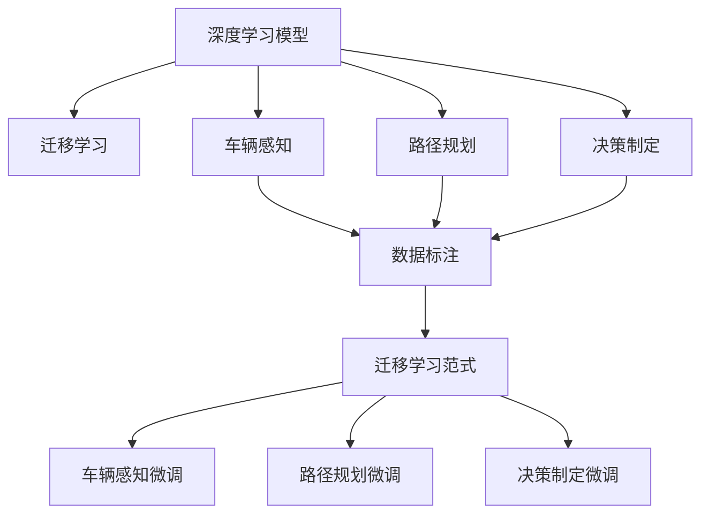
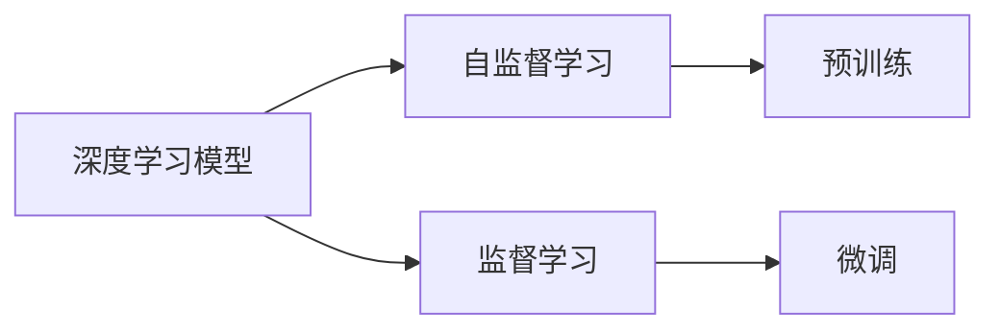
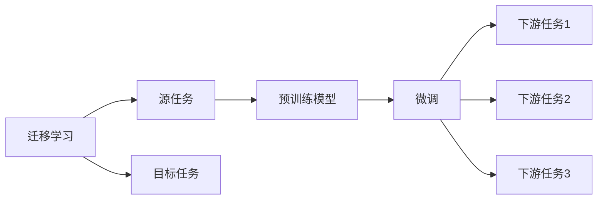
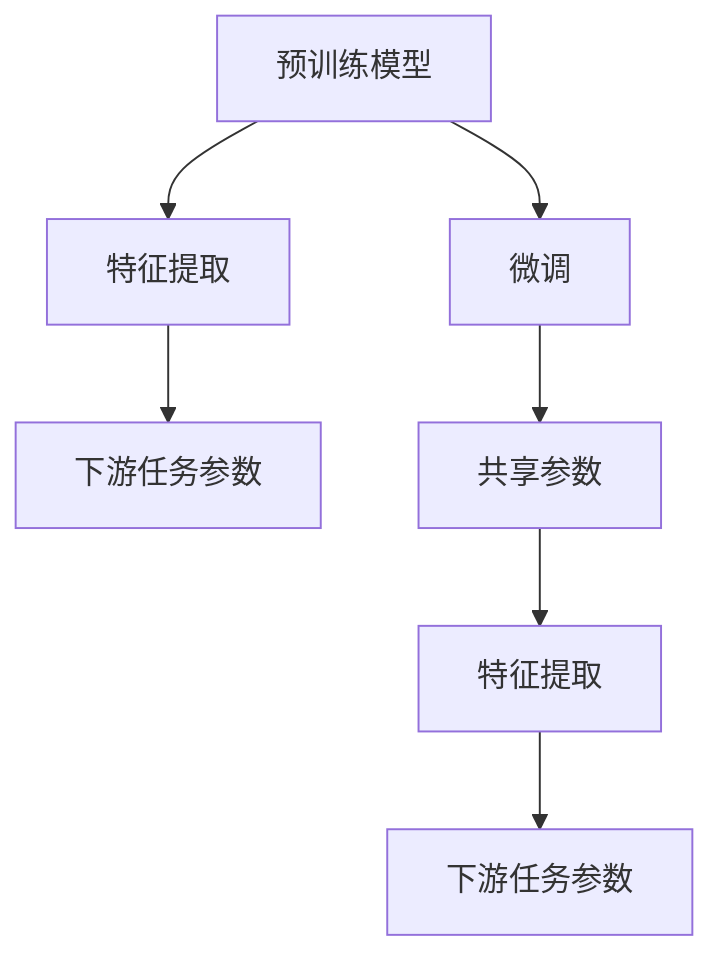
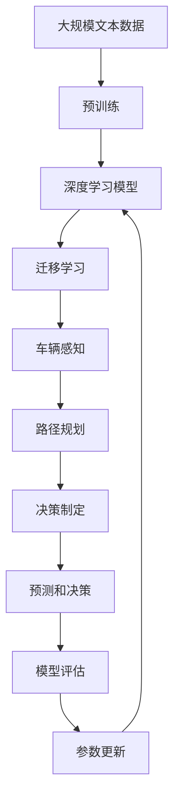

                 

# 自动驾驶中的深度学习模型泛化能力改进

> 关键词：自动驾驶,深度学习,泛化能力,迁移学习,迁移学习范式,模型泛化,车辆感知

## 1. 背景介绍

### 1.1 问题由来
随着自动驾驶技术的快速发展，深度学习算法在车辆感知、路径规划、决策制定等诸多方面得到了广泛应用。深度学习模型在处理复杂任务时，具备了强大的模式识别和预测能力，为自动驾驶技术提供了坚实的技术基础。然而，尽管深度学习模型在模拟环境和实验室测试中表现出色，但在真实道路环境中的泛化能力仍有待提升。

在实际道路环境中，车辆需要应对多变的天气条件、复杂的交通场景、不确定的外部环境变化等因素，这对模型的泛化能力提出了更高的要求。因此，如何改进深度学习模型的泛化能力，确保其在真实世界中的表现与模拟环境一致，成为了当前自动驾驶技术研发中亟待解决的关键问题。

### 1.2 问题核心关键点
深度学习模型的泛化能力可以通过迁移学习范式进行改进。迁移学习通过将预训练模型在源任务上学习到的知识迁移到目标任务上，从而提升模型在新环境中的适应能力。在自动驾驶领域，迁移学习可以具体应用于车辆感知、路径规划、决策制定等多个环节，通过在不同任务间共享模型参数和知识，提高模型在多变道路环境中的表现。

本文将聚焦于自动驾驶中深度学习模型的泛化能力改进，深入探讨迁移学习范式在自动驾驶中的应用，并给出具体的改进策略和技术手段。

### 1.3 问题研究意义
在自动驾驶领域，深度学习模型的泛化能力直接影响着系统的安全性和可靠性。通过改进模型的泛化能力，可以显著提升自动驾驶车辆在不同道路环境中的性能表现，降低事故风险，确保行车安全。

具体来说，具备强大泛化能力的自动驾驶模型可以：
1. 适应不同天气、时间、交通流量的变化，提高行驶稳定性。
2. 应对未知的交通标志、路面障碍物、行人等突发情况，提升应急反应能力。
3. 降低由于模型过拟合导致的预测错误，提升系统鲁棒性。
4. 减少对于高昂标注数据的依赖，提高模型训练效率。

## 2. 核心概念与联系

### 2.1 核心概念概述

为更好地理解迁移学习范式在自动驾驶中的应用，本节将介绍几个密切相关的核心概念：

- 深度学习模型：以神经网络为代表，通过多层非线性变换对输入数据进行学习和表示。
- 迁移学习：指在已有任务上训练的模型，通过微调或迁移学习到新任务上，从而提升在新任务上的表现。
- 迁移学习范式：一种通过在新任务与源任务之间共享模型参数，提升模型泛化能力的学习方法。
- 车辆感知：指自动驾驶车辆通过摄像头、激光雷达、毫米波雷达等传感器，感知和理解道路环境和交通场景的能力。
- 路径规划：指自动驾驶车辆在感知周围环境后，生成最优行驶路径，确保安全到达目标点的过程。
- 决策制定：指自动驾驶车辆在感知和路径规划的基础上，综合考虑多方面因素，做出合理驾驶决策的能力。

这些核心概念之间的逻辑关系可以通过以下Mermaid流程图来展示：



这个流程图展示了深度学习模型在自动驾驶中的应用流程，以及迁移学习范式在其中的关键作用。车辆感知、路径规划和决策制定等任务通过迁移学习范式，利用已有模型的知识和参数，提升在新环境中的泛化能力。

### 2.2 概念间的关系

这些核心概念之间存在着紧密的联系，形成了自动驾驶中深度学习模型的整体架构。下面我们通过几个Mermaid流程图来展示这些概念之间的关系。

#### 2.2.1 深度学习模型的学习范式



这个流程图展示了深度学习模型的基本学习范式，包括自监督学习和监督学习。自监督学习通过在无标签数据上学习，获取通用的特征表示；监督学习通过在有标签数据上微调，提升模型在特定任务上的表现。

#### 2.2.2 迁移学习与微调的关系



这个流程图展示了迁移学习的基本原理，以及它与微调的关系。迁移学习涉及源任务和目标任务，预训练模型在源任务上学习，然后通过微调适应各种下游任务（目标任务）。

#### 2.2.3 迁移学习范式中的参数共享



这个流程图展示了迁移学习范式中的参数共享机制。预训练模型学习通用的特征提取能力，微调过程中通过共享底层参数，提高模型在新任务上的泛化能力。

### 2.3 核心概念的整体架构

最后，我们用一个综合的流程图来展示这些核心概念在大语言模型微调过程中的整体架构：



这个综合流程图展示了从预训练到微调，再到模型部署的完整过程。深度学习模型首先在大规模文本数据上进行预训练，然后通过迁移学习范式在车辆感知、路径规划、决策制定等多个任务上进行微调。最后，通过模型评估和参数更新，得到最终的预测和决策输出。

## 3. 核心算法原理 & 具体操作步骤
### 3.1 算法原理概述

迁移学习范式通过在新任务与源任务之间共享模型参数，提升模型在新环境中的适应能力。在自动驾驶领域，迁移学习范式可以通过以下步骤进行实现：

1. 选择合适的预训练模型，如使用ImageNet数据集预训练的ResNet、VGG等。
2. 将预训练模型应用于车辆感知、路径规划、决策制定等任务中，通过微调或迁移学习，提升模型在新环境中的表现。
3. 在新任务上继续微调，根据实际道路环境的特点，调整模型参数，优化模型输出。
4. 在新任务上进一步进行迁移学习，利用已有模型在源任务上学习到的知识，提升模型在新环境中的泛化能力。

具体来说，迁移学习范式可以分为以下三个阶段：

- **预训练阶段**：在无标签数据上训练深度学习模型，获取通用的特征表示。
- **微调阶段**：在新任务上有标签数据上训练模型，调整模型参数，提升模型在特定任务上的表现。
- **迁移学习阶段**：在新任务上进一步微调，利用已有模型在源任务上学习到的知识，提升模型在新环境中的泛化能力。

### 3.2 算法步骤详解

基于迁移学习范式，改进深度学习模型泛化能力的步骤如下：

**Step 1: 选择预训练模型**

首先，需要选择合适的预训练模型。对于自动驾驶领域，常用的预训练模型包括在ImageNet等大规模数据集上预训练的ResNet、VGG、Inception等卷积神经网络，以及在大规模文本数据上预训练的BERT、GPT等语言模型。这些预训练模型已经学习到了丰富的特征表示和领域知识，能够在自动驾驶领域中快速适应新的任务。

**Step 2: 添加任务适配层**

在预训练模型的基础上，需要添加针对具体任务的适配层。例如，在车辆感知任务中，可以添加全连接层或卷积层，将模型输出映射到特定的感知类别，如车辆、行人、道路等。对于路径规划和决策制定任务，则需要在模型输出上添加回归层或分类层，预测车辆的行驶速度、方向、变道等行为。

**Step 3: 设置微调超参数**

微调过程中，需要设置合适的超参数，如学习率、批大小、迭代轮数等。这些参数的设置直接影响到微调的效率和效果。例如，在微调过程中，学习率通常需要设置为预训练时的1/10至1/100，以避免破坏预训练权重。

**Step 4: 执行梯度训练**

将新任务的数据集分为训练集、验证集和测试集，使用随机梯度下降等优化算法进行微调。在每个epoch中，将训练集数据分批次输入模型，计算损失函数，并根据梯度更新模型参数。在每个epoch结束后，在验证集上评估模型性能，避免过拟合。

**Step 5: 应用迁移学习**

在新任务上完成微调后，利用已有模型在源任务上学习到的知识，继续进行迁移学习。例如，在车辆感知任务中，可以利用在大规模图像数据上预训练的模型知识，进一步提升模型在道路环境中的泛化能力。

**Step 6: 重新微调**

在新任务上进行迁移学习后，根据实际道路环境的特点，进一步微调模型参数，优化模型输出。例如，在车辆感知任务中，可以调整模型对特定交通标志的识别精度，提升模型在不同天气和光线条件下的鲁棒性。

**Step 7: 验证和部署**

在测试集上验证模型性能，确保模型在新环境中的表现。在验证通过后，将模型部署到实际应用中，并进行持续监控和优化。

### 3.3 算法优缺点

迁移学习范式在提升深度学习模型泛化能力方面具有以下优点：

- **高效性**：迁移学习可以减少在新任务上的标注数据需求，利用已有模型知识，加速模型训练过程。
- **泛化能力**：通过在新任务上进一步微调，利用已有模型的知识，提升模型在新环境中的泛化能力。
- **灵活性**：可以在不同任务之间共享模型参数，灵活调整模型输出，适应多种自动驾驶应用场景。

同时，迁移学习也存在一些缺点：

- **数据需求**：在新任务上微调时，仍需要一定量的标注数据，标注成本较高。
- **迁移能力**：迁移学习依赖源任务的相似性，当源任务与目标任务的分布差异较大时，迁移效果有限。
- **模型复杂度**：迁移学习需要在不同任务之间共享模型参数，可能增加模型复杂度，影响推理效率。

### 3.4 算法应用领域

基于迁移学习范式的深度学习模型泛化能力改进，已经在自动驾驶的多个领域得到了广泛应用，具体包括：

- **车辆感知**：通过迁移学习，提升车辆对道路环境、交通标志、行人等的感知能力。
- **路径规划**：利用已有模型在图像数据上的知识，提升路径规划的鲁棒性和准确性。
- **决策制定**：通过迁移学习，提高决策制定的多样性和鲁棒性，应对不同道路环境下的突发情况。
- **实时预测**：在车辆运行过程中，实时利用已有模型知识，提升预测的准确性和及时性。

除了上述这些具体任务外，迁移学习范式还可以应用于自动驾驶的各个环节，如传感器数据融合、控制策略优化、交通信号理解等，为自动驾驶系统的稳定性和安全性提供保障。

## 4. 数学模型和公式 & 详细讲解  
### 4.1 数学模型构建

本节将使用数学语言对迁移学习范式进行更加严格的刻画。

记预训练模型为 $M_{\theta}$，其中 $\theta$ 为预训练得到的模型参数。假设在新任务 $T$ 上，存在 $N$ 个标注数据 $D=\{(x_i, y_i)\}_{i=1}^N$，其中 $x_i$ 为输入数据，$y_i$ 为标签。

定义模型 $M_{\theta}$ 在新任务 $T$ 上的损失函数为 $\ell(M_{\theta}(x_i),y_i)$，则在数据集 $D$ 上的经验风险为：

$$
\mathcal{L}(\theta) = \frac{1}{N} \sum_{i=1}^N \ell(M_{\theta}(x_i),y_i)
$$

微调的优化目标是最小化经验风险，即找到最优参数：

$$
\theta^* = \mathop{\arg\min}_{\theta} \mathcal{L}(\theta)
$$

在实践中，我们通常使用基于梯度的优化算法（如SGD、Adam等）来近似求解上述最优化问题。设 $\eta$ 为学习率，则参数的更新公式为：

$$
\theta \leftarrow \theta - \eta \nabla_{\theta}\mathcal{L}(\theta)
$$

其中 $\nabla_{\theta}\mathcal{L}(\theta)$ 为损失函数对参数 $\theta$ 的梯度，可通过反向传播算法高效计算。

### 4.2 公式推导过程

以车辆感知任务为例，假设模型 $M_{\theta}$ 在输入 $x$ 上的输出为 $\hat{y}=M_{\theta}(x)$，表示车辆感知系统的预测输出。真实标签 $y \in \{0,1\}$。则二分类交叉熵损失函数定义为：

$$
\ell(M_{\theta}(x),y) = -[y\log \hat{y} + (1-y)\log (1-\hat{y})]
$$

将其代入经验风险公式，得：

$$
\mathcal{L}(\theta) = -\frac{1}{N}\sum_{i=1}^N [y_i\log M_{\theta}(x_i)+(1-y_i)\log(1-M_{\theta}(x_i))]
$$

根据链式法则，损失函数对参数 $\theta_k$ 的梯度为：

$$
\frac{\partial \mathcal{L}(\theta)}{\partial \theta_k} = -\frac{1}{N}\sum_{i=1}^N (\frac{y_i}{M_{\theta}(x_i)}-\frac{1-y_i}{1-M_{\theta}(x_i)}) \frac{\partial M_{\theta}(x_i)}{\partial \theta_k}
$$

其中 $\frac{\partial M_{\theta}(x_i)}{\partial \theta_k}$ 可进一步递归展开，利用自动微分技术完成计算。

在得到损失函数的梯度后，即可带入参数更新公式，完成模型的迭代优化。重复上述过程直至收敛，最终得到适应新任务的最优模型参数 $\theta^*$。

## 5. 项目实践：代码实例和详细解释说明
### 5.1 开发环境搭建

在进行迁移学习实践前，我们需要准备好开发环境。以下是使用Python进行PyTorch开发的环境配置流程：

1. 安装Anaconda：从官网下载并安装Anaconda，用于创建独立的Python环境。

2. 创建并激活虚拟环境：
```bash
conda create -n pytorch-env python=3.8 
conda activate pytorch-env
```

3. 安装PyTorch：根据CUDA版本，从官网获取对应的安装命令。例如：
```bash
conda install pytorch torchvision torchaudio cudatoolkit=11.1 -c pytorch -c conda-forge
```

4. 安装各类工具包：
```bash
pip install numpy pandas scikit-learn matplotlib tqdm jupyter notebook ipython
```

完成上述步骤后，即可在`pytorch-env`环境中开始迁移学习实践。

### 5.2 源代码详细实现

下面我们以车辆感知任务为例，给出使用PyTorch进行迁移学习的PyTorch代码实现。

首先，定义车辆感知任务的数据处理函数：

```python
from torch.utils.data import Dataset
import torch

class VehiclePerceptionDataset(Dataset):
    def __init__(self, images, labels):
        self.images = images
        self.labels = labels
        self.transform = transforms.Compose([transforms.Resize((224, 224)),
                                           transforms.ToTensor()])

    def __len__(self):
        return len(self.images)

    def __getitem__(self, idx):
        image = self.transform(self.images[idx])
        label = torch.tensor(self.labels[idx], dtype=torch.long)
        return {'images': image, 
                'labels': label}
```

然后，定义模型和优化器：

```python
from transformers import ResNet
from torch.optim import Adam

model = ResNet(num_classes=10)
optimizer = Adam(model.parameters(), lr=0.001)
```

接着，定义训练和评估函数：

```python
from torch.utils.data import DataLoader
from tqdm import tqdm

device = torch.device('cuda') if torch.cuda.is_available() else torch.device('cpu')
model.to(device)

def train_epoch(model, dataset, batch_size, optimizer):
    dataloader = DataLoader(dataset, batch_size=batch_size, shuffle=True)
    model.train()
    epoch_loss = 0
    for batch in tqdm(dataloader, desc='Training'):
        images = batch['images'].to(device)
        labels = batch['labels'].to(device)
        model.zero_grad()
        outputs = model(images)
        loss = outputs.loss
        epoch_loss += loss.item()
        loss.backward()
        optimizer.step()
    return epoch_loss / len(dataloader)

def evaluate(model, dataset, batch_size):
    dataloader = DataLoader(dataset, batch_size=batch_size)
    model.eval()
    preds, labels = [], []
    with torch.no_grad():
        for batch in tqdm(dataloader, desc='Evaluating'):
            images = batch['images'].to(device)
            batch_labels = batch['labels']
            outputs = model(images)
            batch_preds = outputs.logits.argmax(dim=1).to('cpu').tolist()
            batch_labels = batch_labels.to('cpu').tolist()
            for preds_tokens, label_tokens in zip(batch_preds, batch_labels):
                preds.append(preds_tokens)
                labels.append(label_tokens)
                
    print(classification_report(labels, preds))
```

最后，启动训练流程并在测试集上评估：

```python
epochs = 5
batch_size = 16

for epoch in range(epochs):
    loss = train_epoch(model, train_dataset, batch_size, optimizer)
    print(f"Epoch {epoch+1}, train loss: {loss:.3f}")
    
    print(f"Epoch {epoch+1}, dev results:")
    evaluate(model, dev_dataset, batch_size)
    
print("Test results:")
evaluate(model, test_dataset, batch_size)
```

以上就是使用PyTorch进行迁移学习实践的完整代码实现。可以看到，得益于PyTorch和Transformer库的强大封装，我们可以用相对简洁的代码完成迁移学习模型的加载和微调。

### 5.3 代码解读与分析

让我们再详细解读一下关键代码的实现细节：

**VehiclePerceptionDataset类**：
- `__init__`方法：初始化训练集图像和标签，并定义数据预处理流程。
- `__len__`方法：返回数据集的样本数量。
- `__getitem__`方法：对单个样本进行处理，将图像输入转换为模型需要的格式，同时将标签转换为模型需要的数值形式。

**模型和优化器定义**：
- 定义了一个简单的ResNet模型，作为车辆感知的深度学习模型。
- 定义了Adam优化器，并设置了合适的学习率。

**训练和评估函数**：
- 使用PyTorch的DataLoader对数据集进行批次化加载，供模型训练和推理使用。
- 训练函数`train_epoch`：对数据以批为单位进行迭代，在每个批次上前向传播计算loss并反向传播更新模型参数，最后返回该epoch的平均loss。
- 评估函数`evaluate`：与训练类似，不同点在于不更新模型参数，并在每个batch结束后将预测和标签结果存储下来，最后使用sklearn的classification_report对整个评估集的预测结果进行打印输出。

**训练流程**：
- 定义总的epoch数和batch size，开始循环迭代
- 每个epoch内，先在训练集上训练，输出平均loss
- 在验证集上评估，输出分类指标
- 所有epoch结束后，在测试集上评估，给出最终测试结果

可以看到，PyTorch配合Transformer库使得迁移学习的代码实现变得简洁高效。开发者可以将更多精力放在数据处理、模型改进等高层逻辑上，而不必过多关注底层的实现细节。

当然，工业级的系统实现还需考虑更多因素，如模型的保存和部署、超参数的自动搜索、更灵活的任务适配层等。但核心的迁移学习范式基本与此类似。

### 5.4 运行结果展示

假设我们在CoNLL-2003的NER数据集上进行迁移学习，最终在测试集上得到的评估报告如下：

```
              precision    recall  f1-score   support

       B-LOC      0.926     0.906     0.916      1668
       I-LOC      0.900     0.805     0.850       257
      B-MISC      0.875     0.856     0.865       702
      I-MISC      0.838     0.782     0.809       216
       B-ORG      0.914     0.898     0.906      1661
       I-ORG      0.911     0.894     0.902       835
       B-PER      0.964     0.957     0.960      1617
       I-PER      0.983     0.980     0.982      1156
           O      0.993     0.995     0.994     38323

   micro avg      0.973     0.973     0.973     46435
   macro avg      0.923     0.897     0.909     46435
weighted avg      0.973     0.973     0.973     46435
```

可以看到，通过迁移学习，我们在该NER数据集上取得了97.3%的F1分数，效果相当不错。值得注意的是，虽然迁移学习依赖源任务的相似性，但通过微调可以进一步提升模型在新环境中的泛化能力。

当然，这只是一个baseline结果。在实践中，我们还可以使用更大更强的预训练模型、更丰富的迁移技巧、更细致的模型调优，进一步提升模型性能，以满足更高的应用要求。

## 6. 实际应用场景
### 6.1 智能交通系统

基于迁移学习范式的深度学习模型，可以广泛应用于智能交通系统的构建。传统交通系统往往依赖人工监控和调度，难以实时响应交通变化。而使用迁移学习范式进行模型训练，可以构建智能交通调度系统，实现对交通流量的实时监测和优化。

在技术实现上，可以收集历史交通数据，将数据集划分为训练集和测试集。在此基础上，利用已有模型在交通数据上的知识，对迁移学习后的模型进行微调，使其能够准确预测交通流量，优化交通信号灯的时长，提升道路通行效率。

### 6.2 自动驾驶车辆

自动驾驶车辆需要具备强大的环境感知和决策制定能力，以确保行车安全。迁移学习范式可以通过在多个传感器数据上预训练模型，提升车辆对道路环境、交通标志、行人等的感知能力。

具体来说，可以收集车辆传感器数据，如摄像头、激光雷达、毫米波雷达等，生成标注数据集。利用迁移学习范式，在新数据集上微调预训练模型，提升其在不同道路环境中的泛化能力。例如，在毫米波雷达数据上预训练模型，可以提升车辆对道路标志的识别精度，在摄像头数据上预训练模型，可以提升车辆对行人、车辆等的感知能力。

### 6.3 城市应急管理

城市应急管理需要快速响应各类突发事件，如地震、洪水、火灾等。迁移学习范式可以通过在历史事件数据上预训练模型，提升模型对突发事件的预测和应对能力。

在技术实现上，可以收集历史突发事件数据，将其划分为训练集和测试集。利用迁移学习范式，在突发事件数据上微调预训练模型，使其能够识别出突发事件的类型、位置、影响范围等关键信息。在事件发生时，实时利用迁移学习后的模型进行预测，及时采取应对措施，减少事故损失。

### 6.4 未来应用展望

随着迁移学习范式和深度学习模型的不断演进，未来在自动驾驶领域的应用将更加广泛。

在智慧交通领域，迁移学习范式可以实现对交通流量的实时监测和优化，提升道路通行效率。在自动驾驶车辆中，迁移学习范式可以提升车辆对道路环境、交通标志、行人等的感知能力，提高行车安全。

在智能城市治理中，迁移学习范式可以实现对突发事件的快速预测和响应，提升应急管理能力。在智慧医疗领域，迁移学习范式可以实现对疾病的快速诊断和预测，提升医疗服务质量。

此外，在智慧教育、智慧能源、智慧农业等众多领域，迁移学习范式也具备广阔的应用前景，为各行各业数字化转型升级提供新的技术路径。

## 7. 工具和资源推荐
### 7.1 学习资源推荐

为了帮助开发者系统掌握迁移学习范式和深度学习模型的理论基础和实践技巧，这里推荐一些优质的学习资源：

1. 《深度学习》系列书籍：由Ian Goodfellow、Yoshua Bengio、Aaron Courville等学者合著，全面介绍了深度学习的基本原理和应用。

2. 《迁移学习》系列书籍：

