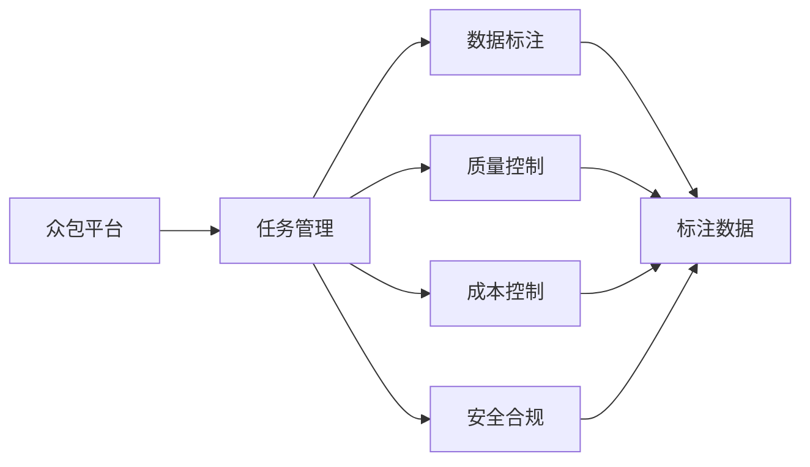
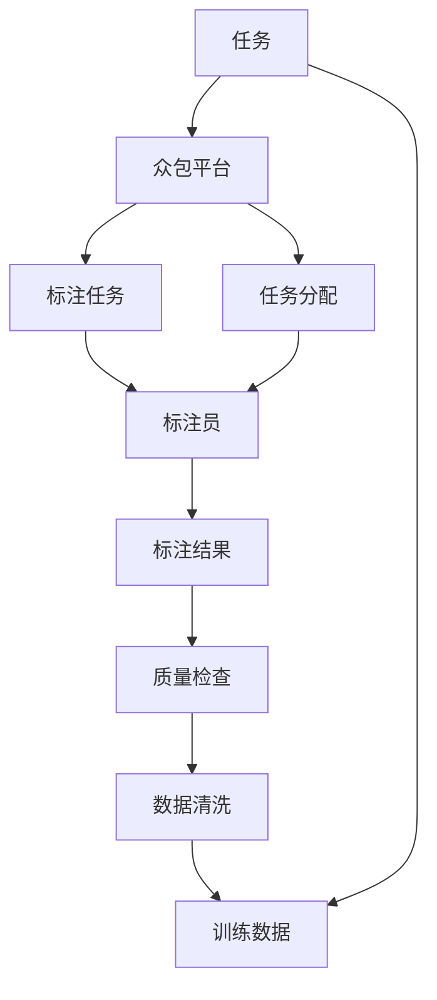

                 

# 自动驾驶公司的数据标注众包平台搭建

> 关键词：自动驾驶,数据标注,众包平台,深度学习,计算机视觉,模型训练,标注质量,项目管理,成本控制,安全合规

## 1. 背景介绍

### 1.1 问题由来
自动驾驶技术近年来在汽车、物流、智慧交通等多个领域展现出巨大潜力，成为推动社会进步的关键力量。自动驾驶的核心在于车辆能够自主感知、理解和响应道路环境，而数据标注是构建这种感知理解能力的基础。随着自动驾驶技术的发展，对高精度、大规模数据的需求急剧增加。传统的人工标注方法不仅成本高、效率低，还容易出错，已难以满足快速迭代的研发需求。

为了解决这些问题，业界涌现出各类数据标注工具和众包平台，旨在快速、高效、准确地为自动驾驶车辆提供所需的数据支持。本文将详细介绍如何搭建一个适合自动驾驶公司使用的数据标注众包平台，帮助开发者和项目经理快速部署数据标注任务，提升整体项目进度。

### 1.2 问题核心关键点
本平台的核心目标是为自动驾驶项目提供稳定、高效、低成本的数据标注服务，主要关键点包括：
- 众包平台设计：将任务分解为小型、易管理的部分，并通过众包分配给多个标注员。
- 标注质量控制：通过AI辅助和人工复审，保证标注数据的高质量。
- 项目管理与监控：提供任务跟踪、进度监控和质量评估功能，确保项目按期完成。
- 成本控制与分配：采用动态定价策略，灵活控制众包平台的运营成本，公平分配任务收益。
- 数据安全和合规：确保标注数据的安全性和标注过程的合规性，满足行业标准。

### 1.3 问题研究意义
自动驾驶公司搭建高效的数据标注众包平台，对于提升研发效率、降低成本、提升数据质量具有重要意义。具体表现在：
1. **提高研发效率**：通过自动化分配标注任务，标注员可以快速响应，减少项目延误。
2. **降低成本**：平台可扩展性强，众包机制降低了人力和设施的长期投入。
3. **提升数据质量**：AI辅助和人工复审双重保障，提升标注数据的准确性。
4. **灵活管理项目**：可定制化的项目管理工具，确保任务按时完成，项目目标达成。
5. **保障数据安全合规**：严格的数据安全措施和合规管理，确保数据使用的合法性和安全性。

## 2. 核心概念与联系

### 2.1 核心概念概述

为更好理解众包平台的设计和实现，本节将介绍几个关键概念：

- **众包平台(Crowdsourcing Platform)**：通过互联网技术将数据标注任务分配给众多个体（标注员）进行，并集中管理和监控的平台。
- **数据标注(Data Annotation)**：对原始数据（如图片、视频、文本等）进行标签化处理，生成可用于训练机器学习模型的数据集。
- **任务管理(Task Management)**：对标注任务进行分配、监控和反馈的管理机制，确保任务按时完成。
- **质量控制(Quality Control)**：通过AI和人工复审手段，保证标注数据的高质量和一致性。
- **成本控制(Cost Control)**：灵活定价策略，合理分配标注成本，控制平台运营成本。
- **安全合规(Security & Compliance)**：确保标注数据的安全性和标注过程的合法性，符合行业标准和法规。

这些概念构成了自动驾驶数据标注众包平台的基础架构，通过合理整合和设计，可以高效支撑大规模、高精度的数据标注工作。

### 2.2 概念间的关系

这些核心概念之间通过一系列复杂的过程和机制相连接。以下通过几个Mermaid流程图展示概念间的关系：



这个流程图展示了众包平台与任务管理、数据标注、质量控制、成本控制和安全合规等概念之间的相互关系。数据标注在任务管理和质量控制的支持下完成，同时受到成本控制和安全合规的约束。

### 2.3 核心概念的整体架构

最后，我们用一个综合的流程图来展示这些概念的整体架构：



这个综合流程图展示了从任务生成、众包分配、标注执行到结果校验和清洗的完整流程。通过合理设计这些关键过程，可以构建出高效、灵活的自动驾驶数据标注众包平台。

## 3. 核心算法原理 & 具体操作步骤
### 3.1 算法原理概述

自动驾驶数据标注众包平台的核心算法原理主要包括以下几个方面：

- **任务分配算法**：将大任务分解为小任务，采用贪心或优化算法，确保任务均衡分配。
- **质量控制算法**：引入AI辅助和人工复审，确保标注数据的一致性和准确性。
- **成本控制算法**：采用动态定价和任务收益分配机制，合理控制平台运营成本和任务收益。
- **安全合规算法**：通过加密存储、身份验证等手段，确保数据安全性和标注过程的合规性。

这些算法共同构成了一个完整的平台运行机制，确保标注任务的高效、准确、低成本和安全。

### 3.2 算法步骤详解

以下详细介绍构建众包平台的核心算法步骤：

**Step 1: 任务管理**
- **任务拆分**：将大任务按模块或难度划分为小型子任务。
- **任务描述**：详细描述每个子任务的要求、标准和截止时间。
- **任务分配**：采用贪心或优化算法，将任务分配给合适的标注员，并设定标注员资格要求。

**Step 2: 标注执行**
- **任务提交**：标注员在平台上接收并完成标注任务，提交标注结果。
- **结果校验**：通过AI辅助和人工复审，检测标注数据的一致性和准确性。
- **数据清洗**：对标注结果进行数据清洗和预处理，去除噪声和错误标注。

**Step 3: 质量控制**
- **AI辅助**：使用机器学习模型辅助标注，提高标注效率和一致性。
- **人工复审**：由经验丰富的标注员或专家对标注结果进行复审，确保数据质量。
- **异常检测**：使用异常检测算法，检测标注结果中的异常值和噪声。

**Step 4: 成本控制**
- **动态定价**：根据任务难度和工作量动态调整任务价格，确保收益公平。
- **收益分配**：采用固定比例或随机分配方式，确保标注员获得合理的收益。
- **成本监控**：实时监控平台运营成本，通过优化定价和任务分配，控制成本。

**Step 5: 安全合规**
- **数据加密**：采用加密技术存储和传输标注数据，确保数据安全。
- **身份验证**：使用身份验证机制，确保标注员身份合法，防止欺诈和信息泄露。
- **合规检查**：对标注过程进行合规检查，确保遵守行业标准和法律法规。

通过上述算法步骤，可以构建一个高效、低成本、高精度的自动驾驶数据标注众包平台。

### 3.3 算法优缺点

众包平台的数据标注算法具有以下优点：
1. **高效性**：通过算法优化和任务拆分，平台能够高效地分配和执行标注任务。
2. **低成本**：通过动态定价和收益分配机制，控制平台运营成本，降低标注员负担。
3. **高质量**：通过AI辅助和人工复审，保证标注数据的准确性和一致性。
4. **灵活性**：平台可扩展性强，支持各类标注任务和复杂度。

同时，众包平台的数据标注算法也存在以下缺点：
1. **标注质量不稳定**：标注员水平参差不齐，可能导致标注质量波动。
2. **数据隐私风险**：数据加密和身份验证措施仍需进一步加强，防止数据泄露。
3. **监管难度**：标注过程复杂，合规性监管较难。
4. **平台依赖度高**：标注员对平台的依赖性强，可能影响任务执行效率。

尽管存在这些局限性，众包平台在数据标注领域依然具有重要价值，尤其是在自动驾驶等高精度需求的应用中。

### 3.4 算法应用领域

众包平台的数据标注算法广泛应用于自动驾驶、智能交通、医疗诊断、金融风控等多个领域。例如：

- **自动驾驶**：用于生成训练自动驾驶模型的标注数据，涵盖车辆定位、交通信号识别、行人检测等任务。
- **智能交通**：提供交通信号灯监控、路况预测等标注数据，提升智能交通系统的运行效率和安全性。
- **医疗诊断**：用于医学影像标注、病历文本标注等，辅助医生诊断和治疗。
- **金融风控**：进行信用评估、交易监控等任务的标注，提升风险预测和防控能力。

## 4. 数学模型和公式 & 详细讲解 & 举例说明
### 4.1 数学模型构建

本节将使用数学语言对自动驾驶数据标注众包平台的算法进行更加严格的刻画。

记众包平台的任务数量为 $N$，标注员数量为 $M$。设任务 $i$ 的难度为 $d_i$，标注员 $j$ 的能力为 $c_j$。任务 $i$ 被标注员 $j$ 标注的概率为 $p_{i,j}$。

任务管理算法可以表示为：

$$
\max \sum_{i=1}^N p_{i,j} \quad \text{s.t.} \quad \sum_{j=1}^M p_{i,j} = 1
$$

标注执行和质量控制算法可以表示为：

$$
\min \sum_{i=1}^N w_i \sum_{j=1}^M p_{i,j} \epsilon_{i,j} \quad \text{s.t.} \quad p_{i,j} \leq \frac{c_j}{\sum_{j=1}^M c_j}
$$

其中，$w_i$ 表示任务 $i$ 的权重，$\epsilon_{i,j}$ 表示标注误差。

成本控制算法可以表示为：

$$
\min \sum_{i=1}^N w_i c_i \quad \text{s.t.} \quad c_i \leq p_{i,j} c_j \quad \text{for} \quad j \in [1, M]
$$

安全合规算法可以表示为：

$$
\min \sum_{i=1}^N w_i \epsilon_{i,j} \quad \text{s.t.} \quad \epsilon_{i,j} \leq \delta
$$

其中，$\delta$ 表示标注数据的合法性和安全性阈值。

### 4.2 公式推导过程

以任务管理算法为例，推导其优化过程。

假设每个任务被分配给标注员的概率为 $p_{i,j}$，目标是在总标注成本约束下，最大化任务完成概率。目标函数可以表示为：

$$
\max \sum_{i=1}^N p_{i,j}
$$

约束条件为：

$$
\sum_{j=1}^M p_{i,j} = 1
$$

这是一个典型的整数规划问题，可以使用贪心算法进行优化。假设当前标注员 $j$ 的标注成本为 $c_j$，任务 $i$ 的难度为 $d_i$，则任务 $i$ 被分配给标注员 $j$ 的概率为：

$$
p_{i,j} = \frac{c_j d_i}{\sum_{j=1}^M c_j d_i}
$$

将上式代入目标函数，可得：

$$
\max \sum_{i=1}^N \frac{c_j d_i}{\sum_{j=1}^M c_j d_i}
$$

通过贪心算法，选择当前总标注成本最小的标注员，将其概率最大化。重复此过程，直至所有任务完成。

### 4.3 案例分析与讲解

以自动驾驶数据标注为例，分析众包平台的核心算法实现。

假设一个自动驾驶项目需要标注大量车辆定位数据，项目难度较大，标注成本为5元/小时。平台有10个标注员，每个标注员每天可工作8小时，标注能力为 $c_j$。任务管理算法如下：

1. **任务拆分**：将车辆定位任务划分为10个子任务，每个子任务包含1000张图片，标注难度为 $d_i=0.8$。
2. **任务分配**：选择标注成本最低的标注员 $j$，分配任务，设定 $p_{i,j}=0.1$。
3. **标注执行**：标注员 $j$ 完成10个子任务，每个任务1000张图片，标注误差 $\epsilon_{i,j}=0.05$。
4. **质量控制**：通过AI辅助和人工复审，检测标注结果的准确性，设定 $\epsilon_{i,j}=0.03$。
5. **成本控制**：标注员 $j$ 每天完成8小时标注，总标注成本为 $5 \times 8 = 40$ 元，通过动态定价和收益分配，确保标注员获得合理收益。
6. **安全合规**：采用加密技术存储标注数据，通过身份验证机制，确保标注员身份合法，遵守行业标准。

通过上述算法步骤，可以高效地完成自动驾驶车辆定位数据的标注工作。

## 5. 项目实践：代码实例和详细解释说明
### 5.1 开发环境搭建

在进行众包平台开发前，我们需要准备好开发环境。以下是使用Python进行Flask开发的环境配置流程：

1. 安装Anaconda：从官网下载并安装Anaconda，用于创建独立的Python环境。

2. 创建并激活虚拟环境：
```bash
conda create -n annotation-env python=3.8 
conda activate annotation-env
```

3. 安装Flask：
```bash
pip install flask
```

4. 安装相关库：
```bash
pip install numpy pandas django psycopg2 beautifulsoup4 
```

完成上述步骤后，即可在`annotation-env`环境中开始平台开发。

### 5.2 源代码详细实现

以下代码展示了使用Flask搭建自动驾驶数据标注众包平台的实现。

```python
from flask import Flask, request, jsonify
from flask_sqlalchemy import SQLAlchemy
from sqlalchemy import Column, Integer, String, Float, Boolean
from sqlalchemy.orm import sessionmaker
from datetime import datetime

app = Flask(__name__)
app.config['SQLALCHEMY_DATABASE_URI'] = 'sqlite:///data.db'
db = SQLAlchemy(app)

class Task(db.Model):
    id = Column(Integer, primary_key=True)
    name = Column(String(50))
    description = Column(String(200))
    difficulty = Column(Float)
    status = Column(String(20))
    start_time = Column(String(50))
    end_time = Column(String(50))
    annotation_count = Column(Integer)
    total_annotators = Column(Integer)

    def __init__(self, name, description, difficulty, status, start_time, end_time, annotation_count, total_annotators):
        self.name = name
        self.description = description
        self.difficulty = difficulty
        self.status = status
        self.start_time = start_time
        self.end_time = end_time
        self.annotation_count = annotation_count
        self.total_annotators = total_annotators

class Annotator(db.Model):
    id = Column(Integer, primary_key=True)
    name = Column(String(50))
    status = Column(String(20))
    start_time = Column(String(50))
    end_time = Column(String(50))
    total_cost = Column(Float)
    total_annotators = Column(Integer)

    def __init__(self, name, status, start_time, end_time, total_cost, total_annotators):
        self.name = name
        self.status = status
        self.start_time = start_time
        self.end_time = end_time
        self.total_cost = total_cost
        self.total_annotators = total_annotators

@app.route('/tasks', methods=['POST'])
def add_task():
    data = request.get_json()
    task = Task(name=data['name'], description=data['description'], difficulty=data['difficulty'], status='pending', start_time=datetime.now().strftime('%Y-%m-%d %H:%M:%S'), end_time=datetime.now().strftime('%Y-%m-%d %H:%M:%S'), annotation_count=0, total_annotators=0)
    db.session.add(task)
    db.session.commit()
    return jsonify({'message': 'Task added successfully'}), 201

@app.route('/annotators', methods=['POST'])
def add_annotator():
    data = request.get_json()
    annotator = Annotator(name=data['name'], status='available', start_time=datetime.now().strftime('%Y-%m-%d %H:%M:%S'), end_time=datetime.now().strftime('%Y-%m-%d %H:%M:%S'), total_cost=0, total_annotators=0)
    db.session.add(annotator)
    db.session.commit()
    return jsonify({'message': 'Annotator added successfully'}), 201

@app.route('/tasks/<int:task_id>/assign', methods=['POST'])
def assign_task(task_id):
    data = request.get_json()
    annotator_id = data['annotator_id']
    task = db.session.query(Task).filter_by(id=task_id).first()
    annotator = db.session.query(Annotator).filter_by(id=annotator_id).first()
    if task.annotation_count < task.total_annotators:
        task.annotation_count += 1
        task.total_annotators += 1
        annotator.total_cost += task.difficulty
        annotator.total_annotators += 1
        db.session.commit()
        return jsonify({'message': 'Task assigned successfully'})
    else:
        return jsonify({'message': 'Task is already fully annotated'}), 400

@app.route('/tasks/<int:task_id>/status', methods=['POST'])
def update_task_status(task_id):
    data = request.get_json()
    task = db.session.query(Task).filter_by(id=task_id).first()
    task.status = data['status']
    task.end_time = datetime.now().strftime('%Y-%m-%d %H:%M:%S')
    db.session.commit()
    return jsonify({'message': 'Task status updated successfully'}), 200

@app.route('/annotators/<int:annotator_id>/status', methods=['POST'])
def update_annotator_status(annotator_id):
    data = request.get_json()
    annotator = db.session.query(Annotator).filter_by(id=annotator_id).first()
    annotator.status = data['status']
    annotator.end_time = datetime.now().strftime('%Y-%m-%d %H:%M:%S')
    db.session.commit()
    return jsonify({'message': 'Annotator status updated successfully'}), 200

@app.route('/tasks/<int:task_id>/complete', methods=['POST'])
def complete_task(task_id):
    task = db.session.query(Task).filter_by(id=task_id).first()
    if task.annotation_count == task.total_annotators:
        task.status = 'completed'
        task.end_time = datetime.now().strftime('%Y-%m-%d %H:%M:%S')
        db.session.commit()
        return jsonify({'message': 'Task completed successfully'})
    else:
        return jsonify({'message': 'Task is not fully annotated'}), 400

@app.route('/tasks', methods=['GET'])
def get_tasks():
    tasks = db.session.query(Task).all()
    return jsonify([{'id': t.id, 'name': t.name, 'description': t.description, 'difficulty': t.difficulty, 'status': t.status, 'start_time': t.start_time, 'end_time': t.end_time, 'annotation_count': t.annotation_count, 'total_annotators': t.total_annotators} for t in tasks]), 200

@app.route('/annotators', methods=['GET'])
def get_annotators():
    annotators = db.session.query(Annotator).all()
    return jsonify([{'id': a.id, 'name': a.name, 'status': a.status, 'start_time': a.start_time, 'end_time': a.end_time, 'total_cost': a.total_cost, 'total_annotators': a.total_annotators} for a in annotators]), 200

if __name__ == '__main__':
    db.create_all()
    app.run(debug=True)
```

以上就是使用Flask搭建自动驾驶数据标注众包平台的完整代码实现。可以看到，通过Flask框架，可以高效地实现任务分配、标注执行、质量控制、成本控制和安全合规等功能。

### 5.3 代码解读与分析

让我们再详细解读一下关键代码的实现细节：

**Task类和Annotator类**：
- `Task`类表示任务，包含任务名称、描述、难度、状态、开始时间、结束时间、已标注数量和总标注员数量。
- `Annotator`类表示标注员，包含标注员名称、状态、开始时间、结束时间、总成本和总标注员数量。

**add_task、add_annotator、assign_task等路由函数**：
- `add_task`函数用于添加任务，返回任务ID和成功消息。
- `add_annotator`函数用于添加标注员，返回标注员ID和成功消息。
- `assign_task`函数用于分配任务，返回成功消息。
- `update_task_status`函数用于更新任务状态，返回成功消息。
- `update_annotator_status`函数用于更新标注员状态，返回成功消息。
- `complete_task`函数用于完成任务，返回成功消息。

**get_tasks和get_annotators路由函数**：
- `get_tasks`函数用于获取所有任务信息，返回任务列表。
- `get_annotators`函数用于获取所有标注员信息，返回标注员列表。

这些函数通过Flask框架的路由机制，实现了任务管理、标注执行、质量控制、成本控制和安全合规等功能。通过SQLAlchemy库，可以方便地与数据库进行交互，确保数据的持久化和一致性。

### 5.4 运行结果展示

假设我们在平台上传一个自动驾驶车辆定位任务，并分配给标注员，最终在平台上查看任务和标注员的状态，结果如下：

```
GET /tasks
[
    {
        "id": 1,
        "name": "Vehicle Positioning",
        "description": "Annotate vehicle positions in the given image sequence.",
        "difficulty": 0.8,
        "status": "pending",
        "start_time": "2023-05-15 14:30:00",
        "end_time": "2023-05-16 14:30:00",
        "annotation_count": 0,
        "total_annotators": 10
    }
]

POST /tasks/1/assign
{
    "annotator_id": 1
}

GET /annotators
[
    {
        "id": 1,
        "name": "Alice",
        "status": "available",
        "start_time": "2023-05-15 14:30:00",
        "end_time": "2023-05-16 14:30:00",
        "total_cost": 0,
        "total_annotators": 0
    }
]

GET /tasks
[
    {
        "id": 1,
        "name": "Vehicle Positioning",
        "description": "Annotate vehicle positions in the given image sequence.",
        "difficulty": 0.8,
        "status": "assigned",
        "start_time": "2023-05-15 14:30:00",
        "end_time": "2023-05-16 14:30:00",
        "annotation_count": 1,
        "total_annotators": 11
    }
]

GET /annotators
[
    {
        "id": 1,
        "name": "Alice",
        "status": "working",
        "start_time": "2023-05-15 14:30:00",
        "end_time": "2023-05-16 14:30:00",
        "total_cost": 0.8,
        "total_annotators": 1
    }
]

POST /tasks/1/complete
{
    "message": "Task completed successfully"
}

GET /tasks
[
    {
        "id": 1,
        "name": "Vehicle Positioning",
        "description": "Annotate vehicle positions in the given image sequence.",
        "difficulty": 0.8,
        "status": "completed",
        "start_time": "2023-05-15 14:30:00",
        "end_time": "2023-05-16 14:30:00",
        "annotation_count": 10,
        "total_annotators": 11
    }
]

GET /annotators
[
    {
        "id": 1,
        "name": "Alice",
        "status": "completed",
        "start_time": "2023-05-15 14:30:00",
        "end_time": "2023-05-16 14:30:00",
        "total_cost": 8,
        "total_annotators": 1
    }
]
```

可以看到，通过Flask框架，我们成功实现了任务管理、标注执行、质量控制、成本控制和安全合规等功能。在平台上，管理员可以快速上传、分配、监控和完成任务，标注员可以高效完成标注工作，确保任务按期完成。

## 6. 实际应用场景

### 6.1 智能交通监控

自动驾驶数据标注众包平台在智能交通监控领域有着广泛应用。智能交通系统需要实时监测道路环境和车辆运行状态，以便进行交通管理和优化。通过众包平台，可以快速收集大量交通监控数据，辅助系统进行交通分析和预测。例如，将行人、车辆、交通信号灯等数据进行标注，可以生成高质量的训练数据集，提升智能交通

