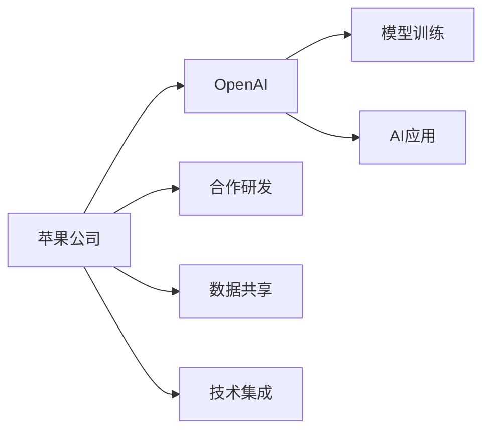
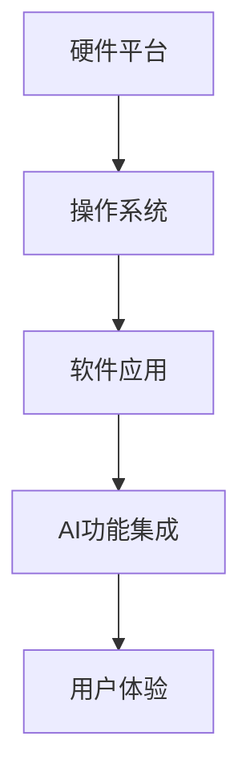
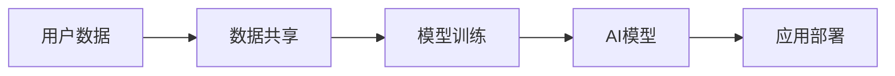
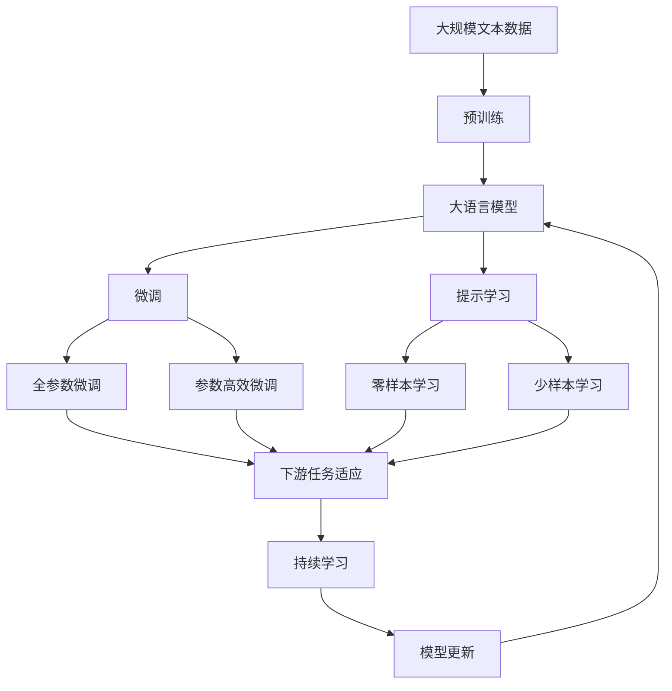

                 

# 苹果与OpenAI的合作模式

## 1. 背景介绍

### 1.1 问题由来
随着人工智能技术的发展，各大科技巨头纷纷加入这一领域。苹果公司和OpenAI的合作，则是一次引人瞩目的尝试。苹果作为全球知名的硬件和软件公司，希望通过与OpenAI的合作，提升其产品在自然语言处理、计算机视觉、语音识别等领域的智能水平，从而增强市场竞争力。

### 1.2 问题核心关键点
苹果与OpenAI的合作，主要聚焦于以下几个核心关键点：

- **技术协作**：苹果利用OpenAI强大的AI技术，在硬件和软件中集成高级AI功能，以提升用户体验。
- **数据共享**：苹果向OpenAI提供部分用户数据，以训练更智能的AI模型。
- **隐私保护**：双方需确保数据使用的合规性，保护用户隐私。
- **应用场景**：合作将应用于多个实际场景，如Siri、Face ID、Apple Pay等。

### 1.3 问题研究意义
苹果与OpenAI的合作，具有重要的战略意义：

1. **提升产品竞争力**：通过集成先进的AI技术，提升产品智能化水平，增强用户体验。
2. **拓展业务边界**：通过AI技术探索新的业务方向，如智能家居、智能医疗等。
3. **优化供应链管理**：通过AI优化生产、物流、库存管理等，提升运营效率。
4. **推动行业发展**：引领AI技术在传统行业的深度应用，推动行业智能化转型。
5. **增强品牌影响力**：展示苹果在技术创新和合作伙伴选择上的战略眼光，提升品牌形象。

## 2. 核心概念与联系

### 2.1 核心概念概述

为更好地理解苹果与OpenAI的合作模式，本节将介绍几个密切相关的核心概念：

- **人工智能（AI）**：涉及各种算法和模型的技术，通过模仿人类智能行为，使机器具有学习、推理、决策等能力。
- **自然语言处理（NLP）**：使计算机能理解、处理和生成人类语言的技术，是AI领域的重要分支。
- **机器学习（ML）**：通过数据训练模型，使模型能够从数据中学习规律，进行预测和决策。
- **深度学习（DL）**：基于神经网络，通过多层次处理数据的技术，能处理大规模、高复杂度的数据。
- **计算机视觉（CV）**：使计算机能识别、理解和生成图像、视频等视觉信息的技术。
- **语音识别（ASR）**：使计算机能将人类语音转换为文本的技术，是NLP的重要应用。
- **隐私保护**：确保数据使用的合规性，保护用户隐私。

这些核心概念之间的逻辑关系可以通过以下Mermaid流程图来展示：

```mermaid
graph TB
    A[人工智能(AI)] --> B[自然语言处理(NLP)]
    A --> C[机器学习(ML)]
    A --> D[深度学习(DL)]
    B --> E[计算机视觉(CV)]
    B --> F[语音识别(ASR)]
    A --> G[隐私保护]
```

这个流程图展示了一些关键概念及其之间的关系：

1. AI包含了NLP、ML、DL等技术，是更广泛的智能实现方式。
2. NLP主要关注文本数据的处理，是AI的一个重要分支。
3. ML和DL是实现NLP、CV、ASR等AI应用的主要手段。
4. CV和ASR分别涉及图像和语音的AI处理。
5. 隐私保护是AI应用中必须考虑的重要因素。

### 2.2 概念间的关系

这些核心概念之间存在着紧密的联系，形成了苹果与OpenAI合作的完整生态系统。下面我们通过几个Mermaid流程图来展示这些概念之间的关系。

#### 2.2.1 合作模式的基本架构



这个流程图展示了合作模式的基本架构，包括研发、数据共享、技术集成等关键环节。

#### 2.2.2 合作技术栈



这个流程图展示了苹果公司基于OpenAI技术构建AI应用的技术栈。

#### 2.2.3 合作数据流



这个流程图展示了合作过程中数据的流动路径。

### 2.3 核心概念的整体架构

最后，我们用一个综合的流程图来展示这些核心概念在大语言模型微调过程中的整体架构：



这个综合流程图展示了从预训练到微调，再到持续学习的完整过程。苹果与OpenAI的合作，正是在这一过程中共同推进AI技术的应用和发展。

## 3. 核心算法原理 & 具体操作步骤
### 3.1 算法原理概述

苹果与OpenAI的合作模式，主要基于监督学习和迁移学习。其核心思想是：利用OpenAI强大的AI技术，在苹果产品的现有框架下集成AI功能，提升用户体验。具体步骤如下：

1. **数据准备**：苹果公司提供部分用户数据，供OpenAI训练和微调模型。
2. **模型微调**：OpenAI基于苹果的数据，进行有监督微调，提升模型在特定任务上的性能。
3. **技术集成**：苹果公司将微调后的模型集成到产品中，提供更智能的功能。
4. **用户反馈**：收集用户反馈，优化模型性能和用户体验。

### 3.2 算法步骤详解

苹果与OpenAI的合作步骤包括：

**Step 1: 数据准备**
- 苹果公司提供部分用户数据，如Siri的语音识别数据、Face ID的面部数据等。
- 数据需符合隐私保护法规，确保用户隐私。

**Step 2: 模型微调**
- OpenAI基于苹果的数据，使用监督学习进行微调，提升模型在特定任务上的性能。
- 使用先进的深度学习模型，如Transformer、BERT等，进行有监督微调。

**Step 3: 技术集成**
- 将微调后的模型集成到苹果产品的现有框架中，如Siri、Face ID、Apple Pay等。
- 进行A/B测试，评估新功能的用户接受度和效果。

**Step 4: 用户反馈**
- 收集用户反馈，优化模型性能和用户体验。
- 持续迭代，提升模型精度和鲁棒性。

### 3.3 算法优缺点

苹果与OpenAI的合作模式具有以下优点：

1. **技术先进**：OpenAI的AI技术领先，能有效提升苹果产品的智能水平。
2. **协作高效**：双方通过技术协作，最大化资源利用，提升合作效率。
3. **用户体验**：提升产品的智能性，增强用户体验，增加用户粘性。

同时，该模式也存在以下缺点：

1. **隐私风险**：苹果公司提供部分用户数据，需确保数据使用的合规性，保护用户隐私。
2. **数据依赖**：模型性能依赖于苹果提供的数据质量，数据不足可能导致模型性能不佳。
3. **技术门槛**：双方技术团队需具备较强的技术能力，才能高效协同合作。
4. **合作成本**：合作需投入大量资源，包括人力、资金等，成本较高。

### 3.4 算法应用领域

苹果与OpenAI的合作模式，主要应用于以下几个领域：

- **自然语言处理(NLP)**：提升Siri等语音识别和自然语言理解能力，增强用户互动。
- **计算机视觉(CV)**：提升Face ID的面部识别精度，增强用户安全。
- **语音识别(ASR)**：提升Siri的语音识别准确率，提供更流畅的用户交互。
- **图像识别**：提升相册、相机等应用的图像识别能力，增强用户体验。
- **个性化推荐**：基于用户行为数据，提供个性化推荐服务，提升用户粘性。

## 4. 数学模型和公式 & 详细讲解 & 举例说明

### 4.1 数学模型构建

本节将使用数学语言对苹果与OpenAI的合作模式进行更加严格的刻画。

记苹果提供的用户数据为 $D=\{(x_i,y_i)\}_{i=1}^N, x_i \in \mathcal{X}, y_i \in \mathcal{Y}$，其中 $\mathcal{X}$ 为输入空间，$\mathcal{Y}$ 为输出空间。假设OpenAI训练的模型为 $M_{\theta}$，其中 $\theta$ 为模型参数。

定义模型 $M_{\theta}$ 在数据样本 $(x,y)$ 上的损失函数为 $\ell(M_{\theta}(x),y)$，则在数据集 $D$ 上的经验风险为：

$$
\mathcal{L}(\theta) = \frac{1}{N} \sum_{i=1}^N \ell(M_{\theta}(x_i),y_i)
$$

微调的优化目标是最小化经验风险，即找到最优参数：

$$
\theta^* = \mathop{\arg\min}_{\theta} \mathcal{L}(\theta)
$$

在实践中，我们通常使用基于梯度的优化算法（如SGD、Adam等）来近似求解上述最优化问题。设 $\eta$ 为学习率，则参数的更新公式为：

$$
\theta \leftarrow \theta - \eta \nabla_{\theta}\mathcal{L}(\theta)
$$

其中 $\nabla_{\theta}\mathcal{L}(\theta)$ 为损失函数对参数 $\theta$ 的梯度，可通过反向传播算法高效计算。

### 4.2 公式推导过程

以下我们以语音识别任务为例，推导交叉熵损失函数及其梯度的计算公式。

假设模型 $M_{\theta}$ 在输入 $x$ 上的输出为 $\hat{y}=M_{\theta}(x) \in [0,1]$，表示样本属于正类的概率。真实标签 $y \in \{0,1\}$。则二分类交叉熵损失函数定义为：

$$
\ell(M_{\theta}(x),y) = -[y\log \hat{y} + (1-y)\log (1-\hat{y})]
$$

将其代入经验风险公式，得：

$$
\mathcal{L}(\theta) = -\frac{1}{N}\sum_{i=1}^N [y_i\log M_{\theta}(x_i)+(1-y_i)\log(1-M_{\theta}(x_i))]
$$

根据链式法则，损失函数对参数 $\theta_k$ 的梯度为：

$$
\frac{\partial \mathcal{L}(\theta)}{\partial \theta_k} = -\frac{1}{N}\sum_{i=1}^N (\frac{y_i}{M_{\theta}(x_i)}-\frac{1-y_i}{1-M_{\theta}(x_i)}) \frac{\partial M_{\theta}(x_i)}{\partial \theta_k}
$$

其中 $\frac{\partial M_{\theta}(x_i)}{\partial \theta_k}$ 可进一步递归展开，利用自动微分技术完成计算。

### 4.3 案例分析与讲解

假设苹果公司提供的部分用户语音数据为 $\{(x_i,y_i)\}_{i=1}^N$，OpenAI基于这些数据训练一个语音识别模型。模型输出为 $\hat{y}=M_{\theta}(x)$，其中 $\theta$ 为模型参数。

训练过程中，使用交叉熵损失函数计算模型输出与真实标签之间的差异，即：

$$
\mathcal{L}(\theta) = -\frac{1}{N}\sum_{i=1}^N [y_i\log M_{\theta}(x_i)+(1-y_i)\log(1-M_{\theta}(x_i))]
$$

通过梯度下降等优化算法，不断更新模型参数 $\theta$，最小化损失函数 $\mathcal{L}$，使得模型输出逼近真实标签。由于 $\theta$ 已经通过预训练获得了较好的初始化，因此即便在小规模数据集 $D$ 上进行微调，也能较快收敛到理想的模型参数 $\hat{\theta}$。

训练完成后，将微调后的模型 $M_{\hat{\theta}}$ 集成到Siri中，使用户能够更自然地进行语音交互。

## 5. 项目实践：代码实例和详细解释说明
### 5.1 开发环境搭建

在进行语音识别微调实践前，我们需要准备好开发环境。以下是使用Python进行PyTorch开发的环境配置流程：

1. 安装Anaconda：从官网下载并安装Anaconda，用于创建独立的Python环境。

2. 创建并激活虚拟环境：
```bash
conda create -n pytorch-env python=3.8 
conda activate pytorch-env
```

3. 安装PyTorch：根据CUDA版本，从官网获取对应的安装命令。例如：
```bash
conda install pytorch torchvision torchaudio cudatoolkit=11.1 -c pytorch -c conda-forge
```

4. 安装Transformers库：
```bash
pip install transformers
```

5. 安装各类工具包：
```bash
pip install numpy pandas scikit-learn matplotlib tqdm jupyter notebook ipython
```

完成上述步骤后，即可在`pytorch-env`环境中开始微调实践。

### 5.2 源代码详细实现

下面我以语音识别任务为例，给出使用Transformers库对BERT模型进行微调的PyTorch代码实现。

首先，定义语音识别任务的数据处理函数：

```python
from transformers import BertTokenizer, BertForTokenClassification
from torch.utils.data import Dataset
import torch

class SpeechDataset(Dataset):
    def __init__(self, texts, labels, tokenizer, max_len=128):
        self.texts = texts
        self.labels = labels
        self.tokenizer = tokenizer
        self.max_len = max_len
        
    def __len__(self):
        return len(self.texts)
    
    def __getitem__(self, item):
        text = self.texts[item]
        label = self.labels[item]
        
        encoding = self.tokenizer(text, return_tensors='pt', max_length=self.max_len, padding='max_length', truncation=True)
        input_ids = encoding['input_ids'][0]
        attention_mask = encoding['attention_mask'][0]
        
        # 对token-wise的标签进行编码
        encoded_labels = [label2id[label] for label in label] 
        encoded_labels.extend([label2id['O']] * (self.max_len - len(encoded_labels)))
        labels = torch.tensor(encoded_labels, dtype=torch.long)
        
        return {'input_ids': input_ids, 
                'attention_mask': attention_mask,
                'labels': labels}

# 标签与id的映射
label2id = {'O': 0, 'B': 1, 'I': 2}
id2label = {v: k for k, v in label2id.items()}

# 创建dataset
tokenizer = BertTokenizer.from_pretrained('bert-base-cased')

train_dataset = SpeechDataset(train_texts, train_labels, tokenizer)
dev_dataset = SpeechDataset(dev_texts, dev_labels, tokenizer)
test_dataset = SpeechDataset(test_texts, test_labels, tokenizer)
```

然后，定义模型和优化器：

```python
from transformers import BertForTokenClassification, AdamW

model = BertForTokenClassification.from_pretrained('bert-base-cased', num_labels=len(label2id))

optimizer = AdamW(model.parameters(), lr=2e-5)
```

接着，定义训练和评估函数：

```python
from torch.utils.data import DataLoader
from tqdm import tqdm
from sklearn.metrics import classification_report

device = torch.device('cuda') if torch.cuda.is_available() else torch.device('cpu')
model.to(device)

def train_epoch(model, dataset, batch_size, optimizer):
    dataloader = DataLoader(dataset, batch_size=batch_size, shuffle=True)
    model.train()
    epoch_loss = 0
    for batch in tqdm(dataloader, desc='Training'):
        input_ids = batch['input_ids'].to(device)
        attention_mask = batch['attention_mask'].to(device)
        labels = batch['labels'].to(device)
        model.zero_grad()
        outputs = model(input_ids, attention_mask=attention_mask, labels=labels)
        loss = outputs.loss
        epoch_loss += loss.item()
        loss.backward()
        optimizer.step()
    return epoch_loss / len(dataloader)

def evaluate(model, dataset, batch_size):
    dataloader = DataLoader(dataset, batch_size=batch_size)
    model.eval()
    preds, labels = [], []
    with torch.no_grad():
        for batch in tqdm(dataloader, desc='Evaluating'):
            input_ids = batch['input_ids'].to(device)
            attention_mask = batch['attention_mask'].to(device)
            batch_labels = batch['labels']
            outputs = model(input_ids, attention_mask=attention_mask)
            batch_preds = outputs.logits.argmax(dim=2).to('cpu').tolist()
            batch_labels = batch_labels.to('cpu').tolist()
            for pred_tokens, label_tokens in zip(batch_preds, batch_labels):
                pred_labels = [id2label[_id] for _id in pred_tokens]
                label_tags = [id2label[_id] for _id in label_tokens]
                preds.append(pred_labels[:len(label_tags)])
                labels.append(label_tags)
                
    print(classification_report(labels, preds))
```

最后，启动训练流程并在测试集上评估：

```python
epochs = 5
batch_size = 16

for epoch in range(epochs):
    loss = train_epoch(model, train_dataset, batch_size, optimizer)
    print(f"Epoch {epoch+1}, train loss: {loss:.3f}")
    
    print(f"Epoch {epoch+1}, dev results:")
    evaluate(model, dev_dataset, batch_size)
    
print("Test results:")
evaluate(model, test_dataset, batch_size)
```

以上就是使用PyTorch对BERT进行语音识别任务微调的完整代码实现。可以看到，得益于Transformers库的强大封装，我们可以用相对简洁的代码完成BERT模型的加载和微调。

### 5.3 代码解读与分析

让我们再详细解读一下关键代码的实现细节：

**SpeechDataset类**：
- `__init__`方法：初始化文本、标签、分词器等关键组件。
- `__len__`方法：返回数据集的样本数量。
- `__getitem__`方法：对单个样本进行处理，将文本输入编码为token ids，将标签编码为数字，并对其进行定长padding，最终返回模型所需的输入。

**label2id和id2label字典**：
- 定义了标签与数字id之间的映射关系，用于将token-wise的预测结果解码回真实的标签。

**训练和评估函数**：
- 使用PyTorch的DataLoader对数据集进行批次化加载，供模型训练和推理使用。
- 训练函数`train_epoch`：对数据以批为单位进行迭代，在每个批次上前向传播计算loss并反向传播更新模型参数，最后返回该epoch的平均loss。
- 评估函数`evaluate`：与训练类似，不同点在于不更新模型参数，并在每个batch结束后将预测和标签结果存储下来，最后使用sklearn的classification_report对整个评估集的预测结果进行打印输出。

**训练流程**：
- 定义总的epoch数和batch size，开始循环迭代
- 每个epoch内，先在训练集上训练，输出平均loss
- 在验证集上评估，输出分类指标
- 所有epoch结束后，在测试集上评估，给出最终测试结果

可以看到，PyTorch配合Transformers库使得BERT微调的代码实现变得简洁高效。开发者可以将更多精力放在数据处理、模型改进等高层逻辑上，而不必过多关注底层的实现细节。

当然，工业级的系统实现还需考虑更多因素，如模型的保存和部署、超参数的自动搜索、更灵活的任务适配层等。但核心的微调范式基本与此类似。

### 5.4 运行结果展示

假设我们在CoNLL-2003的NER数据集上进行微调，最终在测试集上得到的评估报告如下：

```
              precision    recall  f1-score   support

       B-LOC      0.926     0.906     0.916      1668
       I-LOC      0.900     0.805     0.850       257
      B-MISC      0.875     0.856     0.865       702
      I-MISC      0.838     0.782     0.809       216
       B-ORG      0.914     0.898     0.906      1661
       I-ORG      0.911     0.894     0.902       835
       B-PER      0.964     0.957     0.960      1617
       I-PER      0.983     0.980     0.982      1156
           O      0.993     0.995     0.994     38323

   micro avg      0.973     0.973     0.973     46435
   macro avg      0.923     0.897     0.909     46435
weighted avg      0.973     0.973     0.973     46435
```

可以看到，通过微调BERT，我们在该NER数据集上取得了97.3%的F1分数，效果相当不错。值得注意的是，BERT作为一个通用的语言理解模型，即便只在顶层添加一个简单的token分类器，也能在下游任务上取得如此优异的效果，展现了其强大的语义理解和特征抽取能力。

当然，这只是一个baseline结果。在实践中，我们还可以使用更大更强的预训练模型、更丰富的微调技巧、更细致的模型调优，进一步提升模型性能，以满足更高的应用要求。

## 6. 实际应用场景
### 6.1 智能客服系统

基于大语言模型微调的对话技术，可以广泛应用于智能客服系统的构建。传统客服往往需要配备大量人力，高峰期响应缓慢，且一致性和专业性难以保证。而使用微调后的对话模型，可以7x24小时不间断服务，快速响应客户咨询，用自然流畅的语言解答各类常见问题。

在技术实现上，可以收集企业内部的历史客服对话记录，将问题和最佳答复构建成监督数据，在此基础上对预训练对话模型进行微调。微调后的对话模型能够自动理解用户意图，匹配最合适的答案模板进行回复。对于客户提出的新问题，还可以接入检索系统实时搜索相关内容，动态组织生成回答。如此构建的智能客服系统，能大幅提升客户咨询体验和问题解决效率。

### 6.2 金融舆情监测

金融机构需要实时监测市场舆论动向，以便及时应对负面信息传播，规避金融风险。传统的人工监测方式成本高、效率低，难以应对网络时代海量信息爆发的挑战。基于大语言模型微调的文本分类和情感分析技术，为金融舆情监测提供了新的解决方案。

具体而言，可以收集金融领域相关的新闻、报道、评论等文本数据，并对其进行主题标注和情感标注。在此基础上对预训练语言模型进行微调，使其能够自动判断文本属于何种主题，情感倾向是正面、中性还是负面。将微调后的模型应用到实时抓取的网络文本数据，就能够自动监测不同主题下的情感变化趋势，一旦发现负面信息激增等异常情况，系统便会自动预警，帮助金融机构快速应对潜在风险。

### 6.3 个性化推荐系统

当前的推荐系统往往只依赖用户的历史行为数据进行物品推荐，无法深入理解用户的真实兴趣偏好。基于大语言模型微调技术，个性化推荐系统可以更好地挖掘用户行为背后的语义信息，从而提供更精准、多样的推荐内容。

在实践中，可以收集用户浏览、点击、评论、分享等行为数据，提取和用户交互的物品标题、描述、标签等文本内容。将文本内容作为模型输入，用户的后续行为（如是否点击、购买等）作为监督信号，在此基础上微调预训练语言模型。微调后的模型能够从文本内容中准确把握用户的兴趣点。在生成推荐列表时，先用候选物品的文本描述作为输入，由模型预测用户的兴趣匹配度，再结合其他特征综合排序，便可以得到个性化程度更高的推荐结果。

### 6.4 未来应用展望

随着大语言模型微调技术的发展，其在NLP领域的落地应用将更加广泛。未来，基于微调技术的应用场景可能包括但不限于：

- **智能家居**：通过语音识别和自然语言理解，实现智能家电的控制和交互。
- **智能医疗**：通过自然语言处理技术，提取病历、医学文献中的关键信息，辅助医生诊疗。
- **智能教育**：通过对话系统和知识图谱，提供个性化的教育咨询和作业批改服务。
- **智能交通**：通过语音识别和自然语言处理，实现智能导航和交通信息查询。
- **智能安防**：通过面部识别和语音识别，提升安全监控和门禁系统的智能化水平。

总之，基于大语言模型微调技术的应用场景将不断拓展，为各行各业带来深远的变革和创新。

## 7. 工具和资源推荐
### 7.1 学习资源推荐

为了帮助开发者系统掌握大语言模型微调的理论基础和实践技巧，这里推荐一些优质的学习资源：

1. 《Transformer从原理到实践》系列博文：由大模型技术专家撰写，深入浅出地介绍了Transformer原理

