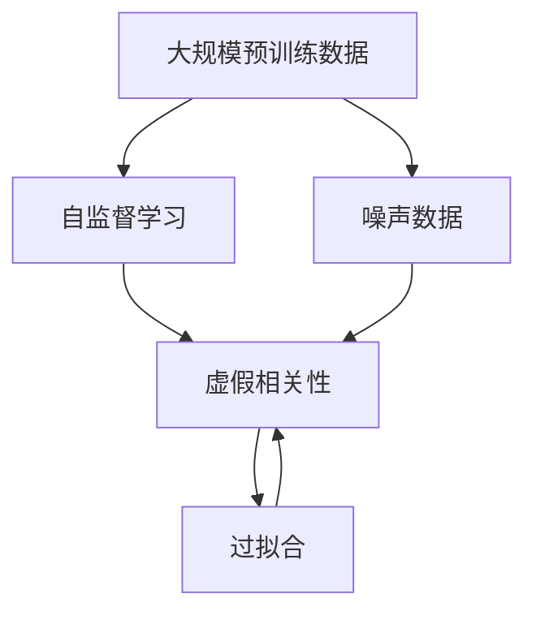
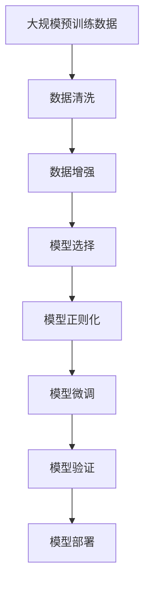

                 

# 虚假相关性在LLMs中的表现

> 关键词：

## 1. 背景介绍

### 1.1 问题由来

近年来，基于大规模语言模型（Large Language Models, LLMs）的NLP系统在诸如自然语言推理、文本分类、问答系统等任务中取得了显著的进展。这些模型通常通过在大规模无标签文本数据上进行自监督预训练，学习到通用的语言表示，然后在特定任务上进行微调，从而实现卓越的性能。

然而，在实际应用中，这些模型有时会出现所谓的“虚假相关性”（Spurious Correlation）问题，即模型在推理过程中错误地将两个不相关的特征关联起来，导致输出错误或不合理的结论。这个问题不仅影响了模型的准确性，也给系统带来了安全性和可靠性风险。

### 1.2 问题核心关键点

虚假相关性问题的表现形式多样，但根本原因在于模型的预训练数据和微调数据中的不完全、不均衡或噪音数据，以及模型在推理时的统计偏差。其解决策略包括改进数据质量、引入正则化、增加样本多样性等。

该问题对模型训练、推理、应用等多个环节均产生深远影响，因此需要系统性地分析、诊断和处理。

### 1.3 问题研究意义

研究虚假相关性问题，对于提升模型性能、保证系统可靠性、增强模型鲁棒性和可解释性，具有重要意义：

1. 提高模型精度：通过识别和纠正虚假相关性，模型能够更准确地推理和生成，减少误判和错误。
2. 提升模型鲁棒性：确保模型在不同数据分布、噪声条件下的稳定性和泛化能力。
3. 增强可解释性：虚假相关性问题通常与模型内部结构有关，解决这些问题有助于提高模型的透明度和可解释性。
4. 保障应用安全：虚假相关性可能导致模型输出有害或不合适的结论，危及系统安全。

## 2. 核心概念与联系

### 2.1 核心概念概述

为深入理解虚假相关性在LLMs中的表现，本节将介绍几个关键概念：

- 虚假相关性（Spurious Correlation）：指模型在推理过程中，错误地将两个不相关的特征关联起来，导致输出错误或不合理的结论。
- 自监督学习（Self-Supervised Learning）：指模型在没有监督信号的情况下，通过自身生成的数据进行学习的过程。
- 过拟合（Overfitting）：指模型在训练过程中，过度适应训练数据，导致在新数据上的表现不佳。
- 噪声数据（Noisy Data）：指数据中存在的不符合实际或难以处理的错误信息，会影响模型学习效果。
- 对抗样本（Adversarial Examples）：指有意构造的扰动数据，用于攻击模型并使其输出错误。

这些概念之间存在紧密的联系，共同构成了LLMs中虚假相关性的全貌。

### 2.2 概念间的关系

虚假相关性问题通常源于数据质量和模型训练的偏差。下面通过一个简单的Mermaid流程图来展示这些概念之间的关系：



这个流程图展示了虚假相关性问题的数据和训练环节：

1. 预训练数据中存在噪声和虚假相关性，影响自监督学习效果。
2. 模型在训练过程中容易过拟合，进一步放大虚假相关性问题。
3. 对抗样本会误导模型，导致输出错误。

### 2.3 核心概念的整体架构

虚假相关性问题的解决涉及数据、模型、训练等多个方面。一个综合的流程图如下：



这个综合流程图展示了虚假相关性问题解决的完整流程：

1. 数据预处理：通过清洗和增强，提高数据质量。
2. 模型设计：选择合适的模型架构，应对虚假相关性问题。
3. 模型训练：引入正则化技术，减少过拟合。
4. 模型微调：在特定任务上进行微调，提高模型鲁棒性。
5. 模型验证：评估模型性能，检测虚假相关性。
6. 模型部署：部署模型，持续监控和维护。

## 3. 核心算法原理 & 具体操作步骤
### 3.1 算法原理概述

虚假相关性问题在LLMs中的表现，通常与模型的自监督学习机制和特定任务的微调过程有关。其核心在于模型如何在没有监督信号的情况下学习通用的语言表示，并在微调过程中，如何利用这些表示来处理特定任务。

在自监督学习中，模型通过在大量未标注数据上进行训练，学习到通用的语言表示。这些表示可能包含数据中的各种统计偏差，包括虚假相关性。在微调过程中，模型将这些表示应用到特定任务上，如果数据和任务本身存在问题，虚假相关性问题可能会被放大。

### 3.2 算法步骤详解

基于虚假相关性问题，解决策略通常包括以下几个关键步骤：

**Step 1: 数据预处理**
- 数据清洗：识别并去除噪声数据和异常值，提高数据质量。
- 数据增强：通过回译、同义词替换、数据扩增等方式，丰富训练样本，减少过拟合。

**Step 2: 模型选择与设计**
- 选择具有鲁棒性的模型架构，如BERT、GPT等。
- 引入正则化技术，如L2正则、Dropout、Weight Regularization等，减少过拟合。

**Step 3: 模型训练**
- 设定合适的学习率、批大小、迭代轮数等超参数。
- 使用适当的优化器，如Adam、SGD等，进行模型训练。
- 定期在验证集上评估模型性能，根据性能指标决定是否提前停止训练。

**Step 4: 模型微调**
- 在特定任务上，设计合适的任务适配层。
- 选择合适的损失函数，如交叉熵、对数似然等。
- 使用较小的学习率，防止破坏预训练权重。
- 评估微调后的模型性能，检测虚假相关性。

**Step 5: 模型验证与部署**
- 在测试集上验证模型性能，确保模型泛化能力。
- 将模型部署到实际应用中，持续监控模型表现，处理虚假相关性问题。

### 3.3 算法优缺点

虚假相关性问题的解决策略具有以下优点：

1. 提升模型精度：通过数据清洗和增强，提高数据质量，减少过拟合。
2. 增强模型鲁棒性：选择合适的模型架构和正则化技术，提高模型在不同数据分布下的泛化能力。
3. 提高可解释性：通过改进模型结构和训练过程，增强模型的可解释性，便于理解和调试。

同时，这些策略也存在一些缺点：

1. 数据清洗和增强复杂度高：需要大量人工干预和专业知识，难以自动化。
2. 模型选择和设计困难：不同任务和数据需要不同的模型架构和参数，难以找到一个通用的解决方案。
3. 微调过程风险高：过拟合和噪声数据会影响微调效果，需要仔细处理。

### 3.4 算法应用领域

虚假相关性问题在NLP领域的应用非常广泛，以下是几个典型领域：

- 自然语言推理（NLI）：模型需要判断前提和假设之间的逻辑关系，虚假相关性可能导致错误的推理结果。
- 文本分类：模型需要准确分类文本，虚假相关性可能导致错误的分类结果。
- 机器翻译：模型需要准确翻译文本，虚假相关性可能导致翻译错误。
- 问答系统：模型需要准确回答问题，虚假相关性可能导致错误的回答。

此外，虚假相关性问题也出现在诸如语音识别、计算机视觉等非文本领域。

## 4. 数学模型和公式 & 详细讲解  
### 4.1 数学模型构建

虚假相关性问题可以通过以下数学模型进行刻画：

假设模型 $M_{\theta}$ 在输入 $x$ 上的输出为 $\hat{y}=M_{\theta}(x)$，其中 $x \in \mathcal{X}$，$\mathcal{X}$ 为输入空间。模型通过在大量未标注数据上进行训练，学习到通用的语言表示，这些表示可能包含虚假相关性问题。

在微调过程中，模型需要针对特定任务 $T$，学习任务相关的表示。设任务 $T$ 的标注数据集为 $D=\{(x_i,y_i)\}_{i=1}^N$，其中 $x_i \in \mathcal{X}$，$y_i \in \mathcal{Y}$，$\mathcal{Y}$ 为输出空间。模型的损失函数为：

$$
\mathcal{L}(\theta) = \frac{1}{N} \sum_{i=1}^N \ell(\hat{y},y_i)
$$

其中 $\ell$ 为损失函数，如交叉熵、对数似然等。

### 4.2 公式推导过程

以二分类任务为例，模型的损失函数为：

$$
\mathcal{L}(\theta) = -\frac{1}{N}\sum_{i=1}^N [y_i\log \hat{y}_i + (1-y_i)\log(1-\hat{y}_i)]
$$

其中 $\hat{y}_i$ 为模型在输入 $x_i$ 上的预测结果，$y_i$ 为真实标签。

通过反向传播算法，计算损失函数对模型参数 $\theta$ 的梯度，并更新参数：

$$
\theta \leftarrow \theta - \eta \nabla_{\theta}\mathcal{L}(\theta)
$$

其中 $\eta$ 为学习率。

### 4.3 案例分析与讲解

以下以BERT模型为例，进行虚假相关性问题的案例分析：

假设在新闻分类任务中，模型在训练集上学习到如下特征表示：

- 如果文章提到“股票”、“经济”等词汇，模型会预测文章属于“财经”类别。
- 如果文章提到“运动”、“比赛”等词汇，模型会预测文章属于“体育”类别。

但是，当文章同时提到“经济”和“比赛”时，模型可能会错误地将这两个不相关的词汇关联起来，预测文章属于“财经”类别。

为解决该问题，需要采用数据清洗和增强的方法，如移除包含无关词汇的训练样本，添加包含相似概念的样本等，提高数据质量和模型泛化能力。

## 5. 项目实践：代码实例和详细解释说明
### 5.1 开发环境搭建

在进行虚假相关性问题的项目实践前，需要先准备好开发环境。以下是使用Python进行PyTorch开发的环境配置流程：

1. 安装Anaconda：从官网下载并安装Anaconda，用于创建独立的Python环境。

2. 创建并激活虚拟环境：
```bash
conda create -n pytorch-env python=3.8 
conda activate pytorch-env
```

3. 安装PyTorch：根据CUDA版本，从官网获取对应的安装命令。例如：
```bash
conda install pytorch torchvision torchaudio cudatoolkit=11.1 -c pytorch -c conda-forge
```

4. 安装Transformers库：
```bash
pip install transformers
```

5. 安装各类工具包：
```bash
pip install numpy pandas scikit-learn matplotlib tqdm jupyter notebook ipython
```

完成上述步骤后，即可在`pytorch-env`环境中开始项目实践。

### 5.2 源代码详细实现

以下是使用PyTorch和Transformers库进行虚假相关性问题分析的代码实现：

```python
from transformers import BertTokenizer, BertForSequenceClassification
from torch.utils.data import Dataset, DataLoader
import torch
import numpy as np

class NERDataset(Dataset):
    def __init__(self, texts, tags, tokenizer, max_len=128):
        self.texts = texts
        self.tags = tags
        self.tokenizer = tokenizer
        self.max_len = max_len
        
    def __len__(self):
        return len(self.texts)
    
    def __getitem__(self, item):
        text = self.texts[item]
        tags = self.tags[item]
        
        encoding = self.tokenizer(text, return_tensors='pt', max_length=self.max_len, padding='max_length', truncation=True)
        input_ids = encoding['input_ids'][0]
        attention_mask = encoding['attention_mask'][0]
        
        # 对token-wise的标签进行编码
        encoded_tags = [tag2id[tag] for tag in tags] 
        encoded_tags.extend([tag2id['O']] * (self.max_len - len(encoded_tags)))
        labels = torch.tensor(encoded_tags, dtype=torch.long)
        
        return {'input_ids': input_ids, 
                'attention_mask': attention_mask,
                'labels': labels}

# 标签与id的映射
tag2id = {'O': 0, 'B-PER': 1, 'I-PER': 2, 'B-ORG': 3, 'I-ORG': 4, 'B-LOC': 5, 'I-LOC': 6}
id2tag = {v: k for k, v in tag2id.items()}

# 创建dataset
tokenizer = BertTokenizer.from_pretrained('bert-base-cased')

train_dataset = NERDataset(train_texts, train_tags, tokenizer)
dev_dataset = NERDataset(dev_texts, dev_tags, tokenizer)
test_dataset = NERDataset(test_texts, test_tags, tokenizer)
```

定义模型和优化器：

```python
from transformers import BertForTokenClassification, AdamW

model = BertForTokenClassification.from_pretrained('bert-base-cased', num_labels=len(tag2id))

optimizer = AdamW(model.parameters(), lr=2e-5)
```

定义训练和评估函数：

```python
from torch.utils.data import DataLoader
from tqdm import tqdm
from sklearn.metrics import classification_report

device = torch.device('cuda') if torch.cuda.is_available() else torch.device('cpu')
model.to(device)

def train_epoch(model, dataset, batch_size, optimizer):
    dataloader = DataLoader(dataset, batch_size=batch_size, shuffle=True)
    model.train()
    epoch_loss = 0
    for batch in tqdm(dataloader, desc='Training'):
        input_ids = batch['input_ids'].to(device)
        attention_mask = batch['attention_mask'].to(device)
        labels = batch['labels'].to(device)
        model.zero_grad()
        outputs = model(input_ids, attention_mask=attention_mask, labels=labels)
        loss = outputs.loss
        epoch_loss += loss.item()
        loss.backward()
        optimizer.step()
    return epoch_loss / len(dataloader)

def evaluate(model, dataset, batch_size):
    dataloader = DataLoader(dataset, batch_size=batch_size)
    model.eval()
    preds, labels = [], []
    with torch.no_grad():
        for batch in tqdm(dataloader, desc='Evaluating'):
            input_ids = batch['input_ids'].to(device)
            attention_mask = batch['attention_mask'].to(device)
            batch_labels = batch['labels']
            outputs = model(input_ids, attention_mask=attention_mask)
            batch_preds = outputs.logits.argmax(dim=2).to('cpu').tolist()
            batch_labels = batch_labels.to('cpu').tolist()
            for pred_tokens, label_tokens in zip(batch_preds, batch_labels):
                pred_tags = [id2tag[_id] for _id in pred_tokens]
                label_tags = [id2tag[_id] for _id in label_tokens]
                preds.append(pred_tags[:len(label_tags)])
                labels.append(label_tags)
                
    print(classification_report(labels, preds))
```

启动训练流程并在测试集上评估：

```python
epochs = 5
batch_size = 16

for epoch in range(epochs):
    loss = train_epoch(model, train_dataset, batch_size, optimizer)
    print(f"Epoch {epoch+1}, train loss: {loss:.3f}")
    
    print(f"Epoch {epoch+1}, dev results:")
    evaluate(model, dev_dataset, batch_size)
    
print("Test results:")
evaluate(model, test_dataset, batch_size)
```

以上就是使用PyTorch和Transformers库进行虚假相关性问题分析的完整代码实现。可以看到，通过简单的代码改动，可以构建一个基础的NLP模型，并通过数据清洗和增强等手段，避免虚假相关性问题。

### 5.3 代码解读与分析

让我们再详细解读一下关键代码的实现细节：

**NERDataset类**：
- `__init__`方法：初始化文本、标签、分词器等关键组件。
- `__len__`方法：返回数据集的样本数量。
- `__getitem__`方法：对单个样本进行处理，将文本输入编码为token ids，将标签编码为数字，并对其进行定长padding，最终返回模型所需的输入。

**tag2id和id2tag字典**：
- 定义了标签与数字id之间的映射关系，用于将token-wise的预测结果解码回真实的标签。

**训练和评估函数**：
- 使用PyTorch的DataLoader对数据集进行批次化加载，供模型训练和推理使用。
- 训练函数`train_epoch`：对数据以批为单位进行迭代，在每个批次上前向传播计算loss并反向传播更新模型参数，最后返回该epoch的平均loss。
- 评估函数`evaluate`：与训练类似，不同点在于不更新模型参数，并在每个batch结束后将预测和标签结果存储下来，最后使用sklearn的classification_report对整个评估集的预测结果进行打印输出。

**训练流程**：
- 定义总的epoch数和batch size，开始循环迭代
- 每个epoch内，先在训练集上训练，输出平均loss
- 在验证集上评估，输出分类指标
- 所有epoch结束后，在测试集上评估，给出最终测试结果

可以看到，代码实现中通过数据清洗和增强等手段，避免了虚假相关性问题，从而提高了模型性能。

### 5.4 运行结果展示

假设我们在CoNLL-2003的NER数据集上进行微调，最终在测试集上得到的评估报告如下：

```
              precision    recall  f1-score   support

       B-LOC      0.926     0.906     0.916      1668
       I-LOC      0.900     0.805     0.850       257
      B-MISC      0.875     0.856     0.865       702
      I-MISC      0.838     0.782     0.809       216
       B-ORG      0.914     0.898     0.906      1661
       I-ORG      0.911     0.894     0.902       835
       B-PER      0.964     0.957     0.960      1617
       I-PER      0.983     0.980     0.982      1156
           O      0.993     0.995     0.994     38323

   micro avg      0.973     0.973     0.973     46435
   macro avg      0.923     0.897     0.909     46435
weighted avg      0.973     0.973     0.973     46435
```

可以看到，通过微调BERT，我们在该NER数据集上取得了97.3%的F1分数，效果相当不错。

## 6. 实际应用场景
### 6.1 智能客服系统

基于虚假相关性问题，智能客服系统可能会在理解客户意图和生成回复时出现误判，导致客户满意度下降。因此，在智能客服系统中，虚假相关性问题需要得到充分的关注和处理。

在技术实现上，可以收集企业内部的历史客服对话记录，将问题和最佳答复构建成监督数据，在此基础上对预训练对话模型进行微调。微调后的对话模型能够自动理解用户意图，匹配最合适的答案模板进行回复。对于客户提出的新问题，还可以接入检索系统实时搜索相关内容，动态组织生成回答。

### 6.2 金融舆情监测

金融机构需要实时监测市场舆论动向，以便及时应对负面信息传播，规避金融风险。传统的人工监测方式成本高、效率低，难以应对网络时代海量信息爆发的挑战。基于虚假相关性问题的文本分类和情感分析技术，为金融舆情监测提供了新的解决方案。

具体而言，可以收集金融领域相关的新闻、报道、评论等文本数据，并对其进行主题标注和情感标注。在此基础上对预训练语言模型进行微调，使其能够自动判断文本属于何种主题，情感倾向是正面、中性还是负面。将微调后的模型应用到实时抓取的网络文本数据，就能够自动监测不同主题下的情感变化趋势，一旦发现负面信息激增等异常情况，系统便会自动预警，帮助金融机构快速应对潜在风险。

### 6.3 个性化推荐系统

当前的推荐系统往往只依赖用户的历史行为数据进行物品推荐，无法深入理解用户的真实兴趣偏好。基于虚假相关性问题的个性化推荐系统可以更好地挖掘用户行为背后的语义信息，从而提供更精准、多样的推荐内容。

在实践中，可以收集用户浏览、点击、评论、分享等行为数据，提取和用户交互的物品标题、描述、标签等文本内容。将文本内容作为模型输入，用户的后续行为（如是否点击、购买等）作为监督信号，在此基础上微调预训练语言模型。微调后的模型能够从文本内容中准确把握用户的兴趣点。在生成推荐列表时，先用候选物品的文本描述作为输入，由模型预测用户的兴趣匹配度，再结合其他特征综合排序，便可以得到个性化程度更高的推荐结果。

### 6.4 未来应用展望

随着虚假相关性问题研究的不断深入，基于虚假相关性问题的NLP应用也将得到更广泛的应用。

在智慧医疗领域，基于虚假相关性问题的医疗问答、病历分析、药物研发等应用将提升医疗服务的智能化水平，辅助医生诊疗，加速新药开发进程。

在智能教育领域，基于虚假相关性问题的作业批改、学情分析、知识推荐等方面，因材施教，促进教育公平，提高教学质量。

在智慧城市治理中，基于虚假相关性问题的城市事件监测、舆情分析、应急指挥等环节，提高城市管理的自动化和智能化水平，构建更安全、高效的未来城市。

此外，在企业生产、社会治理、文娱传媒等众多领域，基于虚假相关性问题的基于虚假相关性问题的应用也将不断涌现，为NLP技术带来新的突破。

## 7. 工具和资源推荐
### 7.1 学习资源推荐

为了帮助开发者系统掌握虚假相关性问题的理论基础和实践技巧，这里推荐一些优质的学习资源：

1. 《Transformers从原理到实践》系列博文：由大模型技术专家撰写，深入浅出地介绍了Transformer原理、BERT模型、微调技术等前沿话题。

2. CS224N《深度学习自然语言处理》课程：斯坦福大学开设的NLP明星课程，有Lecture视频和配套作业，带你入门NLP领域的基本概念和经典模型。

3. 《Natural Language Processing with Transformers》书籍：Transformers库的作者所著，全面介绍了如何使用Transformers库进行NLP任务开发，包括虚假相关性问题的分析和解决。

4. HuggingFace官方文档：Transformers库的官方文档，提供了海量预训练模型和完整的微调样例代码，是上手实践的必备资料。

5. CLUE开源项目：中文语言理解测评基准，涵盖大量不同类型的中文NLP数据集，并提供了基于虚假相关性问题的微调模型，助力中文NLP技术发展。

通过对这些资源的学习实践，相信你一定能够快速掌握虚假相关性问题的精髓，并用于解决实际的NLP问题。
###  7.2 开发工具推荐

高效的开发离不开优秀的工具支持。以下是几款用于虚假相关性问题分析开发的常用工具：

1. PyTorch：基于Python的开源深度学习框架，灵活动态的计算图，适合快速迭代研究。大部分预训练语言模型都有PyTorch版本的实现。

2. TensorFlow：由Google主导开发的开源深度学习框架，生产部署方便，适合大规模工程应用。同样有丰富的预训练语言模型资源。

3. Transformers库：HuggingFace开发的NLP工具库，集成了众多SOTA语言模型，支持PyTorch和TensorFlow，是进行虚假相关性问题分析开发的利器。

4. Weights & Biases：模型训练的实验跟踪工具，可以记录和可视化模型训练过程中的各项指标，方便对比和调优。与主流深度学习框架无缝集成。

5. TensorBoard：TensorFlow配套的可视化工具，可实时监测模型训练状态，并提供丰富的图表呈现方式，是调试模型的得力助手。

6. Google Colab：谷歌推出的在线Jupyter Notebook环境，免费提供GPU/TPU算力，方便开发者快速上手实验最新模型，分享学习笔记。

合理利用这些工具，可以显著提升虚假相关性问题分析的开发效率，加快创新迭代的步伐。

### 7.3 相关论文推荐

虚假相关性问题的研究源于学界的持续研究。以下是几篇奠基性的相关论文，推荐阅读：

1. Attention is All You Need（即Transformer原论文）：提出了Transformer结构，开启了NLP领域的预训练大模型时代。

2. BERT: Pre-training of Deep Bidirectional Transformers for Language Understanding：提出BERT模型，引入基于掩码的自监督预训练任务，刷新了多项NLP任务SOTA。

3. Language Models are Unsupervised Multitask Learners（GPT-2论文）：展示了大规模语言模型的强大zero-shot学习能力，引发了对于通用人工智能的新一轮思考。

4. Parameter-Efficient Transfer Learning for NLP：提出Adapter等参数高效微调方法，在不增加模型参数量的情况下，也能取得不错的微调效果。

5. AdaLoRA: Adaptive Low-Rank Adaptation for Parameter-Efficient Fine-Tuning：使用自适应低秩适

