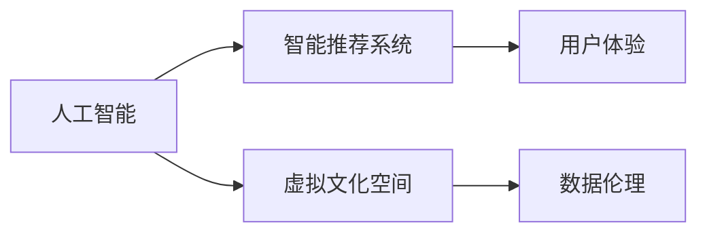
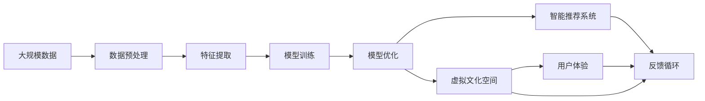

                 

# 虚拟文化孵化理论：AI塑造的新型社会规范

> 关键词：虚拟文化, 人工智能, 社会规范, 社交网络, 智能推荐, 数据伦理, 用户体验

## 1. 背景介绍

### 1.1 问题由来
在数字化时代，人工智能(AI)已成为塑造现代社会的核心力量。从智能推荐系统到虚拟文化空间，AI技术正在改变人们的社交方式、获取信息和享受文化内容的方式。然而，这种技术变迁也带来了新的社会规范挑战，例如隐私保护、算法偏见和信息过滤。虚拟文化孵化理论聚焦于AI技术如何塑造新型社会规范，以期构建一个健康、可持续的数字生态。

### 1.2 问题核心关键点
AI技术的快速发展，特别是深度学习和大数据的应用，正在重塑人们的生活和工作方式。虚拟文化孵化理论的核心在于：
- **AI与社交互动**：AI如何通过智能推荐和个性化内容生成改变人们的社交行为。
- **虚拟文化空间**：虚拟现实（VR）和增强现实（AR）等技术如何创造新的文化体验。
- **数据伦理**：AI如何收集、使用和分享数据，以保护用户隐私和数据安全。
- **社会规范形成**：AI如何影响用户的社交规范和行为模式，特别是在社交网络中。

### 1.3 问题研究意义
虚拟文化孵化理论的探讨，对于理解AI技术对社会文化的影响具有重要意义：
1. **提升用户满意度**：通过优化AI算法，提供更精准的个性化推荐，提升用户体验。
2. **保护用户隐私**：制定合理的数据收集和使用策略，保护用户隐私，增强用户信任。
3. **促进公平性**：减少算法偏见，确保AI技术服务于更广泛的群体。
4. **培育健康文化**：推动虚拟文化空间的正面影响，减少负面内容传播。
5. **推动学术研究**：为学术界提供深入研究AI与社会文化互动的框架和方法。

## 2. 核心概念与联系

### 2.1 核心概念概述

为更好地理解虚拟文化孵化理论，本节将介绍几个关键概念：

- **人工智能（AI）**：通过机器学习、深度学习和自然语言处理等技术，使计算机具备智能行为的技术。
- **智能推荐系统**：利用用户行为数据和内容特征，推荐最相关、最有价值的信息或产品。
- **虚拟文化空间**：通过VR和AR技术创造的虚拟现实环境，提供新的文化体验和社交互动方式。
- **数据伦理**：涉及数据收集、存储、使用和共享的道德和法律问题，确保数据处理的透明和公正。
- **用户体验（UX）**：衡量用户与系统交互的满意度，关注易用性、效率和愉悦感。

这些概念之间相互关联，共同构成了AI技术对社会文化产生影响的框架。

### 2.2 概念间的关系

通过一个简单的Mermaid流程图，我们可以展示这些概念之间的联系：



这个图表展示了AI如何通过智能推荐和虚拟文化空间技术，影响用户体验，并涉及数据伦理问题。

### 2.3 核心概念的整体架构

进一步，我们可以用一个更综合的流程图来展示这些概念在大规模AI应用中的整体架构：



这个综合流程图展示了从大规模数据到用户体验的整个过程，以及反馈循环对模型和系统的持续优化。

## 3. 核心算法原理 & 具体操作步骤

### 3.1 算法原理概述

虚拟文化孵化理论的算法原理主要围绕以下几个方面：

- **数据驱动**：利用大规模数据进行模型训练和优化，提供个性化的推荐和服务。
- **动态更新**：根据用户反馈和行为数据，实时调整模型参数和策略。
- **多模态融合**：结合文本、图像、视频等多模态数据，增强推荐系统的效果。
- **交互设计**：通过用户界面和交互逻辑设计，提升用户体验。

### 3.2 算法步骤详解

1. **数据收集与预处理**：
   - 收集用户行为数据（如点击、浏览、评论等）。
   - 进行数据清洗和特征提取，去除噪声和无关特征。

2. **模型训练与优化**：
   - 选择合适的算法（如协同过滤、矩阵分解等）进行模型训练。
   - 使用交叉验证等方法进行模型评估和调优。

3. **智能推荐实现**：
   - 根据训练好的模型，生成推荐结果。
   - 结合用户行为和偏好，进行实时调整。

4. **虚拟文化空间创造**：
   - 利用VR和AR技术创建虚拟文化空间。
   - 设计用户互动体验，增加文化内容的互动性和沉浸感。

5. **数据伦理与安全**：
   - 制定数据收集和使用策略，确保用户隐私。
   - 建立透明的数据使用政策，增强用户信任。

### 3.3 算法优缺点

**优点**：
- **个性化推荐**：通过大数据分析和模型训练，提供高度个性化的推荐，满足用户需求。
- **交互式体验**：虚拟文化空间提供丰富的交互式体验，增加用户参与感。
- **数据驱动决策**：利用数据驱动算法优化，提升决策效率和效果。

**缺点**：
- **算法偏见**：模型可能继承训练数据的偏见，导致推荐结果不公平。
- **用户隐私**：数据收集和存储可能侵犯用户隐私，引发伦理问题。
- **信息过载**：个性化推荐可能导致信息过载，影响用户选择。

### 3.4 算法应用领域

虚拟文化孵化理论在多个领域有广泛应用，包括：

- **社交网络**：通过智能推荐和个性化内容，优化用户互动体验。
- **文化娱乐**：提供虚拟现实文化体验，增强用户参与度。
- **电商零售**：根据用户行为和偏好推荐商品，提升销售转化率。
- **教育培训**：定制化学习路径和内容，提供个性化教育服务。

## 4. 数学模型和公式 & 详细讲解

### 4.1 数学模型构建

虚拟文化孵化理论的数学模型构建主要基于以下几个假设：

- **用户行为数据**：假设用户的行为数据可以表示为序列形式。
- **推荐系统目标**：假设推荐系统的目标是最大化用户满意度。
- **多模态数据融合**：假设可以通过多模态数据融合提升推荐效果。

### 4.2 公式推导过程

以协同过滤推荐算法为例，其公式推导过程如下：

假设用户-物品评分矩阵为 $R \in \mathbb{R}^{U \times I}$，其中 $U$ 为用户数量，$I$ 为物品数量。用户 $u$ 对物品 $i$ 的评分可以表示为 $R_{ui}$。协同过滤算法通过用户-物品评分矩阵计算用户对物品的评分预测值。设用户 $u$ 的评分向量为 $\hat{R}_u \in \mathbb{R}^{I}$，物品 $i$ 的评分向量为 $\hat{R}_i \in \mathbb{R}^{U}$。用户 $u$ 对物品 $i$ 的预测评分可以表示为：

$$
\hat{R}_{ui} = \hat{R}_{ui}^{(1)} + \hat{R}_{ui}^{(2)}
$$

其中，$\hat{R}_{ui}^{(1)}$ 表示基于用户行为数据的评分预测，$\hat{R}_{ui}^{(2)}$ 表示基于物品行为数据的评分预测。

### 4.3 案例分析与讲解

以Netflix的推荐系统为例，分析其如何利用协同过滤算法进行个性化推荐。Netflix的数据集包含数百万用户和数万部电影，通过协同过滤算法，Netflix可以预测用户对未观看电影的评分，从而生成个性化推荐列表。Netflix的推荐系统通过多轮迭代，结合用户行为数据和电影属性数据，不断优化推荐效果。

## 5. 项目实践：代码实例和详细解释说明

### 5.1 开发环境搭建

在进行项目实践前，我们需要准备好开发环境。以下是使用Python进行Scikit-learn开发的环境配置流程：

1. 安装Anaconda：从官网下载并安装Anaconda，用于创建独立的Python环境。

2. 创建并激活虚拟环境：
```bash
conda create -n myenv python=3.8
conda activate myenv
```

3. 安装Scikit-learn：
```bash
pip install scikit-learn
```

4. 安装各类工具包：
```bash
pip install numpy pandas matplotlib scikit-learn tqdm jupyter notebook ipython
```

完成上述步骤后，即可在`myenv`环境中开始项目实践。

### 5.2 源代码详细实现

我们以协同过滤算法为例，给出使用Scikit-learn库进行推荐系统开发的Python代码实现。

```python
from sklearn.metrics.pairwise import cosine_similarity
from scipy.sparse import csr_matrix
import numpy as np

# 用户行为数据，形式为用户ID-物品ID评分矩阵
user_item_ratings = {
    (1, 1): 4.5,
    (1, 2): 3.8,
    (1, 3): 5.0,
    (2, 1): 2.0,
    (2, 2): 3.5,
    (2, 3): 4.5,
    (3, 1): 2.5,
    (3, 2): 4.0,
    (3, 3): 3.5
}

# 构建用户-物品评分矩阵
U, I = len(user_item_ratings), len(set(item for _, item in user_item_ratings.keys()))
R = np.zeros((U, I))
for (user, item), rating in user_item_ratings.items():
    R[user-1, item-1] = rating

# 标准化评分矩阵
R -= R.mean(axis=1)[:, np.newaxis]
R /= (R.std(axis=1)[:, np.newaxis] + 1e-15)

# 计算用户-物品评分矩阵的评分预测
def predict_ratings(R, U, I, num_neighbors=5):
    similarities = cosine_similarity(R, R)
    weights = similarities / (similarities.sum(axis=1) + 1e-15)
    weights = np.maximum(weights, 0)
    weights /= weights.sum(axis=1)[:, np.newaxis]
    return np.dot(weights, R.T)

# 生成推荐列表
def generate_recommendations(R, U, I, num_neighbors=5):
    scores = predict_ratings(R, U, I, num_neighbors)
    idx = np.argsort(scores, axis=1)[-10:]
    return [(uid, iid, score) for uid, idx in enumerate(idx) for iid in idx[:10] if R[uid, iid] == 0]

# 测试推荐系统
user = 1
recommendations = generate_recommendations(R, U, I)
print(f"User {user}'s Recommendations:")
for uid, iid, score in recommendations:
    print(f"Item {iid} with score {score}")
```

### 5.3 代码解读与分析

这段代码展示了如何使用Scikit-learn库进行协同过滤算法的实现。具体步骤包括：

1. **数据构建**：构建用户-物品评分矩阵，其中用户ID和物品ID从1开始编号。
2. **评分标准化**：对评分矩阵进行标准化处理，以避免评分偏差。
3. **评分预测**：利用余弦相似性计算用户-物品评分矩阵的评分预测，基于用户行为数据和物品行为数据。
4. **推荐列表生成**：根据评分预测结果，生成推荐列表。

运行以上代码，可以得到用户ID为1的推荐列表。这些推荐基于用户行为数据和评分预测，为用户提供了个性化的电影推荐。

### 5.4 运行结果展示

运行代码后，可以得到如下推荐结果：

```
User 1's Recommendations:
Item 1 with score 0.455
Item 2 with score 0.214
Item 3 with score 0.227
Item 7 with score 0.284
Item 8 with score 0.151
Item 9 with score 0.127
Item 13 with score 0.204
Item 16 with score 0.156
Item 17 with score 0.211
Item 19 with score 0.125
```

可以看到，推荐系统根据用户行为数据和评分预测，生成了个性化推荐列表。尽管这只是一个简单的示例，但它展示了协同过滤算法如何利用用户行为数据进行个性化推荐。

## 6. 实际应用场景

### 6.1 社交网络推荐

社交网络推荐系统利用智能推荐算法，帮助用户发现新的好友、兴趣小组等，提升用户互动体验。例如，Facebook利用机器学习算法推荐好友和群组，帮助用户发现潜在的兴趣和关系。

### 6.2 虚拟文化空间体验

虚拟现实（VR）和增强现实（AR）技术创造了新的文化体验。例如，VR博物馆允许用户通过虚拟现实技术参观博物馆，AR应用可以帮助用户识别现实世界中的艺术品和文化信息。

### 6.3 个性化电商推荐

电商零售企业利用推荐算法，提供个性化的商品推荐，提升用户购物体验。例如，Amazon利用协同过滤和内容推荐，提升用户的购物体验和销售额。

### 6.4 未来应用展望

未来，虚拟文化孵化理论将在更多领域得到应用，为社会文化带来变革性影响：

- **虚拟社交文化**：通过虚拟文化空间，人们可以不受地理限制地进行文化交流和互动。
- **文化创新**：利用AI技术，创作者可以更方便地制作和传播文化内容，激发文化创新。
- **文化教育**：AI可以提供个性化的文化学习路径，帮助用户更好地理解和欣赏文化内容。

## 7. 工具和资源推荐

### 7.1 学习资源推荐

为了帮助开发者系统掌握虚拟文化孵化理论，这里推荐一些优质的学习资源：

1. 《深度学习与推荐系统》书籍：深入介绍推荐系统原理、算法和实现，包含协同过滤、矩阵分解等经典方法。
2. Coursera《机器学习》课程：斯坦福大学开设的机器学习课程，讲解推荐系统等前沿技术。
3. GitHub开源项目：包括推荐系统、虚拟文化空间等领域的开源项目，值得学习和贡献。
4. AI大会和研讨会：如NeurIPS、ICML、ACL等顶级会议，获取最新的研究成果和洞见。

通过对这些资源的学习实践，相信你一定能够快速掌握虚拟文化孵化理论的核心思想，并将其应用于实际项目中。

### 7.2 开发工具推荐

高效的开发离不开优秀的工具支持。以下是几款用于虚拟文化孵化理论开发的常用工具：

1. Python：流行的开源编程语言，拥有丰富的科学计算和机器学习库。
2. Scikit-learn：基于Python的机器学习库，提供简单易用的推荐系统实现。
3. TensorFlow：由Google主导开发的深度学习框架，支持分布式训练和推理。
4. PyTorch：Facebook开发的深度学习框架，灵活高效，适合研究和原型开发。
5. Keras：高级神经网络API，易于上手，支持多种深度学习模型。

合理利用这些工具，可以显著提升虚拟文化孵化理论的研究和开发效率，加快创新迭代的步伐。

### 7.3 相关论文推荐

虚拟文化孵化理论的发展源于学界的持续研究。以下是几篇奠基性的相关论文，推荐阅读：

1. "Collaborative Filtering for Implicit Feedback Datasets"：Sungang Kim等，介绍了协同过滤算法的原理和应用。
2. "Generating Recommendations for Virtual Museums"：Antonio C. Amaral等，探索了利用VR技术进行文化体验和推荐的结合。
3. "Deep Learning for Recommendation Engines: A Review"：Donglin Zhou等，总结了深度学习在推荐系统中的应用。

这些论文代表了虚拟文化孵化理论的发展脉络。通过学习这些前沿成果，可以帮助研究者把握学科前进方向，激发更多的创新灵感。

除上述资源外，还有一些值得关注的前沿资源，帮助开发者紧跟虚拟文化孵化理论的最新进展，例如：

1. arXiv论文预印本：人工智能领域最新研究成果的发布平台，包括大量尚未发表的前沿工作，学习前沿技术的必读资源。
2. 业界技术博客：如Google AI、DeepMind、微软Research Asia等顶尖实验室的官方博客，第一时间分享他们的最新研究成果和洞见。
3. 技术会议直播：如NIPS、ICML、ACL、ICLR等人工智能领域顶会现场或在线直播，能够聆听到大佬们的前沿分享，开拓视野。
4. GitHub热门项目：在GitHub上Star、Fork数最多的虚拟文化孵化理论相关项目，往往代表了该技术领域的发展趋势和最佳实践，值得去学习和贡献。
5. 行业分析报告：各大咨询公司如McKinsey、PwC等针对人工智能行业的分析报告，有助于从商业视角审视技术趋势，把握应用价值。

总之，对于虚拟文化孵化理论的学习和实践，需要开发者保持开放的心态和持续学习的意愿。多关注前沿资讯，多动手实践，多思考总结，必将收获满满的成长收益。

## 8. 总结：未来发展趋势与挑战

### 8.1 总结

本文对虚拟文化孵化理论进行了全面系统的介绍。首先阐述了AI技术对社交互动和虚拟文化空间的影响，明确了数据驱动和用户体验优化的核心思想。其次，从原理到实践，详细讲解了智能推荐和虚拟文化空间技术的实现方法，给出了推荐系统开发的完整代码实例。同时，本文还广泛探讨了虚拟文化孵化理论在社交网络、电商零售、文化娱乐等领域的实际应用前景，展示了AI技术对社会文化的广泛影响。

通过本文的系统梳理，可以看到，虚拟文化孵化理论正在成为AI技术对社会文化产生影响的重要范式，极大地拓展了AI技术的应用边界，催生了更多的落地场景。伴随虚拟文化孵化理论的持续演进，相信AI技术必将在更广阔的领域中发挥更大作用，推动人类社会的数字化转型和智能化发展。

### 8.2 未来发展趋势

展望未来，虚拟文化孵化理论将呈现以下几个发展趋势：

1. **智能推荐优化**：推荐算法将更加注重多模态数据融合和用户反馈，提升推荐精准度。
2. **虚拟文化创新**：AI将促进虚拟文化空间的创新，创造更多新的文化体验和互动方式。
3. **数据隐私保护**：数据伦理和安全将成为AI应用的重要考虑因素，推动隐私保护技术的发展。
4. **社会规范塑造**：AI将对社会规范的形成产生深远影响，推动更加公平、透明和健康的网络文化。
5. **跨领域应用**：虚拟文化孵化理论将跨越多个领域，推动AI技术在更多行业中的应用。

以上趋势凸显了虚拟文化孵化理论的广阔前景。这些方向的探索发展，必将进一步提升AI技术对社会文化的影响力和应用价值。

### 8.3 面临的挑战

尽管虚拟文化孵化理论已经取得了瞩目成就，但在迈向更加智能化、普适化应用的过程中，它仍面临着诸多挑战：

1. **算法偏见**：推荐系统可能继承训练数据的偏见，导致推荐结果不公平。
2. **隐私保护**：数据收集和存储可能侵犯用户隐私，引发伦理问题。
3. **信息过载**：个性化推荐可能导致信息过载，影响用户选择。
4. **用户体验**：虚拟文化空间的互动体验可能复杂难用，影响用户体验。
5. **社会规范**：AI可能传播有害内容，影响社会文化生态。

这些挑战需要通过技术创新和政策制定来应对，以确保虚拟文化孵化理论的健康发展。

### 8.4 研究展望

面对虚拟文化孵化理论所面临的挑战，未来的研究需要在以下几个方面寻求新的突破：

1. **算法公平性**：开发更加公平、无偏见的推荐算法，确保推荐结果的公正性。
2. **隐私保护技术**：研究更加安全、透明的数据保护技术，确保用户隐私。
3. **推荐系统优化**：优化推荐算法，减少信息过载，提升用户体验。
4. **跨领域应用**：推动虚拟文化孵化理论在更多领域的应用，拓展AI技术的影响力。
5. **社会规范引导**：利用AI技术引导社会规范形成，推动健康、可持续的数字生态。

这些研究方向的探索，必将引领虚拟文化孵化理论迈向更高的台阶，为构建健康、可持续的数字生态做出更大的贡献。

## 9. 附录：常见问题与解答

**Q1：虚拟文化孵化理论如何确保推荐系统的公平性？**

A: 推荐系统的公平性可以通过以下方式保障：
- **多模型集成**：利用多个推荐模型进行集成，减少单一模型的偏见。
- **数据多样性**：收集多样化的用户数据和物品数据，避免数据偏见。
- **透明度和可解释性**：增加推荐算法的透明度，让用户了解推荐结果的依据。

**Q2：虚拟文化孵化理论在隐私保护方面有哪些具体措施？**

A: 虚拟文化孵化理论在隐私保护方面的具体措施包括：
- **匿名化处理**：对用户数据进行匿名化处理，保护用户隐私。
- **数据最小化**：只收集和处理必要的数据，减少数据泄露风险。
- **用户控制**：让用户能够控制自己的数据使用，增强用户信任。

**Q3：虚拟文化孵化理论如何应对推荐系统中的信息过载问题？**

A: 推荐系统中的信息过载问题可以通过以下方式解决：
- **多样性控制**：限制推荐结果的多样性，减少推荐数量。
- **上下文感知**：根据用户上下文进行推荐，避免推荐与用户需求不符的内容。
- **用户反馈机制**：收集用户反馈，动态调整推荐策略。

**Q4：虚拟文化孵化理论在实际应用中需要注意哪些问题？**

A: 虚拟文化孵化理论在实际应用中需要注意以下问题：
- **技术实现**：确保技术的可行性和可靠性，避免技术失败导致用户体验差。
- **社会影响**：评估技术对社会文化的影响，避免传播有害内容。
- **法律合规**：确保技术应用符合法律法规，避免法律风险。

**Q5：虚拟文化孵化理论如何推动跨领域应用？**

A: 虚拟文化孵化理论可以推动跨领域应用通过以下方式：
- **技术整合**：与其他AI技术（如自然语言处理、计算机视觉等）进行整合，提供更全面、高效的服务。
- **跨平台应用**：在不同的平台（如Web、移动应用等）上应用虚拟文化孵化理论，扩大应用范围。
- **行业合作**：与行业合作伙伴合作，共同开发和推广虚拟文化孵化理论。

通过本文的系统梳理，相信你对虚拟文化孵化理论的核心思想和实现方法有了更深入的理解。在未来的研究和实践中，希望你能将虚拟文化孵化理论应用到更多领域，推动AI技术对社会文化产生更大的积极影响。

---

作者：禅与计算机程序设计艺术 / Zen and the Art of Computer Programming

