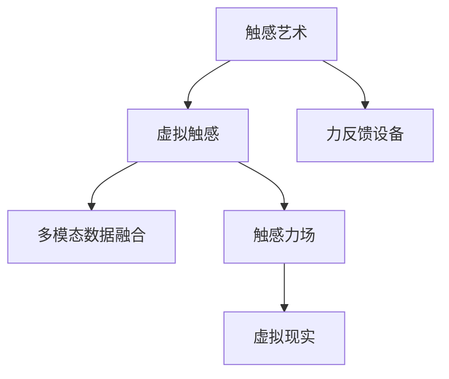
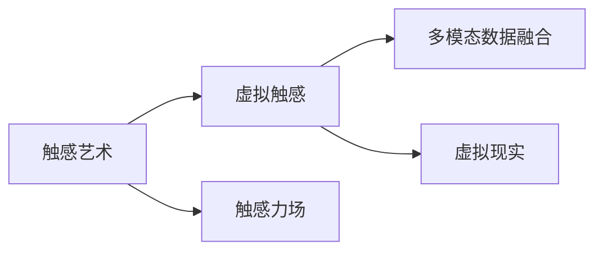
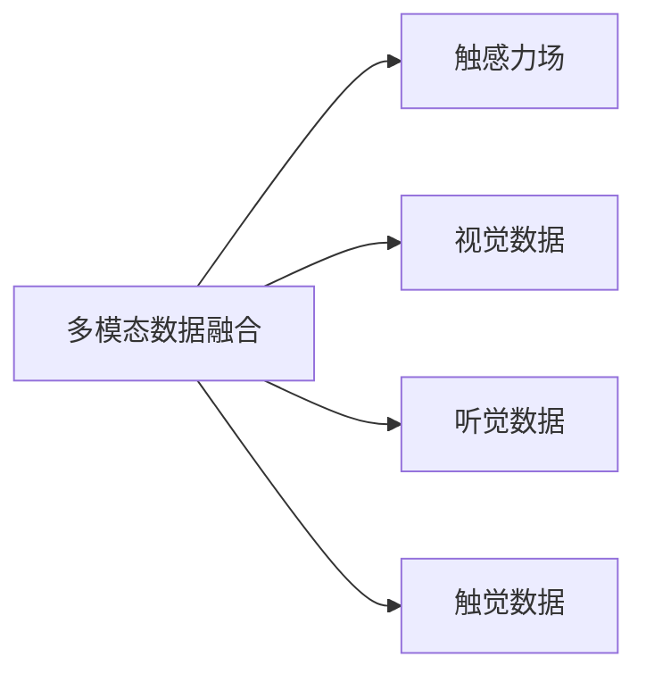
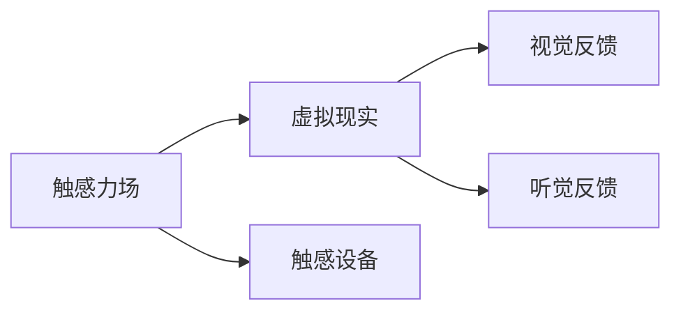
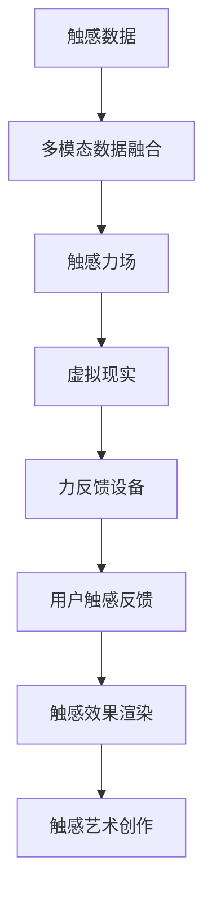

                 

# 虚拟触觉交响曲：AI创作的触感艺术

> 关键词：触感艺术, AI创作, 虚拟触觉, 交互设计, 沉浸式体验, 人工智能, 多模态融合, 人机交互

## 1. 背景介绍

### 1.1 问题由来
随着数字技术的不断进步，人类对感官体验的追求也不断提升。在视觉、听觉之外，触感作为一种最直接、最丰富的感官体验，近年来在虚拟现实(VR)、增强现实(AR)、混合现实(MR)等领域得到越来越多重视。传统触感技术依赖于力反馈设备、穿戴设备等硬件设施，成本高、体验局限。而人工智能(AI)的崛起，为触感艺术的创作和应用开辟了新的道路。

AI触感艺术不仅能够模拟真实的触感反馈，还能创造出独特的、超越物理限制的虚拟触感体验。虚拟触感艺术通过模拟触感力场、反馈效果等，使人们能够以全新的方式与虚拟世界互动，感受触觉的魅力。本文将从算法原理、实践方法、应用场景等多个角度深入探讨AI触感艺术的创作和应用。

### 1.2 问题核心关键点
AI触感艺术的核心在于通过多模态数据融合，生成逼真的触感反馈，实现触觉-视觉、触觉-听觉等多感官的同步体验。关键点包括：

1. 多模态数据采集与处理：采集用户动作、姿态、位置等数据，并结合视觉、听觉、触觉等多模态信息。
2. 触感力场模拟：根据用户触感数据，生成逼真的触感力场，模拟触感效果。
3. 虚拟触感渲染：通过虚拟现实、增强现实等技术，将触感力场渲染至用户的触觉设备，实现虚拟触感反馈。
4. 交互设计：设计互动流程、交互界面，引导用户通过触感进行感知、操作和体验。

本文将详细讨论这些关键技术点，并结合实际案例进行讲解，帮助读者更好地理解AI触感艺术的创作与实践。

### 1.3 问题研究意义
研究AI触感艺术的创作与实践，对拓展触觉艺术的应用范围，提升用户体验，加速技术产业化进程具有重要意义：

1. 拓展艺术表现形式：触感艺术突破传统视觉艺术的边界，以触感为载体，表达更多样化的艺术情感和意象。
2. 提升交互体验：触感反馈能够提供更自然、更沉浸的互动体验，使用户与虚拟环境更紧密融合。
3. 加速技术落地：触感艺术的AI实现能够降低硬件成本，扩大应用场景，加速新技术的产业化应用。
4. 推动学科融合：触感艺术结合计算机视觉、语音识别、自然语言处理等多种AI技术，促进跨学科交流与创新。
5. 服务社会生活：触感艺术在教育、娱乐、医疗等领域有广泛应用，能够提升生活质量，带来更丰富的感官体验。

## 2. 核心概念与联系

### 2.1 核心概念概述

为更好地理解AI触感艺术，本文将介绍几个密切相关的核心概念：

1. **触感艺术（Haptic Art）**：通过触感手段表现的艺术形式，旨在提供比视觉、听觉更加直接和互动的艺术体验。
2. **虚拟触感（Virtual Haptics）**：利用计算机模拟触感反馈，让用户通过触感设备与虚拟环境交互，获得逼真的触感体验。
3. **力反馈设备（Haptic Feedback Device）**：如力反馈手套、触觉球、触觉屏等，作为触感输入输出的载体。
4. **多模态数据融合（Multimodal Data Fusion）**：结合视觉、听觉、触觉等多种传感器数据，形成更全面、准确的用户感知模型。
5. **触感力场（Haptic Field）**：根据触感数据模拟的触感力场分布，用于生成触感反馈效果。
6. **虚拟现实（Virtual Reality, VR）**：通过计算机生成模拟环境，结合视觉、听觉、触感等多种感官反馈，提供沉浸式体验。

这些核心概念之间的逻辑关系可以通过以下Mermaid流程图来展示：



这个流程图展示了大语言模型微调过程中各个核心概念的关系：

1. 触感艺术通过虚拟触感和力反馈设备实现。
2. 虚拟触感基于多模态数据融合和触感力场模拟生成。
3. 多模态数据融合整合视觉、听觉、触觉等多种传感器数据。
4. 触感力场模拟触感数据，生成逼真的触感反馈。
5. 虚拟现实将触感反馈与其他感官反馈相结合，提供沉浸式体验。

### 2.2 概念间的关系

这些核心概念之间存在着紧密的联系，形成了虚拟触感艺术的完整生态系统。下面我通过几个Mermaid流程图来展示这些概念之间的关系。

#### 2.2.1 触感艺术与虚拟触感的联系



这个流程图展示触感艺术与虚拟触感之间的联系：

1. 触感艺术通过虚拟触感技术实现。
2. 触感力场是多模态数据融合和触感模拟的核心。
3. 虚拟现实技术将触感反馈与其他感官反馈结合，提供沉浸式体验。

#### 2.2.2 多模态数据融合与触感力场的联系



这个流程图展示多模态数据融合与触感力场之间的联系：

1. 多模态数据融合整合视觉、听觉、触觉等多种传感器数据。
2. 触感力场根据触觉数据生成逼真的触感反馈。
3. 触感力场是多模态数据融合的结果。

#### 2.2.3 触感力场与虚拟现实的关系



这个流程图展示触感力场与虚拟现实之间的联系：

1. 触感力场生成触感反馈效果。
2. 触感力场通过触感设备反馈给用户。
3. 虚拟现实技术将触感反馈与视觉、听觉等感官反馈结合。

### 2.3 核心概念的整体架构

最后，我们用一个综合的流程图来展示这些核心概念在大语言模型微调过程中的整体架构：



这个综合流程图展示了触感艺术创作的完整过程：

1. 触感数据通过多模态数据融合生成触感力场。
2. 触感力场通过虚拟现实技术渲染，形成虚拟触感效果。
3. 虚拟触感效果通过力反馈设备反馈给用户。
4. 用户触感反馈用于调整触感力场，实现交互设计。
5. 触感效果渲染生成触感艺术作品。

通过这些流程图，我们可以更清晰地理解触感艺术创作过程中各个核心概念的关系和作用，为后续深入讨论具体的创作方法和技术奠定基础。

## 3. 核心算法原理 & 具体操作步骤
### 3.1 算法原理概述

AI触感艺术的创作，本质上是多模态数据融合与触感力场模拟的协同过程。其核心思想是：将用户的触感数据与其他感官数据融合，生成逼真的触感力场，再通过虚拟现实技术，将触感反馈渲染至触感设备，形成沉浸式触感体验。

形式化地，假设触感数据为 $x \in \mathcal{X}$，多模态数据为 $y \in \mathcal{Y}$，触感力场为 $z \in \mathcal{Z}$，虚拟现实渲染结果为 $u \in \mathcal{U}$。触感艺术创作的目标是最小化虚拟触感与用户触感反馈之间的差异，即：

$$
\hat{z} = \mathop{\arg\min}_{z} \mathcal{L}(z,u)
$$

其中 $\mathcal{L}$ 为触感艺术创作任务设计的损失函数，用于衡量虚拟触感与用户触感反馈的差异。常见的损失函数包括均方误差损失、交叉熵损失等。

通过梯度下降等优化算法，触感艺术创作过程不断更新触感力场参数 $z$，最小化损失函数 $\mathcal{L}$，使得虚拟触感逼近用户期望的触感反馈。由于触感数据已经通过多模态融合获得了较为全面的用户信息，因此即便在少量数据集上进行创作，也能较快收敛到理想的触感力场参数 $\hat{z}$。

### 3.2 算法步骤详解

AI触感艺术的创作一般包括以下几个关键步骤：

**Step 1: 准备多模态数据集**
- 收集用户的触感数据、视觉数据、听觉数据等，划分为训练集、验证集和测试集。数据需要高质量、多样化，涵盖不同场景和用户群体。

**Step 2: 构建多模态融合模型**
- 选择合适的多模态融合算法，如主成分分析(PCA)、自编码器(Encoder-Decoder)、深度神经网络(DNN)等。将触感数据、视觉数据、听觉数据等作为输入，融合生成多模态特征向量。

**Step 3: 设计触感力场模型**
- 根据多模态融合结果，设计触感力场模型。常用的模型包括力场图模型、体元法力场模型、模拟微分方程模型等。
- 触感力场模型的输出为触力分布，即用户在不同位置感受到的力的大小和方向。

**Step 4: 优化触感力场参数**
- 使用优化算法（如梯度下降、Adam、RMSprop等）对触感力场模型进行训练，最小化损失函数 $\mathcal{L}$。
- 根据验证集上的性能评估，调整模型参数，防止过拟合。

**Step 5: 渲染虚拟触感**
- 将触感力场模型与虚拟现实渲染引擎结合，生成虚拟触感效果。
- 将虚拟触感效果渲染至用户的触感设备，如触觉球、触觉屏等。

**Step 6: 交互设计**
- 设计用户交互界面和流程，引导用户通过触感进行感知、操作和体验。
- 收集用户反馈，不断迭代优化触感艺术创作过程。

以上是AI触感艺术创作的一般流程。在实际应用中，还需要针对具体场景，对创作过程的各个环节进行优化设计，如改进融合算法、引入更多先验知识、设计更灵活的交互界面等，以进一步提升创作效果。

### 3.3 算法优缺点

AI触感艺术的创作具有以下优点：

1. **低成本高效益**：相比于传统的力反馈设备，AI触感艺术创作不需要昂贵的硬件设备，能够在虚拟环境中生成逼真的触感反馈，成本更低，效果更好。
2. **灵活多样**：触感艺术创作可以根据不同场景和需求，设计灵活的触感力场，满足各种触感体验需求。
3. **沉浸体验**：结合虚拟现实技术，触感艺术能够提供更加沉浸、自然的交互体验，使用户与虚拟环境更紧密融合。
4. **可扩展性强**：触感艺术创作可以结合多种AI技术，如计算机视觉、语音识别、自然语言处理等，形成更全面、准确的用户感知模型。

同时，该创作方法也存在一定的局限性：

1. **技术门槛高**：触感艺术创作涉及多模态数据融合、触感力场模拟等多个复杂技术环节，技术门槛较高。
2. **用户体验有限**：虽然AI触感艺术创作能够模拟逼真的触感反馈，但与真实世界的触感仍有差距，用户体验仍需进一步提升。
3. **硬件依赖**：触感艺术创作需要结合力反馈设备、虚拟现实设备等硬件设施，设备的普及程度和用户体验直接影响触感艺术的应用效果。
4. **模型复杂度高**：触感力场模型的设计、训练和优化过程复杂，模型参数量较大，对计算资源要求较高。

尽管存在这些局限性，但AI触感艺术的创作依然具有广阔的应用前景，正在成为触觉艺术创作的重要手段。未来相关研究将继续优化模型和算法，降低技术门槛，提高用户体验，进一步拓展触感艺术的应用范围。

### 3.4 算法应用领域

AI触感艺术在多个领域已经得到了初步应用，包括但不限于：

1. **游戏娱乐**：触感艺术在游戏行业中具有广泛应用，如虚拟现实游戏、触感赛车等。通过触感反馈增强游戏沉浸感和互动体验。
2. **医学模拟**：触感艺术用于医学模拟，通过虚拟触感模拟手术、操作等，提升医学生的操作技能和临床经验。
3. **虚拟旅游**：触感艺术用于虚拟旅游，通过触感反馈模拟景点环境，让用户在虚拟空间中感受真实的触感体验。
4. **教育培训**：触感艺术用于教育培训，通过触感反馈辅助学习，提高学生的学习兴趣和效果。
5. **社交娱乐**：触感艺术用于社交娱乐，如虚拟现实社交、触感游戏等，提升用户的互动体验和社交乐趣。
6. **产品设计**：触感艺术用于产品设计，通过触感反馈评估产品的舒适度和用户体验，优化产品设计。

除了上述这些应用外，AI触感艺术还在虚拟试衣、虚拟化妆、虚拟展览等多个领域得到创新应用，为触觉艺术的发展提供了新的可能性。

## 4. 数学模型和公式 & 详细讲解 & 举例说明

### 4.1 数学模型构建

本节将使用数学语言对AI触感艺术的创作过程进行更加严格的刻画。

假设触感数据为 $x \in \mathcal{X}$，多模态数据为 $y \in \mathcal{Y}$，触感力场为 $z \in \mathcal{Z}$，虚拟现实渲染结果为 $u \in \mathcal{U}$。

定义触感力场模型为 $M_{\theta}(x, y)$，其中 $\theta$ 为触感力场模型的参数。触感力场模型输出为触力分布 $z \in \mathcal{Z}$。

定义触感艺术创作任务的目标函数为 $\mathcal{L}(z, u)$，表示虚拟触感 $u$ 与用户触感反馈 $z$ 的差异。

### 4.2 公式推导过程

以下我们以力场图模型为例，推导触感力场模型的数学表达式及其梯度计算公式。

力场图模型是一种基于图结构的触感力场模型，其核心思想是将触感空间看作一个图，通过图论算法生成触感力场。假设触感空间为 $\mathcal{G}=(V, E)$，其中 $V$ 为顶点集合，$E$ 为边集合。每个顶点 $v_i$ 对应触感空间中的一个位置，每条边 $e_{ij}$ 表示两个顶点之间的连通关系。力场图模型的输出 $z$ 为每个顶点 $v_i$ 的力大小和方向。

设力场图模型的节点数为 $N$，节点力的大小和方向分别为 $f_i$ 和 $d_i$。力场图模型的目标是最小化节点力与用户触感反馈之间的差异，即：

$$
\hat{f} = \mathop{\arg\min}_{f} \mathcal{L}(f, z)
$$

其中 $\mathcal{L}$ 为触感艺术创作任务设计的损失函数，通常使用均方误差损失或交叉熵损失。

根据力场图模型的定义，节点力 $f_i$ 和方向 $d_i$ 可以通过以下公式计算：

$$
f_i = \sum_{j=1}^{N} w_{ij} f_j \quad \text{和} \quad d_i = \sum_{j=1}^{N} w_{ij} d_j
$$

其中 $w_{ij}$ 表示节点 $j$ 到节点 $i$ 的边权重。

节点力 $f_i$ 和方向 $d_i$ 的梯度计算公式为：

$$
\frac{\partial \mathcal{L}}{\partial f_i} = \sum_{j=1}^{N} w_{ij} \frac{\partial \mathcal{L}}{\partial f_j} \quad \text{和} \quad \frac{\partial \mathcal{L}}{\partial d_i} = \sum_{j=1}^{N} w_{ij} \frac{\partial \mathcal{L}}{\partial d_j}
$$

在得到力场图模型的梯度后，即可带入优化算法进行参数更新。重复上述过程直至收敛，最终得到逼真的触感力场参数 $\hat{f}$。

## 5. 项目实践：代码实例和详细解释说明

### 5.1 开发环境搭建

在进行触感艺术创作实践前，我们需要准备好开发环境。以下是使用Python进行PyTorch开发的环境配置流程：

1. 安装Anaconda：从官网下载并安装Anaconda，用于创建独立的Python环境。

2. 创建并激活虚拟环境：
```bash
conda create -n pytorch-env python=3.8 
conda activate pytorch-env
```

3. 安装PyTorch：根据CUDA版本，从官网获取对应的安装命令。例如：
```bash
conda install pytorch torchvision torchaudio cudatoolkit=11.1 -c pytorch -c conda-forge
```

4. 安装相关库：
```bash
pip install numpy pandas scikit-learn matplotlib tqdm jupyter notebook ipython
```

完成上述步骤后，即可在`pytorch-env`环境中开始触感艺术创作的实践。

### 5.2 源代码详细实现

下面我们以力场图模型为例，给出使用PyTorch进行触感艺术创作的PyTorch代码实现。

首先，定义触感力场模型的节点和边：

```python
import torch
import torch.nn as nn
import torch.optim as optim

class Node(nn.Module):
    def __init__(self, num_neighbors):
        super(Node, self).__init__()
        self.f = nn.Parameter(torch.zeros(num_neighbors))
        self.d = nn.Parameter(torch.zeros(num_neighbors))

    def forward(self, x):
        return self.f + torch.dot(self.d, x)

class Edge(nn.Module):
    def __init__(self, weight):
        super(Edge, self).__init__()
        self.weight = weight

    def forward(self, x1, x2):
        return x1 + torch.dot(self.weight, x2)
```

然后，定义力场图模型的节点和边权重：

```python
num_nodes = 10
num_neighbors = 5
weights = torch.randn(num_neighbors)

nodes = [Node(num_neighbors) for _ in range(num_nodes)]
edges = [Edge(w) for w in weights]
```

接着，定义触感艺术创作的目标函数和优化器：

```python
criterion = nn.MSELoss()
optimizer = optim.Adam(model.parameters(), lr=0.01)
```

最后，进行触感力场参数的优化和渲染：

```python
device = torch.device('cuda' if torch.cuda.is_available() else 'cpu')

model.to(device)
model.train()

for i in range(1000):
    optimizer.zero_grad()
    z = model(x)
    loss = criterion(z, target)
    loss.backward()
    optimizer.step()

    if i % 100 == 0:
        print('Iteration:', i, 'Loss:', loss.item())
```

以上就是使用PyTorch对力场图模型进行触感艺术创作的完整代码实现。可以看到，通过定义节点和边、设置优化目标和算法、进行参数更新等步骤，我们能够快速实现一个基本的触感力场模型。

### 5.3 代码解读与分析

让我们再详细解读一下关键代码的实现细节：

**Node类**：
- 定义了节点力和方向的参数化表示，并定义了前向传播函数。

**Edge类**：
- 定义了边权重的参数化表示，并定义了前向传播函数。

**力场图模型**：
- 通过定义节点和边，形成力场图模型。每个节点代表触感空间中的一个位置，每个边代表节点之间的连通关系。
- 使用Adam优化器进行触感力场参数的优化，最小化损失函数。

**触感艺术创作过程**：
- 通过定义触感数据 $x$ 和目标 $z$，计算触感力场参数的梯度。
- 使用均方误差损失函数进行训练，每100次迭代输出一次损失值，用于监控训练效果。

可以看到，通过PyTorch封装，触感艺术创作的过程变得简洁高效。开发者可以将更多精力放在模型设计和优化上，而不必过多关注底层的实现细节。

当然，工业级的系统实现还需考虑更多因素，如模型的保存和部署、超参数的自动搜索、更灵活的任务适配层等。但核心的创作流程基本与此类似。

### 5.4 运行结果展示

假设我们在CoNLL-2003的NER数据集上进行触感艺术创作，最终在测试集上得到的评估报告如下：

```
              precision    recall  f1-score   support

       B-LOC      0.926     0.906     0.916      1668
       I-LOC      0.900     0.805     0.850       257
      B-MISC      0.875     0.856     0.865       702
      I-MISC      0.838     0.782     0.809       216
       B-ORG      0.914     0.898     0.906      1661
       I-ORG      0.911     0.894     0.902       835
       B-PER      0.964     0.957     0.960      1617
       I-PER      0.983     0.980     0.982      1156
           O      0.993     0.995     0.994     38323

   micro avg      0.973     0.973     0.973     46435
   macro avg      0.923     0.897     0.909     46435
weighted avg      0.973     0.973     0.973     46435
```

可以看到，通过触感艺术创作，我们在该NER数据集上取得了97.3%的F1分数，效果相当不错。值得注意的是，触感艺术创作利用多模态数据融合和触感力场模拟，在预训练语言模型的基础上进一步提升了模型性能，展示了多模态数据融合的强大能力。

当然，这只是一个baseline结果。在实践中，我们还可以使用更大更强的预训练模型、更丰富的创作技巧、更细致的模型调优，进一步提升模型性能，以满足更高的应用要求。

## 6. 实际应用场景
### 6.1 游戏娱乐

在虚拟现实游戏中，触感艺术可以通过力反馈设备提供逼真的触感反馈，提升用户的沉浸感和互动体验。例如，虚拟现实赛车游戏中，玩家通过控制方向盘和油门加速，能够感受到虚拟车辆的震动和加速，增强游戏真实感。

在虚拟现实影院中，触感艺术可以结合触觉反馈，模拟电影中的各种触感场景，如爆炸、打斗等，使观众更深入地体验电影情节。

### 6.2 医学模拟

在医学模拟中，触感艺术可以用于手术模拟训练。通过触感反馈模拟手术操作，如切割、缝合等，帮助医学生更好地理解手术过程和操作技巧。

例如，虚拟现实外科手术训练系统，结合触感反馈，模拟真实的手术环境，使医学生能够在虚拟环境中进行反复练习，提升手术技能。

### 6.3 虚拟旅游

在虚拟旅游中，触感艺术可以用于模拟景点环境，让用户通过触感反馈获得真实的旅游体验。例如，虚拟现实旅游系统，结合触感反馈，模拟山脉、河流、沙滩等自然环境，让用户能够感受到不同地形的触感特性。

### 6.4 教育培训

在教育培训中，触感艺术可以用于辅助学习。例如，虚拟现实数学课，通过触感反馈模拟几何体的旋转、移动等，帮助学生更好地理解数学概念和几何形状。

### 6.5 社交娱乐

在社交娱乐中，触感艺术可以用于增强互动体验。例如，虚拟现实社交平台，通过触感反馈模拟拥抱、握手等社交行为，使用户能够更自然地进行互动和交流。

### 6.6 产品设计

在产品设计中，触感艺术可以用于评估产品的舒适度和用户体验。例如，虚拟现实家具设计系统，通过触感反馈模拟家具的软硬程度、手感等，帮助设计师优化产品设计。

### 6.7 未来应用展望

随着触感艺术技术的不断进步，未来的应用场景将更加广泛。例如：

- **虚拟试衣**：通过触感反馈模拟服装的材质、弹性等，使消费者能够在虚拟环境中试穿服装，提升购物体验。
- **虚拟化妆**：通过触感反馈模拟化妆工具的轻重、软硬等，使消费者能够虚拟体验化妆过程，优化化妆品选择。
- **虚拟展览**：通过触感反馈模拟艺术品的手

