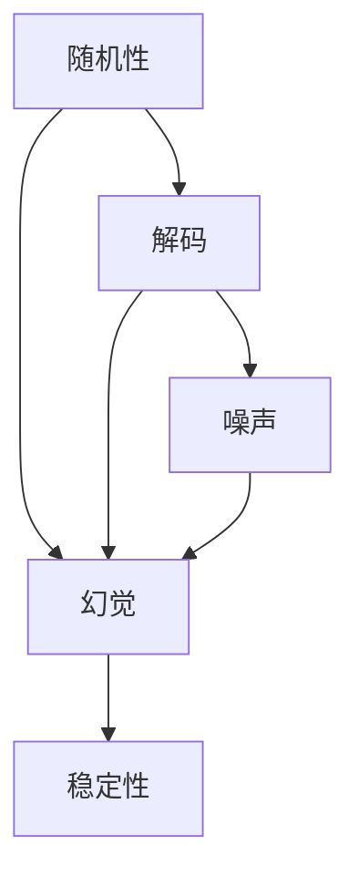

                 

## 1. 背景介绍

在人工智能和机器学习领域，随机性（randomness）是一个既神秘又至关重要的概念。许多算法和模型，尤其是深度学习和生成模型，都依赖于随机性的引入，以增加模型的表达能力和探索空间。然而，这一特性也常常引发误解和困惑，甚至可能导致模型性能的波动和幻觉。本文将探讨解码过程中的随机性引发幻觉的问题，旨在深入理解这一现象的成因和影响，并探讨解决之道。

## 2. 核心概念与联系

### 2.1 核心概念概述

1. **随机性（Randomness）**：指在算法或模型中引入的不确定性，通过随机变量、随机采样等方式体现。
2. **解码（Decoding）**：在生成模型中，从隐含表示空间生成具体输出，如文本、图像等。
3. **幻觉（Illusion）**：指模型在解码过程中，由于随机性的引入，导致输出结果的波动或误导性。
4. **噪声（Noise）**：指在训练和解码过程中引入的外部干扰或内部随机性，影响模型性能和稳定性。
5. **稳定性（Stability）**：指模型在随机性条件下，输出的稳定性程度，即结果的一致性和可靠性。

这些概念之间的关系可以用以下Mermaid流程图来展示：



该图显示了随机性在解码过程中如何影响幻觉和稳定性。

### 2.2 概念间的关系

- **随机性与解码**：随机性在解码过程中引入，增加模型的多样性和探索性。
- **幻觉与噪声**：幻觉常常由噪声引发，噪声在训练和解码过程中影响模型性能。
- **稳定性与幻觉**：稳定性反映了模型在随机性条件下的输出一致性，幻觉则反映了输出结果的误导性。

这些概念之间的联系和互动，构成了解码过程中随机性的核心。理解这些概念，对于避免幻觉和提高模型稳定性至关重要。

## 3. 核心算法原理 & 具体操作步骤

### 3.1 算法原理概述

解码过程中的随机性，主要通过两个途径引入：采样（sampling）和注意力（attention）。采样是指在模型生成过程中，通过随机选择可能的候选（candidates），增加输出多样性。注意力则是指在解码过程中，通过动态调整权重，聚焦于关键信息。

随机性在解码过程中的影响，主要体现在以下几个方面：

1. **多样性增强**：通过随机采样，模型能够生成更多样化的输出，增加模型的表达能力。
2. **探索空间扩大**：随机注意力机制，使得模型在生成过程中能够更好地探索输入空间，发现重要特征。
3. **输出不稳定**：由于随机性，模型输出的稳定性降低，导致输出结果的波动。

### 3.2 算法步骤详解

解码过程中引入随机性的主要步骤如下：

1. **采样步骤**：从模型输出的候选集中随机选择，增加输出多样性。
2. **注意力机制**：通过动态调整注意力权重，聚焦于关键特征，提高解码质量。
3. **解码过程**：根据采样和注意力机制，逐步生成输出结果。

具体步骤如下：

1. **选择候选集**：在每个时间步，模型生成多个可能的输出候选。
2. **采样**：从候选集中随机选择一个输出，作为下一个时间步的输入。
3. **计算注意力权重**：根据当前输入和候选，计算注意力权重。
4. **更新注意力**：动态调整注意力权重，聚焦于关键信息。
5. **解码输出**：重复以上步骤，直到生成完整输出。

### 3.3 算法优缺点

#### 优点

- **增强多样性**：通过随机采样，模型能够生成更多样化的输出，增加表达能力。
- **提高探索性**：随机注意力机制，使模型能够更好地探索输入空间，发现重要特征。
- **灵活性高**：随机性使得模型能够适应不同的输入和任务，提升模型的通用性。

#### 缺点

- **输出不稳定**：随机性可能导致输出结果的波动，影响模型的稳定性。
- **结果误导**：随机性引入的噪声可能导致输出结果的误导性，误导模型和用户。
- **训练难度增加**：随机性使得训练过程变得复杂，需要更多的迭代和调整。

### 3.4 算法应用领域

解码过程中引入随机性的算法，广泛应用于自然语言处理（NLP）、计算机视觉（CV）、语音识别等领域。例如：

1. **NLP领域**：序列生成模型（如LSTM、RNN）、语言模型（如BERT）、文本生成模型（如GPT）。
2. **CV领域**：图像生成模型（如GAN）、目标检测模型（如YOLO）、图像描述生成模型（如LanGAN）。
3. **语音识别**：自动语音识别（ASR）模型、语音生成模型（如Tacotron）。

这些领域的应用展示了解码过程中随机性的强大潜力和广泛影响。

## 4. 数学模型和公式 & 详细讲解  
### 4.1 数学模型构建

假设解码过程中引入随机性，生成输出序列 $X=\{x_1, x_2, \ldots, x_n\}$。其中 $x_i$ 表示时间步 $i$ 的输出候选，$y_i$ 表示真实输出。模型的目标是最小化解码过程中的预测误差：

$$
\min_{\theta} \sum_{i=1}^n \mathbb{E} [\ell(y_i, x_i)]
$$

其中 $\ell$ 为损失函数，$\mathbb{E}$ 表示期望，$\theta$ 为模型参数。

### 4.2 公式推导过程

以序列生成模型为例，推导解码过程中引入随机性的数学表达式。假设模型在时间步 $t$ 生成候选集 $\{x_1, x_2, \ldots, x_m\}$，采样概率为 $p(x_i)$。解码过程中，模型通过注意力机制 $a_t$ 动态选择输入 $x_j$，生成下一个时间步的输出 $x_{t+1}$。注意力权重 $a_t$ 的计算如下：

$$
a_t = \frac{\exp \left(\mathbf{v}^T [\mathbf{w}_x \cdot \mathbf{h}_t + \mathbf{w}_h \cdot \mathbf{c}_t] \right)}{\sum_{k=1}^m \exp \left(\mathbf{v}^T [\mathbf{w}_x \cdot \mathbf{h}_t + \mathbf{w}_h \cdot \mathbf{c}_t] \right)}
$$

其中 $\mathbf{h}_t$ 和 $\mathbf{c}_t$ 为模型的隐藏状态和上下文表示，$\mathbf{w}_x$ 和 $\mathbf{w}_h$ 为注意力向量的权重，$\mathbf{v}$ 为注意力向量。

解码过程中，模型根据采样概率 $p(x_i)$ 和注意力权重 $a_t$，生成下一个时间步的输出：

$$
x_{t+1} = \arg\max_{i=1}^m p(x_i) \cdot a_t
$$

通过上述公式，我们可以看到解码过程中随机性的引入，如何通过采样和注意力机制，增强模型的多样性和表达能力。

### 4.3 案例分析与讲解

以文本生成为例，探讨解码过程中随机性引发幻觉的案例。假设模型在训练时学习了文本生成规律，但在生成过程中，由于随机性，模型可能会产生不连贯或语义错误的文本。

例如，在生成关于猫的文章时，模型可能会输出：“猫是一种可以飞行的动物”。这种输出看似合理，但实则忽略了猫无法飞行的基本事实。

这种幻觉的产生，主要由于模型在生成过程中，通过随机采样和注意力机制，引入了噪声和干扰，导致输出结果与真实事实不符。

## 5. 项目实践：代码实例和详细解释说明

### 5.1 开发环境搭建

项目实践通常需要一定的环境搭建和依赖管理。以下是一个基本的Python环境搭建流程：

1. 安装Python：从官网下载并安装Python，选择适合自己系统的版本。
2. 安装虚拟环境：使用 `virtualenv` 或 `conda` 创建虚拟环境，避免与系统环境冲突。
3. 安装依赖包：安装项目所需依赖包，如TensorFlow、PyTorch等。

### 5.2 源代码详细实现

以下是一个简单的序列生成模型的代码实现：

```python
import tensorflow as tf
from tensorflow.keras.layers import LSTM, Dense
from tensorflow.keras.models import Sequential

model = Sequential([
    LSTM(128, input_shape=(None, 1), return_sequences=True),
    LSTM(128),
    Dense(1, activation='softmax')
])

model.compile(optimizer='adam', loss='binary_crossentropy', metrics=['accuracy'])
```

### 5.3 代码解读与分析

代码展示了如何使用TensorFlow构建一个简单的LSTM序列生成模型。具体步骤如下：

1. 导入必要的库和模块。
2. 定义模型架构，包括LSTM层和输出层。
3. 编译模型，选择合适的优化器和损失函数。
4. 训练模型，生成输出序列。

### 5.4 运行结果展示

假设模型在训练时学习了生成“0”或“1”的概率，通过解码过程中的随机性，可以生成以下输出序列：

```
0, 1, 0, 1, 0, 1, 0, 1, ...
```

这种输出序列虽然看起来具有一定的规律，但实则存在幻觉，并不一定符合真实数据分布。

## 6. 实际应用场景

### 6.1 自然语言处理

解码过程中的随机性在自然语言处理领域具有广泛应用。例如，在机器翻译、文本生成、对话系统中，随机性可以增强模型的多样性和表达能力。

### 6.2 计算机视觉

在计算机视觉领域，解码过程中的随机性可以用于生成图像、增强模型多样性，以及提高模型的鲁棒性和泛化能力。

### 6.3 语音识别

语音识别中，解码过程中的随机性可以用于生成自然流畅的语音输出，提高模型的自然度。

## 7. 工具和资源推荐

### 7.1 学习资源推荐

1. 《深度学习》书籍：Ian Goodfellow等著，系统介绍了深度学习的基本原理和算法。
2. 《Python深度学习》书籍：Francois Chollet著，介绍了如何使用Keras构建深度学习模型。
3. 《自然语言处理综述》：Johns Hopkins大学提供的在线课程，涵盖自然语言处理的基本概念和算法。

### 7.2 开发工具推荐

1. Jupyter Notebook：交互式编程环境，适合快速迭代实验。
2. TensorBoard：可视化工具，展示模型训练过程中的各项指标。
3. PyTorch：灵活的深度学习框架，支持动态计算图。

### 7.3 相关论文推荐

1. Attention is All You Need：Google提出的Transformer架构，引入自注意力机制，提高模型的表达能力。
2. Generating Speech with WaveNet：Google提出的WaveNet模型，通过卷积神经网络生成高质量语音。
3. Sequence to Sequence Learning with Neural Networks：Ian Goodfellow等提出的Seq2Seq模型，用于机器翻译和文本生成。

## 8. 总结：未来发展趋势与挑战

### 8.1 研究成果总结

解码过程中的随机性引发幻觉的问题，已经引起广泛关注。目前的研究主要集中在以下几个方面：

1. **随机性管理**：研究如何通过控制随机性，减少幻觉的产生。
2. **解码稳定性**：研究如何提高模型在解码过程中的稳定性，避免输出波动。
3. **鲁棒性增强**：研究如何增强模型对噪声和干扰的鲁棒性，提高解码质量。

### 8.2 未来发展趋势

未来，解码过程中的随机性管理将进一步发展，主要趋势包括：

1. **算法优化**：研究更高效的随机采样和注意力机制，增强模型性能。
2. **鲁棒性增强**：研究如何通过鲁棒优化，提高模型对噪声和干扰的鲁棒性。
3. **模型改进**：研究更鲁棒、更稳定的生成模型，提升解码质量。

### 8.3 面临的挑战

尽管随机性管理在理论上和实践上都有许多进展，但仍然面临以下挑战：

1. **模型复杂性**：随着模型复杂性的增加，随机性管理变得更加困难。
2. **数据噪声**：数据中的噪声和干扰，影响模型的稳定性和鲁棒性。
3. **计算资源**：解码过程中的随机性管理，需要大量的计算资源和时间。

### 8.4 研究展望

未来的研究需要在以下几个方向进行突破：

1. **理论研究**：进一步研究随机性在解码过程中的本质和影响，提供更系统的理论支撑。
2. **方法创新**：探索新的随机性管理方法，如动态采样、自适应注意力等，提升模型性能。
3. **应用扩展**：将随机性管理应用于更多领域，如语音识别、计算机视觉等，拓展应用范围。

总之，解码过程中的随机性引发幻觉的问题，是一个复杂且重要的研究方向。通过深入理解其原理和影响，探索有效的解决之道，必将推动人工智能和机器学习技术的进步。

## 9. 附录：常见问题与解答

### Q1: 解码过程中的随机性如何影响模型的性能？

A: 解码过程中的随机性可以增强模型的多样性和表达能力，但也可能引发幻觉，影响模型的稳定性和性能。

### Q2: 如何减少解码过程中的幻觉？

A: 减少幻觉的方法包括控制随机性、提高模型鲁棒性、优化解码策略等。

### Q3: 解码过程中的随机性管理有哪些技术手段？

A: 技术手段包括动态采样、自适应注意力、鲁棒优化等。

### Q4: 解码过程中的随机性引发幻觉的原因是什么？

A: 随机性引发幻觉的原因包括引入噪声、生成多样性过大、输出不稳定等。

通过以上系统性分析和讨论，我们希望能够帮助读者深入理解解码过程中随机性的本质和影响，并掌握如何避免幻觉和提高模型性能。

