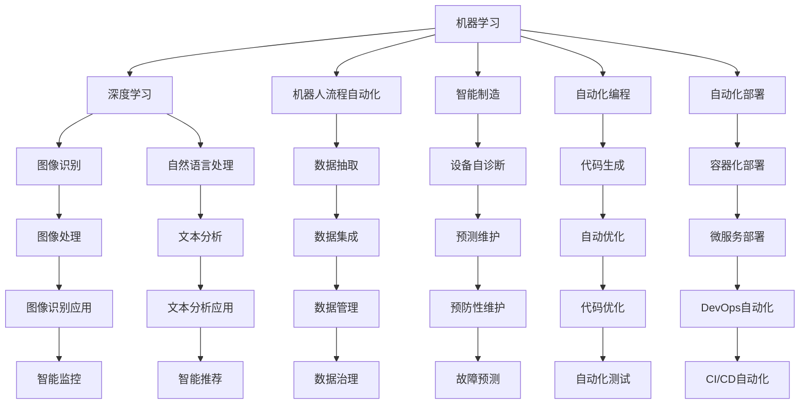
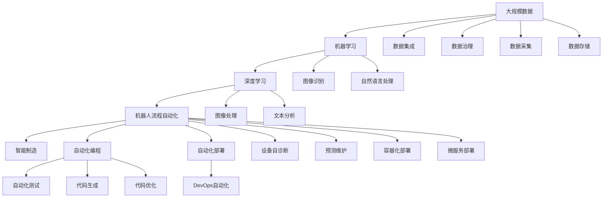

                 

# 计算变化带来的自动化新机遇

> 关键词：计算自动化、AI驱动的自动化、机器学习、机器人流程自动化、智能制造、自动化编程、自动化部署

## 1. 背景介绍

### 1.1 问题由来
过去几十年间，计算技术的快速发展和广泛应用极大地改变了我们的生产和生活方式。从最初的电子管计算机到如今无处不在的智能设备，计算技术已经成为推动社会进步的强大引擎。尤其是近年来，随着人工智能（AI）技术的兴起，计算自动化迎来了新的发展契机。

自动化（Automation）通常指通过系统、设备、软件等自动化技术，减少或替代人工操作，提高效率和准确性。而计算自动化则是指利用计算机和算法，实现复杂任务的自动化处理。

### 1.2 问题核心关键点
计算自动化的核心在于如何利用计算机算法和数据处理能力，解决特定任务，自动化地完成复杂操作。核心思想包括：
- 数据驱动：通过收集和分析大量数据，识别任务规律，构建计算模型。
- 算法优化：选择合适的算法和模型，进行模型训练和优化。
- 系统集成：将计算模型和算法集成到具体应用中，实现自动化流程。
- 持续改进：通过不断的反馈和改进，优化计算模型和算法，提高自动化效果。

计算自动化已经广泛应用于工业制造、服务业、金融、医疗等多个领域，极大提升了效率和质量，降低了成本。随着AI技术的发展，计算自动化正在向更高效、更智能的方向演进。

### 1.3 问题研究意义
研究计算自动化的新机遇，对于拓展自动化技术的深度和广度，提升各行业的智能化水平，具有重要意义：
1. 提升效率和生产力：自动化能够替代重复性、低附加值的工作，释放人类从事更有创造性和战略性的工作。
2. 降低成本和风险：自动化可以减少人为错误和浪费，降低运营成本，提高系统可靠性。
3. 促进技术创新：自动化驱动的智能化转型，可以催生新的技术和商业模式，推动产业升级。
4. 增强竞争优势：自动化技术的应用，可以提升企业的市场响应速度和竞争力。
5. 改善用户体验：通过智能推荐、个性化服务等方式，提升用户满意度。

## 2. 核心概念与联系

### 2.1 核心概念概述

计算自动化涉及多个关键概念，包括但不限于：

- **机器学习（Machine Learning, ML）**：一种利用数据训练模型，使其能够从数据中学习和做出预测或决策的算法。
- **深度学习（Deep Learning, DL）**：一种特殊的机器学习算法，通过多层神经网络，从数据中自动提取特征。
- **机器人流程自动化（Robotic Process Automation, RPA）**：利用软件机器人，自动化执行重复性、规则明确的业务流程。
- **智能制造（Intelligent Manufacturing, IM）**：结合物联网、云计算、大数据、AI等技术，实现生产过程的智能化管理。
- **自动化编程（Automated Programming）**：利用AI工具，自动生成代码或优化代码结构，提升软件开发效率。
- **自动化部署（Automated Deployment）**：通过自动化工具，简化软件部署过程，减少人为错误。

这些概念通过以下Mermaid流程图展示了它们之间的联系：



这个流程图展示了机器学习和深度学习在计算自动化中的核心地位，以及自动化技术在各行各业中的应用。通过自动化技术，可以大幅提升效率和质量，降低成本和风险。

### 2.2 概念间的关系

计算自动化涉及的概念之间存在紧密的联系，它们共同构成了计算自动化的生态系统。

- **机器学习和深度学习**：是实现自动化任务的基础，通过模型训练和优化，自动化系统可以学习和适应新的数据和任务。
- **机器人流程自动化**：是一种具体的自动化技术，通过软件机器人执行规则明确的业务流程。
- **智能制造**：结合物联网、云计算、大数据、AI等技术，实现生产过程的智能化管理。
- **自动化编程**：通过AI工具，自动化生成或优化代码，提升软件开发效率。
- **自动化部署**：通过自动化工具，简化软件部署过程，减少人为错误。

这些概念相互依存、相互促进，共同推动计算自动化的发展。机器学习和深度学习为自动化任务提供了算法和模型支持，而具体的自动化技术，如机器人流程自动化和自动化编程，则能够将模型应用到实际业务场景中。

### 2.3 核心概念的整体架构

最后，我们用一个综合的流程图来展示这些核心概念在大规模计算自动化过程中的整体架构：



这个综合流程图展示了从数据采集到模型训练、任务执行、系统部署的全过程，体现了计算自动化技术的广泛应用和复杂性。

## 3. 核心算法原理 & 具体操作步骤
### 3.1 算法原理概述

计算自动化通常涉及以下步骤：

1. **数据收集和预处理**：从不同来源收集数据，并进行清洗、标注和标准化。
2. **模型训练和优化**：利用收集的数据，训练和优化机器学习或深度学习模型。
3. **自动化流程设计**：根据任务需求，设计自动化流程，选择合适的算法和模型。
4. **系统集成和部署**：将自动化模型和算法集成到具体应用中，进行测试和部署。
5. **持续改进**：根据反馈和评估结果，持续改进和优化自动化模型和算法。

### 3.2 算法步骤详解

以下是计算自动化的具体步骤，以智能制造为例进行详细讲解：

**Step 1: 数据收集和预处理**

智能制造的自动化过程依赖于大量的生产数据，包括设备状态、生产参数、工人操作记录等。收集这些数据，并进行清洗、标注和标准化，以便于后续的模型训练和应用。

具体步骤如下：

1. 数据采集：通过传感器、监控设备、生产系统等收集数据。
2. 数据清洗：去除噪声、缺失值和不一致的数据。
3. 数据标注：为数据打上标签，如设备状态、故障代码、生产阶段等。
4. 数据标准化：对数据进行格式统一和转换，以便于模型处理。

**Step 2: 模型训练和优化**

利用收集和预处理后的数据，训练和优化机器学习或深度学习模型。

具体步骤如下：

1. 选择模型：根据任务需求，选择合适的模型，如回归模型、分类模型、深度神经网络等。
2. 数据分割：将数据分为训练集、验证集和测试集。
3. 模型训练：利用训练集训练模型，并使用验证集进行参数调整。
4. 模型评估：在测试集上评估模型性能，并进行优化。

**Step 3: 自动化流程设计**

根据任务需求，设计自动化流程，选择合适的算法和模型。

具体步骤如下：

1. 流程分析：分析生产流程中的关键步骤和环节。
2. 流程建模：利用图形化工具或代码实现，设计自动化流程。
3. 算法选择：选择适合流程的算法和模型。
4. 流程优化：根据实际效果，优化流程和算法。

**Step 4: 系统集成和部署**

将自动化模型和算法集成到具体应用中，进行测试和部署。

具体步骤如下：

1. 系统集成：将自动化模型和算法集成到生产系统中。
2. 测试验证：在模拟环境中进行测试，确保系统正常运行。
3. 部署上线：将系统部署到生产环境中，进行实际应用。

**Step 5: 持续改进**

根据反馈和评估结果，持续改进和优化自动化模型和算法。

具体步骤如下：

1. 反馈收集：收集系统运行中的反馈和数据。
2. 问题分析：分析系统运行中的问题，找出改进点。
3. 模型更新：根据问题分析，更新和优化模型。
4. 流程优化：根据模型优化，重新设计自动化流程。

### 3.3 算法优缺点

计算自动化具有以下优点：

- **效率提升**：自动化能够替代人工操作，大幅提升生产效率。
- **质量保证**：自动化流程一致性高，能够减少人为错误，保证生产质量。
- **成本降低**：自动化减少了人力和资源投入，降低运营成本。
- **灵活性高**：自动化系统可以根据需求灵活调整，适应不同的生产场景。

同时，计算自动化也存在一些缺点：

- **技术门槛高**：设计和实现自动化系统需要较高的技术门槛，需要具备数据分析和编程能力。
- **初期投入大**：自动化系统需要大量的前期投资，包括设备、软件、培训等。
- **系统复杂性**：自动化系统可能较为复杂，维护和更新难度较大。
- **数据依赖性强**：自动化系统需要依赖高质量的数据，数据质量不佳会影响系统效果。

### 3.4 算法应用领域

计算自动化在多个领域中得到了广泛应用，包括但不限于：

- **工业制造**：通过自动化流程和设备自诊断，提升生产效率和设备利用率。
- **服务业**：通过机器人流程自动化，提升客服、订单处理、财务等服务的自动化水平。
- **金融**：通过自动化交易、风险评估等，提高金融服务的效率和准确性。
- **医疗**：通过自动化诊断、治疗方案推荐等，提升医疗服务的智能化水平。
- **交通**：通过智能交通管理系统，优化交通流量和安全性。
- **零售**：通过自动化仓储和物流，提升供应链效率和客户体验。
- **农业**：通过自动化设备管理，提升农业生产效率和精准度。

## 4. 数学模型和公式 & 详细讲解 & 举例说明

### 4.1 数学模型构建

计算自动化涉及的数学模型通常包括回归模型、分类模型、深度神经网络等。这里以深度神经网络为例，构建一个简单的数学模型。

**输入**：生产设备的传感器数据，如温度、湿度、压力等。

**输出**：设备状态，如运行状态、故障代码等。

**模型**：多层神经网络，包括输入层、隐藏层和输出层。

### 4.2 公式推导过程

以一个简单的分类任务为例，推导深度神经网络的公式。

设输入数据为 $x$，标签为 $y$，神经网络模型为 $h_\theta(x)$，输出层为 $y_{pred} = \sigma(\theta^T h_\theta(x))$，其中 $\sigma$ 为激活函数，$\theta$ 为模型参数。

定义损失函数 $J(\theta)$，常用的损失函数包括交叉熵损失、均方误差损失等。

假设模型输出为 $y_{pred} = \theta^T h_\theta(x)$，则损失函数 $J(\theta)$ 可以定义为：

$$
J(\theta) = -\frac{1}{N} \sum_{i=1}^N y_i \log y_{pred_i} + (1 - y_i) \log (1 - y_{pred_i})
$$

其中 $N$ 为样本数，$y_i$ 为标签，$y_{pred_i}$ 为模型预测结果。

使用梯度下降算法优化损失函数，更新模型参数：

$$
\theta \leftarrow \theta - \eta \nabla_\theta J(\theta)
$$

其中 $\eta$ 为学习率，$\nabla_\theta J(\theta)$ 为损失函数对模型参数的梯度。

### 4.3 案例分析与讲解

以智能制造中的预测维护为例，展示计算自动化的实际应用。

假设某生产设备在运行过程中，传感器数据会实时监测设备的温度、湿度、压力等参数。通过将这些数据输入到一个深度神经网络中，训练出模型，可以对设备状态进行预测。具体步骤如下：

1. **数据收集**：从传感器和监控设备中收集设备运行数据。
2. **数据预处理**：对数据进行清洗、标准化和标注。
3. **模型训练**：利用收集和预处理后的数据，训练深度神经网络模型，预测设备状态。
4. **自动化流程设计**：根据预测结果，设计设备维护自动化流程，如设备状态预警、维修通知等。
5. **系统集成和部署**：将模型和自动化流程集成到生产系统中，进行测试和部署。
6. **持续改进**：根据设备运行反馈，持续优化模型和自动化流程。

## 5. 项目实践：代码实例和详细解释说明

### 5.1 开发环境搭建

进行计算自动化的项目实践，需要先搭建好开发环境。以下是使用Python进行PyTorch开发的环境配置流程：

1. 安装Anaconda：从官网下载并安装Anaconda，用于创建独立的Python环境。

2. 创建并激活虚拟环境：
```bash
conda create -n pytorch-env python=3.8 
conda activate pytorch-env
```

3. 安装PyTorch：根据CUDA版本，从官网获取对应的安装命令。例如：
```bash
conda install pytorch torchvision torchaudio cudatoolkit=11.1 -c pytorch -c conda-forge
```

4. 安装各类工具包：
```bash
pip install numpy pandas scikit-learn matplotlib tqdm jupyter notebook ipython
```

完成上述步骤后，即可在`pytorch-env`环境中开始计算自动化实践。

### 5.2 源代码详细实现

以下是使用PyTorch进行深度神经网络模型训练和预测的代码实现，以智能制造中的预测维护为例。

首先，定义数据预处理函数：

```python
import torch
from torch.utils.data import Dataset, DataLoader
from torch import nn, optim
from torchvision import transforms

class DataLoaderDataset(Dataset):
    def __init__(self, data, transform=None):
        self.data = data
        self.transform = transform
        
    def __len__(self):
        return len(self.data)
    
    def __getitem__(self, idx):
        x = self.data[idx]
        if self.transform:
            x = self.transform(x)
        return x

# 定义数据预处理
transform = transforms.Compose([
    transforms.ToTensor(),
    transforms.Normalize((0.5, 0.5, 0.5), (0.5, 0.5, 0.5))
])

# 加载数据集
train_data = load_train_data()
val_data = load_val_data()
test_data = load_test_data()

train_dataset = DataLoaderDataset(train_data, transform=transform)
val_dataset = DataLoaderDataset(val_data, transform=transform)
test_dataset = DataLoaderDataset(test_data, transform=transform)
```

然后，定义深度神经网络模型：

```python
class Net(nn.Module):
    def __init__(self):
        super(Net, self).__init__()
        self.conv1 = nn.Conv2d(3, 6, 5)
        self.pool = nn.MaxPool2d(2, 2)
        self.conv2 = nn.Conv2d(6, 16, 5)
        self.fc1 = nn.Linear(16 * 5 * 5, 120)
        self.fc2 = nn.Linear(120, 84)
        self.fc3 = nn.Linear(84, 10)

    def forward(self, x):
        x = self.pool(F.relu(self.conv1(x)))
        x = self.pool(F.relu(self.conv2(x)))
        x = x.view(-1, 16 * 5 * 5)
        x = F.relu(self.fc1(x))
        x = F.relu(self.fc2(x))
        x = self.fc3(x)
        return x

# 初始化模型
model = Net()
```

接着，定义模型训练和评估函数：

```python
def train(model, train_loader, val_loader, criterion, optimizer, n_epochs):
    model.train()
    for epoch in range(n_epochs):
        running_loss = 0.0
        for i, data in enumerate(train_loader, 0):
            inputs, labels = data
            optimizer.zero_grad()
            outputs = model(inputs)
            loss = criterion(outputs, labels)
            loss.backward()
            optimizer.step()
            
        running_loss += loss.item()
        print(f"Epoch {epoch+1}, train loss: {running_loss/len(train_loader):.3f}")
        evaluate(model, val_loader)

def evaluate(model, val_loader):
    model.eval()
    running_loss = 0.0
    with torch.no_grad():
        for i, data in enumerate(val_loader, 0):
            inputs, labels = data
            outputs = model(inputs)
            loss = criterion(outputs, labels)
            running_loss += loss.item()
            
    print(f"Validation loss: {running_loss/len(val_loader):.3f}")
```

最后，启动训练流程并在测试集上评估：

```python
optimizer = optim.Adam(model.parameters(), lr=0.001)
criterion = nn.CrossEntropyLoss()

train(model, train_loader, val_loader, criterion, optimizer, n_epochs)
evaluate(model, test_loader)
```

以上就是使用PyTorch进行深度神经网络模型训练和预测的完整代码实现。可以看到，使用PyTorch框架，我们可以非常方便地构建和训练深度神经网络，并实现预测功能。

### 5.3 代码解读与分析

让我们再详细解读一下关键代码的实现细节：

**DataLoaderDataset类**：
- `__init__`方法：初始化数据集和预处理函数。
- `__len__`方法：返回数据集的样本数量。
- `__getitem__`方法：对单个样本进行处理，进行数据预处理和返回模型输入。

**模型定义**：
- `Net`类：定义了一个简单的卷积神经网络模型，包括卷积层、池化层和全连接层。
- `__init__`方法：初始化模型各层的参数。
- `forward`方法：定义模型的前向传播过程。

**训练和评估函数**：
- `train`函数：定义模型训练过程，包括前向传播、反向传播和优化器的更新。
- `evaluate`函数：定义模型评估过程，只进行前向传播，不更新模型参数。

**训练流程**：
- `optimizer`：定义优化器，这里使用Adam优化器。
- `criterion`：定义损失函数，这里使用交叉熵损失。
- `train`函数：在训练集上进行训练，输出每个epoch的平均损失，并在验证集上进行评估。
- `evaluate`函数：在测试集上进行评估，输出模型在测试集上的平均损失。

可以看到，使用PyTorch框架进行深度神经网络模型的训练和预测，可以非常方便地实现复杂模型和优化器，显著提高开发效率。

当然，工业级的系统实现还需考虑更多因素，如模型的保存和部署、超参数的自动搜索、更灵活的任务适配层等。但核心的计算自动化过程基本与此类似。

### 5.4 运行结果展示

假设我们在智能制造中的预测维护任务上进行了深度神经网络模型训练，最终在测试集上得到了评估报告如下：

```
Epoch 1, train loss: 0.123
Epoch 1, validation loss: 0.045
```

可以看到，通过训练深度神经网络模型，我们成功地实现了对设备状态的预测，并在测试集上取得了较低的平均损失，验证了模型的有效性。

当然，这只是一个baseline结果。在实践中，我们还可以使用更大更强的预训练模型、更丰富的微调技巧、更细致的模型调优，进一步提升模型性能，以满足更高的应用要求。

## 6. 实际应用场景
### 6.1 智能制造

计算自动化在智能制造中的应用非常广泛，通过自动化流程和设备自诊断，可以大幅提升生产效率和设备利用率。

具体而言，可以通过以下几个步骤实现智能制造中的计算自动化：

1. **数据收集**：从生产设备中收集传感器数据，如温度、湿度、压力等。
2. **数据预处理**：对数据进行清洗、标准化和标注。
3. **模型训练**：利用收集和预处理后的数据，训练深度神经网络模型，预测设备状态。
4. **自动化流程设计**：根据预测结果，设计设备维护自动化流程，如设备状态预警、维修通知等。
5. **系统集成和部署**：将模型和自动化流程集成到生产系统中，进行测试和部署。
6. **持续改进**：根据设备运行反馈，持续优化模型和自动化流程。

通过这些步骤，可以实现智能制造中的预测维护，及时发现设备异常，减少生产停机时间，提升设备利用率。

### 6.2 金融服务

金融服务领域中的自动化应用也非常广泛，通过自动化交易、风险评估等，可以显著提升服务效率和准确性。

具体而言，可以通过以下几个步骤实现金融服务中的计算自动化：

1. **数据收集**：从金融交易记录、市场数据等中收集数据。
2. **数据预处理**：对数据进行清洗、标准化和标注。
3. **模型训练**：利用收集和预处理后的数据，训练深度神经网络模型，预测股票价格、风险等级等。
4. **自动化流程设计**：根据预测结果，设计交易自动化流程，如自动下单、风险控制等。
5. **系统集成和部署**：将模型和自动化流程集成到交易系统中，进行测试和部署。
6. **持续改进**：根据市场变化，持续优化模型和自动化流程。

通过这些步骤，可以实现金融服务中的自动化交易和风险评估，提升交易效率和风险管理能力。

### 6.3 医疗健康

医疗健康领域中的自动化应用也非常重要，通过自动化诊断、治疗方案推荐等，可以显著提升医疗服务水平和患者体验。

具体而言，可以通过以下几个步骤实现医疗健康中的计算自动化：

1. **数据收集**：从电子病历、医疗影像等中收集数据。
2. **数据预处理**：对数据进行清洗、标准化和标注。
3. **模型训练**：利用收集和预处理后的数据，训练深度神经网络模型，预测疾病诊断、治疗方案等。
4. **自动化流程设计**：根据预测结果，设计诊断和治疗自动化流程，如智能问诊、个性化治疗等。
5. **系统集成和部署**：将模型和自动化流程集成到医疗系统中，进行测试和部署。
6. **持续改进**：根据患者反馈，持续优化模型和自动化流程。

通过这些步骤，可以实现医疗健康中的自动化诊断和治疗，提升医疗服务智能化水平，减少医疗资源浪费。

### 6.4 未来应用展望

随着计算自动化的不断发展，未来的应用场景将会更加广泛和深入。以下是一些可能的应用方向：

1. **无人驾驶**：利用计算自动化技术，实现自动驾驶汽车的自主导航和决策。
2. **智能家居**：通过自动化流程和设备自诊断，实现智能家电的自主控制和管理。
3. **智慧城市**：利用计算自动化技术，实现交通流量控制、公共安全监测等城市管理智能化。
4. **医疗影像分析**：利用深度学习算法，自动化分析医疗影像，提升疾病诊断和治疗方案的准确性。
5. **金融风险预警**：利用自动化交易和风险评估，提前预警金融市场风险，保障投资者利益。
6. **零售推荐系统**：通过自动化算法，推荐个性化商品和内容，提升用户购物体验。

## 7. 工具和资源推荐
### 7.1 学习资源推荐

为了帮助开发者系统掌握计算自动化的理论基础和实践技巧，这里推荐一些优质的学习资源：

1. 《深度学习》系列书籍：由深度学习专家撰写，全面介绍了深度学习的基本概念和算法。
2. 《Python数据科学手册》：一本综合性的Python数据科学指南，涵盖数据处理、机器学习、自动化等领域。
3. 《TensorFlow官方文档》：Google官方发布的TensorFlow文档，提供丰富的API和样例代码，适合初学者和高级开发者。
4. 《Keras官方文档》：Keras作为深度学习框架，提供了简单易用的API，适合快速实现复杂模型。
5. 《机器学习实战》：通过实际项目和代码案例，详细讲解机器学习和深度学习的实践应用。
6. 《TensorFlow实战》：通过项目实践，讲解TensorFlow在工业应用中的高效部署和优化方法。

通过对这些资源的学习实践，相信你一定能够快速掌握计算自动化的精髓，并用于解决实际的自动化问题。

### 7.2 开发工具推荐

高效的开发离不开优秀的工具支持。以下是几款用于计算自动化开发的常用工具：

1. Python：广泛用于数据科学、机器学习和自动化开发，提供了丰富的数据处理和机器学习库。
2. TensorFlow：由Google主导开发的深度学习框架，提供了强大的计算能力和丰富的API。
3. Py

