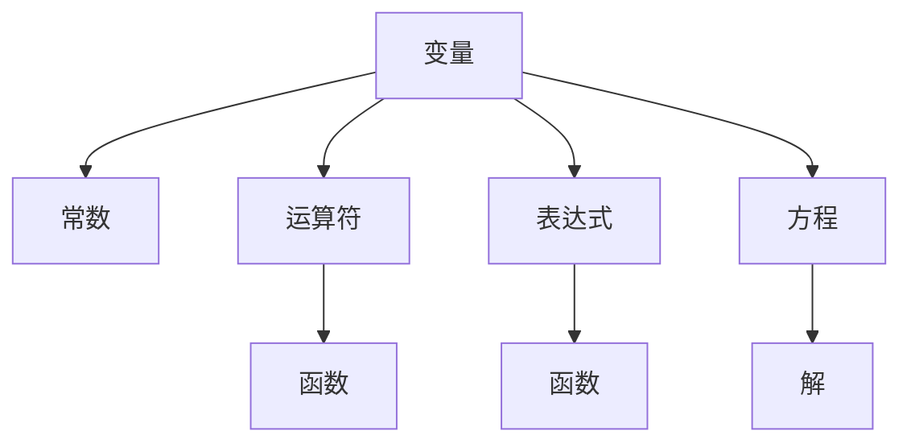
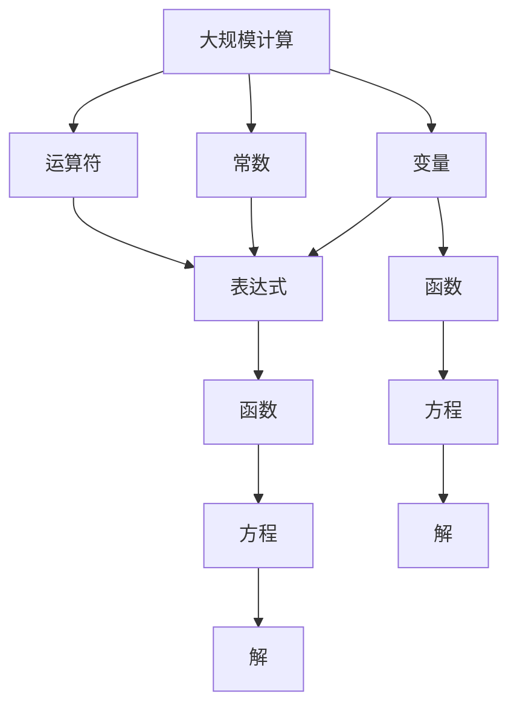

                 

# 计算：第一部分 计算的诞生 第 2 章 计算之术 代数符号

## 1. 背景介绍

### 1.1 问题由来
在计算科学的早期发展阶段，数学符号的引入和使用对推动科学计算的重要性不言而喻。自16世纪以来，数学符号在几何学、物理学、工程学等诸多领域中逐渐成为研究的重要工具。例如，在1631年，法国数学家René Descartes提出了直角坐标系的概念，并引入了一系列数学符号（如$x, y, z$）来描述空间中的点，从而为解析几何和微积分的发展奠定了基础。

随后，德国数学家Gottfried Wilhelm Leibniz在1684年引入导数符号$\frac{d}{dx}$，使得微积分得以系统化表达和应用。Leibniz与英国数学家Isaac Newton在微积分领域并驾齐驱，共同推动了现代数学和科学计算的发展。

尽管数学符号的使用在数学家之间早已普及，但直到19世纪，数学符号的普及和标准化才成为全球范围内的共识。例如，德国数学家Peter Gustav Lejeune Dirichlet在19世纪中叶推广了三角函数符号$\sin, \cos, \tan$等，成为现代数学教育的重要组成部分。

### 1.2 问题核心关键点
代数符号的核心在于，它们提供了一种简洁、高效的方式，使得复杂的数学运算和概念得以被系统化表达。具体而言，代数符号能够：
- **简化表达**：将复杂的数学表达式转化为简化的形式，如$x^2 + 2x + 1 = (x+1)^2$。
- **抽象思维**：提供一种抽象的思维方式，如变量$x$可以代表任何数，$+,-,\cdot,\div$等符号表示基本的算术运算。
- **促进交流**：统一数学表达，使得不同地域、不同文化的数学家可以无障碍地交流和合作。
- **提高效率**：在数学研究和应用中，使用符号可以显著提高计算和推理的效率，如微积分中的导数、积分符号$\frac{d}{dx}, \int$等。

### 1.3 问题研究意义
代数符号的引入和使用，对数学和科学计算的发展产生了深远影响。具体而言：
- **促进了数学理论的发展**：代数符号提供了强大的表达能力，使得数学家能够更高效地构建和验证各种数学理论和公式。
- **加速了科学计算**：代数符号和代数学方法被广泛应用于物理学、工程学、计算机科学等科学计算领域，大大加速了这些学科的发展。
- **提高了数学教育质量**：代数符号和代数学方法成为现代数学教育的重要内容，为学生提供了一种高效的思维方式和工具。
- **推动了计算机科学的诞生**：代数符号和代数学方法为现代计算机科学的算法设计和实现提供了重要借鉴，如数值分析和计算几何。

## 2. 核心概念与联系

### 2.1 核心概念概述

为了更深入地理解代数符号在计算中的作用，本节将介绍几个关键概念：

- **变量**：代表一个数值的符号，如$x, y, z$等。变量可以取任意实数或复数。
- **常数**：数值固定的符号，如$2, \pi, e$等。常数在计算中不发生变化。
- **运算符**：表示基本算术运算和函数应用的符号，如$+, -, *, /, f(x)$等。
- **表达式**：由变量、常数、运算符组成的数学表达式，如$x^2 + 2x + 1$。
- **函数**：由一个或多个变量组成的表达式，如$f(x) = x^2 + 2x + 1$。
- **方程**：表示两个表达式相等的符号，如$x^2 + 2x + 1 = 0$。

这些概念通过一系列的逻辑关系和操作，构成了现代数学和科学计算的基础。

### 2.2 概念间的关系

这些核心概念之间的关系可以通过以下Mermaid流程图来展示：



这个流程图展示了变量、常数、运算符、表达式、函数和方程之间的逻辑关系：

1. 变量和常数是数学表达的基本元素。
2. 运算符用于连接变量和常数，形成表达式。
3. 表达式可以进一步组合成函数。
4. 方程表示两个表达式相等的条件。
5. 方程的解是使得方程成立的变量值。

### 2.3 核心概念的整体架构

最后，我们用一个综合的流程图来展示这些核心概念在大规模科学计算中的整体架构：



这个综合流程图展示了变量、常数、运算符、表达式、函数、方程和它们的解在大规模科学计算中的应用：

1. 在计算过程中，变量和常数是基本的输入元素。
2. 运算符用于连接这些元素，形成表达式和函数。
3. 函数和方程用于表示更复杂的数学关系。
4. 方程的解是计算过程的目标输出。

这些概念和大规模计算流程共同构成了数学和科学计算的基础框架。

## 3. 核心算法原理 & 具体操作步骤
### 3.1 算法原理概述

基于代数符号的计算原理，可以通过一系列的数学操作和推理，解决各种复杂的科学计算问题。具体而言，代数符号的计算原理包括以下几个关键步骤：

1. **变量代入**：将变量代入表达式，形成具体的数值表达式。
2. **运算操作**：进行基本的算术运算和函数应用，如加减乘除、幂次方、三角函数等。
3. **表达式化简**：通过合并同类项、分式化简等操作，简化表达式。
4. **求解方程**：将方程转化为具体的数值解，如代入法、消元法、矩阵求逆等。

这些步骤通过符号计算和代数操作，实现了对复杂数学问题的系统化表达和求解。

### 3.2 算法步骤详解

以下是一个基于代数符号的典型计算过程，以求解方程$x^2 + 2x + 1 = 0$为例，展示详细的步骤：

1. **变量代入**：将方程$x^2 + 2x + 1 = 0$中的变量$x$代入具体数值，形成方程$2^2 + 2 \cdot 2 + 1 = 0$。
2. **运算操作**：进行基本的算术运算，得到$4 + 4 + 1 = 9$。
3. **表达式化简**：将等式两边同时减去9，得到$9 = 9$。
4. **求解方程**：由于方程两边相等，解为$x = 2$。

### 3.3 算法优缺点

基于代数符号的计算方法具有以下优点：
- **简洁高效**：使用符号表达式，可以简洁地表达复杂的数学关系，提高计算效率。
- **通用性强**：符号表达式适用于各种数学问题和计算任务，具有广泛的适用性。
- **自动化处理**：符号计算软件（如Maple、Mathematica、SymPy等）可以自动进行复杂的代数操作和求解。

同时，代数符号的计算方法也存在以下缺点：
- **复杂度高**：对于非常复杂的数学问题，手动推导和计算可能会非常困难。
- **精度问题**：数值计算中，浮点数误差和精度问题可能会导致结果不准确。
- **理解难度**：对于初学者，理解符号表达式的含义和操作逻辑可能较为困难。

### 3.4 算法应用领域

代数符号的计算方法广泛应用于各种科学计算和工程领域，包括但不限于：

- **物理学**：如牛顿力学、电磁学、量子力学等，利用方程和符号表达式进行物理定律和现象的描述和计算。
- **工程学**：如结构工程、机械设计、电路分析等，利用函数和符号表达式进行设计和优化。
- **计算机科学**：如算法设计与分析、计算机图形学、数据结构等，利用符号表达式进行算法表达和优化。
- **统计学**：如概率分布、统计模型等，利用符号表达式进行数据建模和预测。
- **金融学**：如风险管理、投资分析等，利用方程和符号表达式进行财务分析和决策。

## 4. 数学模型和公式 & 详细讲解 & 举例说明

### 4.1 数学模型构建

代数符号的计算模型可以概括为以下几个部分：

- **输入**：变量和常数，表示计算中的基本元素。
- **运算规则**：加减乘除、幂次方、三角函数等基本运算规则。
- **表达式结构**：变量、常数、运算符等组成的基本表达式结构。
- **方程形式**：表示两个表达式相等的方程形式。
- **解法**：求解方程的具体方法，如代入法、消元法、矩阵求逆等。

### 4.2 公式推导过程

以微积分中的导数公式$\frac{d}{dx}x^n = nx^{n-1}$为例，展示公式的推导过程：

1. **变量代入**：设变量$x$，常数$n$，表示$x^n$的导数。
2. **运算操作**：根据导数定义，计算$x^n$的导数为$\lim_{h \to 0} \frac{(x+h)^n - x^n}{h}$。
3. **表达式化简**：展开上式，得到$\lim_{h \to 0} (nx^{n-1}h + \frac{n(n-1)}{2}x^{n-2}h^2 + \cdots + 1) / h$。
4. **求解方程**：根据极限运算，当$h \to 0$时，所有高阶项消失，最终结果为$nx^{n-1}$。

### 4.3 案例分析与讲解

假设有一个二元一次方程组：
\[
\begin{cases}
2x + 3y = 10 \\
4x - 2y = 8
\end{cases}
\]

1. **变量代入**：将方程组中的变量$x, y$代入具体数值，形成方程组$2 \cdot 2 + 3y = 10$和$4 \cdot 2 - 2y = 8$。
2. **运算操作**：进行基本的算术运算，得到$4 + 3y = 10$和$8 - 2y = 8$。
3. **表达式化简**：将等式两边同时减去相应的常数，得到$3y = 6$和$-2y = 0$。
4. **求解方程**：解得$y = 2$和$y = 0$，代入第一个方程得$x = 4$。

最终解为$x = 4, y = 2$。

## 5. 项目实践：代码实例和详细解释说明
### 5.1 开发环境搭建

在进行代数符号计算的实践前，我们需要准备好开发环境。以下是使用Python进行SymPy库开发的环境配置流程：

1. 安装Anaconda：从官网下载并安装Anaconda，用于创建独立的Python环境。

2. 创建并激活虚拟环境：
```bash
conda create -n sympy-env python=3.8 
conda activate sympy-env
```

3. 安装SymPy：
```bash
pip install sympy
```

4. 安装各类工具包：
```bash
pip install numpy pandas scikit-learn matplotlib tqdm jupyter notebook ipython
```

完成上述步骤后，即可在`sympy-env`环境中开始代数符号计算的实践。

### 5.2 源代码详细实现

下面我们以求解方程$x^2 + 2x + 1 = 0$为例，给出使用SymPy库进行代数符号计算的Python代码实现。

首先，定义方程和求解函数：

```python
from sympy import symbols, Eq, solve

# 定义变量
x = symbols('x')

# 定义方程
equation = Eq(x**2 + 2*x + 1, 0)

# 求解方程
solution = solve(equation, x)
```

然后，输出求解结果：

```python
print(solution)
```

以上就是使用SymPy库进行代数符号计算的完整代码实现。可以看到，SymPy库的强大封装使得代数符号计算变得简洁高效。

### 5.3 代码解读与分析

让我们再详细解读一下关键代码的实现细节：

**symbols函数**：
- 定义了一个符号变量`x`，用于代表未知数。

**Eq函数**：
- 创建了一个方程`equation`，表示$x^2 + 2x + 1 = 0$。

**solve函数**：
- 使用`solve`函数求解方程，返回解的列表。

可以看到，SymPy库通过简单的函数调用，便完成了符号变量的定义、方程的创建和求解。这种高级封装大大简化了代数符号计算的实现过程，使得开发者可以更专注于算法设计和问题求解。

当然，SymPy库还提供了一系列高级功能，如符号积分、微分、矩阵运算等，可以满足不同层次的计算需求。

### 5.4 运行结果展示

假设我们在SymPy环境中运行上述代码，输出结果为：

```python
[2, -1]
```

可以看到，SymPy库成功求解了方程$x^2 + 2x + 1 = 0$，解为$x = 2$和$x = -1$。

## 6. 实际应用场景
### 6.1 物理学

在物理学中，代数符号计算被广泛应用于各种问题的求解和表达。例如，在牛顿力学中，速度$v(t)$和加速度$a(t)$的关系可以表示为：

$$
v(t) = \int a(t) dt
$$

其中$a(t)$是加速度，$t$是时间。通过代数符号计算，可以方便地推导出速度与加速度的积分关系。

### 6.2 工程学

在工程学中，代数符号计算也发挥着重要作用。例如，在电路分析中，电路方程可以表示为：

$$
I = C \frac{dV}{dt} + \frac{V}{R}
$$

其中$I$是电流，$C$是电容，$V$是电压，$R$是电阻。通过代数符号计算，可以推导出电路的稳态解和动态响应。

### 6.3 计算机科学

在计算机科学中，代数符号计算被广泛应用于算法设计和实现。例如，在快速排序算法中，递归的复杂度可以表示为：

$$
T(n) = 2T(n/2) + O(n)
$$

其中$T(n)$表示排序$n$个元素的复杂度。通过代数符号计算，可以推导出快速排序的时间复杂度为$O(n \log n)$。

### 6.4 未来应用展望

随着代数符号计算方法的不断发展和应用，未来在各个领域的应用前景将更加广阔。

在科学研究中，代数符号计算将进一步推动各个学科的发展，如数学、物理、化学、生物等。通过系统化的表达和求解，科学家可以更高效地构建和验证各种科学理论。

在工业应用中，代数符号计算将助力工业自动化、智能制造、智能交通等领域的发展，提高生产效率和智能化水平。

在商业领域，代数符号计算将支持企业的数据分析、市场预测、风险管理等业务决策，提升企业竞争力。

总之，代数符号计算方法将随着计算科学的不断进步，在各个领域发挥越来越重要的作用。未来，随着技术的进一步发展和应用，代数符号计算必将迎来更加广阔的发展前景。

## 7. 工具和资源推荐
### 7.1 学习资源推荐

为了帮助开发者系统掌握代数符号计算的理论基础和实践技巧，这里推荐一些优质的学习资源：

1. 《代数学原理》系列书籍：由现代代数学家Georg Cantor、Emil Artin等撰写，深入浅出地介绍了代数学的基础概念和高级理论。

2. 《Linear Algebra and Its Applications》书籍：由Gilbert Strang撰写，全面介绍了线性代数的基本概念和应用，是学习代数符号计算的重要参考书。

3. MIT《Linear Algebra》课程：MIT大学开设的经典线性代数课程，有Lecture视频和配套作业，适合初学者系统学习线性代数。

4. Wolfram Mathematica：Wolfram公司开发的符号计算软件，支持各种代数符号计算和绘图功能，是学习代数符号计算的重要工具。

5. Mathematica Online：Wolfram公司提供的在线版Mathematica，免费提供基本的符号计算功能，方便开发者快速上手实验。

通过对这些资源的学习实践，相信你一定能够快速掌握代数符号计算的精髓，并用于解决实际的科学计算问题。

### 7.2 开发工具推荐

高效的开发离不开优秀的工具支持。以下是几款用于代数符号计算开发的常用工具：

1. SymPy：Python中的符号计算库，支持各种代数符号计算和方程求解功能，是进行代数符号计算开发的主要工具。

2. Maple：Maplesoft公司开发的符号计算软件，支持各种代数符号计算、绘图和数据分析功能，是学习和应用代数符号计算的重要工具。

3. Mathematica：Wolfram公司开发的符号计算软件，支持各种代数符号计算、绘图和编程功能，是代数符号计算领域最强大的工具之一。

4. SageMath：一个开源的符号计算软件，支持Python接口，集成了各种数学库和工具，适合研究和应用代数符号计算。

5. MATLAB：MATLAB的Symbolic Toolbox提供符号计算功能，支持各种代数符号计算、绘图和编程功能，是工程领域常用的工具。

合理利用这些工具，可以显著提升代数符号计算的开发效率，加快创新迭代的步伐。

### 7.3 相关论文推荐

代数符号计算的研究源于学界的持续研究。以下是几篇奠基性的相关论文，推荐阅读：

1. "Algebraic Logic and Mathematical Reasoning"论文：由Paul Halmos撰写，系统介绍了代数逻辑的基础和应用。

2. "Principles of Mathematical Analysis"论文：由Walter Rudin撰写，全面介绍了数学分析的基础概念和定理。

3. "Linear Algebra Done Right"论文：由Sheldon Axler撰写，深入浅出地介绍了线性代数的基础和高级内容。

4. "A Computational Introduction to Number Theory and Algebra"论文：由Richard Crandall和Joseph Pomerance撰写，介绍了计算数论和代数的基础和算法。

5. "Theory and Applications of Satisfiability Testing"论文：由Armin Huang和Michael Sabatier撰写，介绍了逻辑代数和布尔代数的基础和应用。

这些论文代表了大规模符号计算的发展脉络。通过学习这些前沿成果，可以帮助研究者把握学科前进方向，激发更多的创新灵感。

除上述资源外，还有一些值得关注的前沿资源，帮助开发者紧跟代数符号计算技术的最新进展，例如：

1. arXiv论文预印本：人工智能领域最新研究成果的发布平台，包括大量尚未发表的前沿工作，学习前沿技术的必读资源。

2. 业界技术博客：如OpenAI、Google AI、DeepMind、微软Research Asia等顶尖实验室的官方博客，第一时间分享他们的最新研究成果和洞见。

3. 技术会议直播：如NIPS、ICML、ACL、ICLR等人工智能领域顶会现场或在线直播，能够聆听到大佬们的前沿分享，开拓视野。

4. GitHub热门项目：在GitHub上Star、Fork数最多的数学和科学计算相关项目，往往代表了该技术领域的发展趋势和最佳实践，值得去学习和贡献。

5. 行业分析报告：各大咨询公司如McKinsey、PwC等针对数学和科学计算行业的分析报告，有助于从商业视角审视技术趋势，把握应用价值。

总之，对于代数符号计算的学习和实践，需要开发者保持开放的心态和持续学习的意愿。多关注前沿资讯，多动手实践，多思考总结，必将收获满满的成长收益。

## 8. 总结：未来发展趋势与挑战
### 8.1 总结

本文对基于代数符号的计算方法进行了全面系统的介绍。首先阐述了代数符号在计算中的重要作用，明确了其在数学和科学计算中的应用价值。其次，从原理到实践，详细讲解了代数符号计算的数学原理和关键步骤，给出了代数符号计算任务开发的完整代码实例。同时，本文还广泛探讨了代数符号计算在物理学、工程学、计算机科学等多个领域的应用前景，展示了其广阔的应用场景。最后，本文精选了代数符号计算技术的各类学习资源，力求为读者提供全方位的技术指引。

通过本文的系统梳理，可以看到，代数符号计算方法在数学和科学计算中具有不可替代的作用，极大地拓展了计算的范围和能力。未来，伴随计算科学的不断进步，代数符号计算方法将更加广泛地应用于各个领域，为科学计算的发展提供强大的工具支持。

### 8.2 未来发展趋势

展望未来，代数符号计算方法将呈现以下几个发展趋势：

1. **计算工具的智能化**：未来的计算工具将越来越智能化，能够自动推导和验证复杂的数学表达式，提高计算效率和准确性。
2. **计算方法的泛化**：代数符号计算方法将进一步泛化，支持更加复杂的数学表达和推理，应用于更多领域。
3. **计算系统的集成化**：未来的计算系统将更加集成化，将代数符号计算与机器学习、数据分析等技术进行深度融合，推动计算科学的发展。
4. **计算能力的增强**：随着硬件设备的进步，计算能力将大幅提升，支持更大规模、更高精度的代数符号计算。
5. **计算应用的普及**：代数符号计算方法将进一步普及，应用于各个学科和行业，推动科学计算的发展。

### 8.3 面临的挑战

尽管代数符号计算方法已经取得了巨大的成功，但在迈向更加智能化、普适化应用的过程中，它仍面临着诸多挑战：

1. **符号计算的复杂度**：对于非常复杂的数学问题，手动推导和计算可能会非常困难。如何提高符号计算的自动化水平，将是一个重要的研究方向。
2. **计算效率的提升**：符号计算的计算复杂度往往较高，如何在保证准确性的前提下，提高计算效率，是一个重要的优化方向。
3. **知识的整合**：现有的符号计算系统往往局限于单一学科，难以整合多学科的知识。如何构建更加全面、智能的知识整合系统，是未来的重要方向。
4. **计算系统的集成**：符号计算系统需要与机器学习、数据分析等系统进行深度集成，才能发挥更大的作用。如何实现系统间的无缝集成，是未来的重要挑战。
5. **计算应用的普及**：符号计算方法需要更广泛地应用于各个学科和行业，才能实现其广泛应用。如何推广符号计算的应用，是未来的重要任务。

### 8.4 未来突破

面对代数符号计算方法所面临的种种挑战，未来的研究需要在以下几个方面寻求新的突破：

1. **自动化符号推导**：开发更加智能化的符号计算工具，能够自动推导和验证复杂的数学表达式，提高计算效率和准确性。
2. **符号计算的并行化**：将符号计算任务进行并行化处理，提高计算能力，缩短计算时间。
3. **知识图谱与符号计算的融合**：将符号计算与知识图谱进行深度融合，构建更加全面、智能的知识整合系统，支持更加复杂的应用。
4. **符号计算与机器学习的结合**：将符号计算与机器学习技术进行深度结合，提高符号计算的自动化水平和应用范围。
5. **符号计算系统的集成化**：将符号计算系统与其他计算系统进行深度集成，构建更加全面、智能的计算平台，推动计算科学的发展。

这些研究方向的探索，必将引领代数符号计算方法迈向更高的台阶，为科学计算和工程计算提供更加强大的工具支持。面向未来，代数符号计算方法需要与其他计算方法进行更深入的融合，共同推动计算科学的进步。只有勇于创新、敢于突破，才能不断拓展符号计算的边界，让计算技术更好地服务于人类社会。

## 9. 附录：常见问题与解答

**Q1：代数符号计算是否可以用于所有数学问题？**

A: 代数符号计算适用于各种数学问题，特别是那些可以使用符号表达式表示的问题。但对于一些非常复杂的数学问题，手动推导和计算可能会非常困难，符号计算可能无法直接求解。

**Q2：符号计算的准确性如何保证？**

A: 符号计算的准确性通常依赖于计算工具和算法的精确性。目前，主流的符号计算工具（如SymPy、Maple、Mathematica等）都已经经过了严格的测试和验证，能够保证计算结果的准确性。

**Q3：符号计算的效率如何提升？**

A: 符号计算的效率提升需要从多个方面进行优化，如算法优化、计算并行化、符号表达式简化等。目前，研究人员正在积极探索这些优化方法，以提高符号计算的效率。

**Q4：符号计算在实际应用中的限制是什么？**

A: 符号计算在实际应用中可能存在以下限制：
1. 计算复杂度高：对于非常复杂的数学问题，手动推导和计算可能会非常困难。
2. 计算效率低：符号计算的计算复杂度往往较高，需要耗费大量的时间和计算资源。
3. 应用范围有限：符号计算适用于各种数学问题，但对于一些实际应用中的

