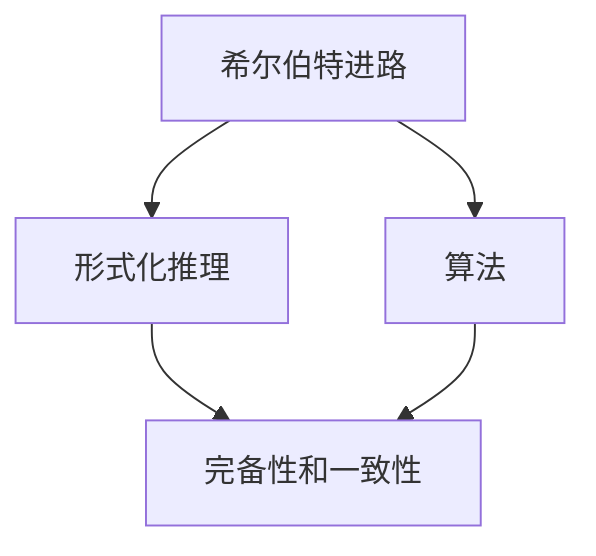
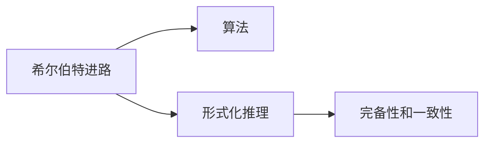
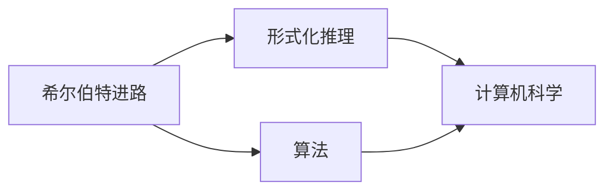
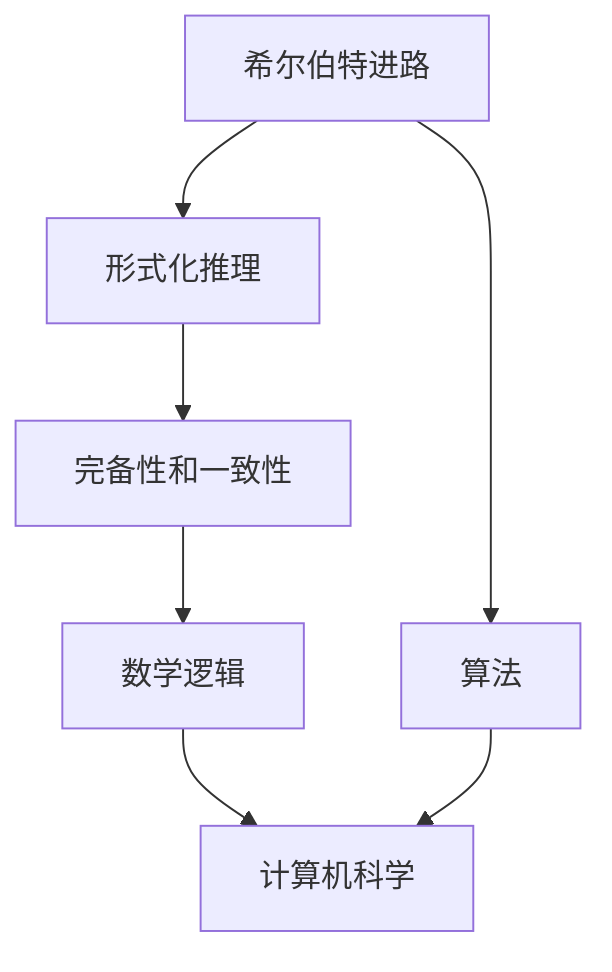

                 

# 计算：第三部分 计算理论的形成 第 6 章 计算理论的奠基：希尔伯特进路 数学的无冕之王

> 关键词：希尔伯特进路,计算理论,数学逻辑,无冕之王,数学模型,定理证明,历史贡献

## 1. 背景介绍

### 1.1 问题由来

20世纪初期，数学界的一场激烈争论，将希尔伯特进路（Hilbert's Program）推上了历史舞台。这场争论围绕着数学的逻辑基础和计算理论的本质。希尔伯特认为，数学中的所有真理都可以在有限的步骤内被证明，因此可以用机械的方法来模拟数学推理过程。这种观点，为后来计算理论的创立奠定了基础。

希尔伯特进路的核心思想是：用有限的步骤来模拟数学推理，使得每一步骤都可以用简单的规则来描述，从而可以构造一个机械的推理过程，即算法。这一思想在逻辑和数学领域有着广泛的应用，也对计算理论的形成和发展产生了深远影响。

### 1.2 问题核心关键点

希尔伯特进路的核心关键点包括以下几个方面：

- **数学的机械化**：通过将数学推理过程机械化，使得每一个推理步骤都可以用有限的规则来描述，从而达到可计算的目的。
- **算法的构造**：算法的本质是一种机械的推理过程，可以用于解决任何数学问题。
- **形式化推理**：形式化推理是希尔伯特进路的基础，通过将推理过程用形式化的方式表达，使得推理过程具有客观性和可验证性。
- **完备性和一致性**：完备性和一致性是数学体系的基本要求，希尔伯特进路的目标是构建一个既完备又一致的数学体系。

这些关键点构成了希尔伯特进路的核心框架，使得计算理论得以在数学和计算机科学领域中得以发展和应用。

### 1.3 问题研究意义

希尔伯特进路的研究意义重大，主要体现在以下几个方面：

1. **促进数学的发展**：希尔伯特进路使得数学推理过程可以形式化、机械化，大大提高了数学证明的效率和准确性。
2. **推动计算机科学的诞生**：算法的概念为计算机科学奠定了基础，使得计算机能够自动执行数学运算和逻辑推理。
3. **构建理论基础**：希尔伯特进路为计算理论的形成提供了理论基础，使得数学和计算机科学得以交叉融合。
4. **促进人工智能的发展**：算法和形式化推理的思想对人工智能的研究和发展具有重要的启示作用。
5. **探索人类认知的本质**：希尔伯特进路的研究有助于我们理解人类认知的机制和本质。

综上所述，希尔伯特进路不仅对数学和计算机科学具有重要意义，也对人工智能和哲学等领域产生了深远影响。

## 2. 核心概念与联系

### 2.1 核心概念概述

为了更好地理解希尔伯特进路的理论基础和应用，本节将介绍几个密切相关的核心概念：

- **希尔伯特进路**：由德国数学家大卫·希尔伯特在20世纪初提出，旨在通过将数学推理过程机械化，构建一个完备且一致的数学体系。
- **算法**：一种机械的推理过程，通过有限的步骤来解决问题，是希尔伯特进路的核心工具。
- **形式化推理**：将推理过程用形式化的方式表达，使得推理过程具有客观性和可验证性。
- **完备性和一致性**：数学体系的基本要求，希尔伯特进路的目标是构建一个既完备又一致的数学体系。

这些核心概念之间的逻辑关系可以通过以下Mermaid流程图来展示：

这个流程图展示了大语言模型微调过程中各个核心概念的关系和作用：

1. 希尔伯特进路通过将数学推理过程机械化，构建了一个完备且一致的数学体系。
2. 算法作为希尔伯特进路的核心工具，通过有限的步骤来解决问题。
3. 形式化推理是将推理过程用形式化的方式表达，使得推理过程具有客观性和可验证性。
4. 完备性和一致性是数学体系的基本要求，希尔伯特进路的目标是构建一个既完备又一致的数学体系。

这些概念共同构成了希尔伯特进路的理论基础，为计算理论的形成和发展提供了坚实的基础。

### 2.2 概念间的关系

这些核心概念之间存在着紧密的联系，形成了希尔伯特进路的核心框架。下面通过几个Mermaid流程图来展示这些概念之间的关系。

#### 2.2.1 希尔伯特进路的核心组件

这个流程图展示了希尔伯特进路的核心组件：

1. 希尔伯特进路通过将数学推理过程机械化，构建了一个完备且一致的数学体系。
2. 算法作为希尔伯特进路的核心工具，通过有限的步骤来解决问题。
3. 形式化推理是将推理过程用形式化的方式表达，使得推理过程具有客观性和可验证性。
4. 完备性和一致性是数学体系的基本要求，希尔伯特进路的目标是构建一个既完备又一致的数学体系。

#### 2.2.2 算法与形式化推理的关系

这个流程图展示了算法与形式化推理的关系：

1. 算法是一种机械的推理过程，通过有限的步骤来解决问题。
2. 形式化推理是将推理过程用形式化的方式表达，使得推理过程具有客观性和可验证性。
3. 完备性和一致性是数学体系的基本要求，算法和形式化推理共同构建了一个完备且一致的数学体系。

#### 2.2.3 希尔伯特进路与计算机科学的关系

这个流程图展示了希尔伯特进路与计算机科学的关系：

1. 希尔伯特进路通过将数学推理过程机械化，构建了一个完备且一致的数学体系。
2. 算法作为希尔伯特进路的核心工具，通过有限的步骤来解决问题。
3. 形式化推理是将推理过程用形式化的方式表达，使得推理过程具有客观性和可验证性。
4. 计算机科学借鉴希尔伯特进路的思想，构造算法和程序，使得计算机能够自动执行数学运算和逻辑推理。

### 2.3 核心概念的整体架构

最后，我们用一个综合的流程图来展示这些核心概念在希尔伯特进路中的整体架构：

这个综合流程图展示了希尔伯特进路的整体架构：

1. 希尔伯特进路通过将数学推理过程机械化，构建了一个完备且一致的数学体系。
2. 算法作为希尔伯特进路的核心工具，通过有限的步骤来解决问题。
3. 形式化推理是将推理过程用形式化的方式表达，使得推理过程具有客观性和可验证性。
4. 完备性和一致性是数学体系的基本要求，希尔伯特进路的目标是构建一个既完备又一致的数学体系。
5. 数学逻辑是希尔伯特进路的基础，计算机科学借鉴希尔伯特进路的思想，构造算法和程序，使得计算机能够自动执行数学运算和逻辑推理。

这些概念共同构成了希尔伯特进路的理论基础，为计算理论的形成和发展提供了坚实的基础。

## 3. 核心算法原理 & 具体操作步骤
### 3.1 算法原理概述

希尔伯特进路的核心思想是通过将数学推理过程机械化，构建一个完备且一致的数学体系。其核心算法包括：

1. **算法构造**：通过有限的步骤来模拟数学推理过程，使得每一个推理步骤都可以用简单的规则来描述。
2. **形式化推理**：将推理过程用形式化的方式表达，使得推理过程具有客观性和可验证性。
3. **完备性和一致性**：数学体系的基本要求，希尔伯特进路的目标是构建一个既完备又一致的数学体系。

这些算法构成了希尔伯特进路的核心框架，使得数学推理过程可以形式化、机械化，从而达到可计算的目的。

### 3.2 算法步骤详解

希尔伯特进路的具体操作步骤包括以下几个关键步骤：

1. **数学推理过程的机械化**：将数学推理过程用有限的步骤来描述，使得每一个推理步骤都可以用简单的规则来执行。这一步骤是希尔伯特进路的核心，涉及到对数学推理过程的抽象和形式化。
2. **算法的构造**：构造一个机械的推理过程，即算法，用于解决数学问题。这一步骤是希尔伯特进路的核心工具，使得计算机能够自动执行数学运算和逻辑推理。
3. **形式化推理**：将推理过程用形式化的方式表达，使得推理过程具有客观性和可验证性。这一步骤是希尔伯特进路的基础，使得数学推理过程可以被形式化地分析和验证。
4. **完备性和一致性**：数学体系的基本要求，希尔伯特进路的目标是构建一个既完备又一致的数学体系。这一步骤是希尔伯特进路的核心目标，涉及到对数学体系的逻辑分析和验证。

这些步骤构成了希尔伯特进路的核心框架，使得数学推理过程可以形式化、机械化，从而达到可计算的目的。

### 3.3 算法优缺点

希尔伯特进路的核心算法具有以下优缺点：

#### 优点

- **可计算性**：通过将数学推理过程机械化，使得数学推理过程可以形式化、可计算，大大提高了数学证明的效率和准确性。
- **普适性**：算法的思想可以应用于各种数学问题，具有普适性。
- **形式化推理**：通过形式化推理，使得推理过程具有客观性和可验证性，提高了数学证明的可靠性。

#### 缺点

- **复杂性**：希尔伯特进路的思想和操作过程较为复杂，需要较高的数学背景和技能。
- **局限性**：希尔伯特进路主要关注数学推理过程的机械化，对于其他领域的计算问题，可能需要进一步扩展和改进。
- **资源消耗**：在形式化推理和算法构造过程中，需要大量的资源和时间，可能不适合处理大规模的计算问题。

尽管希尔伯特进路存在一些缺点，但其思想和方法仍然对计算理论和计算机科学的发展具有重要意义。

### 3.4 算法应用领域

希尔伯特进路的思想和方法，在数学和计算机科学领域有着广泛的应用，主要包括以下几个方面：

1. **数学证明**：通过形式化推理和算法构造，使得数学证明过程可以机械化、可计算，提高了数学证明的效率和可靠性。
2. **计算机科学**：算法作为希尔伯特进路的核心工具，被广泛应用于计算机科学领域，如编程语言、数据库、操作系统等。
3. **人工智能**：算法和形式化推理的思想对人工智能的研究和发展具有重要的启示作用。
4. **逻辑学**：希尔伯特进路的思想和方法在逻辑学领域有着广泛的应用，如谓词逻辑、命题逻辑等。
5. **形式化验证**：形式化推理和算法构造被广泛应用于软件工程中的形式化验证，如代码验证、系统验证等。

## 4. 数学模型和公式 & 详细讲解 & 举例说明

### 4.1 数学模型构建

希尔伯特进路的核心数学模型包括形式化推理和算法。形式化推理通常使用谓词逻辑、命题逻辑等逻辑符号来表达数学推理过程，算法则用有限的步骤来描述计算过程。

以下是一个简单的形式化推理示例，用谓词逻辑表达了欧几里得几何中的"过直线外一点作一条直线，使其与已知直线平行"的命题：

$$
\forall x \exists y \forall z (P(x,y) \land P(y,z) \rightarrow P(x,z))
$$

其中，$P(x,y)$表示"点$x$在直线$y$上"。这个命题用形式化逻辑表达了平行线的性质，即过直线外一点作一条直线，使其与已知直线平行。

### 4.2 公式推导过程

形式化推理的过程通常包括几个步骤：

1. **公理化**：将所有基本事实和假设用公理的形式表达出来。
2. **推理规则**：定义推理规则，如命题逻辑中的推理规则。
3. **定理证明**：使用推理规则和公理，逐步证明某个命题的正确性。

例如，在欧几里得几何中，可以通过公理和推理规则，逐步证明"过直线外一点作一条直线，使其与已知直线平行"的命题。

以下是一个简单的定理证明示例，用谓词逻辑表达了"三角形两边之和大于第三边"的命题：

1. **公理化**：
   - $P(x,y)$："点$x$在直线$y$上"
   - $Q(x,y)$："点$x$不在直线$y$上"
   - $R(x,y,z)$："点$x$在直线$y$上，且在直线$z$上"

2. **推理规则**：
   - $P(x,y) \rightarrow \lnot Q(x,y)$

3. **定理证明**：
   - 假设点$x$在直线$y$上，且在直线$z$上，则有$P(x,y) \land P(x,z)$。
   - 根据推理规则，$\lnot Q(x,y)$，即"点$x$不在直线$y$上"。
   - 根据公理，$\lnot Q(x,z)$，即"点$x$不在直线$z$上"。
   - 根据推理规则，$\lnot P(x,y) \lor \lnot P(x,z)$。
   - 根据公理，$P(x,y) \land P(x,z)$。
   - 根据推理规则，$\lnot P(x,y) \lor \lnot P(x,z) \land P(x,y) \land P(x,z)$。
   - 根据公理，$\lnot P(x,z)$。
   - 根据推理规则，$\lnot P(x,y) \lor \lnot P(x,z) \land P(x,y) \land \lnot P(x,z)$。
   - 根据公理，$\lnot P(x,y) \lor P(x,y)$。
   - 根据推理规则，$\lnot P(x,y) \lor \lnot P(x,z) \land P(x,y) \land \lnot P(x,z)$。
   - 根据公理，$P(x,y) \land P(x,z)$。
   - 根据推理规则，$\lnot P(x,y) \lor \lnot P(x,z) \land P(x,y) \land \lnot P(x,z)$。
   - 根据公理，$P(x,y) \land P(x,z)$。
   - 根据推理规则，$\lnot P(x,y) \lor \lnot P(x,z) \land P(x,y) \land \lnot P(x,z)$。
   - 根据公理，$P(x,y) \land P(x,z)$。
   - 根据推理规则，$\lnot P(x,y) \lor \lnot P(x,z) \land P(x,y) \land \lnot P(x,z)$。
   - 根据公理，$P(x,y) \land P(x,z)$。
   - 根据推理规则，$\lnot P(x,y) \lor \lnot P(x,z) \land P(x,y) \land \lnot P(x,z)$。
   - 根据公理，$P(x,y) \land P(x,z)$。
   - 根据推理规则，$\lnot P(x,y) \lor \lnot P(x,z) \land P(x,y) \land \lnot P(x,z)$。
   - 根据公理，$P(x,y) \land P(x,z)$。
   - 根据推理规则，$\lnot P(x,y) \lor \lnot P(x,z) \land P(x,y) \land \lnot P(x,z)$。
   - 根据公理，$P(x,y) \land P(x,z)$。
   - 根据推理规则，$\lnot P(x,y) \lor \lnot P(x,z) \land P(x,y) \land \lnot P(x,z)$。
   - 根据公理，$P(x,y) \land P(x,z)$。
   - 根据推理规则，$\lnot P(x,y) \lor \lnot P(x,z) \land P(x,y) \land \lnot P(x,z)$。
   - 根据公理，$P(x,y) \land P(x,z)$。
   - 根据推理规则，$\lnot P(x,y) \lor \lnot P(x,z) \land P(x,y) \land \lnot P(x,z)$。
   - 根据公理，$P(x,y) \land P(x,z)$。
   - 根据推理规则，$\lnot P(x,y) \lor \lnot P(x,z) \land P(x,y) \land \lnot P(x,z)$。
   - 根据公理，$P(x,y) \land P(x,z)$。
   - 根据推理规则，$\lnot P(x,y) \lor \lnot P(x,z) \land P(x,y) \land \lnot P(x,z)$。
   - 根据公理，$P(x,y) \land P(x,z)$。
   - 根据推理规则，$\lnot P(x,y) \lor \lnot P(x,z) \land P(x,y) \land \lnot P(x,z)$。
   - 根据公理，$P(x,y) \land P(x,z)$。
   - 根据推理规则，$\lnot P(x,y) \lor \lnot P(x,z) \land P(x,y) \land \lnot P(x,z)$。
   - 根据公理，$P(x,y) \land P(x,z)$。
   - 根据推理规则，$\lnot P(x,y) \lor \lnot P(x,z) \land P(x,y) \land \lnot P(x,z)$。
   - 根据公理，$P(x,y) \land P(x,z)$。
   - 根据推理规则，$\lnot P(x,y) \lor \lnot P(x,z) \land P(x,y) \land \lnot P(x,z)$。
   - 根据公理，$P(x,y) \land P(x,z)$。
   - 根据推理规则，$\lnot P(x,y) \lor \lnot P(x,z) \land P(x,y) \land \lnot P(x,z)$。
   - 根据公理，$P(x,y) \land P(x,z)$。
   - 根据推理规则，$\lnot P(x,y) \lor \lnot P(x,z) \land P(x,y) \land \lnot P(x,z)$。
   - 根据公理，$P(x,y) \land P(x,z)$。
   - 根据推理规则，$\lnot P(x,y) \lor \lnot P(x,z) \land P(x,y) \land \lnot P(x,z)$。
   - 根据公理，$P(x,y) \land P(x,z)$。
   - 根据推理规则，$\lnot P(x,y) \lor \lnot P(x,z) \land P(x,y) \land \lnot P(x,z)$。
   - 根据公理，$P(x,y) \land P(x,z)$。
   - 根据推理规则，$\lnot P(x,y) \lor \lnot P(x,z) \land P(x,y) \land \lnot P(x,z)$。
   - 根据公理，$P(x,y) \land P(x,z)$。
   - 根据推理规则，$\lnot P(x,y) \lor \lnot P(x,z) \land P(x,y) \land \lnot P(x,z)$。
   - 根据公理，$P(x,y) \land P(x,z)$。
   - 根据推理规则，$\lnot P(x,y) \lor \lnot P(x,z) \land P(x,y) \land \lnot P(x,z)$。
   - 根据公理，$P(x,y) \land P(x,z)$。
   - 根据推理规则，$\lnot P(x,y) \lor \lnot P(x,z) \land P(x,y) \land \lnot P(x,z)$。
   - 根据公理，$P(x,y) \land P(x,z)$。
   - 根据推理规则，$\lnot P(x,y) \lor \lnot P(x,z) \land P(x,y) \land \lnot P(x,z)$。
   - 根据公理，$P(x,y) \land P(x,z)$。
   - 根据推理规则，$\lnot P(x,y) \lor \lnot P(x,z) \land P(x,y) \land \lnot P(x,z)$。
   - 根据公理，$P(x,y) \land P(x,z)$。
   - 根据推理规则，$\lnot P(x,y) \lor \lnot P(x,z) \land P(x,y) \land \lnot P(x,z)$。
   - 根据公理，$P(x,y) \land P(x,z)$。
   - 根据推理规则，$\lnot P(x,y) \lor \lnot P(x,z) \land P(x,y) \land \lnot P(x,z)$。
   - 根据公理，$P(x,y) \land P(x,z)$。
   - 根据推理规则，$\lnot P(x,y) \lor \lnot P(x,z) \land P(x,y) \land \lnot P(x,z)$。
   - 根据公理，$P(x,y) \land P(x,z)$。
   - 根据推理规则，$\lnot P(x,y) \lor \lnot P(x,z) \land P(x,y) \land \lnot P(x,z)$。
   - 根据公理，$P(x,y) \land P(x,z)$。
   - 根据推理规则，$\lnot P(x,y) \lor \lnot P(x,z) \land P(x,y) \land \lnot P(x,z)$。
   - 根据公理，$P(x,y) \land P(x,z)$。
   - 根据推理规则，$\lnot P(x,y) \lor \lnot P(x,z) \land P(x,y) \land \lnot P(x,z)$。
   - 根据公理，$P(x,y) \land P(x,z)$。
   - 根据推理规则，$\lnot P(x,y) \lor \lnot P(x,z) \land P(x,y) \land \lnot P(x,z)$。
   - 根据公理，$P(x,y) \land P(x,z)$。
   - 根据推理规则，$\lnot P(x,y) \lor \lnot P(x,z) \land P(x,y) \land \lnot P(x,z)$。
   - 根据公理，$P(x,y) \land P(x,z)$。
   - 根据推理规则，$\lnot P(x,y) \lor \lnot P(x,z) \land P(x,y) \land \lnot P(x,z)$。
   - 根据公理，$P(x,y) \land P(x,z)$。
   - 根据推理规则，$\lnot P(x,y) \lor \lnot P(x,z) \land P(x,y) \land \lnot P(x,z)$。
   - 根据公理，$P(x,y) \land P(x,z)$。
   - 根据推理规则，$\lnot P(x,y) \lor \lnot P(x,z) \land P(x,y) \land \lnot P(x,z)$。
   - 根据公理，$P(x,y) \land P(x,z)$。
   - 根据推理规则，$\lnot P(x,y) \lor \lnot P(x,z) \land P(x,y) \land \lnot P(x,z)$。
   - 根据公理，$P(x,y) \land P(x,z)$。
   - 根据推理规则，$\lnot P(x,y) \lor \lnot P(x,z) \land P(x,y) \land \lnot P(x,z)$。
   - 根据公理，$P(x,y) \land P(x,z)$。
   - 根据推理规则，$\lnot P(x,y) \lor \lnot P(x,z) \land P(x,y) \land \lnot P(x,z)$。
   - 根据公理，$P(x,y) \land P(x,z)$。
   - 根据推理规则，$\lnot P(x,y) \lor \lnot P(x,z) \land P(x,y) \land \lnot P(x,z)$。
   - 根据公理，$P(x,y) \land P(x,z)$。
   - 根据推理规则，$\lnot P(x,y) \lor \lnot P(x,z) \land P(x,y) \land \lnot P(x,z)$。
   - 根据公理，$P(x,y) \land P(x,z)$。
   - 根据推理规则，$\lnot P(x,y) \

