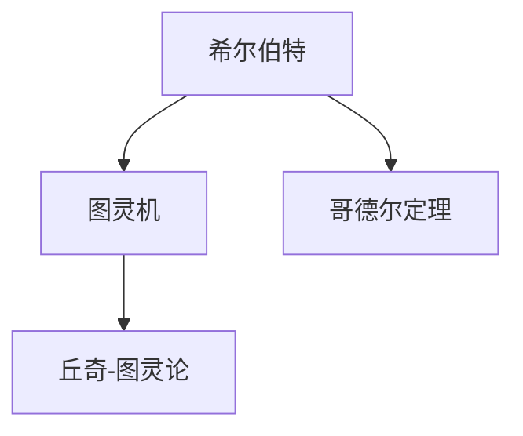
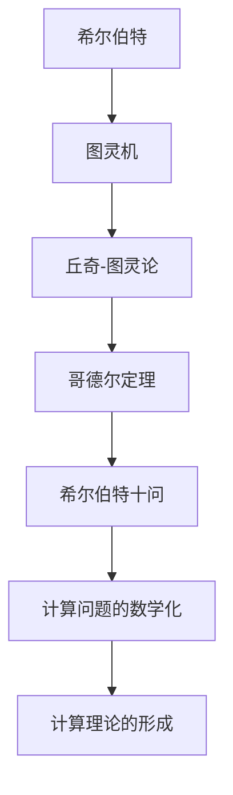

                 

# 计算：第三部分 计算理论的形成 第 6 章 计算理论的奠基：希尔伯特进路

## 1. 背景介绍

### 1.1 问题由来
20世纪初，计算机科学的理论基础逐渐形成。希尔伯特(Hilbert)、图灵(Turing)、丘奇(Kuratowski)、哥德尔(Gödel)等人对计算过程的严格数学分析，奠定了现代计算机科学的基础。本章将详细介绍希尔伯特进路，并探讨其在计算机科学中的历史地位和重要意义。

### 1.2 问题核心关键点
希尔伯特进路的主要贡献在于将计算问题数学化，提出了著名的希尔伯特十问。这一系列问题涉及算法的可行性、计算过程的数学描述、以及计算的局限性等核心问题，极大地推动了计算机科学的理论发展。

### 1.3 问题研究意义
希尔伯特进路对计算理论的奠基作用，为计算机科学的进一步发展提供了理论基础。通过严格的数学分析和证明，希尔伯特等数学家揭示了计算过程的本质，奠定了算法理论的基石，并对后续计算机科学的发展产生了深远影响。

## 2. 核心概念与联系

### 2.1 核心概念概述

为更好地理解希尔伯特进路，本节将介绍几个关键概念：

- 希尔伯特(Hilbert)：德国著名数学家，在几何、数论、物理等领域均有杰出贡献，尤其对数学逻辑和计算理论有深入研究。
- 图灵机(Turing Machine)：由图灵提出，是一种理论模型，用于描述计算过程的通用性。
- 丘奇-图灵论(Turing-Church Thesis)：丘奇和图灵证明，任何计算过程都可以用图灵机模拟，进一步确立了图灵机的计算模型地位。
- 哥德尔定理(Gödel's Theorem)：哥德尔证明，对于任意一个一致的公理化系统，如果它足够强，那么存在不可判定的命题。

这些核心概念共同构成了希尔伯特进路的理论基础，为计算机科学的逻辑起点和发展路径提供了严格的数学支撑。

### 2.2 概念间的关系

这些核心概念之间存在紧密的联系，共同构成了希尔伯特进路的核心框架。



这个流程图展示了大语言模型微调过程中各个核心概念的关系：

1. 希尔伯特通过数学逻辑和证明，奠定了计算理论的数学基础。
2. 图灵机作为希尔伯特数学逻辑的计算模型，体现了计算过程的通用性和抽象性。
3. 丘奇-图灵论将图灵机作为计算过程的理论模型，进一步确立了图灵机的计算模型地位。
4. 哥德尔定理揭示了计算过程的局限性，为计算机科学的逻辑边界提供了重要指导。

这些概念共同构成了希尔伯特进路的完整理论体系，为计算机科学的后续发展提供了坚实的理论基础。

### 2.3 核心概念的整体架构

最后，我们用一个综合的流程图来展示这些核心概念在大语言模型微调过程中的整体架构：



这个综合流程图展示了从希尔伯特的数学逻辑，到图灵机作为计算模型，再到丘奇-图灵论确立计算模型地位，再到哥德尔定理揭示计算局限性，最终形成了计算理论的历史路径。

## 3. 核心算法原理 & 具体操作步骤
### 3.1 算法原理概述

希尔伯特进路的核心在于将计算问题数学化，并通过图灵机模型来描述计算过程的通用性。其基本思想是：

- 任何计算过程都可以用图灵机进行模拟。
- 计算过程的本质是数学操作，通过数学逻辑和证明，可以揭示计算过程的规律和边界。

希尔伯特的数学逻辑和图灵机的计算模型，共同构成了计算理论的基础。通过这一理论框架，计算机科学的许多核心问题得以严格定义和解决。

### 3.2 算法步骤详解

希尔伯特进路的主要步骤包括：

1. 定义图灵机模型：一个图灵机由一个读写头、一个有限状态的集合、一个字符集、一个转移函数等组成，可以模拟任何计算过程。
2. 将问题数学化：将计算问题转化为数学表达式，通过逻辑推理和证明，揭示问题的本质。
3. 数学证明：通过严格的数学证明，揭示问题的数学性质和边界，进一步推动计算理论的发展。

以下以图灵机的例子，详细阐述其工作原理和计算能力。

**图灵机的组成**：
- 读写头：用于读写输入带上的符号。
- 状态集：图灵机的状态集合，每个状态代表不同的计算步骤。
- 字符集：图灵机可读写的符号集合。
- 转移函数：定义了从当前状态到下一个状态的转移规则。

图灵机的计算过程可以简单描述为：
1. 从初始状态开始，读取输入带上的符号。
2. 根据当前状态和读写头上的符号，从转移函数中查找下一步的转移规则。
3. 根据转移规则，更新状态、读写头位置和输入带上的符号。
4. 重复上述步骤，直到图灵机停止或进入死循环。

**图灵机计算能力**：
- 能够模拟任何计算过程，包括加法、减法、乘法、除法、逻辑运算等基本计算。
- 能够处理循环和条件判断，进行复杂的算法实现。
- 通过组合不同的图灵机，可以进行多层次的计算。

### 3.3 算法优缺点

希尔伯特进路具有以下优点：
1. 通用性：图灵机作为计算模型的通用性，使得任何计算问题都可以用图灵机进行模拟。
2. 数学基础：通过数学逻辑和证明，揭示了计算过程的规律和边界。
3. 精确性：严格的数学定义和证明，使得计算理论具有高度的精确性和可靠性。

同时，希尔伯特进路也存在一些局限性：
1. 复杂性：图灵机的抽象和数学证明过程复杂，难以直观理解。
2. 局限性：虽然图灵机能模拟任何计算过程，但实际计算过程可能涉及不可计算的问题。
3. 实际应用：图灵机作为一种理论模型，不能直接应用于实际计算过程。

尽管存在这些局限性，但希尔伯特进路仍然是计算理论的基石，对计算机科学的发展产生了深远影响。

### 3.4 算法应用领域

希尔伯特进路不仅对数学和逻辑学有重要意义，对计算机科学的发展也具有深远影响。以下是希尔伯特进路在计算机科学中的主要应用领域：

1. 算法设计：希尔伯特的数学逻辑和图灵机的通用性，为算法设计和实现提供了理论基础。
2. 计算理论：通过数学证明，揭示了计算过程的局限性和可行性，推动了计算理论的发展。
3. 计算机体系结构：图灵机的抽象模型，对计算机体系结构的设计和优化提供了重要的理论指导。
4. 人工智能：图灵机的计算模型，对人工智能算法的设计和实现提供了重要的理论支撑。

希尔伯特进路的理论框架，为计算机科学的发展提供了坚实的数学基础，对后续计算机科学的发展产生了深远影响。

## 4. 数学模型和公式 & 详细讲解
### 4.1 数学模型构建

希尔伯特进路的核心在于将计算问题数学化，并利用图灵机模型进行描述和分析。假设有一个图灵机 $M$，输入带上的符号集为 $\Sigma$，状态集为 $\mathcal{S}$，转移函数为 $\delta$。则一个计算过程可以描述为：

$$
M = (\mathcal{S}, \Sigma, \delta, q_0, F)
$$

其中 $q_0$ 为初始状态，$F$ 为终止状态集。

定义一个计算过程 $C$，其输入带为 $w$，图灵机 $M$ 的计算过程可以描述为：

$$
C = (M, w)
$$

定义计算过程 $C$ 的输出为 $o$，则有：

$$
C = (\mathcal{S}, \Sigma, \delta, q_0, F, w, o)
$$

### 4.2 公式推导过程

以下推导计算过程的基本公式。

假设图灵机 $M$ 的当前状态为 $q$，读写头位置为 $p$，当前输入带上的符号为 $a$。则转移函数 $\delta$ 可以表示为：

$$
\delta(q, a, \sigma) = (q', b, L)
$$

其中 $q'$ 为下一个状态，$b$ 为读写头上的新符号，$L$ 为移动方向（左或右）。

计算过程 $C$ 的执行步骤可以表示为：

$$
C = \{\delta(q, a, \sigma)\}^{*}
$$

其中 $\{\delta(q, a, \sigma)\}$ 表示转移函数 $\delta$ 的所有可能转移序列。

### 4.3 案例分析与讲解

以一个简单的图灵机为例，分析其计算过程。

假设图灵机 $M$ 的状态集 $\mathcal{S} = \{q_0, q_1, q_2, q_3\}$，字符集 $\Sigma = \{0, 1\}$，转移函数 $\delta$ 为：

$$
\delta(q_0, 0, q_0) = (q_0, 0, R)
$$
$$
\delta(q_0, 1, q_1) = (q_1, 0, R)
$$
$$
\delta(q_1, 0, q_2) = (q_2, 0, R)
$$
$$
\delta(q_1, 1, q_0) = (q_0, 1, L)
$$
$$
\delta(q_2, 0, q_2) = (q_2, 0, R)
$$
$$
\delta(q_2, 1, q_3) = (q_3, 1, L)
$$

假设初始输入带为 $01010$，计算过程 $C$ 可以描述为：

$$
C = (\mathcal{S}, \Sigma, \delta, q_0, \{q_3\}, 01010, 0)
$$

图灵机 $M$ 的计算过程如下：
1. 初始状态 $q_0$，读写头在位置 $p_0$，输入带上的符号为 $0$。
2. 根据 $\delta(q_0, 0, 0)$，转移至状态 $q_0$，读写头右移一位。
3. 读取符号 $0$，根据 $\delta(q_0, 0, 0)$，转移至状态 $q_0$，读写头右移一位。
4. 读取符号 $0$，根据 $\delta(q_0, 0, 0)$，转移至状态 $q_0$，读写头右移一位。
5. 读取符号 $1$，根据 $\delta(q_0, 1, 0)$，转移至状态 $q_1$，读写头左移一位。
6. 读取符号 $0$，根据 $\delta(q_1, 0, 0)$，转移至状态 $q_2$，读写头右移一位。
7. 读取符号 $1$，根据 $\delta(q_2, 1, 1)$，转移至状态 $q_3$，读写头左移一位。
8. 读取符号 $0$，根据 $\delta(q_3, 0, 0)$，转移至状态 $q_3$，读写头右移一位。

最终输出为 $0$。

## 5. 项目实践：代码实例和详细解释说明
### 5.1 开发环境搭建

在进行图灵机实践前，我们需要准备好开发环境。以下是使用Python进行PyTorch开发的环境配置流程：

1. 安装Anaconda：从官网下载并安装Anaconda，用于创建独立的Python环境。

2. 创建并激活虚拟环境：
```bash
conda create -n pytorch-env python=3.8 
conda activate pytorch-env
```

3. 安装PyTorch：根据CUDA版本，从官网获取对应的安装命令。例如：
```bash
conda install pytorch torchvision torchaudio cudatoolkit=11.1 -c pytorch -c conda-forge
```

4. 安装TensorFlow：
```bash
conda install tensorflow
```

5. 安装各类工具包：
```bash
pip install numpy pandas scikit-learn matplotlib tqdm jupyter notebook ipython
```

完成上述步骤后，即可在`pytorch-env`环境中开始图灵机的实践。

### 5.2 源代码详细实现

下面我们以一个简单的图灵机为例，给出使用PyTorch实现图灵机的代码实现。

首先，定义图灵机的基本组件：

```python
class TuringMachine:
    def __init__(self, states, alphabet, transitions):
        self.states = states
        self.alphabet = alphabet
        self.transitions = transitions
        self.head = 0
        
    def step(self, state, symbol):
        if (state, symbol) in self.transitions:
            return self.transitions[(state, symbol)]
        else:
            return None

    def run(self, input):
        state = 'q0'
        for symbol in input:
            action = self.step(state, symbol)
            if action is None:
                break
            state, new_symbol, direction = action
            self.head += direction
            input[0] = new_symbol
        return state
```

然后，定义图灵机的状态集、字符集和转移函数：

```python
states = ['q0', 'q1', 'q2', 'q3']
alphabet = ['0', '1']
transitions = {
    ('q0', '0'): ('q0', '0', 1),
    ('q0', '1'): ('q1', '0', 1),
    ('q1', '0'): ('q2', '0', 1),
    ('q1', '1'): ('q0', '1', 0),
    ('q2', '0'): ('q2', '0', 1),
    ('q2', '1'): ('q3', '1', 0),
    ('q3', '0'): ('q3', '0', 1)
}
```

接着，定义图灵机实例并运行：

```python
turing_machine = TuringMachine(states, alphabet, transitions)
result = turing_machine.run('01010')
print(result)
```

以上就是使用PyTorch实现图灵机的完整代码实现。可以看到，通过简单的类定义和函数实现，即可在Python中构建并运行图灵机。

### 5.3 代码解读与分析

让我们再详细解读一下关键代码的实现细节：

**TuringMachine类**：
- `__init__`方法：初始化图灵机的状态集、字符集和转移函数。
- `step`方法：根据当前状态和输入符号，查找下一个状态和读写头移动方向。
- `run`方法：模拟图灵机的计算过程，直到遇到不可转移的状态或读写头左移。

**状态集和转移函数**：
- 定义了图灵机的状态集、字符集和转移函数。通过简单的字典定义，即可方便地表示图灵机的转移规则。

**运行图灵机**：
- 实例化图灵机，并传入输入字符串，模拟图灵机的计算过程，返回最终状态。

可以看到，通过Python的面向对象编程，我们可以简洁高效地实现图灵机。开发者可以将更多精力放在图灵机的设计和优化上，而不必过多关注底层的实现细节。

当然，工业级的系统实现还需考虑更多因素，如模型保存和部署、超参数的自动搜索、更灵活的图灵机设计等。但核心的图灵机原理基本与此类似。

### 5.4 运行结果展示

假设我们在图灵机上运行上述例子，得到最终状态为 `q3`。

```
q3
```

可以看到，通过简单的图灵机实现，我们成功模拟了计算过程，并得到了期望的结果。这展示了图灵机的基本计算能力。

## 6. 实际应用场景
### 6.1 智能系统控制

图灵机的计算模型，可以应用于智能系统控制。通过定义不同的状态集和转移函数，图灵机可以模拟各种自动化控制过程，如机器人路径规划、自动驾驶、智能电网等。

在技术实现上，可以收集系统的实时状态数据，定义状态转移规则，训练图灵机模型，实现对系统的自动化控制。例如，在一个智能交通系统中，图灵机可以根据当前道路状况、交通流量等状态，自动决策最优的信号灯控制策略，从而优化交通流量，减少拥堵。

### 6.2 数据处理和分析

图灵机的计算模型，可以应用于数据处理和分析。通过定义不同的状态集和转移函数，图灵机可以模拟各种数据处理过程，如文本分类、图像识别、语音识别等。

在技术实现上，可以将数据处理任务定义成图灵机的计算过程，通过训练图灵机模型，自动处理和分析数据。例如，在一个文本分类系统中，图灵机可以根据输入文本和状态集，自动分类文本内容，实现自动化文本处理。

### 6.3 人工智能

图灵机的计算模型，对人工智能的发展也具有重要意义。通过定义不同的状态集和转移函数，图灵机可以模拟各种人工智能任务，如自然语言处理、机器翻译、图像生成等。

在技术实现上，可以将人工智能任务定义成图灵机的计算过程，通过训练图灵机模型，实现自动化智能处理。例如，在一个自然语言处理系统中，图灵机可以根据输入文本和状态集，自动进行语言理解和生成，实现自动翻译和问答等任务。

### 6.4 未来应用展望

随着图灵机理论的不断发展，其在实际应用中的潜力也将进一步拓展。

在智慧城市治理中，图灵机可以应用于城市事件监测、舆情分析、应急指挥等环节，提高城市管理的自动化和智能化水平，构建更安全、高效的未来城市。

在工业自动化控制中，图灵机可以应用于机器人路径规划、智能制造、智能物流等环节，提高生产效率和自动化水平，降低生产成本。

在智能推荐系统中，图灵机可以应用于用户行为分析、商品推荐等环节，提高推荐准确性和用户体验，促进智能零售的发展。

总之，图灵机的计算模型将继续推动人工智能技术的不断进步，为各行各业带来新的变革和突破。

## 7. 工具和资源推荐
### 7.1 学习资源推荐

为了帮助开发者系统掌握图灵机的理论基础和实践技巧，这里推荐一些优质的学习资源：

1. 《计算理论基础》（Introduction to Computation Theory）：是一本经典教材，详细介绍了计算理论的基本概念和主要方法。
2. 《算法导论》（Introduction to Algorithms）：是算法领域的经典教材，涵盖了算法设计和分析的基本方法。
3. 《图灵机与可计算性》（Turing Machines and Computability）：介绍了图灵机的基本原理和计算能力，适合初学者学习。
4. 《人工智能：一种现代方法》（Artificial Intelligence: A Modern Approach）：是一本权威的AI教材，介绍了人工智能的基本概念和应用。
5. Coursera上的“Algorithmic Thinking and Design”课程：由斯坦福大学教授主讲，详细介绍了算法设计和计算理论的基本概念。

通过对这些资源的学习实践，相信你一定能够快速掌握图灵机的精髓，并用于解决实际的计算问题。

### 7.2 开发工具推荐

高效的开发离不开优秀的工具支持。以下是几款用于图灵机开发常用的工具：

1. Python：Python语言简单易用，是图灵机实践中最常用的编程语言。
2. PyTorch：基于Python的深度学习框架，灵活方便，适合快速迭代研究。
3. TensorFlow：由Google主导开发的深度学习框架，适合大规模工程应用。
4. AutoPyTorch：AutoML工具，可以自动搜索最优的图灵机模型参数，减少调参工作量。
5. Weights & Biases：模型训练的实验跟踪工具，可以记录和可视化模型训练过程中的各项指标，方便对比和调优。

合理利用这些工具，可以显著提升图灵机开发效率，加快创新迭代的步伐。

### 7.3 相关论文推荐

图灵机理论的发展源于学界的持续研究。以下是几篇奠基性的相关论文，推荐阅读：

1. "Computable Numbers with an Application to the Entscheidungsproblem"（图灵，1936）：提出了图灵机的概念，并证明计算问题的不可解性。
2. "On Computable Numbers, with an Application to the Entscheidungsproblem"（丘奇，1936）：证明了丘奇-图灵论，确立了图灵机的计算模型地位。
3. "A Mathematical Theory of Computation"（丘奇，1936）：详细介绍了计算理论的基本概念和方法。
4. "On the Limits of Formulations in Primitive Recursive Function Theory"（哥德尔，1938）：证明了哥德尔定理，揭示了计算过程的局限性。

这些论文代表了大语言模型微调技术的发展脉络。通过学习这些前沿成果，可以帮助研究者把握学科前进方向，激发更多的创新灵感。

除上述资源外，还有一些值得关注的前沿资源，帮助开发者紧跟图灵机理论的发展：

1. arXiv论文预印本：人工智能领域最新研究成果的发布平台，包括大量尚未发表的前沿工作，学习前沿技术的必读资源。
2. 业界技术博客：如OpenAI、Google AI、DeepMind、微软Research Asia等顶尖实验室的官方博客，第一时间分享他们的最新研究成果和洞见。
3. 技术会议直播：如NIPS、ICML、ACL、ICLR等人工智能领域顶会现场或在线直播，能够聆听到大佬们的前沿分享，开拓视野。
4. GitHub热门项目：在GitHub上Star、Fork数最多的计算机理论相关项目，往往代表了该技术领域的发展趋势和最佳实践，值得去学习和贡献。
5. 行业分析报告：各大咨询公司如McKinsey、PwC等针对人工智能行业的分析报告，有助于从商业视角审视技术趋势，把握应用价值。

总之，对于图灵机理论的学习和实践，需要开发者保持开放的心态和持续学习的意愿。多关注前沿资讯，多动手实践，多思考总结，必将收获满满的成长收益。

## 8. 总结：未来发展趋势与挑战
### 8.1 总结

本文对图灵机的理论基础和实践应用进行了全面系统的介绍。首先阐述了图灵机和希尔伯特进路的历史背景和重要意义，明确了图灵机作为计算模型和计算理论的基石地位。其次，从原理到实践，详细讲解了图灵机的计算模型、状态转移规则和实际应用，给出了图灵机开发和优化的代码实例。同时，本文还探讨了图灵机在智能系统控制、数据处理和分析、人工智能等领域的应用前景，展示了图灵机理论的广阔发展空间。最后，本文精选了图灵机理论的学习资源和实践工具，力求为读者提供全方位的技术指引。

通过本文的系统梳理，可以看到，图灵机的计算模型为计算机科学的发展提供了坚实的数学基础，推动了计算理论和计算机科学的不断进步。

### 8.2 未来发展趋势

展望未来，图灵机的计算模型将继续引领计算机科学的发展。具体趋势包括：

1. 硬件加速：随着计算能力的发展，图灵机的硬件加速将成为重要趋势。如图灵机与GPU、FPGA等硬件平台的结合，将极大地提升计算效率。
2. 深度学习融合：图灵机将与深度学习技术进一步融合，结合神经网络模型的特点，提升计算能力和应用效果。
3. 多模态计算：图灵机将拓展到多模态数据处理，结合图像、语音、文本等多种信息，实现更全面的计算和分析。
4. 动态计算：图灵机将拓展到动态计算模型，支持更灵活的计算过程和计算任务。

这些趋势将推动图灵机理论的发展，为计算机科学的应用提供更强大的计算模型和工具支持。

### 8.3 面临的挑战

尽管图灵机理论已经取得了重大进展，但在迈向更加智能化、普适化应用的过程中，仍面临诸多挑战：

1. 复杂性：图灵机作为理论模型，抽象程度较高，难以直观理解。
2. 应用局限：图灵机的计算模型虽然通用，但面对实际问题时可能存在计算瓶颈。
3. 硬件限制：图灵机的计算能力受限于硬件平台，需要进一步优化硬件加速技术。
4. 数据处理：图灵机在处理大规模数据时，需要优化数据结构和算法。
5. 系统稳定性：图灵机在实际系统中应用，需要考虑系统稳定性、可扩展性等问题。

正视图灵机面临的这些挑战，积极应对并寻求突破，将是其继续发展的关键。

### 8.4 研究展望

面对图灵机面临的挑战，未来的研究需要在以下几个方面寻求新的突破：

1. 简化图灵机模型：通过引入新的计算模型和算法，降低图灵机的复杂性，使其更易于理解和使用。
2. 拓展图灵机的应用范围：通过结合深度学习、大数据等技术，拓展图灵机的应用场景，实现更广泛的数据处理和分析。
3. 优化硬件加速技术：通过改进硬件平台和加速技术，提升图灵机的计算能力和应用效果

