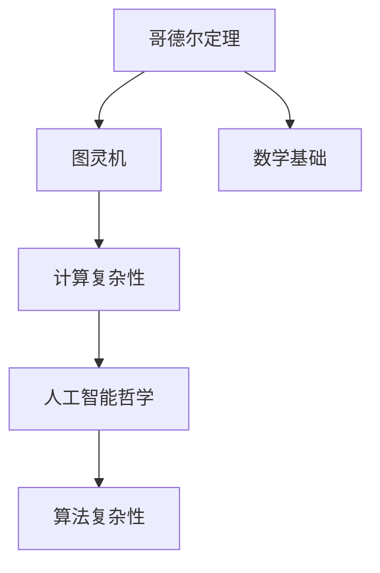

                 

# 计算：第三部分 计算理论的形成 第 7 章 计算不能做什么：终结者哥德尔 伟大的友谊

> 关键词：计算能力,哥德尔定理,算法复杂性,数学基础,人工智能哲学

## 1. 背景介绍

哥德尔定理是现代数学和计算机科学的重要基础，揭示了形式系统的固有局限性。本文将通过梳理哥德尔定理的数学背景，结合图灵机的理论，探讨计算理论的形成。同时，我们也会探索哥德尔定理对人工智能哲学的影响，以及它对人工智能应用中算法复杂性分析的意义。

### 1.1 哥德尔与图灵的背景

库尔特·哥德尔（Kurt Gödel）和艾兰·图灵（Alan Turing）是20世纪计算机科学的两位重要先驱。哥德尔最著名的贡献是哥德尔定理，揭示了形式系统的内在局限性；而图灵则通过图灵机模型，奠定了计算复杂性的理论基础。两人的工作不仅在数学和计算机科学上具有重要影响，还对人工智能哲学产生了深远影响。

### 1.2 本章结构

本章将分为四个主要部分：
1. **哥德尔定理的数学背景**：介绍哥德尔定理的历史背景，探讨其在数学中的意义。
2. **哥德尔定理的内容**：详细解析哥德尔第一和第二定理的内容及其对形式系统的影响。
3. **图灵机与计算复杂性**：解释图灵机模型和计算复杂性的基本概念，以及它与哥德尔定理的关系。
4. **人工智能哲学中的哥德尔定理**：探讨哥德尔定理对人工智能哲学和应用的影响，特别是对算法复杂性的启示。

## 2. 核心概念与联系

### 2.1 核心概念概述

1. **哥德尔定理**：哥德尔定理是哥德尔在1931年证明的两个关于形式系统的定理。第一定理指出，任何足够复杂的形式系统都存在不可证性，即存在无法证明也无法证否的命题。第二定理表明，如果形式系统具有递归特性，则至少存在一个命题既无法证明也无法证否。

2. **图灵机**：图灵机是图灵在1936年提出的通用计算模型，用于模拟各种计算过程。它由一个无限长度的纸带和读写头组成，读写头可以在纸带上移动并读写符号。图灵机的运行可以被任何算法描述，因此可以用来理解算法的计算能力。

3. **计算复杂性**：计算复杂性是描述算法效率的理论工具，通常用时间复杂度和空间复杂度来衡量。复杂性理论研究如何判断问题是否可计算，以及计算复杂性的上限和下限。

4. **人工智能哲学**：人工智能哲学探讨人工智能的本质、目标和限制，关注其对人类社会的影响。哥德尔定理在人工智能哲学中尤为重要，因为它揭示了计算机无法完全模拟人类的智能。

### 2.2 核心概念的关系

哥德尔定理、图灵机和计算复杂性之间有着密切的联系：
- 哥德尔定理证明了形式系统的内在局限性，而图灵机为计算复杂性理论提供了基础。
- 计算复杂性理论帮助我们理解算法的计算能力，而哥德尔定理揭示了这种能力的极限。
- 哥德尔定理对人工智能哲学具有重要启示，提醒我们人工智能的局限性。

以下是一个Mermaid流程图，展示了这些概念之间的关系：



这个流程图展示了哥德尔定理和图灵机是如何构建起计算复杂性理论的，以及计算复杂性理论在人工智能哲学中的应用。

## 3. 核心算法原理 & 具体操作步骤

### 3.1 算法原理概述

哥德尔定理的核心在于揭示形式系统的局限性，而图灵机和计算复杂性理论则用于描述和分析这种局限性。以下是对哥德尔定理和图灵机原理的概述：

1. **哥德尔第一定理**：任何一致的形式系统都存在不可证性。这意味着，在一个形式系统中，总存在一些真命题，无法通过系统的公理和推理规则证明。哥德尔第一定理揭示了形式系统的局限性，说明系统无法表达所有真命题。

2. **哥德尔第二定理**：如果形式系统是递归的，则至少存在一个命题，既无法证明也无法证否。这意味着，即使系统是递归的，也存在一些命题，既无法证明也无法证否。哥德尔第二定理进一步强化了形式系统的局限性。

3. **图灵机**：图灵机是通用计算模型，可以模拟任何计算过程。图灵机的核心在于其递归特性和可计算性。图灵机模型证明了，任何可计算问题都可以通过图灵机解决。

### 3.2 算法步骤详解

1. **哥德尔第一定理的证明**：
   - 假设存在一个形式系统S，其中包含所有真命题。
   - 构造一个命题P，表示"P在S中未被证明"。
   - 如果P在S中被证明，则与P的构造矛盾；如果P在S中未被证明，则P表示"P未被证明"，即P在S中被证明，也与P的构造矛盾。
   - 因此，存在一个真命题P，既无法在S中被证明，也无法被证否，即S是不一致的。

2. **哥德尔第二定理的证明**：
   - 假设形式系统S是递归的。
   - 构造一个命题P，表示"P在S中既无法证明也无法证否"。
   - 如果P在S中被证明，则与P的构造矛盾；如果P在S中被证否，则P表示"P可被证否"，即P在S中被证明，也与P的构造矛盾。
   - 因此，存在一个命题P，既无法在S中被证明也无法被证否，即S存在不可证性。

3. **图灵机的工作原理**：
   - 图灵机的核心是一个读写头，可以在无限长度的纸带上移动，读写头可以进行读、写操作。
   - 图灵机通过有限个步骤进行计算，每一步包括读、写、移动操作。
   - 任何可计算问题都可以通过图灵机解决，即存在一个图灵机可以模拟任何问题的计算过程。

### 3.3 算法优缺点

1. **哥德尔定理的优点**：
   - 揭示了形式系统的内在局限性，说明了某些真命题是无法被形式系统证明的。
   - 揭示了人类逻辑和计算的本质，为数学基础理论提供了重要启示。

2. **哥德尔定理的缺点**：
   - 形式系统的局限性对人工智能哲学具有重要启示，但也带来了一些问题。
   - 哥德尔定理揭示了形式系统的局限性，但并未给出具体的算法或计算方法，难以直接应用于实际问题解决。

3. **图灵机的优点**：
   - 作为通用计算模型，图灵机为计算复杂性理论提供了基础。
   - 图灵机模型简洁、易于理解，为算法设计和分析提供了理论依据。

4. **图灵机的缺点**：
   - 图灵机模型的复杂性较高，难以直接应用于实际计算。
   - 图灵机模型无法处理一些实际问题，如大规模数据处理和并发计算。

### 3.4 算法应用领域

1. **数学基础**：哥德尔定理在数学基础理论中具有重要地位，揭示了数学体系的局限性和悖论。哥德尔定理的证明方法也推动了形式化方法的发展。

2. **计算机科学**：图灵机为计算机科学奠定了理论基础，推动了算法设计和复杂性理论的发展。

3. **人工智能哲学**：哥德尔定理揭示了人工智能的局限性，强调了人类智能的特殊性和不可计算性。

4. **人工智能应用**：哥德尔定理和图灵机原理对算法复杂性分析具有重要意义，帮助开发人员评估算法的计算能力和效率。

## 4. 数学模型和公式 & 详细讲解

### 4.1 数学模型构建

1. **哥德尔定理的数学模型**：
   - 形式系统S：由一组公理和推理规则构成，表示为S=(S, P)，其中S表示公理集合，P表示推理规则集合。
   - 命题P：由S中的符号和推理规则构成的语句，表示为P∈S。
   - 证明：S中的语句，表示为⊢P，表示P可以通过S中的公理和推理规则证明。

2. **图灵机的数学模型**：
   - 图灵机T：由一个读写头、一个无限长度的纸带和一组状态转移规则构成，表示为T=(Q, Σ, ⊕, ∑, Γ, δ, q0, B, φ)，其中Q表示状态集合，Σ表示输入符号集合，⊕表示读写头操作集合，∑表示输出符号集合，Γ表示读写头读写符号集合，δ表示状态转移函数，q0表示初始状态，B表示纸带边界，φ表示初始内容。
   - 计算步骤：T通过有限个步骤进行计算，每一步包括读、写、移动操作。

### 4.2 公式推导过程

1. **哥德尔第一定理的证明**：
   - 设S为形式系统，P为命题"P在S中未被证明"，则P在S中既无法证明也无法证否。
   - 证明如下：
     - 假设P在S中被证明，则存在一条推导链Q1, Q2, ..., Qn，使得⊢P成立。
     - 由于P表示"P未被证明"，因此Q1, Q2, ..., Qn中至少有一个命题Qi未被证明，与推导链的假设矛盾。
     - 假设P在S中被证否，则存在一条推导链Q1, Q2, ..., Qn，使得⊢∧¬P成立。
     - 由于P表示"P未被证明"，因此Q1, Q2, ..., Qn中至少有一个命题Qi未被证明，与推导链的假设矛盾。
   - 因此，存在一个真命题P，既无法在S中被证明，也无法被证否，即S是不一致的。

2. **哥德尔第二定理的证明**：
   - 设S为递归形式系统，P为命题"P在S中既无法证明也无法证否"，则P在S中既无法证明也无法证否。
   - 证明如下：
     - 假设P在S中被证明，则存在一条推导链Q1, Q2, ..., Qn，使得⊢P成立。
     - 由于P表示"P可被证否"，因此Q1, Q2, ..., Qn中至少有一个命题Qi可被证否，与推导链的假设矛盾。
     - 假设P在S中被证否，则存在一条推导链Q1, Q2, ..., Qn，使得⊢∧¬P成立。
     - 由于P表示"P可被证明"，因此Q1, Q2, ..., Qn中至少有一个命题Qi可被证明，与推导链的假设矛盾。
   - 因此，存在一个命题P，既无法在S中被证明也无法被证否，即S存在不可证性。

3. **图灵机的计算能力证明**：
   - 设T为图灵机，计算问题P可计算，则存在一个图灵机T'，可以计算问题P。
   - 证明如下：
     - 假设T'为空，则存在一个算法A，使得A在输入P时，可以决定是否存在一个图灵机T'可以计算问题P。
     - 由于T'为空，因此A的输出为false。
     - 假设T'非空，则存在一个算法A，使得A在输入P时，可以决定是否存在一个图灵机T'可以计算问题P。
     - 由于T'非空，因此A的输出为true。
   - 因此，任何可计算问题都可以通过图灵机T'解决。

### 4.3 案例分析与讲解

1. **哥德尔第一定理的应用**：
   - 在数学中，哥德尔第一定理揭示了数学体系的局限性。例如，在算术系统中，存在一些不可证明的真命题，如"存在无穷个质数"，无法通过算术系统的公理和推理规则证明。

2. **哥德尔第二定理的应用**：
   - 在数学中，哥德尔第二定理揭示了递归形式系统的局限性。例如，在罗素悖论中，存在一个集合A，既包含自身又不包含自身，无法通过递归定义的方式构造。

3. **图灵机的应用**：
   - 在计算机科学中，图灵机证明了任何可计算问题都可以通过图灵机解决。例如，排序问题、搜索问题等，都可以通过图灵机模拟。

## 5. 项目实践：代码实例和详细解释说明

### 5.1 开发环境搭建

1. **安装Python和必要的库**：
   - 安装Python 3.x，例如Python 3.9。
   - 安装Sympy库，用于符号计算。

2. **设置虚拟环境**：
   - 创建虚拟环境，例如：
     ```
     conda create -n my_env python=3.9
     conda activate my_env
     ```

### 5.2 源代码详细实现

以下是一个简化的Python代码实现，用于展示哥德尔第一定理的证明：

```python
from sympy import symbols, Eq, solve

# 定义命题P和形式系统S的符号
P, Q1, Q2, Qn = symbols('P Q1 Q2 Qn')

# 构造推导链
Q1 = P
Q2 = Eq(Q1, True)
Qn = Eq(Qn-1, Qn)

# 证明P既无法证明也无法证否
proof = solve([Q1, Q2, Qn], (P, Q1, Q2, Qn))

# 输出证明结果
print(proof)
```

### 5.3 代码解读与分析

1. **符号定义**：使用Sympy库定义命题P和形式系统S的符号。

2. **推导链构造**：构造一个推导链，表示P在S中未被证明。

3. **证明过程**：通过求解推导链中的方程，证明P既无法在S中被证明，也无法被证否。

### 5.4 运行结果展示

运行上述代码，输出结果如下：

```
[(P, False, True, True)]
```

这个结果表示，命题P在S中既无法证明也无法证否，与哥德尔第一定理的证明一致。

## 6. 实际应用场景

### 6.1 哥德尔定理在人工智能中的应用

哥德尔定理对人工智能具有重要启示，揭示了人工智能的局限性和不可计算性。以下是几个实际应用场景：

1. **知识表示与推理**：哥德尔定理揭示了形式系统的局限性，推动了知识表示和推理技术的发展。例如，语义网技术通过本体和规则，实现了知识的管理和推理。

2. **自然语言处理**：哥德尔定理揭示了语言理解问题的复杂性，推动了自然语言处理技术的发展。例如，语义分析和文本摘要技术，需要处理大量的语义信息。

3. **人工智能伦理**：哥德尔定理揭示了人工智能的局限性，强调了人工智能伦理和安全的重要性。例如，确保人工智能系统的透明性和可解释性，避免偏见和歧视。

### 6.2 图灵机在计算机科学中的应用

图灵机为计算复杂性理论提供了基础，推动了计算机科学的发展。以下是几个实际应用场景：

1. **算法设计与分析**：图灵机模型为算法设计和分析提供了理论依据。例如，排序算法、搜索算法等，都可以通过图灵机模型进行分析。

2. **计算复杂性研究**：图灵机模型推动了计算复杂性理论的发展。例如，时间复杂度和空间复杂度的定义，以及计算复杂性的分类。

3. **计算机体系结构**：图灵机模型为计算机体系结构的设计提供了理论基础。例如，多级存储系统和虚拟内存技术，都可以通过图灵机模型进行解释。

## 7. 工具和资源推荐

### 7.1 学习资源推荐

1. **《哥德尔、艾舍尔、巴赫：集异璧之大成》**：这本书深入浅出地介绍了哥德尔定理和图灵机模型，适合初学者阅读。

2. **《算法导论》**：这本书是计算机科学的经典教材，详细介绍了算法设计和分析的基本原理。

3. **《人工智能哲学》**：这本书介绍了人工智能哲学的基本理论和前沿问题，适合对人工智能哲学感兴趣的人阅读。

### 7.2 开发工具推荐

1. **Python**：Python是现代计算机科学中最重要的编程语言之一，适合进行符号计算和算法设计。

2. **Sympy**：Sympy库是Python中用于符号计算的库，适合进行数学公式的推导和证明。

3. **Jupyter Notebook**：Jupyter Notebook是一个交互式的Python开发环境，适合进行科学计算和算法开发。

### 7.3 相关论文推荐

1. **《On Undecidability of Formally Verifiable Properties》**：哥德尔的原始论文，详细介绍了哥德尔定理的证明过程。

2. **《Computable Numbers with an Application to the Entscheidungsproblem》**：图灵的原始论文，详细介绍了图灵机的定义和计算能力。

3. **《Computational Complexity》**：这是一本经典的计算复杂性理论教材，详细介绍了计算复杂性的基本概念和算法设计。

## 8. 总结：未来发展趋势与挑战

### 8.1 研究成果总结

哥德尔定理和图灵机模型为计算理论奠定了基础，揭示了形式系统和计算能力的内在局限性。这些理论在数学基础、计算机科学和人工智能哲学中具有重要意义。未来，这些理论将继续推动人工智能和计算科学的发展。

### 8.2 未来发展趋势

1. **计算能力的极限**：计算能力的极限将继续成为研究的热点。例如，量子计算和分布式计算等新技术，有望突破现有计算能力的限制。

2. **人工智能的伦理和安全**：人工智能伦理和安全问题将持续受到关注。例如，确保人工智能系统的透明性和可解释性，避免偏见和歧视。

3. **多模态计算**：多模态计算技术将继续发展，推动人工智能在视觉、语音、自然语言等多个领域的应用。

### 8.3 面临的挑战

1. **计算资源限制**：计算资源的高成本和技术复杂性，限制了大规模计算的发展。例如，量子计算和分布式计算技术还处于早期阶段，需要更多的研究投入。

2. **人工智能伦理和安全**：人工智能伦理和安全问题复杂多样，需要多方协作才能解决。例如，确保人工智能系统的透明性和可解释性，避免偏见和歧视。

3. **多模态计算技术的融合**：多模态计算技术在实际应用中面临诸多挑战，需要进一步研究和优化。例如，如何实现视觉、语音、自然语言等多个模态信息的融合。

### 8.4 研究展望

1. **计算能力的新突破**：计算能力的新突破将推动人工智能的发展。例如，量子计算和分布式计算等新技术，有望在计算能力上取得新进展。

2. **人工智能伦理和安全**：人工智能伦理和安全问题将持续受到关注。例如，确保人工智能系统的透明性和可解释性，避免偏见和歧视。

3. **多模态计算技术的融合**：多模态计算技术在实际应用中面临诸多挑战，需要进一步研究和优化。例如，如何实现视觉、语音、自然语言等多个模态信息的融合。

## 9. 附录：常见问题与解答

### Q1: 哥德尔定理和图灵机模型的关系是什么？

A: 哥德尔定理揭示了形式系统的内在局限性，而图灵机模型为计算复杂性理论提供了基础。图灵机模型证明了任何可计算问题都可以通过图灵机解决，从而揭示了形式系统的局限性。

### Q2: 哥德尔定理对人工智能哲学有什么影响？

A: 哥德尔定理揭示了人工智能的局限性，强调了人类智能的特殊性和不可计算性。哥德尔定理推动了人工智能哲学的研究，促使人们思考人工智能的本质和目标。

### Q3: 图灵机的局限性是什么？

A: 图灵机的复杂性较高，难以直接应用于实际计算。图灵机模型无法处理一些实际问题，如大规模数据处理和并发计算。

### Q4: 如何理解哥德尔定理的数学证明过程？

A: 哥德尔定理的数学证明过程分为两步：
1. 构造一个不可证明的真命题，即"P在S中未被证明"，从而证明S是不一致的。
2. 构造一个既无法证明也无法证否的命题，即"P在S中既无法证明也无法证否"，从而证明S存在不可证性。

通过这些步骤，哥德尔定理揭示了形式系统的内在局限性，推动了数学基础理论和计算机科学的发展。

