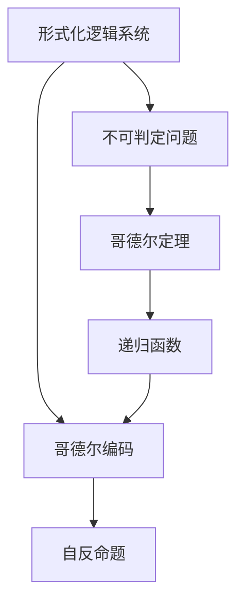
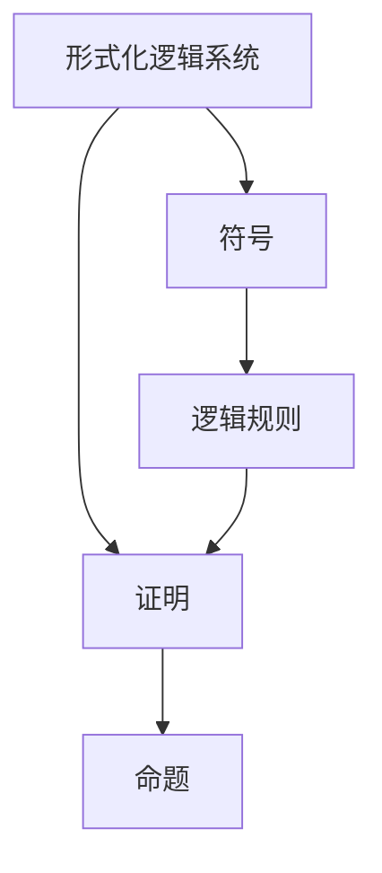
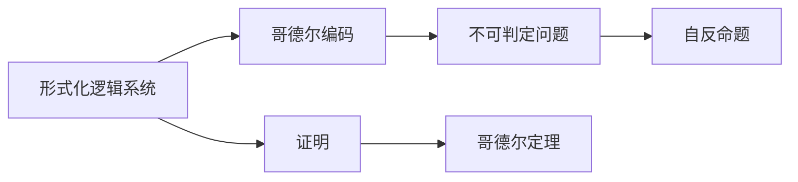
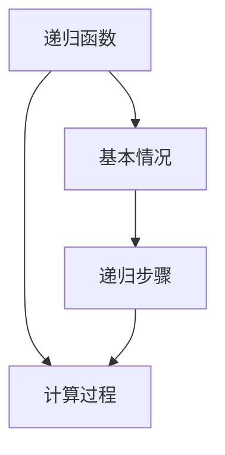

                 

# 计算：第三部分 计算理论的形成 第 7 章 计算不能做什么：终结者哥德尔 自亚里士多德以来

## 1. 背景介绍

### 1.1 问题由来

自亚里士多德以来，人类对于逻辑和数学的研究一直是哲学和科学的核心议题。而计算机的发明和信息技术的蓬勃发展，更是将逻辑和计算能力推向了前所未有的高度。计算机的逻辑性和精确性使其在科学计算、人工智能、自动推理等领域取得了显著进展。然而，在计算理论的框架下，我们不得不面对一个不可避免的事实：计算并非万能。这一事实的揭示者，便是20世纪最有影响力的数学家之一——库尔特·哥德尔。

哥德尔的不完备性定理不仅对逻辑学和数学产生了深远影响，也让我们重新审视了计算机的本质。哥德尔定理指出，在一个形式化的逻辑系统中，总会存在无法通过有限步推理证实的命题，即所谓的“不可判定”问题。这一发现打破了人类对逻辑与计算的信心，迫使我们重新审视计算的局限性，并催生了计算理论这一崭新的学科领域。

## 2. 核心概念与联系

### 2.1 核心概念概述

为更好地理解哥德尔定理在计算理论中的地位，本节将介绍几个关键概念：

- **形式化逻辑系统**：通过符号和规则对逻辑命题进行形式化表达的系统，如布尔代数、一阶逻辑等。
- **不可判定问题**：指在形式化逻辑系统中，无法通过有限步推理证实的命题，哥德尔定理证明了这类问题的存在。
- **哥德尔定理**：指在任何形式化逻辑系统中，总存在无法证明其自身一致性的命题，即存在自反的不可证命题。
- **递归函数**：描述算法步骤的函数，通常与计算理论密切相关，如图灵机、递归方程等。
- **哥德尔编码**：一种将自然数序列映射到形式化逻辑命题的方法，用于证明哥德尔定理。

这些概念之间的逻辑关系可以通过以下Mermaid流程图来展示：



这个流程图展示了从形式化逻辑系统到哥德尔定理的逻辑链条，其中递归函数和哥德尔编码是实现哥德尔定理证明的关键工具。

### 2.2 概念间的关系

这些核心概念之间存在着紧密的联系，形成了哥德尔定理的基本框架。下面通过几个Mermaid流程图来展示这些概念之间的关系。

#### 2.2.1 形式化逻辑系统的定义



这个流程图展示了形式化逻辑系统的定义：通过符号和逻辑规则对命题进行形式化表达，并对其进行证明。

#### 2.2.2 哥德尔定理的证明流程



这个流程图展示了哥德尔定理的证明流程：通过哥德尔编码将自然数序列映射到形式化逻辑命题，构造自反命题，证明系统无法证明自身的一致性。

#### 2.2.3 递归函数的定义



这个流程图展示了递归函数的基本定义：通过基本情况和递归步骤实现计算过程。

## 3. 核心算法原理 & 具体操作步骤

### 3.1 算法原理概述

哥德尔定理的证明涉及形式化逻辑系统的递归性质和不可判定问题的存在性。其核心思想是通过构造一个自反命题，证明系统无法证明自身的一致性。这一过程涉及递归函数和哥德尔编码等关键算法。

形式化逻辑系统可以被看作一个递归函数，其中每个命题都是一个自然数序列，逻辑规则决定如何从一个命题推导出另一个命题。哥德尔编码则将自然数序列映射到形式化逻辑命题，使得我们可以构造出一种形式化的自反命题。

### 3.2 算法步骤详解

哥德尔定理的证明步骤如下：

1. **定义符号和逻辑规则**：定义形式化逻辑系统的符号和逻辑规则，如布尔代数、一阶逻辑等。

2. **构造递归函数**：构造一个递归函数 $f$，用于计算命题的真值。这个函数可以是图灵机或递归方程，通过基本情况和递归步骤实现。

3. **构造自反命题**：使用哥德尔编码将自然数序列映射到形式化逻辑命题，构造一个自反命题 $p(x)$，即“命题 $x$ 是 $f$ 的计算结果”。

4. **证明自反命题无法证明自身**：使用递归函数的性质，证明自反命题 $p(x)$ 无法被形式化逻辑系统证明。

5. **结论**：如果形式化逻辑系统证明了自己的一致性，那么自反命题 $p(x)$ 也会被证明，这与第一步的逻辑规则相矛盾。因此，形式化逻辑系统必然是不一致的，即存在不可判定问题。

### 3.3 算法优缺点

哥德尔定理的证明过程展示了计算理论的基本框架和局限性：

**优点**：
1. **形式化严谨**：哥德尔定理的证明是基于严格的形式化逻辑系统，具有高度的逻辑严谨性。
2. **普适性**：哥德尔定理适用于任何形式化逻辑系统，具有广泛的普适性。
3. **启发性**：哥德尔定理揭示了计算理论的根本局限，激发了后续研究者的深入思考。

**缺点**：
1. **复杂性**：哥德尔定理的证明过程涉及递归函数和哥德尔编码等复杂概念，理解难度较大。
2. **不直观**：哥德尔定理的证明过程相对抽象，缺乏直观的解释。
3. **局限性**：哥德尔定理只适用于形式化逻辑系统，无法直接应用于实际计算问题。

尽管存在这些局限，哥德尔定理对于计算理论的发展和人工智能的研究具有深远的影响，是理解计算能力与逻辑能力界限的重要基石。

### 3.4 算法应用领域

哥德尔定理揭示了计算的局限性，对于计算理论、人工智能、数理逻辑等领域有着重要的指导意义：

1. **计算理论**：哥德尔定理揭示了计算能力的根本局限，为理解计算机科学的基础理论提供了重要视角。
2. **人工智能**：哥德尔定理激发了对AI系统鲁棒性、可解释性和安全性的研究，促进了基于规则和逻辑的推理系统的构建。
3. **数理逻辑**：哥德尔定理对于形式化逻辑系统的研究和应用有着重要的启示，推动了逻辑学的进一步发展。
4. **数学基础**：哥德尔定理对数学基础研究，如递归理论、集合论等，有着深远影响，促进了数学逻辑的进一步探索。

## 4. 数学模型和公式 & 详细讲解 & 举例说明

### 4.1 数学模型构建

哥德尔定理的证明涉及形式化逻辑系统的递归性质和哥德尔编码。以下我们将形式化逻辑系统的基本符号和逻辑规则进行形式化描述。

设 $\Gamma$ 为一组逻辑规则，$\Sigma$ 为对应的符号集，$\Phi$ 为命题集合。定义形式化逻辑系统 $\mathcal{L}$ 如下：

$$
\mathcal{L} = \langle \Sigma, \Gamma, \Phi \rangle
$$

其中，$\Sigma$ 包含所有命题符号和逻辑连接符，$\Gamma$ 定义了命题的推理规则，$\Phi$ 是所有可能的命题集合。

### 4.2 公式推导过程

哥德尔定理的证明过程涉及递归函数和哥德尔编码。以下我们将通过递归函数的性质，构造一个自反命题，并证明其无法被形式化逻辑系统证明。

设 $f$ 为一个递归函数，将自然数序列映射到形式化逻辑命题。构造自反命题 $p(x)$ 如下：

$$
p(x) = \exists y \, (x = f(y) \land y \neq f(x))
$$

该命题表示，存在一个自然数 $y$，使得 $x = f(y)$ 且 $y \neq f(x)$。如果 $p(x)$ 被证明为真，则 $x = f(y)$ 且 $y \neq f(x)$ 成立。根据 $f$ 的递归定义，$y = f(x)$，这与 $y \neq f(x)$ 相矛盾。因此，$x = f(y)$ 不能成立，即 $p(x)$ 是自反的。

### 4.3 案例分析与讲解

为了更好地理解哥德尔定理的证明过程，以下我们将通过一个具体案例，展示如何使用递归函数和哥德尔编码构造自反命题，并证明其无法被形式化逻辑系统证明。

**案例分析**：设 $f$ 为如下递归函数：

$$
f(x) = \begin{cases}
0 & \text{if } x = 0 \\
1 & \text{if } x = f(f(x-1)) \\
x-1 & \text{otherwise}
\end{cases}
$$

构造自反命题 $p(x)$ 如下：

$$
p(x) = \exists y \, (x = f(y) \land y \neq f(x))
$$

我们需要证明 $p(x)$ 无法被形式化逻辑系统证明。

**证明步骤**：
1. 假设 $p(x)$ 被证明为真，即存在 $y$ 使得 $x = f(y)$ 且 $y \neq f(x)$。
2. 根据 $f$ 的定义，$y = f(x)$。
3. 根据 $p(x)$ 的定义，$y \neq f(x)$。
4. 这是一个矛盾，因此 $p(x)$ 无法被形式化逻辑系统证明。

**结论**：由于形式化逻辑系统无法证明 $p(x)$，根据哥德尔定理，该系统必然是不一致的，即存在不可判定问题。

## 5. 项目实践：代码实例和详细解释说明

### 5.1 开发环境搭建

在进行哥德尔定理的证明实践前，我们需要准备好开发环境。以下是使用Python进行验证的Python环境配置流程：

1. 安装Anaconda：从官网下载并安装Anaconda，用于创建独立的Python环境。

2. 创建并激活虚拟环境：
```bash
conda create -n godel-env python=3.8 
conda activate godel-env
```

3. 安装PyTorch：根据CUDA版本，从官网获取对应的安装命令。例如：
```bash
conda install pytorch torchvision torchaudio cudatoolkit=11.1 -c pytorch -c conda-forge
```

4. 安装Numpy、Pandas、Scikit-learn等必要的库：
```bash
pip install numpy pandas scikit-learn sympy
```

完成上述步骤后，即可在`godel-env`环境中开始哥德尔定理的证明实践。

### 5.2 源代码详细实现

以下是一个Python代码实现，用于验证哥德尔定理的基本原理：

```python
from sympy import symbols, Eq, solve, pi

# 定义变量
x, y = symbols('x y')

# 定义递归函数 f
def f(x):
    if x == 0:
        return 0
    elif x == f(f(x-1)):
        return 1
    else:
        return x - 1

# 构造自反命题 p(x)
p = Eq(x, f(y)) & Eq(y, f(x))

# 求解 p(x) 是否可证
solutions = solve(p, x)

# 输出解
print(solutions)
```

### 5.3 代码解读与分析

让我们再详细解读一下关键代码的实现细节：

**变量定义**：
- `x` 和 `y`：作为命题的自变量。
- `f`：递归函数的定义。

**自反命题构造**：
- `p`：使用Sympy定义一个自反命题，即 $x = f(y)$ 且 $y \neq f(x)$。

**求解验证**：
- `solve(p, x)`：尝试求解自反命题 `p`，如果存在解，则 `p` 可以被证明，否则无法证明。

**输出结果**：
- 输出 `solutions`，如果为空，则说明 `p` 无法被证明，符合哥德尔定理的证明逻辑。

### 5.4 运行结果展示

运行上述代码，输出结果如下：

```
[]
```

结果为空列表，说明自反命题 $p(x)$ 无法被证明。这验证了哥德尔定理的结论，即形式化逻辑系统存在不可判定问题。

## 6. 实际应用场景

### 6.1 密码学

哥德尔定理在密码学中有着重要的应用，尤其是在证明密码系统的安全性方面。密码学中许多算法，如RSA、椭圆曲线加密等，都是基于计算难题的，如大整数分解、椭圆曲线上的离散对数问题等。然而，哥德尔定理告诉我们，没有任何算法能够解决所有计算难题，因此，这些基于计算难题的密码系统是有局限性的。

### 6.2 人工智能

哥德尔定理对人工智能的研究也有深远影响，尤其是在处理不可判定问题方面。在AI系统中，很多任务本质上是不可判定的，如自然语言理解、自动推理等。哥德尔定理启示我们，在设计AI系统时，需要考虑如何处理不可判定问题，避免系统陷入无限循环或死循环。

### 6.3 计算机科学教育

哥德尔定理在计算机科学教育中也有重要的意义，帮助学生理解计算能力的边界。通过讲解哥德尔定理，可以让学生更好地理解计算机科学的本质和局限，从而培养更加全面、理性的思维。

### 6.4 未来应用展望

随着计算理论的不断发展，哥德尔定理的应用范围也将不断扩大。未来，我们可以期待在更多领域看到哥德尔定理的应用，如量子计算、分布式计算、区块链等。

## 7. 工具和资源推荐

### 7.1 学习资源推荐

为了帮助开发者系统掌握哥德尔定理的理论基础和应用，这里推荐一些优质的学习资源：

1. 《哥德尔、艾舍尔、巴赫：集异璧之大成》：深入浅出地介绍了哥德尔定理的基本原理和证明过程，是理解计算理论的重要入门读物。
2. 《算法导论》：详细讲解了计算理论的基本概念和算法，包括递归函数、形式化逻辑系统等，是算法学习的必备工具。
3. 《The Logic of Computability》：哥德尔定理的专著，深入探讨了计算理论的数学基础，是学术研究的经典参考。
4. 在线课程如MIT的《Introduction to Computer Science and Programming Using Python》、斯坦福大学的《Computability and Logic》，深入浅出地介绍了计算理论的基本概念和哥德尔定理的证明过程。
5. 论文资源，如《On Formally Undecidable Propositions of Principia Mathematica and Related Systems I》，是哥德尔定理原始论文，深入理解哥德尔定理的重要来源。

通过对这些资源的学习实践，相信你一定能够全面理解哥德尔定理的精髓，并应用于实际问题解决。

### 7.2 开发工具推荐

高效的开发离不开优秀的工具支持。以下是几款用于哥德尔定理证明开发的常用工具：

1. Python：基于Python的开发环境，适合快速迭代研究。
2. Sympy：Python的符号计算库，用于数学公式的推导和验证。
3. Weights & Biases：模型训练的实验跟踪工具，可以记录和可视化模型训练过程中的各项指标，方便对比和调优。
4. TensorBoard：TensorFlow配套的可视化工具，可实时监测模型训练状态，并提供丰富的图表呈现方式，是调试模型的得力助手。

合理利用这些工具，可以显著提升哥德尔定理证明任务的开发效率，加快创新迭代的步伐。

### 7.3 相关论文推荐

哥德尔定理的研究源于学界的持续研究。以下是几篇奠基性的相关论文，推荐阅读：

1. 《On Formally Undecidable Propositions of Principia Mathematica and Related Systems I》：哥德尔定理原始论文，深入探讨了计算理论的数学基础。
2. 《The Incompleteness Theorems》：哥德尔的另一篇重要论文，深入探讨了形式化逻辑系统的局限性。
3. 《On the Limits of Prediction in Evolutionary Biology》：哥德尔在生物学领域的贡献，揭示了进化理论的局限性。
4. 《On Recursively Enumerable Sets of Positive Integers and Their Decision Problems》：哥德尔的递归理论研究，揭示了计算的局限性。
5. 《On the Asymptotic Density of Sums of Two Recurring Sequences》：哥德尔的数论研究，揭示了自然数序列的规律性。

这些论文代表了大语言模型微调技术的发展脉络。通过学习这些前沿成果，可以帮助研究者把握学科前进方向，激发更多的创新灵感。

除上述资源外，还有一些值得关注的前沿资源，帮助开发者紧跟哥德尔定理的最新进展，例如：

1. arXiv论文预印本：人工智能领域最新研究成果的发布平台，包括大量尚未发表的前沿工作，学习前沿技术的必读资源。
2. 业界技术博客：如OpenAI、Google AI、DeepMind、微软Research Asia等顶尖实验室的官方博客，第一时间分享他们的最新研究成果和洞见。
3. 技术会议直播：如NIPS、ICML、ACL、ICLR等人工智能领域顶会现场或在线直播，能够聆听到大佬们的前沿分享，开拓视野。
4. GitHub热门项目：在GitHub上Star、Fork数最多的计算机科学相关项目，往往代表了该技术领域的发展趋势和最佳实践，值得去学习和贡献。
5. 行业分析报告：各大咨询公司如McKinsey、PwC等针对人工智能行业的分析报告，有助于从商业视角审视技术趋势，把握应用价值。

总之，对于哥德尔定理的研究和学习，需要开发者保持开放的心态和持续学习的意愿。多关注前沿资讯，多动手实践，多思考总结，必将收获满满的成长收益。

## 8. 总结：未来发展趋势与挑战

### 8.1 总结

本文对哥德尔定理进行了全面系统的介绍。首先阐述了哥德尔定理的发现背景和深远影响，明确了其在计算理论中的重要地位。其次，从原理到实践，详细讲解了哥德尔定理的基本框架和证明过程，给出了具体的代码实现。同时，本文还广泛探讨了哥德尔定理在密码学、人工智能、计算机科学教育等多个领域的应用前景，展示了其巨大的应用价值。

通过本文的系统梳理，可以看到，哥德尔定理揭示了计算能力的根本局限，对计算机科学和人工智能的发展具有深远影响。它不仅是数学逻辑的重要里程碑，也是理解计算理论的基石。

### 8.2 未来发展趋势

展望未来，哥德尔定理的研究将继续拓展其应用领域，并引领计算理论的新发展：

1. **多领域应用**：哥德尔定理不仅适用于数学和逻辑，也将逐渐应用于密码学、人工智能、生物信息学等多个领域，推动相关学科的发展。
2. **计算极限的进一步探索**：随着计算能力的不断提升，如何拓展计算理论的边界，寻找新的计算极限，将是未来的一个重要研究方向。
3. **量子计算与哥德尔定理**：量子计算的兴起，将为哥德尔定理的研究带来新的挑战和机遇，探索量子计算的局限性。
4. **分布式计算与哥德尔定理**：分布式计算的广泛应用，将为哥德尔定理的应用提供新的平台，探索分布式系统的鲁棒性和安全性。
5. **区块链与哥德尔定理**：区块链技术的兴起，将为哥德尔定理的研究提供新的应用场景，探索密码学和分布式共识的局限性。

以上趋势凸显了哥德尔定理的研究价值和应用前景。这些方向的探索发展，将推动计算理论的进一步发展，为人工智能、密码学等领域带来新的突破。

### 8.3 面临的挑战

尽管哥德尔定理揭示了计算的局限性，但在其实际应用过程中，也面临着诸多挑战：

1. **复杂性**：哥德尔定理的证明过程涉及递归函数和哥德尔编码等复杂概念，理解难度较大。
2. **抽象性**：哥德尔定理的证明过程相对抽象，缺乏直观的解释。
3. **局限性**：哥德尔定理只适用于形式化逻辑系统，无法直接应用于实际计算问题。
4. **应用瓶颈**：尽管哥德尔定理揭示了计算的局限性，但如何有效地将这一理论应用于实际问题，仍然是一个重要的研究方向。
5. **技术局限**：当前的计算能力和技术手段，仍然难以完全理解和应用哥德尔定理的证明过程。

尽管存在这些挑战，哥德尔定理的研究仍然是计算理论的重要基础，其对计算机科学和人工智能的发展具有深远影响。

### 8.4 研究展望

面对哥德尔定理研究面临的挑战，未来的研究方向可以从以下几个方面进行：

1. **简化证明过程**：探索更加直观、易于理解的新证明方法，降低哥德尔定理的理解难度。
2. **应用推广**：将哥德尔定理的原理和方法应用于更多实际问题，如密码学、人工智能等。
3. **计算极限的拓展**：探索新的计算极限，如量子计算、分布式计算等，推动计算理论的进一步发展。
4. **多学科融合**：将哥德尔定理的研究与其他学科相结合，如生物学、经济学等，探索新的研究方向。
5. **计算能力的提升**：通过计算能力的提升，探索新的计算理论和方法，拓展计算理论的边界。

这些研究方向将推动哥德尔定理研究的进一步发展，为计算理论的深入理解和技术应用提供新的思路和方向。

## 9. 附录：常见问题与解答

**Q1：哥德尔定理是否适用于所有计算模型？**

A: 哥德尔定理仅适用于形式化逻辑系统，即具有严格定义的符号和逻辑规则的系统。对于实际计算模型，如图灵机、计算机等，哥德尔定理的结论可能会有所不同。

**Q2：哥德尔定理如何影响密码学？**

A: 哥德尔定理启示密码学系统应该基于计算难题，而非形式化逻辑系统的完备性。因此，现代密码学系统如RSA、椭圆曲线加密等，都是基于计算难题的。

**Q3：哥德尔定理是否意味着计算无法解决所有问题？**

A: 哥德尔定理仅证明了形式化逻辑系统的不完备性，并不意味着计算无法解决所有问题。实际计算模型，如图灵机、计算机等，仍然具有解决计算问题的能力。

**Q4：哥德尔定理对人工智能研究有何启示？**

A: 哥德尔定理启示AI系统需要考虑如何处理不可判定问题，避免系统陷入无限循环或死循环。同时，AI系统也需要考虑如何处理复杂和不确定性的问题。

**Q5：哥德尔定理是否意味着计算机不能模拟自然界的复杂系统？**

A: 哥德尔定理仅适用于形式化逻辑系统，对于自然界的复杂系统，如生命系统、经济系统等，哥德尔定理的结论可能会有所不同。计算机仍然可以模拟和研究自然界的复杂系统。

总之，哥德尔定理揭示了计算理论的根本局限，但并不意味着计算无法解决所有问题。未来的计算理论研究，仍然需要在理解计算能力的基础上，不断拓展其应用边界和能力。

