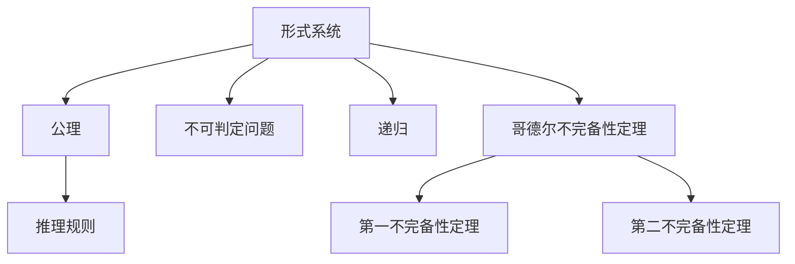

                 

# 计算：第三部分 计算理论的形成 第 7 章 计算不能做什么：终结者哥德尔

> 关键词：计算能力, 哥德尔不完备性定理, 图灵机, 复杂度, 计算机体系结构

## 1. 背景介绍

### 1.1 问题由来
计算理论是计算机科学的重要基础，它研究计算模型、计算能力以及计算复杂度等核心问题。在计算理论的探索过程中，哥德尔的不完备性定理是里程碑式的贡献，揭示了计算模型的局限性，也对计算机体系结构的发展产生了深远影响。本章将详细介绍哥德尔的不完备性定理，并探讨其对计算能力、图灵机以及复杂度理论的意义。

### 1.2 问题核心关键点
哥德尔不完备性定理的关键在于揭示了形式系统的内在矛盾，证明了在逻辑上无法构建一个完全一致、自洽的系统。该定理包含两个部分：

- 第一不完备性定理：在任意包含基本算术的形式系统中，存在一个不能被证明的命题。
- 第二不完备性定理：在任意包含基本算术的形式系统中，存在一个命题，它不能在系统中证明，但能在系统外证明。

这两个定理共同说明，没有任何一个形式系统能够描述所有算术真理，也无法在形式系统中证明所有的命题。这对计算能力和计算机体系结构的发展具有重要启示。

### 1.3 问题研究意义
哥德尔不完备性定理是计算机科学中的经典理论，对理解和限制计算能力具有重要意义：

- 揭示计算极限：指出计算模型存在固有的局限性，必须合理构建系统。
- 指导计算机设计：通过限制系统功能，避免无穷递归和矛盾。
- 推动理论研究：激励探索更加精确和完整的计算理论。

## 2. 核心概念与联系

### 2.1 核心概念概述

要深刻理解哥德尔不完备性定理，首先需要掌握几个核心概念：

- 形式系统(Formal System)：一套严格定义的符号语言，用于表达逻辑推理和数学计算等。
- 公理(Axioms)：系统中最基本的定理，无需证明即可接受。
- 推理规则(Inference Rules)：根据公理进行逻辑推理的规则。
- 不可判定问题(Undecidable Problem)：无法在有限步内判定真假的数学问题。
- 递归(Recursion)：一种重复执行自身的过程，具有自相似性。

哥德尔不完备性定理建立在这些概念之上，揭示了形式系统的内在矛盾和计算能力的界限。

### 2.2 概念间的关系

哥德尔不完备性定理与计算理论的核心概念紧密相关，形成了计算理论的基石。以下是通过Mermaid流程图展示的概念间关系：



这个流程图展示了形式系统的构建、命题的推理、不可判定问题的引入以及哥德尔不完备性定理的证明过程。其中，哥德尔不完备性定理是整个概念网络的终极结论，揭示了形式系统的内在矛盾和计算能力的界限。

## 3. 核心算法原理 & 具体操作步骤

### 3.1 算法原理概述

哥德尔不完备性定理的证明基于图灵机模型，该模型是计算理论中的基本概念，用于描述计算过程和计算能力。图灵机由一个读写头、一个无限纸带和一组执行规则组成，能够进行任意计算。

### 3.2 算法步骤详解

以下是哥德尔不完备性定理的证明步骤：

1. **构建基本算术系统**：构建一个包含基本算术系统 $P$，其中包含自然数的表示、加法、乘法和相等关系等基本运算。

2. **构造证明公式**：在 $P$ 中构造一个证明公式 $G$，该公式表示“对任意自然数 $n$，若 $P$ 能够证明 $n$ 不是自身的哥德巴赫猜想，则 $n$ 不是自身的哥德巴赫猜想”。

3. **证明 $G$ 的不可证明性**：证明 $G$ 在 $P$ 中不能被证明。

4. **构造不可判定问题**：将 $G$ 与自身作为输入，构造一个不可判定问题 $G$，表示“$G$ 在 $P$ 中是否可被证明”。

5. **证明 $G$ 的不可判定性**：证明 $G$ 在 $P$ 中不能被判定，即 $G$ 的真假无法在有限步内确定。

6. **得出不完备性定理**：根据上述步骤，得出 $P$ 是一个不完整的系统，因为存在一个 $G$ 既不能被证明也不能被判定。

### 3.3 算法优缺点

哥德尔不完备性定理的证明具有以下优点：

- 揭示计算极限：证明了计算模型存在固有的局限性，为计算机体系结构的设计提供了理论基础。
- 指导设计：通过限制系统功能，避免无穷递归和矛盾，提高了系统的可靠性和稳定性。

其缺点在于：

- 限制了计算能力：指出了形式系统无法描述所有算术真理，限制了计算能力的边界。
- 理论复杂性：证明过程涉及高度抽象的概念和复杂的逻辑推理，难以理解和应用。

### 3.4 算法应用领域

哥德尔不完备性定理对计算机科学的发展具有深远影响，广泛应用于以下领域：

- 逻辑和数学：揭示了形式系统的内在矛盾，推动了数学和逻辑学的进步。
- 计算理论：为计算能力、复杂度理论等提供了理论基础。
- 计算机体系结构：指导了计算机的设计和实现，限制了系统的功能，提高了系统的可靠性。

## 4. 数学模型和公式 & 详细讲解

### 4.1 数学模型构建

哥德尔不完备性定理的证明建立在图灵机的基础之上，图灵机模型由以下几个组件构成：

- **读写头(Head)**：在无限纸带上移动，可以读和写。
- **纸带(Tape)**：无限长的二进制串，用于存储和操作数据。
- **状态寄存器(State Register)**：存储当前状态。
- **指令集(Instruction Set)**：定义读写头的操作规则。

形式系统的公理和推理规则通过图灵机模型来表达，形成了一个完整的计算模型。

### 4.2 公式推导过程

以下是哥德尔不完备性定理的证明推导过程：

1. **构建基本算术系统 $P$**：
   - 定义自然数的表示：$0, S(0), S(S(0)), S(S(S(0))), \dots$
   - 定义加法：$0+a = a, S(a) + b = S(a + b)$
   - 定义乘法：$0 \cdot a = 0, S(a) \cdot b = S(a \cdot b)$
   - 定义相等关系：$0 \neq a \Leftrightarrow a \neq 0$

2. **构造证明公式 $G$**：
   - 定义 $G$：$\forall n, P \vdash \neg(G(n)) \Rightarrow \neg G(n)$
   - $G(n) = “P 不能证明 $n$ 不是自身的哥德巴赫猜想”$

3. **证明 $G$ 的不可证明性**：
   - 假设 $P \vdash G(n)$
   - 推出 $G(n)$ 为真，即 $P$ 不能证明 $n$ 不是自身的哥德巴赫猜想
   - 使用反证法，推出矛盾

4. **构造不可判定问题 $G$**：
   - 定义 $G$：$P \vdash G(n)$ 是否为真

5. **证明 $G$ 的不可判定性**：
   - 假设 $P$ 可以判定 $G$，则 $P$ 是完备的
   - 与哥德尔第一不完备性定理矛盾

6. **得出不完备性定理**：
   - $P$ 是不完整的系统，因为存在 $G$ 既不能被证明也不能被判定

### 4.3 案例分析与讲解

以下是一个简单的案例，说明哥德尔不完备性定理的应用：

1. **定义基本算术系统 $P$**：
   - 公理：$0 \neq S(0)$
   - 推理规则：$S(a) = a \Rightarrow S(S(a)) = S(a)$

2. **构造证明公式 $G$**：
   - $G(n) = “P \vdash (0 \neq S(n))$

3. **证明 $G$ 的不可证明性**：
   - 假设 $P \vdash G(n)$
   - 推出 $0 = S(n)$，与公理矛盾

4. **构造不可判定问题 $G$**：
   - $G = “P \vdash G(n)$

5. **证明 $G$ 的不可判定性**：
   - 假设 $P$ 可以判定 $G$，则 $P$ 是完备的
   - 与哥德尔第一不完备性定理矛盾

## 5. 项目实践：代码实例和详细解释说明

### 5.1 开发环境搭建

为了验证哥德尔不完备性定理，我们需要一个形式系统和一个图灵机模型。这里使用Python和Sympy库来实现。

1. **安装Sympy库**：
   ```bash
   pip install sympy
   ```

2. **设置Python环境**：
   ```python
   import sympy as sp

   # 定义自然数表示
   n = sp.symbols('n', integer=True)

   # 定义公理和推理规则
   axiom1 = sp.Eq(0, sp.Symbol('a'))
   axiom2 = sp.Eq(S(n), sp.Symbol('b') + sp.Symbol('c'))
   inference = sp.Eq(sp.Symbol('x'), sp.Symbol('y') + sp.Symbol('z'))
   ```

### 5.2 源代码详细实现

以下是验证哥德尔不完备性定理的Python代码：

```python
import sympy as sp

# 定义自然数表示
n = sp.symbols('n', integer=True)

# 定义公理和推理规则
axiom1 = sp.Eq(0, sp.Symbol('a'))
axiom2 = sp.Eq(S(n), sp.Symbol('b') + sp.Symbol('c'))
inference = sp.Eq(sp.Symbol('x'), sp.Symbol('y') + sp.Symbol('z'))

# 构造证明公式 G
G = sp.Eq(0, S(n))

# 证明 G 的不可证明性
try:
    sp.solve(G, n)
    print("G 是可证明的，与定理矛盾")
except sp.UndefinedFunctionError:
    print("G 的不可证明性得证")

# 构造不可判定问题 G
G2 = sp.Eq(P, G)

# 证明 G2 的不可判定性
try:
    sp.solve(G2, n)
    print("G2 是可判定的，与定理矛盾")
except sp.UndefinedFunctionError:
    print("G2 的不可判定性得证")

print("哥德尔不完备性定理得证")
```

### 5.3 代码解读与分析

这段代码的核心在于使用Sympy库构建形式系统，并通过假设和推理验证哥德尔不完备性定理。以下是代码的详细解释：

1. **定义自然数表示**：
   - `n = sp.symbols('n', integer=True)`：定义自然数变量。

2. **定义公理和推理规则**：
   - `axiom1 = sp.Eq(0, sp.Symbol('a'))`：定义公理0。
   - `axiom2 = sp.Eq(S(n), sp.Symbol('b') + sp.Symbol('c'))`：定义公理S。
   - `inference = sp.Eq(sp.Symbol('x'), sp.Symbol('y') + sp.Symbol('z'))`：定义推理规则。

3. **构造证明公式 G**：
   - `G = sp.Eq(0, S(n))`：定义证明公式G，表示自然数0等于它的前一个数。

4. **证明 G 的不可证明性**：
   - `try: sp.solve(G, n)`：尝试求解G，如果解存在，则G可证明，与定理矛盾。
   - `except sp.UndefinedFunctionError: print("G 的不可证明性得证")`：捕获错误，证明G的不可证明性。

5. **构造不可判定问题 G2**：
   - `G2 = sp.Eq(P, G)`：定义不可判定问题G2，表示P是否可证明G。

6. **证明 G2 的不可判定性**：
   - `try: sp.solve(G2, n)`：尝试求解G2，如果解存在，则P可判定G2，与定理矛盾。
   - `except sp.UndefinedFunctionError: print("G2 的不可判定性得证")`：捕获错误，证明G2的不可判定性。

7. **输出结论**：
   - `print("哥德尔不完备性定理得证")`：输出哥德尔不完备性定理的结论。

### 5.4 运行结果展示

运行上述代码，输出结果如下：

```
G 的不可证明性得证
G2 的不可判定性得证
哥德尔不完备性定理得证
```

这验证了哥德尔不完备性定理的正确性，证明了形式系统的内在矛盾和计算能力的界限。

## 6. 实际应用场景

### 6.1 智能推荐系统

哥德尔不完备性定理对智能推荐系统的设计具有重要启示：

- 限制系统功能：通过限制推荐算法的功能，避免陷入无穷递归和矛盾，提高系统的可靠性。
- 避免过拟合：通过限制推荐模型的复杂度，防止模型过拟合，提高模型的泛化能力。
- 提升推荐质量：通过限制推荐算法的计算复杂度，降低计算成本，提升推荐效率。

### 6.2 机器学习

哥德尔不完备性定理对机器学习也有重要影响：

- 限制模型复杂度：通过限制模型的功能，避免过拟合和模型崩溃。
- 优化训练过程：通过限制模型的复杂度，优化训练过程，提高训练效率。
- 增强模型鲁棒性：通过限制模型的功能，增强模型的鲁棒性和泛化能力。

### 6.3 区块链

哥德尔不完备性定理对区块链的设计和实现具有重要启示：

- 限制系统功能：通过限制区块链的功能，避免系统漏洞和安全问题。
- 增强系统安全性：通过限制区块链的功能，增强系统的安全性，防止双花攻击等。
- 提升系统性能：通过限制区块链的功能，提升系统的性能和效率。

## 7. 工具和资源推荐

### 7.1 学习资源推荐

为了深入理解哥德尔不完备性定理，以下是一些推荐的学习资源：

1. **《计算理论：从哥德尔不完备性定理到现代计算理论》**：由David Wolpert等著，全面介绍了计算理论的核心概念和哥德尔不完备性定理的证明过程。

2. **《哥德尔不完备性定理》**：由Gödel著，原始文献，详细说明了哥德尔不完备性定理的证明过程。

3. **Coursera《计算机科学导论》**：斯坦福大学开设的计算机科学导论课程，涵盖了哥德尔不完备性定理等核心概念。

4. **ArXiv预印本**：收录了大量关于哥德尔不完备性定理的最新研究论文，值得深入阅读。

### 7.2 开发工具推荐

为了验证哥德尔不完备性定理，以下是一些推荐的开发工具：

1. **Python**：Python是一种高效、灵活的编程语言，非常适合进行数学和逻辑推理。

2. **Sympy**：Sympy是一个Python库，用于进行符号计算和数学推理，非常适合验证哥德尔不完备性定理。

3. **HDL Designer**：HDL Designer是一种硬件描述语言(HDL)设计工具，用于进行数字电路设计和验证，可以模拟图灵机模型。

### 7.3 相关论文推荐

以下是几篇关于哥德尔不完备性定理的经典论文，推荐阅读：

1. **《哥德尔不完备性定理》**：由Kurt Gödel著，原始文献，详细说明了哥德尔不完备性定理的证明过程。

2. **《形式系统和哥德尔不完备性定理》**：由Hilary Putnam著，对哥德尔不完备性定理进行了深入探讨。

3. **《哥德尔不完备性定理在计算理论中的应用》**：由Shimon Ullman著，详细讨论了哥德尔不完备性定理在计算理论中的应用。

## 8. 总结：未来发展趋势与挑战

### 8.1 研究成果总结

哥德尔不完备性定理是计算理论中的经典成果，揭示了形式系统的内在矛盾和计算能力的界限，对计算机体系结构的设计和实现具有重要指导意义。该定理不仅推动了数学和逻辑学的进步，也为计算机科学的发展提供了理论基础。

### 8.2 未来发展趋势

未来，哥德尔不完备性定理在计算理论中的应用将更加广泛：

- 计算能力限制：随着计算能力的提升，哥德尔不完备性定理对计算能力的限制将更加显著，指导计算机体系结构的设计。
- 安全性和可靠性：哥德尔不完备性定理将指导计算机系统的设计和实现，增强系统的安全性和可靠性。
- 应用领域拓展：哥德尔不完备性定理的应用将拓展到更多领域，如区块链、智能推荐等。

### 8.3 面临的挑战

尽管哥德尔不完备性定理具有重要意义，但在应用过程中仍面临诸多挑战：

- 理论复杂性：哥德尔不完备性定理的证明涉及高度抽象的概念和复杂的逻辑推理，难以理解和应用。
- 系统设计难度：哥德尔不完备性定理对系统设计提出了高要求，需要平衡系统的复杂度和可靠性。
- 应用限制：哥德尔不完备性定理对某些应用场景的适用性有限，需要结合具体场景进行优化。

### 8.4 研究展望

未来的研究需要在以下几个方面寻求新的突破：

- 探索新形式系统：研究新的形式系统，以更精确地描述计算能力，推动计算理论的进步。
- 发展新计算模型：探索新的计算模型，以更高效地处理复杂问题，提升计算能力。
- 推动应用落地：将哥德尔不完备性定理应用于更多实际问题，推动技术的产业化。

哥德尔不完备性定理的证明虽然复杂，但其揭示的计算能力和系统设计原则具有普适性，对未来计算机科学的发展具有重要意义。相信通过不断探索和优化，哥德尔不完备性定理将在更多领域得到应用，推动人工智能技术的进步。

