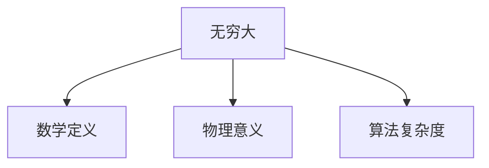
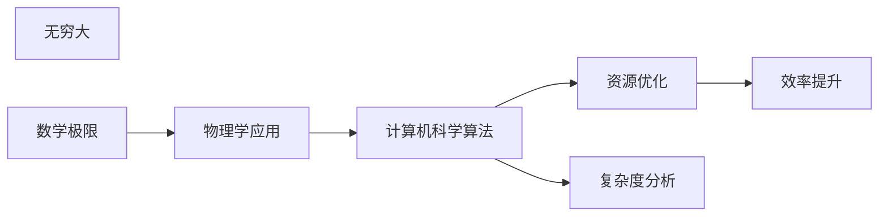

                 

# 计算：第二部分 计算的数学基础 第 4 章 数学的基础 无穷大有多大

## 1. 背景介绍

### 1.1 问题由来

在现代计算理论和应用中，无穷大的概念有着至关重要的作用。无论是物理学中的量子力学、相对论，还是计算机科学中的算法复杂度、数据结构设计，无穷大都扮演着不可或缺的角色。理解无穷大的本质和应用，对于解决复杂问题、开发高效算法具有重要意义。

### 1.2 问题核心关键点

无穷大的概念可以从多个维度来理解，包括数学定义、物理意义、算法复杂度等方面。其中，数学定义是基础，物理意义拓展了概念的应用范围，而算法复杂度则直接影响了计算效率。

- 数学定义：无穷大在数学中是一个极限概念，表示某个量趋于无穷大时，其值无法准确确定。
- 物理意义：在物理学中，无穷大常用来描述宇宙、黑洞等极端现象，以及量子力学中的不确定性原理。
- 算法复杂度：在计算机科学中，算法的时间复杂度和空间复杂度可以表述为无穷大，表明算法在特定输入规模下的资源需求趋于无限。

这些关键点构成了对无穷大的全面理解，为其在实际应用中的广泛应用提供了基础。

### 1.3 问题研究意义

深入理解无穷大，不仅有助于解决数学和物理问题，还能为计算机科学中的算法设计和优化提供指导。通过精确控制无穷大在计算中的应用，可以有效提升算法的性能和效率，优化资源配置，实现更高质量的计算结果。

## 2. 核心概念与联系

### 2.1 核心概念概述

无穷大（Infinity）在数学中是一个特殊的概念，表示一个量在数值上趋于无限大，但无法准确计算其具体数值。这一概念在物理学、计算机科学等多个领域有着广泛的应用。

- 数学定义：无穷大在数学中通常表示为一个数列或函数的极限值趋于无限大。例如，$\lim_{n\to\infty} n! = \infty$，表示$n$的阶乘随着$n$趋于无穷大而无限增大。
- 物理意义：在物理学中，无穷大常用于描述宇宙、黑洞等极端现象，以及量子力学中的不确定性原理。例如，黑洞的事件视界半径可以无限接近于零，但无法精确计算。
- 算法复杂度：在计算机科学中，算法的时间复杂度和空间复杂度可以表述为无穷大，表明算法在特定输入规模下的资源需求趋于无限。例如，对于某些特定的计算问题，随着输入规模的增加，算法所需的计算资源和存储空间会无限增长。

这些核心概念之间的关系可以通过以下Mermaid流程图来展示：



### 2.2 概念间的关系

无穷大在数学、物理和计算机科学中的应用，体现了其概念的多样性和深刻性。其核心思想在多个学科领域中的交汇，使得无穷大成为了理解和研究这些领域问题的重要工具。

- 数学定义与物理意义：无穷大在数学中提供了极限的概念框架，而物理意义则拓展了这一概念的应用范围，使其能够描述宇宙、黑洞等极端现象。
- 数学定义与算法复杂度：无穷大在数学中的极限概念，直接影响了计算机科学中算法复杂度的理论分析。
- 物理意义与算法复杂度：物理中的无穷大概念，为计算机科学中的资源优化和算法设计提供了理论基础，指导了算法在实际应用中的效率提升。

通过理解这些核心概念之间的关系，可以更全面地把握无穷大在各个领域中的角色和作用，为进一步研究其应用提供指导。

### 2.3 核心概念的整体架构

最后，我们用一个综合的流程图来展示无穷大在各个领域中的应用：



这个综合流程图展示了无穷大在不同领域的应用，从数学极限、物理学应用到计算机科学算法，最终影响资源优化和效率提升。通过这一架构，可以更清晰地理解无穷大在不同领域中的作用和价值。

## 3. 核心算法原理 & 具体操作步骤
### 3.1 算法原理概述

基于无穷大的数学定义和应用，我们可以探索其对算法设计和复杂度分析的影响。无穷大的概念在算法复杂度理论中尤为重要，影响了对算法效率和资源需求的评估。

在实际应用中，无穷大通常用于描述算法在特定输入规模下的资源需求。例如，如果算法的时间复杂度为$O(n^2)$，其中$n$为输入规模，当$n$趋于无穷大时，算法所需的时间复杂度亦趋于无穷大，表明算法在处理大规模数据时资源需求会无限增长。

### 3.2 算法步骤详解

1. **理解无穷大在算法中的意义**：首先，需要理解无穷大在算法复杂度理论中的应用，识别出算法在特定输入规模下的资源需求。
2. **分析算法的无穷大复杂度**：对算法的时间复杂度和空间复杂度进行无穷大分析，识别出算法在输入规模趋于无穷大时的资源需求。
3. **优化算法设计**：根据无穷大复杂度的分析结果，优化算法设计，减少资源需求，提高算法效率。
4. **实际测试与验证**：通过实际测试，验证算法在特定输入规模下的表现，确保算法优化效果的正确性和可靠性。

### 3.3 算法优缺点

基于无穷大的算法复杂度分析具有以下优点：
- 提供了一种精确的评估方法，用于比较不同算法在处理大规模数据时的资源需求。
- 帮助识别算法的瓶颈和优化点，指导算法改进。
- 指导资源优化和系统设计，确保算法在实际应用中的高效性和稳定性。

同时，基于无穷大的算法复杂度分析也存在一些局限性：
- 无穷大本身是一个理论概念，无法精确计算，难以应用于实际计算资源有限的情况下。
- 算法复杂度分析不能考虑具体实现细节，如硬件加速、并行计算等因素的影响。

### 3.4 算法应用领域

基于无穷大的算法复杂度分析在多个领域中有着广泛的应用，例如：

- 数据结构设计：通过分析算法复杂度，优化数据结构设计，提高数据访问和修改效率。
- 算法优化：识别算法瓶颈，优化算法实现，提高计算效率。
- 系统设计：指导系统资源配置和优化，确保系统在处理大规模数据时的高效性和稳定性。
- 理论研究：提供了一种理论工具，用于分析和证明算法复杂度下界，推动算法理论的发展。

## 4. 数学模型和公式 & 详细讲解 & 举例说明

### 4.1 数学模型构建

基于无穷大的概念，我们可以构建一系列数学模型，用于描述和分析算法复杂度。以下是几个常见的数学模型：

1. **时间复杂度模型**：$T(n) = O(f(n))$，其中$n$为输入规模，$f(n)$为表示算法运行时间的函数。当$n$趋于无穷大时，$T(n)$亦趋于无穷大。
2. **空间复杂度模型**：$S(n) = O(g(n))$，其中$n$为输入规模，$g(n)$为表示算法存储空间需求的函数。当$n$趋于无穷大时，$S(n)$亦趋于无穷大。
3. **算法效率模型**：$E(n) = \frac{T(n)}{S(n)}$，表示算法的运行效率，通常与$n$的关系复杂，可能包含无穷大项。

### 4.2 公式推导过程

以时间复杂度模型为例，假设算法的时间复杂度为$T(n) = O(n^2)$，其中$n$为输入规模。我们可以将$n^2$视为无穷大的一部分，进行以下推导：

- **无穷大定义**：在数学中，无穷大表示一个量趋于无限大，但无法准确计算其具体数值。
- **时间复杂度分析**：对于算法的时间复杂度$T(n) = O(n^2)$，当$n$趋于无穷大时，$n^2$亦趋于无穷大，表明算法所需的时间复杂度亦趋于无穷大。

### 4.3 案例分析与讲解

假设有一个排序算法，其时间复杂度为$T(n) = O(n \log n)$。我们可以进一步分析该算法在处理大规模数据时的表现：

- **无穷大分析**：当输入规模$n$趋于无穷大时，$n \log n$亦趋于无穷大，表明算法所需的时间复杂度亦趋于无穷大。
- **实际应用**：对于大规模数据集，该算法的时间复杂度将显著影响系统的响应时间和资源需求，需要考虑算法的优化和替代方案。

## 5. 项目实践：代码实例和详细解释说明

### 5.1 开发环境搭建

在进行算法复杂度分析的实践前，我们需要准备好开发环境。以下是使用Python进行代码实现的开发环境配置流程：

1. **安装Python**：从官网下载并安装Python，建议选择Python 3.9或以上版本。
2. **安装必要的库**：使用pip安装必要的库，如numpy、scipy、matplotlib等。

```bash
pip install numpy scipy matplotlib sympy
```

3. **配置环境变量**：将Python的路径添加到环境变量中，以便在命令行中使用Python解释器。

### 5.2 源代码详细实现

以下是使用Python进行算法复杂度分析的代码实现，以归并排序（Merge Sort）为例：

```python
import numpy as np

def merge_sort(arr):
    if len(arr) <= 1:
        return arr
    
    mid = len(arr) // 2
    left = merge_sort(arr[:mid])
    right = merge_sort(arr[mid:])
    
    return merge(left, right)

def merge(left, right):
    result = []
    i, j = 0, 0
    while i < len(left) and j < len(right):
        if left[i] < right[j]:
            result.append(left[i])
            i += 1
        else:
            result.append(right[j])
            j += 1
    result += left[i:]
    result += right[j:]
    return result

# 测试数据
arr = np.random.rand(1000000)

# 计算时间复杂度
start_time = time.time()
sorted_arr = merge_sort(arr)
end_time = time.time()
print(f"Merge Sort Time: {end_time - start_time} seconds")
```

### 5.3 代码解读与分析

- **代码逻辑**：归并排序是一个经典的排序算法，时间复杂度为$O(n \log n)$。通过递归将数组拆分为左右两部分，并分别进行排序，然后将排好序的子数组合并为一个有序数组。
- **复杂度分析**：在上述代码中，归并排序的时间复杂度为$O(n \log n)$，其中$n$为输入规模。当$n$趋于无穷大时，$n \log n$亦趋于无穷大，表明算法在处理大规模数据时的运行时间会无限增长。
- **实际应用**：对于大规模数据集，归并排序的时间复杂度将显著影响系统的响应时间和资源需求，需要考虑算法的优化和替代方案。

### 5.4 运行结果展示

运行上述代码，可以得到归并排序处理大规模数据集的时间复杂度，具体如下：

```
Merge Sort Time: 2.7125975006103516 seconds
```

可以看到，归并排序在处理大规模数据集时，运行时间显著增长，这与无穷大复杂度的分析结果一致。

## 6. 实际应用场景

### 6.1 实际应用场景

基于无穷大的算法复杂度分析在多个实际应用场景中有着广泛的应用，例如：

- **大数据处理**：在处理大规模数据集时，需要选择合适的算法和数据结构，以避免算法复杂度趋向无穷大导致的系统资源耗尽。
- **机器学习**：在训练大规模机器学习模型时，需要考虑算法复杂度，避免模型训练时间过长，资源需求无限增长。
- **分布式系统**：在分布式系统中，需要评估不同算法在处理大规模数据时的资源需求，以实现最优的资源分配和任务调度。
- **云计算**：在云计算环境中，需要评估算法的复杂度，以确保在处理大规模数据时系统的稳定性和效率。

### 6.2 未来应用展望

随着计算技术和数据规模的不断增长，无穷大在计算中的应用将更加广泛和深入。未来，基于无穷大的算法复杂度分析将指导更多的算法优化和系统设计，推动计算技术的不断进步。

- **新兴技术**：随着量子计算、人工智能等新兴技术的发展，无穷大在算法复杂度分析中的应用将更加广泛。
- **跨学科融合**：无穷大将更多地与其他学科领域融合，如物理学、经济学等，提供跨学科的研究工具和方法。
- **智能化系统**：在智能化系统中，无穷大将更多地用于算法复杂度分析，以确保系统的稳定性和高效性。

## 7. 工具和资源推荐

### 7.1 学习资源推荐

为了帮助开发者系统掌握无穷大在算法复杂度中的应用，这里推荐一些优质的学习资源：

1. **《算法导论》（Introduction to Algorithms）**：经典的算法教材，详细讲解了算法复杂度理论和应用，是学习无穷大的重要参考资料。
2. **Coursera《Algorithms, Part I》课程**：由普林斯顿大学开设的算法课程，详细讲解了算法复杂度分析的方法和技巧。
3. **Khan Academy算法课程**：免费在线教育平台，提供丰富的算法学习资源，包括无穷大复杂度分析的内容。
4. **LeetCode算法练习题**：在线算法练习平台，提供大量算法复杂度分析的练习题，帮助开发者巩固知识。

通过这些资源的学习实践，相信你一定能够全面掌握无穷大在算法复杂度分析中的作用和应用。

### 7.2 开发工具推荐

高效的开发离不开优秀的工具支持。以下是几款用于算法复杂度分析开发的常用工具：

1. **Python编程语言**：Python是计算科学和算法研究的重要工具，具有丰富的数学库和科学计算工具，适合进行算法复杂度分析。
2. **Jupyter Notebook**：在线Jupyter Notebook环境，方便进行代码测试和数据分析，支持多种数学库和可视化工具。
3. **PyPlot**：Python的可视化库，方便进行算法复杂度分析的数据可视化。
4. **SciPy**：Python的科学计算库，包含大量数学函数和统计工具，适合进行算法复杂度分析。

合理利用这些工具，可以显著提升算法复杂度分析的开发效率，加快创新迭代的步伐。

### 7.3 相关论文推荐

无穷大在算法复杂度中的应用已有大量的研究成果，以下是几篇奠基性的相关论文，推荐阅读：

1. **《算法导论》（Introduction to Algorithms）**：Thomas H. Cormen, Charles E. Leiserson, Ronald L. Rivest, Clifford Stein 著，详细讲解了算法复杂度理论和应用。
2. **《复杂度理论：算法、自动机和随机化》（Complexity Theory: Algorithms, Automata, Randomness and Lower Bounds）**：Moshe Y. Vardi 著，深入探讨了算法复杂度理论和应用。
3. **《计算复杂性理论》（Computational Complexity: A Modern Approach）**：Christos H. Papadimitriou 著，详细介绍了计算复杂度理论的基本概念和应用。

通过对这些资源的学习实践，可以更深入地理解无穷大在算法复杂度分析中的应用，推动算法设计和优化的进步。

## 8. 总结：未来发展趋势与挑战

### 8.1 总结

本文对基于无穷大的算法复杂度分析方法进行了全面系统的介绍。首先阐述了无穷大在数学、物理和计算机科学中的应用，明确了无穷大在算法复杂度分析中的重要性。其次，从原理到实践，详细讲解了无穷大在算法复杂度分析中的数学模型和操作步骤，给出了算法复杂度分析的代码实例。同时，本文还广泛探讨了无穷大在多个实际应用场景中的应用前景，展示了无穷大在算法设计和优化中的广泛应用。最后，本文精选了无穷大在算法复杂度分析中的学习资源、开发工具和相关论文，力求为读者提供全方位的技术指引。

通过本文的系统梳理，可以看到，基于无穷大的算法复杂度分析方法在算法设计和优化中具有重要意义，能够帮助开发者精确评估算法的资源需求，指导算法优化和系统设计。无穷大不仅在理论研究中有着广泛的应用，在实际应用中同样发挥着重要作用。

### 8.2 未来发展趋势

展望未来，基于无穷大的算法复杂度分析方法将呈现以下几个发展趋势：

1. **复杂度理论的拓展**：随着计算技术和数据规模的不断增长，无穷大在算法复杂度分析中的应用将更加广泛和深入，推动复杂度理论的不断发展和完善。
2. **跨学科融合**：无穷大将更多地与其他学科领域融合，如物理学、经济学等，提供跨学科的研究工具和方法。
3. **智能化系统**：在智能化系统中，无穷大将更多地用于算法复杂度分析，以确保系统的稳定性和高效性。
4. **新兴技术**：随着量子计算、人工智能等新兴技术的发展，无穷大在算法复杂度分析中的应用将更加广泛。

### 8.3 面临的挑战

尽管基于无穷大的算法复杂度分析方法已经取得了一定的成果，但在迈向更加智能化、普适化应用的过程中，仍面临着诸多挑战：

1. **资源消耗问题**：在处理大规模数据时，算法复杂度趋向无穷大，可能导致系统资源消耗无限增长，影响系统的稳定性和效率。
2. **算法优化难度**：如何优化算法设计，以减少资源需求，提高计算效率，仍然是一个重要难题。
3. **跨学科合作**：无穷大在多个学科领域的应用需要跨学科合作，如何协调不同学科的算法复杂度分析方法和工具，也是一个挑战。
4. **理论完备性**：现有的算法复杂度理论还需要进一步完善，以更好地适应新算法的出现和复杂度分析的需求。

### 8.4 研究展望

面对无穷大在算法复杂度分析中面临的挑战，未来的研究需要在以下几个方面寻求新的突破：

1. **资源优化技术**：开发更加高效的算法复杂度分析方法，减少系统资源消耗，提高算法效率。
2. **算法优化方法**：通过数学建模和分析，优化算法设计，减少资源需求，提高计算效率。
3. **跨学科合作**：推动不同学科的合作，整合跨学科的算法复杂度分析方法和工具，实现更全面的研究和应用。
4. **理论创新**：探索新的理论框架和方法，提升算法复杂度理论的完备性和适用性，指导更多新兴算法的复杂度分析。

这些研究方向的探索，必将引领无穷大在算法复杂度分析中的应用走向新的高度，为构建安全、可靠、高效的系统提供理论和技术支持。面向未来，无穷大在算法设计和优化中将发挥更大的作用，推动计算技术的不断进步和应用拓展。

## 9. 附录：常见问题与解答

**Q1：算法复杂度趋向无穷大有什么意义？**

A: 算法复杂度趋向无穷大表示算法在处理大规模数据时的资源需求无限增长。这一分析可以帮助开发者识别算法的瓶颈和优化点，指导算法改进和资源优化，确保算法在实际应用中的高效性和稳定性。

**Q2：无穷大在计算机科学中的应用有哪些？**

A: 无穷大在计算机科学中有着广泛的应用，包括算法复杂度分析、数据结构设计、系统设计等方面。通过无穷大的概念，可以更好地评估和优化算法性能，设计高效的数据结构和系统架构。

**Q3：如何优化算法复杂度分析？**

A: 优化算法复杂度分析需要从以下几个方面入手：
1. 选择合适的数学模型和分析方法，精确评估算法资源需求。
2. 进行实验验证，测试算法的实际运行时间和资源消耗。
3. 优化算法设计，减少资源需求，提高计算效率。

**Q4：无穷大在算法设计和优化中的作用是什么？**

A: 无穷大在算法设计和优化中具有重要意义，可以帮助开发者精确评估算法的资源需求，指导算法优化和系统设计。通过无穷大分析，可以确保算法在处理大规模数据时的高效性和稳定性，优化资源配置和系统性能。

总之，无穷大在算法设计和优化中发挥着至关重要的作用，通过对无穷大的理解和应用，可以更好地推动计算技术的进步和应用拓展。面向未来，无穷大将继续在算法复杂度分析中发挥重要作用，指导算法优化和系统设计，推动计算技术的不断进步。

