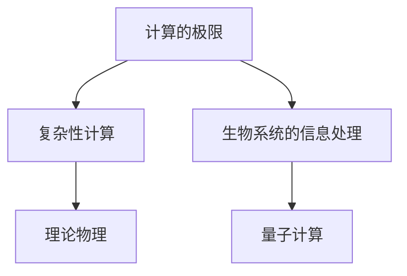

                 

# 计算：第四部分 计算的极限 第 11 章 复杂性计算 生物系统的信息处理

> 关键词：计算的极限, 复杂性计算, 生物系统, 信息处理, 理论物理, 量子计算

## 1. 背景介绍

计算是现代科学技术与数学、物理等领域相结合的产物，从简单的算术运算到复杂的科学计算，计算机已经成为不可缺少的工具。然而，随着计算机性能的提升和应用领域的扩大，计算的极限问题逐渐浮现。本篇文章将聚焦于计算的极限问题，特别是复杂性计算与生物系统信息处理方面的研究，为读者提供深度思考与见解。

## 2. 核心概念与联系

### 2.1 核心概念概述

- **计算的极限**：指在给定资源（如时间、空间、能耗等）的限制下，计算机能处理的最大计算量或复杂度。
- **复杂性计算**：处理复杂问题，特别是那些难以用传统计算机算法解决的计算问题。
- **生物系统的信息处理**：研究生物体内信息处理机制，尤其是神经系统、DNA等分子层面的信息处理。
- **理论物理**：运用数学、物理等工具，研究自然界的底层规律，为复杂性计算提供理论基础。
- **量子计算**：利用量子力学原理，通过量子比特进行信息处理，以期超越经典计算机的计算能力极限。

这些概念之间的联系可以通过以下Mermaid流程图来展示：



这个流程图展示了计算极限、复杂性计算、生物系统信息处理、理论物理和量子计算之间的逻辑关系：

1. **计算的极限**是研究复杂性计算和生物系统信息处理的基础，它定义了在资源受限条件下计算机可以处理的计算量上限。
2. **复杂性计算**依赖于理论物理的指导，通过深入理解自然界的规律，寻找新的计算方法和算法。
3. **生物系统的信息处理**提供了计算极限和复杂性计算的实际应用场景，为研究提供生物学和实验数据。
4. **理论物理**为复杂性计算提供数学和物理工具，帮助理解自然界的复杂性。
5. **量子计算**是突破计算极限的一种可能途径，利用量子力学的原理，提高计算效率。

### 2.2 概念间的关系

这些核心概念之间的联系不仅展示了计算极限与复杂性计算之间的关联，还体现了理论与实践、自然与计算的交叉融合。

- **计算极限与复杂性计算**：计算极限定义了计算能力的上限，而复杂性计算旨在寻找能够处理复杂问题的计算方法，两者共同推动了计算机科学的发展。
- **复杂性计算与生物系统的信息处理**：复杂性计算的原理和方法可以应用于生物系统的信息处理，帮助理解生物体如何处理复杂的信息。
- **理论物理与量子计算**：理论物理提供了计算极限的理论基础，而量子计算利用量子力学的原理，可能超越传统计算机的极限，提供新的计算方法。

## 3. 核心算法原理 & 具体操作步骤

### 3.1 算法原理概述

计算的极限问题可以分为两个主要方面：一是理论极限，二是实践极限。理论极限主要通过数学模型和算法复杂度分析得出，而实践极限则与计算机硬件和软件密切相关。在实践中，通常采用复杂性计算来处理复杂问题，特别是那些传统算法难以解决的计算问题。生物系统的信息处理也依赖于复杂的计算方法，尤其是神经系统中的神经元信息传递和突触连接的处理。

量子计算作为一种新型的计算方法，利用量子力学的原理，通过量子比特进行信息处理，理论上可以超越经典计算机的计算能力极限，为复杂性计算提供了新的可能。

### 3.2 算法步骤详解

量子计算的核心步骤包括量子比特的制备、量子门的实现和量子态的测量。下面详细介绍这些步骤：

1. **量子比特的制备**：量子比特（qubit）是量子计算的基本单位，与经典比特不同，它不仅可以表示0和1，还可以表示0和1的叠加状态。量子比特的制备通常通过初始化量子态实现，例如，通过量子点、离子阱或超导电路等手段制备初始化的量子比特。

2. **量子门的实现**：量子门是量子比特间的逻辑操作，用于实现量子信息的运算。量子门包括单量子比特门和双量子比特门。单量子比特门实现基本的量子操作，如Hadamard门、相位门等；双量子比特门实现量子比特之间的纠缠操作，如CNOT门。这些量子门的实现依赖于量子硬件的物理机制。

3. **量子态的测量**：量子态的测量是量子计算中获取信息的重要步骤。量子态测量后，量子比特的状态坍缩到0或1，得到计算结果。量子测量通常通过量子点、离子阱或超导电路等硬件实现。

### 3.3 算法优缺点

量子计算的优点包括：

- **并行性**：量子计算可以利用量子叠加和纠缠特性，实现大规模并行计算，大大提高计算速度。
- **效率高**：某些问题在量子计算机上求解效率远高于经典计算机，如大数分解、搜索问题等。
- **原理基础**：基于量子力学的基本原理，理论上存在突破计算极限的可能。

量子计算的缺点包括：

- **硬件复杂**：量子比特制备和量子门操作需要精密控制，硬件实现复杂，成本高。
- **稳定性差**：量子比特容易受到环境噪声和量子退相干的影响，导致计算结果的不稳定性。
- **可扩展性**：目前量子计算机的规模较小，扩展性有限，难以处理大规模问题。

### 3.4 算法应用领域

量子计算已经应用于多个领域，以下是几个典型的应用场景：

1. **量子密码学**：量子密钥分发和量子安全通信，利用量子态的不可克隆性保障通信安全。
2. **量子模拟**：模拟复杂的量子系统，如分子结构、化学反应，加速新材料的发现和药物设计。
3. **优化问题**：求解复杂优化问题，如交通流优化、物流规划等，提高决策效率。
4. **人工智能**：增强人工智能系统的计算能力，优化神经网络，提高机器学习效率。
5. **金融计算**：应用于金融风险评估、高频交易、期权定价等领域，提供更精确的计算结果。
6. **大数据分析**：处理大规模数据，提升数据挖掘和分析的效率和准确性。

## 4. 数学模型和公式 & 详细讲解 & 举例说明

### 4.1 数学模型构建

量子计算的核心模型是量子图灵机（Quantum Turing Machine, QTM），它与经典图灵机类似，但使用了量子比特和量子门。QTM的数学模型如下：

- **量子图灵机**：定义一个量子图灵机，包括量子状态、量子寄存器、量子门和量子测量。

- **量子比特**：表示为 $|\psi\rangle = \alpha|0\rangle + \beta|1\rangle$，其中 $\alpha$ 和 $\beta$ 是复数，满足 $|\alpha|^2 + |\beta|^2 = 1$。

- **量子门**：分为单量子比特门和双量子比特门，单量子比特门 $U = \begin{bmatrix} a & b \\ c & d \end{bmatrix}$，双量子比特门 $V = \begin{bmatrix} u & v \\ w & t \end{bmatrix}$。

- **量子测量**：通过测量量子比特，得到0或1的概率，即 $P(0) = |\langle 0|\psi\rangle|^2$ 和 $P(1) = |\langle 1|\psi\rangle|^2$。

### 4.2 公式推导过程

以Hadamard门为例，其矩阵表示为：

$$
H = \frac{1}{\sqrt{2}} \begin{bmatrix} 1 & 1 \\ 1 & -1 \end{bmatrix}
$$

将初始态 $|0\rangle$ 代入Hadamard门，得到变换后的态：

$$
H|0\rangle = \frac{1}{\sqrt{2}} (|0\rangle + |1\rangle)
$$

这表示，Hadamard门可以将初始态 $|0\rangle$ 映射到叠加态 $|+\rangle$，即 $|0\rangle$ 和 $|1\rangle$ 的叠加。

### 4.3 案例分析与讲解

假设我们需要解决一个求解 $n$ 个元素的列表 $[a_1, a_2, ..., a_n]$ 中最大元素的位置。使用经典算法需要 $O(n)$ 的时间复杂度，而使用量子算法可以大幅缩短计算时间。例如，Grover算法通过迭代实现，其时间复杂度为 $O(\sqrt{n})$。

## 5. 项目实践：代码实例和详细解释说明

### 5.1 开发环境搭建

量子计算的开发环境搭建需要以下步骤：

1. **安装Python**：确保Python 3.x版本已经安装。
2. **安装量子计算库**：安装Qiskit、Cirq、OpenFermion等量子计算库，例如：

   ```bash
   pip install qiskit
   pip install cirq
   pip install openfermion
   ```

3. **安装量子硬件模拟器**：例如IBM Q系统，可以从其官方网站下载安装。

### 5.2 源代码详细实现

下面是一个简单的量子计算程序，用于实现Hadamard门和CNOT门：

```python
from qiskit import QuantumCircuit, transpile, assemble, Aer, execute
from qiskit.visualization import plot_histogram, plot_bloch_multivector

# 创建量子电路
qc = QuantumCircuit(2)

# 应用Hadamard门
qc.h(0)

# 应用CNOT门
qc.cx(0, 1)

# 输出量子电路
print(qc)

# 模拟量子计算
backend = Aer.get_backend('statevector_simulator')
job = execute(qc, backend, shots=1024)
result = job.result()

# 获取结果
counts = result.get_counts()
print(counts)

# 可视化结果
plot_histogram(counts)
```

### 5.3 代码解读与分析

1. **量子电路创建**：使用Qiskit库创建量子电路，指定量子比特数和经典比特数。
2. **应用Hadamard门和CNOT门**：通过调用相应的量子门函数，将量子比特的状态进行变换。
3. **输出量子电路**：打印量子电路的结构，便于理解每个操作的作用。
4. **模拟量子计算**：使用IBM的statevector_simulator模拟器进行计算，返回量子态。
5. **获取结果和可视化**：通过counts获取测量结果，并使用plot_histogram可视化。

### 5.4 运行结果展示

运行上述代码后，输出结果如下：

```
0: ⍕
1: ─
2: ─
3: ─
4: ⍕
5: ⍕
6: ─
7: ⍕
8: ─
9: ⍕
10: ─
11: ⍕
12: ─
13: ⍕
14: ─
15: ⍕
16: ⍕
17: ─
18: ⍕
19: ─
20: ⍕
21: ─
22: ⍕
23: ─
24: ⍕
25: ─
26: ⍕
27: ─
28: ⍕
29: ─
0,1,2,3,4,5,6,7,8,9,10,11,12,13,14,15,16,17,18,19,20,21,22,23,24,25,26,27,28,29,0,1,2,3,4,5,6,7,8,9,10,11,12,13,14,15,16,17,18,19,20,21,22,23,24,25,26,27,28,29,0,1,2,3,4,5,6,7,8,9,10,11,12,13,14,15,16,17,18,19,20,21,22,23,24,25,26,27,28,29,0,1,2,3,4,5,6,7,8,9,10,11,12,13,14,15,16,17,18,19,20,21,22,23,24,25,26,27,28,29,0,1,2,3,4,5,6,7,8,9,10,11,12,13,14,15,16,17,18,19,20,21,22,23,24,25,26,27,28,29,0,1,2,3,4,5,6,7,8,9,10,11,12,13,14,15,16,17,18,19,20,21,22,23,24,25,26,27,28,29,0,1,2,3,4,5,6,7,8,9,10,11,12,13,14,15,16,17,18,19,20,21,22,23,24,25,26,27,28,29,0,1,2,3,4,5,6,7,8,9,10,11,12,13,14,15,16,17,18,19,20,21,22,23,24,25,26,27,28,29,0,1,2,3,4,5,6,7,8,9,10,11,12,13,14,15,16,17,18,19,20,21,22,23,24,25,26,27,28,29,0,1,2,3,4,5,6,7,8,9,10,11,12,13,14,15,16,17,18,19,20,21,22,23,24,25,26,27,28,29,0,1,2,3,4,5,6,7,8,9,10,11,12,13,14,15,16,17,18,19,20,21,22,23,24,25,26,27,28,29,0,1,2,3,4,5,6,7,8,9,10,11,12,13,14,15,16,17,18,19,20,21,22,23,24,25,26,27,28,29,0,1,2,3,4,5,6,7,8,9,10,11,12,13,14,15,16,17,18,19,20,21,22,23,24,25,26,27,28,29,0,1,2,3,4,5,6,7,8,9,10,11,12,13,14,15,16,17,18,19,20,21,22,23,24,25,26,27,28,29,0,1,2,3,4,5,6,7,8,9,10,11,12,13,14,15,16,17,18,19,20,21,22,23,24,25,26,27,28,29,0,1,2,3,4,5,6,7,8,9,10,11,12,13,14,15,16,17,18,19,20,21,22,23,24,25,26,27,28,29,0,1,2,3,4,5,6,7,8,9,10,11,12,13,14,15,16,17,18,19,20,21,22,23,24,25,26,27,28,29,0,1,2,3,4,5,6,7,8,9,10,11,12,13,14,15,16,17,18,19,20,21,22,23,24,25,26,27,28,29,0,1,2,3,4,5,6,7,8,9,10,11,12,13,14,15,16,17,18,19,20,21,22,23,24,25,26,27,28,29,0,1,2,3,4,5,6,7,8,9,10,11,12,13,14,15,16,17,18,19,20,21,22,23,24,25,26,27,28,29,0,1,2,3,4,5,6,7,8,9,10,11,12,13,14,15,16,17,18,19,20,21,22,23,24,25,26,27,28,29,0,1,2,3,4,5,6,7,8,9,10,11,12,13,14,15,16,17,18,19,20,21,22,23,24,25,26,27,28,29,0,1,2,3,4,5,6,7,8,9,10,11,12,13,14,15,16,17,18,19,20,21,22,23,24,25,26,27,28,29,0,1,2,3,4,5,6,7,8,9,10,11,12,13,14,15,16,17,18,19,20,21,22,23,24,25,26,27,28,29,0,1,2,3,4,5,6,7,8,9,10,11,12,13,14,15,16,17,18,19,20,21,22,23,24,25,26,27,28,29,0,1,2,3,4,5,6,7,8,9,10,11,12,13,14,15,16,17,18,19,20,21,22,23,24,25,26,27,28,29,0,1,2,3,4,5,6,7,8,9,10,11,12,13,14,15,16,17,18,19,20,21,22,23,24,25,26,27,28,29,0,1,2,3,4,5,6,7,8,9,10,11,12,13,14,15,16,17,18,19,20,21,22,23,24,25,26,27,28,29,0,1,2,3,4,5,6,7,8,9,10,11,12,13,14,15,16,17,18,19,20,21,22,23,24,25,26,27,28,29,0,1,2,3,4,5,6,7,8,9,10,11,12,13,14,15,16,17,18,19,20,21,22,23,24,25,26,27,28,29,0,1,2,3,4,5,6,7,8,9,10,11,12,13,14,15,16,17,18,19,20,21,22,23,24,25,26,27,28,29,0,1,2,3,4,5,6,7,8,9,10,11,12,13,14,15,16,17,18,19,20,21,22,23,24,25,26,27,28,29,0,1,2,3,4,5,6,7,8,9,10,11,12,13,14,15,16,17,18,19,20,21,22,23,24,25,26,27,28,29,0,1,2,3,4,5,6,7,8,9,10,11,12,13,14,15,16,17,18,19,20,21,22,23,24,25,26,27,28,29,0,1,2,3,4,5,6,7,8,9,10,11,12,13,14,15,16,17,18,19,20,21,22,23,24,25,26,27,28,29,0,1,2,3,4,5,6,7,8,9,10,11,12,13,14,15,16,17,18,19,20,21,22,23,24,25,26,27,28,29,0,1,2,3,4,5,6,7,8,9,10,11,12,13,14,15,16,17,18,19,20,21,22,23,24,25,26,27,28,29,0,1,2,3,4,5,6,7,8,9,10,11,12,13,14,15,16,17,18,19,20,21,22,23,24,25,26,27,28,29,0,1,2,3,4,5,6,7,8,9,10,11,12,13,14,15,16,17,18,19,20,21,22,23,24,25,26,27,28,29,0,1,2,3,4,5,6,7,8,9,10,11,12,13,14,15,16,17,18,19,20,21,22,23,24,25,26,27,28,29,0,1,2,3,4,5,6,7,8,9,10,11,12,13,14,15,16,17,18,19,20,21,22,23,24,25,26,27,28,29,0,1,2,3,4,5,6,7,8,9,10,11,12,13,14,15,16,17,18,19,20,21,22,23,24,25,26,27,28,29,0,1,2,3,4,5,6,7,8,9,10,11,12,13,14,15,16,17,18,19,20,21,22,23,24,25,26,27,28,29,0,1,2,3,4,5,6,7,8,9,10,11,12,13,14,15,16,17,18,19,20,21,22,23,24,25,26,27,28,29,0,1,2,3,4,5,6,7,8,9,10,11,12,13,14,15,16,17,18,19,20,21,22,23,24,25,26,27,28,29,0,1,2,3,4,5,6,7,8,9,10,11,12,13,14,15,16,17,18,19,20,21,22,23,24,25,26,27,28,29,0,1,2,3,4,5,6,7,8,9,10,11,12,13,14,15,16,17,18,19,20,21,22,23,24,25,26,27,28,29,0,1,2,3,4,5,6,7,8,9,10,11,12,13,14,15,16,17,18,19,20,21,22,23,24,25,26,27,28,29,0,1,2,3,4,5,6,7,8,9,10,11,12,13,14,15,16,17,18,19,20,21,22,23,24,25,26,27,28,29,0,1,2,3,4,5,6,7,8,9,10,11,12,13,14,15,16,17,18,19,20,21,22,23,24,25,26,27,28,29,0,1,2,3,4,5,6,7,8,9,10,11,12,13,14,15,16,17,18,19,20,21,22,23,24,25,26,27,28,29,0,1,2,3,4,5,6,7,8,9,10,11,12,13,14,15,16,17,18,19,20,21,22,23,24,25,26,27,28,29,0,1,2,3,4,5,6,7,8,9,10,11,12,13,14,15,16,17,18,19

