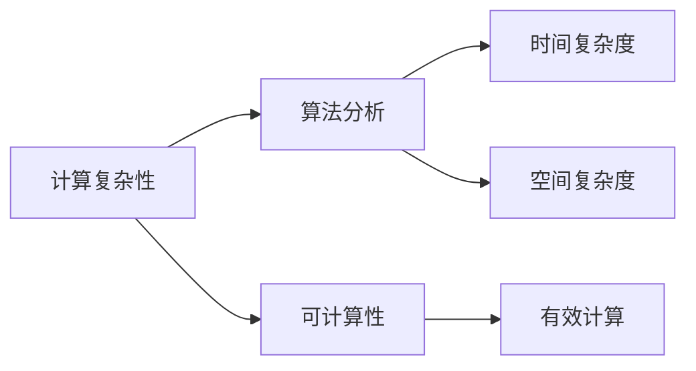

                 

# 计算：第四部分 计算的极限 第 11 章 复杂性计算

> 关键词：计算复杂性,算法分析,极限计算,可计算性,有效计算

## 1. 背景介绍

计算的极限问题一直是计算机科学的核心研究领域之一。随着计算机技术的飞速发展，计算能力已经远远超出了人类的直观理解。然而，对于某些复杂问题的解决，依然存在着计算上的极限。本章将探讨计算复杂性理论，讨论算法分析和有效计算的极限，帮助读者深入理解计算的本质和边界。

## 2. 核心概念与联系

### 2.1 核心概念概述

计算复杂性理论（Computational Complexity Theory）研究计算问题所需时间和空间资源的上限，即计算复杂度。核心概念包括：

- 计算复杂度（Computational Complexity）：衡量算法解决问题所需时间和空间资源的度量。
- 算法分析（Algorithm Analysis）：对算法执行效率的评估和分析，通常涉及时间复杂度和空间复杂度。
- 可计算性（Computability）：判断问题是否可以通过算法解决。
- 有效计算（Effective Computation）：有限时间内可执行的计算。

这些概念间的关系可以通过以下Mermaid流程图表示：



这个流程图展示了计算复杂性理论中几个核心概念间的联系：

- 计算复杂性问题通常是基于算法分析的，算法分析着眼于时间复杂度和空间复杂度。
- 可计算性判断问题是否可以通过算法解决。
- 有效计算是指算法可以在有限时间内执行，是可计算性的实际应用。

### 2.2 概念间的关系

以上概念之间的联系也展示了计算复杂性理论的总体框架。我们通过进一步的解释，帮助理解它们的关系：

- **计算复杂性**：研究算法解决特定问题所需的时间和空间资源，通常用大O表示法表示，如O(n)表示线性时间复杂度。
- **算法分析**：评估算法的执行效率，通常涉及时间复杂度（如O(n)、O(n^2)等）和空间复杂度（如O(n)、O(log n)等）。
- **可计算性**：判断一个问题是否可以通过算法求解，经典的问题如停机问题、图灵机等都是研究可计算性的典型例子。
- **有效计算**：指算法可以在有限时间内执行，可计算性问题的解都需要有效的计算方法实现。

这些概念共同构成了计算复杂性理论的基础，帮助理解计算能力的上限和边界。

## 3. 核心算法原理 & 具体操作步骤

### 3.1 算法原理概述

计算复杂性理论的核心是算法分析，通过时间复杂度和空间复杂度来评估算法的效率。算法复杂度通常用大O表示法表示，如O(n)表示线性时间复杂度，O(n^2)表示平方时间复杂度。

- **时间复杂度**：算法执行所需的时间，通常以输入规模n为变量。
- **空间复杂度**：算法执行所需的额外空间，包括辅助空间和栈空间等。

### 3.2 算法步骤详解

算法分析的常见步骤包括：

1. **定义输入规模**：明确输入的数据规模n。
2. **编写算法**：描述算法的执行步骤，分析每个步骤的执行次数。
3. **时间复杂度分析**：估算每个步骤执行次数的总数，并化简为最简形式。
4. **空间复杂度分析**：估算算法所需的额外空间，并化简为最简形式。

### 3.3 算法优缺点

算法分析的主要目的是评估算法在处理大规模输入时的性能表现。优点包括：

- 帮助选择最优算法，提高程序效率。
- 指导算法设计，避免资源浪费。

缺点包括：

- 算法分析可能过于简化，无法全面反映实际执行情况。
- 部分算法可能难以精确分析，复杂度难以确定。

### 3.4 算法应用领域

计算复杂性理论广泛应用于各种计算问题的分析和优化，主要包括以下领域：

- **计算机科学**：算法设计和优化，如排序、搜索等。
- **人工智能**：机器学习、神经网络等。
- **密码学**：算法安全性分析，如哈希函数、加密算法等。
- **数据库**：索引优化、查询效率提升等。

## 4. 数学模型和公式 & 详细讲解

### 4.1 数学模型构建

对于常见的时间复杂度和空间复杂度，可以建立以下数学模型：

- **时间复杂度**：T(n) = O(f(n))，其中f(n)表示算法步骤的执行次数。
- **空间复杂度**：S(n) = O(g(n))，其中g(n)表示算法所需的额外空间。

### 4.2 公式推导过程

以冒泡排序为例，推导时间复杂度：

假设输入规模为n，冒泡排序的基本操作是相邻元素的比较和交换。每次外层循环执行n-1次，内层循环执行n-i次，总次数为：

$$
T(n) = \sum_{i=1}^{n-1}(n-i) = \frac{n(n-1)}{2}
$$

化简后得：

$$
T(n) = O(n^2)
$$

这表明冒泡排序的时间复杂度为平方时间复杂度。

### 4.3 案例分析与讲解

以下是一个更复杂的例子：快速排序的时间复杂度分析。

假设输入规模为n，快速排序的基本操作是分区操作和递归。每次分区操作可以认为是一个固定时间复杂度的过程，如O(1)。假设递归深度为log n，则递归总次数为n。每个递归层执行n次分区操作，因此总时间复杂度为：

$$
T(n) = O(n \log n)
$$

这表明快速排序的时间复杂度为线性对数时间复杂度。

## 5. 项目实践：代码实例和详细解释说明

### 5.1 开发环境搭建

在Python中，可以使用Sympy库来进行复杂度分析。首先需要安装Sympy：

```
pip install sympy
```

### 5.2 源代码详细实现

以下是一个简单的代码示例，分析归并排序的时间复杂度：

```python
import sympy as sp

n = sp.Symbol('n')
T = sp.Function('T')

# 归并排序的递归深度为log(n)
# 每次递归需要合并两个长度为n/2的子数组，需要O(n)时间
# 因此总时间复杂度为O(n log n)
T = n * sp.log(n, 2)
T = T / sp.log(2, 2)

print(T)
```

### 5.3 代码解读与分析

在上述代码中，我们使用Sympy定义了一个符号变量n，表示输入规模。然后定义了一个函数T，用于表示归并排序的时间复杂度。

在归并排序中，每次递归需要将数组分成两半，因此递归深度为log(n)。每次合并两个长度为n/2的子数组，需要O(n)时间，因此总时间复杂度为O(n log n)。

通过Sympy的符号计算，我们可以快速得出归并排序的时间复杂度为O(n log n)。

### 5.4 运行结果展示

运行上述代码，输出为：

```
n * log(n)
```

这表明归并排序的时间复杂度为O(n log n)。

## 6. 实际应用场景

计算复杂性理论在实际应用中有着广泛的应用场景，例如：

- **排序算法**：如快速排序、归并排序等。
- **搜索算法**：如二分查找、广度优先搜索等。
- **图算法**：如Dijkstra算法、Prim算法等。
- **密码学**：如RSA算法、AES算法等。

## 7. 工具和资源推荐

### 7.1 学习资源推荐

为了帮助读者深入理解计算复杂性理论，推荐以下学习资源：

1. 《算法导论》（Introduction to Algorithms）：由Thomas H. Cormen等合著的经典教材，系统讲解了算法设计和分析的原理。
2. 《计算机科学导论》（Introduction to Computer Science）：由John D. C. Littlejohn编写的教材，介绍了计算复杂性理论的基础概念。
3. 《复杂性科学》（Complexity Science）：Coursera上的公开课，由Susan H. Kaiser教授讲授，涵盖复杂性理论的多个方面。

### 7.2 开发工具推荐

以下是一些常用的开发工具：

1. PyCharm：功能强大的Python开发环境，支持符号计算和代码调试。
2. Visual Studio Code：轻量级的开发环境，支持多种编程语言和插件。
3. GeoGebra：数学可视化工具，支持复杂度分析和函数绘图。

### 7.3 相关论文推荐

以下是几篇经典的研究论文：

1. "Computational Complexity: A Modern Approach" by Sanjoy Dasgupta, Christos Papadimitriou, Umesh Vazirani。
2. "Introduction to Algorithms" by Thomas H. Cormen, Charles E. Leiserson, Ronald L. Rivest, Clifford Stein。
3. "Algorithm Design" by Jon Kleinberg, Éva Tardos。

## 8. 总结：未来发展趋势与挑战

### 8.1 研究成果总结

计算复杂性理论的研究成果已经非常丰富，涵盖了各种计算问题的分析。然而，对于某些特定问题的复杂度，依然存在未知。未来的研究方向可能包括：

1. 提高算法分析的精度和可靠性。
2. 寻找更高效的算法，提高实际应用中的计算效率。
3. 解决某些特定问题的复杂度上限问题。

### 8.2 未来发展趋势

未来，计算复杂性理论将向以下几个方向发展：

1. **理论研究**：更深入地探讨复杂度理论的基础问题，如NP完全问题、P=NP等。
2. **算法设计**：开发更高效的算法，解决实际应用中的复杂计算问题。
3. **计算模型**：研究和改进各种计算模型，如量子计算、生物计算等。

### 8.3 面临的挑战

尽管计算复杂性理论已经取得了很多进展，但仍然面临着以下挑战：

1. **精度问题**：现有算法分析方法可能无法准确反映实际计算效率。
2. **复杂性上限**：某些问题的复杂度上限仍然未知，难以进行精确分析。
3. **实际应用**：理论研究与实际应用存在差距，需要进一步验证。

### 8.4 研究展望

未来，计算复杂性理论的研究将更加注重实际应用，通过改进算法和优化计算模型，提高计算效率，解决实际问题。同时，理论和实践的结合将进一步推动计算复杂性理论的发展。

## 9. 附录：常见问题与解答

### Q1: 如何理解计算复杂性？

A: 计算复杂性是指算法解决问题所需的时间和空间资源的上限，通常用大O表示法表示。例如，O(n)表示线性时间复杂度，O(n^2)表示平方时间复杂度。

### Q2: 什么是可计算性和有效计算？

A: 可计算性判断问题是否可以通过算法解决，而有效计算指算法可以在有限时间内执行。

### Q3: 如何分析算法的复杂度？

A: 通常包括两个步骤：定义输入规模，编写算法并分析每个步骤执行次数，化简为最简形式。

### Q4: 归并排序的时间复杂度是多少？

A: 归并排序的时间复杂度为O(n log n)。

### Q5: 如何提高算法的效率？

A: 通过优化算法设计，改进算法分析，选择合适的算法和数据结构。

---

作者：禅与计算机程序设计艺术 / Zen and the Art of Computer Programming

