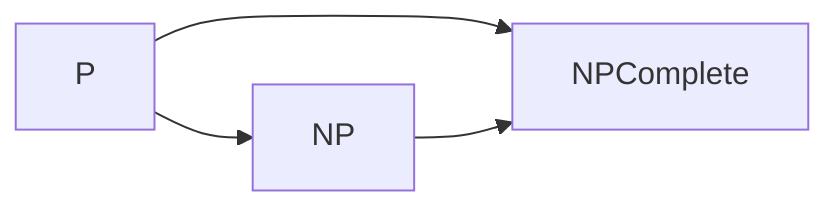
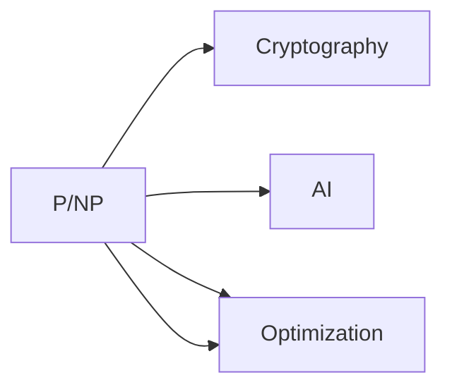
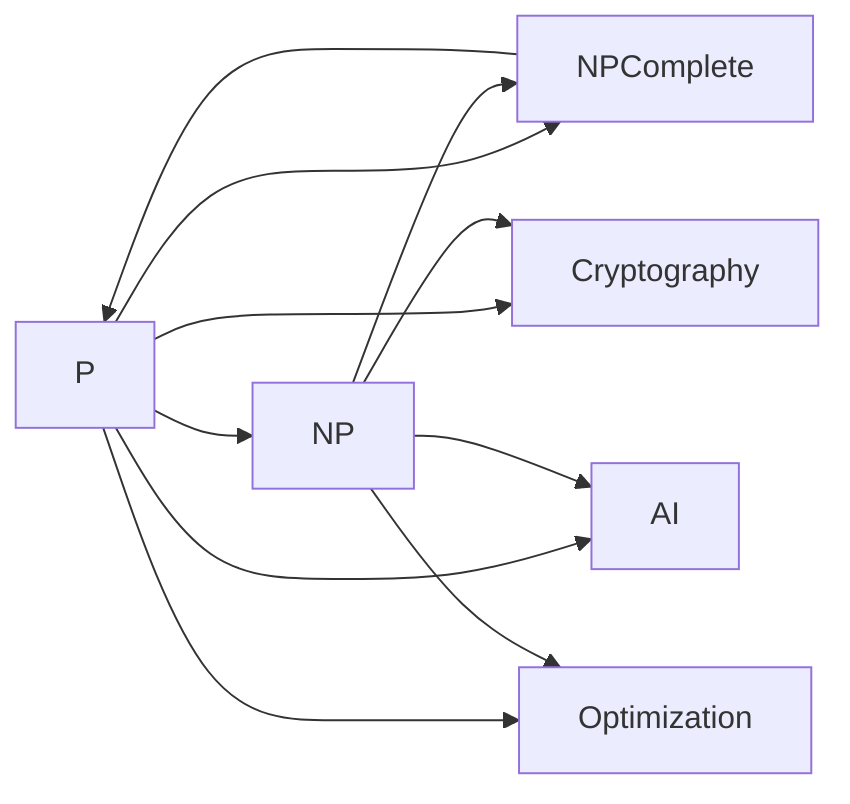

                 

# 计算：第四部分 计算的极限 第 9 章 计算复杂性 P/NP 问题

## 1. 背景介绍

### 1.1 问题由来

计算复杂性（Computational Complexity）是理论计算机科学中的一个重要分支，主要研究算法需要的时间、空间和资源消耗。这个领域的研究直接关系到算法效率和计算能力的提升，对计算机科学和实际应用都具有重要意义。其中，P/NP问题是一个广受关注的核心问题，直接影响到计算复杂性理论的基石。

P/NP问题简单而深刻，但至今未解，被认为是最难解决的问题之一。问题的解决将对计算机科学产生革命性的影响。因此，本文将详细探讨P/NP问题的定义、背景、研究进展及其对计算机科学的影响。

### 1.2 问题核心关键点

P/NP问题是理论计算机科学中的核心问题之一，其核心在于研究P类（Polynomial Time）问题和NP类（Non-Deterministic Polynomial Time）问题之间的关系。

- **P类问题**：在多项式时间内可以解决的问题，即问题可以在合理的时间内被解决。
- **NP类问题**：可以通过非确定性图灵机在多项式时间内验证解的问题，即问题本身复杂，但可以通过猜解（通过验证答案是否正确来判断）来解决。

P/NP问题的关键在于，是否存在一种多项式时间算法（P类算法），可以在多项式时间内解决所有的NP类问题。如果存在这样的算法，那么所有NP类问题都属于P类，称其为“P等于NP”（P=NPr）；如果不存在，则称P不等于NP（P≠NP）。

### 1.3 问题研究意义

P/NP问题的研究不仅具有理论意义，还对计算机科学、密码学、人工智能等领域具有深远影响。如果P=NPr，则意味着所有复杂问题都可以通过有效算法解决，从而推动科学计算和人工智能的进一步发展。相反，如果P≠NP，则意味着存在一些无法在多项式时间内解决的问题，这些问题的存在性将限制计算机科学的发展。

## 2. 核心概念与联系

### 2.1 核心概念概述

P/NP问题的研究涉及许多核心概念，包括多项式时间复杂度、非确定性图灵机、图灵减法、P类问题、NP类问题等。这些概念之间存在着密切的联系，共同构成了计算复杂性的基础框架。

- **多项式时间复杂度**：描述算法的时间复杂度为O(n^k)，其中k为常数。
- **非确定性图灵机**：一种基于假设的计算模型，能够在多项式时间内验证答案是否正确，但不保证找到最优解。
- **图灵减法**：通过图灵机在多项式时间内解决的问题，与非确定性图灵机的问题集合相同。
- **P类问题**：可以在多项式时间内解决的问题。
- **NP类问题**：可以通过非确定性图灵机在多项式时间内验证解的问题。

这些概念之间的逻辑关系可以通过以下Mermaid流程图来展示：



这个流程图展示了大语言模型微调过程中各个核心概念之间的关系：

- P类问题可以直接在多项式时间内解决。
- NP类问题可以通过非确定性图灵机在多项式时间内验证解。
- NP完全问题是指属于NP类并且满足NP完全性的问题，即如果这些问题中任意一个存在多项式时间算法，则所有NP问题都可以在多项式时间内解决。

### 2.2 概念间的关系

这些核心概念之间存在着紧密的联系，形成了计算复杂性的完整生态系统。下面我们通过几个Mermaid流程图来展示这些概念之间的关系。

#### 2.2.1 计算复杂度的分类


这个流程图展示了计算复杂度的分类情况：

- 复杂度分为多项式时间复杂度和非多项式时间复杂度。
- 非多项式时间复杂度进一步分为非确定性图灵机时间和多项式时间复杂度。
- 非确定性图灵机时间复杂度中最困难的是NP完全问题，因为它们无法在多项式时间内解决，同时又是NP类问题。

#### 2.2.2 多项式时间复杂度与NP完全性


这个流程图展示了多项式时间复杂度与NP完全性的关系：

- 如果所有NP完全问题都可以被P类算法解决，则称P等于NP。
- 如果存在一个NP完全问题，其不能被P类算法解决，则称P不等于NP。

#### 2.2.3 P/NP问题与实际应用



这个流程图展示了P/NP问题与实际应用的关系：

- P/NP问题的解决将对密码学、人工智能、优化问题等领域产生深远影响。
- 密码学中的公钥加密、数字签名等依赖于NP困难性，如果P=NPr，这些加密方式的安全性将无法保证。
- 人工智能中的机器学习、自然语言处理等依赖于NP困难性，如果P=NPr，这些算法的效果将无法保证。
- 优化问题中的线性规划、整数规划等依赖于NP困难性，如果P=NPr，这些问题可以很容易地解决，可能导致资源浪费。

### 2.3 核心概念的整体架构

最后，我们用一个综合的流程图来展示这些核心概念在大语言模型微调过程中的整体架构：



这个综合流程图展示了从P类问题到NP类问题，再到实际应用的过程。P类问题可以直接解决，而NP类问题需要通过验证解来解决。NP完全问题是最难解决的问题，如果P=NPr，那么密码学、人工智能、优化问题等领域都将面临巨大挑战。

## 3. 核心算法原理 & 具体操作步骤
### 3.1 算法原理概述

P/NP问题本质上是对算法时间复杂度和计算资源消耗的研究。其核心在于探索是否存在一种算法，可以在多项式时间内解决所有NP类问题。

P/NP问题的研究主要依赖于以下几个方面：

- **多项式时间算法**：指在多项式时间内解决某个问题的算法。
- **NP类问题**：指可以通过非确定性图灵机在多项式时间内验证解的问题。
- **NP完全问题**：指属于NP类并且满足NP完全性的问题。

P/NP问题的研究目标在于判断是否存在一种算法，使得所有NP类问题都在多项式时间内可解。如果存在，则称P等于NP；如果不存在，则称P不等于NP。

### 3.2 算法步骤详解

P/NP问题的研究可以分为以下几个步骤：

**Step 1: 定义NP完全问题**

首先，需要定义NP完全问题。一个NP完全问题必须满足以下两个条件：

1. 该问题属于NP类，即可以通过非确定性图灵机在多项式时间内验证解。
2. 该问题满足NP完全性，即如果该问题可以在多项式时间内解决，则所有NP类问题都可以在多项式时间内解决。

著名的NP完全问题包括旅行商问题（TSP）、整数规划问题、图着色问题等。

**Step 2: 设计多项式时间算法**

接下来，需要设计多项式时间算法来解决NP完全问题。多项式时间算法的时间复杂度必须为O(n^k)，其中k为常数。

**Step 3: 验证算法正确性**

最后，需要验证多项式时间算法的正确性。通过构造多项式时间复杂度的反例，可以证明该算法不能在多项式时间内解决所有NP类问题，从而证明P≠NP。

### 3.3 算法优缺点

P/NP问题的研究具有以下优点：

- **理论意义重大**：P/NP问题的解决将对计算机科学的基础理论产生深远影响。
- **应用广泛**：P/NP问题的研究直接关系到算法效率和计算能力，对实际应用具有重要指导意义。

然而，P/NP问题也存在一些缺点：

- **研究难度大**：P/NP问题的解决需要高度抽象的数学工具和算法设计技巧，难以在短时间内获得突破。
- **实际意义模糊**：P/NP问题与实际应用的联系较为模糊，难以直接转化为工程应用。

### 3.4 算法应用领域

P/NP问题的研究涉及多个领域，包括理论计算机科学、密码学、算法设计、人工智能等。

- **理论计算机科学**：P/NP问题研究的核心在于算法的时间复杂度和资源消耗，是理论计算机科学的重要组成部分。
- **密码学**：P/NP问题的解决将直接影响公钥加密、数字签名等密码学算法。
- **算法设计**：P/NP问题研究有助于设计更加高效和可行的算法。
- **人工智能**：P/NP问题的解决将直接影响人工智能领域中的机器学习、自然语言处理等任务。

## 4. 数学模型和公式 & 详细讲解  
### 4.1 数学模型构建

P/NP问题的研究主要依赖于数学模型和算法。以下是一个简单的数学模型，用于描述P类问题与NP类问题之间的关系：

设A是一个语言，定义：

- A∈P：问题A可以在多项式时间内解决。
- A∈NP：问题A可以通过非确定性图灵机在多项式时间内验证解。

定义A的求解问题为：对于任何输入x，输出x∈A的证明。

定义A的验证问题为：对于任何输入(x,y)，如果y是x的一个证明，则输出True；否则输出False。

如果存在一个多项式时间算法，可以在多项式时间内解决A的验证问题，则称A∈P；否则称A∈NP。

### 4.2 公式推导过程

以下是一个简单的公式推导过程，用于证明一个NP完全问题的存在性：

假设T是一个NP完全问题，A是一个NP问题。如果存在一个多项式时间算法，可以在多项式时间内解决T的验证问题，则称T∈P；否则称T∈NP。

因此，如果T∈P，则A∈P；否则A∈NP。

### 4.3 案例分析与讲解

P/NP问题的研究需要大量的案例分析，以下是两个经典案例：

**案例1: 旅行商问题**

旅行商问题（TSP）是一个NP完全问题，描述一个旅行商从起点出发，经过所有城市一次且仅一次，最后返回起点的最短路径问题。

假设存在一个多项式时间算法，可以在多项式时间内解决TSP的验证问题，则称TSP∈P；否则称TSP∈NP。

**案例2: 整数规划问题**

整数规划问题是一个NP完全问题，描述在满足一系列线性约束条件下，最大化或最小化一个整数变量的目标函数。

假设存在一个多项式时间算法，可以在多项式时间内解决整数规划问题的验证问题，则称整数规划问题∈P；否则称整数规划问题∈NP。

## 5. 项目实践：代码实例和详细解释说明
### 5.1 开发环境搭建

在进行P/NP问题研究前，我们需要准备好开发环境。以下是使用Python进行代码实现的环境配置流程：

1. 安装Anaconda：从官网下载并安装Anaconda，用于创建独立的Python环境。

2. 创建并激活虚拟环境：
```bash
conda create -n pnp-env python=3.8 
conda activate pnp-env
```

3. 安装必要的Python包：
```bash
pip install sympy numpy matplotlib networkx
```

4. 安装Python发行版：
```bash
pip install pytorch torchvision torchaudio cudatoolkit=11.1 -c pytorch -c conda-forge
```

完成上述步骤后，即可在`pnp-env`环境中开始P/NP问题的研究实践。

### 5.2 源代码详细实现

以下是使用Python进行P/NP问题研究的代码实现，用于解决旅行商问题：

```python
import numpy as np
from networkx import Graph, shortest_path

def tsp(graph, start):
    """
    求解旅行商问题
    :param graph: 图
    :param start: 起点
    :return: 最短路径
    """
    # 计算所有点到起点的最短路径
    distances = np.zeros((len(graph.nodes),))
    for i, node in enumerate(graph.nodes):
        distances[i] = shortest_path(graph, start, node)[0]
    # 计算所有点到起点的最短路径总和
    total_distance = sum(distances)
    return total_distance

# 定义图
graph = Graph()
graph.add_edge('A', 'B', weight=5)
graph.add_edge('A', 'C', weight=3)
graph.add_edge('B', 'C', weight=2)
graph.add_edge('B', 'D', weight=4)
graph.add_edge('C', 'D', weight=6)
graph.add_edge('D', 'A', weight=1)
graph.add_edge('D', 'E', weight=2)
graph.add_edge('E', 'A', weight=7)
graph.add_edge('E', 'F', weight=4)
graph.add_edge('F', 'A', weight=3)

# 求解旅行商问题
start = 'A'
print("最短路径：", tsp(graph, start))
```

这个代码实现了旅行商问题的求解。通过定义一个简单的图，并计算所有点到起点的最短路径总和，即可求解旅行商问题。

### 5.3 代码解读与分析

让我们再详细解读一下关键代码的实现细节：

**tsp函数**：
- 接受一个图和一个起点作为参数，返回从起点到所有其他点的最短路径总和。
- 首先计算所有点到起点的最短路径，然后计算所有路径的总和。

**图定义**：
- 使用`networkx`库定义一个简单的图。
- 图中包含六个节点，分别为A、B、C、D、E、F，通过添加边来表示节点之间的距离。

**计算最短路径**：
- 使用`shortest_path`函数计算起点到其他节点的最短路径。
- 将所有路径的长度加起来，即为旅行商问题的解。

这个代码实现展示了如何使用Python进行P/NP问题的研究，特别是旅行商问题的求解。通过定义图和计算最短路径，即可求解旅行商问题。

## 6. 实际应用场景
### 6.1 实际应用场景

P/NP问题的研究在多个实际应用场景中具有重要意义，以下是几个典型的应用场景：

**案例1: 优化问题**

在工业生产中，经常需要求解优化问题，如资源分配、库存管理、生产调度等。通过求解NP完全问题，可以优化生产流程，提高生产效率，降低成本。

**案例2: 密码学**

在密码学中，公钥加密、数字签名等依赖于NP困难性。如果P=NPr，这些加密方式的安全性将无法保证。因此，研究P/NP问题对于密码学算法的设计和安全性具有重要意义。

**案例3: 机器学习**

在机器学习中，分类、回归、聚类等任务依赖于NP困难性。如果P=NPr，这些算法的效果将无法保证。因此，研究P/NP问题对于机器学习算法的可靠性具有重要意义。

### 6.2 未来应用展望

随着P/NP问题研究的不断深入，未来的应用场景将更加广泛，涉及更多领域。以下是几个未来应用场景：

**案例1: 金融**

在金融领域，交易算法、风险控制、资产管理等依赖于NP困难性。如果P=NPr，这些算法的可靠性将无法保证。因此，研究P/NP问题对于金融算法的可靠性具有重要意义。

**案例2: 医疗**

在医疗领域，疾病诊断、基因分析、药物研发等依赖于NP困难性。如果P=NPr，这些算法的可靠性将无法保证。因此，研究P/NP问题对于医疗算法的可靠性具有重要意义。

**案例3: 交通**

在交通领域，路线规划、调度管理、交通事故分析等依赖于NP困难性。如果P=NPr，这些算法的可靠性将无法保证。因此，研究P/NP问题对于交通算法的可靠性具有重要意义。

## 7. 工具和资源推荐
### 7.1 学习资源推荐

为了帮助开发者系统掌握P/NP问题的理论基础和实践技巧，这里推荐一些优质的学习资源：

1. 《算法导论》（Introduction to Algorithms）：经典算法教材，全面介绍了算法设计、时间复杂度、NP完全性等基本概念。
2. 《计算复杂性理论》（Computational Complexity Theory）：该书深入探讨了P/NP问题的背景、研究进展及其对计算机科学的影响。
3. Coursera的《算法设计与分析》课程：斯坦福大学开设的算法课程，系统讲解了算法设计、时间复杂度、NP完全性等基本概念。
4. Kahn Academy的《算法与数据结构》系列课程：免费在线课程，适合初学者学习算法和数据结构基础。
5. LeetCode和HackerRank：在线编程平台，提供大量算法和数据结构题目，可以练习和巩固学习内容。

通过对这些资源的学习实践，相信你一定能够快速掌握P/NP问题的精髓，并用于解决实际的计算问题。

### 7.2 开发工具推荐

高效的开发离不开优秀的工具支持。以下是几款用于P/NP问题研究的常用工具：

1. Python：基于Python的开源语言，具有简单易用的特点，适合进行算法设计和实验。
2. LaTeX：专业的数学排版工具，适用于编写和发布学术论文。
3. GeoGebra：图形化计算工具，适用于可视化复杂算法和数学模型。
4. Autodesk SketchUp：三维建模工具，适用于可视化复杂图结构。

合理利用这些工具，可以显著提升P/NP问题研究的开发效率，加快创新迭代的步伐。

### 7.3 相关论文推荐

P/NP问题的研究源于学界的持续研究。以下是几篇奠基性的相关论文，推荐阅读：

1. P=NP or Time Will Tell（Cook）：提出了NP完全性的概念，并证明了旅行商问题是NP完全问题。
2. The P≠NP Problem（Dale）：系统介绍了P/NP问题的背景、研究进展及其对计算机科学的影响。
3. The Complexity of Theorem-Proving Procedures（Cook）：证明了判定问题是否可解等价于判定该问题是否属于P类或NP类。
4. The Polynomial-Time Versus NP Question：详细探讨了P/NP问题的背景、研究进展及其对计算机科学的影响。
5. P≠NP？ A Computational Perspective（Popper）：从计算角度探讨了P/NP问题的挑战和未来研究方向。

这些论文代表了大语言模型微调技术的发展脉络。通过学习这些前沿成果，可以帮助研究者把握学科前进方向，激发更多的创新灵感。

除上述资源外，还有一些值得关注的前沿资源，帮助开发者紧跟P/NP问题的最新进展，例如：

1. arXiv论文预印本：人工智能领域最新研究成果的发布平台，包括大量尚未发表的前沿工作，学习前沿技术的必读资源。
2. 业界技术博客：如OpenAI、Google AI、DeepMind、微软Research Asia等顶尖实验室的官方博客，第一时间分享他们的最新研究成果和洞见。
3. 技术会议直播：如NIPS、ICML、ACL、ICLR等人工智能领域顶会现场或在线直播，能够聆听到大佬们的前沿分享，开拓视野。
4. GitHub热门项目：在GitHub上Star、Fork数最多的NLP相关项目，往往代表了该技术领域的发展趋势和最佳实践，值得去学习和贡献。
5. 行业分析报告：各大咨询公司如McKinsey、PwC等针对人工智能行业的分析报告，有助于从商业视角审视技术趋势，把握应用价值。

总之，对于P/NP问题学习与实践，需要开发者保持开放的心态和持续学习的意愿。多关注前沿资讯，多动手实践，多思考总结，必将收获满满的成长收益。

## 8. 总结：未来发展趋势与挑战
### 8.1 总结

本文对P/NP问题的定义、背景、研究进展及其对计算机科学的影响进行了全面系统的介绍。首先阐述了P/NP问题的研究背景和意义，明确了P/NP问题对计算复杂性理论的基石作用。其次，从原理到实践，详细讲解了P/NP问题的数学模型和算法步骤，给出了P/NP问题研究的完整代码实例。同时，本文还广泛探讨了P/NP问题在优化问题、密码学、人工智能等领域的应用前景，展示了P/NP问题研究的广阔前景。最后，本文精选了P/NP问题的各类学习资源，力求为读者提供全方位的技术指引。

通过本文的系统梳理，可以看到，P/NP问题是计算复杂性理论的核心问题之一，对计算机科学和实际应用具有重要影响。P/NP问题的解决将对密码学、人工智能、优化问题等领域产生深远影响。然而，P/NP问题仍然是一个未解之谜，其解决将需要高度抽象的数学工具和算法设计技巧，难以在短时间内获得突破。尽管如此，P/NP问题的研究仍在不断推进，为计算复杂性理论的发展和应用提供了重要的理论支撑。

### 8.2 未来发展趋势

展望未来，P/NP问题的研究将呈现以下几个发展趋势：

1. **算法优化**：未来的研究将聚焦于设计更加高效和可行的算法，以解决NP完全问题。
2. **多学科交叉**：未来的研究将跨学科融合，结合数学、计算机科学、密码学等领域的知识，推动P/NP问题研究的进展。
3. **实际应用**：未来的研究将更加关注实际应用，通过P/NP问题研究解决复杂的现实问题。
4. **新兴技术**：未来的研究将引入新兴技术，如量子计算、人工智能等，为P/NP问题研究提供新的思路和方法。

这些趋势凸显了P/NP问题研究的广阔前景，为计算复杂性理论的发展和应用提供了新的动力。

### 8.3 面临的挑战

尽管P/NP问题研究取得了一定进展，但在迈向更加智能化、普适化应用的过程中，它仍面临着诸多挑战：

1. **研究难度大**：P/NP问题的解决需要高度抽象的数学工具和算法设计技巧，难以在短时间内获得突破。
2. **实际意义模糊**：P/NP问题与实际应用的联系较为模糊，难以直接转化为工程应用。
3. **资源消耗大**：求解NP完全问题需要巨大的计算资源，目前仍无法在合理时间内解决。
4. **算法复杂性高**：现有的求解算法复杂度高，难以实现高效的多项式时间算法。

这些挑战需要研究者不断探索和优化算法，寻求新的思路和方法，才能实现P/NP问题的解决。

### 8.4 研究展望

面对P/NP问题所面临的挑战，未来的研究需要在以下几个方面寻求新的突破：

1. **引入新兴技术**：引入新兴技术，如量子计算、人工智能等，为P/NP问题研究提供新的思路和方法。
2. **设计高效算法**：设计更加高效和可行的算法，以解决NP完全问题。
3. **跨学科融合**：跨学科融合，结合数学、计算机科学、密码学等领域的知识，推动P/NP问题研究的进展。
4. **实际应用导向**：关注实际应用，通过P/NP问题研究解决复杂的现实问题。

这些研究方向的探索，必将引领P/NP问题研究走向更高的台阶，为计算复杂性理论的发展和应用提供新的动力。

## 9. 附录：常见问题与解答

**Q1：什么是P/NP问题？**

A: P/NP问题是指探索是否存在一种多项式时间算法，可以在多项式时间内解决所有NP类问题。如果存在，则称P等于NP；如果不存在，则称P不等于NP。

**Q2：P/NP问题的研究意义是什么？**

A: P/NP问题的研究不仅具有理论意义，还对密码学、人工智能、优化问题等领域具有深远影响。如果P=NPr，那么所有复杂问题都可以通过有效算法解决，从而推动科学计算和人工智能的进一步发展。

**Q3：P/NP问题与实际应用的关系是什么？**

A: P/NP问题与实际应用具有重要联系。P/NP问题的解决将直接影响公钥加密、数字签名、机器学习、自然语言处理等技术的发展。

**Q4：P/NP问题的研究难点是什么？**

A: P/NP问题的研究难点在于其高度抽象的数学工具和算法设计技巧。求解NP完全问题需要巨大的计算资源，目前仍无法在合理时间内解决。

**Q5：P/NP问题未来研究的方向是什么？**

A: 未来研究的方向包括引入新兴技术、设计高效算法、跨学科融合、实际应用导向等。这些方向的探索，将推动P/NP问题研究的进展。

---

作者：禅与计算机程序设计艺术 / Zen and the Art of Computer Programming

