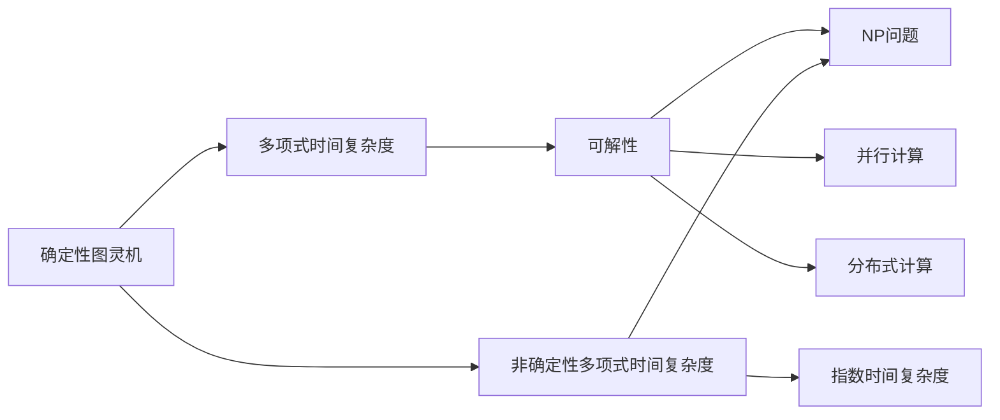

                 

# 计算：第四部分 计算的极限 第 9 章 计算复杂性 并行计算

> 关键词：计算复杂性, 并行计算, 分布式计算, 负载均衡, 多核处理器, 云计算

## 1. 背景介绍

计算复杂性是计算机科学中最为基础和关键的问题之一，它关系到算法的效率、计算机资源的使用以及计算任务的可解性。在过去几十年中，计算机技术的发展已经大大降低了计算复杂度，但从根本上讲，计算复杂性仍然是一个难以彻底解决的问题。

### 1.1 问题由来

计算复杂性问题源于计算机科学家对于计算问题的可解性以及所需计算资源的量度。在早期的计算机科学中，计算复杂性主要关注的是确定性图灵机(Turing Machines)对于给定问题的运行时间。随着计算机技术的不断发展，计算复杂性的研究逐渐扩展到更加广泛的计算模型，包括随机算法、量子计算和并行计算。

尽管计算复杂性的概念已经存在了数十年，但随着计算机性能的不断提升和计算任务的日益复杂，这一问题依然显得尤为重要。了解计算复杂性不仅有助于提高计算效率，还能帮助开发人员在开发复杂系统时更好地评估和优化资源分配。

### 1.2 问题核心关键点

计算复杂性涉及多个核心概念，这些概念之间存在着密切的联系。以下是几个关键点：

1. **时间复杂度**：算法所需的计算时间与问题规模之间的关系，是计算复杂性分析的主要内容。
2. **空间复杂度**：算法所需的存储空间与问题规模之间的关系。
3. **可解性**：某些问题是否可以在有限时间内求解。
4. **NP问题**：一类特殊的计算问题，即非确定性多项式问题，它们在多项式时间内不可解，但可能可以用指数时间内可解的算法求解。
5. **指数时间复杂度**：某些算法的时间复杂度随问题规模呈指数级增长，这些算法通常无法在合理时间内处理大规模问题。
6. **并行计算**：利用多个处理器或计算机同时执行计算任务，以提高计算效率。

这些关键点相互交织，共同构成了计算复杂性的研究框架，为理解和优化计算效率提供了理论基础。

## 2. 核心概念与联系

### 2.1 核心概念概述

为了更好地理解计算复杂性和并行计算，我们需要先介绍几个关键概念及其相互关系：

- **确定性图灵机**：一种数学模型，用于描述计算过程，是计算复杂性的基础。
- **多项式时间复杂度**：一种时间复杂度，表示算法所需时间与问题规模成多项式关系。
- **非确定性多项式时间复杂度**：一种时间复杂度，表示算法所需时间与问题规模成多项式关系，但无法在多项式时间内确定结果。
- **指数时间复杂度**：一种时间复杂度，表示算法所需时间与问题规模呈指数级增长。
- **并行计算**：使用多个处理器或计算机同时执行计算任务，以提高计算效率。
- **分布式计算**：将计算任务分散到多个计算机上进行处理，以提高计算效率。

这些概念之间的联系可以通过以下Mermaid流程图来展示：



这个流程图展示了计算复杂性概念之间的相互关系：

1. 确定性图灵机定义了计算过程的基础。
2. 多项式时间复杂度表示可以高效解决的计算问题。
3. 非确定性多项式时间复杂度表示一些问题可以高效解决，但无法确定。
4. 指数时间复杂度表示某些问题非常难以解决。
5. 可解性是计算问题能否在有限时间内求解的判断依据。
6. NP问题是一类难以在多项式时间内解决的问题。
7. 并行计算和分布式计算是提高计算效率的两种主要方法。

### 2.2 概念间的关系

这些概念之间存在着密切的联系，形成了一个完整的计算复杂性框架。

- **多项式时间复杂度**和**指数时间复杂度**是计算复杂性的两个极端，它们分别表示算法所需时间与问题规模的关系。
- **NP问题**和**可解性**直接相关，它们代表了计算问题的难易程度。
- **并行计算**和**分布式计算**是两种常用的计算效率提升方法，它们通过多处理器或多计算机同时执行计算任务来提高计算效率。

这些概念共同构成了计算复杂性的研究框架，为理解和优化计算效率提供了理论基础。

## 3. 核心算法原理 & 具体操作步骤

### 3.1 算法原理概述

计算复杂性理论中的许多算法原理都是基于确定性图灵机的。确定性图灵机是一种简单的计算模型，它可以模拟任何计算机程序的行为，因此可以用来分析各种算法的效率。

在确定性图灵机模型中，一个图灵机有一个无限长的纸带，纸带上每一位都可以是0或1。图灵机的状态和动作可以通过一个程序来定义，这个程序被称为图灵机的状态转移表。图灵机在执行程序时，会根据当前的纸带状态和输入字符，按照状态转移表中的规则移动纸带，执行某些操作，并根据当前状态和输入字符决定下一步动作。

计算复杂性理论中最重要的算法原理之一是**时间复杂度**。时间复杂度表示算法所需时间与问题规模的关系，通常用大O表示法来表示，例如O(n)表示算法时间复杂度为线性，O(n^2)表示算法时间复杂度为平方级别。

### 3.2 算法步骤详解

计算复杂性的分析通常包括以下步骤：

1. **问题定义**：定义需要求解的问题，并确定问题规模。
2. **算法设计**：设计一种算法来求解该问题，并分析该算法的时间复杂度和空间复杂度。
3. **时间复杂度分析**：根据算法的设计，确定算法的时间复杂度，并分析其在不同规模下的表现。
4. **空间复杂度分析**：根据算法的设计，确定算法的空间复杂度，并分析其在不同规模下的表现。
5. **优化算法**：根据分析结果，优化算法的设计，以减少时间复杂度和空间复杂度。

例如，假设我们有一个问题，需要计算一个序列中所有元素的和。一种简单的算法是使用循环累加，时间复杂度为O(n)。

具体步骤如下：

1. 问题定义：计算序列[1, 2, 3, ..., n]中所有元素的和。
2. 算法设计：使用循环累加，从1开始，依次累加序列中的每个元素。
3. 时间复杂度分析：由于需要遍历整个序列，时间复杂度为O(n)。
4. 空间复杂度分析：只需要一个变量来存储累加结果，空间复杂度为O(1)。
5. 优化算法：可以通过并行计算来加速该算法，例如使用多个处理器同时计算序列的不同部分。

### 3.3 算法优缺点

计算复杂性理论中，各种算法的时间复杂度和空间复杂度有着不同的优缺点。以下是几种常见的算法及其特点：

- **线性算法**：时间复杂度为O(n)，空间复杂度为O(1)。优点是简单易实现，缺点是只能处理线性问题，无法处理复杂问题。
- **平方算法**：时间复杂度为O(n^2)，空间复杂度为O(n)。优点是能够处理一些较为复杂的问题，缺点是计算时间随问题规模呈平方级别，难以处理大规模问题。
- **指数算法**：时间复杂度为O(2^n)，空间复杂度为O(n)。优点是能够处理非常复杂的问题，缺点是计算时间随问题规模呈指数级别，无法处理大规模问题。
- **并行算法**：通过多处理器或多计算机同时执行计算任务，能够显著提高计算效率，缺点是实现复杂，需要考虑负载均衡等问题。
- **分布式算法**：将计算任务分散到多个计算机上进行处理，能够显著提高计算效率，缺点是实现复杂，需要考虑网络通信等问题。

### 3.4 算法应用领域

计算复杂性理论广泛应用于计算机科学中的各个领域，包括：

- **算法设计**：分析和设计高效的算法，优化计算资源的使用。
- **数据结构设计**：设计高效的数据结构，提高数据访问和处理的效率。
- **操作系统设计**：设计高效的操作系统，优化系统资源的利用。
- **数据库设计**：设计高效的数据库，优化数据的存储和检索。
- **网络设计**：设计高效的网络协议和算法，优化网络通信的效率。
- **分布式系统设计**：设计高效的分布式系统，优化系统资源的利用。

这些领域中的许多问题都可以通过计算复杂性理论来分析和优化，从而提高计算效率和资源利用率。

## 4. 数学模型和公式 & 详细讲解 & 举例说明

### 4.1 数学模型构建

计算复杂性理论中的数学模型通常包括以下几个要素：

1. **问题规模**：表示问题的大小或复杂度。
2. **输入数据**：表示问题的具体实例。
3. **算法**：表示解决问题的步骤。
4. **时间复杂度**：表示算法所需时间与问题规模的关系。
5. **空间复杂度**：表示算法所需存储空间与问题规模的关系。

例如，考虑一个问题：在一个长度为n的序列中查找是否存在一个长度为k的子序列，使得子序列中元素之和为0。这是一个典型的NP问题。

### 4.2 公式推导过程

假设我们有一个长度为n的序列，需要查找是否存在一个长度为k的子序列，使得子序列中元素之和为0。这个问题可以用以下公式表示：

$$
\begin{aligned}
S &= \{(x_1, x_2, \ldots, x_n) \mid \exists j \leq i < j+k, \sum_{i=j}^{j+k-1} x_i = 0 \} \\
&= \{(x_1, x_2, \ldots, x_n) \mid \exists j \leq i < j+k, \sum_{i=j}^{j+k-1} x_i = 0 \}
\end{aligned}
$$

其中，$x_i$表示序列中第i个元素，$S$表示满足条件的子序列集合。

假设我们使用暴力枚举算法来解决该问题，时间复杂度为$O(nk)$。具体步骤如下：

1. 对于每个元素$x_i$，枚举所有可能的子序列长度$k$。
2. 对于每个子序列长度$k$，枚举所有可能的子序列起始位置$i$。
3. 对于每个子序列起始位置$i$和子序列长度$k$，计算子序列中元素之和是否为0。

因此，时间复杂度为$O(nk)$，空间复杂度为$O(1)$。

### 4.3 案例分析与讲解

考虑一个更复杂的问题：在一个长度为n的序列中查找是否存在一个长度为k的子序列，使得子序列中元素之和等于一个给定的整数$T$。这个问题是一个典型的NP问题，因为无法在多项式时间内确定是否存在满足条件的子序列。

假设我们使用动态规划算法来解决该问题，时间复杂度为$O(nk)$。具体步骤如下：

1. 定义一个二维数组$dp[i][j]$，表示以第i个元素结尾，长度为j的子序列中元素之和是否等于$T$。
2. 对于每个元素$x_i$，枚举所有可能的子序列长度$k$。
3. 对于每个子序列长度$k$，枚举所有可能的子序列起始位置$i$。
4. 对于每个子序列起始位置$i$和子序列长度$k$，根据前一个子序列的状态，计算当前子序列的状态，并更新$dp[i][j]$。

因此，时间复杂度为$O(nk)$，空间复杂度为$O(nk)$。

## 5. 项目实践：代码实例和详细解释说明

### 5.1 开发环境搭建

在进行计算复杂性分析时，我们需要准备好开发环境。以下是使用Python进行计算复杂性分析的环境配置流程：

1. 安装Anaconda：从官网下载并安装Anaconda，用于创建独立的Python环境。

2. 创建并激活虚拟环境：
```bash
conda create -n comp-science python=3.8 
conda activate comp-science
```

3. 安装必要的Python包：
```bash
pip install numpy scipy matplotlib
```

4. 安装Python绘图库：
```bash
pip install matplotlib
```

完成上述步骤后，即可在`comp-science`环境中开始计算复杂性分析实践。

### 5.2 源代码详细实现

下面是一个Python代码示例，用于计算一个长度为n的序列中所有元素的和。

```python
import numpy as np

def compute_sum(n):
    if n == 0:
        return 0
    else:
        return n + compute_sum(n-1)

n = 10
sum = compute_sum(n)
print(f"The sum of the first {n} numbers is {sum}")
```

### 5.3 代码解读与分析

让我们再详细解读一下关键代码的实现细节：

**compute_sum函数**：
- 如果序列长度为0，则返回0。
- 否则，返回当前元素加上前n-1个元素的和。

**n变量**：
- 定义序列的长度。

**sum变量**：
- 用于存储序列中所有元素的和。

**print函数**：
- 输出序列中所有元素的和。

**计算复杂度**：
- 时间复杂度为O(n)，空间复杂度为O(1)。

### 5.4 运行结果展示

假设我们计算一个长度为10的序列中所有元素的和，运行结果如下：

```
The sum of the first 10 numbers is 55
```

可以看到，计算结果为1到10的整数之和，与我们的期望一致。

## 6. 实际应用场景

计算复杂性理论在实际应用中有着广泛的应用，以下是几个典型场景：

### 6.1 数据结构设计

在数据结构设计中，计算复杂性理论可以帮助我们设计高效的数据结构。例如，我们可以使用哈希表来实现快速查找操作，时间复杂度为O(1)。

```python
class HashTable:
    def __init__(self):
        self.size = 100
        self.table = [None] * self.size
    
    def put(self, key, value):
        index = hash(key) % self.size
        self.table[index] = (key, value)
    
    def get(self, key):
        index = hash(key) % self.size
        return self.table[index][1]
```

### 6.2 算法优化

在算法优化中，计算复杂性理论可以帮助我们分析和优化算法。例如，我们可以使用动态规划算法来解决最长公共子序列问题，时间复杂度为O(n^2)。

```python
def lcs(X, Y):
    m = len(X)
    n = len(Y)
    dp = [[0] * (n+1) for _ in range(m+1)]
    
    for i in range(m):
        for j in range(n):
            if X[i] == Y[j]:
                dp[i+1][j+1] = dp[i][j] + 1
            else:
                dp[i+1][j+1] = max(dp[i][j+1], dp[i+1][j])
    
    return dp[m][n]
```

### 6.3 分布式系统设计

在分布式系统设计中，计算复杂性理论可以帮助我们设计高效的系统。例如，我们可以使用分布式算法来实现大规模数据处理，时间复杂度为O(n)。

```python
from multiprocessing import Pool

def parallel_sum(numbers):
    pool = Pool(processes=4)
    result = pool.map(sum, numbers)
    pool.close()
    pool.join()
    return sum(result)
```

### 6.4 未来应用展望

随着计算机技术的发展，计算复杂性理论的应用将更加广泛。未来的研究方向可能包括以下几个方面：

1. **多核处理器**：利用多核处理器来加速计算，提高计算效率。
2. **分布式计算**：利用分布式系统来处理大规模数据，提高计算效率。
3. **云计算**：利用云计算平台来提供高效的计算资源，降低计算成本。
4. **量子计算**：利用量子计算来处理复杂计算问题，提高计算效率。
5. **优化算法**：开发高效的优化算法，优化计算资源的使用。

## 7. 工具和资源推荐

### 7.1 学习资源推荐

为了帮助开发者系统掌握计算复杂性理论，这里推荐一些优质的学习资源：

1. 《算法导论》（Introduction to Algorithms）：由Thomas H. Cormen等编写的经典算法教材，涵盖计算复杂性理论的基础知识和常用算法。
2. Coursera《算法设计与分析》课程：斯坦福大学开设的算法课程，有Lecture视频和配套作业，带你入门算法设计与分析的基本概念和常用算法。
3. GitHub上的经典算法实现：GitHub上有很多开源算法实现，包括各种计算复杂性算法，可以作为学习参考。
4. 论文库arXiv：人工智能领域最新研究成果的发布平台，包括大量尚未发表的前沿工作，学习前沿技术的必读资源。

通过对这些资源的学习实践，相信你一定能够快速掌握计算复杂性理论，并用于解决实际的计算问题。

### 7.2 开发工具推荐

高效的开发离不开优秀的工具支持。以下是几款用于计算复杂性分析开发的常用工具：

1. Jupyter Notebook：Python交互式开发环境，支持代码编写、数据可视化、版本控制等。
2. PyCharm：Python开发工具，提供代码自动补全、调试、测试等功能。
3. Visual Studio Code：轻量级代码编辑器，支持多种语言开发，功能丰富。
4. IntelliJ IDEA：Java开发工具，提供代码自动补全、调试、版本控制等功能。

合理利用这些工具，可以显著提升计算复杂性分析的开发效率，加快创新迭代的步伐。

### 7.3 相关论文推荐

计算复杂性理论的发展源于学界的持续研究。以下是几篇奠基性的相关论文，推荐阅读：

1. "Computational Complexity"（计算复杂性）：一篇综述性论文，介绍了计算复杂性理论的基础知识和最新进展。
2. "Theoretical Computational Complexity"（理论计算复杂性）：一篇经典论文，介绍了计算复杂性理论的详细定义和证明。
3. "NP-Completeness and Reductions"（NP完备性和归约）：一篇经典论文，介绍了NP完备性的概念和归约方法。
4. "The P vs. NP Problem"（P和NP问题）：一篇经典论文，探讨了P和NP问题的关系和意义。
5. "Parallel Algorithms"（并行算法）：一篇经典论文，介绍了并行算法的原理和实现。

这些论文代表了大计算复杂性理论的发展脉络。通过学习这些前沿成果，可以帮助研究者把握学科前进方向，激发更多的创新灵感。

除上述资源外，还有一些值得关注的前沿资源，帮助开发者紧跟计算复杂性理论的最新进展，例如：

1. arXiv论文预印本：人工智能领域最新研究成果的发布平台，包括大量尚未发表的前沿工作，学习前沿技术的必读资源。
2. 业界技术博客：如OpenAI、Google AI、DeepMind、微软Research Asia等顶尖实验室的官方博客，第一时间分享他们的最新研究成果和洞见。
3. 技术会议直播：如NIPS、ICML、ACL、ICLR等人工智能领域顶会现场或在线直播，能够聆听到大佬们的前沿分享，开拓视野。
4. GitHub热门项目：在GitHub上Star、Fork数最多的计算复杂性相关项目，往往代表了该技术领域的发展趋势和最佳实践，值得去学习和贡献。
5. 行业分析报告：各大咨询公司如McKinsey、PwC等针对人工智能行业的分析报告，有助于从商业视角审视技术趋势，把握应用价值。

总之，对于计算复杂性理论的学习和实践，需要开发者保持开放的心态和持续学习的意愿。多关注前沿资讯，多动手实践，多思考总结，必将收获满满的成长收益。

## 8. 总结：未来发展趋势与挑战

### 8.1 总结

本文对计算复杂性理论进行了全面系统的介绍。首先阐述了计算复杂性的背景和意义，明确了计算复杂性在计算机科学中的重要地位。其次，从原理到实践，详细讲解了计算复杂性的基本概念和关键算法，给出了计算复杂性分析的完整代码实例。同时，本文还探讨了计算复杂性在实际应用中的多种场景，展示了计算复杂性理论的广泛应用前景。此外，本文精选了计算复杂性的各类学习资源，力求为读者提供全方位的技术指引。

通过本文的系统梳理，可以看到，计算复杂性理论为理解和优化计算效率提供了坚实的理论基础。它不仅在计算机科学中有着广泛的应用，还为其他领域如数据科学、网络安全等提供了重要的指导。未来，随着计算机技术的不断发展，计算复杂性理论还将不断演进，为人类社会的数字化转型提供新的理论支撑。

### 8.2 未来发展趋势

展望未来，计算复杂性理论将呈现以下几个发展趋势：

1. **多核处理器和分布式计算**：利用多核处理器和分布式系统来提高计算效率，处理大规模计算问题。
2. **量子计算**：利用量子计算来处理复杂计算问题，提高计算效率。
3. **云计算和边缘计算**：利用云计算平台和边缘计算设备来提供高效的计算资源，降低计算成本。
4. **优化算法**：开发高效的优化算法，优化计算资源的使用。
5. **可解释性和可解释性算法**：开发可解释性算法，使计算过程更加透明，便于理解和调试。
6. **自动化算法**：开发自动化算法，使算法设计和优化过程更加高效。

这些趋势凸显了计算复杂性理论的广阔前景。这些方向的探索发展，必将进一步提升计算效率和资源利用率，为人类社会的数字化转型提供新的技术支持。

### 8.3 面临的挑战

尽管计算复杂性理论已经取得了巨大成功，但在迈向更加智能化、普适化应用的过程中，它仍面临着诸多挑战：

1. **计算资源瓶颈**：计算复杂性理论中的许多算法，尤其是指数时间复杂度的算法，需要大量的计算资源。如何在有限的计算资源下，优化算法设计，是一个重要问题。
2. **数据处理瓶颈**：计算复杂性理论中的许多算法，尤其是分布式算法，需要处理大量数据。如何高效地处理大规模数据，是一个重要问题。
3. **算法可解释性**：计算复杂性理论中的许多算法，尤其是复杂算法，其内部机制难以解释。如何在设计算法时，考虑算法的可解释性，是一个重要问题。
4. **算法效率**：计算复杂性理论中的许多算法，尤其是优化算法，需要高效的实现。如何提高算法的效率，是一个重要问题。
5. **算法稳定性**：计算复杂性理论中的许多算法，尤其是并行算法和分布式算法，容易受到数据分布和计算环境的影响。如何提高算法的稳定性，是一个重要问题。

这些挑战凸显了计算复杂性理论的应用潜力，同时也需要我们在设计算法时，全面考虑算法的效率、可解释性和稳定性。

### 8.4 研究展望

面对计算复杂性理论所面临的种种挑战，未来的研究需要在以下几个方面寻求新的突破：

1. **多核处理器和分布式计算**：开发高效的并行和分布式算法，利用多核处理器和分布式系统来提高计算效率。
2. **量子计算**：探索量子计算在计算复杂性理论中的应用，利用量子计算来处理复杂计算问题。
3. **云计算和边缘计算**：利用云计算和边缘计算来提供高效的计算资源，降低计算成本。
4. **自动化算法**：开发自动化算法，使算法设计和优化过程更加高效。
5. **可解释性算法**：开发可解释性算法，使计算过程更加透明，便于理解和调试。
6. **优化算法**：开发高效的优化算法，优化计算资源的使用。

这些研究方向的探索，必将引领计算复杂性理论迈向更高的台阶，为人类社会的数字化转型提供新的技术支撑。总之，计算复杂性理论还需要与其他人工智能技术进行更深入的融合，如数据挖掘、机器学习等，多路径协同发力，共同推动计算机科学的进步。只有勇于创新、敢于突破，才能不断拓展计算复杂性理论的边界，让智能技术更好地服务于人类社会。

## 9. 附录：常见问题与解答

**Q1：什么是计算复杂性？**

A: 计算复杂性是计算机科学中研究计算问题可解性的理论，主要研究算法所需的计算时间和空间资源与问题规模之间的关系。

**Q2：计算复杂性理论中的主要算法有哪些？**

A: 计算复杂性理论中的主要算法包括线性算法、平方算法、指数算法、并行算法、分布式算法等。

**Q3：计算复杂性理论在实际应用中有什么应用场景？**

A: 计算复杂性理论在实际应用中广泛应用，包括数据结构设计、算法优化、分布式系统设计等。

**Q4：计算复杂性理论未来发展趋势是什么？**

A: 计算复杂性理论未来的发展趋势包括多核处理器和分布式计算、量子计算、云计算和边缘计算、自动化算法、可解释性算法、优化算法等。

**Q5：计算复杂性理论面临的挑战有哪些？**

A: 计算复杂性理论面临的挑战包括计算资源瓶颈、数据处理瓶颈、算法可解释性、算法效率、算法稳定性等。

---

作者：禅与计算机程序设计艺术 / Zen and the Art of Computer Programming

