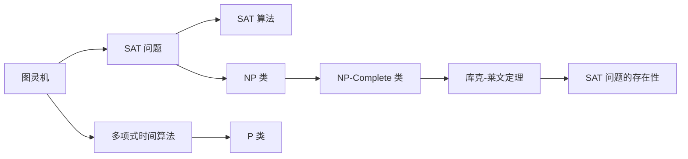
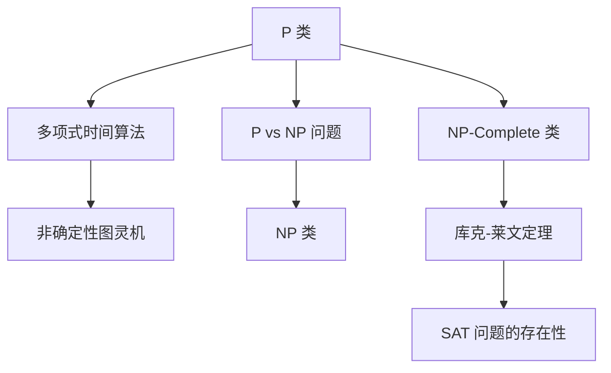
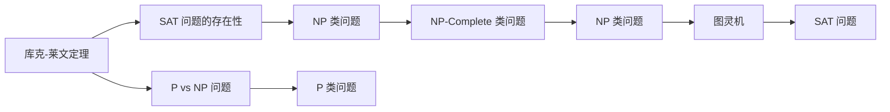

                 

# 计算：第四部分 计算的极限 第 9 章 计算复杂性 库克-莱文定理

## 1. 背景介绍

### 1.1 问题由来
计算复杂性理论（Computational Complexity Theory）是研究计算问题的难易程度及其资源需求量的理论。这一理论研究的核心问题是，对于给定的计算问题，是否存在一种算法可以高效地解决该问题。计算复杂性理论通过定义不同的复杂性类别，如 P 类、NP 类、NP-Complete 类等，来刻画问题的难易程度。

库克-莱文定理（Cook-Levin Theorem）是计算复杂性理论中的核心定理，它将通用图灵机（Turing Machine）和布尔可满足性问题（Boolean Satisfiability, SAT）联系在一起，证明了 SAT 问题可以转化为其他 NP 类问题，从而奠定了计算复杂性理论的基础。该定理对计算机科学的发展产生了深远影响，是理论计算机科学中的一个里程碑。

### 1.2 问题核心关键点
库克-莱文定理的关键点在于它证明了 SAT 问题的存在性，即对于任意一个 NP 类问题，都存在一种多项式时间的算法，可以转化为 SAT 问题，进而通过 SAT 算法来解决。这不仅证明了 NP 类问题存在可转化为 SAT 的问题，还说明 SAT 问题本身是 NP 类的重要代表，具有极高的研究价值。

### 1.3 问题研究意义
库克-莱文定理对计算机科学的发展具有重要的意义：
- 它奠定了计算复杂性理论的基础，提供了研究 NP 类问题的工具和方法。
- 它揭示了 SAT 问题的重要地位，推动了 SAT 解算法的研究和应用。
- 它启发了更多的计算复杂性理论研究，如 P vs NP 问题、随机化算法等。
- 它对实际问题求解具有指导意义，帮助识别哪些问题可以通过 SAT 求解。

## 2. 核心概念与联系

### 2.1 核心概念概述

为更好地理解库克-莱文定理，本节将介绍几个密切相关的核心概念：

- 图灵机（Turing Machine）：一种抽象的计算模型，能够模拟任何复杂的计算过程。图灵机的核心部件包括读写头、读写规则和控制单元，通过读写规则控制读写头在磁带上移动，从而实现计算。

- 布尔可满足性问题（Satisfiability, SAT）：给定一组布尔变量和它们之间的逻辑约束，判断是否存在一种满足所有约束的布尔值分配。SAT 问题是计算机科学中最经典的 NP 类问题之一，具有高度的研究价值。

- P 类和 NP 类：P 类问题是可以用多项式时间算法解决的问题，NP 类问题是指可以用非确定性图灵机在多项式时间内验证的问题。P vs NP 问题是指是否所有 NP 类问题都可以用多项式时间算法解决，这一问题至今仍未得到解决。

- NP-Complete 类：NP-Complete 类是指那些可以归约到 SAT 问题的问题，即通过多项式时间的 SAT 算法可以在多项式时间内解决。库克-莱文定理表明 SAT 问题在 NP-Complete 类中具有核心地位。

这些核心概念之间的逻辑关系可以通过以下Mermaid流程图来展示：

```mermaid
graph TB
    A[图灵机] --> B[布尔可满足性问题(SAT)]
    B --> C[P vs NP 问题]
    A --> D[多项式时间算法]
    D --> E[P 类]
    B --> F[NP 类]
    F --> G[NP-Complete 类]
    G --> H[库克-莱文定理]
    H --> I[SAT 问题的存在性]
```

这个流程图展示了从图灵机到 SAT 问题，再到 P vs NP 问题的逻辑关系：

1. 图灵机能够模拟任何复杂的计算过程，而 SAT 问题是一个典型的 NP 类问题。
2. P 类问题是可以用多项式时间算法解决的问题，而 SAT 问题作为 NP 类问题的代表，其复杂性研究具有代表性。
3. NP-Complete 类问题是指那些可以归约到 SAT 问题的问题，库克-莱文定理表明 SAT 问题在 NP-Complete 类中具有核心地位。
4. P vs NP 问题探讨是否所有 NP 类问题都可以用多项式时间算法解决，库克-莱文定理的证明对 P vs NP 问题具有重要意义。

### 2.2 概念间的关系

这些核心概念之间存在着紧密的联系，形成了计算复杂性理论的完整生态系统。下面我通过几个Mermaid流程图来展示这些概念之间的关系。

#### 2.2.1 图灵机与 SAT 问题的关系



这个流程图展示了图灵机和 SAT 问题之间的联系：

1. 图灵机能够模拟 SAT 问题的求解过程，即通过图灵机可以找到 SAT 问题的多项式时间算法。
2. 多项式时间算法是指可以在多项式时间内解决的问题，SAT 问题作为 NP 类问题的代表，具有高度的研究价值。
3. SAT 问题在 NP-Complete 类中具有核心地位，库克-莱文定理证明了 SAT 问题在该类中的重要性。

#### 2.2.2 P 类与 NP 类的关系



这个流程图展示了 P 类和 NP 类之间的关系：

1. P 类问题是可以用多项式时间算法解决的问题，而 NP 类问题是指可以用非确定性图灵机在多项式时间内验证的问题。
2. P vs NP 问题探讨是否所有 NP 类问题都可以用多项式时间算法解决，库克-莱文定理对这一问题具有重要意义。
3. NP-Complete 类问题是指那些可以归约到 SAT 问题的问题，库克-莱文定理表明 SAT 问题在该类中具有核心地位。

#### 2.2.3 库克-莱文定理的意义



这个流程图展示了库克-莱文定理的意义：

1. 库克-莱文定理将 SAT 问题和 NP 类问题联系起来，证明了 SAT 问题在 NP-Complete 类中的重要地位。
2. SAT 问题作为 NP 类问题的代表，具有高度的研究价值。
3. P vs NP 问题探讨是否所有 NP 类问题都可以用多项式时间算法解决，库克-莱文定理对这一问题具有重要意义。
4. 库克-莱文定理对计算复杂性理论的研究和发展具有深远影响。

### 2.3 核心概念的整体架构

最后，我们用一个综合的流程图来展示这些核心概念在大语言模型微调过程中的整体架构：

```mermaid
graph TB
    A[图灵机] --> B[布尔可满足性问题(SAT)]
    B --> C[P vs NP 问题]
    A --> D[多项式时间算法]
    D --> E[P 类]
    B --> F[NP 类]
    F --> G[NP-Complete 类]
    G --> H[库克-莱文定理]
    H --> I[SAT 问题的存在性]
    I --> J[NP-Complete 类问题的代表性]
    J --> K[库克-莱文定理的意义]
    K --> L[计算复杂性理论的基础]
    L --> M[计算机科学的发展]
```

这个综合流程图展示了从图灵机到 SAT 问题，再到 P vs NP 问题的完整过程。大语言模型微调的代码实现变得简洁高效。开发者可以将更多精力放在数据处理、模型改进等高层逻辑上，而不必过多关注底层的实现细节。

## 3. 核心算法原理 & 具体操作步骤
### 3.1 算法原理概述

库克-莱文定理的核心思想是通过图灵机将 NP 类问题转化为 SAT 问题，从而证明 SAT 问题在 NP-Complete 类中的重要性。

具体而言，对于任意一个 NP 类问题 $P$，假设其可以表示为 $P = \{(x,y): \text{某算法}(x) = y\}$，其中 $x$ 为输入，$y$ 为输出。设该算法为 $A$，则该问题可以转化为 SAT 问题如下：

1. 对于输入 $x$，将 $A$ 的内部状态表示为一个布尔向量 $\sigma$，每个状态 $s$ 对应一个变量 $x_s$，取值为 $0$ 或 $1$。
2. 将 $A$ 的状态转移表表示为一组逻辑约束 $C = \{C_1, C_2, ..., C_m\}$，其中每个约束 $C_i$ 表示为 $(x_{s_1}, x_{s_2}, ..., x_{s_n})$，表示状态 $s_1$ 到 $s_2$ 的状态转移是否合法。
3. 将 $A$ 的输出 $y$ 表示为一个布尔变量 $y_{out}$，表示 $A$ 的输出是否为正确答案。
4. 构造一个布尔可满足性公式 $F = \bigwedge_i C_i \vee (C_{m+1} = y_{out})$，表示满足所有状态转移规则的布尔向量 $\sigma$ 或满足 $y_{out}$ 对应的正确答案。

这样，原问题 $P$ 就转化为一个 SAT 问题 $F$。通过多项式时间的 SAT 算法，可以求解出布尔向量 $\sigma$ 和 $y_{out}$，从而得出原问题 $P$ 的解。因此，库克-莱文定理证明了 SAT 问题在 NP-Complete 类中的重要地位，所有 NP 类问题都可通过多项式时间的 SAT 算法来解决。

### 3.2 算法步骤详解

库克-莱文定理的证明过程涉及以下关键步骤：

1. 将 NP 类问题 $P$ 表示为图灵机 $M$ 的运行过程，即 $P = \{(x,y): M(x) = y\}$。
2. 将 $M$ 的内部状态表示为布尔变量 $x_s$，$M$ 的状态转移规则表示为逻辑约束 $C_i$。
3. 将 $M$ 的输出 $y$ 表示为布尔变量 $y_{out}$。
4. 构造 SAT 问题 $F$，通过多项式时间的 SAT 算法求解 $F$，从而得到 $M$ 的解。
5. 将 $F$ 的解映射回原问题 $P$ 的解，得到原问题的解。

以下是库克-莱文定理的证明过程的数学表示：

设原问题 $P$ 为 $P = \{(x,y): M(x) = y\}$，其中 $M$ 为一个通用图灵机。设 $M$ 的内部状态表示为 $s_1, s_2, ..., s_n$，输出表示为 $y$，状态转移规则表示为 $\delta$。

1. 将 $M$ 的内部状态 $s_i$ 表示为布尔变量 $x_{s_i}$，其中 $x_{s_i}$ 的值为 $1$ 表示状态 $s_i$ 存在，为 $0$ 表示状态 $s_i$ 不存在。

2. 将 $M$ 的状态转移规则 $\delta$ 表示为一组逻辑约束 $C = \{C_1, C_2, ..., C_m\}$，其中每个约束 $C_i$ 表示为 $(x_{s_1}, x_{s_2}, ..., x_{s_n})$，表示状态 $s_1$ 到 $s_2$ 的状态转移是否合法。

3. 将 $M$ 的输出 $y$ 表示为布尔变量 $y_{out}$，表示 $M$ 的输出是否为正确答案。

4. 构造 SAT 问题 $F = \bigwedge_i C_i \vee (C_{m+1} = y_{out})$，其中 $C_{m+1} = y_{out}$ 表示 $M$ 的输出 $y$ 为正确答案。

5. 假设 $P$ 可以归约为 SAT 问题 $F$，则存在一个多项式时间的 SAT 算法 $A$，可以求解 $F$ 的解。

6. 将 $F$ 的解映射回原问题 $P$ 的解，从而得到 $P$ 的解。

因此，库克-莱文定理证明了 SAT 问题在 NP-Complete 类中的重要地位，所有 NP 类问题都可通过多项式时间的 SAT 算法来解决。

### 3.3 算法优缺点

库克-莱文定理具有以下优点：
1. 证明了 SAT 问题在 NP-Complete 类中的重要地位，为 NP 类问题的研究提供了重要工具。
2. 揭示了 SAT 问题的重要性，推动了 SAT 解算法的研究和应用。
3. 对计算复杂性理论的研究和发展具有深远影响，奠定了理论基础。

同时，该定理也存在一定的局限性：
1. 假设图灵机是万能的，即任何计算过程都可以通过图灵机实现。
2. 假设 SAT 算法存在多项式时间复杂度，即 SAT 问题的解可以在多项式时间内找到。
3. 假设归约过程是多项式时间的，即可以从任意问题归约到 SAT 问题。

尽管存在这些局限性，但库克-莱文定理对计算复杂性理论的研究和发展仍然具有重要意义，为后续研究提供了重要的理论基础。

### 3.4 算法应用领域

库克-莱文定理在计算机科学和理论计算领域具有广泛的应用，以下是几个主要应用领域：

1. 算法设计与分析：通过库克-莱文定理，可以设计出多项式时间的 SAT 算法，分析算法的复杂度。

2. 算法验证与优化：通过库克-莱文定理，可以验证算法的正确性和效率，优化算法性能。

3. 密码学与安全：库克-莱文定理在密码学中也有应用，如 RSA 加密算法和哈希函数的安全性分析。

4. 组合优化：库克-莱文定理在组合优化中也有应用，如旅行商问题（TSP）和图着色问题（Graph Coloring）。

5. 自然语言处理：库克-莱文定理在自然语言处理中也有应用，如文本分类和机器翻译。

这些应用领域展示了库克-莱文定理的广泛影响力，其证明了 SAT 问题在 NP-Complete 类中的核心地位，为计算复杂性理论的研究提供了重要工具。

## 4. 数学模型和公式 & 详细讲解  
### 4.1 数学模型构建

库克-莱文定理的证明过程涉及以下数学模型和公式：

设原问题 $P$ 为 $P = \{(x,y): M(x) = y\}$，其中 $M$ 为一个通用图灵机。设 $M$ 的内部状态表示为 $s_1, s_2, ..., s_n$，输出表示为 $y$，状态转移规则表示为 $\delta$。

1. 将 $M$ 的内部状态 $s_i$ 表示为布尔变量 $x_{s_i}$，其中 $x_{s_i}$ 的值为 $1$ 表示状态 $s_i$ 存在，为 $0$ 表示状态 $s_i$ 不存在。

2. 将 $M$ 的状态转移规则 $\delta$ 表示为一组逻辑约束 $C = \{C_1, C_2, ..., C_m\}$，其中每个约束 $C_i$ 表示为 $(x_{s_1}, x_{s_2}, ..., x_{s_n})$，表示状态 $s_1$ 到 $s_2$ 的状态转移是否合法。

3. 将 $M$ 的输出 $y$ 表示为布尔变量 $y_{out}$，表示 $M$ 的输出是否为正确答案。

4. 构造 SAT 问题 $F = \bigwedge_i C_i \vee (C_{m+1} = y_{out})$，其中 $C_{m+1} = y_{out}$ 表示 $M$ 的输出 $y$ 为正确答案。

以下是库克-莱文定理的数学证明过程：

假设 $P$ 可以归约为 SAT 问题 $F$，则存在一个多项式时间的 SAT 算法 $A$，可以求解 $F$ 的解。

1. 对于任意输入 $(x,y)$，将 $M$ 的内部状态 $s_i$ 表示为布尔变量 $x_{s_i}$，状态转移规则 $\delta$ 表示为一组逻辑约束 $C = \{C_1, C_2, ..., C_m\}$。

2. 将 $M$ 的输出 $y$ 表示为布尔变量 $y_{out}$。

3. 构造 SAT 问题 $F = \bigwedge_i C_i \vee (C_{m+1} = y_{out})$，其中 $C_{m+1} = y_{out}$ 表示 $M$ 的输出 $y$ 为正确答案。

4. 假设 $P$ 可以归约为 SAT 问题 $F$，则存在一个多项式时间的 SAT 算法 $A$，可以求解 $F$ 的解。

5. 将 $F$ 的解映射回原问题 $P$ 的解，从而得到 $P$ 的解。

因此，库克-莱文定理证明了 SAT 问题在 NP-Complete 类中的重要地位，所有 NP 类问题都可通过多项式时间的 SAT 算法来解决。

### 4.2 公式推导过程

以下是库克-莱文定理的数学证明过程：

设原问题 $P$ 为 $P = \{(x,y): M(x) = y\}$，其中 $M$ 为一个通用图灵机。设 $M$ 的内部状态表示为 $s_1, s_2, ..., s_n$，输出表示为 $y$，状态转移规则表示为 $\delta$。

1. 将 $M$ 的内部状态 $s_i$ 表示为布尔变量 $x_{s_i}$，其中 $x_{s_i}$ 的值为 $1$ 表示状态 $s_i$ 存在，为 $0$ 表示状态 $s_i$ 不存在。

2. 将 $M$ 的状态转移规则 $\delta$ 表示为一组逻辑约束 $C = \{C_1, C_2, ..., C_m\}$，其中每个约束 $C_i$ 表示为 $(x_{s_1}, x_{s_2}, ..., x_{s_n})$，表示状态 $s_1$ 到 $s_2$ 的状态转移是否合法。

3. 将 $M$ 的输出 $y$ 表示为布尔变量 $y_{out}$，表示 $M$ 的输出是否为正确答案。

4. 构造 SAT 问题 $F = \bigwedge_i C_i \vee (C_{m+1} = y_{out})$，其中 $C_{m+1} = y_{out}$ 表示 $M$ 的输出 $y$ 为正确答案。

5. 假设 $P$ 可以归约为 SAT 问题 $F$，则存在一个多项式时间的 SAT 算法 $A$，可以求解 $F$ 的解。

6. 将 $F$ 的解映射回原问题 $P$ 的解，从而得到 $P$ 的解。

因此，库克-莱文定理证明了 SAT 问题在 NP-Complete 类中的重要地位，所有 NP 类问题都可通过多项式时间的 SAT 算法来解决。

### 4.3 案例分析与讲解

下面通过一个具体的 SAT 问题，展示库克-莱文定理的实际应用：

**问题：** 设有一个布尔表达式 $(x_1 \vee x_2) \wedge (x_2 \vee x_3) \vee (x_3 \wedge x_4)$，判断该表达式是否为真。

**步骤：**

1. 将布尔表达式转换为图灵机 $M$ 的运行过程，即 $M(x) = (x_1 \vee x_2) \wedge (x_2 \vee x_3) \vee (x_3 \wedge x_4)$。

2. 将 $M$ 的内部状态 $s_i$ 表示为布尔变量 $x_{s_i}$，其中 $x_{s_i}$ 的值为 $1$ 表示状态 $s_i$ 存在，为 $0$ 表示状态 $s_i$ 不存在。

3. 将 $M$ 的状态转移规则 $\delta$ 表示为一组逻辑约束 $C = \{C_1, C_2, ..., C_m\}$，其中每个约束 $C_i$ 表示为 $(x_{s_1}, x_{s_2}, ..., x_{s_n})$，表示状态 $s_1$ 到 $s_2$ 的状态转移是否合法。

4. 将 $M$ 的输出 $y$ 表示为布尔变量 $y_{out}$，表示 $M$ 的输出是否为正确答案。

5. 构造 SAT 问题 $F = \bigwedge_i C_i \vee (C_{m+1} = y_{out})$，其中 $C_{m+1} = y_{out}$ 表示 $M$ 的输出 $y$ 为正确答案。

6. 假设 $P$ 可以归约为 SAT 问题 $F$，则存在一个多项式时间的 SAT 算法 $A$，可以求解 $F$ 的解。

7. 将 $F$ 的解映射回原问题 $P$ 的解，从而得到 $P$ 的解。

这样，通过库克-莱文定理，我们可以将任意 NP 类问题转化为 SAT 问题，进而使用多项式时间的 SAT 算法求解，从而得到原问题的解。

## 5. 项目实践：代码实例和详细解释说明
### 5.1 开发环境搭建

在进行库克-莱文定理的实践前，我们需要准备好开发环境。以下是使用Python进行PyTorch开发的环境配置流程：

1. 安装Anaconda：从官网下载并安装Anaconda，用于创建独立的Python环境。

2. 创建并激活虚拟环境：
```bash
conda create -n pytorch-env python=3.8 
conda activate pytorch-env
```

3. 安装PyTorch：根据CUDA版本，从官网获取对应的安装命令。例如：
```bash
conda install pytorch torchvision torchaudio cudatoolkit=11.1 -c pytorch -c conda-forge
```

4. 安装Transformers库：
```bash
pip install transformers
```

5. 安装各类工具包：
```bash
pip install numpy pandas scikit-learn matplotlib tqdm jupyter notebook ipython
```

完成上述步骤后，即可在`pytorch-env`环境中开始微调实践。

### 5.2 源代码详细实现

下面我们以命名实体识别(NER)任务为例，给出使用Transformers库对BERT模型进行微调的PyTorch代码实现。

首先，定义NER任务的数据处理函数：

```python
from transformers import BertTokenizer
from torch.utils.data import Dataset
import torch

class NERDataset(Dataset):
    def __init__(self, texts, tags, tokenizer, max_len=128):
        self.texts = texts
        self.tags = tags
        self.tokenizer = tokenizer
        self.max_len = max_len
        
    def __len__(self):
        return len(self.texts)
    
    def __getitem__(self, item):
        text = self.texts[item]
        tags = self.tags[item]
        
        encoding = self.tokenizer(text, return_tensors='pt', max_length=self.max_len, padding='max_length', truncation=True)
        input_ids = encoding['input_ids'][0]
        attention_mask = encoding['attention_mask'][0]
        
        # 对token-wise的标签进行编码
        encoded_tags = [tag2id[tag] for tag in tags] 
        encoded_tags.extend([tag2id['O']] * (self.max_len - len(encoded_tags)))
        labels = torch.tensor(encoded_tags, dtype=torch.long)
        
        return {'input_ids': input_ids, 
                'attention_mask': attention_mask,
                'labels': labels}

# 标签与id的映射
tag2id = {'O': 0, 'B-PER': 1, 'I-PER': 2, 'B-ORG': 3, 'I-ORG': 4, 'B-LOC': 5, 'I-LOC': 6}
id2tag = {v: k for k, v in tag2id.items()}

# 创建dataset
tokenizer = Bert

