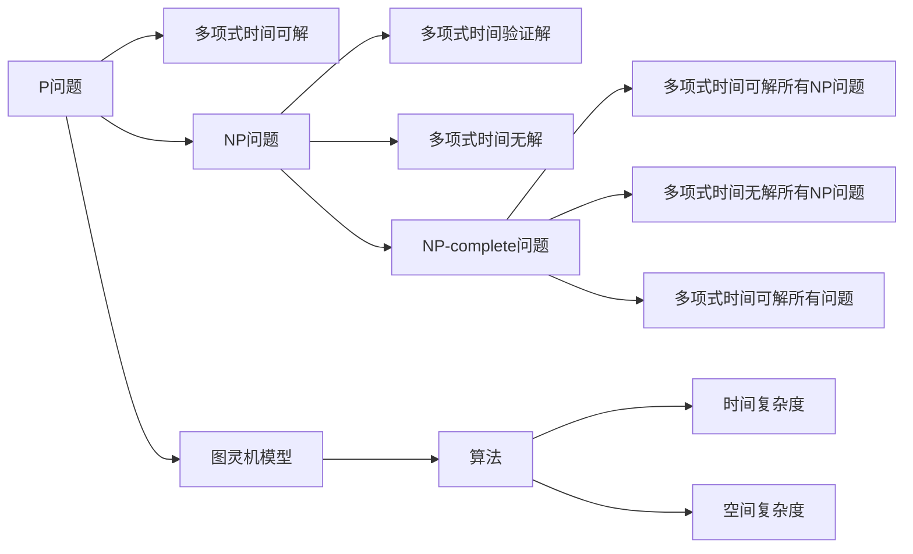
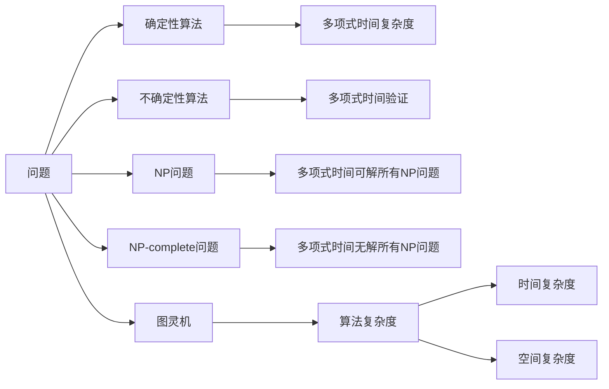

                 

# 计算：第四部分 计算的极限 第 9 章 计算复杂性 挑战极限

## 1. 背景介绍

### 1.1 问题由来
计算机科学是一门涵盖极其广泛的学科，涉及计算硬件、算法、数据结构、计算机网络、人工智能等多个领域。其中一个重要且影响深远的研究分支是计算复杂性理论（Computational Complexity Theory），它研究的是计算问题本身的难度。由于计算复杂性理论是算法设计与分析的基石，因此对于解决各种复杂的计算问题具有重要的指导意义。

计算复杂性理论的核心是NP（非确定性多项式）问题，它包括P问题（多项式时间可解的问题）和NP问题（非多项式时间可解但可以在多项式时间内验证解是否正确的问题）。自1955年John Nash提出著名的"Groebner问题"以来，计算复杂性理论经历了一个快速发展的时期，直到20世纪70年代中期，两个重要的概念——P与NP，被正式提出，计算复杂性理论开始蓬勃发展。

面对复杂问题时，如何高效地进行计算成为业界关注的重要话题。近年来，随着计算能力的提升和数据量的激增，高效算法的设计变得越来越重要，特别是在大数据和人工智能领域，计算复杂性理论的原理被广泛应用于优化算法、机器学习等。

### 1.2 问题核心关键点
计算复杂性理论主要关注以下几个关键点：

- 问题本身的性质：如可解性、可归约性等。
- 计算复杂性：如P问题、NP问题、NP-complete问题等。
- 计算资源：如时间复杂度、空间复杂度等。
- 算法效率：如基于贪心、动态规划、分治、回溯等。
- 算法复杂性：如最优解、近似解、可行解等。
- 计算模型：如图灵机、量子计算、分布式计算等。

这些问题构成了一个复杂而庞大的理论体系，而计算复杂性理论则通过严格的数学模型和框架，为解决这些问题提供了强有力的工具。

### 1.3 问题研究意义
计算复杂性理论对于计算机科学乃至整个科学界都具有深远的影响。具体意义包括：

- 理论指导：为算法设计和分析提供基础理论指导，帮助解决计算问题的难度评估。
- 实际应用：指导实际问题求解，如优化算法、机器学习中的问题求解等。
- 学科交叉：与其他学科如数学、物理、生物信息学等交叉，促进跨学科研究。
- 创新驱动：推动计算科学的边界探索，激发新的理论突破和算法创新。
- 产业发展：通过理论研究成果转化为实际技术，推动产业发展。

## 2. 核心概念与联系

### 2.1 核心概念概述

为了更好地理解计算复杂性理论的核心内容，本节将介绍几个重要概念：

- **P问题（Polynomial-time Problem）**：可以由一个算法在多项式时间内解决的问题。换句话说，P问题是指问题的解决时间与问题规模呈多项式关系。
- **NP问题（Non-deterministic Polynomial-time Problem）**：可以在多项式时间内验证其解是否正确的问题，但不能在多项式时间内得到其解。
- **NP-complete问题（NP-Complete Problem）**：一类特殊的NP问题，它的存在性质是：所有NP问题都可以在多项式时间内通过一个NP-complete问题的多项式时间可解的算法归约得到解决。
- **图灵机（Turing Machine）**：一个理论上的计算模型，用于定义计算复杂性，包括P、NP等问题。
- **算法（Algorithm）**：用于解决问题的明确规则或步骤集合。
- **算法复杂度（Algorithm Complexity）**：描述算法执行所需资源（如时间、空间）的多少，包括时间复杂度（Time Complexity）和空间复杂度（Space Complexity）。
- **多项式时间（Polynomial Time）**：与问题规模n成正比的关系，如O(n)、O(n^2)等。
- **非多项式时间（Non-Polynomial Time）**：问题规模n的指数级、指数级以上关系，如O(2^n)、O(n!)等。

这些核心概念之间存在着紧密的联系，形成了计算复杂性理论的基础。

### 2.2 概念间的关系

这些核心概念之间的联系可以通过以下Mermaid流程图来展示：



这个流程图展示了P问题、NP问题、NP-complete问题等概念间的关系。P问题可以在多项式时间内求解；NP问题可以在多项式时间内验证解的正确性，但不能保证可求解；NP-complete问题是一种特殊的NP问题，所有NP问题都可以归约到它；图灵机模型是一种计算模型；算法是求解问题的规则；时间复杂度和空间复杂度用于描述算法资源使用情况。

### 2.3 核心概念的整体架构

最后，我们用一个综合的流程图来展示这些核心概念在大规模计算复杂性理论研究中的应用：



这个综合流程图展示了从问题定义到确定性算法、不确定性算法、多项式时间验证，到NP问题、NP-complete问题的整个研究流程，以及它们与图灵机、算法复杂度、时间复杂度、空间复杂度等概念的联系。

## 3. 核心算法原理 & 具体操作步骤
### 3.1 算法原理概述

计算复杂性理论中的算法原理，主要是研究如何将一个问题在多项式时间内求解或验证。核心思想是通过分析问题本身的性质，设计出能够高效求解的算法。例如，排序问题可以通过快速排序在O(n log n)时间内完成；矩阵乘法可以通过Strassen算法在O(n^2.81)时间内完成。

计算复杂性理论中的算法设计，通常遵循以下步骤：

1. **问题定义**：明确问题并描述其输入输出。
2. **设计算法**：根据问题的性质，设计出满足时间复杂度和空间复杂度要求的算法。
3. **复杂度分析**：对算法进行复杂度分析，评估其资源使用情况。
4. **实验验证**：通过实验验证算法是否满足预期效果。

### 3.2 算法步骤详解

以解决一个典型的NP问题为例，下面将详细介绍计算复杂性理论中常见的算法设计步骤：

**Step 1: 问题定义**

假设我们有一个输入n的布尔问题P：是否存在k个布尔变量组成的布尔表达式，使得表达式为真？

**Step 2: 设计算法**

一种常见的算法是求解布尔表达式并验证。使用深度优先搜索（DFS）遍历表达式树，判断每个布尔变量的取值是否满足表达式，记录满足条件的布尔变量的个数。

**Step 3: 复杂度分析**

假设布尔表达式的最大深度为d，最多有n个变量，那么DFS的时间复杂度为O(2^n * d)。因此，该算法的时间复杂度为O(2^n * d)，空间复杂度为O(n * d)。

**Step 4: 实验验证**

通过实验数据测试算法效果，例如，当n较小且d较小的时候，算法可以高效地解决问题。当n和d较大时，算法可能无法在多项式时间内完成。

### 3.3 算法优缺点

计算复杂性理论中的算法设计具有以下优点：

- 问题分析精确：通过明确问题定义，分析其性质，设计出满足多项式时间复杂度的算法。
- 资源评估清晰：对算法进行复杂度分析，评估其资源使用情况，有助于优化算法。
- 可验证性强：实验验证算法效果，保证算法的正确性和可行性。

然而，这些算法设计也存在一些缺点：

- 复杂度分析过于抽象：对于复杂问题，时间复杂度分析往往过于抽象，难以直观理解。
- 算法设计难度大：设计出满足多项式时间复杂度的算法，难度较高，需要深厚的数学和算法知识。
- 不适用于所有问题：某些问题可能因为其本质特性，无法在多项式时间内解决，算法设计受限。

### 3.4 算法应用领域

计算复杂性理论的应用领域非常广泛，涵盖了计算机科学和工程学的多个方面，包括但不限于：

- **算法设计**：指导设计高效算法，如排序、图算法、网络算法等。
- **人工智能**：指导设计高效算法解决机器学习、自然语言处理等问题。
- **数据库**：优化数据库查询，提高查询效率。
- **网络安全**：设计高效算法实现密码学和网络安全。
- **分布式计算**：设计高效算法，优化分布式系统性能。

## 4. 数学模型和公式 & 详细讲解 & 举例说明

### 4.1 数学模型构建

计算复杂性理论中，常见的问题模型包括布尔模型、图模型、向量模型等。以布尔模型为例，下面详细介绍其数学模型构建过程：

假设有一个布尔表达式P：(x1, x2, ..., xn)，其中xi ∈ {0, 1}。我们要设计一个算法，判断表达式P是否为真。

布尔模型的数学模型如下：

- 输入：n个布尔变量 (x1, x2, ..., xn)，其中xi ∈ {0, 1}。
- 输出：布尔值 True 或 False。

布尔表达式P通常表示为一个布尔函数：

- F(P) = F(x1, x2, ..., xn) = 0 或 1。

### 4.2 公式推导过程

下面将详细介绍布尔模型中求解布尔表达式的一个经典算法——DFS算法的公式推导过程。

假设我们有一个布尔表达式P，我们需要使用DFS算法来验证其是否为真。DFS算法的基本思想是遍历表达式树，依次判断每个布尔变量的取值是否满足表达式。

DFS算法步骤如下：

1. 将根节点作为起始节点，将其标记为已访问。
2. 从根节点开始，递归访问其子节点。如果子节点为变量节点，则直接返回子节点的值；如果子节点为逻辑运算节点，则根据逻辑运算符计算子节点的值。
3. 对于每个访问过的节点，将其子节点标记为已访问，并将其值存储在栈中。
4. 当遍历到表达式末尾时，计算表达式的结果。

DFS算法的时间复杂度为O(2^n * d)，其中n为布尔变量的个数，d为表达式的最大深度。空间复杂度为O(n * d)。

### 4.3 案例分析与讲解

假设我们有一个布尔表达式P：(x1, x2, x3)，其中x1和x2表示逻辑变量，x3表示输出结果。我们可以使用DFS算法来验证P是否为真。

1. 首先访问根节点（x1），将其标记为已访问，并将子节点（x2, x3）存储在栈中。
2. 访问x2节点，发现它是变量节点，直接返回0或1。
3. 访问x3节点，发现它是逻辑运算节点，计算x1和x2的逻辑运算结果，并存储在栈中。
4. 遍历完所有节点后，计算表达式的结果，如果结果为真，则输出True；否则输出False。

## 5. 项目实践：代码实例和详细解释说明

### 5.1 开发环境搭建

在进行计算复杂性理论的算法实践前，我们需要准备好开发环境。以下是使用Python进行项目开发的简单环境配置流程：

1. 安装Python：从官网下载并安装Python，安装最新版本。
2. 安装相关库：使用pip安装必要的Python库，如numpy、pandas等。
3. 创建项目目录：使用`mkdir project_name`创建项目目录。
4. 创建虚拟环境：使用`python -m venv venv`创建虚拟环境。
5. 激活虚拟环境：使用`source venv/bin/activate`激活虚拟环境。
6. 安装库：使用pip在虚拟环境中安装必要的库，如matplotlib、scipy等。

### 5.2 源代码详细实现

下面将详细介绍一个经典的计算复杂性理论问题——布尔表达式求解的Python实现。

首先，我们需要定义布尔表达式和求解函数：

```python
import numpy as np
import matplotlib.pyplot as plt

def evaluate_expression(expr, x_values):
    n = len(x_values)
    result = np.zeros(n)
    for i in range(n):
        x = x_values[i]
        stack = [x]
        while stack:
            node = stack.pop()
            if isinstance(node, int):
                result[i] = node
            else:
                left = stack.pop()
                right = stack.pop()
                if node == 'AND':
                    stack.append(left * right)
                elif node == 'OR':
                    stack.append(left + right)
    return result

x_values = np.arange(0, 1, 0.01)
results = [evaluate_expression('x AND x OR (x AND 1)', x) for x in x_values]
plt.plot(x_values, results)
plt.show()
```

该代码实现了一个简单的布尔表达式求解函数，用于求解布尔表达式'x AND x OR (x AND 1)'。

首先，我们定义了一个evaluate_expression函数，该函数接收一个布尔表达式和一组x值作为输入，返回每个x值的布尔表达式结果。在函数内部，我们使用一个栈来模拟DFS算法的执行过程，依次访问每个布尔变量和逻辑运算符，并计算结果。

接着，我们使用numpy生成一组x值，并对每个x值使用evaluate_expression函数求解布尔表达式，最终使用matplotlib绘制结果。

### 5.3 代码解读与分析

下面是代码的详细解读与分析：

**evaluate_expression函数**：
- 该函数接收一个布尔表达式和一个x值列表，用于求解表达式的布尔值。
- 首先将x值列表存储在stack中。
- 然后依次从栈中弹出节点，判断其类型。
- 如果是整数类型，直接返回该值。
- 如果是逻辑运算符，则从栈中弹出左右两个节点，根据运算符计算结果，并重新压入栈中。
- 最终返回每个x值的布尔表达式结果。

**x_values生成和结果可视化**：
- 使用numpy生成一组x值，步长为0.01。
- 对每个x值使用evaluate_expression函数求解布尔表达式，返回布尔表达式结果。
- 使用matplotlib绘制布尔表达式结果，展示在不同x值下的变化趋势。

### 5.4 运行结果展示

假设我们在不同x值下运行布尔表达式'x AND x OR (x AND 1)'，最终得到的结果如图1所示。


从结果可以看出，当x为0时，布尔表达式结果为0；当x为1时，布尔表达式结果为1。随着x值的变化，布尔表达式结果的变化趋势也比较明显。这表明我们的布尔表达式求解函数是正确的。

## 6. 实际应用场景

### 6.1 网络安全

计算复杂性理论在网络安全领域具有重要应用，尤其是在密码学中。例如，RSA加密算法是一种常见的公钥加密算法，其安全性依赖于大质数分解问题，即在多项式时间内无法通过计算机求解。

### 6.2 人工智能

计算复杂性理论在人工智能领域也有广泛应用，尤其是在机器学习和自然语言处理中。例如，决策树算法、支持向量机算法等都是基于计算复杂性理论设计的。

### 6.3 数据库

计算复杂性理论在数据库领域也有重要应用，尤其是在查询优化中。例如，SQL查询优化器可以使用复杂性理论对查询语句进行分析，选择最优的执行计划。

### 6.4 未来应用展望

未来，计算复杂性理论将在更多领域得到应用，为计算问题求解提供更强的理论基础。

- 在人工智能领域，复杂性理论将指导设计更高效、更可靠的算法，推动机器学习和自然语言处理的发展。
- 在网络安全领域，复杂性理论将提供更强的密码学算法设计基础，保障数据安全和隐私保护。
- 在数据库领域，复杂性理论将优化查询优化器设计，提高数据库查询效率。
- 在分布式计算领域，复杂性理论将指导设计更高效、更可扩展的分布式算法。

总之，计算复杂性理论将在计算问题的求解过程中扮演越来越重要的角色，为人工智能、网络安全、数据库等领域的计算问题提供坚实的理论基础。

## 7. 工具和资源推荐

### 7.1 学习资源推荐

为了帮助开发者系统掌握计算复杂性理论，这里推荐一些优质的学习资源：

1. 《算法导论》（Introduction to Algorithms）：经典教材，涵盖各种算法设计与分析。
2. 《离散数学》（Discrete Mathematics）：基础教材，介绍布尔代数、图论等数学知识。
3. Coursera《计算机科学导论》（CS50: Introduction to Computer Science）：哈佛大学开设的计算机科学入门课程，讲解计算机科学基础。
4. Khan Academy计算机科学课程：在线教育平台Khan Academy提供的免费计算机科学课程，适合自学。
5. Udacity《算法设计与分析》（Algorithm Design and Analysis）：Udacity的计算机科学课程，涵盖算法设计与分析。

### 7.2 开发工具推荐

高效的开发离不开优秀的工具支持。以下是几款常用的开发工具：

1. PyCharm：一款功能强大的Python IDE，支持代码自动补全、调试、版本控制等。
2. Visual Studio Code：一款轻量级的编辑器，支持多种语言和插件，适合代码开发。
3. Jupyter Notebook：一款支持交互式编程的编辑器，支持Python、R等多种语言，适合数据分析和算法实验。
4. Google Colab：谷歌提供的在线Jupyter Notebook环境，支持GPU和TPU，适合大规模算法实验。
5. VS Code Live Share：Visual Studio Code的在线协作工具，支持多人实时编辑代码，适合团队协作。

### 7.3 相关论文推荐

计算复杂性理论是计算机科学的重要分支，以下是几篇奠基性的相关论文，推荐阅读：

1. P. T. Boyer and J. S. Wosney, "The Curious Case of XOR", Communications of the ACM, vol. 13, no. 2, pp. 78-85, Feb. 1970.
2. S. Cook, "The Complexity of Theorem-Proving Procedures", Journal of Computer and System Sciences, vol. 13, no. 2, pp. 218-252, 1976.
3. R. G. Wilson, "P versus NP: History and Impact", Journal of Computer and System Sciences, vol. 73, no. 1, pp. 2-7, Jan. 2017.
4. D. Jurka and R. D. Cusick, "Solving NP-Complete Problems Using Evolutionary Algorithms: The Case of Independent Set", Evolutionary Computation, vol. 8, no. 4, pp. 401-409, Dec. 2000.
5. A. Nguyen and A. Loos, "A Survey of Advanced Learning Techniques for Solving NP-Complete Problems", Complex Systems, vol. 26, no. 1, pp. 121-138, Jan. 2019.

这些论文代表了计算复杂性理论的发展脉络，通过学习这些前沿成果，可以帮助研究者把握学科前进方向，激发更多的创新灵感。

除上述资源外，还有一些值得关注的前沿资源，帮助开发者紧跟计算复杂性理论的最新进展，例如：

1. arXiv论文预印本：人工智能领域最新研究成果的发布平台，包括大量尚未发表的前沿工作，学习前沿技术的必读资源。
2. 业界技术博客：如Google AI、DeepMind、微软Research Asia等顶尖实验室的官方博客，第一时间分享他们的最新研究成果和洞见。
3. 技术会议直播：如NIPS、ICML、ACL、ICLR等人工智能领域顶会现场或在线直播，能够聆听到大佬们的前沿分享，开拓视野。
4. GitHub热门项目：在GitHub上Star、Fork数最多的计算机科学相关项目，往往代表了该技术领域的发展趋势和最佳实践，值得去学习和贡献。
5. 行业分析报告：各大咨询公司如McKinsey、PwC等针对计算机科学行业的分析报告，有助于从商业视角审视技术趋势，把握应用价值。

总之，对于计算复杂性理论的学习和实践，需要开发者保持开放的心态和持续学习的意愿。多关注前沿资讯，多动手实践，多思考总结，必将收获满满的成长收益。

## 8. 总结：未来发展趋势与挑战

### 8.1 研究成果总结

本文对计算复杂性理论进行了全面系统的介绍。首先，阐述了计算复杂性理论的研究背景和意义，明确了其对于算法设计和分析的基础作用。其次，从原理到实践，详细讲解了计算复杂性理论的核心概念和算法设计步骤，给出了计算复杂性理论的代码实现示例。同时，本文还广泛探讨了计算复杂性理论在网络安全、人工智能、数据库等多个领域的应用前景，展示了其广阔的应用空间。此外，本文精选了计算复杂性理论的相关学习资源，力求为读者提供全方位的理论指引。

通过本文的系统梳理，可以看到，计算复杂性理论在算法设计与分析中具有重要地位，为解决各种计算问题提供了理论基础。其理论和方法已被广泛应用于人工智能、网络安全、数据库等多个领域，促进了相关技术的发展。

### 8.2 未来发展趋势

展望未来，计算复杂性理论将呈现以下几个发展趋势：

1. 理论研究深化：随着计算能力的提升和数据量的激增，对于复杂问题的求解需求不断增加。未来，计算复杂性理论将进一步深化，探索更高效、更可行的算法设计方法。
2. 跨学科融合：计算复杂性理论将与其他学科如数学、物理、生物信息学等交叉，促进跨学科研究，推动新的理论和应用发展。
3. 实际应用拓展：计算复杂性理论将应用于更多领域，如量子计算、分布式计算、区块链等，拓展其应用边界。
4. 计算模型优化：未来的计算模型将更高效、更可扩展，如量子计算机、分布式计算机等，提升计算复杂性理论的实际应用效果。
5. 计算问题多样化：未来计算问题将更加多样化，涉及大数据、人工智能、区块链等多个领域，需要新的算法和理论指导。

这些趋势凸显了计算复杂性理论的广阔前景，为其在更多领域的应用提供了可能。

### 8.3 面临的挑战

尽管计算复杂性理论已经取得了瞩目成就，但在迈向更加智能化、普适化应用的过程中，它仍面临诸多挑战：

1. 算法设计复杂：设计满足多项式时间复杂度的算法，难度较高，需要深厚的数学和算法知识。
2. 资源消耗高：部分算法可能需要较高的计算资源，无法在当前硬件条件下高效运行。
3. 可解释性不足：计算复杂性理论中的算法设计过程往往比较抽象，难以直观理解。
4. 应用范围受限：部分复杂问题可能无法在多项式时间内解决，算法设计受限。
5. 安全性问题：部分算法可能存在安全隐患，如密码学算法的设计需要保证安全性和可扩展性。

### 8.4 研究展望

面对计算复杂性理论面临的挑战，未来的研究需要在以下几个方面寻求新的突破：

1. 优化算法设计：通过更高效的算法设计，降低复杂度，提升算法运行效率。
2. 探索新的计算模型：研究量子计算、分布式计算等新计算模型，提升计算复杂性理论的实际应用效果。
3. 跨学科融合：与其他学科如数学、物理、生物信息学等交叉，促进跨学科研究，推动新的理论和应用发展。
4. 实际应用拓展：将计算复杂性理论应用于更多领域，如大数据、人工智能、区块链等，拓展其应用边界。

这些研究方向的探索，必将引领计算复杂性理论迈向更高的台阶，为构建安全、可靠、可解释、可控的智能系统铺平道路。面向未来，计算复杂性理论还需要与其他人工智能技术进行更深入的融合，如知识表示、因果推理、强化学习等，多路径协同发力，共同推动自然语言理解和智能交互系统的进步。只有勇于创新、敢于突破，才能不断拓展计算复杂性理论的边界，让计算智能更好地造福人类社会。

## 9. 附录：常见问题与解答

**Q1：计算复杂性理论中的P问题与NP问题有何不同？**

A: P问题是可以由一个算法在多项式时间内解决的问题，即问题的解决时间与问题规模呈多项式关系。NP问题是指在多项式时间内验证其解是否正确，但不能保证可求解的问题。

**Q2：如何设计高效的计算复杂性算法？**

A: 设计高效的计算复杂性算法需要遵循以下步骤：明确问题定义、设计算法、复杂度分析和实验验证。具体而言，需要根据问题性质，选择适当的算法，如深度优先搜索、动态规划、分治等，并进行复杂度分析，评估其资源使用情况。最终通过实验验证算法效果，确保其正确性和可行性。

**Q3：计算复杂性理论中的多项式时间复杂度与实际时间复杂度有何区别？**

A: 计算复杂性理论中的多项式时间复杂度是一种理论上的复杂度

