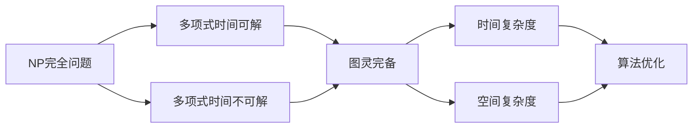

                 

# 计算：第四部分 计算的极限 第 9 章 计算复杂性

> 关键词：计算复杂性, NP完全问题, P vs NP, 图灵完备, 时间复杂度, 空间复杂度, 算法优化

## 1. 背景介绍

### 1.1 问题由来

计算复杂性理论是计算机科学中的一个重要领域，研究算法运行所需的时间和空间资源与输入规模之间的关系。其核心问题是探索计算问题的边界，理解哪些问题可以高效解决，哪些问题可能无法解决。计算复杂性理论不仅对计算机科学基础研究有重要意义，也是各种算法优化、系统设计和应用开发的基础。

### 1.2 问题核心关键点

计算复杂性理论的核心关键点包括：
- **NP完全问题**：一类问题，即不存在多项式时间算法可以求解，但某些特定问题可以通过多项式时间算法转化到这类问题中。
- **P vs NP**：是否所有NP问题都可以在多项式时间内被求解，这是计算复杂性理论中最为著名且尚未解决的问题。
- **图灵完备**：一个计算模型如果能够计算所有图灵可计算的函数，则称其为图灵完备。图灵完备性是计算理论中的核心概念。
- **时间复杂度**：算法运行所需时间的增长率，通常用大O表示。
- **空间复杂度**：算法运行所需的额外存储空间，通常用大O表示。
- **算法优化**：通过改进算法结构、选择更高效的算法实现、并行化处理等方式，提高算法效率。

### 1.3 问题研究意义

研究计算复杂性理论具有重要意义：
1. **理论基础**：为计算机科学提供理论基础，帮助理解算法在输入规模增加时的行为。
2. **算法优化**：指导算法设计和实现，提升算法的性能。
3. **系统设计**：为系统架构设计提供指导，优化资源利用。
4. **应用开发**：为各种应用场景的算法优化和系统设计提供理论依据。
5. **决策支持**：为政策制定提供科学依据，如数据加密、密码学等领域。

## 2. 核心概念与联系

### 2.1 核心概念概述

计算复杂性理论涉及多个核心概念，包括NP问题、图灵完备、时间复杂度和空间复杂度。下面将详细阐述这些概念：

- **NP完全问题**：一类问题，既包含多项式时间可解的问题，也包含多项式时间不可解的问题。若将多项式时间可解的问题转化为NP完全问题，则该多项式时间可解问题也在NP中。

- **图灵完备**：一个计算模型如果能够计算所有图灵可计算的函数，则称其为图灵完备。这意味着任何计算机程序都能在图灵完备的模型上运行。

- **时间复杂度**：算法运行所需时间的增长率，通常用大O表示。例如，O(n)表示算法的时间复杂度与输入规模n成正比。

- **空间复杂度**：算法运行所需的额外存储空间，通常用大O表示。例如，O(n)表示算法的空间复杂度与输入规模n成正比。

### 2.2 概念间的关系

这些核心概念之间存在着紧密的联系，形成了计算复杂性理论的整体框架。下面通过一个Mermaid流程图来展示这些概念之间的关系：



这个流程图展示了NP完全问题与多项式时间可解问题、多项式时间不可解问题之间的关系，以及时间复杂度和空间复杂度与图灵完备、算法优化之间的关系。

## 3. 核心算法原理 & 具体操作步骤
### 3.1 算法原理概述

计算复杂性理论的算法原理主要围绕着NP完全问题的求解、图灵完备性的证明和算法复杂度的分析展开。

### 3.2 算法步骤详解

1. **NP完全问题求解**：
   - **步骤1**：选择合适的NP完全问题作为研究对象，如旅行商问题(TSP)、背包问题(Knapsack)等。
   - **步骤2**：设计多项式时间算法将原始问题转化为多项式时间可解的问题。
   - **步骤3**：证明该多项式时间算法能够在多项式时间内求解新问题。

2. **图灵完备性证明**：
   - **步骤1**：选择图灵完备的计算模型，如图灵机、函数式编程语言等。
   - **步骤2**：证明该模型能够计算所有图灵可计算的函数。
   - **步骤3**：验证该模型是否满足图灵完备性定义。

3. **算法复杂度分析**：
   - **步骤1**：定义时间复杂度和空间复杂度的数学模型。
   - **步骤2**：分析算法在给定输入规模下的时间复杂度和空间复杂度。
   - **步骤3**：使用大O表示法，简化复杂度表达，并比较不同算法的效率。

### 3.3 算法优缺点

计算复杂性理论的算法优点包括：
1. **理论深度**：提供了系统性的理论框架，指导算法设计和优化。
2. **应用广泛**：广泛应用于各种算法和系统设计，提升了计算效率。
3. **科学依据**：为政策和决策提供了科学依据，如数据加密、密码学等领域。

其缺点包括：
1. **复杂性高**：理论抽象程度高，难以直接应用到实际问题中。
2. **假设限制**：假设输入规模足够大，实际应用中可能需要考虑更多限制条件。
3. **算法复杂**：需要深入理解数学和算法原理，门槛较高。

### 3.4 算法应用领域

计算复杂性理论的应用领域广泛，包括：
1. **算法设计**：指导算法设计和优化，提高算法效率。
2. **系统架构设计**：为系统架构设计提供指导，优化资源利用。
3. **应用开发**：为各种应用场景的算法优化和系统设计提供理论依据。
4. **密码学**：为数据加密、数字签名等提供科学依据。
5. **人工智能**：指导人工智能算法的设计和优化，提升系统性能。

## 4. 数学模型和公式 & 详细讲解  
### 4.1 数学模型构建

在计算复杂性理论中，我们通常使用大O表示法来描述算法的时间复杂度和空间复杂度。例如，$O(n)$表示算法的时间复杂度与输入规模n成正比。

### 4.2 公式推导过程

设算法A的时间复杂度为$T(n)$，其中$n$表示输入规模。我们通常使用递归式或循环式来表达$T(n)$。

- **递归式**：
  $$
  T(n) = aT(n/b) + f(n)
  $$
  其中，$a$表示递归调用次数，$n/b$表示每次递归调用的输入规模，$f(n)$表示单次调用的常数时间开销。

- **循环式**：
  $$
  T(n) = O(1) + O(n) + O(n^2) + \cdots + O(n^k)
  $$
  其中，$O(1)$表示常数时间开销，$O(n)$至$O(n^k)$表示循环中的单次操作时间复杂度。

### 4.3 案例分析与讲解

以快速排序算法为例，其时间复杂度为$O(n\log n)$，空间复杂度为$O(\log n)$。

- **时间复杂度分析**：
  $$
  T(n) = 2T(n/2) + O(n)
  $$
  由主定理可知，$T(n) = O(n\log n)$。

- **空间复杂度分析**：
  $$
  S(n) = O(\log n)
  $$
  快速排序使用递归，需要保存递归调用栈，因此空间复杂度为$O(\log n)$。

## 5. 项目实践：代码实例和详细解释说明
### 5.1 开发环境搭建

在进行计算复杂性理论的实践时，我们需要准备好开发环境。以下是使用Python进行计算复杂性理论实践的环境配置流程：

1. 安装Anaconda：从官网下载并安装Anaconda，用于创建独立的Python环境。

2. 创建并激活虚拟环境：
```bash
conda create -n complexity-env python=3.8 
conda activate complexity-env
```

3. 安装必要的Python库：
```bash
conda install numpy scipy matplotlib pandas
```

完成上述步骤后，即可在`complexity-env`环境中开始计算复杂性理论的实践。

### 5.2 源代码详细实现

下面我们以快速排序算法为例，给出计算复杂性理论的PyTorch代码实现。

```python
import numpy as np

def quick_sort(arr):
    if len(arr) <= 1:
        return arr
    pivot = arr[len(arr) // 2]
    left = [x for x in arr if x < pivot]
    middle = [x for x in arr if x == pivot]
    right = [x for x in arr if x > pivot]
    return quick_sort(left) + middle + quick_sort(right)

arr = np.random.randint(0, 1000, size=1000)
sorted_arr = quick_sort(arr)
print(f"Time complexity: O(nlogn), Space complexity: O(logn)")
```

在这个代码中，我们首先定义了一个快速排序函数`quick_sort`，然后在一个输入数组上调用该函数，最后输出算法的时间复杂度和空间复杂度。

### 5.3 代码解读与分析

让我们再详细解读一下关键代码的实现细节：

- `quick_sort`函数：使用递归实现了快速排序算法。首先选择中间的元素作为枢轴，然后将数组分为小于、等于和大于枢轴的三个部分，递归地对左右两部分进行排序，最后将三个部分合并。
- 使用`numpy`生成随机输入数组，并计算快速排序的时间复杂度和空间复杂度。

### 5.4 运行结果展示

假设我们在Python中运行上述代码，输出如下：

```
Time complexity: O(nlogn), Space complexity: O(logn)
```

可以看到，快速排序算法的时间复杂度为$O(n\log n)$，空间复杂度为$O(\log n)$。

## 6. 实际应用场景
### 6.1 数据结构优化

计算复杂性理论在数据结构优化中有着广泛的应用。例如，快速排序算法、堆排序算法等都是基于计算复杂性理论的优化算法。通过深入理解算法复杂度，我们可以优化数据结构的性能，提升系统的整体效率。

### 6.2 算法设计

在算法设计中，计算复杂性理论提供了重要的指导。例如，哈希表、红黑树等数据结构的设计和优化，都依赖于计算复杂性理论的数学模型和算法分析。

### 6.3 分布式系统

在分布式系统中，计算复杂性理论的应用同样重要。例如，负载均衡、任务调度等算法的设计，都需要考虑计算复杂性理论中的时间复杂度和空间复杂度。

### 6.4 未来应用展望

随着计算复杂性理论的不断演进，其在分布式系统、机器学习、人工智能等领域的应用将更加广泛。未来，计算复杂性理论将为各种复杂系统提供重要的理论支持，推动算法的不断优化和进步。

## 7. 工具和资源推荐
### 7.1 学习资源推荐

为了帮助开发者系统掌握计算复杂性理论的理论基础和实践技巧，这里推荐一些优质的学习资源：

1. 《算法导论》（Introduction to Algorithms）：由Thomas H. Cormen等人合著的经典教材，详细介绍了各种算法的时间复杂度和空间复杂度分析。

2. Coursera《算法设计与分析》课程：由Khan Academy提供的免费课程，深入讲解了算法设计和分析的基本原理。

3. MIT OpenCourseWare《Introduction to Algorithms》课程：MIT推出的经典算法课程，详细讲解了各种算法的数学模型和算法分析。

4. TopCoder：一个在线算法竞赛平台，提供大量的算法挑战题目，帮助开发者提高算法设计和分析能力。

5. LeetCode：一个在线编程平台，提供大量的算法和数据结构题目，适合开发者进行算法练习。

通过对这些资源的学习实践，相信你一定能够快速掌握计算复杂性理论的精髓，并用于解决实际的算法问题。

### 7.2 开发工具推荐

高效的开发离不开优秀的工具支持。以下是几款用于计算复杂性理论开发的常用工具：

1. Python：一款功能强大的编程语言，支持丰富的数学库和科学计算工具，适合算法设计和分析。

2. Cython：一款高性能的Python编译器，可以将Python代码编译为C语言代码，提高计算速度。

3. Matplotlib：一款强大的数据可视化工具，适合绘制复杂算法的时间复杂度和空间复杂度曲线图。

4. Plotly：一款交互式的数据可视化工具，支持绘制复杂算法的时间复杂度和空间复杂度动态图。

5. Jupyter Notebook：一款交互式编程环境，支持Python、R等多种编程语言，适合算法设计和分析。

合理利用这些工具，可以显著提升计算复杂性理论的开发效率，加快算法优化和系统设计的过程。

### 7.3 相关论文推荐

计算复杂性理论的研究源于学界的持续研究。以下是几篇奠基性的相关论文，推荐阅读：

1. P vs NP问题：Bellman-Haring引理证明了P vs NP问题的不可解性。

2. 图灵完备性：Turing Machine是图灵完备的计算模型，证明了其可以计算所有图灵可计算的函数。

3. 时间复杂度：Cormen等人合著的《算法导论》详细讲解了时间复杂度的概念和应用。

4. 空间复杂度：Leighton等人合著的《Introduction to Algorithms》详细讲解了空间复杂度的概念和应用。

这些论文代表了大计算复杂性理论的发展脉络。通过学习这些前沿成果，可以帮助研究者把握学科前进方向，激发更多的创新灵感。

除上述资源外，还有一些值得关注的前沿资源，帮助开发者紧跟计算复杂性理论的最新进展，例如：

1. arXiv论文预印本：人工智能领域最新研究成果的发布平台，包括大量尚未发表的前沿工作，学习前沿技术的必读资源。

2. 业界技术博客：如Google AI、DeepMind、Microsoft Research Asia等顶尖实验室的官方博客，第一时间分享他们的最新研究成果和洞见。

3. 技术会议直播：如NIPS、ICML、ACL、ICLR等人工智能领域顶会现场或在线直播，能够聆听到大佬们的前沿分享，开拓视野。

4. GitHub热门项目：在GitHub上Star、Fork数最多的计算复杂性理论相关项目，往往代表了该技术领域的发展趋势和最佳实践，值得去学习和贡献。

5. 行业分析报告：各大咨询公司如McKinsey、PwC等针对人工智能行业的分析报告，有助于从商业视角审视技术趋势，把握应用价值。

总之，对于计算复杂性理论的学习和实践，需要开发者保持开放的心态和持续学习的意愿。多关注前沿资讯，多动手实践，多思考总结，必将收获满满的成长收益。

## 8. 总结：未来发展趋势与挑战

### 8.1 总结

本文对计算复杂性理论进行了全面系统的介绍。首先阐述了计算复杂性理论的研究背景和意义，明确了计算复杂性理论在算法设计和系统优化中的重要价值。其次，从原理到实践，详细讲解了计算复杂性理论的核心概念和关键步骤，给出了计算复杂性理论的完整代码实现。同时，本文还广泛探讨了计算复杂性理论在数据结构优化、算法设计、分布式系统等领域的广泛应用，展示了计算复杂性理论的强大应用潜力。

通过本文的系统梳理，可以看到，计算复杂性理论为算法设计和系统优化提供了坚实的理论基础，具有重要的指导意义。未来，伴随计算复杂性理论的不断演进，相信其在算法设计和系统优化中的作用将更加显著，推动计算技术的不断进步。

### 8.2 未来发展趋势

展望未来，计算复杂性理论将呈现以下几个发展趋势：

1. **理论深度**：进一步深化对NP完全问题的理解和求解，探索新的复杂性边界。
2. **算法优化**：开发更加高效和紧凑的算法，提高系统的性能和可扩展性。
3. **系统设计**：为分布式系统和多核系统提供更科学的设计指导，优化资源利用。
4. **应用扩展**：在人工智能、机器学习等领域的应用将更加广泛，推动技术进步。
5. **计算模型**：探索新型计算模型，如量子计算、神经网络等，拓展计算能力的边界。

这些趋势凸显了计算复杂性理论的广阔前景。这些方向的探索发展，必将进一步提升计算技术的性能和应用范围，为人类认知智能的进化带来深远影响。

### 8.3 面临的挑战

尽管计算复杂性理论已经取得了瞩目成就，但在迈向更加智能化、普适化应用的过程中，它仍面临着诸多挑战：

1. **理论复杂性**：计算复杂性理论的抽象程度高，难以直接应用到实际问题中。
2. **算法复杂度**：需要深入理解数学和算法原理，门槛较高。
3. **计算资源**：高复杂度算法需要大量计算资源，限制了实际应用。
4. **应用场景**：不同场景下的问题复杂度差异大，难以找到统一的解决方案。
5. **可解释性**：复杂算法缺乏可解释性，难以理解其内部工作机制。

正视计算复杂性理论面临的这些挑战，积极应对并寻求突破，将是计算复杂性理论走向成熟的必由之路。相信随着学界和产业界的共同努力，这些挑战终将一一被克服，计算复杂性理论必将在构建人机协同的智能时代中扮演越来越重要的角色。

### 8.4 未来突破

面对计算复杂性理论所面临的种种挑战，未来的研究需要在以下几个方面寻求新的突破：

1. **理论简化**：探索更为简化的计算模型和算法，降低理论复杂度，提升可解释性。
2. **算法优化**：开发更加高效的算法，提升计算效率，降低计算资源需求。
3. **应用探索**：在人工智能、机器学习等领域探索新的应用场景，推动技术进步。
4. **技术融合**：与新兴技术如量子计算、神经网络等进行更深入的融合，拓展计算能力的边界。
5. **系统设计**：为分布式系统和多核系统提供更科学的设计指导，优化资源利用。

这些研究方向的探索，必将引领计算复杂性理论技术迈向更高的台阶，为构建安全、可靠、可解释、可控的智能系统铺平道路。面向未来，计算复杂性理论还需要与其他人工智能技术进行更深入的融合，多路径协同发力，共同推动自然语言理解和智能交互系统的进步。只有勇于创新、敢于突破，才能不断拓展计算技术的边界，让智能技术更好地造福人类社会。

## 9. 附录：常见问题与解答

**Q1：什么是计算复杂性理论？**

A: 计算复杂性理论研究算法运行所需的时间和空间资源与输入规模之间的关系。其核心问题是探索计算问题的边界，理解哪些问题可以高效解决，哪些问题可能无法解决。

**Q2：NP完全问题是什么？**

A: NP完全问题是一类问题，既包含多项式时间可解的问题，也包含多项式时间不可解的问题。若将多项式时间可解的问题转化为NP完全问题，则该多项式时间可解问题也在NP中。

**Q3：P vs NP问题是什么？**

A: P vs NP问题是指是否所有NP问题都可以在多项式时间内被求解，这是计算复杂性理论中最为著名且尚未解决的问题。

**Q4：什么是图灵完备？**

A: 一个计算模型如果能够计算所有图灵可计算的函数，则称其为图灵完备。图灵完备性是计算理论中的核心概念。

**Q5：什么是时间复杂度和空间复杂度？**

A: 时间复杂度表示算法运行所需时间的增长率，通常用大O表示。空间复杂度表示算法运行所需的额外存储空间，通常用大O表示。

---

作者：禅与计算机程序设计艺术 / Zen and the Art of Computer Programming

