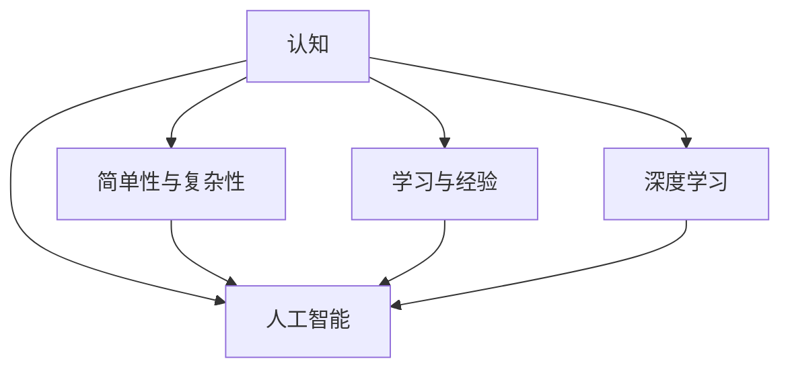

                 

# 认知发展中的简单与复杂

> 关键词：认知发展, 简单性与复杂性, 人工智能, 深度学习, 决策理论

## 1. 背景介绍

在探索人工智能(AI)的奥秘中，认知发展是一个充满挑战且极具吸引力的研究领域。认知过程是人类的核心能力，包括感知、记忆、思考、判断和行动等。认知科学旨在理解这些过程的机制，并构建能够模拟人类认知功能的智能系统。在AI的发展历程中，从早期的符号逻辑推理，到后来的统计机器学习，再到当前的深度学习，我们逐渐走向了对认知过程的模拟和优化。然而，这并不是一条平坦的道路，因为认知的复杂性使得简单与复杂的平衡成为一个重要的研究课题。

### 1.1 认知的简单性与复杂性

人类认知的简单性体现在许多方面。例如，我们能够快速识别和理解熟悉的图像和语言，这是因为我们在幼年时期已经通过大量实践建立了相应的认知模型。这些模型是高度抽象的，使得我们可以轻松地处理新的情境和问题。然而，这种简单性同时伴随着复杂性，因为认知过程涉及到许多相互关联的组件和机制，如感知、记忆、思考和决策等。这些组件之间的交互关系极其复杂，难以用简单的模型来解释。

### 1.2 认知发展的重要性

理解认知过程对于构建智能系统至关重要。认知发展理论告诉我们，认知是逐渐发展的，而不是一蹴而就的。这意味着，从儿童到成人的过程中，我们的认知能力逐步提高，能够更好地理解和处理复杂的信息。这一过程可以通过学习和实践来实现，从而提高我们的认知能力。同样，这一原理也可以应用于人工智能，通过不断的学习和实践，使AI系统能够逐步提高其认知能力。

### 1.3 认知科学和人工智能的关系

认知科学和人工智能之间的关系密切。认知科学研究人类认知的机制和过程，而人工智能则试图模拟这些机制和过程。认知科学提供了丰富的理论基础和研究方法，帮助我们理解人类认知的复杂性，而人工智能则通过技术的创新和实践，探索如何构建具有认知能力的智能系统。两者相互促进，共同推动了AI的发展。

## 2. 核心概念与联系

### 2.1 核心概念概述

为了深入探讨认知发展的简单性与复杂性，我们需要理解几个核心概念及其相互关系：

- **认知**：包括感知、记忆、思考、判断和行动等过程。
- **简单性与复杂性**：在认知过程中，简单性指认知模型能够处理的信息量和类型，复杂性指认知模型的抽象程度和内部结构。
- **学习与经验**：通过学习和经验，认知模型可以逐渐提高其处理能力，适应新的情境和问题。
- **人工智能**：模拟人类认知过程的智能系统，目标是实现自主的感知、思考和行动。
- **深度学习**：一种利用多层神经网络进行特征学习和模式识别的方法，被广泛应用于认知建模和AI应用中。

### 2.2 核心概念间的联系

这些核心概念之间的关系可以通过以下Mermaid流程图来展示：



这个流程图展示了认知、简单性与复杂性、学习与经验、人工智能和深度学习之间的联系。认知过程的简单性与复杂性相互影响，简单性表示认知模型可以处理的信息量和类型，复杂性表示模型的抽象程度和内部结构。通过学习和经验，认知模型可以逐渐提高其处理能力，适应新的情境和问题。深度学习是实现这种学习的一个重要技术手段，通过多层神经网络模拟认知模型，实现特征提取和模式识别。最终，这种认知能力通过人工智能实现，使智能系统具备自主的感知、思考和行动能力。

## 3. 核心算法原理 & 具体操作步骤

### 3.1 算法原理概述

在AI中，认知发展的简单性与复杂性平衡是一个关键问题。深度学习技术通过多层神经网络的堆叠，可以模拟认知模型中的复杂结构。然而，这种复杂性可能会使模型难以理解和调试，因此需要设计简单的模型结构和算法，以便更好地解释和优化。

### 3.2 算法步骤详解

深度学习模型的训练通常包括以下步骤：

1. **数据准备**：收集和预处理训练数据，将其转换为神经网络可以处理的形式。
2. **模型设计**：选择合适的神经网络结构和参数，进行初始化。
3. **训练**：通过反向传播算法更新模型参数，最小化损失函数。
4. **验证与测试**：在验证集上评估模型性能，进行超参数调整。
5. **部署与优化**：将模型部署到实际应用中，并进行持续优化和维护。

### 3.3 算法优缺点

深度学习在处理复杂认知任务方面表现出色的同时，也存在一些问题：

- **优点**：
  - 强大的特征学习能力，能够自动从数据中提取高层次的抽象特征。
  - 灵活性高，适用于各种认知任务。
  - 模型的可解释性逐渐提高，通过注意力机制等技术，可以一定程度上解释模型的决策过程。

- **缺点**：
  - 模型复杂度高，难以理解和调试。
  - 训练数据需求量大，获取高质量数据成本高。
  - 模型易过拟合，需要精心设计损失函数和正则化技术。
  - 可解释性不足，难以解释复杂决策过程。

### 3.4 算法应用领域

深度学习在多个领域中得到了广泛应用，例如：

- **图像识别**：通过卷积神经网络(CNN)对图像进行特征提取和分类。
- **自然语言处理**：通过循环神经网络(RNN)、注意力机制等技术实现语言建模和生成。
- **语音识别**：通过卷积神经网络和循环神经网络结合的架构进行声学建模和语言建模。
- **医疗诊断**：通过卷积神经网络和全连接网络结合的架构进行医学影像分析和病理诊断。
- **推荐系统**：通过深度学习模型对用户行为进行建模，推荐个性化内容。

## 4. 数学模型和公式 & 详细讲解 & 举例说明

### 4.1 数学模型构建

深度学习模型的训练通常基于以下数学模型：

- **输入层**：表示输入数据的特征向量，如像素值、文本序列等。
- **隐藏层**：通过多层神经网络进行特征提取和抽象，生成高层次的特征表示。
- **输出层**：根据任务类型选择合适的输出，如分类、回归等。

### 4.2 公式推导过程

以分类任务为例，深度学习模型的目标是最小化损失函数：

$$
L(\theta) = -\frac{1}{N}\sum_{i=1}^N \log p(y_i|x_i; \theta)
$$

其中，$y_i$ 表示输入 $x_i$ 的真实标签，$p(y_i|x_i; \theta)$ 表示模型在参数 $\theta$ 下的预测概率分布。常用的损失函数包括交叉熵损失和均方误差损失等。

### 4.3 案例分析与讲解

以图像分类为例，卷积神经网络(CNN)通过对图像进行卷积和池化操作，提取局部特征，再通过全连接层进行分类。CNN模型的结构和参数设计直接影响其性能。例如，VGG网络通过增加卷积层和池化层的深度和宽度，提高了模型的分类能力，但同时也增加了计算复杂度和训练时间。

## 5. 项目实践：代码实例和详细解释说明

### 5.1 开发环境搭建

在开始深度学习项目之前，需要配置好开发环境：

1. **安装Python**：使用Anaconda或Miniconda，安装最新的Python版本。
2. **安装深度学习框架**：选择TensorFlow或PyTorch，使用pip或conda安装。
3. **安装其他工具**：安装NumPy、Pandas、Scikit-learn、Matplotlib等工具，以便数据处理和可视化。
4. **配置GPU加速**：如果条件允许，安装NVIDIA GPU驱动程序和CUDA Toolkit，使用CUDNN加速计算。

### 5.2 源代码详细实现

以下是一个简单的图像分类项目，使用TensorFlow实现：

```python
import tensorflow as tf
from tensorflow.keras import layers, models

# 定义卷积神经网络模型
model = models.Sequential([
    layers.Conv2D(32, (3, 3), activation='relu', input_shape=(28, 28, 1)),
    layers.MaxPooling2D((2, 2)),
    layers.Conv2D(64, (3, 3), activation='relu'),
    layers.MaxPooling2D((2, 2)),
    layers.Flatten(),
    layers.Dense(64, activation='relu'),
    layers.Dense(10, activation='softmax')
])

# 编译模型
model.compile(optimizer='adam',
              loss='sparse_categorical_crossentropy',
              metrics=['accuracy'])

# 训练模型
model.fit(train_images, train_labels, epochs=10, validation_data=(val_images, val_labels))
```

### 5.3 代码解读与分析

上述代码实现了一个简单的卷积神经网络模型，用于手写数字的分类任务。模型由卷积层、池化层、全连接层等组成，使用交叉熵损失和准确率进行评估。在训练过程中，模型通过反向传播算法更新参数，最小化损失函数。

## 6. 实际应用场景

### 6.1 图像识别

深度学习在图像识别领域表现出色，通过卷积神经网络对图像进行特征提取和分类，广泛应用于医学影像分析、自动驾驶、安防监控等场景。

### 6.2 自然语言处理

深度学习在自然语言处理中也有广泛应用，通过循环神经网络和注意力机制，实现语言建模和生成。例如，BERT模型在命名实体识别、情感分析、问答系统等任务上取得了显著效果。

### 6.3 语音识别

深度学习在语音识别中主要应用于声学建模和语言建模。通过卷积神经网络和循环神经网络结合的架构，可以实现高质量的语音识别。

### 6.4 医疗诊断

深度学习在医疗诊断中主要应用于医学影像分析和病理诊断。通过卷积神经网络和全连接网络结合的架构，可以实现自动化的医学影像分析，辅助医生进行诊断。

## 7. 工具和资源推荐

### 7.1 学习资源推荐

为了帮助开发者系统掌握深度学习的原理和应用，以下是一些优质的学习资源：

1. **《深度学习》课程**：斯坦福大学提供的Coursera课程，涵盖深度学习的基本原理和应用，适合初学者。
2. **《动手学深度学习》书籍**：北京大学提供的在线教材，详细介绍了深度学习的数学基础和实践技巧。
3. **PyTorch官方文档**：PyTorch官方提供的文档和教程，涵盖深度学习模型的设计、训练和优化。
4. **TensorFlow官方文档**：TensorFlow官方提供的文档和教程，涵盖深度学习模型的设计、训练和优化。
5. **arXiv预印本**：深度学习领域最新研究成果的发布平台，包含大量未发表的论文和代码。

### 7.2 开发工具推荐

深度学习模型的开发离不开优秀的工具支持，以下是一些推荐的开发工具：

1. **PyTorch**：由Facebook开发的深度学习框架，支持动态计算图和GPU加速。
2. **TensorFlow**：由Google开发的深度学习框架，支持静态计算图和GPU加速。
3. **Jupyter Notebook**：交互式开发环境，支持Python代码的编写和执行。
4. **Google Colab**：谷歌提供的在线Jupyter Notebook环境，免费提供GPU和TPU资源。
5. **Keras**：基于TensorFlow和Theano的高级API，适合快速原型开发。

### 7.3 相关论文推荐

深度学习的发展离不开学界的持续研究，以下是几篇奠基性的相关论文：

1. **ImageNet Classification with Deep Convolutional Neural Networks**：AlexNet论文，展示了深度卷积神经网络在图像分类任务上的强大能力。
2. **Very Deep Convolutional Networks for Large-Scale Image Recognition**：VGG论文，详细介绍了VGG网络的设计和性能。
3. **Deep Residual Learning for Image Recognition**：ResNet论文，提出了残差网络结构，解决了深度网络训练中的梯度消失问题。
4. **Attention is All You Need**：Transformer论文，提出了自注意力机制，开启了Transformer网络的革命。
5. **BERT: Pre-training of Deep Bidirectional Transformers for Language Understanding**：BERT论文，展示了预训练语言模型在自然语言处理任务上的巨大潜力。

## 8. 总结：未来发展趋势与挑战

### 8.1 总结

本文对认知发展中的简单性与复杂性进行了详细探讨，通过深度学习技术展示了认知建模的潜力。深度学习在处理复杂认知任务方面表现出色的同时，也面临着计算资源、训练数据和模型复杂度等挑战。未来的研究需要在简化模型结构、提高模型可解释性、优化训练过程等方面寻求新的突破。

### 8.2 未来发展趋势

深度学习技术在未来将继续发展，以下是一些可能的发展趋势：

1. **模型的简化**：通过更加简单和模块化的架构设计，提高模型的可解释性和鲁棒性。
2. **数据的高效利用**：通过数据增强、迁移学习和自监督学习等技术，减少对训练数据的依赖。
3. **算法的优化**：通过优化反向传播算法、正则化技术和模型压缩技术，提高训练和推理效率。
4. **模型的泛化**：通过多任务学习和元学习等技术，提高模型的泛化能力和迁移能力。
5. **模型的可解释性**：通过注意力机制、知识蒸馏等技术，提高模型的可解释性和可理解性。

### 8.3 面临的挑战

尽管深度学习技术在认知建模中取得了显著成果，但仍面临一些挑战：

1. **计算资源的限制**：大模型需要大量的计算资源进行训练和推理，如何提高模型效率是一个重要问题。
2. **训练数据的获取**：高质量的训练数据往往难以获得，如何通过数据增强和迁移学习技术优化训练数据是一个重要研究方向。
3. **模型的可解释性**：深度学习模型通常是黑盒模型，难以解释其内部工作机制和决策过程。
4. **模型的鲁棒性**：深度学习模型易受对抗样本攻击，如何在保持模型性能的同时提高其鲁棒性是一个重要问题。
5. **模型的公平性**：深度学习模型可能会产生数据偏见，如何在设计模型时考虑公平性问题是一个重要研究方向。

### 8.4 研究展望

未来的研究需要在以下几个方面寻求新的突破：

1. **简化模型的设计**：通过更加模块化和可解释的模型架构，提高模型的鲁棒性和公平性。
2. **优化训练过程**：通过优化反向传播算法、正则化技术和模型压缩技术，提高模型的训练和推理效率。
3. **增强泛化能力**：通过多任务学习和元学习技术，提高模型的泛化能力和迁移能力。
4. **提高可解释性**：通过注意力机制、知识蒸馏等技术，提高模型的可解释性和可理解性。
5. **确保公平性**：通过公平性分析和对抗样本生成技术，提高模型的公平性和鲁棒性。

## 9. 附录：常见问题与解答

### 常见问题解答

**Q1：什么是深度学习？**

A: 深度学习是一种基于多层神经网络的机器学习技术，能够自动从数据中提取高层次的抽象特征，广泛应用于图像识别、自然语言处理、语音识别等领域。

**Q2：深度学习模型如何处理复杂认知任务？**

A: 深度学习模型通过多层神经网络的堆叠，能够自动从数据中提取高层次的抽象特征，处理复杂认知任务。例如，卷积神经网络可以处理图像识别任务，循环神经网络可以处理自然语言处理任务。

**Q3：深度学习模型的训练过程如何进行？**

A: 深度学习模型的训练过程包括数据准备、模型设计、训练、验证和测试等步骤。通过反向传播算法更新模型参数，最小化损失函数，评估模型性能。

**Q4：深度学习模型在实际应用中面临哪些挑战？**

A: 深度学习模型在实际应用中面临计算资源限制、训练数据获取困难、模型可解释性不足、模型鲁棒性差和模型公平性问题等挑战。

**Q5：如何提高深度学习模型的可解释性？**

A: 可以通过注意力机制、知识蒸馏等技术，提高模型的可解释性和可理解性。

---

作者：禅与计算机程序设计艺术 / Zen and the Art of Computer Programming

