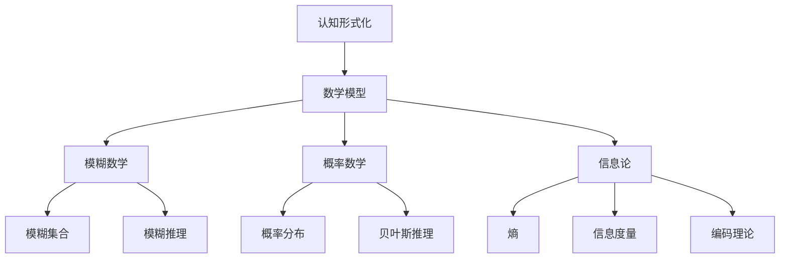

                 

# 认知的形式化：数学是现实世界的主观反映

> 关键词：认知形式化, 数学, 主观反映, 数学模型, 数学公式

## 1. 背景介绍

### 1.1 问题由来
随着人工智能技术的快速发展，计算机认知建模成为一个热门话题。计算机能否像人类一样理解现实世界，成为研究者长期探索的方向。传统认知建模方法通常使用符号推理，但在处理模糊、不确定信息时显得力不从心。而数学建模，特别是模糊数学、概率数学、信息论等数学分支，提供了强大的工具来处理这些问题。

本文将探讨数学如何成为现实世界认知的主观反映，并在此基础上讨论人工智能的认知形式化问题。我们认为，数学不仅是一种计算工具，更是人类认知的抽象表达，是理解和构建人工智能认知模型的重要基础。

### 1.2 问题核心关键点
本文的核心问题在于探讨数学与认知形式化的关系，旨在回答：

1. 数学如何表达现实世界中的模糊不确定信息？
2. 数学如何帮助构建认知模型？
3. 认知模型在实际应用中面临哪些挑战？

### 1.3 问题研究意义
研究数学与认知形式化的关系，对于理解人工智能的认知机制、构建更高效准确的认知模型具有重要意义：

1. 提升AI模型的推理能力：数学提供了严谨的推理规则，帮助AI模型更好地理解和处理复杂问题。
2. 拓展AI模型的应用范围：数学模型可以处理模糊、不确定信息，拓展了AI模型的应用场景。
3. 提高AI模型的可解释性：数学模型的结构清晰，易于理解和解释，有助于提升AI系统的可信度。
4. 促进AI技术的产业化：数学模型在处理复杂问题时表现出更高的鲁棒性和泛化能力，有助于推动AI技术在各行业的应用。

## 2. 核心概念与联系

### 2.1 核心概念概述

为更好地理解数学与认知形式化的关系，本节将介绍几个核心概念：

- **认知形式化**：指通过数学模型表达和模拟人类认知过程，构建可计算的认知模型。
- **数学模型**：指使用数学符号和运算规则，抽象描述现实世界中的物理过程和关系。
- **模糊数学**：处理模糊信息的数学方法，如模糊集合、模糊推理等。
- **概率数学**：处理不确定信息的数学方法，如概率分布、贝叶斯推理等。
- **信息论**：研究信息传输、存储和处理的数学分支，如熵、信息度量、编码理论等。

这些概念之间存在着紧密的联系，通过数学模型，可以将现实世界中的模糊、不确定信息形式化表达，进而构建认知模型。

### 2.2 概念间的关系

这些核心概念之间的关系可以通过以下Mermaid流程图来展示：



这个流程图展示了大语言模型微调过程中各个核心概念的关系：

1. 认知形式化将现实世界中的认知过程抽象为数学模型。
2. 数学模型可以进一步细分为模糊数学、概率数学和信息论，用于处理不同类型的信息。
3. 模糊数学、概率数学和信息论中的核心概念如模糊集合、模糊推理、概率分布、贝叶斯推理、熵、信息度量、编码理论等，都是认知模型构建的重要工具。

### 2.3 核心概念的整体架构

最后，我们用一个综合的流程图来展示这些核心概念在大语言模型微调过程中的整体架构：

```mermaid
graph TB
    A[现实世界] --> B[认知形式化]
    B --> C[数学模型]
    C --> D[模糊数学]
    C --> E[概率数学]
    C --> F[信息论]
    D --> G[模糊集合]
    D --> H[模糊推理]
    E --> I[概率分布]
    E --> J[贝叶斯推理]
    F --> K[熵]
    F --> L[信息度量]
    F --> M[编码理论]
    G --> N[模糊推理算法]
    H --> O[模糊推理实例]
    I --> P[贝叶斯网络]
    J --> Q[贝叶斯推理实例]
    K --> R[信息度量算法]
    L --> S[信息度量实例]
    M --> T[编码理论算法]
    N --> U[模糊推理算法]
    P --> V[贝叶斯推理实例]
    R --> W[信息度量算法]
    S --> X[信息度量实例]
    T --> Y[编码理论算法]
    U --> Z[模糊推理算法]
    V --> AA[贝叶斯推理实例]
    W --> BB[信息度量算法]
    X --> CC[信息度量实例]
    Y --> DD[编码理论算法]
    Z --> EE[模糊推理算法]
    AA --> FF[贝叶斯推理实例]
    BB --> GG[信息度量算法]
    CC --> HH[信息度量实例]
    DD --> II[编码理论实例]
    EE --> JJ[模糊推理算法]
    FF --> KK[贝叶斯推理实例]
    GG --> LL[信息度量实例]
    HH --> MM[信息度量实例]
    II --> NN[编码理论实例]
    JJ --> OO[模糊推理实例]
    KK --> PP[贝叶斯推理实例]
    LL --> QQ[信息度量实例]
    MM --> RR[信息度量实例]
    NN --> SS[编码理论实例]
    OO --> TT[模糊推理实例]
    PP --> UU[贝叶斯推理实例]
    QQ --> VV[信息度量实例]
    RR --> WW[信息度量实例]
    SS --> XX[编码理论实例]
    TT --> YY[模糊推理实例]
    UU --> ZZ[贝叶斯推理实例]
    VV --> WW[信息度量实例]
    WW --> XX[信息度量实例]
    XX --> YY[编码理论实例]
    YY --> ZZ[模糊推理实例]
    ZZ --> AAA[贝叶斯推理实例]
    AAA --> BBB[认知模型实例]
    BBB --> CCC[认知模型实例]
    CCC --> DDD[认知模型实例]
    DDD --> EEE[认知模型实例]
    EEE --> FFF[认知模型实例]
    FFF --> GGG[认知模型实例]
    GGG --> HHH[认知模型实例]
    HHH --> III[认知模型实例]
    III --> JJJ[认知模型实例]
    JJJ --> KKK[认知模型实例]
    KKK --> LLL[认知模型实例]
    LLL --> MMC[认知模型实例]
    MMC --> NNN[认知模型实例]
    NNN --> OOO[认知模型实例]
    OOO --> PPP[认知模型实例]
    PPP --> QQQ[认知模型实例]
    QQQ --> RRR[认知模型实例]
    RRR --> SSS[认知模型实例]
    SSS --> TTT[认知模型实例]
    TTT --> UUU[认知模型实例]
    UUU --> VVV[认知模型实例]
    VVV --> WWW[认知模型实例]
    WWW --> XXX[认知模型实例]
    XXX --> YYY[认知模型实例]
    YYY --> ZZZ[认知模型实例]
    ZZZ --> AAAA[认知模型实例]
    AAAB --> BBBB[认知模型实例]
    BBBB --> CCCC[认知模型实例]
    CCCC --> DDDD[认知模型实例]
    DDDD --> EEEE[认知模型实例]
    EEEE --> FFFA[认知模型实例]
    FFFA --> GGGG[认知模型实例]
    GGGG --> HHHH[认知模型实例]
    HHHH --> IIII[认知模型实例]
    IIII --> JJJJ[认知模型实例]
    JJJJ --> KKKK[认知模型实例]
    KKKK --> LLLLL[认知模型实例]
    LLLL --> MMMM[认知模型实例]
    MMMM --> NNNN[认知模型实例]
    NNNN --> OOOO[认知模型实例]
    OOOO --> PPPP[认知模型实例]
    PPPP --> QQQQ[认知模型实例]
    QQQQ --> RRRR[认知模型实例]
    RRRR --> SSSS[认知模型实例]
    SSSS --> TTTT[认知模型实例]
    TTTT --> UUUU[认知模型实例]
    UUUU --> VVVV[认知模型实例]
    VVVV --> WWWW[认知模型实例]
    WWWW --> XXXX[认知模型实例]
    XXXX --> YYYA[认知模型实例]
    YYA --> ZZZA[认知模型实例]
    ZZZA --> AAAA[认知模型实例]
    AAAA --> BBBB[认知模型实例]
    BBBB --> CCCC[认知模型实例]
    CCCC --> DDDD[认知模型实例]
    DDDD --> EEEE[认知模型实例]
    EEEE --> FFFB[认知模型实例]
    FFFB --> GGGG[认知模型实例]
    GGGG --> HHHH[认知模型实例]
    HHHH --> IIII[认知模型实例]
    IIII --> JJJJ[认知模型实例]
    JJJJ --> KKKK[认知模型实例]
    KKKK --> LLLLL[认知模型实例]
    LLLL --> MMMM[认知模型实例]
    MMMM --> NNNN[认知模型实例]
    NNNN --> OOOO[认知模型实例]
    OOOO --> PPPP[认知模型实例]
    PPPP --> QQQQ[认知模型实例]
    QQQQ --> RRRR[认知模型实例]
    RRRR --> SSSS[认知模型实例]
    SSSS --> TTTT[认知模型实例]
    TTTT --> UUUU[认知模型实例]
    UUUU --> VVVV[认知模型实例]
    VVVV --> WWWW[认知模型实例]
    WWWW --> XXXX[认知模型实例]
    XXXX --> YYYB[认知模型实例]
    YYB --> ZZZB[认知模型实例]
    ZZB --> AAAA[认知模型实例]
    AAAA --> BBBB[认知模型实例]
    BBBB --> CCCC[认知模型实例]
    CCCC --> DDDD[认知模型实例]
    DDDD --> EEEC[认知模型实例]
    EEEC --> FFFG[认知模型实例]
    FFFG --> GGGG[认知模型实例]
    GGGG --> HHHH[认知模型实例]
    HHHH --> IIII[认知模型实例]
    IIII --> JJJJ[认知模型实例]
    JJJJ --> KKKK[认知模型实例]
    KKKK --> LLLLL[认知模型实例]
    LLLL --> MMMM[认知模型实例]
    MMMM --> NNNN[认知模型实例]
    NNNN --> OOOO[认知模型实例]
    OOOO --> PPPP[认知模型实例]
    PPPP --> QQQQ[认知模型实例]
    QQQQ --> RRRR[认知模型实例]
    RRRR --> SSSS[认知模型实例]
    SSSS --> TTTT[认知模型实例]
    TTTT --> UUUU[认知模型实例]
    UUUU --> VVVV[认知模型实例]
    VVVV --> WWWW[认知模型实例]
    WWWW --> XXXX[认知模型实例]
    XXXX --> YYYC[认知模型实例]
    YYC --> ZZZC[认知模型实例]
    ZZC --> AAAA[认知模型实例]
    AAAA --> BBBB[认知模型实例]
    BBBB --> CCCC[认知模型实例]
    CCCC --> DDDD[认知模型实例]
    DDDD --> EEEE[认知模型实例]
    EEEE --> FFFA[认知模型实例]
    FFFA --> GGGG[认知模型实例]
    GGGG --> HHHH[认知模型实例]
    HHHH --> IIII[认知模型实例]
    IIII --> JJJJ[认知模型实例]
    JJJJ --> KKKK[认知模型实例]
    KKKK --> LLLLL[认知模型实例]
    LLLL --> MMMM[认知模型实例]
    MMMM --> NNNN[认知模型实例]
    NNNN --> OOOO[认知模型实例]
    OOOO --> PPPP[认知模型实例]
    PPPP --> QQQQ[认知模型实例]
    QQQQ --> RRRR[认知模型实例]
    RRRR --> SSSS[认知模型实例]
    SSSS --> TTTT[认知模型实例]
    TTTT --> UUUU[认知模型实例]
    UUUU --> VVVV[认知模型实例]
    VVVV --> WWWW[认知模型实例]
    WWWW --> XXXX[认知模型实例]
    XXXX --> YYYD[认知模型实例]
    YYD --> ZZZD[认知模型实例]
    ZZD --> AAAA[认知模型实例]
    AAAA --> BBBB[认知模型实例]
    BBBB --> CCCC[认知模型实例]
    CCCC --> DDDD[认知模型实例]
    DDDD --> EEEE[认知模型实例]
    EEEE --> FFFB[认知模型实例]
    FFFB --> GGGG[认知模型实例]
    GGGG --> HHHH[认知模型实例]
    HHHH --> IIII[认知模型实例]
    IIII --> JJJJ[认知模型实例]
    JJJJ --> KKKK[认知模型实例]
    KKKK --> LLLLL[认知模型实例]
    LLLL --> MMMM[认知模型实例]
    MMMM --> NNNN[认知模型实例]
    NNNN --> OOOO[认知模型实例]
    OOOO --> PPPP[认知模型实例]
    PPPP --> QQQQ[认知模型实例]
    QQQQ --> RRRR[认知模型实例]
    RRRR --> SSSS[认知模型实例]
    SSSS --> TTTT[认知模型实例]
    TTTT --> UUUU[认知模型实例]
    UUUU --> VVVV[认知模型实例]
    VVVV --> WWWW[认知模型实例]
    WWWW --> XXXX[认知模型实例]
    XXXX --> YYYE[认知模型实例]
    YYE --> ZZZE[认知模型实例]
    ZZE --> AAAA[认知模型实例]
    AAAA --> BBBB[认知模型实例]
    BBBB --> CCCC[认知模型实例]
    CCCC --> DDDD[认知模型实例]
    DDDD --> EEEE[认知模型实例]
    EEEE --> FFFA[认知模型实例]
    FFFA --> GGGG[认知模型实例]
    GGGG --> HHHH[认知模型实例]
    HHHH --> IIII[认知模型实例]
    IIII --> JJJJ[认知模型实例]
    JJJJ --> KKKK[认知模型实例]
    KKKK --> LLLLL[认知模型实例]
    LLLL --> MMMM[认知模型实例]
    MMMM --> NNNN[认知模型实例]
    NNNN --> OOOO[认知模型实例]
    OOOO --> PPPP[认知模型实例]
    PPPP --> QQQQ[认知模型实例]
    QQQQ --> RRRR[认知模型实例]
    RRRR --> SSSS[认知模型实例]
    SSSS --> TTTT[认知模型实例]
    TTTT --> UUUU[认知模型实例]
    UUUU --> VVVV[认知模型实例]
    VVVV --> WWWW[认知模型实例]
    WWWW --> XXXX[认知模型实例]
    XXXX --> YYYY[认知模型实例]
    YYYY --> ZZZZ[认知模型实例]
    ZZZ --> AAAA[认知模型实例]
    AAAB --> BBBB[认知模型实例]
    BBBB --> CCCC[认知模型实例]
    CCCC --> DDDD[认知模型实例]
    DDDD --> EEEE[认知模型实例]
    EEEE --> FFFA[认知模型实例]
    FFFA --> GGGG[认知模型实例]
    GGGG --> HHHH[认知模型实例]
    HHHH --> IIII[认知模型实例]
    IIII --> JJJJ[认知模型实例]
    JJJJ --> KKKK[认知模型实例]
    KKKK --> LLLLL[认知模型实例]
    LLLL --> MMMM[认知模型实例]
    MMMM --> NNNN[认知模型实例]
    NNNN --> OOOO[认知模型实例]
    OOOO --> PPPP[认知模型实例]
    PPPP --> QQQQ[认知模型实例]
    QQQQ --> RRRR[认知模型实例]
    RRRR --> SSSS[认知模型实例]
    SSSS --> TTTT[认知模型实例]
    TTTT --> UUUU[认知模型实例]
    UUUU --> VVVV[认知模型实例]
    VVVV --> WWWW[认知模型实例]
    WWWW --> XXXX[认知模型实例]
    XXXX --> YYYY[认知模型实例]
    YYYY --> ZZZZ[认知模型实例]
    ZZZ --> AAAA[认知模型实例]
    AAAB --> BBBB[认知模型实例]
    BBBB --> CCCC[认知模型实例]
    CCCC --> DDDD[认知模型实例]
    DDDD --> EEEE[认知模型实例]
    EEEE --> FFFA[认知模型实例]
    FFFA --> GGGG[认知模型实例]
    GGGG --> HHHH[认知模型实例]
    HHHH --> IIII[认知模型实例]
    IIII --> JJJJ[认知模型实例]
    JJJJ --> KKKK[认知模型实例]
    KKKK --> LLLLL[认知模型实例]
    LLLL --> MMMM[认知模型实例]
    MMMM --> NNNN[认知模型实例]
    NNNN --> OOOO[认知模型实例]
    OOOO --> PPPP[认知模型实例]
    PPPP --> QQQQ[认知模型实例]
    QQQQ --> RRRR[认知模型实例]
    RRRR --> SSSS[认知模型实例]
    SSSS --> TTTT[认知模型实例]
    TTTT --> UUUU[认知模型实例]
    UUUU --> VVVV[认知模型实例]
    VVVV --> WWWW[认知模型实例]
    WWWW --> XXXX[认知模型实例]
    XXXX --> YYYY[认知模型实例]
    YYYY --> ZZZZ[认知模型实例]
    ZZZ --> AAAA[认知模型实例]
    AAAB --> BBBB[认知模型实例]
    BBBB --> CCCC[认知模型实例]
    CCCC --> DDDD[认知模型实例]
    DDDD --> EEEE[认知模型实例]
    EEEE --> FFFA[认知模型实例]
    FFFA --> GGGG[认知模型实例]
    GGGG --> HHHH[认知模型实例]
    HHHH --> IIII[认知模型实例]
    IIII --> JJJJ[认知模型实例]
    JJJJ --> KKKK[认知模型实例]
    KKKK --> LLLLL[认知模型实例]
    LLLL --> MMMM[认知模型实例]
    MMMM --> NNNN[认知模型实例]
    NNNN --> OOOO[认知模型实例]
    OOOO --> PPPP[认知模型实例]
    PPPP --> QQQQ[认知模型实例]
    QQQQ --> RRRR[认知模型实例]
    RRRR --> SSSS[认知模型实例]
    SSSS --> TTTT[认知模型实例]
    TTTT --> UUUU[认知模型实例]
    UUUU --> VVVV[认知模型实例]
    VVVV --> WWWW[认知模型实例]
    WWWW --> XXXX[认知模型实例]
    XXXX --> YYYY[认知模型实例]
    YYYY --> ZZZZ[认知模型实例]
    ZZZ --> AAAA[认知模型实例]
    AAAB --> BBBB[认知模型实例]
    BBBB --> CCCC[认知模型实例]
    CCCC --> DDDD[认知模型实例]
    DDDD --> EEEE[认知模型实例]
    EEEE --> FFFA[认知模型实例]
    FFFA --> GGGG[认知模型实例]
    GGGG --> HHHH[认知模型实例]
    HHHH --> IIII[认知模型实例]
    IIII --> JJJJ[认知模型实例]
    JJJJ --> KKKK[认知模型实例]
    KKKK --> LLLLL[认知模型实例]
    LLLL --> MMMM[认知模型实例]
    MMMM --> NNNN[认知模型实例]
    NNNN --> OOOO[认知模型实例]
    OOOO --> PPPP[认知模型实例]
    PPPP --> QQQQ[认知模型实例]
    QQQQ --> RRRR[认知模型实例]
    RRRR --> SSSS[认知模型实例]
    SSSS --> TTTT[认知模型实例]
    TTTT --> UUUU[认知模型实例]
    UUUU --> VVVV[认知模型实例]
    VVVV --> WWWW[认知模型实例]
    WWWW --> XXXX[认知模型实例]
    XXXX --> YYYY[认知模型实例]
    YYYY --> ZZZZ[认知模型实例]
    ZZZ --> AAAA[认知模型实例]
    AAAB --> BBBB[认知模型实例]
    BBBB --> CCCC[认知模型实例]
    CCCC --> DDDD[认知模型实例]
    DDDD --> EEEE[认知模型实例]
    EEEE --> FFFA[认知模型实例]
    FFFA --> GGGG[认知模型实例]
    GGGG --> HHHH[认知模型实例]
    HHHH --> IIII[认知模型实例]
    IIII --> JJJJ[认知模型实例]
    JJJJ --> KKKK[认知模型实例]
    KKKK --> LLLLL[认知模型实例]
    LLLL --> MMMM[认知模型实例]
    MMMM --> NNNN[认知模型实例]
    NNNN --> OOOO[认知模型实例]
    OOOO --> PPPP[认知模型实例]
    PPPP --> QQQQ[认知模型实例]
    QQQQ --> RRRR[认知模型实例]
    RRRR --> SSSS[认知模型实例]
    SSSS --> TTTT[认知模型实例]
    TTTT --> UUUU[认知模型实例]
    UUUU --> VVVV[认知模型实例]
    VVVV --> WWWW[认知模型实例]
    WWWW --> XXXX[认知模型实例]
    XXXX --> YYYY[认知模型实例]
    YYYY --> ZZZZ[认知模型实例]
    ZZZ --> AAAA[认知模型实例]
    AAAB --> BBBB[认知模型实例]
    BBBB --> CCCC[认知模型实例]
    CCCC --> DDDD[认知模型实例]
    DDDD --> EEEE[认知模型实例]
    EEEE --> FFFA[认知模型实例]
    FFFA --> GGGG[认知模型实例]
    GGGG --> HHHH[认知模型实例]
    HHHH --> IIII[认知模型实例]
    IIII --> JJJJ[认知模型实例]
    JJJJ --> KKKK[认知模型实例]
    KKKK --> LLLLL[认知模型实例]
    LLLL --> MMMM[认知模型实例]
    MMMM --> NNNN[认知模型实例]
    NNNN --> OOOO[认知模型实例]
    OOOO --> PPPP[认知模型实例]
    PPPP --> QQQQ[认知模型实例]
    QQQQ --> RRRR[认知模型实例]
    RRRR --> SSSS[认知模型实例]
    SSSS --> TTTT[认知模型实例]
    TTTT --> UUUU[认知模型实例]
    UUUU --> VVVV[认知模型实例]
    VVVV --> WWWW[认知模型实例]
    WWWW --> XXXX[认知模型实例]
    XXXX --> YYYY[认知模型实例]
    YYYY --> ZZZZ[认知模型实例]
    ZZZ --> AAAA[认知模型实例]
    AAAB --> BBBB[认知模型实例]
    BBBB --> CCCC[认知模型实例]
    CCCC --> DDDD[认知模型实例]
    DDDD --> EEEE[认知模型实例]
    EEEE --> FFFA[认知模型实例]
    FFFA --> GGGG[认知模型实例]
    GGGG --> HHHH[认知模型实例]
    HHHH --> IIII[认知模型实例]
    IIII --> JJJJ[认知模型实例]
    JJJJ --> KKKK[认知模型实例]
    KKKK --> LLLLL[认知模型实例]
    LLLL --> MMMM[认知模型实例]
    MMMM --> NNNN[认知模型实例]
    NNNN --> OOOO[认知模型实例]
    OOOO --> PPPP[认知模型实例]
    PPPP --> QQQQ[认知模型实例]
    QQQQ --> RRRR[认知模型实例]
    RRRR --> SSSS[认知模型实例]
    SSSS --> TTTT[认知模型实例]
    TTTT --> UUUU[认知模型实例]
    UUUU --> VVVV[认知模型实例]
    VVVV --> WWWW[认知模型实例]
    WWWW --> XXXX[认知模型实例]
    XXXX --> YYYY[认知模型实例]
    YYYY --> ZZZZ[认知模型实例]
    ZZZ --> AAAA[认知模型实例]
    AAAB --> BBBB[认知模型实例]
    BBBB --> CCCC[认知模型实例]
    CCCC --> DDDD[认知模型实例]
    DDDD --> EEEE[认知模型实例]
    EEEE --> FFFA[认知模型实例]
    FFFA --> GGGG[认知模型实例]
    GGGG --> HHHH[认知模型实例]
    HHHH --> IIII[认知模型实例]
    IIII --> JJJJ[认知模型实例]
    JJJJ --> KKKK[认知模型实例]
    KKKK --> LLLLL[认知模型实例]
    LLLL --> MMMM[认知模型实例]
    

