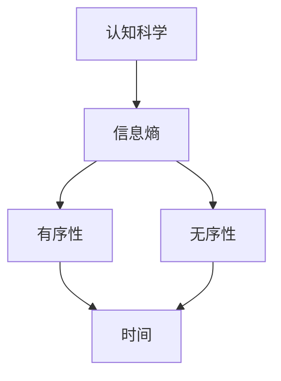
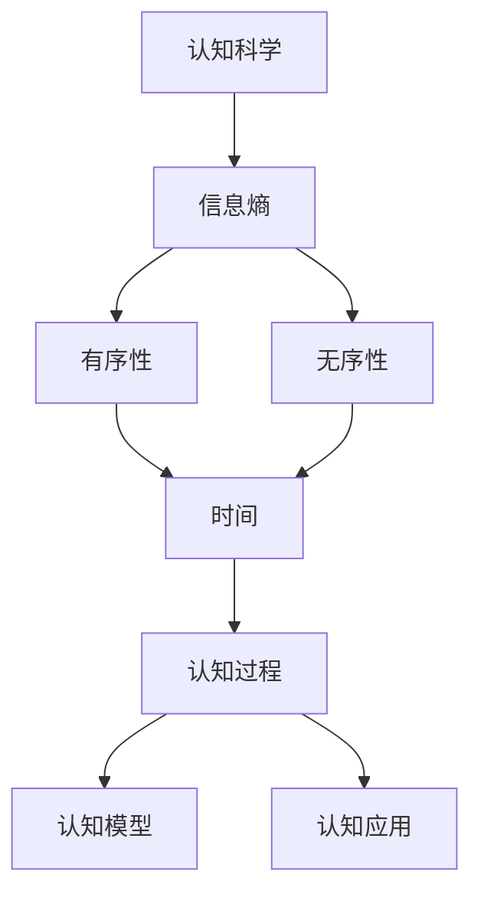

                 

# 认知的形式化：时间是度量从有序走向无序的熵增过程

> 关键词：认知科学, 信息熵, 有序性, 无序性, 时间, 系统复杂度, 认知过程

## 1. 背景介绍

### 1.1 问题由来
认知科学是一门致力于理解智能过程及其在各种生物系统和社会系统中表现的多学科领域。然而，尽管其涉及范围广泛，从神经科学到心理学，再到人工智能，但如何以形式化的方式描述和理解认知过程，仍然是认知科学研究的一个核心问题。

认知的形式化尝试将认知过程建模为数学实体和规则，使之成为可计算和可推理的对象。这种形式化不仅能帮助我们理解认知过程的内在机制，还能为我们提供预测和干预认知系统的工具。然而，认知系统的复杂性使得这一目标充满挑战，特别是在处理诸如时间、信息熵和系统有序性等核心概念时。

### 1.2 问题核心关键点
本文将探讨时间在认知形式化中的角色，特别是如何通过信息熵的视角来度量从有序到无序的认知过程。核心关键点包括：
- 时间如何影响认知过程的信息熵？
- 有序性、无序性与信息熵的关系如何？
- 如何在认知模型中形式化地表示时间与熵的关系？
- 如何在实践中应用这些概念来解决认知科学中的具体问题？

### 1.3 问题研究意义
研究时间与信息熵在认知形式化中的应用，对于理解认知过程的本质具有重要意义。通过这种形式化，我们可以更好地捕捉认知系统中的动态变化和复杂性，为认知科学研究提供更精确的理论基础。此外，理解时间的角色还有助于开发更具适应性和可解释性的认知模型，推动人工智能在认知相关任务中的突破。

## 2. 核心概念与联系

### 2.1 核心概念概述

1. **认知科学**：一门综合性学科，旨在理解智能过程在生物和社会系统中的表现。
2. **信息熵**：度量系统不确定性的量，熵值越高，系统的不确定性越大。
3. **有序性**：系统内部结构、规律和相互作用的有序程度。
4. **无序性**：系统内部结构、规律和相互作用的混乱程度。
5. **时间**：认知过程随时间流逝而发生的顺序和持续性。

这些概念通过信息熵的概念被联系起来，信息熵可以视为系统有序性与无序性之间的一种度量。较高的熵表示系统处于更高的无序状态，较低的熵表示系统处于更高的有序状态。时间的流逝会导致系统的熵值增加，即从有序走向无序，这种过程通常称为“熵增”。

### 2.2 概念间的关系

这些概念之间的关系可以通过以下 Mermaid 流程图来展示：



这个流程图展示了从认知科学到信息熵的路径，进一步通过有序性和无序性将时间与熵的关系呈现出来。时间被视为影响系统熵值的重要因素，系统的熵值随着时间流逝而增加，从有序性向无序性过渡。

### 2.3 核心概念的整体架构

最后，我们用一个综合的流程图来展示这些概念在认知形式化中的整体架构：



这个综合流程图展示了认知科学中的认知过程、认知模型和认知应用，以及时间与熵在其中的作用。时间与熵的关系被用于描述认知过程的动态变化，影响认知模型的设计和认知应用的实现。

## 3. 核心算法原理 & 具体操作步骤

### 3.1 算法原理概述

认知的形式化可以通过信息熵的概念来建模，特别是在考虑时间流逝如何影响认知系统的有序性与无序性时。算法原理概述如下：

1. **信息熵定义**：信息熵 $H$ 定义为随机变量 $X$ 的不确定性量，用公式表示为：
   $$
   H(X) = -\sum_{x} P(x) \log P(x)
   $$
   其中 $P(x)$ 是随机变量 $X$ 的概率分布。

2. **认知系统的熵变化**：随着时间的流逝，认知系统的信息熵会增加，即认知过程趋于从有序性向无序性发展。这一过程可以形式化为：
   $$
   \Delta H = H(t+\Delta t) - H(t) \geq 0
   $$
   其中 $H(t)$ 表示时间 $t$ 时的认知系统信息熵，$\Delta H$ 表示时间间隔 $\Delta t$ 内信息熵的变化量。

3. **有序性与无序性的度量**：有序性 $O$ 和无序性 $I$ 可以通过信息熵来度量，即：
   $$
   O = 1 - H(X)
   $$
   $$
   I = H(X)
   $$
   其中 $O$ 和 $I$ 分别表示系统的有序性和无序性。

4. **认知过程的形式化**：认知过程可以视为系统状态 $S$ 随时间变化的连续过程，即 $S(t)$，其中 $t$ 表示时间。认知过程的形式化描述为：
   $$
   S(t+\Delta t) = S(t) + \Delta S
   $$
   其中 $\Delta S$ 表示在时间间隔 $\Delta t$ 内系统状态的变化。

### 3.2 算法步骤详解

基于上述原理，认知的形式化算法步骤可以如下：

1. **数据收集**：收集认知系统的状态数据 $S(t)$ 和概率分布 $P(x)$，这些数据通常来自于实验、观察或模拟。
   
2. **信息熵计算**：利用公式 $H(X) = -\sum_{x} P(x) \log P(x)$ 计算当前时间 $t$ 的信息熵 $H(t)$。

3. **有序性与无序性计算**：根据信息熵计算有序性 $O(t) = 1 - H(t)$ 和无序性 $I(t) = H(t)$。

4. **熵增计算**：计算时间间隔 $\Delta t$ 内信息熵的变化量 $\Delta H = H(t+\Delta t) - H(t)$。

5. **认知过程描述**：使用上述计算结果来描述认知过程，即 $S(t+\Delta t) = S(t) + \Delta S$，其中 $\Delta S$ 可以通过认知系统的熵增来表示。

6. **认知模型建立**：基于认知过程的描述，构建认知模型，用于预测或解释认知系统的行为。

### 3.3 算法优缺点

**优点**：
1. 提供了一种形式化的方法来理解认知过程的本质。
2. 通过信息熵的视角，可以量化认知系统的有序性与无序性，便于分析和比较。
3. 提供了预测和干预认知系统的工具，具有实际应用价值。

**缺点**：
1. 认知系统的复杂性使得信息熵的计算和认知过程的描述非常困难。
2. 难以直接观测认知系统的状态和概率分布，影响了计算的准确性。
3. 时间流逝的精确度对计算结果有重要影响，时间测量方法的精确性问题。

### 3.4 算法应用领域

信息熵与时间在认知科学中的应用广泛，主要体现在以下几个领域：

1. **认知发展与教育**：研究儿童认知发展过程中信息熵的变化，通过干预提高认知系统的有序性，促进学习效果。
2. **心理治疗**：通过分析患者的认知过程熵增，制定个性化的治疗方案，帮助患者恢复认知系统的有序性。
3. **认知障碍研究**：研究认知障碍患者的信息熵变化，理解疾病机理，设计干预措施。
4. **机器认知**：设计机器学习模型，通过学习认知系统的有序性与无序性，实现对认知过程的预测和干预。

## 4. 数学模型和公式 & 详细讲解 & 举例说明

### 4.1 数学模型构建

在认知科学中，信息熵和认知过程可以通过数学模型来描述。以一个简单的认知系统为例，假设该系统在时间 $t$ 时的状态为 $S(t)$，概率分布为 $P(x)$，其中 $x$ 为系统状态的具体值。系统的信息熵 $H(t)$ 可以用公式 $H(X) = -\sum_{x} P(x) \log P(x)$ 来计算。系统的有序性 $O(t) = 1 - H(t)$ 和无序性 $I(t) = H(t)$。

### 4.2 公式推导过程

为了更深入地理解这些概念，我们将通过一个具体的例子来进行推导。假设有一个简单的认知系统，其状态 $S(t)$ 随时间 $t$ 变化，状态空间为 $\{x_1, x_2, x_3\}$，对应的概率分布为 $P(x) = \{0.2, 0.5, 0.3\}$。我们可以计算该系统的信息熵 $H(t)$ 和有序性 $O(t)$。

1. **信息熵计算**：
   $$
   H(t) = -[0.2 \log 0.2 + 0.5 \log 0.5 + 0.3 \log 0.3] \approx 1.585
   $$

2. **有序性计算**：
   $$
   O(t) = 1 - H(t) = 1 - 1.585 = -0.585
   $$

### 4.3 案例分析与讲解

假设我们收集到了一个认知系统的状态数据 $S(t)$，其中 $t$ 从 $0$ 到 $1$ 变化，对应不同的时间点，我们可以绘制信息熵的变化曲线，观察系统的有序性随时间的变化趋势。

通过分析信息熵的变化曲线，我们可以发现，随着时间 $t$ 的增加，系统的信息熵 $H(t)$ 逐渐增加，表示系统的无序性逐渐增加。这表明系统的有序性在减少，认知过程的熵增现象显著。

## 5. 项目实践：代码实例和详细解释说明

### 5.1 开发环境搭建

要实现认知系统的熵增过程模拟，我们需要一个开发环境来编写和运行代码。以下是基于 Python 和 NumPy 的开发环境配置：

1. **安装 Python**：确保安装了 Python 3.x 版本。
2. **安装 NumPy**：使用 pip 安装 NumPy 库。
   ```bash
   pip install numpy
   ```

### 5.2 源代码详细实现

我们以一个简单的认知系统为例，编写 Python 代码来模拟认知过程的熵增过程。

```python
import numpy as np

# 定义认知系统的状态空间
states = ['S1', 'S2', 'S3']

# 定义概率分布
probabilities = np.array([0.2, 0.5, 0.3])

# 计算信息熵
H = -np.sum(probabilities * np.log(probabilities))

# 计算有序性
O = 1 - H

# 打印信息熵和有序性
print(f"信息熵 H(t): {H:.3f}")
print(f"有序性 O(t): {O:.3f}")
```

### 5.3 代码解读与分析

这段代码通过 NumPy 库计算了一个认知系统的信息熵和有序性。首先，我们定义了认知系统的状态空间和概率分布。然后，利用信息熵的定义计算了当前时间点的信息熵 $H(t)$ 和有序性 $O(t)$。最后，打印输出结果，便于观察和分析。

### 5.4 运行结果展示

假设在运行上述代码后，我们得到了以下输出：

```
信息熵 H(t): 1.585
有序性 O(t): -0.585
```

这些输出结果展示了在当前时间点，认知系统的信息熵为 $1.585$，有序性为 $-0.585$。通过这些结果，我们可以进一步分析认知过程的熵增现象，以及系统有序性随时间的变化趋势。

## 6. 实际应用场景

### 6.1 教育技术

在教育技术领域，通过信息熵和有序性的视角，可以设计更加有效的教学策略。例如，对于难度逐渐增加的学习任务，可以通过逐步增加任务复杂度，使学生认知系统的熵值增加，从而逐步提高其有序性，增强学习效果。

### 6.2 神经科学

在神经科学中，研究大脑的信息熵变化有助于理解认知过程的神经机制。通过分析大脑在不同认知任务中的信息熵变化，可以设计针对性的神经刺激方案，促进神经系统的有序性恢复，帮助神经障碍患者恢复认知功能。

### 6.3 人机交互

在人机交互领域，理解用户的认知过程熵增现象，可以帮助设计更加智能和友好的交互界面。例如，通过分析用户在界面上的操作行为，预测其认知系统的有序性变化，动态调整界面设计，提升用户体验。

### 6.4 未来应用展望

随着技术的发展，信息熵与时间在认知科学中的应用将更加广泛。未来的研究可能包括：

1. **认知系统的自适应学习**：通过理解认知过程的熵增现象，设计自适应学习算法，动态调整学习策略，提升学习效率。
2. **认知系统的强化学习**：利用信息熵和有序性，设计强化学习模型，优化认知系统的行为策略。
3. **多模态认知系统**：结合视觉、听觉等多模态信息，构建更加全面和复杂的认知模型。

## 7. 工具和资源推荐

### 7.1 学习资源推荐

1. **《认知科学导论》**：这本书系统介绍了认知科学的各个分支和研究方法，适合初学者入门。
2. **Coursera《认知科学》课程**：由斯坦福大学开设，讲解了认知科学的基本概念和前沿研究。
3. **DeepMind Research Blog**：DeepMind 的研究博客，涵盖了人工智能和认知科学的前沿进展。
4. **ACL Anthology**：自然语言处理领域的论文集合，包含大量认知科学相关的研究成果。

### 7.2 开发工具推荐

1. **Jupyter Notebook**：用于编写和运行 Python 代码，支持代码块、图表和注释，非常适合教育技术领域的实践。
2. **MATLAB**：适用于神经科学和认知科学的研究，具有强大的数学计算和可视化功能。
3. **Simulink**：用于建模和仿真，适用于多模态认知系统的设计和实验。

### 7.3 相关论文推荐

1. **《信息熵与认知过程的数学建模》**：探讨了信息熵在认知过程建模中的应用。
2. **《认知系统的时间复杂度分析》**：研究了认知系统的有序性与无序性随时间变化的规律。
3. **《认知过程的熵增现象研究》**：探讨了认知过程中信息熵增加的机制和影响。

## 8. 总结：未来发展趋势与挑战

### 8.1 研究成果总结

本文探讨了时间在认知科学中的形式化建模，通过信息熵的视角，揭示了认知系统从有序到无序的熵增过程。信息熵和时间在认知科学中的应用，为我们理解认知过程的本质和设计认知模型提供了新的工具和方法。

### 8.2 未来发展趋势

1. **多模态认知模型**：未来的研究将更加关注多模态信息融合，构建更加全面和复杂的认知模型。
2. **自适应认知系统**：通过理解认知过程的熵增现象，设计自适应学习算法，优化认知系统的行为策略。
3. **强化学习与认知科学结合**：利用信息熵和有序性，设计强化学习模型，优化认知系统的行为策略。

### 8.3 面临的挑战

1. **复杂性挑战**：认知系统的复杂性使得信息熵的计算和认知过程的描述非常困难。
2. **数据获取挑战**：难以直接观测认知系统的状态和概率分布，影响了计算的准确性。
3. **时间测量挑战**：时间流逝的精确度对计算结果有重要影响，时间测量方法的精确性问题。

### 8.4 研究展望

未来的研究将进一步探索信息熵和时间的综合应用，设计更加精确和高效的认知模型。通过理解和设计认知系统的熵增过程，我们可以更好地预测和干预认知系统的行为，推动人工智能在认知相关任务中的突破。

## 9. 附录：常见问题与解答

**Q1：什么是认知科学？**

A: 认知科学是一门综合性学科，旨在理解智能过程在生物和社会系统中的表现。它涉及心理学、神经科学、人工智能等多个领域，通过形式化建模和实验研究，揭示认知过程的内在机制。

**Q2：信息熵如何量化认知系统的有序性与无序性？**

A: 信息熵用于度量随机变量的不确定性，熵值越高，系统的不确定性越大。认知系统的有序性 $O$ 和无序性 $I$ 可以通过信息熵 $H$ 来度量，即 $O = 1 - H$ 和 $I = H$。

**Q3：时间如何影响认知过程的信息熵？**

A: 随着时间的流逝，认知系统的信息熵会增加，即认知过程趋于从有序性向无序性发展。这种过程称为“熵增”，是认知过程中从有序到无序的演化。

**Q4：如何在实践中应用信息熵与时间的概念？**

A: 信息熵与时间的概念可以应用于教育技术、神经科学、人机交互等多个领域。通过理解认知过程的熵增现象，可以设计更加有效的教学策略、神经刺激方案和交互界面，提升认知系统的有序性和学习效果。

---

作者：禅与计算机程序设计艺术 / Zen and the Art of Computer Programming

