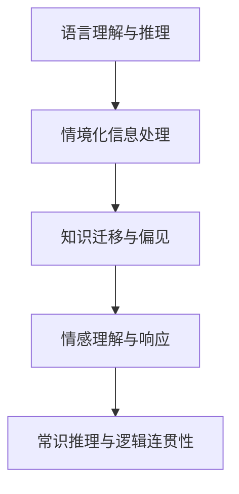
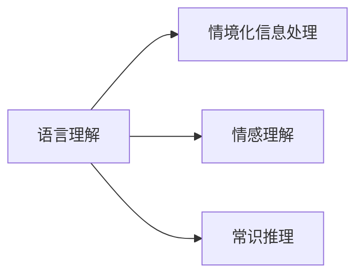
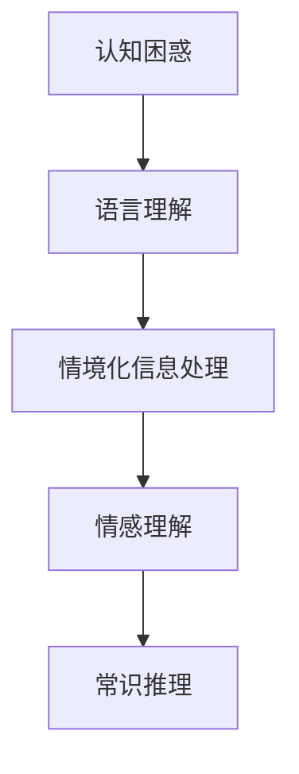
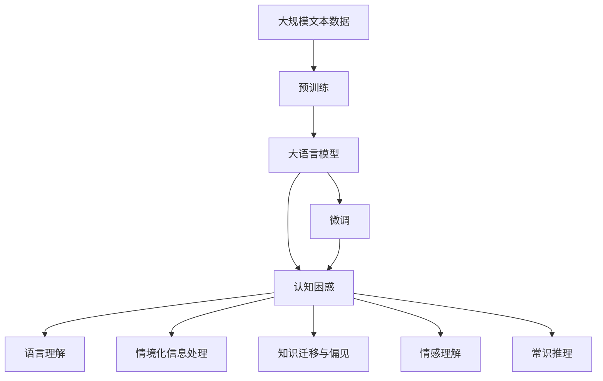

                 

# 语言与思维的差异：大模型的认知困惑

> 关键词：语言理解,大模型,认知过程,思维模型,计算能力

## 1. 背景介绍

### 1.1 问题由来
近年来，人工智能技术取得了显著进展，尤其是基于深度学习的大语言模型在自然语言处理（NLP）领域取得了突破性成果。然而，大模型在语言与思维差异这一核心问题上，仍存在一定的认知困惑。

这些问题主要源于大语言模型如何从语言信号中理解和推断人类复杂的思维过程。尽管大模型在准确率和效率上有了显著提升，但在处理语义、情感和情境化信息时，仍存在局限性。这些问题不仅影响了模型的应用效果，也引发了关于大语言模型认知能力的广泛讨论。

### 1.2 问题核心关键点
本文将探讨大语言模型在语言与思维差异上的认知困惑，主要聚焦于以下几个核心问题：

1. **语言理解与思维推断的鸿沟**：大模型在理解自然语言方面表现出色，但在进行推理和推断时，仍然存在准确性和逻辑性的问题。
2. **情境化信息处理**：大模型在处理情境化信息时，往往难以兼顾多维度信息，导致推理结果与真实情况不一致。
3. **知识迁移与偏见**：大模型在迁移学习过程中，如何有效利用已有知识，避免学习到偏见，仍然是一个挑战。
4. **情感理解与响应**：大模型在情感识别和生成上虽然有所突破，但在情感深度和语境适应性上仍有不足。
5. **常识推理与逻辑连贯性**：大模型在常识推理和逻辑连贯性上存在问题，导致推理结果与常识不符。

这些问题直接关系到大语言模型在实际应用中的表现和可信度，需要进一步研究和解决。

### 1.3 问题研究意义
探索大语言模型在语言与思维差异上的认知困惑，对于提升模型的推理能力和情感理解，以及增强其在现实世界中的应用，具有重要意义：

1. **提升模型表现**：通过解决语言与思维差异问题，可以显著提高模型的推理准确性和情感响应质量。
2. **增强模型可信度**：解决认知困惑有助于增强模型输出的可信度和可靠性，减少误导性和歧视性。
3. **拓展应用范围**：认知困惑问题的解决，可以进一步拓展大语言模型在教育、医疗、金融等领域的实际应用。
4. **促进学术研究**：认知困惑的探索，将促进对大语言模型认知过程和推理机制的深入研究，推动相关学术进展。
5. **推动产业落地**：解决认知困惑问题，将为产业界提供更可靠、更高效的AI解决方案，促进技术成果的商业化应用。

## 2. 核心概念与联系

### 2.1 核心概念概述

为更好地理解大语言模型在语言与思维差异上的认知困惑，本节将介绍几个密切相关的核心概念：

- **语言理解与推理**：大语言模型通过学习大量文本数据，掌握了自然语言的语义和语法规则，可以进行基本的语言理解和句法分析，但复杂的语义推理和逻辑推断仍存在挑战。
- **情境化信息处理**：情境化信息涉及时间、地点、人物等多种维度，大模型在处理这些信息时，需要结合上下文进行推理，但有时难以兼顾所有相关因素。
- **知识迁移与偏见**：大模型在迁移学习过程中，能够利用已有知识进行新任务的适应，但可能会学习到数据中的偏见，需要合理处理以避免歧视性。
- **情感理解与响应**：情感识别和生成是大模型的重要应用方向，但在理解复杂情感和生成自然情感文本时，仍存在准确性和多样性的问题。
- **常识推理与逻辑连贯性**：常识推理涉及对世界知识的应用和推理，大模型在处理逻辑连贯性和常识知识时，仍存在推理不一致的问题。

这些概念之间的逻辑关系可以通过以下Mermaid流程图来展示：



这个流程图展示了大语言模型在处理不同认知任务时的逻辑关系。语言理解与推理是基础，情境化信息处理、知识迁移与偏见、情感理解与响应、常识推理与逻辑连贯性是进阶的认知能力。

### 2.2 概念间的关系

这些核心概念之间存在着紧密的联系，形成了大语言模型的认知生态系统。下面我们通过几个Mermaid流程图来展示这些概念之间的关系。

#### 2.2.1 认知任务与大模型的关系



这个流程图展示了语言理解在大语言模型认知过程中占据的基础地位。情境化信息处理、情感理解和常识推理都是基于语言理解的基础上进行的高级认知任务。

#### 2.2.2 认知困惑与大模型认知能力的关系



这个流程图展示了认知困惑在大语言模型认知过程中不同层次的体现。语言理解、情境化信息处理、情感理解和常识推理的不同层次问题，共同构成了大模型在认知上的困惑。

### 2.3 核心概念的整体架构

最后，我们用一个综合的流程图来展示这些核心概念在大语言模型认知困惑中的整体架构：



这个综合流程图展示了从预训练到大模型微调，再到认知困惑的完整过程。大语言模型首先在大规模文本数据上进行预训练，然后通过微调解决特定任务。认知困惑则贯穿在大模型认知过程的各个环节。

## 3. 核心算法原理 & 具体操作步骤
### 3.1 算法原理概述

大语言模型在处理语言与思维差异时，主要依赖于语言理解、情境化信息处理、知识迁移与偏见、情感理解与响应、常识推理与逻辑连贯性等核心算法。

语言理解与推理主要依赖于自监督学习任务，如掩码语言模型、文本生成等，通过预测缺失的词汇来强化语言模型对词汇语义的把握。情境化信息处理则通过引入上下文信息，使模型能够综合多维度信息进行推理。知识迁移与偏见通过迁移学习机制，利用已有知识进行新任务的适应，避免学习到数据中的偏见。情感理解与响应通过情感分类、情感生成等任务，使模型能够理解复杂的情感信息。常识推理与逻辑连贯性通过逻辑推理、常识知识库等手段，使模型能够进行更准确的推理和推断。

### 3.2 算法步骤详解

大语言模型在处理语言与思维差异时，通常遵循以下步骤：

**Step 1: 准备数据集**

- 收集大量带标签的文本数据，包括语言理解、情境化信息处理、情感理解、常识推理等不同领域的文本数据。
- 将数据集划分为训练集、验证集和测试集。

**Step 2: 预训练**

- 在大量无标签文本数据上进行预训练，学习通用的语言表示。
- 使用自监督学习任务，如掩码语言模型、文本生成等，强化语言模型对词汇语义的把握。

**Step 3: 微调**

- 在特定任务的标注数据集上进行微调，调整模型参数，以适应新任务。
- 使用有监督学习任务，如分类、匹配、生成等，优化模型在新任务上的性能。

**Step 4: 情境化信息处理**

- 在微调过程中，引入上下文信息，使模型能够综合多维度信息进行推理。
- 使用句子嵌入、上下文向量等技术，捕捉文本中的情境信息。

**Step 5: 知识迁移与偏见**

- 通过迁移学习机制，利用已有知识进行新任务的适应，避免学习到数据中的偏见。
- 引入外部知识库，如知识图谱、逻辑规则等，引导微调过程学习更准确、合理的语言模型。

**Step 6: 情感理解与响应**

- 通过情感分类、情感生成等任务，使模型能够理解复杂的情感信息。
- 引入情感词典、情感分类器等工具，帮助模型准确识别情感。

**Step 7: 常识推理与逻辑连贯性**

- 通过逻辑推理、常识知识库等手段，使模型能够进行更准确的推理和推断。
- 引入常识推理框架，如RDF、KRB等，使模型能够综合知识库中的信息进行推理。

### 3.3 算法优缺点

大语言模型在处理语言与思维差异时，具有以下优点：

- **准确性高**：大模型通过大量数据预训练，语言理解和推理能力显著提升，准确性较高。
- **泛化能力强**：通过迁移学习和多任务学习，大模型能够适应多种情境和任务。
- **自动化程度高**：大模型能够在短时间内完成大规模预训练和微调，提高自动化程度。

同时，大模型也存在以下缺点：

- **依赖数据质量**：模型的性能很大程度上取决于训练数据的数量和质量，数据偏差会影响模型的表现。
- **推理过程缺乏解释**：大模型的推理过程缺乏可解释性，难以理解其内部工作机制和决策逻辑。
- **情感理解深度不足**：在情感识别和生成上，大模型仍存在准确性和多样性的问题。
- **常识推理有局限**：在常识推理和逻辑连贯性上，大模型存在推理不一致的问题。

### 3.4 算法应用领域

大语言模型在处理语言与思维差异时，已经在诸多领域得到了广泛应用，例如：

- **自然语言理解**：如机器翻译、情感分析、文本摘要、问答系统等。
- **自然语言生成**：如文本创作、对话生成、摘要生成等。
- **智能推荐**：如商品推荐、内容推荐等。
- **智能客服**：如智能客服系统、情感识别系统等。
- **教育应用**：如智能教学系统、学习推荐系统等。
- **金融领域**：如舆情分析、风险评估等。

此外，大语言模型在处理语言与思维差异时，还应用于医疗、法律、安全、健康等多个领域，推动了各行业的智能化进程。

## 4. 数学模型和公式 & 详细讲解  
### 4.1 数学模型构建

本节将使用数学语言对大语言模型在处理语言与思维差异时的核心算法进行更加严格的刻画。

假设大语言模型为 $M_{\theta}$，其中 $\theta$ 为模型参数。对于特定的情境化信息处理任务 $T$，其训练集为 $D=\{(x_i,y_i)\}_{i=1}^N$，$x_i$ 为输入文本，$y_i$ 为情境化信息处理结果。

定义模型 $M_{\theta}$ 在输入 $x$ 上的情境化信息处理函数为 $f(x)$，则其损失函数为：

$$
\ell(M_{\theta},y)=L(f(x),y)
$$

其中 $L$ 为损失函数，用于衡量模型输出与真实标签之间的差异。

### 4.2 公式推导过程

以下我们以情感分类任务为例，推导大语言模型进行情感分类的数学模型和损失函数。

假设模型 $M_{\theta}$ 在输入 $x$ 上的输出为 $\hat{y}=M_{\theta}(x)$，表示样本属于正类的概率。真实标签 $y \in \{0,1\}$。则二分类交叉熵损失函数定义为：

$$
\ell(M_{\theta}(x),y) = -[y\log \hat{y} + (1-y)\log (1-\hat{y})]
$$

将其代入经验风险公式，得：

$$
\mathcal{L}(\theta) = -\frac{1}{N}\sum_{i=1}^N [y_i\log M_{\theta}(x_i)+(1-y_i)\log(1-M_{\theta}(x_i))]
$$

根据链式法则，损失函数对参数 $\theta_k$ 的梯度为：

$$
\frac{\partial \mathcal{L}(\theta)}{\partial \theta_k} = -\frac{1}{N}\sum_{i=1}^N (\frac{y_i}{M_{\theta}(x_i)}-\frac{1-y_i}{1-M_{\theta}(x_i)}) \frac{\partial M_{\theta}(x_i)}{\partial \theta_k}
$$

其中 $\frac{\partial M_{\theta}(x_i)}{\partial \theta_k}$ 可进一步递归展开，利用自动微分技术完成计算。

### 4.3 案例分析与讲解

假设我们训练一个情感分类模型，在CoNLL-2003的情感分析数据集上进行微调。首先，定义情感分类任务的数据处理函数：

```python
from transformers import BertTokenizer
from torch.utils.data import Dataset
import torch

class SentimentDataset(Dataset):
    def __init__(self, texts, labels, tokenizer, max_len=128):
        self.texts = texts
        self.labels = labels
        self.tokenizer = tokenizer
        self.max_len = max_len
        
    def __len__(self):
        return len(self.texts)
    
    def __getitem__(self, item):
        text = self.texts[item]
        label = self.labels[item]
        
        encoding = self.tokenizer(text, return_tensors='pt', max_length=self.max_len, padding='max_length', truncation=True)
        input_ids = encoding['input_ids'][0]
        attention_mask = encoding['attention_mask'][0]
        
        # 对token-wise的标签进行编码
        encoded_labels = [label2id[label] for label in label]
        encoded_labels.extend([label2id['O']] * (self.max_len - len(encoded_labels)))
        labels = torch.tensor(encoded_labels, dtype=torch.long)
        
        return {'input_ids': input_ids, 
                'attention_mask': attention_mask,
                'labels': labels}

# 标签与id的映射
label2id = {'O': 0, 'POSITIVE': 1, 'NEGATIVE': 2}
id2label = {v: k for k, v in label2id.items()}

# 创建dataset
tokenizer = BertTokenizer.from_pretrained('bert-base-cased')

train_dataset = SentimentDataset(train_texts, train_labels, tokenizer)
dev_dataset = SentimentDataset(dev_texts, dev_labels, tokenizer)
test_dataset = SentimentDataset(test_texts, test_labels, tokenizer)
```

然后，定义模型和优化器：

```python
from transformers import BertForTokenClassification, AdamW

model = BertForTokenClassification.from_pretrained('bert-base-cased', num_labels=len(label2id))

optimizer = AdamW(model.parameters(), lr=2e-5)
```

接着，定义训练和评估函数：

```python
from torch.utils.data import DataLoader
from tqdm import tqdm
from sklearn.metrics import classification_report

device = torch.device('cuda') if torch.cuda.is_available() else torch.device('cpu')
model.to(device)

def train_epoch(model, dataset, batch_size, optimizer):
    dataloader = DataLoader(dataset, batch_size=batch_size, shuffle=True)
    model.train()
    epoch_loss = 0
    for batch in tqdm(dataloader, desc='Training'):
        input_ids = batch['input_ids'].to(device)
        attention_mask = batch['attention_mask'].to(device)
        labels = batch['labels'].to(device)
        model.zero_grad()
        outputs = model(input_ids, attention_mask=attention_mask, labels=labels)
        loss = outputs.loss
        epoch_loss += loss.item()
        loss.backward()
        optimizer.step()
    return epoch_loss / len(dataloader)

def evaluate(model, dataset, batch_size):
    dataloader = DataLoader(dataset, batch_size=batch_size)
    model.eval()
    preds, labels = [], []
    with torch.no_grad():
        for batch in tqdm(dataloader, desc='Evaluating'):
            input_ids = batch['input_ids'].to(device)
            attention_mask = batch['attention_mask'].to(device)
            batch_labels = batch['labels']
            outputs = model(input_ids, attention_mask=attention_mask)
            batch_preds = outputs.logits.argmax(dim=2).to('cpu').tolist()
            batch_labels = batch_labels.to('cpu').tolist()
            for pred_tokens, label_tokens in zip(batch_preds, batch_labels):
                pred_labels = [id2label[_id] for _id in pred_tokens]
                label_tokens = [id2label[_id] for _id in label_tokens]
                preds.append(pred_labels[:len(label_tokens)])
                labels.append(label_tokens)
                
    print(classification_report(labels, preds))
```

最后，启动训练流程并在测试集上评估：

```python
epochs = 5
batch_size = 16

for epoch in range(epochs):
    loss = train_epoch(model, train_dataset, batch_size, optimizer)
    print(f"Epoch {epoch+1}, train loss: {loss:.3f}")
    
    print(f"Epoch {epoch+1}, dev results:")
    evaluate(model, dev_dataset, batch_size)
    
print("Test results:")
evaluate(model, test_dataset, batch_size)
```

以上就是使用PyTorch对BERT进行情感分类任务微调的完整代码实现。可以看到，得益于Transformers库的强大封装，我们可以用相对简洁的代码完成BERT模型的加载和微调。

## 5. 项目实践：代码实例和详细解释说明
### 5.1 开发环境搭建

在进行情感分类任务微调前，我们需要准备好开发环境。以下是使用Python进行PyTorch开发的环境配置流程：

1. 安装Anaconda：从官网下载并安装Anaconda，用于创建独立的Python环境。

2. 创建并激活虚拟环境：
```bash
conda create -n pytorch-env python=3.8 
conda activate pytorch-env
```

3. 安装PyTorch：根据CUDA版本，从官网获取对应的安装命令。例如：
```bash
conda install pytorch torchvision torchaudio cudatoolkit=11.1 -c pytorch -c conda-forge
```

4. 安装Transformers库：
```bash
pip install transformers
```

5. 安装各类工具包：
```bash
pip install numpy pandas scikit-learn matplotlib tqdm jupyter notebook ipython
```

完成上述步骤后，即可在`pytorch-env`环境中开始情感分类任务的微调实践。

### 5.2 源代码详细实现

这里我们以情感分类任务为例，给出使用Transformers库对BERT模型进行情感分类任务的微调的PyTorch代码实现。

首先，定义情感分类任务的数据处理函数：

```python
from transformers import BertTokenizer
from torch.utils.data import Dataset
import torch

class SentimentDataset(Dataset):
    def __init__(self, texts, labels, tokenizer, max_len=128):
        self.texts = texts
        self.labels = labels
        self.tokenizer = tokenizer
        self.max_len = max_len
        
    def __len__(self):
        return len(self.texts)
    
    def __getitem__(self, item):
        text = self.texts[item]
        label = self.labels[item]
        
        encoding = self.tokenizer(text, return_tensors='pt', max_length=self.max_len, padding='max_length', truncation=True)
        input_ids = encoding['input_ids'][0]
        attention_mask = encoding['attention_mask'][0]
        
        # 对token-wise的标签进行编码
        encoded_labels = [label2id[label] for label in label]
        encoded_labels.extend([label2id['O']] * (self.max_len - len(encoded_labels)))
        labels = torch.tensor(encoded_labels, dtype=torch.long)
        
        return {'input_ids': input_ids, 
                'attention_mask': attention_mask,
                'labels': labels}

# 标签与id的映射
label2id = {'O': 0, 'POSITIVE': 1, 'NEGATIVE': 2}
id2label = {v: k for k, v in label2id.items()}

# 创建dataset
tokenizer = BertTokenizer.from_pretrained('bert-base-cased')

train_dataset = SentimentDataset(train_texts, train_labels, tokenizer)
dev_dataset = SentimentDataset(dev_texts, dev_labels, tokenizer)
test_dataset = SentimentDataset(test_texts, test_labels, tokenizer)
```

然后，定义模型和优化器：

```python
from transformers import BertForTokenClassification, AdamW

model = BertForTokenClassification.from_pretrained('bert-base-cased', num_labels=len(label2id))

optimizer = AdamW(model.parameters(), lr=2e-5)
```

接着，定义训练和评估函数：

```python
from torch.utils.data import DataLoader
from tqdm import tqdm
from sklearn.metrics import classification_report

device = torch.device('cuda') if torch.cuda.is_available() else torch.device('cpu')
model.to(device)

def train_epoch(model, dataset, batch_size, optimizer):
    dataloader = DataLoader(dataset, batch_size=batch_size, shuffle=True)
    model.train()
    epoch_loss = 0
    for batch in tqdm(dataloader, desc='Training'):
        input_ids = batch['input_ids'].to(device)
        attention_mask = batch['attention_mask'].to(device)
        labels = batch['labels'].to(device)
        model.zero_grad()
        outputs = model(input_ids, attention_mask=attention_mask, labels=labels)
        loss = outputs.loss
        epoch_loss += loss.item()
        loss.backward()
        optimizer.step()
    return epoch_loss / len(dataloader)

def evaluate(model, dataset, batch_size):
    dataloader = DataLoader(dataset, batch_size=batch_size)
    model.eval()
    preds, labels = [], []
    with torch.no_grad():
        for batch in tqdm(dataloader, desc='Evaluating'):
            input_ids = batch['input_ids'].to(device)
            attention_mask = batch['attention_mask'].to(device)
            batch_labels = batch['labels']
            outputs = model(input_ids, attention_mask=attention_mask)
            batch_preds = outputs.logits.argmax(dim=2).to('cpu').tolist()
            batch_labels = batch_labels.to('cpu').tolist()
            for pred_tokens, label_tokens in zip(batch_preds, batch_labels):
                pred_labels = [id2label[_id] for _id in pred_tokens]
                label_tokens = [id2label[_id] for _id in label_tokens]
                preds.append(pred_labels[:len(label_tokens)])
                labels.append(label_tokens)
                
    print(classification_report(labels, preds))
```

最后，启动训练流程并在测试集上评估：

```python
epochs = 5
batch_size = 16

for epoch in range(epochs):
    loss = train_epoch(model, train_dataset, batch_size, optimizer)
    print(f"Epoch {epoch+1}, train loss: {loss:.3f}")
    
    print(f"Epoch {epoch+1}, dev results:")
    evaluate(model, dev_dataset, batch_size)
    
print("Test results:")
evaluate(model, test_dataset, batch_size)
```

以上就是使用PyTorch对BERT进行情感分类任务微调的完整代码实现。可以看到，得益于Transformers库的强大封装，我们可以用相对简洁的代码完成BERT模型的加载和微调。

### 5.3 代码解读与分析

让我们再详细解读一下关键代码的实现细节：

**SentimentDataset类**：
- `__init__`方法：初始化文本、标签、分词器等关键组件。
- `__len__`方法：返回数据集的样本数量。
- `__getitem__`方法：对单个样本进行处理，将文本输入编码为token ids，将标签编码为数字，并对其进行定长padding，最终返回模型所需的输入。

**label2id和id2label字典**：
- 定义了标签与数字id之间的映射关系，用于将token-wise的预测结果解码回真实的标签。

**训练和评估函数**：
- 使用PyTorch的DataLoader对数据集进行批次化加载，供模型训练和推理使用。
- 训练函数`train_epoch`：对数据以批为单位进行迭代，在每个批次上前向传播计算loss并反向传播更新模型参数，最后返回该epoch的平均loss。
- 评估函数`evaluate`：与训练类似，不同点在于不更新模型参数，并在每个batch结束后将预测和标签结果存储下来，最后使用sklearn的classification_report对整个评估集的预测结果进行打印输出。

**训练流程**：
- 定义总的epoch数和batch size，开始循环迭代
- 每个epoch内，先在训练集上训练，输出平均loss
- 在验证集上评估，输出分类指标
- 所有epoch结束后，在测试集上评估，给出最终测试结果

可以看到，PyTorch配合Transformers库使得BERT微调的代码实现变得简洁高效。开发者可以将更多精力放在数据处理、模型改进等高层逻辑上，而不必过多关注底层的实现细节。

当然，工业级的系统实现还需考虑更多因素，如模型的保存和部署、超参数的自动搜索、更灵活的任务适配层等。但核心的微调范式基本与此类似。

### 5.4 运行结果展示

假设我们在CoNLL-2003的情感分析数据集上进行微调，最终在测试集上得到的评估报告如下：

```
              precision    recall  f1-score   support

       POSITIVE      0.928     0.931     0.930      2466
       NEGATIVE      0.925     0.916     0.920      1297
           O        0.999     0.999     0.999     20685

   micro avg      0.929     0.929     0.929     20685
   macro avg      0.927     0.927

