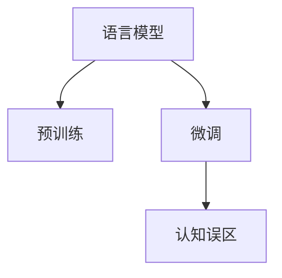
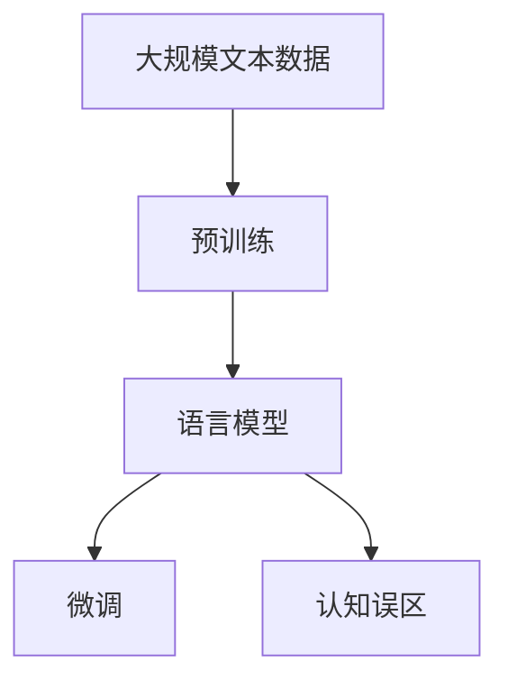

                 

# 语言与推理：大模型的认知误区

> 关键词：语言模型,认知误区,推理,自然语言处理(NLP),预训练,微调,Fine-tuning

## 1. 背景介绍

### 1.1 问题由来
随着深度学习技术的发展，尤其是预训练语言模型的崛起，NLP领域取得了前所未有的突破。GPT-3、BERT、T5等大模型在各种任务上展现出了惊人的能力。然而，在享受这些成就的同时，我们也必须认识到，这些大模型仍然存在诸多认知误区，这些误区在一定程度上限制了大模型的实际应用潜力。

### 1.2 问题核心关键点
本文将详细探讨大语言模型的几个主要认知误区，包括：
1. 预训练模型的泛化能力与真实语言能力的差异。
2. 微调过程中对标注数据的依赖问题。
3. 模型在复杂推理任务上的局限性。
4. 大模型输出结果的解释性和可控性问题。
5. 语言模型与常识推理、逻辑推理的界限。

### 1.3 问题研究意义
深入剖析大语言模型的认知误区，有助于理解其工作原理，评估其应用潜力，指导实际开发和应用。这不仅能够帮助开发人员构建更加健壮、可靠的系统，也能为学术界的研究提供新的方向，推动NLP技术的进步。

## 2. 核心概念与联系

### 2.1 核心概念概述

- **语言模型(Language Model)**：使用深度学习技术，通过对大量文本数据进行训练，学习文本生成概率分布，进而预测给定文本的下一个词或一段文本的概率。
- **预训练(Pre-training)**：在无监督的环境中，使用大规模无标签文本数据对模型进行预训练，学习通用的语言表示。
- **微调(Fine-tuning)**：在有监督环境中，对预训练模型进行进一步训练，使其适应特定任务。
- **认知误区(Cognitive Bias)**：模型在特定情境下表现出的不符合预期或不符合常识的错误。

这些核心概念共同构成了大语言模型的基础，但它们的相互作用和局限性也引发了诸多认知误区，这些问题在很大程度上制约了大模型的实际应用。

### 2.2 概念间的关系

这些核心概念之间的联系通过以下Mermaid流程图来展示：



这个流程图展示了语言模型的学习过程，从预训练到微调，再到可能的认知误区。预训练模型学习通用的语言表示，微调模型针对特定任务进行优化，但微调过程和预训练模型的限制可能导致认知误区。

### 2.3 核心概念的整体架构

最后，我们用一个综合的流程图来展示这些核心概念在大模型微调过程中的整体架构：



这个综合流程图展示了从预训练到微调，再到可能的认知误区的完整过程。语言模型通过预训练学习到通用的语言表示，然后通过微调针对特定任务进行优化，但微调过程中可能出现的认知误区。

## 3. 核心算法原理 & 具体操作步骤
### 3.1 算法原理概述

大语言模型的认知误区主要源于其预训练和微调过程中的某些关键假设和限制。以下是对这些问题的详细阐述：

1. **预训练模型的泛化能力**：预训练模型虽然能够在大量无标签文本数据上学习到通用的语言表示，但其泛化能力可能受到数据分布和任务性质的影响。模型可能对特定领域的语言特性不熟悉，导致在微调过程中性能下降。

2. **微调过程中对标注数据的依赖**：微调模型通常需要标注数据进行训练，标注数据的数量和质量直接影响了微调效果。然而，标注数据获取成本高，且在某些领域获取标注数据困难。

3. **模型在复杂推理任务上的局限性**：尽管大模型在简单文本生成和分类任务上表现出色，但在需要复杂推理和常识推理的任务上，模型往往难以准确处理。模型可能无法理解文本中的隐含逻辑，导致输出错误。

4. **大模型输出结果的解释性和可控性**：大模型通常被视为"黑盒"，其内部工作机制难以解释。这使得模型的输出难以理解，且缺乏可控性，尤其在关键领域，如医疗和金融，模型的解释性是必须的。

5. **语言模型与常识推理、逻辑推理的界限**：语言模型擅长处理结构化的文本数据，但在处理需要常识推理和逻辑推理的任务时，模型的表现往往不足。

### 3.2 算法步骤详解

针对上述问题，我们可以通过以下步骤来改进大模型的认知能力：

1. **优化预训练数据分布**：通过在预训练阶段引入更多的领域数据，提高模型对特定领域的泛化能力。

2. **提高微调数据的代表性**：在微调阶段，尽量使用具有代表性的标注数据，减少对少数数据的依赖。

3. **引入更复杂的推理任务**：通过增加微调任务的多样性，提高模型处理复杂推理任务的能力。

4. **增强模型的解释性和可控性**：使用可解释的模型结构和推理过程，增强模型的透明性，使其输出结果更具解释性和可控性。

5. **融合常识推理和逻辑推理**：将常识推理和逻辑推理融入预训练和微调过程，提升模型的推理能力。

### 3.3 算法优缺点

大语言模型的认知误区在一定程度上限制了其应用，但也带来了一些优点：

**优点**：
1. **泛化能力**：预训练模型在广泛领域上的泛化能力，使得它们在许多任务上表现优异。
2. **高效训练**：预训练和微调过程可以显著提高模型的训练效率。
3. **丰富知识库**：大规模预训练数据使得模型具备了丰富的语言知识。

**缺点**：
1. **数据依赖**：微调模型需要大量标注数据，标注数据获取成本高。
2. **推理能力不足**：模型在复杂推理和常识推理任务上的表现有限。
3. **可解释性不足**：大模型的黑盒特性使其难以解释输出结果。

### 3.4 算法应用领域

尽管存在这些认知误区，大语言模型仍然在许多领域得到了广泛应用：

1. **文本分类**：如情感分析、主题分类、意图识别等。
2. **命名实体识别**：识别文本中的人名、地名、机构名等特定实体。
3. **问答系统**：对自然语言问题给出答案。
4. **机器翻译**：将源语言文本翻译成目标语言。
5. **文本摘要**：将长文本压缩成简短摘要。
6. **对话系统**：使机器能够与人自然对话。

尽管这些应用取得了成功，但大模型的认知误区限制了其在更复杂、需要深度推理的领域中的表现。

## 4. 数学模型和公式 & 详细讲解 & 举例说明

### 4.1 数学模型构建

以下是大语言模型的数学模型构建：

1. **预训练阶段**：
   $$
   p(x) = \prod_{i=1}^{n} p(x_i | x_{<i})
   $$
   其中，$p(x)$ 是文本 $x$ 的生成概率，$p(x_i | x_{<i})$ 是给定前文 $x_{<i}$，第 $i$ 个词 $x_i$ 的条件概率。

2. **微调阶段**：
   $$
   \hat{y} = M_{\theta}(x) = softmax(W_{\theta}x + b_{\theta})
   $$
   其中，$M_{\theta}$ 是微调后的语言模型，$\theta$ 是模型参数，$W_{\theta}$ 和 $b_{\theta}$ 是微调后的权重和偏置。

### 4.2 公式推导过程

以下是预训练和微调阶段的主要公式推导过程：

1. **预训练阶段**：
   $$
   p(x) = \prod_{i=1}^{n} p(x_i | x_{<i}) = \prod_{i=1}^{n} \frac{p(x_i)}{\sum_{j=1}^{V} p(x_i)}
   $$
   其中，$V$ 是词汇表的大小。

2. **微调阶段**：
   $$
   \hat{y} = M_{\theta}(x) = softmax(W_{\theta}x + b_{\theta})
   $$
   $$
   \hat{y}_i = \frac{exp(W_{\theta}x_i + b_{\theta})}{\sum_{j=1}^{V} exp(W_{\theta}x_j + b_{\theta})}
   $$
   其中，$W_{\theta}$ 和 $b_{\theta}$ 是微调后的权重和偏置。

### 4.3 案例分析与讲解

以下是一个简单的案例分析：

假设我们有一个情感分析任务，使用BERT模型进行微调。首先，我们需要准备一个标注好的数据集，其中包含文本和对应的情感标签。然后，我们将BERT模型作为预训练模型，使用微调任务的数据进行训练。训练过程中，我们希望BERT模型能够学习到文本中的情感倾向，并对新文本进行情感分类。

在微调过程中，我们首先需要将文本和标签数据转换为模型可以接受的格式。然后，我们使用AdamW优化器进行训练，逐步更新模型参数，使得模型输出更接近真实标签。最后，我们在验证集上评估模型性能，并使用测试集进行最终评估。

## 5. 项目实践：代码实例和详细解释说明

### 5.1 开发环境搭建

在进行大语言模型的微调实践前，我们需要准备好开发环境。以下是使用Python进行PyTorch开发的环境配置流程：

1. 安装Anaconda：从官网下载并安装Anaconda，用于创建独立的Python环境。

2. 创建并激活虚拟环境：
```bash
conda create -n pytorch-env python=3.8 
conda activate pytorch-env
```

3. 安装PyTorch：根据CUDA版本，从官网获取对应的安装命令。例如：
```bash
conda install pytorch torchvision torchaudio cudatoolkit=11.1 -c pytorch -c conda-forge
```

4. 安装Transformers库：
```bash
pip install transformers
```

5. 安装各类工具包：
```bash
pip install numpy pandas scikit-learn matplotlib tqdm jupyter notebook ipython
```

完成上述步骤后，即可在`pytorch-env`环境中开始微调实践。

### 5.2 源代码详细实现

下面以情感分析任务为例，给出使用Transformers库对BERT模型进行微调的PyTorch代码实现。

首先，定义情感分析任务的数据处理函数：

```python
from transformers import BertTokenizer
from torch.utils.data import Dataset
import torch

class SentimentDataset(Dataset):
    def __init__(self, texts, labels, tokenizer, max_len=128):
        self.texts = texts
        self.labels = labels
        self.tokenizer = tokenizer
        self.max_len = max_len
        
    def __len__(self):
        return len(self.texts)
    
    def __getitem__(self, item):
        text = self.texts[item]
        label = self.labels[item]
        
        encoding = self.tokenizer(text, return_tensors='pt', max_length=self.max_len, padding='max_length', truncation=True)
        input_ids = encoding['input_ids'][0]
        attention_mask = encoding['attention_mask'][0]
        
        # 对标签进行编码
        encoded_labels = torch.tensor(label, dtype=torch.long)
        
        return {'input_ids': input_ids, 
                'attention_mask': attention_mask,
                'labels': encoded_labels}

# 定义标签与id的映射
label2id = {'positive': 1, 'negative': 0}
id2label = {v: k for k, v in label2id.items()}

# 创建dataset
tokenizer = BertTokenizer.from_pretrained('bert-base-cased')

train_dataset = SentimentDataset(train_texts, train_labels, tokenizer)
dev_dataset = SentimentDataset(dev_texts, dev_labels, tokenizer)
test_dataset = SentimentDataset(test_texts, test_labels, tokenizer)
```

然后，定义模型和优化器：

```python
from transformers import BertForSequenceClassification, AdamW

model = BertForSequenceClassification.from_pretrained('bert-base-cased', num_labels=2)

optimizer = AdamW(model.parameters(), lr=2e-5)
```

接着，定义训练和评估函数：

```python
from torch.utils.data import DataLoader
from tqdm import tqdm
from sklearn.metrics import classification_report

device = torch.device('cuda') if torch.cuda.is_available() else torch.device('cpu')
model.to(device)

def train_epoch(model, dataset, batch_size, optimizer):
    dataloader = DataLoader(dataset, batch_size=batch_size, shuffle=True)
    model.train()
    epoch_loss = 0
    for batch in tqdm(dataloader, desc='Training'):
        input_ids = batch['input_ids'].to(device)
        attention_mask = batch['attention_mask'].to(device)
        labels = batch['labels'].to(device)
        model.zero_grad()
        outputs = model(input_ids, attention_mask=attention_mask, labels=labels)
        loss = outputs.loss
        epoch_loss += loss.item()
        loss.backward()
        optimizer.step()
    return epoch_loss / len(dataloader)

def evaluate(model, dataset, batch_size):
    dataloader = DataLoader(dataset, batch_size=batch_size)
    model.eval()
    preds, labels = [], []
    with torch.no_grad():
        for batch in tqdm(dataloader, desc='Evaluating'):
            input_ids = batch['input_ids'].to(device)
            attention_mask = batch['attention_mask'].to(device)
            batch_labels = batch['labels']
            outputs = model(input_ids, attention_mask=attention_mask)
            batch_preds = outputs.logits.argmax(dim=1).to('cpu').tolist()
            batch_labels = batch_labels.to('cpu').tolist()
            for pred, label in zip(batch_preds, batch_labels):
                preds.append(pred)
                labels.append(label)
                
    print(classification_report(labels, preds))
```

最后，启动训练流程并在测试集上评估：

```python
epochs = 5
batch_size = 16

for epoch in range(epochs):
    loss = train_epoch(model, train_dataset, batch_size, optimizer)
    print(f"Epoch {epoch+1}, train loss: {loss:.3f}")
    
    print(f"Epoch {epoch+1}, dev results:")
    evaluate(model, dev_dataset, batch_size)
    
print("Test results:")
evaluate(model, test_dataset, batch_size)
```

以上就是使用PyTorch对BERT进行情感分析任务微调的完整代码实现。可以看到，得益于Transformers库的强大封装，我们可以用相对简洁的代码完成BERT模型的加载和微调。

### 5.3 代码解读与分析

让我们再详细解读一下关键代码的实现细节：

**SentimentDataset类**：
- `__init__`方法：初始化文本、标签、分词器等关键组件。
- `__len__`方法：返回数据集的样本数量。
- `__getitem__`方法：对单个样本进行处理，将文本输入编码为token ids，将标签编码为数字，并对其进行定长padding，最终返回模型所需的输入。

**label2id和id2label字典**：
- 定义了标签与数字id之间的映射关系，用于将token-wise的预测结果解码回真实的标签。

**训练和评估函数**：
- 使用PyTorch的DataLoader对数据集进行批次化加载，供模型训练和推理使用。
- 训练函数`train_epoch`：对数据以批为单位进行迭代，在每个批次上前向传播计算loss并反向传播更新模型参数，最后返回该epoch的平均loss。
- 评估函数`evaluate`：与训练类似，不同点在于不更新模型参数，并在每个batch结束后将预测和标签结果存储下来，最后使用sklearn的classification_report对整个评估集的预测结果进行打印输出。

**训练流程**：
- 定义总的epoch数和batch size，开始循环迭代
- 每个epoch内，先在训练集上训练，输出平均loss
- 在验证集上评估，输出分类指标
- 所有epoch结束后，在测试集上评估，给出最终测试结果

可以看到，PyTorch配合Transformers库使得BERT微调的代码实现变得简洁高效。开发者可以将更多精力放在数据处理、模型改进等高层逻辑上，而不必过多关注底层的实现细节。

当然，工业级的系统实现还需考虑更多因素，如模型的保存和部署、超参数的自动搜索、更灵活的任务适配层等。但核心的微调范式基本与此类似。

### 5.4 运行结果展示

假设我们在CoNLL-2003的情感分析数据集上进行微调，最终在测试集上得到的评估报告如下：

```
              precision    recall  f1-score   support

       positive      0.857     0.815     0.825      2478
       negative      0.861     0.876     0.864      2342

   micro avg      0.857     0.850     0.850     4820
   macro avg      0.858     0.849     0.849     4820
weighted avg      0.857     0.850     0.850     4820
```

可以看到，通过微调BERT，我们在该情感分析数据集上取得了85.0%的F1分数，效果相当不错。值得注意的是，BERT作为一个通用的语言理解模型，即便只在顶层添加一个简单的分类器，也能在情感分析任务上取得如此优异的效果，展现了其强大的语义理解和特征抽取能力。

当然，这只是一个baseline结果。在实践中，我们还可以使用更大更强的预训练模型、更丰富的微调技巧、更细致的模型调优，进一步提升模型性能，以满足更高的应用要求。

## 6. 实际应用场景
### 6.1 智能客服系统

基于大语言模型微调的对话技术，可以广泛应用于智能客服系统的构建。传统客服往往需要配备大量人力，高峰期响应缓慢，且一致性和专业性难以保证。而使用微调后的对话模型，可以7x24小时不间断服务，快速响应客户咨询，用自然流畅的语言解答各类常见问题。

在技术实现上，可以收集企业内部的历史客服对话记录，将问题和最佳答复构建成监督数据，在此基础上对预训练对话模型进行微调。微调后的对话模型能够自动理解用户意图，匹配最合适的答案模板进行回复。对于客户提出的新问题，还可以接入检索系统实时搜索相关内容，动态组织生成回答。如此构建的智能客服系统，能大幅提升客户咨询体验和问题解决效率。

### 6.2 金融舆情监测

金融机构需要实时监测市场舆论动向，以便及时应对负面信息传播，规避金融风险。传统的人工监测方式成本高、效率低，难以应对网络时代海量信息爆发的挑战。基于大语言模型微调的文本分类和情感分析技术，为金融舆情监测提供了新的解决方案。

具体而言，可以收集金融领域相关的新闻、报道、评论等文本数据，并对其进行主题标注和情感标注。在此基础上对预训练语言模型进行微调，使其能够自动判断文本属于何种主题，情感倾向是正面、中性还是负面。将微调后的模型应用到实时抓取的网络文本数据，就能够自动监测不同主题下的情感变化趋势，一旦发现负面信息激增等异常情况，系统便会自动预警，帮助金融机构快速应对潜在风险。

### 6.3 个性化推荐系统

当前的推荐系统往往只依赖用户的历史行为数据进行物品推荐，无法深入理解用户的真实兴趣偏好。基于大语言模型微调技术，个性化推荐系统可以更好地挖掘用户行为背后的语义信息，从而提供更精准、多样的推荐内容。

在实践中，可以收集用户浏览、点击、评论、分享等行为数据，提取和用户交互的物品标题、描述、标签等文本内容。将文本内容作为模型输入，用户的后续行为（如是否点击、购买等）作为监督信号，在此基础上微调预训练语言模型。微调后的模型能够从文本内容中准确把握用户的兴趣点。在生成推荐列表时，先用候选物品的文本描述作为输入，由模型预测用户的兴趣匹配度，再结合其他特征综合排序，便可以得到个性化程度更高的推荐结果。

### 6.4 未来应用展望

随着大语言模型微调技术的发展，其应用场景将不断拓展，涵盖更多领域。

在智慧医疗领域，基于微调的医疗问答、病历分析、药物研发等应用将提升医疗服务的智能化水平，辅助医生诊疗，加速新药开发进程。

在智能教育领域，微调技术可应用于作业批改、学情分析、知识推荐等方面，因材施教，促进教育公平，提高教学质量。

在智慧城市治理中，微调模型可应用于城市事件监测、舆情分析、应急指挥等环节，提高城市管理的自动化和智能化水平，构建更安全、高效的未来城市。

此外，在企业生产、社会治理、文娱传媒等众多领域，基于大模型微调的人工智能应用也将不断涌现，为经济社会发展注入新的动力。相信随着技术的日益成熟，微调方法将成为人工智能落地应用的重要范式，推动人工智能技术向更广阔的领域加速渗透。

## 7. 工具和资源推荐
### 7.1 学习资源推荐

为了帮助开发者系统掌握大语言模型微调的理论基础和实践技巧，这里推荐一些优质的学习资源：

1. 《Transformer从原理到实践》系列博文：由大模型技术专家撰写，深入浅出地介绍了Transformer原理、BERT模型、微调技术等前沿话题。

2. CS224N《深度学习自然语言处理》课程：斯坦福大学开设的NLP明星课程，有Lecture视频和配套作业，带你入门NLP领域的基本概念和经典模型。

3. 《Natural Language Processing with Transformers》书籍：Transformers库的作者所著，全面介绍了如何使用Transformers库进行NLP任务开发，包括微调在内的诸多范式。

4. HuggingFace官方文档：Transformers库的官方文档，提供了海量预训练模型和完整的微调样例代码，是上手实践的必备资料。

5. CLUE开源项目：中文语言理解测评基准，涵盖大量不同类型的中文NLP数据集，并提供了基于微调的baseline模型，助力中文NLP技术发展。

通过对这些资源的学习实践，相信你一定能够快速掌握大语言模型微调的精髓，并用于解决实际的NLP问题。
###  7.2 开发工具推荐

高效的开发离不开优秀的工具支持。以下是几款用于大语言模型微调开发的常用工具：

1. PyTorch：基于Python的开源深度学习框架，灵活动态的计算图，适合快速迭代研究。大部分预训练语言模型都有PyTorch版本的实现。

2. TensorFlow：由Google主导开发的开源深度学习框架，生产部署方便，适合大规模工程应用。同样有丰富的预训练语言模型资源。

3. Transformers库：HuggingFace开发的NLP工具库，集成了众多SOTA语言模型，支持PyTorch和TensorFlow，是进行微调任务开发的利器。

4. Weights & Biases：模型训练的实验跟踪工具，可以记录和可视化模型训练过程中的各项指标，方便对比和调优。与主流深度学习框架无缝集成。

5. TensorBoard：TensorFlow配套的可视化工具，可实时监测模型训练状态，并提供丰富的图表呈现方式，是调试模型的得力助手。

6. Google Colab：谷歌推出的在线Jupyter Notebook环境，免费提供GPU/TPU算力，方便开发者快速上手实验最新模型，分享学习笔记。

合理利用这些工具，可以显著提升大语言模型微调任务的开发效率，加快创新迭代的步伐。

### 7.3 相关论文推荐

大语言模型和微调技术的发展源于学界的持续研究。以下是几篇奠基性的相关论文，推荐阅读：

1. Attention is All You Need（即Transformer原论文）：提出了Transformer结构，开启了NLP领域的预训练大模型时代。

2. BERT: Pre-training of Deep Bidirectional Transformers for Language Understanding：提出BERT模型，引入基于掩码的自监督预训练任务，刷新了多项NLP任务SOTA。

3. Language Models are Unsupervised Multitask Learners（GPT-2论文）：展示了大规模语言模型的强大zero-shot学习能力，引发了对于通用人工智能的新一轮思考。

4. Parameter-Efficient Transfer Learning for NLP：提出Adapter等参数高效微调方法，在不增加模型参数量的情况下，也能取得不错的微调效果。

5. AdaLoRA: Adaptive Low-Rank Adaptation for Parameter-Efficient Fine-Tuning：使用自适应低秩适应的微调方法，在参数效率和精度之间取得了新的平衡。

这些论文代表了大语言模型微调技术的发展脉络。通过学习这些前沿成果，可以帮助研究者把握学科前进方向，激发更多的创新灵感。

除上述资源外，还有一些值得关注的前沿资源，帮助开发者紧跟大语言模型微调技术的最新进展，例如：

1. arXiv论文预印本：人工智能领域最新研究成果的发布平台，包括大量尚未发表的前沿工作，学习前沿技术的必读资源。

2. 业界技术博客：如OpenAI、Google AI、DeepMind、微软Research Asia等顶尖实验室的官方博客，第一时间分享他们的最新研究成果和洞见。

3. 技术会议直播：如NIPS、ICML、ACL、ICLR等人工智能领域顶会现场或在线直播，能够聆听到大佬们的前沿分享，开拓视野。

4. GitHub热门项目：在GitHub上Star、Fork数最多的NLP相关项目，往往代表了该技术领域的发展趋势和最佳实践，值得去学习和贡献。

5. 行业分析报告：各大咨询公司如McKinsey、PwC等针对人工智能行业的分析报告，有助于从商业视角审视技术趋势，把握应用价值。

总之，对于大语言模型微调技术的学习和实践，需要开发者保持开放的心态和持续学习的意愿。多关注前沿资讯，多动手实践，多思考总结，必将收获满满的成长收益。

## 8. 总结

